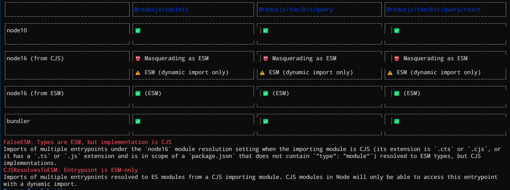

# Опыт модернизации пакетов в ESM

Подробности о болезненном опыте и извлеченных уроках, которые я получил, перенося пакеты Redux на ESM.

## Введение

В течение последних 8 с лишним лет экосистема JS медленно переходила к использованию ES-модулей ("ESM") в качестве стандартного подхода к публикации и использованию JS-кода. Подобно переходу Python 2-->3, это было невероятно сложно и болезненно.

Как сопровождающий пакетов, я хочу быть уверен, что мои библиотеки максимально совместимы и пригодны для использования в самом широком спектре сред, которые я могу поддерживать. К сожалению, это также означает, что мне пришлось познакомиться с нюансами и особенностями поведения различных инструментов сборки и сред выполнения.

В начале этого года я начал работать над попыткой обновить формат пакетов для библиотек семейства [Redux](../libs/redux/index.md), чтобы обеспечить им "полную совместимость с ESM". Мне кажется, что я наконец-то придумал набор конфигураций, которые, похоже, работают достаточно хорошо, но это было непросто.

Одно из моих самых больших разочарований - отсутствие единого авторитетного и исчерпывающего руководства "Как правильно опубликовать JS-пакет". Я неоднократно умолял какого-нибудь эксперта, который действительно знает, что делает, написать и опубликовать такое руководство. В идеале оно должно охватывать такие вопросы, как форматы файлов, как настроить взаимодействие ESM/CJS и `package.exports`, как работать с версиями типов TS, как обеспечить шейпинг дерева, как проверить совместимость, как правильно поддерживать конкретные инструменты сборки и что они ищут, и так далее. Мне удалось найти несколько руководств (ссылки на которые я приведу ниже), но ничего, что соответствовало бы желаемой широте и содержанию.

**Этот пост не является таким "авторитетным руководством".** Это краткое изложение того, что я пробовал, и тех уроков, которые я извлек на этом пути. Судя по тому, сколько раз люди приходили и говорили: "Ты делаешь это неправильно", я уверен, что я еще много чего не понял. Но я надеюсь, что эта информация будет полезной и познавательной, даже если она не будет полностью исчерпывающей и авторитетной.

Существует множество статей, описывающих историю создания спецификации ESM, аргументы и решения, которые привели к нынешней путанице и проблемам совместимости, и как мы попали в эту неразбериху. В целях сохранения объема статьи я постараюсь найти ссылки на некоторые из них и перечислить их в конце, а сам сосредоточусь на собственном опыте и шагах, предпринятых в ходе этого процесса.

## Экосистема пакетов Redux

### Пакеты и конфигурации

В конце 2022 года я поддерживал и публиковал эти пакеты как часть Redux org:

-   `redux@4.2.x`
-   `react-redux@8.0.x`
-   `redux-thunk@2.4.x`
-   `reselect@4.1.x`
-   `@reduxjs/toolkit@1.9.x`

Каждый из этих пакетов имеет свою историю развития, настройку упаковки и конфигурацию сборки. В общем случае:

-   Все пакеты включали артефакты сборки ESM, CJS и UMD (с различными комбинациями встроенных значений `process.env.NODE_ENV`, либо предварительно скомпилированные до `"development"` или `"production"` версий).
-   Все артефакты сборки использовали расширение `.js`.
-   Все пакеты переводились на синтаксис ES5 для совместимости с IE11
-   `redux`, `react-redux`, `redux-thunk` и `reselect` транспилировались с помощью Babel и поставлялись в комплекте с Rollup. RTK был собран с помощью собственного скрипта-обертки ESBuild, который выполнял упаковку и первичную транспиляцию, а также использовал tsc для понижения ES2015 кода до ES5.
-   Все пакеты использовали поля `"main"`, `"module"` и `"types"` в файле `package.json`. Ни один из пакетов не использовал относительно новое поле `"exports"` для определения загружаемых артефактов сборки.
-   Большинство пакетов, за исключением RTK, выводят артефакты сборки в различные папки по типу: `dist` для UMD, `lib` для CJS, `es` для ESM.

Некоторые примеры из этих файлов `package.json`:

```json
{
    "name": "redux",
    "version": "4.2.1",
    "main": "lib/redux.js",
    "unpkg": "dist/redux.js",
    "module": "es/redux.js",
    "typings": "./index.d.ts",
    "files": ["dist", "lib", "es", "src", "index.d.ts"]
}
```

---

```json
{
    "name": "react-redux",
    "version": "8.0.5",
    "main": "./lib/index.js",
    "types": "./es/index.d.ts",
    "unpkg": "dist/react-redux.js",
    "module": "es/index.js",
    "files": ["dist", "lib", "src", "es"]
}
```

---

```json
{
    "name": "@reduxjs/toolkit",
    "version": "1.9.5",
    "main": "dist/index.js",
    "module": "dist/redux-toolkit.esm.js",
    "unpkg": "dist/redux-toolkit.umd.min.js",
    "types": "dist/index.d.ts",
    "files": [
        "dist/**/*.js",
        "dist/**/*.js.map",
        "dist/**/*.d.ts",
        "dist/**/package.json",
        "src/",
        "query"
    ]
}
```

Настройка RTK оказалась более сложной, поскольку она имеет 3 отдельные точки входа: `@reduxjs/toolkit`, `@reduxjs/toolkit/query` и `@reduxjs/toolkit/query/react`. Обратите внимание, что в файле `package.json` RTK не было указано двух точек входа RTKQ. Вместо этого в опубликованном пакете была фактическая папка `/query`, содержащая файлы `/query/package.json` и `/query/react/package.json`, которые, в свою очередь, указывали на нужные артефакты в папке dist. (Эта настройка была результатом значительных экспериментов, а также "кажется, это работает с Webpack и еще парой инструментов, я думаю???").

Хотя это и не имеет прямого отношения к дальнейшему изложению, я хотел бы отметить два очень полезных инструмента, которые я использую в процессе публикации:

-   [release-it](https://github.com/release-it/release-it): автоматизирует фактические шаги по публикации в NPM, включая Git-тегирование и проталкивание
-   [yalc](https://www.npmjs.com/package/yalc): позволяет выполнить полную локальную "публикацию" пакета, чтобы можно было протестировать его установку в примеры проектов. Позволяет избежать проблем с симлинками (т.е. `npm link`), а также протестировать реальные шаги сборки и публикации.

### История проблемы

В середине 2021 года мы получили сообщение о том, что [RTK не может быть корректно загружен одновременно в клиентский и серверный код](https://github.com/reduxjs/redux-toolkit/issues/1396). В начале 2022 года в аналогичной проблеме сообщалось, что [RTK не может быть корректно импортирован в ESM-файл `.mjs`](https://github.com/reduxjs/redux-toolkit/issues/1960) из-за использования поля `"module"`, но отсутствия поля `"exports"` в `package.json`. Наконец, в другом вопросе было отмечено, что [RTK не работает с новой опцией TypeScript `moduleResolution: "node16"`](https://github.com/reduxjs/redux-toolkit/issues/2485).

Я уже спрашивал о последствиях добавления `"exports"` в пакет, и мне ответили, что "это квалифицируется как разрушающее изменение". Это означало, что я не могу приступить к рассмотрению этого вопроса до следующего крупного релиза для каждого из пакетов. Но я не имел ни малейшего представления о том, когда мы сможем опубликовать мажорные версии. Redux 4.0 вышел в 2018 году, RTK 1.0 - в конце 2019 года. React-Redux 8.0 появился совсем недавно, в середине 2022 года.

Ядро Redux было фактически переведено на TS в 2019 году, но мы так и не отправили его. Версия 4.x с ее рукописными типизациями работала, и мы опасались потенциальной перестройки экосистемы в связи с выпуском мажора 5.0. Кроме того, у нас было много работы над функциями RTK.

В ноябре 2022 года мы выпустили RTK 1.9. После двухмесячного перерыва я наконец-то сел за стол и начал серьезно работать над модернизацией наших пакетов.

## Первые попытки

Последние несколько лет я накапливал список вкладок и статей, посвященных "публикации современного JS", ESM и взаимодействию ESM/CJS, зная, что этот день рано или поздно наступит. (На момент последней проверки в этом списке было около 175 статей!).

Я просмотрел несколько из этих статей, чтобы определить свои первые шаги. Из всего прочитанного я сделал следующие выводы:

-   Мне нужно добавить `"type": "module"` в файлы `package.json`, чтобы Node и бандлеры определили, что пакет содержит ESM-файлы.
-   Также нужно было добавить ключ `"exports"` в `package.json` и добавить в него ключи, перечисляющие возможные точки входа и артефакты сборки, которые нужно использовать при импорте в различные окружения.

Я встречал упоминания об использовании `.mjs` в качестве расширения файла, чтобы заставить Node распознать данный файл как ES-модуль. Честно говоря, мне казалось, что это выглядит уродливо и нелепо, и я совсем не хотел использовать это расширение.

Моей первой попыткой был [RTK PR #3095: Migrate the RTK package to be full ESM](https://github.com/reduxjs/redux-toolkit/pull/3095). Согласно моему описанию PR, он содержал следующие изменения:

!!!note ""

    В данном PR сделана попытка преобразовать пакет RTK из существующего "содержит модули ESM и CJS, но не полностью ESM" в полностью ESM с `{type: "module"}` и сохранить поддержку CJS:

    -   BREAKING: Устанавливает для основного файла RTK `package.json` значение `{type: "module"}`.
    -   BREAKING: Обновляет все начальные файлы `package.json`, чтобы использовать `exports` для указания на типы, ESM-файл и CJS-файл.
    	-   Я все еще оставляю `main` и `module`, потому что КТО ЗНАЕТ, ПОЧЕМУ ОНИ ЕЩЕ ИСПОЛЬЗУЮТСЯ В НЕКОТОРЫХ ИНСТРУМЕНТАХ ИЛИ НЕТ 🤷‍♂️.
    -   Обновлен скрипт сборки:
    	-   Исправлена совместимость с ESM при выполнении путем замены использования `__dirname` и исправления импорта Terser
    	-   Переключены все цели сборки на `"esnext"`, чтобы гарантировать, что вывод будет нетронутым, кроме TS-транспиляции
    	-   Перемещены все артефакты сборки CJS для вложения на один уровень глубже в каждую точку входа в папку `./cjs/`, т.е. `./dist/query/cjs/`.
    	-   Добавлен пакет `{type: "commonjs"}` файлы пакетов в эти папки.
    	-   Отключили на время артефакты сборки UMD

Полученный `package.json` выглядел следующим образом:

```json
{
    "name": "@reduxjs/toolkit",
    "version": "2.0.0-alpha.1",
    "type": "module",
    "module": "dist/redux-toolkit.modern.js",
    "main": "dist/cjs/index.js",
    "types": "dist/index.d.ts",
    "exports": {
        "./package.json": "./package.json",
        ".": {
            "types": "./dist/index.d.ts",
            "import": "./dist/redux-toolkit.modern.js",
            "default": "./dist/cjs/index.js"
        },
        "./query": {
            "types": "./dist/query/index.d.ts",
            "import": "./dist/query/rtk-query.modern.js",
            "default": "./dist/query/cjs/index.js"
        },
        "./query/react": {
            "types": "./dist/query/react/index.d.ts",
            "import": "./dist/query/react/rtk-query-react.modern.js",
            "default": "./dist/query/react/cjs/index.js"
        }
    }
}
```

Я попробовал протестировать локальные сборки в Vite, CRA4/5, Next и Node, а также запустил инструмент `publint`. Казалось, что локально всё работает, поэтому я разместил PR, чтобы посмотреть, что произойдёт с CI.

**И ВСЁ ВЗОРВАЛОСЬ!!!! 💣💣💣**

Я потратил еще несколько часов на то, чтобы разобраться с этим, и сообщил о своих результатах:

!!!note ""

    Что ж. Хорошая новость - я думаю, что код runtime работает.

    Плохая новость - Jest доставляет неудобства. В частности, что-то в способе импорта `redux-thunk` делает импорт по умолчанию объекта типа `{default}`, который не является функцией промежуточного ПО, и поэтому тесты взрываются, когда мы пытаемся создать хранилище.

    Последние пару часов я потратил на то, чтобы разобраться с экспортом thunk и переиздать его локально. Переключение пакета thunk на отсутствие экспорта по умолчанию вроде как помогло, но теперь что-то с тестом "no dev middleware in prod" не получается.

    В общем, близко, но пока даже не могу собрать эту ветку.

    **edit**

    На чём я остановился вчера, так это на том, что:

    -   `redux-thunk` имеет экспорт по умолчанию, и Jest теперь задыхался от этого.
    -   Я опубликовал `redux-thunk@3.0.0-alpha`, который попытался преобразовать в ESM, но в нем все равно был включен экспорт по умолчанию. Это помогло при сборке в Next, но не в наших локальных тестах Jest.
    -   Затем я опубликовал `redux-thunk` только для локальной сети, отказавшись от экспорта по умолчанию и включив только именованные экспорты. Это вроде бы помогло, но один из наших RTK-тестов, утверждающий поведение `NODE_ENV=production` для `getDefaultMiddleware`, стал ломаться.

    Некоторые участники Reactiflux предположили, что, возможно, стоит рассмотреть возможность перехода на Vitest. Я бы предпочел по возможности этого не делать, поскольку переход на другой тест-раннер не является моим приоритетом или тем, на что я хочу тратить время. С другой стороны, это может быть полезно как в целом, так и для данной конкретной проблемы.

## Переход на Vitest

Мне очень не хотелось тратить время на перенос всей нашей тестовой системы с Jest на Vitest. Но я слышал много положительных отзывов о Vitest, в том числе о том, что он работает значительно быстрее и имеет лучшую поддержку ESM.

Через несколько дней я решил попробовать. К моему приятному удивлению, конвертация оказалась довольно простой.

В итоге я получил [RTK PR #3102: Migrate RTK test suite from Jest to Vitest](https://github.com/reduxjs/redux-toolkit/pull/3102).

Основная настройка тестов имеет смысл, а замена `jest.fn()` --> `vi.fn()` была простой. Самая большая проблема, с которой я столкнулся, - это попытка подружиться с пакетом `redux`, чтобы подтвердить, что `configureStore` обращается к основной библиотеке. Пришлось долго возиться с `vi.mock()`, пока, наконец, что-то не заработало. С другой стороны, поведение таймера стало работать более стабильно.

В ходе этого процесса мне также пришлось преобразовать другие вспомогательные файлы в репозитории к синтаксису ESM, например, конфигурационные файлы Jest и скрипты сборки с расширением `.js`.

Мне удалось провести этот PR и слить его через пару дней.

## Начальное альфа-тестирование

21 января я опубликовал `@reduxjs/toolkit@2.0.0-alpha.1`. Она включала в себя изменения в упаковке RTK, а также аналогичное изменение в `redux-thunk`, модернизировала артефакты сборки, отказавшись от транспиляции синтаксиса JS и отказавшись от совместимости с IE11.

Конечно, все это сработало не так хорошо, как я надеялся :)

Матеуш Буржиньский ( [@andaristrake](https://twitter.com/andaristrake) ) поддерживает несколько библиотек, включая Emotion и Preconstruct, и проводит большую часть своего времени, работая над компилятором TypeScript для развлечения. Он является экспертом по многим сложным нюансам форматирования упаковки.

Когда я анонсировал `alpha.2` в Twitter, [Матеуш ответил несколькими предложениями по доработке](https://twitter.com/AndaristRake/status/1625781199724576768) (рассматривая альфы RTK 2.0 и Redux core 5.0):

!!!note ""

    неизвестно, что такое `dist/es/redux.mjs`, если его даже нет в карте экспортов

    при таком использовании условия types TS может всегда считать, что это модуль, даже если он загружен/требуется из CJS target~. Поскольку у вас нет экспорта по умолчанию... это, вероятно, нормально.

    Я бы включил условие модуля и указал в нем `./dist/es/index.js`, это позволит пакету загружаться только один раз бандлерами, несмотря на формат потребляемого файла (`cjs` vs `esm`)

    избавиться от `process.env.NODE_ENV` в файлах дистрибутива, использовать условия разработки/производства для выполнения этих задач (возможно, лучше сделать производство по умолчанию, а разработку - по желанию)

Я сохранил их в качестве проблемы для справки.

Вскоре после этого мы получили один за другим несколько новых сообщений о проблемах с конфигом в `alpha.1/2`:

-   [RTK #3202: Cannot resolve types when moduleResolution is set to node16](https://github.com/reduxjs/redux-toolkit/issues/3202):

!!!note ""

    При импорте чего-либо из `@reduxjs/toolkit@2.0.0-alpha.2`, typescript не может разрешить типы, если `moduleResolution` в `tsconfig.json` установлен в `"node16"` или `"nodenext"`. Я обнаружил, что добавление расширения `.js` к импорту объявления решает эту проблему.

-   [RTK #3208: Invalid exports config for CJS consumption w/ Node](https://github.com/reduxjs/redux-toolkit/issues/3208):

!!!note ""

    Текущий конфиг в Alpha не позволяет использовать пакет CJS в современной версии Node/любом инструменте, который следует спецификации разрешения модулей Node, так как он использует `.js` для ссылки на модуль CJS, несмотря на установку пакета `"type": "module"`. Если `"type": "module"` установлен, то `.cjs` необходим в `"exports"`.

    Некоторые бандлеры обходят эту проблему и более снисходительны (хорошо это или нет - вопрос другой), но такая конфигурация не будет работать в Node и/или в других окружениях, использующих его механизм разрешения.

Я был... не в восторге:

!!!note ""

    Я искренне благодарен вам за то, что вы обратились с проблемой, но я также искренне злюсь на то, насколько запутанной является вся эта ситуация :(

    Я хочу поступать правильно по отношению к своим пользователям и поддерживать разнообразные инструменты и среды сборки, которые, как я предполагаю, они будут использовать для своих приложений.

    Но я не могу этого сделать, если каждая статья и каждый человек дают мне противоречивые инструкции о том, что я должен делать :(

Очевидно, что это потребует больших усилий, чтобы разобраться в происходящем и выявить возможные ошибки.

## Исследование лучшей конфигурации

Как раз в это же время [Девон Говетт написал в твиттере об улучшении поддержки Node+ESM в обновлении пакета React-Aria](https://twitter.com/devongovett/status/1629161014812897282).

Я ответил, отметив, что работаю над чем-то похожим, и пометил Матеуша. Вскоре после этого я увидел, что проблемы были зарегистрированы, связаны и скрежетали по ним, и Матеуш снова предложил удалить `type: "module"`.

Я был расстроен и умолял его опубликовать полную запись в блоге с подробным описанием его рекомендаций. Вместо этого он предложил позвонить по телефону и обсудить все напрямую.

27 февраля мы с Матеушем и Натаном Биремой (сопровождающим Redux DevTools) приняли участие в телефонном разговоре. Я сохранил записи обсуждения в gist:

-   [RTK ESM/TS Discussion: Mateusz Burzyński](https://gist.github.com/markerikson/42d55b0fd970449fc5d84263f4775cbd#file-rtk-esm-ts-notes-2023-02-27-md)

Матеуш высказал много мыслей о том, как можно использовать ESM и CJS, а также усомнился в том, что вообще имеет смысл поставлять ESM. В целом, информация была полезной, но я остался в замешательстве относительно дальнейших шагов.

Где-то в ходе этой дискуссии в Twitter я связался с [Andrew Branch](https://twitter.com/atcb) (@atcb), членом команды TypeScript, который реализовал новую опцию `moduleResolution: "bundler"` для TS, а также занимался работой над поведением модулей в экосистеме JS/TS в качестве подготовки к написанию. Мы назначили встречу на 28 февраля.

-   [RTK ESM/TS Discussion: Andrew Branch](https://gist.github.com/markerikson/42d55b0fd970449fc5d84263f4775cbd#file-tk-esm-ts-notes-2023-02-28-md)

Эндрю рассказал мне о том, как работает ESM, как TS относится к ESM и путям импорта модулей, и как Node и другие инструменты определяют, является ли файл действительно ESM.

TL;DR этой последней части примерно таков:

-   Если вы добавите `type: "module"`, то каждый файл с расширением `.js` будет интерпретироваться как ESM, и точка. Файлы `.cjs` будут интерпретироваться как CommonJS.
-   В качестве альтернативы, если у вас нет `type: "module"`, файлы `.js` будут интерпретироваться как CommonJS. Вы можете использовать `.mjs`, чтобы пометить отдельные файлы как ESM.

Также обсуждался вопрос о том, следует ли нам предварительно упаковывать наши типизаторы TS или оставить их в виде отдельных файлов `someSourceFile.d.ts` в опубликованном пакете.

## Настройка проверок CI для упаковки

### Начальная настройка CI

Я давно подозревал, что в конечном итоге мне придется собрать некую батарею примеров приложений, каждый из которых будет использовать различные инструменты сборки, чтобы отлавливать возможные ошибки в упаковке при PR CI проверках.

После появления сообщений о выпуске `alpha.2` я с неохотой пришел к выводу, что мне действительно необходимо потратить время на настройку этих CI-проверк, прежде чем приступать к работе над реальными конфигурациями пакетов.

В рамках начального тестирования я локально создал небольшой пример приложения, которое использовало все точки входа RTK. В нем был счетчик для выполнения `configureStore` и `createSlice` из ядра, конечная точка RTKQ `createApi`, не зависящая от пользовательского интерфейса, и конечная точка RTKQ `createApi`, специфичная для React. Я вставил это в несколько различных настроек проекта.

У нас уже был настроен CI на предварительную сборку тарбола с содержимым пакета из текущего PR, и мы использовали его для запуска наших юнит-тестов по версии PR-пакета вместо нашего исходного кода. Я решил расширить эту возможность и протестировать различные приложения на PR-сборке.

Я скопировал первые пару примеров проектов в новую папку `$REPO/examples/publish-ci/` и обновил рабочий процесс GH Action, чтобы матрично указать имена папок внутри `/publish-ci/`, установить PR-сборку в каждый пример, а затем собрать+тестировать ее:

-   [RTK PR #3213: Test published artifacts in CI](https://github.com/reduxjs/redux-toolkit/pull/3213)

Я также написал небольшой тест Playwright, который проверял содержимое страницы на предмет возможности изменения счетчика и того, что обе конечные точки API получали правильные имитационные данные, чтобы убедиться, что приложения действительно работают корректно.

На самом деле я направил PR на версию 1.9.x в нашей ветке `master`, чтобы сначала посмотреть, как все работает с существующим пакетом.

В итоге я получил примеры приложений, которые охватывают:

-   CRA 4 (с Webpack 4)
-   CRA 5 (с Webpack 5)
-   Next.js (с Webpack 5)
-   Vite 4
-   Node в режимах CJS и ESM.

Существует [множество других комбинаций инструментов сборки, которые, вероятно, следовало бы проверить](https://github.com/reduxjs/redux-toolkit/issues/3365), но это хорошее начало.

### Are The Types Wrong?

Где-то в процессе работы я обнаружил, что Эндрю Бранч создал инструмент под названием [Are The Types Wrong](https://arethetypeswrong.github.io/). Это сайт, позволяющий выбрать опубликованную версию пакета NPM или загрузить файл `.tgz`, и анализирующий экспорт пакетов, чтобы сообщить, как TypeScript интерпретирует конфигурацию и правильно ли совпадают типизации JS-файлов и TS. Затем он показывает все обнаруженные точки входа и сообщает подробности о любых несоответствиях и ошибках.

Вот пример отчета для RTK `2.0.0-alpha.2` ( [https://arethetypeswrong.github.io](https://arethetypeswrong.github.io/) ):


Видно, что он обнаружил все точки входа RTK, и что большинство комбинаций точка входа + `moduleResolution` выглядят нормально. Однако `moduleResolution: "node16"` + некоторое окружение CJS, очевидно, имеет множество проблем.

Мне очень хотелось использовать этот анализ в CI RTK, чтобы убедиться, что любые будущие PR-изменения действительно будут работать корректно. Я посмотрел на [репо `attw`](https://github.com/arethetypeswrong/arethetypeswrong.github.io) и заметил, что Эндрю разделил его на пакеты `core` и `website`. Но логика ядра еще не была опубликована в виде пакета.

Сначала я попробовал поставить задачу CI, которая клонировала бы репозиторий `attw` и позволяла написать сценарий командной строки, который импортировал бы логику ядра и анализировал артефакт сборки PR. Технически это работало, но, к счастью, мне удалось убедить Эндрю опубликовать логику в виде актуального пакета `@arethetypeswrong/core`.

После этого я создал [CLI-скрипт, который запускал основную логику `attw`, собирал отчеты и выводил их в виде консольной таблицы](https://github.com/reduxjs/redux-toolkit/blob/f31ff77ad01f6cdbdbbd4a701718ac8445e34b91/examples/publish-ci/are-the-types-wrong/main.tsx), чтобы они соответствовали отображению на сайте. Для этого я использовал встроенный рендерер React CLI (и, возможно, потратил слишком много времени на возиться с рендерингом таблиц в консоли). В итоге получился неплохой результат:



Затем я настроил CI RTK так, чтобы он вызывался в качестве еще одной проверки наряду со сборкой примеров приложений.

Была [существующая тема с просьбой attw добавить CLI](https://github.com/arethetypeswrong/arethetypeswrong.github.io/issues/15), поэтому я предложил свой вариант в качестве потенциальной отправной точки. (Кто-то другой [позже подал PR на добавление CLI](https://github.com/arethetypeswrong/arethetypeswrong.github.io/pull/26). Теперь этот CLI [опубликован официально](https://github.com/arethetypeswrong/arethetypeswrong.github.io/tree/main/packages/cli), и мне нужно переходить на его использование в CI вместо моего собственного скрипта.

## Обновления упаковки, раунд 2

Я решил, что лучше всего сначала попробовать обновить небольшие пакеты, от которых зависит RTK.

Мне уже пришлось опубликовать `3.0-alpha.0` для `redux-thunk`, чтобы изменить его поведение. Я решил, что переключусь и попробую сделать дальнейшие обновления с его помощью.

### Переключение инструментария сборки

`redux-thunk` представляет собой один крошечный исходный файл длиной около 20 строк (плюс несколько дополнительных типов TS). Это делает его хорошей отправной точкой для изменения упаковки.

Я обратил внимание на то, что на этапе сборки он по-прежнему использует Babel+Rollup. Я решил попробовать использовать вместо этого ESBuild. Но как его использовать?

У нас уже был собственный скрипт-обертка ESBuild в RTK. Я ненадолго задумался о том, чтобы скопировать его в репозиторий `redux-thunk`, но решил, что это будет излишним.

Ранее я уже искал другие обёртки для ESBuild. Я еще немного поискал и решил попробовать [https://github.com/egoist/tsup](https://github.com/egoist/tsup).

На самом деле `tsup` сработал очень хорошо! За пару часов я получил простой файл `tsup.config.ts`, который генерировал два нужных мне артефакта. В данном случае код thunk не имел условных проверок dev/prod, поэтому я все упростил - только по одному файлу ESM и CJS.

Я также удалил `type: "module"`, и перешел на использование `.mjs` и `.cjs` для артефактов, чтобы принудительно использовать ESM или CJS соответствующим образом.

Я обновил файл Thunk `package.json`, чтобы использовать их:

```json
{
    "name": "redux-thunk",
    "version": "3.0.0-alpha.1",
    "main": "dist/cjs/index.cjs",
    "module": "dist/index.mjs",
    "types": "dist/index.d.ts",
    "exports": {
        "./package.json": "./package.json",
        ".": {
            "types": "./dist/index.d.ts",
            "import": "./dist/index.mjs",
            "default": "./dist/cjs/index.cjs"
        },
        "./extend-redux": {
            "types": "./extend-redux.d.ts"
        }
    }
}
```

Тем временем, я сделал все те же преобразования Jest-->Vitest, что и в репозитории RTK.

### Изменения артефактов сборки UMD

Я также потратил кучу времени на обсуждение того, стоит ли сохранять UMD-файлы или нет. `redux-thunk` поставлялся с пакетом UMD, в основном для использования в качестве скриптовых тегов (что, как я предполагал, в основном делается в CodePens или подобных примерах).

За последние пару лет я неоднократно задавал вопрос о том, стоит ли продолжать публиковать UMD-сборки.

Наиболее близкие к реальным советам и ответам были:

-   [Fred K Schott](https://twitter.com/acemarke/status/1411803139716665344): "HTML-примеры и редакторы кода - это даже не причина для использования UMD, сами по себе. Например: @CodePen поставляется со встроенной интеграцией со Skypack"
-   [Marvin Hagemeister](https://twitter.com/marvinhagemeist/status/1642573135701504002): "Я думаю, что вполне можно обойтись без UMD. Все бандлеры могут потреблять ESM, а с такими сайтами, как [https://esm.sh](https://esm.sh/), его можно легко использовать в браузере."

Итак, я решил, что настало [наконец-то пора отказаться от UMD-сборок в пакетах Redux](https://twitter.com/acemarke/status/1642570701772058624) :)

Позже я решил, что лучшей заменой UMD будет другой артефакт сборки в формате ESM, предварительно скомпилированный в production mode и больше не содержащий ссылок `process.env.NODE_ENV`, чтобы его можно было безопасно загружать в браузере. Таким образом, люди могли бы использовать его как `<script type="module">` и загружать из пакета, размещенного на Unpkg или аналогичной CDN.

(Я запросил отзывы о случаях использования UMD в рамках примечаний к альфа-/бета-версиям и пока не получил ни одного комментария... но мы все знаем, что почти никто не дает отзывов о предварительных версиях 🤷‍♂️)

### Webpack 4 Compat

В начале марта я увидел твит Доминика Дорфмайстера (сопровождающего React Query) о том, что [Webpack 4 по-прежнему скачивают больше, чем Webpack 5](https://twitter.com/TkDodo/status/1632854140320710656). В основном это связано с существующими проектами, использующими Webpack внутри, такими как CRA 4, Storybook 6, Expo's web target и т.д., а также с общим использованием экосистемы.

К сожалению, [Webpack 4 не поддерживает поле пакета `"exports"`](https://github.com/webpack/webpack/issues/9509), а также [не может правильно разобрать код с необязательным синтаксисом цепочек](https://github.com/webpack/webpack/issues/10227). Наконец, я выяснил, что [ему также не нравится наличие файла `.mjs` в поле `"main"`](https://github.com/reduxjs/redux-toolkit/pull/3318#issuecomment-1493645057), и вместо него требуется расширение `.js`.

Частью моей цели в этих основных версиях было прекращение транспиляции синтаксиса JS, транспиляция только типов TS и поставка только полностью современного JS. Однако я также забочусь о том, чтобы предоставить нашим пользователям хороший опыт работы из коробки. Было ясно, что попытка поставлять только модернизированный код вызовет проблемы у тех, кто все еще работает на Webpack 4.

Я нехотя решил, что включу дополнительный артефакт специально для совместимости с Webpack 4: ESM-модуль, переведенный в синтаксис ES2017 и использующий расширение `.js`, и указать на него в поле `"main"`.

### Immer 10 Beta

Мишель Вестстрат, автор [библиотеки неизменяемых обновлений Immer](https://immerjs.github.io/immer/), еще в январе заявил, что [планирует работать над Immer 10 весной](https://github.com/immerjs/immer/issues/1015#issuecomment-1404860676). Основные планируемые обновления касались производительности и отказа от совместимости со старым ES5. Однако Immer также имел некоторые схожие проблемы с упаковкой, включая использование экспорта по умолчанию и именованных экспортов. Immer добавила `"exports"` в [патч-релизе 9.x](https://github.com/immerjs/immer/issues/937), и это привело к поломке многих пользователей. Изменение было немедленно подправлено и наполовину переделано, в результате чего у Immer осталась странная конфигурация пакета.

В январе я оставил комментарий, в котором отмечал, [что у меня возникли проблемы с пакетами, имеющими экспорт по умолчанию и по имени](https://github.com/immerjs/immer/issues/937#issuecomment-1386385087), поэтому Michel решил отказаться от экспорта по умолчанию в версии 10.0.

Как только Immer 10 вышел в бета-версии, я обновил ветку RTK 2.0, чтобы она зависела от него.

### TypeScript-декларации

Redux 4.x поставляется с написанным вручную файлом типизаций TS. RTK 1.x имеет отдельные TS typedefs файлы для каждого исходного файла, генерируемые из исходных текстов.

В `tsup` есть опция `dts: true`, которая вызывает `tsc` для генерации типизаций и собирает их в один файл. Это отлично работает для Redux, но для RTK я столкнулся с некоторой проблемой. В итоге я остановился на том, чтобы использовать в RTK отдельные файлы типизаций для каждого источника.

На этом этапе у меня были конфигурации пакетов, которые прошли проверку `are-the-types-wrong`, за одним исключением: предупреждение `"FalseCJS"` для артефактов ESM в режиме `moduleResolution: "node16"`.

По этому поводу у меня возникли некоторые разногласия с Эндрю Бранчем. Проблема заключается в том, что технически необходимо иметь отдельные типизации TS для "моих артефактов в режиме CJS" и "моих артефактов в режиме ESM", поскольку [могут быть реальные различия в том, что экспортируется и как к этому обращаться](https://github.com/arethetypeswrong/arethetypeswrong.github.io/blob/main/docs/problems/FalseCJS.md).

Подход, который рекомендует Эндрю для решения этой проблемы, заключается в том, чтобы скомпилировать проект с `tsc` дважды, с двумя разными настройками модуля TS, и отправить два разных набора типизаций с расширениями `.d.mts` и `.d.ts` для соответствия вашим артефактам `.mjs` и `.cjs/js`.

К сожалению, ни один из известных мне инструментов сборки в то время не делал этого по умолчанию, а идея поставлять 99% дублирующихся типизаторов меня беспокоила. Поэтому я решил не пытаться исправить эту проблему `"FalseCJS"` для наших пакетов (по крайней мере, на данный момент).

Позже Эндрю Бранч подал [PR для `tsup`, который пытается действительно выводить один файл typedefs для каждого формата вывода](https://github.com/egoist/tsup/pull/934). На момент написания этой заметки я еще не опробовал это на практике, но попробую позже и посмотрю, что получится.

Отметим, что в настоящее время у Эндрю есть [очень длинный gist с его WIP-документацией о том, как TS интерпретирует форматы модулей](https://gist.github.com/andrewbranch/79f872a8b9f0507c9c5f2641cfb3efa6), а также [статьи в репозитории `are-the-types-wrong`, документирующие все проблемы, которые он может найти](https://github.com/arethetypeswrong/arethetypeswrong.github.io/tree/main/docs/problems).

### Результаты второго раунда

В начале апреля я опубликовал и `redux@5.0.0-alpha.4`, и `@reduxjs/toolkit@2.0.0-alpha.4` с набором конфигураций пакетов, которые, как я был уверен, должны быть "правильными":

В итоге я получил такие конфигурации:

-   Redux:

    ```json
    {
        "main": "dist/cjs/redux.cjs",
        "module": "dist/redux.mjs",
        "types": "dist/redux.d.ts",
        "exports": {
            "./package.json": "./package.json",
            ".": {
                "types": "./dist/redux.d.ts",
                "import": "./dist/redux.mjs",
                "default": "./dist/cjs/redux.cjs"
            }
        }
    }
    ```

-   Redux Toolkit:

    ```json
    {
        "module": "dist/redux-toolkit.legacy-esm.js",
        "main": "dist/cjs/index.js",
        "types": "dist/index.d.ts",
        "exports": {
            "./package.json": "./package.json",
            ".": {
                "types": "./dist/index.d.ts",
                "import": "./dist/redux-toolkit.modern.mjs",
                "default": "./dist/cjs/index.js"
            },
            "./query": {
                "types": "./dist/query/index.d.ts",
                "import": "./dist/query/rtk-query.modern.mjs",
                "default": "./dist/query/cjs/index.js"
            },
            "./query/react": {
                "types": "./dist/query/react/index.d.ts",
                "import": "./dist/query/react/rtk-query-react.modern.mjs",
                "default": "./dist/query/react/cjs/index.js"
            }
        }
    }
    ```

Я также включил артефакты ESM, ориентированные на браузер, хотя в явном виде они там не указаны. (Возможно, я попробую вернуть их под ключи `"browser"` или `"unpkg"` - нужно будет провести дополнительные исследования).

Я также сохранил файлы вложенных точек входа `package.json` в пакете RTK как часть совместимости с Webpack 4.

Эти конфигурации, похоже, собираются и работают во всех примерах проектов, которые я настраивал, хотя среди них и не было проекта React Native.

### Другие обновления пакетов

Позже я применил те же обновления пакетов для `reselect@5.0.0-alpha.0`.

Изначально я не планировал выпускать большую версию для React-Redux. Однако, увидев некоторые другие потенциально опасные изменения, я решил, что стоит [сделать React-Redux v9.0 major](https://github.com/reduxjs/react-redux/issues/2026), чтобы включить обновления пакетов, обработать изменения типов TS из Redux 5 и перестать использовать шим React 18 `useSyncExternalStore` по умолчанию.

На момент написания этой статьи у меня был [открыт PR на обновление упаковки React-Redux](https://github.com/reduxjs/react-redux/pull/2038), но я столкнулся с некоторыми проблемами с TS и не вернулся к попыткам их исправить.

## Обновление упаковки Immer

Я провел несколько проверок производительности Immer 10 beta и увидел, что она стала значительно быстрее. Однако я также заметил, что [почему-то Immer 10 beta кажется больше, чем Immer 9](https://github.com/immerjs/immer/pull/1028#issuecomment-1494549956). Я снес [ветку PR Immer 10 beta](https://github.com/immerjs/immer/pull/1028) и провел сравнение размеров сборки.

После обсуждения выяснилось, что частично увеличение связано с тем, что поддержка `Map/Set` в Immer теперь включена по умолчанию, и Мишель согласился вернуть это, поскольку Redux в этом не нуждается, а RTK является одним из крупнейших пользователей Immer. Однако даже с этим изменением [бета-версия Immer 10 по-прежнему больше, чем Immer 9](https://github.com/immerjs/immer/pull/1028#issuecomment-1499767135).

Я [покопался в системе сборки Immer](https://github.com/immerjs/immer/pull/1028#issuecomment-1499805247) и обнаружил, что она все еще использует уже давно устаревший пакет инструментов сборки `tsdx` и ориентирована на синтаксис ES6. Это добавляло кучу полифиллов и мертвого кода. Я также обнаружил некоторые проблемы с исходными картами и перечисленными пакетами.

Поскольку я только что потратил кучу времени на обновление конфигураций сборки Redux и RTK, я вызвался перенести эти изменения и на Immer. Я быстро собрал пробный вариант и увидел заметное уменьшение размера пакетов Immer. [Я разместил PR на эти изменения в Immer](https://github.com/immerjs/immer/pull/1032), и Michel объединил их в v10.

## Проблемы с Next.js и компонентами React Server

В начале мая был выпущен [Next 13.4](https://nextjs.org/blog/next-13-4). Главным событием стало то, что новый "App Router", основанный на компонентах React Server, теперь считается стабильным и готовым к производству. В связи с этим CLI Next стал по умолчанию создавать новые проекты с включенным App Router и папкой `/app`, а документация была обновлена, чтобы научить использовать App Router и компоненты React Server по умолчанию.

Вскоре на React-Redux и Redux Toolkit посыпались новые проблемы с жалобами на некорректную работу React-Redux. Основными сообщениями были ошибки, возникающие из-за того, что `React.createContext()` был равен null или `useLayoutEffect` не существовал в среде RSC.

Тем временем мой соруководитель по Redux [Lenz Weber-Tronic](https://twitter.com/phry), который также работает над Apollo Client на своей основной работе, провел предыдущие пару месяцев, изучая возможности использования библиотек управления состоянием и получения данных на стороне клиента с RSC.

Одна из проблем, с которой он столкнулся, заключалась в том, как использовать `createApi` RTK Query, который может генерировать хуки React, как на сервере, так и на клиенте, и он [подал запрос в React с просьбой подсказать, как с этим справиться](https://github.com/facebook/react/issues/26460).

Он также написал [длинный RFC о том, как интегрировать Apollo и Next 13](https://github.com/apollographql/apollo-client-nextjs/pull/9), что впоследствии привело к [публикации экспериментального пакета Apollo + Next interop](https://www.apollographql.com/blog/announcement/frontend/using-apollo-client-with-next-js-13-releasing-an-official-library-to-support-the-app-router/).

В середине июня один из пользователей Apollo обратился с проблемой, в которой сообщалось, что [Apollo не работает с Next 13.4.6-canary.2](https://github.com/apollographql/apollo-client/issues/10974). Вскоре это было исправлено в другой сборке canary, но проблема вызвала долгую и разочарованную дискуссию.

В этой теме один из разработчиков Next сообщил, что [Next теперь находит артефакт ESM](https://github.com/apollographql/apollo-client/issues/10974#issuecomment-1593076110), таким образом, может лучше анализировать импортируемое, а использование клиентского кода в серверных компонентах теперь считается ошибкой. Они упомянули: "Если apollo client будет иметь решение с серверными компонентами, то ему необходимо иметь отдельное условие экспорта `"react-server"`, которое будет содержать только серверные экспорты".

Прочитав это, я вмешался и отметил, что [RTK Query содержит смесь как UI-агностического, так и основанного на хуках React кода, и пользователи могут захотеть использовать `createApi` как на сервере, так и на клиенте](https://github.com/apollographql/apollo-client/issues/10974#issuecomment-1593344051). Я также указал, что [мы предварительно упаковываем артефакты RTK](https://github.com/apollographql/apollo-client/issues/10974#issuecomment-1593362951), и я не знаю, как еще больше разделить их, чтобы удовлетворить этим ограничениям, наложенным Next/RSC.

Себ Маркбадж, многолетний ведущий архитектор команды React (а сейчас работающий над Next в Vercel), ответил: ["Пользователь вашего api может продолжать использовать тот же api, если вы опубликуете оптимизированную версию внутренней реализации, исключающую ненужные ветви кода"](https://github.com/apollographql/apollo-client/issues/10974#issuecomment-1594629572).

Это вызвало бурную дискуссию. Ленц отметил, что [это означает, что вся экосистема должна внести потенциально опасные изменения в упаковку](https://github.com/apollographql/apollo-client/issues/10974#issuecomment-1594645646), тем более что [многие пакеты, такие как Apollo, до сих пор не имеют декларации `"exports"`](https://github.com/apollographql/apollo-client/issues/10974#issuecomment-1594680297). Это, похоже, удивило Себа, который предложил [невероятно хакерский обходной путь `import * as React`](https://github.com/apollographql/apollo-client/issues/10974#issuecomment-1594746276), чтобы обмануть их статический анализатор.

Я был крайне расстроен, читая этот обмен мнениями, и ответил: ["Я потратил месяцы, пытаясь обновить нашу упаковку, а теперь вы говорите мне, что я должен сделать еще больше работы только для того, чтобы наш код не ломался в RSC-средах. Это очень деморализует"](https://github.com/apollographql/apollo-client/issues/10974#issuecomment-1594894341).

Разговор в этой конкретной теме утих, но совпал с целым рядом дискуссионных тем о RSC в Twitter и Reddit.

Спустя несколько недель Ленц опубликовал обширную заметку под названием [Мое мнение о текущих спорах вокруг React & Server Components](https://phryneas.de/react-server-components-controversy). В нем он отметил, что мы считаем RSC очень полезной технологией, но:

-   Нам стало гораздо сложнее помогать нашим пользователям, и они обращаются в службу поддержки с большим количеством новых вопросов
-   Теперь нам нужно понимать гораздо больше о React (и Next)
-   Теперь гораздо сложнее поддерживать и публиковать библиотеки, работающие с React
-   Создается впечатление, что команда React очень плохо информирует о статусе RSC и хука `use`, и мало обсуждает, как это повлияет на экосистему.

Он также перечислил ряд возможных API, которые помогут библиотекам лучше справляться с окружением RSC и получением данных.

Сообщение Ленца получило [много положительных отзывов](https://twitter.com/phry/status/1676691019994112004) от людей, согласных с перечнем проблем и предложений, а также выражающих сочувствие.

Мы так и не получили никакого реального ответа от команды React по поводу предложений по API или по поводу того, как правильно публиковать пакеты, сотрудничающие с RSC. Я получил несколько обращений от некоторых людей из React org, которые пытаются работать над добавлением официальной документации по RSC, и смог передать им много отзывов сообщества по RSC, маркетингу и проблемам использования.

В документах Next появилась страница, посвященная [тому, как обернуть сторонних поставщиков контекста с помощью `"use client"`](https://nextjs.org/docs/getting-started/react-essentials#rendering-third-party-context-providers-in-server-components), хотя это выглядит как небольшой пластырь.

## Выпуск пара

После того как я потратил столько времени на эти изменения, я стал довольно сильно расстраиваться из-за огромного количества вещей, за которыми мне приходилось следить.

[В конце апреля я написал в твиттере](https://twitter.com/acemarke/status/1652021889307496448):

!!!note ""

    Что нужно иметь в виду при издании библиотеки в 2023 году:

    -   Форматы артефактов сборки (ESM, CJS, UMD)
    	-   Матрица с: сборками `dev/prod/NODE_ENV`
    -   Пакетные или отдельные `.js` для каждого источника
    -   Настройка `exports`
    -   Ограничения Webpack 4
    -   Опции TS `moduleResolution`
    -   Пользовательские среды
    -   Различия в поведении между бандлерами
    -   Режимы работы узла ESM/CJS
    -   Вывод типов TS (пакетный? индивидуальный? `.d.ts`, или `.d.mts`?)
    -   Edge runtimes?
    -   А теперь еще и новые ограничения React `"use client"` и RSC.
    -   И все это для upstream deps.

    Это становится совершенно нелепым :(

    Я не знаю, как кто-то сможет уследить за всеми этими возможными изменениями конфигурации, крайними случаями, средами выполнения и конфликтующими ограничениями.

    И нет ни одного исчерпывающего руководства по тому, как все это делать. Все занимаются карго-культизмом у других.

    Я стараюсь поступать правильно по отношению к нашим пользователям и публиковать пакеты, работающие в максимально возможном количестве сред, но это невероятно раздражает.

    **Чудо, что хоть что-то в этой экосистеме вообще работает.**

Это задело за живое. Этот твит стал довольно вирусным (для меня), получив десятки ретвитов, цитат и ответов. Кроме того, на него появились ссылки в [некоторых рассылках](https://javascriptweekly.com/issues/637).

Аналогично, после того как я написал свой комментарий о том, что "чувствую себя деморализованным" в ответ на изменения в RSC, я последовал за ним [еще один твит, связывающий обсуждение и отдушину](https://twitter.com/acemarke/status/1669733564378673152):

!!!note ""

    Как сопровождающий библиотеки в экосистеме React, я очень расстраиваюсь из-за возни вокруг React Server Components.

    Я начинаю сомневаться, что заявленные преимущества стоят той боли, которую причиняют сопровождающим библиотек.

Этот твит также распространился довольно широко и вызвал много откликов.

Через несколько дней [у меня возникла следующая мысль](https://twitter.com/acemarke/status/1669808482915057664):

!!!note ""

    Я нахожу иронию в том, что оба моих недавних твита, посвященных разочарованиям, связанным с изменением экосистемы JS в качестве сопровождающего либ (установка пакетов, RSCs), стали вирусными.

    Обычно я стараюсь сохранять позитивный настрой и не высказывать много недовольства публично.

    Полагаю, что другие люди чувствуют или сочувствуют этим разочарованиям.

В одном из отзывов отмечается: "Я думаю, люди знают, насколько терпеливо и позитивно вы относитесь к тому, что делаете, и к экосистеме. Если вас что-то расстраивает, значит, что-то БОЛЬШОЕ не работает правильно или неправильно".

## Заключительные мысли

Обычно я люблю писать подобные статьи после выхода какого-либо релиза или завершения обсуждения, когда кажется, что история завершена и есть конкретные выводы и ответы, о которых можно написать. Было бы здорово, если бы я мог сказать: "Эй, RTK 2.0 опубликован, и он включает в себя набор обновлений упаковки, которые, как я знаю, корректны и работают везде".

К сожалению, это не так.

Это было чрезвычайно напряженное лето для меня - и работа, и Redux, и личное время, и я понял, что имею дело с некоторым выгоранием. Но, кроме того, я начал этот пост в начале июня, вернувшись с React Summit, и только сейчас, спустя пару месяцев, вернулся к нему, чтобы закончить.

### Что происходит сегодня?

Вот состояние дел на сегодняшний день:

-   [Redux Toolkit 2.0.0-beta.0](https://github.com/reduxjs/redux-toolkit/releases/tag/v2.0.0-beta.0) и [Redux 5.0.0-beta.0](https://github.com/reduxjs/redux/releases/tag/v5.0.0-beta.0) уже доступны, с обновленным пакетом ESM/CJS (и множеством других изменений и обновлений типов TS)
    -   [Reselect 5.0.0-alpha.2](https://github.com/reduxjs/reselect/releases/tag/v5.0.0-alpha.2) и [Redux-Thunk 3.0.0-alpha.3](https://github.com/reduxjs/redux-thunk/releases/tag/v3.0.0-alpha.3) также доступны, с обновлениями упаковки и другими исправлениями.
-   У меня есть [WIP PR по обновлению упаковки React-Redux для v9](https://github.com/reduxjs/react-redux/pull/2038), но альфа-релиза с этими изменениями пока нет.
    -   Lenz работал над несколькими изменениями в использовании Context в React-Redux, чтобы предотвратить поломки при использовании RSC. Первые изменения были выпущены в [v8.1.0](https://github.com/reduxjs/react-redux/releases/tag/v8.1.0), затем последовали более поздние доработки в [v8.1.1](https://github.com/reduxjs/react-redux/releases/tag/v8.1.1) и [v8.1.2](https://github.com/reduxjs/react-redux/releases/tag/v8.1.2).
-   Пакеты в основном проходят проверку `are-the-types-wrong`, но по-прежнему выдают предупреждение `"FalseCJS"`. Кроме того, в [RTK 2.0 beta есть некоторые внутренние пути TS, которые необходимо очистить](https://arethetypeswrong.github.io/?p=%40reduxjs%2Ftoolkit%402.0.0-beta.0).
-   Помимо доработок, связанных с контекстом, у нас нет никаких изменений для улучшения взаимодействия с RSC или планов по работе над чем-либо значимым в этой области.

### Уроки и выводы

Я много раз говорил, что мне до сих пор кажется, что я почти ничего не знаю по теме упаковки модулей и типов публикаций. На практике же я полагаю, что знаю больше, чем большинство JS-разработчиков, поскольку мне пришлось потратить очень много времени, пытаясь разобраться в этом вопросе (как на протяжении многих лет, так и конкретно в этом году). Но, учитывая безумную сложность, огромное количество противоречивых требований и быстро меняющийся список того, что необходимо отслеживать, я думаю, вполне понятно, что я все еще чувствую себя невежественным самозванцем во всех этих вопросах.

Итак, что же я узнал на самом деле?

-   У меня есть набор конфигураций пакетов, которые, похоже, работают в большинстве бандлеров и инструментов сборки, и, похоже, имеют корректную упаковку ESM/CJS
-   Правильная публикация типизаций TS добавляет еще один уровень сложности.
-   Предварительное связывание артефактов сборки JS позволяет избежать потенциальных проблем, связанных с необходимостью наличия `".js"` в импорте файлов, и, похоже, нормально работает с древовидной структурой...
-   Но затем может привести к другим проблемам, когда возникает что-то вроде "разделения клиентского кода для сценариев RSC".
-   Практически невозможно уследить за всеми различными инструментами и ограничениями, которые существуют и постоянно меняются
    -   Не существует хорошего полного списка инструментов сборки и их особенностей и ограничений. Есть некоторые ресурсы ([таблица взаимодействия Sokra](https://sokra.github.io/interop-test/), [эта статья с некоторыми подробностями о bundler](https://reaper.is/writing/20220418-the-esm-cjs-problem), [электронная таблица от Джейсона Миллера](https://docs.google.com/spreadsheets/d/1VzemJcrAerkMyw17VZo3uAODbC4dmRUgbc2_jXuveCQ/edit#gid=0) и т.д.), но нет единого окна для понимания того, что нужно настроить, чтобы конкретные инструменты были довольны.
-   Аналогичным образом, просто не хватает официальных, всеобъемлющих ресурсов по публикации пакетов. Я нашел несколько достойных руководств (например, [The Modern Guide to Packaging Your JS Library](https://github.com/frehner/modern-guide-to-packaging-js-library), [The React Library Guide (draft)](https://github.com/advename/The-React-Library-guide) и [Publishing Modern JS](https://web.dev/publish-modern-javascript/)), но все равно кажется, что многие знания фрагментарны, разрозненны и противоречивы. Особенно необходимо руководство по тому, какие форматы пакетов и артефактов следует поставлять для различных сценариев использования.
-   Экосистема отчаянно нуждается в более совершенных инструментах, позволяющих автоматизировать этот процесс.
    -   Кажется, что `tsup` довольно хорош, и я видел несколько других инструментов, которые утверждают, что помогают поставлять двойные пакеты ESM/CJS, но я не пробовал, но мне кажется, что очень многое из этого можно было бы автоматизировать.
    -   Аналогично, есть ощущение, что необходим некий инструмент "test-your-lib-against-a-range-of-build-tools As A Service". Я настроил кучу примеров проектов Redux с различными инструментами сборки, и я видел, что `react-aria` делает нечто подобное, но это похоже на тот тип настроек, который можно было бы как-то коммерциализировать и помочь авторам либ проверить, что их пакеты работают корректно во всей экосистеме.
-   React Server Components - это полезная концепция и инструмент, но есть ощущение, что это серьезное нарушение, которое сломает большую часть экосистемы. Я понимаю комментарии команды React о том, что "ничего в клиентском React не меняется, все это аддитивно"... но в то же время это огромное увеличение умственных затрат и сложности сценариев использования, с которыми придется иметь дело как пользователям, так и авторам либ.
    -   Команда React не проводила практически никакой разъяснительной работы с экосистемой библиотек о том, как работать с пакетами и RSC. Справедливости ради стоит отметить, что у нас был разговор с Дэном+Эндрю, Дэн ознакомился с RFC Ленца, и было некоторое обсуждение в темах. Но не было ни объявления или предупреждения о том, что Next будет выбрасывать ошибки при импорте клиента, ни таблицы "что есть в каждой версии canary?", ни какого-либо поста или документа типа "руководство для авторов lib по совместимости с RSC".
-   В целом переход экосистемы CJS/ESM был долгим и непрекращающимся кошмаром, который, судя по всему, не собирается заканчиваться в ближайшее время. Совсем недавно я увидел пару дуэльных постов, в которых утверждалось ["CJS вредит JavaScript"](https://deno.com/blog/commonjs-is-hurting-javascript) и ["CommonJS не уйдет"](https://bun.sh/blog/commonjs-is-not-going-away). Очевидно, что эта проблема останется с нами на долгие годы.

### Будущие шаги

Нам еще предстоит доработать Redux Toolkit 2.0, но это займет немало времени. Просто попытка убедиться в том, что все пакеты полностью соответствуют изменениям в упаковке, имеют перекрестные ссылки на версии друг друга и что все типы TS работают, отнимает много времени. Вероятно, нам нужно внести и другие изменения, связанные с кодом, но у нас нет четкого списка того, что еще должно быть в этом наборе мейнтейнеров.

Кроме того, все мы, сопровождающие, пытаемся найти баланс между работой, мотивацией, временем и реальной жизнью, и это означает, что работа над Redux для нас сейчас менее приоритетна.

Пока что это был изнурительный год, связанный со всеми этими проблемами. Мы по-прежнему намерены выпустить ряд крупных релизов (со временем - абсолютно никаких обещаний по срокам), и я надеюсь, что эти новые версии будут полезны для экосистемы и значительно улучшат совместимость.

**Я очень надеюсь, что все это время и усилия будут стоить того.**

## Дополнительная информация

-   История и спецификации ES-модулей
    -   [Gist: ES Modules - History and Future](https://gist.github.com/jkrems/769a8cd8806f7f57903b641c74b5f08a) (ссылки на проекты спецификаций и заметки TC39)
    -   [Node API reference: Packages](https://nodejsdev.ru/api/packages/)
    -   [Packages: the "Dual-Package Hazard" problem](https://nodejsdev.ru/api/packages/#commonjses)
    -   [Node API Reference: ECMAScript Modules](https://nodejsdev.ru/api/esm/)
    -   Andrew Branch's [WIP TypeScript module processing documentation](https://gist.github.com/andrewbranch/79f872a8b9f0507c9c5f2641cfb3efa6)
-   ESM/CJS Debates
    -   [Sindre Sorhus: Pure ESM packages](https://gist.github.com/sindresorhus/a39789f98801d908bbc7ff3ecc99d99c)
    -   [ES-модули ужасны, на самом деле](https://gist.github.com/joepie91/bca2fda868c1e8b2c2caf76af7dfcad3)
    -   [CommonJS вредит JavaScript](https://deno.com/blog/commonjs-is-hurting-javascript)
    -   [CommonJS не исчезнет](https://bun.sh/blog/commonjs-is-not-going-away)
-   Ресурсы для публикации пакетов
    -   [Обсуждение миграции Redux Toolkit ESM/TS (Матеуш Буржински и Эндрю Бранч)](https://gist.github.com/markerikson/42d55b0fd970449fc5d84263f4775cbd)
    -   [The Modern Guide to Packaging Your JS Library](https://github.com/frehner/modern-guide-to-packaging-js-library)
    -   [The React Library Guide (draft)](https://github.com/advename/The-React-Library-guide)
    -   [A NodeJS Dual Module Deep Dive](https://webreflection.medium.com/a-nodejs-dual-module-deep-dive-8f94ff56210e)
    -   [Ship ESM & CJS In One Package](https://antfu.me/posts/publish-esm-and-cjs)
    -   [Публикация и потребление ES-модулей с помощью пакетов](https://2ality.com/2022/01/esm-specifiers.html)
    -   [Configuring CommonJS & ES Modules for Node.js](https://dev.to/jakobjingleheimer/configuring-commonjs-es-modules-for-nodejs-12ed#esm-source-and-both-cjs-amp-esm-distribution)
    -   [Как создать гибридный NPM-модуль для ESM и CommonJS](https://www.sensedeep.com/blog/posts/2021/how-to-create-single-source-npm-module.html)
    -   [The ESM and CJS Problem](https://reaper.is/writing/20220418-the-esm-cjs-problem)
    -   [Поддержка CommonJS и ESM с помощью TypeScript и Node](https://evertpot.com/universal-commonjs-esm-typescript-packages/)
-   Инструменты
    -   [`tsup`](https://tsup.egoist.dev/)
    -   [Are The Types Wrong?](https://arethetypeswrong.github.io/)
    -   [Publint](https://publint.dev/)
    -   [Preconstruct](https://preconstruct.tools/)
    -   [`release-it`](https://github.com/release-it/release-it)
    -   [`yalc`](https://www.npmjs.com/package/yalc)
    -   [Примеры проектов RTK CI для различных средств сборки](https://github.com/reduxjs/redux-toolkit/tree/32e90810b8e4a7b9f274d47bc8cdad8776398947/examples/publish-ci) и [Рабочий процесс CI для тестирования артефакта сборки пакета](https://github.com/reduxjs/redux-toolkit/blob/32e90810b8e4a7b9f274d47bc8cdad8776398947/.github/workflows/tests.yml#L143-L205)

## Ссылки

-   [Blogged Answers: My Experience Modernizing Packages to ESM](https://blog.isquaredsoftware.com/2023/08/esm-modernization-lessons/)
