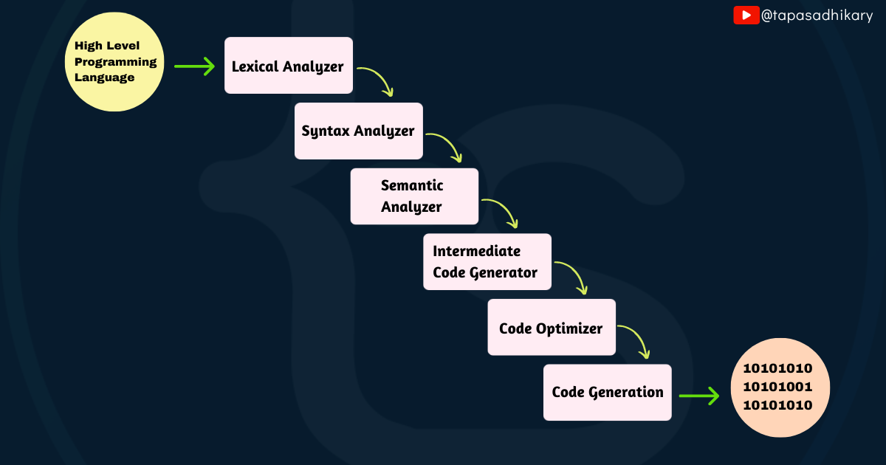
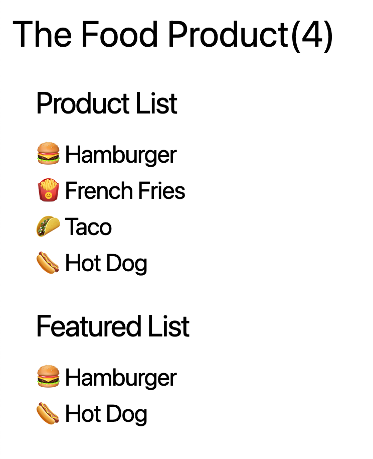
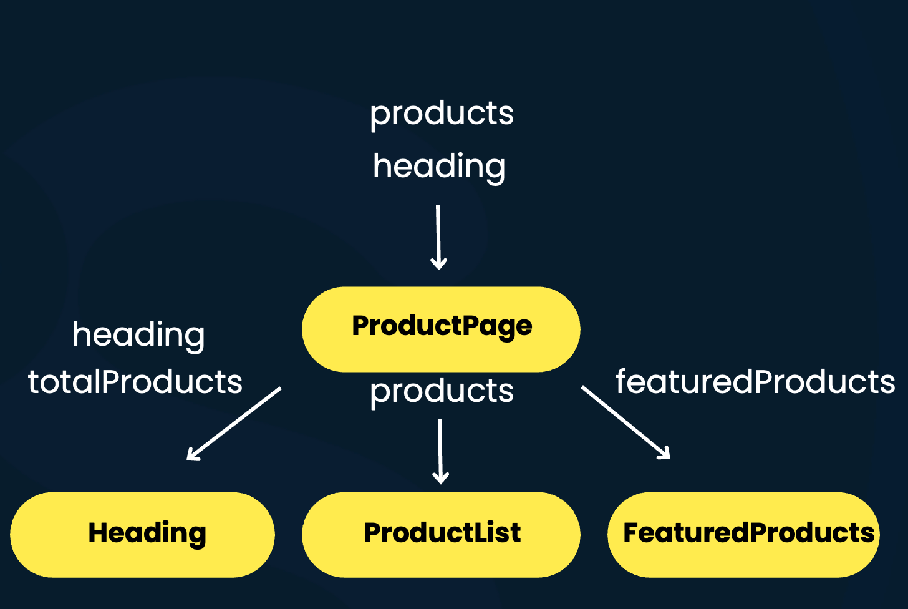
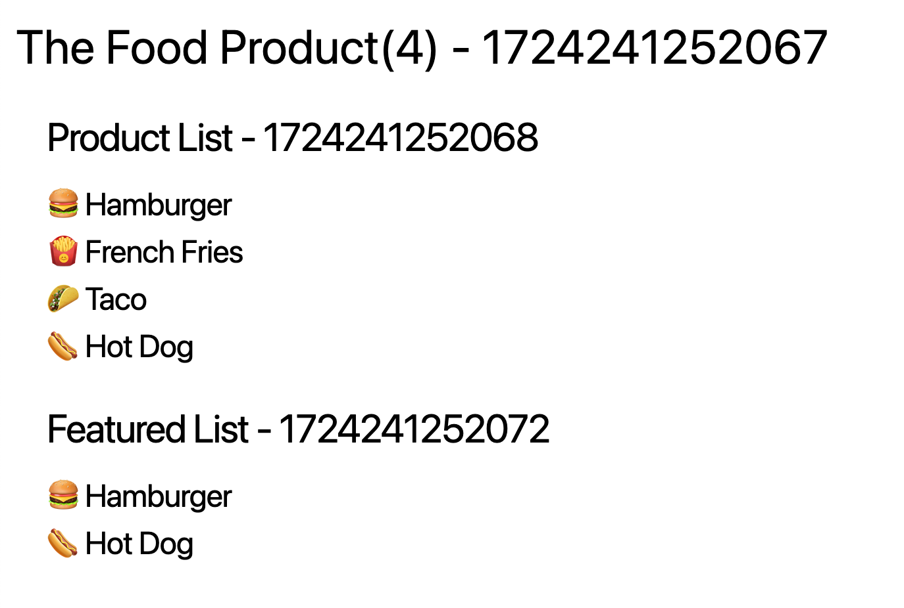
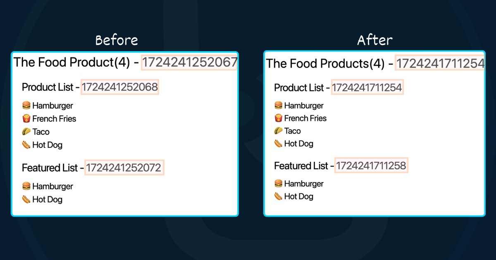
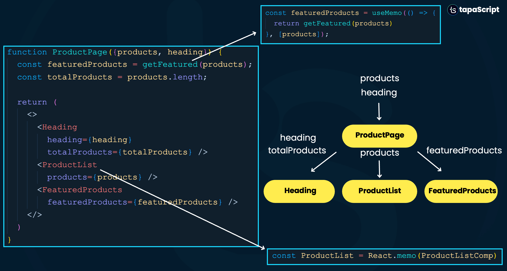
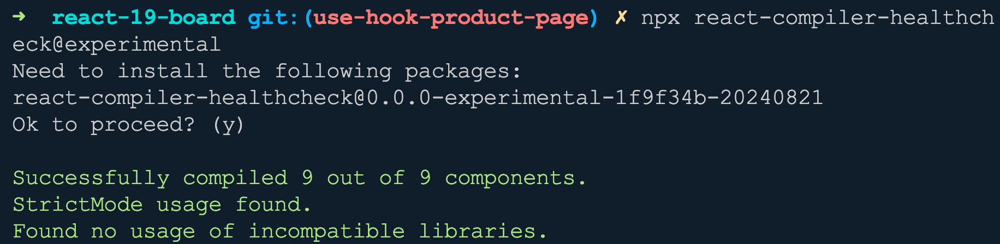
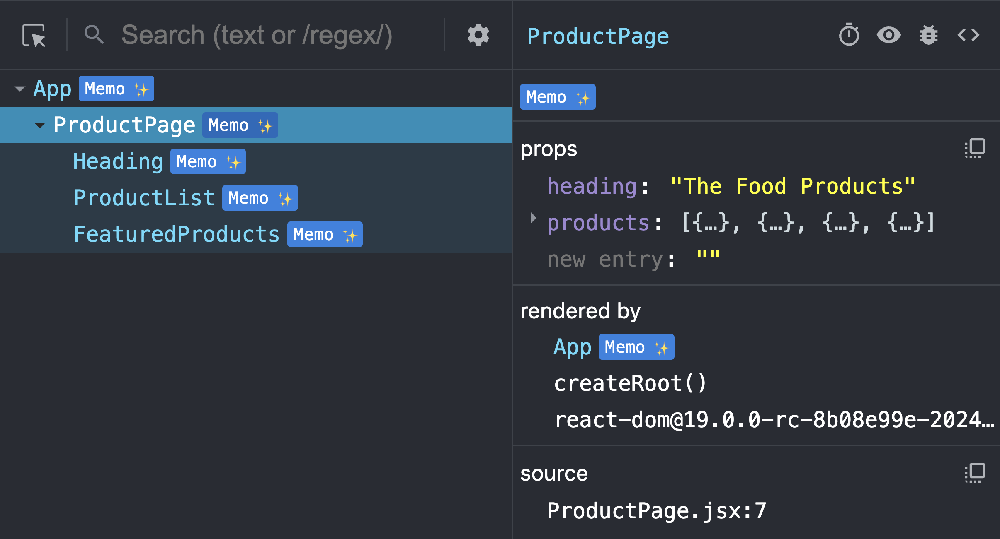
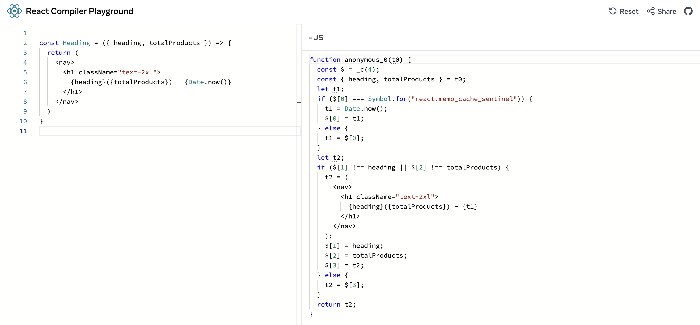

# Как использовать React Compiler – Полное руководство

<big>
В этом руководстве вы узнаете, как React Compiler может помочь вам писать более оптимизированные React-приложения.
</big>

React — это библиотека пользовательского интерфейса, которая отлично справляется со своей работой уже более десяти лет. Архитектура компонентов, однонаправленный поток данных и декларативная природа выделяются в помощи разработчикам создавать готовые к продакшену, масштабируемые программные приложения.

В течение релизов (даже вплоть до последнего стабильного релиза v18.x) React предоставлял различные техники и методологии для улучшения производительности приложений.

Например, вся парадигма мемоизации поддерживалась с использованием компонента высшего порядка `React.memo` или с помощью хуков вроде `useMemo` и `useCallback`.

В программировании _мемоизация_ — это техника оптимизации, которая заставляет ваши программы выполняться быстрее путем кэширования результата дорогих вычислений.

Хотя техники _мемоизации_ React отлично подходят для применения оптимизаций, как однажды сказал дядя Бен (помните дядю Человека-Паука?), "С большой силой приходит большая ответственность". Поэтому мы, как разработчики, должны быть немного более ответственными в применении их. Оптимизация — это здорово, но чрезмерная оптимизация может стать убийцей производительности вашего приложения.

С React 19 сообщество разработчиков получило список улучшений и функций, которыми можно похвастаться:

-   Экспериментальный компилятор с открытым исходным кодом. Мы будем сосредотачиваться в основном на нем в этой статье.
-   React Server Components.
-   Server Actions.
-   Более простой и естественный способ обработки метаданных документа.
-   Улучшенные хуки и API.
-   `ref` можно передавать как пропсы.
-   Улучшения в загрузке ассетов для стилей, изображений и шрифтов.
-   Более плавная интеграция с Web Components.

Если это вас взволновало, я рекомендую посмотреть это [видео](https://www.youtube.com/watch?v=hiiGUjEkzbM), которое объясняет, как каждая функция повлияет на вас как на React-разработчика. Надеюсь, вам понравится 😊.

Введение компилятора с React 19 призвано стать настоящим переворотом. Отныне мы можем позволить компилятору справляться с головной болью оптимизации вместо того, чтобы держать это на себе.

Означает ли это, что нам больше не нужно использовать `React.memo`, `useMemo`, `useCallback` и так далее? Нет — мы в основном не должны. Компилятор может позаботиться об этих вещах автоматически, если вы понимаете и следуете Правилам React для компонентов и хуков.

Как он это сделает? Ну, мы к этому подойдем. Но сначала давайте разберемся, что такое компилятор и оправдано ли называть этот новый оптимизатор для React-кода React Compiler.

Если вам нравится учиться по видеоруководствам, эта статья также доступна как видеоруководство здесь:


## Что такое компилятор в традиционном понимании?

Проще говоря, компилятор — это программное обеспечение/инструмент, который переводит код высокоуровневого языка программирования (исходный код) в машинный код. Существует несколько шагов, которые нужно выполнить для компиляции исходного кода и генерации машинного кода:

-   _Лексический анализатор_ токенизирует исходный код и генерирует токены.
-   _Синтаксический анализатор_ создает абстрактное синтаксическое дерево (AST) для логической структуризации токенов исходного кода.
-   _Семантический анализатор_ проверяет семантическую (или синтаксическую) корректность кода.
-   После всех трех типов анализа соответствующими анализаторами генерируется некоторый _промежуточный код_. Он также известен как IR-код.
-   Затем выполняется _оптимизация_ IR-кода.
-   Наконец, _машинный код_ генерируется компилятором из оптимизированного IR-кода.



Теперь, когда вы понимаете основы того, как работает компилятор, давайте узнаем о **React Compiler** и разберемся, как он работает.

## Архитектура React Compiler

React Compiler — это инструмент времени сборки, который вам нужно явно настроить с вашим React 19 проектом, используя параметры конфигурации, предоставляемые экосистемой инструментов React.

Например, если вы используете _Vite_ для создания вашего React-приложения, конфигурация компилятора будет происходить в файле `vite.config.js`.

React Compiler имеет три основных компонента:

1.  _Babel Plugin_: помогает трансформировать код во время процесса компиляции.
2.  _ESLint Plugin_: помогает ловить и сообщать о любых нарушениях Правил React.
3.  _Compiler Core_: основная логика компилятора, которая выполняет анализ кода и оптимизации. И Babel, и ESLint плагины используют основную логику компилятора.

Процесс компиляции происходит следующим образом:

-   _Babel Plugin_ идентифицирует, какие функции (компоненты или хуки) компилировать. Мы увидим некоторые конфигурации позже, чтобы узнать, как включать и отключать процесс компиляции. Плагин вызывает основную логику компилятора для каждой из функций и в итоге создает Абстрактное Синтаксическое Дерево.
-   Затем ядро компилятора конвертирует Babel AST в IR-код, анализирует его и запускает различные валидации, чтобы убедиться, что ни одно из правил не нарушено.
-   Далее оно пытается уменьшить количество кода для оптимизации, выполняя различные проходы для устранения мертвого кода. Код дополнительно оптимизируется с использованием мемоизации.
-   Наконец, на этапе генерации кода трансформированное AST конвертируется обратно в оптимизированный JavaScript код.

## React Compiler в действии

Теперь, когда вы знаете, как работает React Compiler, давайте погрузимся в его настройку с React 19 проектом, чтобы вы могли начать изучать различные оптимизации.

### Понимание проблемы: Без React Compiler

Давайте создадим простую страницу продукта с React. Страница продукта показывает заголовок с количеством продуктов на странице, список продуктов и рекомендуемые продукты.



Иерархия компонентов и передача данных между компонентами выглядит следующим образом:



Как вы можете видеть на изображении выше,

-   Компонент `ProductPage` имеет три дочерних компонента: `Heading`, `ProductList` и `FeaturedProducts`.
-   Компонент `ProductPage` получает два пропса: `products` и `heading`.
-   Компонент `ProductPage` вычисляет общее количество продуктов и передает значение вместе со значением текста заголовка в компонент `Heading`.
-   Компонент `ProductPage` передает пропс `products` дочернему компоненту `ProductList`.
-   Аналогично, он вычисляет рекомендуемые продукты и передает пропс `featuredProducts` компоненту `FeaturedProducts`.

Вот как может выглядеть исходный код компонента `ProductPage`:

```jsx
import React from 'react';

import Heading from './Heading';
import FeaturedProducts from './FeaturedProducts';
import ProductList from './ProductList';

const ProductPage = ({ products, heading }) => {
    const featuredProducts = products.filter(
        (product) => product.featured
    );
    const totalProducts = products.length;

    return (
        <div className="m-2">
            <Heading
                heading={heading}
                totalProducts={totalProducts}
            />

            <ProductList products={products} />

            <FeaturedProducts
                featuredProducts={featuredProducts}
            />
        </div>
    );
};

export default ProductPage;
```

Также предположим, что мы используем компонент `ProductPage` в файле `App.js` следующим образом:

```jsx
import ProductPage from './components/compiler/ProductPage';

function App() {
    // Список пищевых продуктов
    const foodProducts = [
        {
            id: '001',
            name: 'Hamburger',
            image: '🍔',
            featured: true,
        },
        {
            id: '002',
            name: 'French Fries',
            image: '🍟',
            featured: false,
        },
        {
            id: '003',
            name: 'Taco',
            image: '🌮',
            featured: false,
        },
        {
            id: '004',
            name: 'Hot Dog',
            image: '🌭',
            featured: true,
        },
    ];

    return (
        <ProductPage
            products={foodProducts}
            heading="The Food Product"
        />
    );
}

export default App;
```

Все хорошо — так в чем же проблема? Проблема в том, что React активно перерисовывает дочерний компонент, когда перерисовывается родительский компонент. Ненужная перерисовка требует оптимизаций. Давайте сначала полностью разберемся с проблемой.

Мы добавим текущую временную метку в каждый из дочерних компонентов. Теперь отрендеренный пользовательский интерфейс будет выглядеть следующим образом:



Большое число, которое вы видите рядом с заголовками — это временная метка (используя простую функцию `Date.now()` из JavaScript Date API), которую мы добавили в код компонента. Теперь что произойдет, если мы изменим значение пропса `heading` компонента `ProductPage`?

До:

```jsx
<ProductPage
    products={foodProducts}
    heading="The Food Product"
/>
```

И после (обратите внимание, что мы сделали его множественным числом для продуктов, добавив s в конце значения заголовка):

```jsx
<ProductPage
    products={foodProducts}
    heading="The Food Products"
/>
```

Теперь вы заметите немедленное изменение в пользовательском интерфейсе. Все три временные метки обновились. Это потому, что все три компонента были перерисованы, когда родительский компонент был перерисован из-за изменения пропсов.



Если вы заметили, пропс `heading` был передан только компоненту `Heading`, и даже тогда другие два дочерних компонента перерисовались. Здесь нам нужны оптимизации.

### Решение проблемы: Без React Compiler

Как обсуждалось ранее, React предоставляет нам различные хуки и API для _мемоизации_. Мы можем использовать `React.memo()` или `useMemo()` для защиты компонентов, которые перерисовываются ненужно.

Например, мы можем использовать `React.memo()` для мемоизации компонента ProductList, чтобы гарантировать, что компонент `ProductList` не будет перерисовываться, если не изменится пропс `products`.

Мы можем использовать хук `useMemo()` для мемоизации вычисления рекомендуемых продуктов. Обе реализации указаны на изображении ниже.



Но опять же, вспоминая мудрые слова великого дяди Бена, за последние несколько лет мы начали чрезмерно использовать эти техники оптимизации. Эти чрезмерные оптимизации могут негативно повлиять на производительность ваших приложений. Поэтому наличие компилятора — это благо для React-разработчиков, поскольку оно позволяет делегировать многие такие оптимизации компилятору.

Давайте теперь исправим проблему с помощью React Compiler.

### Решение проблемы: С использованием React Compiler

Опять же, React Compiler — это инструмент времени сборки с явным включением. Он не поставляется в комплекте с React 19 RC. Вам нужно установить необходимые зависимости и настроить компилятор с вашим React 19 проектом.

Перед настройкой компилятора вы можете проверить совместимость вашей кодовой базы, выполнив эту команду в директории вашего проекта:

```sh
npx react-compiler-healthcheck@experimental
```

Она проверит и сообщит:

-   Сколько компонентов может быть оптимизировано компилятором
-   Соблюдаются ли Правила React.
-   Есть ли несовместимые библиотеки.



Если вы обнаружите, что все совместимо, пришло время установить ESLint плагин, работающий на React Compiler. Этот плагин поможет вам ловить любые нарушения правил React в вашем коде. Нарушающий код будет пропущен React Compiler и на нем не будут выполняться оптимизации.

```sh
npm install eslint-plugin-react-compiler@experimental
```

Затем откройте файл конфигурации ESLint (например, .eslintrc.cjs для Vite) и добавьте эти конфигурации:

```js
module.exports = {
    plugins: ['eslint-plugin-react-compiler'],
    rules: {
        'react-compiler/react-compiler': 'error',
    },
};
```

Далее вы будете использовать Babel плагин для React Compiler, чтобы включить компилятор для всего вашего проекта. Если вы начинаете новый проект с React 19, я рекомендую включить React Compiler для всего проекта. Давайте установим Babel плагин для React Compiler:

```sh
npm install babel-plugin-react-compiler@experimental
```

После установки вам нужно завершить конфигурацию, добавив опции в файл конфигурации Babel. Поскольку мы используем Vite, откройте файл `vite.config.js` и замените его содержимое следующим фрагментом кода:

```jsx
import { defineConfig } from 'vite';
import react from '@vitejs/plugin-react';

const ReactCompilerConfig = {
    /* ... */
};

// https://vitejs.dev/config/
export default defineConfig({
    plugins: [
        react({
            babel: {
                plugins: [
                    [
                        'babel-plugin-react-compiler',
                        ReactCompilerConfig,
                    ],
                ],
            },
        }),
    ],
});
```

Здесь вы добавили `babel-plugin-react-compiler` в конфигурацию. `ReactCompilerConfig` требуется для предоставления любой расширенной конфигурации, например, если вы хотите предоставить какой-либо пользовательский модуль времени выполнения или другие конфигурации. В этом случае это пустой объект без расширенных конфигураций.

Вот и все. Вы завершили настройку React Compiler с вашей кодовой базой для использования его возможностей. Отныне React Compiler будет просматривать каждый компонент и хук в вашем проекте, пытаясь применить к ним оптимизации.

Если вы хотите настроить React Compiler с Next.js, Remix, Webpack и так далее, вы можете [следовать этому руководству](https://react.dev/learn/react-compiler#installation).

### Оптимизированное React приложение с React Compiler

Теперь у вас должно быть оптимизированное React приложение с включением React Compiler. Итак, давайте проведем те же тесты, что и раньше. Опять измените значение пропса `heading` компонента `ProductPage`.

На этот раз вы не увидите перерисовку дочерних компонентов. Поэтому временная метка тоже не обновится. Но вы увидите ту часть компонента, где данные изменились, поскольку она отразит изменения сама по себе. Также вам больше не нужно будет использовать `memo`, `useMemo()` или `useCallback()` в вашем коде.

Вы можете увидеть это в работе визуально [здесь](https://youtu.be/bdWUVp0TbTU?t=1326).

## React Compiler в React DevTools

[React DevTools](https://react.dev/learn/react-developer-tools) версии 5.0+ имеет встроенную поддержку React Compiler. Вы увидите значок с текстом _Memo ✨_ рядом с компонентами, оптимизированными React Compiler. Это фантастично!



## Погружение в детали – Как работает React Compiler?

Теперь, когда вы увидели, как React Compiler работает с кодом React 19, давайте глубоко погрузимся в понимание того, что происходит в фоне. Мы будем использовать [React Compiler Playground](https://playground.react.dev/) для изучения переведенного кода и шагов оптимизации.



Мы будем использовать компонент `Heading` в качестве примера. Скопируйте и вставьте следующий код в левую секцию playground:

```jsx
const Heading = ({ heading, totalProducts }) => {
    return (
        <nav>
            <h1 className="text-2xl">
                {heading}({totalProducts}) - {Date.now()}
            </h1>
        </nav>
    );
};
```

Вы увидите, что некоторый JavaScript код генерируется немедленно внутри вкладки `_JS` playground. React Compiler генерирует этот JavaScript код как часть процесса компиляции. Давайте разберем его шаг за шагом:

```jsx
function anonymous_0(t0) {
    const $ = _c(4);
    const { heading, totalProducts } = t0;
    let t1;
    if ($[0] === Symbol.for('react.memo_cache_sentinel')) {
        t1 = Date.now();
        $[0] = t1;
    } else {
        t1 = $[0];
    }
    let t2;
    if ($[1] !== heading || $[2] !== totalProducts) {
        t2 = (
            <nav>
                <h1 className="text-2xl">
                    {heading}({totalProducts}) - {t1}
                </h1>
            </nav>
        );
        $[1] = heading;
        $[2] = totalProducts;
        $[3] = t2;
    } else {
        t2 = $[3];
    }
    return t2;
}
```

The compiler uses a hook called `_c()` to create an array of items to cache. In the code above, an array of four elements has been created to cache four items.

```js
const $ = _c(4);
```

But, what are the things to cache?

-   The component takes two props, `heading` and `totalProducts`. The compiler needs to cache them. So, it needs two elements in the array of cacheable items.
-   The `Date.now()` part in the header should be cached.
-   The JSX itself should be cached. There is no point in computing JSX unless either of the above changes.

So there are a total of four items to cache.

The compiler creates memoization blocks using the `if-block`. The final return value from the compiler is the JSX which depends on three dependencies:

-   The `Date.now()` value.
-   Two props, a `heading` and `totalProducts`

The output JSX needs re-computation when any of the above changes. This means that the compiler needs to create two memoization blocks for each of the above.

The first memoization block looks like this:

```jsx
if ($[0] === Symbol.for('react.memo_cache_sentinel')) {
    t1 = Date.now();
    $[0] = t1;
} else {
    t1 = $[0];
}
```

The if-block stores the value of the `Date.now()` into the first index of the cacheable array. It re-uses the same every time unless it is changed.

Similarly, in the second memoization block:

```jsx
if ($[1] !== heading || $[2] !== totalProducts) {
    t2 = (
        <nav>
            <h1 className="text-2xl">
                {heading}({totalProducts}) - {t1}
            </h1>
        </nav>
    );
    $[1] = heading;
    $[2] = totalProducts;
    $[3] = t2;
} else {
    t2 = $[3];
}
```

Here, the check is for the value changes for either `heading` or `totalProducts` props. If either of these changes, the JSX needs to be recomputed. All the values are then stored in the cacheable array. If there are no changes in the value, the previously computed JSX is returned from the cache.

You can now paste any other component source code into the left side and look into the generated JavaScript code to help you understand what's going on as we did above. This will help you to get a better grip on how the compiler performs the memoization techniques in the compilation process.

## How Do You Opt in and Out of the React Compiler?

Once you've configured the React compiler the way we have done with our Vite project here, it's enabled for all the compilers and hooks of the project.

But in some cases, you may want to selectively opt-in for the React compiler. In that case, you can run the compiler in “opt-in” mode using the `compilationMode: "annotation"` option.

```jsx
// Specify the option in the ReactCompilerConfig
const ReactCompilerConfig = {
    compilationMode: 'annotation',
};
```

Then annotate the components and hooks you want to opt-in for compilation with the `"use memo"` directive.

```jsx
// src/ProductPage.jsx
export default function ProductPage() {
    'use memo';
    // ...
}
```

Note that there is a `"use no memo"` directive as well. There might be some rare cases where your component may not be working as expected after compilation, and you want to opt out of the compilation temporarily until the issue is identified and fixed. In that case, you can use this directive:

```jsx
function AComponent() {
    'use no memo';
    // ...
}
```

## Can We Use the React Compiler with React 18.x?

It is recommended to use the React compiler with React 19 as there are required compatibilities. If you can't upgrade your application to React 19, you'll need to have a custom implementation of the cache function. You can go over [this thread](https://github.com/reactwg/react-compiler/discussions/6) describing the workaround.

### Repositories to Look Into

-   All the source code used in this article is in [this repository](https://github.com/tapascript/react-compiler-lesson).
-   If you want to start coding with React 19 and its features, [here is a template repository](https://github.com/atapas/code-in-react-19) configured with React 19 RC, Vite, and TailwindCSS. You may want to try it out.

## What's Next?

To learn further,

-   Check out the official documentation of React Compiler [from here](https://react.dev/learn/react-compiler).
-   Check out the [discussions](https://github.com/reactwg/react-compiler/discussions) in the Working Group.

Up next, if you are willing to learn React and its ecosystem-like Next.js with both fundamental concepts and projects, I have great news for you: you can check out this [playlist](https://www.youtube.com/watch?v=VSB2h7mVhPg&list=PLIJrr73KDmRwz_7QUvQ9Az82aDM9I8L_8) on my YouTube channel with 22+ video tutorials and 12+ hours of engaging content so far, for free. I hope you like them as well.

That's all for now. Did you enjoy reading this article and have you learned something new? If so, I would love to know if the content was helpful.

<small>:material-information-outline: Источник &mdash; <https://www.freecodecamp.org/news/react-compiler-complete-guide-react-19/></small>
