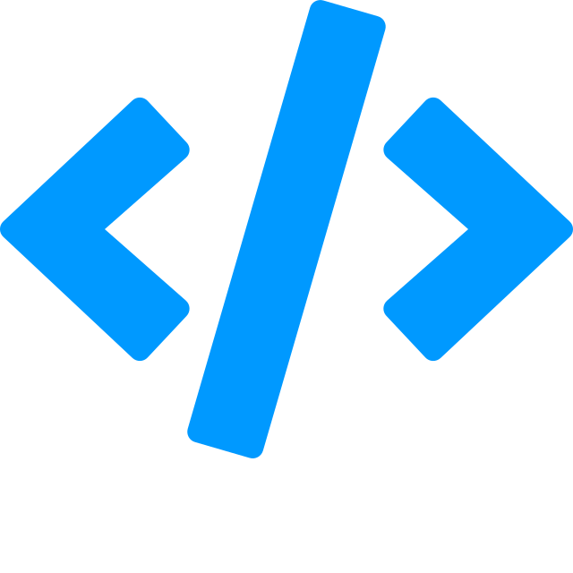

# {: style="height:42px;width:42px;vertical-align:middle;"} Справочник React

[**React** :octicons-link-external-16:](https://react.dev/) &mdash; это декларативная, эффективная и гибкая JavaScript библиотека для создания пользовательских интерфейсов.

-   :simple-react:{ .lg .middle } **Документация**

    ***

    Перевод официальной документации

    **[:octicons-arrow-right-24: Учебник React 18](learn/index.md)**

    [:octicons-arrow-right-24: API React 18](./reference/index.md)

    [:octicons-arrow-right-24: React 16](./archive/react16/tutorial.md)

-   :material-language-typescript:{ .lg .middle } **Типизация**

    ***

    Типизация React на Typescript

    [:octicons-arrow-right-24: React и Typescript](types/index.md)

-   :simple-nextdotjs:{ .lg .middle } **Старт**

    ***

    Фреймворки для старта нового проекта

    [:octicons-arrow-right-24: Next.js](libs/nextjs/index.md)

    [:octicons-arrow-right-24: Create React App](libs/cra.md)

## Менеджеры состояния {style="border-bottom: 0;"}

-   :simple-redux:{ .lg .middle } **Redux**

    ***

    Библиотека управления состоянием

    [:octicons-arrow-right-24: Redux](libs/redux/index.md)

    [:octicons-arrow-right-24: Redux Toolkit](libs/redux-toolkit.md)

-   :simple-apollographql:{ .lg .middle } **Apollo**

    ***

    Библиотеки GraphQL API

    [:octicons-arrow-right-24: GraphQL](libs/graphql/index.md)

    :octicons-arrow-right-24: React Apollo Client <small>v3</small>

    :octicons-arrow-right-24: Apollo Server :octicons-link-external-16:

-   :material-state-machine:{ .lg .middle } **Другие менеджеры**

    ***

    Библиотеки менеджеров состояния

    [:octicons-arrow-right-24: React Query](libs/react-query.md)

    [:octicons-arrow-right-24: XState](libs/xstate/index.md) <small>v4</small>

## Библиотеки {style="border-bottom: 0;"}

-   :simple-reactrouter:{ .lg .middle } **Роутинг**

    ***

    Библиотеки организации маршрутизации

    **[:octicons-arrow-right-24: React Router](libs/react-router.6/index.md)** <small>v6</small>

    [:octicons-arrow-right-24: React Router](libs/react-router.md) <small>v5</small>

-   :simple-stylelint:{ .lg .middle } **Стилизация**

    ***

    Библиотеки для управления стилями

    [:octicons-arrow-right-24: Styled Components](libs/styled-components.md)

-   :material-animation-play:{ .lg .middle } **Анимации**

    ***

    Библиотеки анимации и переходов

    [:octicons-arrow-right-24: React Spring](libs/react-spring.md)

    [:octicons-arrow-right-24: React Transition Group](libs/react-transition-group/index.md)

---

!!!abstract "Справочники"

    [{: class="nolightbox" style="height:16px;width:16px;vertical-align:middle;"} HTML + CSS](https://hcdev.ru/) &nbsp;&nbsp;&nbsp;
    [{: class="nolightbox" style="height:16px;width:16px;vertical-align:middle;"} Typescript](https://scriptdev.ru/) &nbsp;&nbsp;&nbsp;
    [{: class="nolightbox" style="height:16px;width:16px;vertical-align:middle;"} Angular](https://angdev.ru/) &nbsp;&nbsp;&nbsp;
    **[{: class="nolightbox" style="height:16px;width:16px;vertical-align:middle;"} React](https://reactdev.ru/)** &nbsp;&nbsp;&nbsp;
    [{: class="nolightbox" style="height:16px;width:16px;vertical-align:middle;"} Solid](https://soliddev.ru/) &nbsp;&nbsp;&nbsp;
    [{: class="nolightbox" style="height:16px;width:16px;vertical-align:middle;"} React Native](https://reactnativedev.ru/) &nbsp;&nbsp;&nbsp;
    [{: class="nolightbox" style="height:16px;width:16px;vertical-align:middle;"} PWA](https://pwadev.ru/) &nbsp;&nbsp;&nbsp;
    [{: class="nolightbox" style="height:16px;width:16px;vertical-align:middle;"} Node.js](https://nodejsdev.ru/) &nbsp;&nbsp;&nbsp;
    [{: class="nolightbox" style="height:16px;width:16px;vertical-align:middle;"} Python 3](https://py3dev.ru/) &nbsp;&nbsp;&nbsp;
    [{: class="nolightbox" style="height:16px;width:16px;vertical-align:middle;"} XSLT](https://xsltdev.ru/) &nbsp;&nbsp;&nbsp;
    [{: class="nolightbox" style="height:16px;width:16px;vertical-align:middle;"} Базы данных](https://dbasedev.ru/) &nbsp;&nbsp;&nbsp;

<!--
https://github.com/harryheman/React-Total
-->
