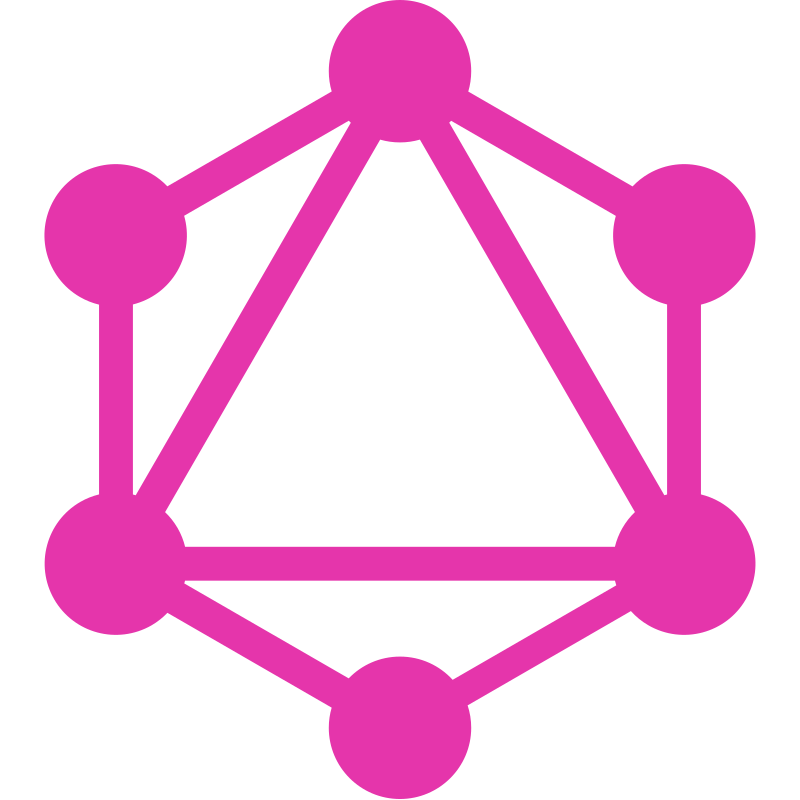

# {: style="height:64px;width:64px;vertical-align:middle;"} Справочник React

[{: style="height:20px;width:20px;vertical-align:middle;"} **React**](https://react.dev/) &mdash; это декларативная, эффективная и гибкая JavaScript библиотека для создания пользовательских интерфейсов

!!!info "Документация по React"

    - **[Перевод React 18](learn/index.md)**
    - [Перевод React 16](tutorial/tutorial.md)
    - [React и Typescript](types/index.md) &mdash; типизация библиотеки React с помощью Typescript

!!!info "Стартовые проекты React"

    - [Create React App](libs/cra.md)
    - [{: style="height:20px;width:20px;vertical-align:middle;"} Next.js](nextjs/index.md)

!!!info "Redux"

    - [{: style="height:20px;width:20px;vertical-align:middle;"} Redux](libs/redux/index.md) &mdash; библиотека управления состоянием
    - [Redux Toolkit](libs/redux-toolkit.md)

!!!info "Менеджеры состояния"

    - [React Query](libs/react-query) &mdash; менеджер серверного состояния
    - [XState](libs/xstate/index.md) &mdash; конечные автоматы

!!!info "Загрузка данных"

    - [{: style="height:20px;width:20px;vertical-align:middle;"} GraphQL](graphql/index.md) &mdash; язык запросов данных

!!!info "Роутинг"

    - [{: style="height:20px;width:20px;vertical-align:middle;"} React Router](libs/react-router.md) &mdash; маршрутизатор

!!!info "Стили и CSS"

    - [Styled Components](libs/styled-components.md) &mdash; библиотека стилизации

!!!info "Анимации"

    - [{: style="height:20px;width:20px;vertical-align:middle;"} React Spring](libs/react-spring.md) &mdash; анимация интерфейсов
    - [React Transition Group](libs/react-transition-group/index.md) &mdash; анимация переходов

---

!!!abstract "Справочники"

    [{: style="height:16px;width:16px;vertical-align:middle;"} HTML + CSS](https://hcdev.ru/) &nbsp;&nbsp;&nbsp;
    [{: style="height:16px;width:16px;vertical-align:middle;"} Typescript](https://scriptdev.ru/) &nbsp;&nbsp;&nbsp;
    [{: style="height:16px;width:16px;vertical-align:middle;"} Angular](https://angdev.ru/) &nbsp;&nbsp;&nbsp;
    **[{: style="height:16px;width:16px;vertical-align:middle;"} React](https://reactdev.ru/)** &nbsp;&nbsp;&nbsp;
    [{: style="height:16px;width:16px;vertical-align:middle;"} Node.js](https://nodejsdev.ru/) &nbsp;&nbsp;&nbsp;
    [{: style="height:16px;width:16px;vertical-align:middle;"} Python 3](https://py3dev.ru/) &nbsp;&nbsp;&nbsp;
    [{: style="height:16px;width:16px;vertical-align:middle;"} XSLT](https://xsltdev.ru/)

<!--
https://github.com/harryheman/React-Total
-->
