# Выбор структуры состояния

Правильное структурирование состояния может сделать разницу между компонентом, который приятно модифицировать и отлаживать, и компонентом, который является постоянным источником ошибок. Вот несколько советов, которые следует учитывать при структурировании состояния.

!!!tip "Вы узнаете"

    -   Когда использовать одну или несколько переменных состояния
    -   Чего следует избегать при организации состояния
    -   Как исправить распространенные проблемы со структурой состояния

## Принципы структурирования состояния

Когда вы пишете компонент, который хранит некоторое состояние, вам придется сделать выбор, сколько переменных состояния использовать и какова должна быть форма их данных. Хотя можно писать корректные программы даже с неоптимальной структурой состояния, есть несколько принципов, которые помогут вам сделать лучший выбор:

1.  **Группируйте связанные состояния.** Если вы всегда обновляете две или более переменных состояния одновременно, подумайте о том, чтобы объединить их в одну переменную состояния.
2.  **Избегайте противоречий в состоянии.** Когда состояние структурировано таким образом, что несколько частей состояния могут противоречить и "не соглашаться" друг с другом, вы оставляете место для ошибок. Постарайтесь избежать этого.
3.  Если вы можете вычислить какую-то информацию из реквизитов компонента или его существующих переменных состояния во время рендеринга, не стоит помещать эту информацию в состояние компонента.
4.  Когда одни и те же данные дублируются в нескольких переменных состояния или во вложенных объектах, их трудно синхронизировать. Сократите дублирование, когда это возможно.
5.  **Избегайте глубоко вложенного состояния.** Глубоко иерархическое состояние не очень удобно для обновления. Когда это возможно, предпочитайте структурировать состояние плоским образом.

Цель этих принципов - _сделать состояние легко обновляемым без ошибок_. Удаление избыточных и дублирующих данных из состояния помогает обеспечить синхронизацию всех его частей. Это похоже на то, как инженер базы данных может захотеть ["нормализовать" структуру базы данных](https://docs.microsoft.com/office/troubleshoot/access/database-normalization-description), чтобы уменьшить вероятность ошибок. Перефразируя Альберта Эйнштейна, **"Сделайте ваше состояние настолько простым, насколько оно может быть - но не проще."**.

Теперь давайте посмотрим, как эти принципы применяются на практике.

## Состояние, связанное с группой

Иногда вы можете сомневаться, использовать ли одну или несколько переменных состояния.

Стоит ли вам это делать?

<!-- 0001.part.md -->

```js
const [x, setX] = useState(0);
const [y, setY] = useState(0);
```

<!-- 0002.part.md -->

Или это?

<!-- 0003.part.md -->

```js
const [position, setPosition] = useState({ x: 0, y: 0 });
```

<!-- 0004.part.md -->

Технически, вы можете использовать любой из этих подходов. Но **если некоторые две переменные состояния всегда изменяются вместе, хорошей идеей будет объединить их в одну переменную состояния.** Тогда вы не забудете всегда синхронизировать их, как в этом примере, где перемещение курсора обновляет обе координаты красной точки:

<!-- 0005.part.md -->

=== "App.js"

    ```js
    import { useState } from 'react';

    export default function MovingDot() {
    	const [position, setPosition] = useState({
    		x: 0,
    		y: 0,
    	});
    	return (
    		<div
    			onPointerMove={(e) => {
    				setPosition({
    					x: e.clientX,
    					y: e.clientY,
    				});
    			}}
    			style={{
    				position: 'relative',
    				width: '100vw',
    				height: '100vh',
    			}}
    		>
    			<div
    				style={{
    					position: 'absolute',
    					backgroundColor: 'red',
    					borderRadius: '50%',
    					transform: `translate(${position.x}px, ${position.y}px)`,
    					left: -10,
    					top: -10,
    					width: 20,
    					height: 20,
    				}}
    			/>
    		</div>
    	);
    }
    ```

=== "Результат"

    

Еще один случай, когда вы группируете данные в объект или массив, - это когда вы не знаете, сколько частей состояния вам понадобится. Например, это полезно, когда у вас есть форма, в которой пользователь может добавлять пользовательские поля.

!!!warning ""

    Если ваша переменная состояния является объектом, помните, что [вы не можете обновить только одно поле в нем](updating-objects-in-state.md) без явного копирования других полей. Например, вы не можете сделать `setPosition({ x: 100 })` в приведенном выше примере, потому что у него не будет свойства `y` вообще! Вместо этого, если бы вы хотели установить только `x`, вы бы либо сделали `setPosition({ ...position, x: 100 })`, либо разделили их на две переменные состояния и сделали `setX(100)`.

## Избегайте противоречий в состоянии

Вот форма обратной связи с отелем с переменными состояния `isSending` и `isSent`:

<!-- 0009.part.md -->

=== "App.js"

    <div markdown style="max-height: 400px; overflow-y: auto;">

    ```js
    import { useState } from 'react';

    export default function FeedbackForm() {
    	const [text, setText] = useState('');
    	const [isSending, setIsSending] = useState(false);
    	const [isSent, setIsSent] = useState(false);

    	async function handleSubmit(e) {
    		e.preventDefault();
    		setIsSending(true);
    		await sendMessage(text);
    		setIsSending(false);
    		setIsSent(true);
    	}

    	if (isSent) {
    		return <h1>Thanks for feedback!</h1>;
    	}

    	return (
    		<form onSubmit={handleSubmit}>
    			<p>How was your stay at The Prancing Pony?</p>
    			<textarea
    				disabled={isSending}
    				value={text}
    				onChange={(e) => setText(e.target.value)}
    			/>
    			<br />
    			<button disabled={isSending} type="submit">
    				Send
    			</button>
    			{isSending && <p>Sending...</p>}
    		</form>
    	);
    }

    // Pretend to send a message.
    function sendMessage(text) {
    	return new Promise((resolve) => {
    		setTimeout(resolve, 2000);
    	});
    }
    ```

    </div>

=== "Результат"

    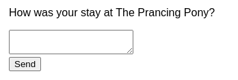

<!-- 0010.part.md -->

Хотя этот код работает, он оставляет дверь открытой для "невозможных" состояний. Например, если вы забудете вызвать `setIsSent` и `setIsSending` вместе, вы можете оказаться в ситуации, когда одновременно `isSending` и `isSent` будут `true`. Чем сложнее ваш компонент, тем труднее понять, что произошло.

**Поскольку `isSending` и `isSent` никогда не должны быть `true` одновременно, лучше заменить их одной переменной состояния `status`, которая может принимать одно из _трех_ допустимых состояний:** `'typing'` (начальное), `'sending'` и `'sent'`:

<!-- 0011.part.md -->

=== "App.js"

    <div markdown style="max-height: 400px; overflow-y: auto;">

    ```js
    import { useState } from 'react';

    export default function FeedbackForm() {
    	const [text, setText] = useState('');
    	const [status, setStatus] = useState('typing');

    	async function handleSubmit(e) {
    		e.preventDefault();
    		setStatus('sending');
    		await sendMessage(text);
    		setStatus('sent');
    	}

    	const isSending = status === 'sending';
    	const isSent = status === 'sent';

    	if (isSent) {
    		return <h1>Thanks for feedback!</h1>;
    	}

    	return (
    		<form onSubmit={handleSubmit}>
    			<p>How was your stay at The Prancing Pony?</p>
    			<textarea
    				disabled={isSending}
    				value={text}
    				onChange={(e) => setText(e.target.value)}
    			/>
    			<br />
    			<button disabled={isSending} type="submit">
    				Send
    			</button>
    			{isSending && <p>Sending...</p>}
    		</form>
    	);
    }

    // Pretend to send a message.
    function sendMessage(text) {
    	return new Promise((resolve) => {
    		setTimeout(resolve, 2000);
    	});
    }
    ```

    </div>

=== "Результат"

    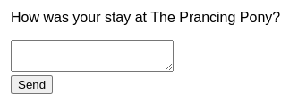

<!-- 0012.part.md -->

Вы все еще можете объявить некоторые константы для удобства чтения:

<!-- 0013.part.md -->

```js
const isSending = status === 'sending';
const isSent = status === 'sent';
```

<!-- 0014.part.md -->

Но они не являются переменными состояния, поэтому вам не нужно беспокоиться о том, что они будут рассинхронизированы друг с другом.

## Избегайте избыточного состояния

Если вы можете вычислить некоторую информацию из реквизитов компонента или его существующих переменных состояния во время рендеринга, вам **не следует** помещать эту информацию в состояние компонента.

Например, возьмем эту форму. Она работает, но можете ли вы найти в ней избыточное состояние?

<!-- 0015.part.md -->

=== "App.js"

    <div markdown style="max-height: 400px; overflow-y: auto;">

    ```js
    import { useState } from 'react';

    export default function Form() {
    	const [firstName, setFirstName] = useState('');
    	const [lastName, setLastName] = useState('');
    	const [fullName, setFullName] = useState('');

    	function handleFirstNameChange(e) {
    		setFirstName(e.target.value);
    		setFullName(e.target.value + ' ' + lastName);
    	}

    	function handleLastNameChange(e) {
    		setLastName(e.target.value);
    		setFullName(firstName + ' ' + e.target.value);
    	}

    	return (
    		<>
    			<h2>Let’s check you in</h2>
    			<label>
    				First name:{' '}
    				<input
    					value={firstName}
    					onChange={handleFirstNameChange}
    				/>
    			</label>
    			<label>
    				Last name:{' '}
    				<input
    					value={lastName}
    					onChange={handleLastNameChange}
    				/>
    			</label>
    			<p>
    				Your ticket will be issued to:{' '}
    				<b>{fullName}</b>
    			</p>
    		</>
    	);
    }
    ```

    </div>

=== "Результат"

    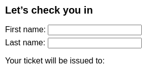

Эта форма имеет три переменные состояния: `firstName`, `lastName` и `fullName`. Однако `fullName` является избыточной. **Вы всегда можете вычислить `fullName` из `firstName` и `lastName` во время рендеринга, поэтому удалите ее из state.**.

Вот как это можно сделать:

<!-- 0019.part.md -->

=== "App.js"

    <div markdown style="max-height: 400px; overflow-y: auto;">

    ```js
    import { useState } from 'react';

    export default function Form() {
    	const [firstName, setFirstName] = useState('');
    	const [lastName, setLastName] = useState('');

    	const fullName = firstName + ' ' + lastName;

    	function handleFirstNameChange(e) {
    		setFirstName(e.target.value);
    	}

    	function handleLastNameChange(e) {
    		setLastName(e.target.value);
    	}

    	return (
    		<>
    			<h2>Let’s check you in</h2>
    			<label>
    				First name:{' '}
    				<input
    					value={firstName}
    					onChange={handleFirstNameChange}
    				/>
    			</label>
    			<label>
    				Last name:{' '}
    				<input
    					value={lastName}
    					onChange={handleLastNameChange}
    				/>
    			</label>
    			<p>
    				Your ticket will be issued to:{' '}
    				<b>{fullName}</b>
    			</p>
    		</>
    	);
    }
    ```

    </div>

=== "Результат"

    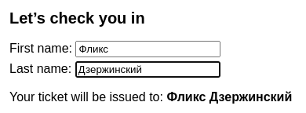

Здесь `fullName` не является _не_ переменной состояния. Вместо этого она вычисляется во время рендеринга:

<!-- 0023.part.md -->

```js
const fullName = firstName + ' ' + lastName;
```

<!-- 0024.part.md -->

В результате обработчикам изменений не нужно делать ничего особенного, чтобы обновить его. Когда вы вызываете `setFirstName` или `setLastName`, вы вызываете повторный рендеринг, а затем следующее `fullName` будет вычислено на основе свежих данных.

!!!note "Не зеркалируйте реквизиты в состоянии"

    Частым примером избыточного состояния является код, подобный этому:

    ```js
    function Message({ messageColor }) {
    	const [color, setColor] = useState(messageColor);
    }
    ```

    Здесь переменная состояния `color` инициализируется параметром `messageColor`. Проблема в том, что **если родительский компонент позже передаст другое значение `messageColor` (например, `'red'` вместо `'blue'`), переменная состояния `color` не будет обновлена!** Состояние инициализируется только во время первого рендеринга.

    Вот почему "зеркальное отражение" какого-либо свойства в переменной состояния может привести к путанице. Вместо этого используйте свойство `messageColor` непосредственно в коде. Если вы хотите дать ему более короткое имя, используйте константу:

    ```js
    function Message({ messageColor }) {
    	const color = messageColor;
    }
    ```

    Таким образом, он не будет рассинхронизирован с реквизитом, переданным из родительского компонента.

    "Зеркалирование" реквизитов в состояние имеет смысл только тогда, когда вы _хотите_ игнорировать все обновления для конкретного реквизита. По традиции, начните имя реквизита с `initial` или `default`, чтобы уточнить, что его новые значения игнорируются:

    ```js
    function Message({ initialColor }) {
    	// The `color` state variable holds the *first* value of `initialColor`.
    	// Further changes to the `initialColor` prop are ignored.
    	const [color, setColor] = useState(initialColor);
    }
    ```

## Избегайте дублирования в состоянии

Этот компонент списка меню позволяет выбрать одну туристическую закуску из нескольких:

<!-- 0031.part.md -->

=== "App.js"

    <div markdown style="max-height: 400px; overflow-y: auto;">

    ```js
    import { useState } from 'react';

    const initialItems = [
    	{ title: 'pretzels', id: 0 },
    	{ title: 'crispy seaweed', id: 1 },
    	{ title: 'granola bar', id: 2 },
    ];

    export default function Menu() {
    	const [items, setItems] = useState(initialItems);
    	const [selectedItem, setSelectedItem] = useState(
    		items[0]
    	);

    	return (
    		<>
    			<h2>What's your travel snack?</h2>
    			<ul>
    				{items.map((item) => (
    					<li key={item.id}>
    						{item.title}{' '}
    						<button
    							onClick={() => {
    								setSelectedItem(item);
    							}}
    						>
    							Choose
    						</button>
    					</li>
    				))}
    			</ul>
    			<p>You picked {selectedItem.title}.</p>
    		</>
    	);
    }
    ```

    </div>

=== "Результат"

    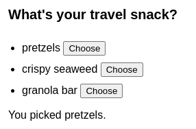

В настоящее время он хранит выбранный элемент как объект в переменной состояния `selectedItem`. Однако это не очень хорошо: **содержимое `selectedItem` является тем же объектом, что и один из элементов списка `items`.** Это означает, что информация о самом элементе дублируется в двух местах.

Почему это является проблемой? Давайте сделаем каждый элемент редактируемым:

<!-- 0035.part.md -->

=== "App.js"

    <div markdown style="max-height: 400px; overflow-y: auto;">

    ```js
    import { useState } from 'react';

    const initialItems = [
    	{ title: 'pretzels', id: 0 },
    	{ title: 'crispy seaweed', id: 1 },
    	{ title: 'granola bar', id: 2 },
    ];

    export default function Menu() {
    	const [items, setItems] = useState(initialItems);
    	const [selectedItem, setSelectedItem] = useState(
    		items[0]
    	);

    	function handleItemChange(id, e) {
    		setItems(
    			items.map((item) => {
    				if (item.id === id) {
    					return {
    						...item,
    						title: e.target.value,
    					};
    				} else {
    					return item;
    				}
    			})
    		);
    	}

    	return (
    		<>
    			<h2>What's your travel snack?</h2>
    			<ul>
    				{items.map((item, index) => (
    					<li key={item.id}>
    						<input
    							value={item.title}
    							onChange={(e) => {
    								handleItemChange(
    									item.id,
    									e
    								);
    							}}
    						/>{' '}
    						<button
    							onClick={() => {
    								setSelectedItem(item);
    							}}
    						>
    							Choose
    						</button>
    					</li>
    				))}
    			</ul>
    			<p>You picked {selectedItem.title}.</p>
    		</>
    	);
    }
    ```

    </div>

=== "Результат"

    

Обратите внимание, что если вы сначала нажмете "Выбрать" на элементе, а затем **отредактируете его**, ввод обновляется, но метка внизу не отражает правки.Это потому, что у вас дублируется состояние, и вы забыли обновить `selectedItem`.

Хотя вы могли бы обновить `selectedItem` тоже, проще устранить дублирование. В этом примере вместо объекта `selectedItem` (который создает дублирование с объектами внутри `items`), вы храните `selectedId` в состоянии, а _потом_ получаете `selectedItem` путем поиска элемента с этим ID в массиве `items`:

<!-- 0039.part.md -->

=== "App.js"

    <div markdown style="max-height: 400px; overflow-y: auto;">

    ```js
    import { useState } from 'react';

    const initialItems = [
    	{ title: 'pretzels', id: 0 },
    	{ title: 'crispy seaweed', id: 1 },
    	{ title: 'granola bar', id: 2 },
    ];

    export default function Menu() {
    	const [items, setItems] = useState(initialItems);
    	const [selectedId, setSelectedId] = useState(0);

    	const selectedItem = items.find(
    		(item) => item.id === selectedId
    	);

    	function handleItemChange(id, e) {
    		setItems(
    			items.map((item) => {
    				if (item.id === id) {
    					return {
    						...item,
    						title: e.target.value,
    					};
    				} else {
    					return item;
    				}
    			})
    		);
    	}

    	return (
    		<>
    			<h2>What's your travel snack?</h2>
    			<ul>
    				{items.map((item, index) => (
    					<li key={item.id}>
    						<input
    							value={item.title}
    							onChange={(e) => {
    								handleItemChange(
    									item.id,
    									e
    								);
    							}}
    						/>{' '}
    						<button
    							onClick={() => {
    								setSelectedId(item.id);
    							}}
    						>
    							Choose
    						</button>
    					</li>
    				))}
    			</ul>
    			<p>You picked {selectedItem.title}.</p>
    		</>
    	);
    }
    ```

    </div>

=== "Результат"

    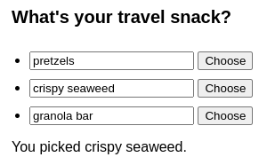

<!-- 0042.part.md -->

(В качестве альтернативы можно удерживать выбранный индекс в состоянии).

Раньше состояние дублировалось следующим образом:

-   `items = [{ id: 0, title: 'pretzels'}, ...]`.
-   `selectedItem = { id: 0, title: 'pretzels'}`.

Но после изменения это выглядит следующим образом:

-   `items = [{ id: 0, title: 'pretzels'}, ...]`
-   `selectedId = 0`.

Дублирование исчезло, и вы сохранили только основное состояние!

Теперь, если вы отредактируете _выбранный_ элемент, сообщение ниже будет немедленно обновлено. Это происходит потому, что `setItems` вызывает повторный рендеринг, и `items.find(...)` найдет элемент с обновленным заголовком. Вам не нужно было хранить _выбранный элемент_ в состоянии, потому что только _выбранный ID_ является существенным. Остальное можно вычислить во время рендеринга.

## Избегайте глубоко вложенного состояния

Представьте себе план путешествия, состоящий из планет, континентов и стран. У вас может возникнуть соблазн структурировать его состояние с помощью вложенных объектов и массивов, как в этом примере:

<!-- 0043.part.md -->

=== "App.js"

    <div markdown style="max-height: 400px; overflow-y: auto;">

    ```js
    import { useState } from 'react';
    import { initialTravelPlan } from './places.js';

    function PlaceTree({ place }) {
    	const childPlaces = place.childPlaces;
    	return (
    		<li>
    			{place.title}
    			{childPlaces.length > 0 && (
    				<ol>
    					{childPlaces.map((place) => (
    						<PlaceTree
    							key={place.id}
    							place={place}
    						/>
    					))}
    				</ol>
    			)}
    		</li>
    	);
    }

    export default function TravelPlan() {
    	const [plan, setPlan] = useState(initialTravelPlan);
    	const planets = plan.childPlaces;
    	return (
    		<>
    			<h2>Places to visit</h2>
    			<ol>
    				{planets.map((place) => (
    					<PlaceTree
    						key={place.id}
    						place={place}
    					/>
    				))}
    			</ol>
    		</>
    	);
    }
    ```

    </div>

=== "places.js"

    <div markdown style="max-height: 400px; overflow-y: auto;">

    ```js
    export const initialTravelPlan = {
    	id: 0,
    	title: '(Root)',
    	childPlaces: [
    		{
    			id: 1,
    			title: 'Earth',
    			childPlaces: [
    				{
    					id: 2,
    					title: 'Africa',
    					childPlaces: [
    						{
    							id: 3,
    							title: 'Botswana',
    							childPlaces: [],
    						},
    						{
    							id: 4,
    							title: 'Egypt',
    							childPlaces: [],
    						},
    						{
    							id: 5,
    							title: 'Kenya',
    							childPlaces: [],
    						},
    						{
    							id: 6,
    							title: 'Madagascar',
    							childPlaces: [],
    						},
    						{
    							id: 7,
    							title: 'Morocco',
    							childPlaces: [],
    						},
    						{
    							id: 8,
    							title: 'Nigeria',
    							childPlaces: [],
    						},
    						{
    							id: 9,
    							title: 'South Africa',
    							childPlaces: [],
    						},
    					],
    				},
    				{
    					id: 10,
    					title: 'Americas',
    					childPlaces: [
    						{
    							id: 11,
    							title: 'Argentina',
    							childPlaces: [],
    						},
    						{
    							id: 12,
    							title: 'Brazil',
    							childPlaces: [],
    						},
    						{
    							id: 13,
    							title: 'Barbados',
    							childPlaces: [],
    						},
    						{
    							id: 14,
    							title: 'Canada',
    							childPlaces: [],
    						},
    						{
    							id: 15,
    							title: 'Jamaica',
    							childPlaces: [],
    						},
    						{
    							id: 16,
    							title: 'Mexico',
    							childPlaces: [],
    						},
    						{
    							id: 17,
    							title: 'Trinidad and Tobago',
    							childPlaces: [],
    						},
    						{
    							id: 18,
    							title: 'Venezuela',
    							childPlaces: [],
    						},
    					],
    				},
    				{
    					id: 19,
    					title: 'Asia',
    					childPlaces: [
    						{
    							id: 20,
    							title: 'China',
    							childPlaces: [],
    						},
    						{
    							id: 21,
    							title: 'Hong Kong',
    							childPlaces: [],
    						},
    						{
    							id: 22,
    							title: 'India',
    							childPlaces: [],
    						},
    						{
    							id: 23,
    							title: 'Singapore',
    							childPlaces: [],
    						},
    						{
    							id: 24,
    							title: 'South Korea',
    							childPlaces: [],
    						},
    						{
    							id: 25,
    							title: 'Thailand',
    							childPlaces: [],
    						},
    						{
    							id: 26,
    							title: 'Vietnam',
    							childPlaces: [],
    						},
    					],
    				},
    				{
    					id: 27,
    					title: 'Europe',
    					childPlaces: [
    						{
    							id: 28,
    							title: 'Croatia',
    							childPlaces: [],
    						},
    						{
    							id: 29,
    							title: 'France',
    							childPlaces: [],
    						},
    						{
    							id: 30,
    							title: 'Germany',
    							childPlaces: [],
    						},
    						{
    							id: 31,
    							title: 'Italy',
    							childPlaces: [],
    						},
    						{
    							id: 32,
    							title: 'Portugal',
    							childPlaces: [],
    						},
    						{
    							id: 33,
    							title: 'Spain',
    							childPlaces: [],
    						},
    						{
    							id: 34,
    							title: 'Turkey',
    							childPlaces: [],
    						},
    					],
    				},
    				{
    					id: 35,
    					title: 'Oceania',
    					childPlaces: [
    						{
    							id: 36,
    							title: 'Australia',
    							childPlaces: [],
    						},
    						{
    							id: 37,
    							title:
    								'Bora Bora (French Polynesia)',
    							childPlaces: [],
    						},
    						{
    							id: 38,
    							title: 'Easter Island (Chile)',
    							childPlaces: [],
    						},
    						{
    							id: 39,
    							title: 'Fiji',
    							childPlaces: [],
    						},
    						{
    							id: 40,
    							title: 'Hawaii (the USA)',
    							childPlaces: [],
    						},
    						{
    							id: 41,
    							title: 'New Zealand',
    							childPlaces: [],
    						},
    						{
    							id: 42,
    							title: 'Vanuatu',
    							childPlaces: [],
    						},
    					],
    				},
    			],
    		},
    		{
    			id: 43,
    			title: 'Moon',
    			childPlaces: [
    				{
    					id: 44,
    					title: 'Rheita',
    					childPlaces: [],
    				},
    				{
    					id: 45,
    					title: 'Piccolomini',
    					childPlaces: [],
    				},
    				{
    					id: 46,
    					title: 'Tycho',
    					childPlaces: [],
    				},
    			],
    		},
    		{
    			id: 47,
    			title: 'Mars',
    			childPlaces: [
    				{
    					id: 48,
    					title: 'Corn Town',
    					childPlaces: [],
    				},
    				{
    					id: 49,
    					title: 'Green Hill',
    					childPlaces: [],
    				},
    			],
    		},
    	],
    };
    ```

    </div>

=== "Результат"

    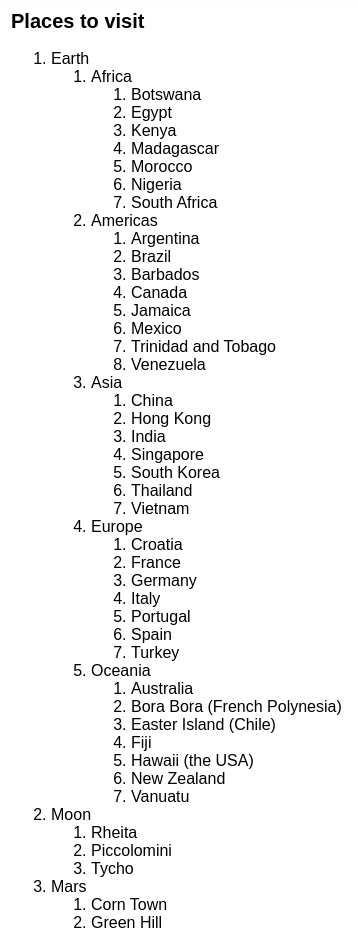

<!-- 0046.part.md -->

Теперь предположим, что вы хотите добавить кнопку для удаления места, которое вы уже посетили. Как бы вы это сделали? [Обновление состояния вложенных объектов](updating-objects-in-state.md#updating-a-nested-object) включает создание копий объектов по всей цепочке вверх от той части, которая изменилась. Удаление глубоко вложенного места потребует копирования всей цепочки родительских мест. Такой код может быть очень многословным.

**Если состояние слишком вложенное, чтобы его можно было легко обновить, подумайте о том, чтобы сделать его "плоским".** Вот один из способов реструктуризации этих данных. Вместо древовидной структуры, где каждое `место` имеет массив _его дочерних мест_, вы можете сделать так, чтобы каждое место содержало массив _идентификаторов дочерних мест_. Затем хранить отображение от каждого идентификатора места к соответствующему месту.

Такая реструктуризация данных может напомнить вам таблицу базы данных:

<!-- 0047.part.md -->

=== "App.js"

    <div markdown style="max-height: 400px; overflow-y: auto;">

    ```js
    import { useState } from 'react';
    import { initialTravelPlan } from './places.js';

    function PlaceTree({ id, placesById }) {
    	const place = placesById[id];
    	const childIds = place.childIds;
    	return (
    		<li>
    			{place.title}
    			{childIds.length > 0 && (
    				<ol>
    					{childIds.map((childId) => (
    						<PlaceTree
    							key={childId}
    							id={childId}
    							placesById={placesById}
    						/>
    					))}
    				</ol>
    			)}
    		</li>
    	);
    }

    export default function TravelPlan() {
    	const [plan, setPlan] = useState(initialTravelPlan);
    	const root = plan[0];
    	const planetIds = root.childIds;
    	return (
    		<>
    			<h2>Places to visit</h2>
    			<ol>
    				{planetIds.map((id) => (
    					<PlaceTree
    						key={id}
    						id={id}
    						placesById={plan}
    					/>
    				))}
    			</ol>
    		</>
    	);
    }
    ```

    </div>

=== "places.js"

    <div markdown style="max-height: 400px; overflow-y: auto;">

    ```js
    export const initialTravelPlan = {
    	0: {
    		id: 0,
    		title: '(Root)',
    		childIds: [1, 43, 47],
    	},
    	1: {
    		id: 1,
    		title: 'Earth',
    		childIds: [2, 10, 19, 27, 35],
    	},
    	2: {
    		id: 2,
    		title: 'Africa',
    		childIds: [3, 4, 5, 6, 7, 8, 9],
    	},
    	3: {
    		id: 3,
    		title: 'Botswana',
    		childIds: [],
    	},
    	4: {
    		id: 4,
    		title: 'Egypt',
    		childIds: [],
    	},
    	5: {
    		id: 5,
    		title: 'Kenya',
    		childIds: [],
    	},
    	6: {
    		id: 6,
    		title: 'Madagascar',
    		childIds: [],
    	},
    	7: {
    		id: 7,
    		title: 'Morocco',
    		childIds: [],
    	},
    	8: {
    		id: 8,
    		title: 'Nigeria',
    		childIds: [],
    	},
    	9: {
    		id: 9,
    		title: 'South Africa',
    		childIds: [],
    	},
    	10: {
    		id: 10,
    		title: 'Americas',
    		childIds: [11, 12, 13, 14, 15, 16, 17, 18],
    	},
    	11: {
    		id: 11,
    		title: 'Argentina',
    		childIds: [],
    	},
    	12: {
    		id: 12,
    		title: 'Brazil',
    		childIds: [],
    	},
    	13: {
    		id: 13,
    		title: 'Barbados',
    		childIds: [],
    	},
    	14: {
    		id: 14,
    		title: 'Canada',
    		childIds: [],
    	},
    	15: {
    		id: 15,
    		title: 'Jamaica',
    		childIds: [],
    	},
    	16: {
    		id: 16,
    		title: 'Mexico',
    		childIds: [],
    	},
    	17: {
    		id: 17,
    		title: 'Trinidad and Tobago',
    		childIds: [],
    	},
    	18: {
    		id: 18,
    		title: 'Venezuela',
    		childIds: [],
    	},
    	19: {
    		id: 19,
    		title: 'Asia',
    		childIds: [20, 21, 22, 23, 24, 25, 26],
    	},
    	20: {
    		id: 20,
    		title: 'China',
    		childIds: [],
    	},
    	21: {
    		id: 21,
    		title: 'Hong Kong',
    		childIds: [],
    	},
    	22: {
    		id: 22,
    		title: 'India',
    		childIds: [],
    	},
    	23: {
    		id: 23,
    		title: 'Singapore',
    		childIds: [],
    	},
    	24: {
    		id: 24,
    		title: 'South Korea',
    		childIds: [],
    	},
    	25: {
    		id: 25,
    		title: 'Thailand',
    		childIds: [],
    	},
    	26: {
    		id: 26,
    		title: 'Vietnam',
    		childIds: [],
    	},
    	27: {
    		id: 27,
    		title: 'Europe',
    		childIds: [28, 29, 30, 31, 32, 33, 34],
    	},
    	28: {
    		id: 28,
    		title: 'Croatia',
    		childIds: [],
    	},
    	29: {
    		id: 29,
    		title: 'France',
    		childIds: [],
    	},
    	30: {
    		id: 30,
    		title: 'Germany',
    		childIds: [],
    	},
    	31: {
    		id: 31,
    		title: 'Italy',
    		childIds: [],
    	},
    	32: {
    		id: 32,
    		title: 'Portugal',
    		childIds: [],
    	},
    	33: {
    		id: 33,
    		title: 'Spain',
    		childIds: [],
    	},
    	34: {
    		id: 34,
    		title: 'Turkey',
    		childIds: [],
    	},
    	35: {
    		id: 35,
    		title: 'Oceania',
    		childIds: [36, 37, 38, 39, 40, 41, 42],
    	},
    	36: {
    		id: 36,
    		title: 'Australia',
    		childIds: [],
    	},
    	37: {
    		id: 37,
    		title: 'Bora Bora (French Polynesia)',
    		childIds: [],
    	},
    	38: {
    		id: 38,
    		title: 'Easter Island (Chile)',
    		childIds: [],
    	},
    	39: {
    		id: 39,
    		title: 'Fiji',
    		childIds: [],
    	},
    	40: {
    		id: 40,
    		title: 'Hawaii (the USA)',
    		childIds: [],
    	},
    	41: {
    		id: 41,
    		title: 'New Zealand',
    		childIds: [],
    	},
    	42: {
    		id: 42,
    		title: 'Vanuatu',
    		childIds: [],
    	},
    	43: {
    		id: 43,
    		title: 'Moon',
    		childIds: [44, 45, 46],
    	},
    	44: {
    		id: 44,
    		title: 'Rheita',
    		childIds: [],
    	},
    	45: {
    		id: 45,
    		title: 'Piccolomini',
    		childIds: [],
    	},
    	46: {
    		id: 46,
    		title: 'Tycho',
    		childIds: [],
    	},
    	47: {
    		id: 47,
    		title: 'Mars',
    		childIds: [48, 49],
    	},
    	48: {
    		id: 48,
    		title: 'Corn Town',
    		childIds: [],
    	},
    	49: {
    		id: 49,
    		title: 'Green Hill',
    		childIds: [],
    	},
    };
    ```

    </div>

=== "Результат"

    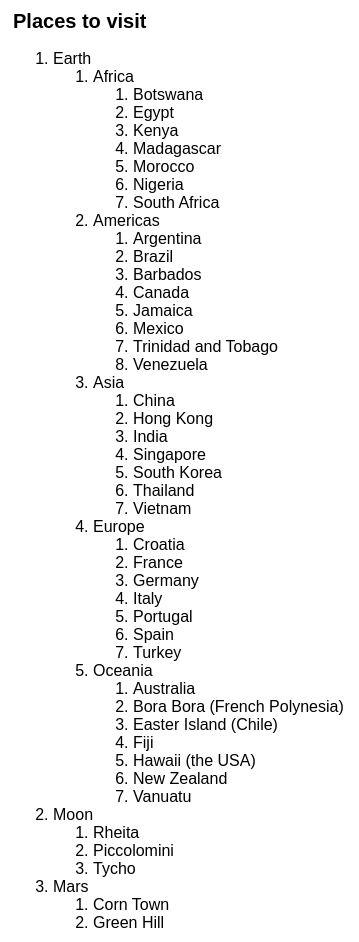

**Теперь, когда состояние "плоское" (также известное как "нормализованное"), обновлять вложенные элементы стало проще.**.

Чтобы удалить место, теперь вам нужно обновить только два уровня состояния:

-   Обновленная версия _родительского_ места должна исключить удаленный ID из своего массива `childIds`.
-   Обновленная версия корневого объекта "table" должна включать обновленную версию родительского места.

Вот пример того, как это можно сделать:

<!-- 0051.part.md -->

=== "App.js"

    <div markdown style="max-height: 400px; overflow-y: auto;">

    ```js
    import { useState } from 'react';
    import { initialTravelPlan } from './places.js';

    export default function TravelPlan() {
    	const [plan, setPlan] = useState(initialTravelPlan);

    	function handleComplete(parentId, childId) {
    		const parent = plan[parentId];
    		// Create a new version of the parent place
    		// that doesn't include this child ID.
    		const nextParent = {
    			...parent,
    			childIds: parent.childIds.filter(
    				(id) => id !== childId
    			),
    		};
    		// Update the root state object...
    		setPlan({
    			...plan,
    			// ...so that it has the updated parent.
    			[parentId]: nextParent,
    		});
    	}

    	const root = plan[0];
    	const planetIds = root.childIds;
    	return (
    		<>
    			<h2>Places to visit</h2>
    			<ol>
    				{planetIds.map((id) => (
    					<PlaceTree
    						key={id}
    						id={id}
    						parentId={0}
    						placesById={plan}
    						onComplete={handleComplete}
    					/>
    				))}
    			</ol>
    		</>
    	);
    }

    function PlaceTree({
    	id,
    	parentId,
    	placesById,
    	onComplete,
    }) {
    	const place = placesById[id];
    	const childIds = place.childIds;
    	return (
    		<li>
    			{place.title}
    			<button
    				onClick={() => {
    					onComplete(parentId, id);
    				}}
    			>
    				Complete
    			</button>
    			{childIds.length > 0 && (
    				<ol>
    					{childIds.map((childId) => (
    						<PlaceTree
    							key={childId}
    							id={childId}
    							parentId={id}
    							placesById={placesById}
    							onComplete={onComplete}
    						/>
    					))}
    				</ol>
    			)}
    		</li>
    	);
    }
    ```

    </div>

=== "places.js"

    <div markdown style="max-height: 400px; overflow-y: auto;">

    ```js
    export const initialTravelPlan = {
    	0: {
    		id: 0,
    		title: '(Root)',
    		childIds: [1, 43, 47],
    	},
    	1: {
    		id: 1,
    		title: 'Earth',
    		childIds: [2, 10, 19, 27, 35],
    	},
    	2: {
    		id: 2,
    		title: 'Africa',
    		childIds: [3, 4, 5, 6, 7, 8, 9],
    	},
    	3: {
    		id: 3,
    		title: 'Botswana',
    		childIds: [],
    	},
    	4: {
    		id: 4,
    		title: 'Egypt',
    		childIds: [],
    	},
    	5: {
    		id: 5,
    		title: 'Kenya',
    		childIds: [],
    	},
    	6: {
    		id: 6,
    		title: 'Madagascar',
    		childIds: [],
    	},
    	7: {
    		id: 7,
    		title: 'Morocco',
    		childIds: [],
    	},
    	8: {
    		id: 8,
    		title: 'Nigeria',
    		childIds: [],
    	},
    	9: {
    		id: 9,
    		title: 'South Africa',
    		childIds: [],
    	},
    	10: {
    		id: 10,
    		title: 'Americas',
    		childIds: [11, 12, 13, 14, 15, 16, 17, 18],
    	},
    	11: {
    		id: 11,
    		title: 'Argentina',
    		childIds: [],
    	},
    	12: {
    		id: 12,
    		title: 'Brazil',
    		childIds: [],
    	},
    	13: {
    		id: 13,
    		title: 'Barbados',
    		childIds: [],
    	},
    	14: {
    		id: 14,
    		title: 'Canada',
    		childIds: [],
    	},
    	15: {
    		id: 15,
    		title: 'Jamaica',
    		childIds: [],
    	},
    	16: {
    		id: 16,
    		title: 'Mexico',
    		childIds: [],
    	},
    	17: {
    		id: 17,
    		title: 'Trinidad and Tobago',
    		childIds: [],
    	},
    	18: {
    		id: 18,
    		title: 'Venezuela',
    		childIds: [],
    	},
    	19: {
    		id: 19,
    		title: 'Asia',
    		childIds: [20, 21, 22, 23, 24, 25, 26],
    	},
    	20: {
    		id: 20,
    		title: 'China',
    		childIds: [],
    	},
    	21: {
    		id: 21,
    		title: 'Hong Kong',
    		childIds: [],
    	},
    	22: {
    		id: 22,
    		title: 'India',
    		childIds: [],
    	},
    	23: {
    		id: 23,
    		title: 'Singapore',
    		childIds: [],
    	},
    	24: {
    		id: 24,
    		title: 'South Korea',
    		childIds: [],
    	},
    	25: {
    		id: 25,
    		title: 'Thailand',
    		childIds: [],
    	},
    	26: {
    		id: 26,
    		title: 'Vietnam',
    		childIds: [],
    	},
    	27: {
    		id: 27,
    		title: 'Europe',
    		childIds: [28, 29, 30, 31, 32, 33, 34],
    	},
    	28: {
    		id: 28,
    		title: 'Croatia',
    		childIds: [],
    	},
    	29: {
    		id: 29,
    		title: 'France',
    		childIds: [],
    	},
    	30: {
    		id: 30,
    		title: 'Germany',
    		childIds: [],
    	},
    	31: {
    		id: 31,
    		title: 'Italy',
    		childIds: [],
    	},
    	32: {
    		id: 32,
    		title: 'Portugal',
    		childIds: [],
    	},
    	33: {
    		id: 33,
    		title: 'Spain',
    		childIds: [],
    	},
    	34: {
    		id: 34,
    		title: 'Turkey',
    		childIds: [],
    	},
    	35: {
    		id: 35,
    		title: 'Oceania',
    		childIds: [36, 37, 38, 39, 40, 41, , 42],
    	},
    	36: {
    		id: 36,
    		title: 'Australia',
    		childIds: [],
    	},
    	37: {
    		id: 37,
    		title: 'Bora Bora (French Polynesia)',
    		childIds: [],
    	},
    	38: {
    		id: 38,
    		title: 'Easter Island (Chile)',
    		childIds: [],
    	},
    	39: {
    		id: 39,
    		title: 'Fiji',
    		childIds: [],
    	},
    	40: {
    		id: 40,
    		title: 'Hawaii (the USA)',
    		childIds: [],
    	},
    	41: {
    		id: 41,
    		title: 'New Zealand',
    		childIds: [],
    	},
    	42: {
    		id: 42,
    		title: 'Vanuatu',
    		childIds: [],
    	},
    	43: {
    		id: 43,
    		title: 'Moon',
    		childIds: [44, 45, 46],
    	},
    	44: {
    		id: 44,
    		title: 'Rheita',
    		childIds: [],
    	},
    	45: {
    		id: 45,
    		title: 'Piccolomini',
    		childIds: [],
    	},
    	46: {
    		id: 46,
    		title: 'Tycho',
    		childIds: [],
    	},
    	47: {
    		id: 47,
    		title: 'Mars',
    		childIds: [48, 49],
    	},
    	48: {
    		id: 48,
    		title: 'Corn Town',
    		childIds: [],
    	},
    	49: {
    		id: 49,
    		title: 'Green Hill',
    		childIds: [],
    	},
    };
    ```

    </div>

=== "Результат"

    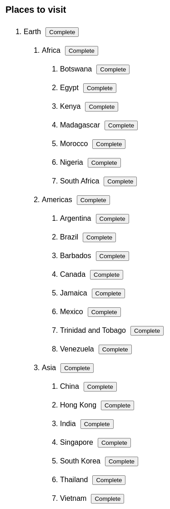

<!-- 0056.part.md -->

Вкладывать состояние можно сколько угодно, но если сделать его "плоским", это решит множество проблем. Это облегчает обновление состояния и помогает избежать дублирования в различных частях вложенного объекта.

!!!note "Улучшение использования памяти"

    В идеале, для улучшения использования памяти вы также должны удалить удаленные элементы (и их детей!) из объекта "table". В данной версии это сделано. Она также [использует Immer](updating-objects-in-state.md#write-concise-update-logic-with-immer), чтобы сделать логику обновления более лаконичной.

    <!-- 0057.part.md -->

    === "App.js"

    	<div markdown style="max-height: 400px; overflow-y: auto;">

    	```js
    	import { useImmer } from 'use-immer';
    	import { initialTravelPlan } from './places.js';

    	export default function TravelPlan() {
    		const [plan, updatePlan] = useImmer(initialTravelPlan);

    		function handleComplete(parentId, childId) {
    			updatePlan((draft) => {
    				// Remove from the parent place's child IDs.
    				const parent = draft[parentId];
    				parent.childIds = parent.childIds.filter(
    					(id) => id !== childId
    				);

    				// Forget this place and all its subtree.
    				deleteAllChildren(childId);
    				function deleteAllChildren(id) {
    					const place = draft[id];
    					place.childIds.forEach(deleteAllChildren);
    					delete draft[id];
    				}
    			});
    		}

    		const root = plan[0];
    		const planetIds = root.childIds;
    		return (
    			<>
    				<h2>Places to visit</h2>
    				<ol>
    					{planetIds.map((id) => (
    						<PlaceTree
    							key={id}
    							id={id}
    							parentId={0}
    							placesById={plan}
    							onComplete={handleComplete}
    						/>
    					))}
    				</ol>
    			</>
    		);
    	}

    	function PlaceTree({
    		id,
    		parentId,
    		placesById,
    		onComplete,
    	}) {
    		const place = placesById[id];
    		const childIds = place.childIds;
    		return (
    			<li>
    				{place.title}
    				<button
    					onClick={() => {
    						onComplete(parentId, id);
    					}}
    				>
    					Complete
    				</button>
    				{childIds.length > 0 && (
    					<ol>
    						{childIds.map((childId) => (
    							<PlaceTree
    								key={childId}
    								id={childId}
    								parentId={id}
    								placesById={placesById}
    								onComplete={onComplete}
    							/>
    						))}
    					</ol>
    				)}
    			</li>
    		);
    	}
    	```

    	</div>

    === "places.js"

    	<div markdown style="max-height: 400px; overflow-y: auto;">

    	```js
    	export const initialTravelPlan = {
    		0: {
    			id: 0,
    			title: '(Root)',
    			childIds: [1, 43, 47],
    		},
    		1: {
    			id: 1,
    			title: 'Earth',
    			childIds: [2, 10, 19, 27, 35],
    		},
    		2: {
    			id: 2,
    			title: 'Africa',
    			childIds: [3, 4, 5, 6, 7, 8, 9],
    		},
    		3: {
    			id: 3,
    			title: 'Botswana',
    			childIds: [],
    		},
    		4: {
    			id: 4,
    			title: 'Egypt',
    			childIds: [],
    		},
    		5: {
    			id: 5,
    			title: 'Kenya',
    			childIds: [],
    		},
    		6: {
    			id: 6,
    			title: 'Madagascar',
    			childIds: [],
    		},
    		7: {
    			id: 7,
    			title: 'Morocco',
    			childIds: [],
    		},
    		8: {
    			id: 8,
    			title: 'Nigeria',
    			childIds: [],
    		},
    		9: {
    			id: 9,
    			title: 'South Africa',
    			childIds: [],
    		},
    		10: {
    			id: 10,
    			title: 'Americas',
    			childIds: [11, 12, 13, 14, 15, 16, 17, 18],
    		},
    		11: {
    			id: 11,
    			title: 'Argentina',
    			childIds: [],
    		},
    		12: {
    			id: 12,
    			title: 'Brazil',
    			childIds: [],
    		},
    		13: {
    			id: 13,
    			title: 'Barbados',
    			childIds: [],
    		},
    		14: {
    			id: 14,
    			title: 'Canada',
    			childIds: [],
    		},
    		15: {
    			id: 15,
    			title: 'Jamaica',
    			childIds: [],
    		},
    		16: {
    			id: 16,
    			title: 'Mexico',
    			childIds: [],
    		},
    		17: {
    			id: 17,
    			title: 'Trinidad and Tobago',
    			childIds: [],
    		},
    		18: {
    			id: 18,
    			title: 'Venezuela',
    			childIds: [],
    		},
    		19: {
    			id: 19,
    			title: 'Asia',
    			childIds: [20, 21, 22, 23, 24, 25, 26],
    		},
    		20: {
    			id: 20,
    			title: 'China',
    			childIds: [],
    		},
    		21: {
    			id: 21,
    			title: 'Hong Kong',
    			childIds: [],
    		},
    		22: {
    			id: 22,
    			title: 'India',
    			childIds: [],
    		},
    		23: {
    			id: 23,
    			title: 'Singapore',
    			childIds: [],
    		},
    		24: {
    			id: 24,
    			title: 'South Korea',
    			childIds: [],
    		},
    		25: {
    			id: 25,
    			title: 'Thailand',
    			childIds: [],
    		},
    		26: {
    			id: 26,
    			title: 'Vietnam',
    			childIds: [],
    		},
    		27: {
    			id: 27,
    			title: 'Europe',
    			childIds: [28, 29, 30, 31, 32, 33, 34],
    		},
    		28: {
    			id: 28,
    			title: 'Croatia',
    			childIds: [],
    		},
    		29: {
    			id: 29,
    			title: 'France',
    			childIds: [],
    		},
    		30: {
    			id: 30,
    			title: 'Germany',
    			childIds: [],
    		},
    		31: {
    			id: 31,
    			title: 'Italy',
    			childIds: [],
    		},
    		32: {
    			id: 32,
    			title: 'Portugal',
    			childIds: [],
    		},
    		33: {
    			id: 33,
    			title: 'Spain',
    			childIds: [],
    		},
    		34: {
    			id: 34,
    			title: 'Turkey',
    			childIds: [],
    		},
    		35: {
    			id: 35,
    			title: 'Oceania',
    			childIds: [36, 37, 38, 39, 40, 41, , 42],
    		},
    		36: {
    			id: 36,
    			title: 'Australia',
    			childIds: [],
    		},
    		37: {
    			id: 37,
    			title: 'Bora Bora (French Polynesia)',
    			childIds: [],
    		},
    		38: {
    			id: 38,
    			title: 'Easter Island (Chile)',
    			childIds: [],
    		},
    		39: {
    			id: 39,
    			title: 'Fiji',
    			childIds: [],
    		},
    		40: {
    			id: 40,
    			title: 'Hawaii (the USA)',
    			childIds: [],
    		},
    		41: {
    			id: 41,
    			title: 'New Zealand',
    			childIds: [],
    		},
    		42: {
    			id: 42,
    			title: 'Vanuatu',
    			childIds: [],
    		},
    		43: {
    			id: 43,
    			title: 'Moon',
    			childIds: [44, 45, 46],
    		},
    		44: {
    			id: 44,
    			title: 'Rheita',
    			childIds: [],
    		},
    		45: {
    			id: 45,
    			title: 'Piccolomini',
    			childIds: [],
    		},
    		46: {
    			id: 46,
    			title: 'Tycho',
    			childIds: [],
    		},
    		47: {
    			id: 47,
    			title: 'Mars',
    			childIds: [48, 49],
    		},
    		48: {
    			id: 48,
    			title: 'Corn Town',
    			childIds: [],
    		},
    		49: {
    			id: 49,
    			title: 'Green Hill',
    			childIds: [],
    		},
    	};
    	```

    	</div>

    === "package.json"

    	```json
    	{
    		"dependencies": {
    			"immer": "1.7.3",
    			"react": "latest",
    			"react-dom": "latest",
    			"react-scripts": "latest",
    			"use-immer": "0.5.1"
    		},
    		"scripts": {
    			"start": "react-scripts start",
    			"build": "react-scripts build",
    			"test": "react-scripts test --env=jsdom",
    			"eject": "react-scripts eject"
    		},
    		"devDependencies": {}
    	}
    	```

    === "Результат"

    	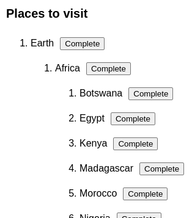

Иногда вложенность состояния можно уменьшить, переместив часть вложенного состояния в дочерние компоненты. Это хорошо работает для эфемерного состояния пользовательского интерфейса, которое не нужно хранить, например, наведение курсора на элемент.

!!!note "Итоги"

    -   Если две переменные состояния всегда обновляются вместе, подумайте о том, чтобы объединить их в одну.
    -   Тщательно выбирайте переменные состояния, чтобы избежать создания "невозможных" состояний.
    -   Структурируйте состояние таким образом, чтобы уменьшить вероятность ошибки при его обновлении.
    -   Избегайте избыточных и дублирующих состояний, чтобы не нужно было их синхронизировать.
    -   Не помещайте реквизиты _в_ состояние, если только вы специально не хотите предотвратить их обновление.
    -   Для шаблонов пользовательского интерфейса, таких как выбор, храните ID или индекс в состоянии, а не сам объект.
    -   Если обновление глубоко вложенного состояния является сложным, попробуйте сгладить его.

## Задачи

### 1. Исправление компонента, который не обновляется

Этот компонент `Clock` получает два реквизита: `color` и `time`. Когда вы выбираете другой цвет в поле выбора, компонент `Clock` получает другой реквизит `color` от своего родительского компонента. Однако по какой-то причине отображаемый цвет не обновляется. Почему? Устраните проблему.

<!-- 0065.part.md -->

=== "Clock.js"

    ```js
    import { useState } from 'react';

    export default function Clock(props) {
    	const [color, setColor] = useState(props.color);
    	return <h1 style={{ color: color }}>{props.time}</h1>;
    }
    ```

=== "Результат"

    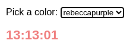

???success "Показать решение"

    Проблема в том, что у этого компонента состояние `color` инициализируется начальным значением свойства `color`. Но когда реквизит `color` изменяется, это не влияет на переменную состояния! Поэтому они рассинхронизируются. Чтобы решить эту проблему, удалите переменную state совсем и используйте непосредственно реквизит `color`.

    === "Clock.js"

    	```js
    	import { useState } from 'react';

    	export default function Clock(props) {
    		return (
    			<h1 style={{ color: props.color }}>{props.time}</h1>
    		);
    	}
    	```

    === "Результат"

    	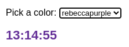

    Или, используя синтаксис деструктуризации:

    === "Clock.js"

    	```js
    	import { useState } from 'react';

    	export default function Clock({ color, time }) {
    		return <h1 style={{ color: color }}>{time}</h1>;
    	}
    	```

    === "Результат"

    	

### 2. Исправьте сломанный упаковочный лист

Этот упаковочный лист имеет нижний колонтитул, который показывает, сколько предметов упаковано, и сколько предметов в целом. Поначалу кажется, что это работает, но на самом деле это ошибка. Например, если вы пометите предмет как упакованный, а затем удалите его, счетчик не будет обновлен правильно. Исправьте счетчик так, чтобы он всегда был корректным.

=== "App.js"

    <div markdown style="max-height: 400px; overflow-y: auto;">

    ```js
    import { useState } from 'react';
    import AddItem from './AddItem.js';
    import PackingList from './PackingList.js';

    let nextId = 3;
    const initialItems = [
    	{ id: 0, title: 'Warm socks', packed: true },
    	{ id: 1, title: 'Travel journal', packed: false },
    	{ id: 2, title: 'Watercolors', packed: false },
    ];

    export default function TravelPlan() {
    	const [items, setItems] = useState(initialItems);
    	const [total, setTotal] = useState(3);
    	const [packed, setPacked] = useState(1);

    	function handleAddItem(title) {
    		setTotal(total + 1);
    		setItems([
    			...items,
    			{
    				id: nextId++,
    				title: title,
    				packed: false,
    			},
    		]);
    	}

    	function handleChangeItem(nextItem) {
    		if (nextItem.packed) {
    			setPacked(packed + 1);
    		} else {
    			setPacked(packed - 1);
    		}
    		setItems(
    			items.map((item) => {
    				if (item.id === nextItem.id) {
    					return nextItem;
    				} else {
    					return item;
    				}
    			})
    		);
    	}

    	function handleDeleteItem(itemId) {
    		setTotal(total - 1);
    		setItems(
    			items.filter((item) => item.id !== itemId)
    		);
    	}

    	return (
    		<>
    			<AddItem onAddItem={handleAddItem} />
    			<PackingList
    				items={items}
    				onChangeItem={handleChangeItem}
    				onDeleteItem={handleDeleteItem}
    			/>
    			<hr />
    			<b>
    				{packed} out of {total} packed!
    			</b>
    		</>
    	);
    }
    ```

    </div>

=== "Результат"

    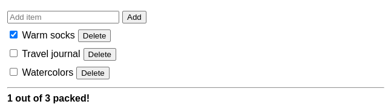

???tip "Показать подсказку"

    Является ли какое-либо состояние в этом примере избыточным?

???success "Показать подсказку"

    Хотя вы могли бы тщательно изменить каждый обработчик событий, чтобы правильно обновлять счетчики `total` и `packed`, основная проблема заключается в том, что эти переменные состояния вообще существуют. Они избыточны, потому что вы всегда можете вычислить количество элементов (упакованных или всего) из массива `items`. Удалите избыточное состояние, чтобы исправить ошибку:

    === "App.js"

    	<div markdown style="max-height: 400px; overflow-y: auto;">

    	```js
    	import { useState } from 'react';
    	import AddItem from './AddItem.js';
    	import PackingList from './PackingList.js';

    	let nextId = 3;
    	const initialItems = [
    		{ id: 0, title: 'Warm socks', packed: true },
    		{ id: 1, title: 'Travel journal', packed: false },
    		{ id: 2, title: 'Watercolors', packed: false },
    	];

    	export default function TravelPlan() {
    		const [items, setItems] = useState(initialItems);

    		const total = items.length;
    		const packed = items.filter((item) => item.packed)
    			.length;

    		function handleAddItem(title) {
    			setItems([
    				...items,
    				{
    					id: nextId++,
    					title: title,
    					packed: false,
    				},
    			]);
    		}

    		function handleChangeItem(nextItem) {
    			setItems(
    				items.map((item) => {
    					if (item.id === nextItem.id) {
    						return nextItem;
    					} else {
    						return item;
    					}
    				})
    			);
    		}

    		function handleDeleteItem(itemId) {
    			setItems(
    				items.filter((item) => item.id !== itemId)
    			);
    		}

    		return (
    			<>
    				<AddItem onAddItem={handleAddItem} />
    				<PackingList
    					items={items}
    					onChangeItem={handleChangeItem}
    					onDeleteItem={handleDeleteItem}
    				/>
    				<hr />
    				<b>
    					{packed} out of {total} packed!
    				</b>
    			</>
    		);
    	}
    	```

    	</div>

    === "Результат"

    	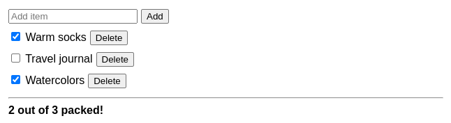

    Обратите внимание, что после этого изменения обработчики событий занимаются только вызовом `setItems`. Количество элементов теперь вычисляется во время следующего рендеринга из `items`, поэтому они всегда актуальны.

### 3. Исправление исчезающего выбора

Есть список `букв` в состоянии. Когда вы наводите курсор или фокус на определенную букву, она выделяется. Текущая выделенная буква хранится в переменной состояния `highlightedLetter`. Вы можете "выделять" и "снимать выделение" отдельных букв, что приводит к обновлению массива `letters` в состоянии.

Этот код работает, но есть небольшой сбой в пользовательском интерфейсе. Когда вы нажимаете "Star" или "Unstar", подсветка на мгновение исчезает. Однако она снова появляется, как только вы перемещаете указатель или переключаетесь на другую букву с клавиатуры. Почему это происходит? Исправьте это, чтобы подсветка не исчезала после нажатия кнопки.

=== "App.js"

    <div markdown style="max-height: 400px; overflow-y: auto;">

    ```js
    import { useState } from 'react';
    import { initialLetters } from './data.js';
    import Letter from './Letter.js';

    export default function MailClient() {
    	const [letters, setLetters] = useState(initialLetters);
    	const [
    		highlightedLetter,
    		setHighlightedLetter,
    	] = useState(null);

    	function handleHover(letter) {
    		setHighlightedLetter(letter);
    	}

    	function handleStar(starred) {
    		setLetters(
    			letters.map((letter) => {
    				if (letter.id === starred.id) {
    					return {
    						...letter,
    						isStarred: !letter.isStarred,
    					};
    				} else {
    					return letter;
    				}
    			})
    		);
    	}

    	return (
    		<>
    			<h2>Inbox</h2>
    			<ul>
    				{letters.map((letter) => (
    					<Letter
    						key={letter.id}
    						letter={letter}
    						isHighlighted={
    							letter === highlightedLetter
    						}
    						onHover={handleHover}
    						onToggleStar={handleStar}
    					/>
    				))}
    			</ul>
    		</>
    	);
    }
    ```

    </div>

=== "Letter.js"

    ```js
    export default function Letter({
    	letter,
    	isHighlighted,
    	onHover,
    	onToggleStar,
    }) {
    	return (
    		<li
    			className={isHighlighted ? 'highlighted' : ''}
    			onFocus={() => {
    				onHover(letter);
    			}}
    			onPointerMove={() => {
    				onHover(letter);
    			}}
    		>
    			<button
    				onClick={() => {
    					onToggleStar(letter);
    				}}
    			>
    				{letter.isStarred ? 'Unstar' : 'Star'}
    			</button>
    			{letter.subject}
    		</li>
    	);
    }
    ```

=== "data.js"

    ```js
    export const initialLetters = [
    	{
    		id: 0,
    		subject: 'Ready for adventure?',
    		isStarred: true,
    	},
    	{
    		id: 1,
    		subject: 'Time to check in!',
    		isStarred: false,
    	},
    	{
    		id: 2,
    		subject: 'Festival Begins in Just SEVEN Days!',
    		isStarred: false,
    	},
    ];
    ```

=== "Результат"

    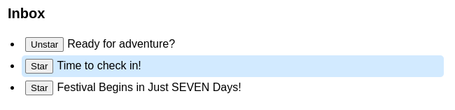

???success "Показать решение"

    Проблема в том, что вы храните объект буквы в `highlightedLetter`. Но вы также храните ту же информацию в массиве `letters`. Таким образом, ваше состояние дублируется! Когда вы обновляете массив `letters` после нажатия кнопки, вы создаете новый объект буквы, который отличается от `highlightedLetter`. Поэтому проверка `highlightedLetter === letter` становится `false`, и выделение исчезает. Оно снова появляется при следующем вызове `setHighlightedLetter`, когда указатель перемещается.

    Чтобы решить эту проблему, удалите дублирование из состояния. Вместо того чтобы хранить _саму букву_ в двух местах, храните `highlightedId`. Тогда вы сможете проверять `isHighlighted` для каждой буквы с `letter.id === highlightedId`, что будет работать, даже если объект `letter` изменился с момента последнего рендеринга.

    === "App.js"

    	<div markdown style="max-height: 400px; overflow-y: auto;">

    	```js
    	import { useState } from 'react';
    	import { initialLetters } from './data.js';
    	import Letter from './Letter.js';

    	export default function MailClient() {
    		const [letters, setLetters] = useState(initialLetters);
    		const [highlightedId, setHighlightedId] = useState(
    			null
    		);

    		function handleHover(letterId) {
    			setHighlightedId(letterId);
    		}

    		function handleStar(starredId) {
    			setLetters(
    				letters.map((letter) => {
    					if (letter.id === starredId) {
    						return {
    							...letter,
    							isStarred: !letter.isStarred,
    						};
    					} else {
    						return letter;
    					}
    				})
    			);
    		}

    		return (
    			<>
    				<h2>Inbox</h2>
    				<ul>
    					{letters.map((letter) => (
    						<Letter
    							key={letter.id}
    							letter={letter}
    							isHighlighted={
    								letter.id === highlightedId
    							}
    							onHover={handleHover}
    							onToggleStar={handleStar}
    						/>
    					))}
    				</ul>
    			</>
    		);
    	}
    	```

    	</div>

    === "Letter.js"

    	```js
    	export default function Letter({
    		letter,
    		isHighlighted,
    		onHover,
    		onToggleStar,
    	}) {
    		return (
    			<li
    				className={isHighlighted ? 'highlighted' : ''}
    				onFocus={() => {
    					onHover(letter.id);
    				}}
    				onPointerMove={() => {
    					onHover(letter.id);
    				}}
    			>
    				<button
    					onClick={() => {
    						onToggleStar(letter.id);
    					}}
    				>
    					{letter.isStarred ? 'Unstar' : 'Star'}
    				</button>
    				{letter.subject}
    			</li>
    		);
    	}
    	```

    === "data.js"

    	```js
    	export const initialLetters = [
    		{
    			id: 0,
    			subject: 'Ready for adventure?',
    			isStarred: true,
    		},
    		{
    			id: 1,
    			subject: 'Time to check in!',
    			isStarred: false,
    		},
    		{
    			id: 2,
    			subject: 'Festival Begins in Just SEVEN Days!',
    			isStarred: false,
    		},
    	];
    	```

    === "Результат"

    	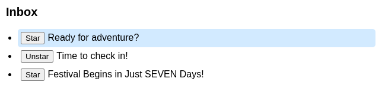

### 4. Реализация множественного выбора

В этом примере каждая `буква` имеет свойство `isSelected` и обработчик `onToggle`, который отмечает ее как выбранную. Это работает, но состояние хранится как `selectedId` (либо `null`, либо ID), поэтому в каждый момент времени может быть выбрана только одна буква.

Измените структуру состояния для поддержки множественного выбора (Как бы вы его структурировали? Подумайте об этом перед написанием кода). Каждый флажок должен стать независимым от других. Щелчок по выбранной букве должен снимать флажок. Наконец, нижний колонтитул должен показывать правильное количество выбранных элементов.

=== "App.js"

    <div markdown style="max-height: 400px; overflow-y: auto;">

    ```js
    import { useState } from 'react';
    import { letters } from './data.js';
    import Letter from './Letter.js';

    export default function MailClient() {
    	const [selectedId, setSelectedId] = useState(null);

    	// TODO: allow multiple selection
    	const selectedCount = 1;

    	function handleToggle(toggledId) {
    		// TODO: allow multiple selection
    		setSelectedId(toggledId);
    	}

    	return (
    		<>
    			<h2>Inbox</h2>
    			<ul>
    				{letters.map((letter) => (
    					<Letter
    						key={letter.id}
    						letter={letter}
    						isSelected={
    							// TODO: allow multiple selection
    							letter.id === selectedId
    						}
    						onToggle={handleToggle}
    					/>
    				))}
    				<hr />
    				<p>
    					<b>
    						You selected {selectedCount} letters
    					</b>
    				</p>
    			</ul>
    		</>
    	);
    }
    ```

    </div>

=== "Letter.js"

    ```js
    export default function Letter({
    	letter,
    	onToggle,
    	isSelected,
    }) {
    	return (
    		<li className={isSelected ? 'selected' : ''}>
    			<label>
    				<input
    					type="checkbox"
    					checked={isSelected}
    					onChange={() => {
    						onToggle(letter.id);
    					}}
    				/>
    				{letter.subject}
    			</label>
    		</li>
    	);
    }
    ```

=== "data.js"

    ```js
    export const letters = [
    	{
    		id: 0,
    		subject: 'Ready for adventure?',
    		isStarred: true,
    	},
    	{
    		id: 1,
    		subject: 'Time to check in!',
    		isStarred: false,
    	},
    	{
    		id: 2,
    		subject: 'Festival Begins in Just SEVEN Days!',
    		isStarred: false,
    	},
    ];
    ```

=== "Результат"

    

???tip "Показать подсказку"

    Вместо одного выбранного ID, вы можете захотеть хранить массив или [Set](https://developer.mozilla.org/docs/Web/JavaScript/Reference/Global_Objects/Set) выбранных ID в состоянии.

???success "Показать решение"

    Вместо одного `selectedId`, храните `selectedIds` _массив_ в состоянии. Например, если вы выбираете первую и последнюю буквы, он будет содержать `[0, 2]`. Когда ничего не выбрано, это будет пустой массив `[]`:

    === "App.js"

    	<div markdown style="max-height: 400px; overflow-y: auto;">

    	```js
    	import { useState } from 'react';
    	import { letters } from './data.js';
    	import Letter from './Letter.js';

    	export default function MailClient() {
    		const [selectedIds, setSelectedIds] = useState([]);

    		const selectedCount = selectedIds.length;

    		function handleToggle(toggledId) {
    			// Was it previously selected?
    			if (selectedIds.includes(toggledId)) {
    				// Then remove this ID from the array.
    				setSelectedIds(
    					selectedIds.filter((id) => id !== toggledId)
    				);
    			} else {
    				// Otherwise, add this ID to the array.
    				setSelectedIds([...selectedIds, toggledId]);
    			}
    		}

    		return (
    			<>
    				<h2>Inbox</h2>
    				<ul>
    					{letters.map((letter) => (
    						<Letter
    							key={letter.id}
    							letter={letter}
    							isSelected={selectedIds.includes(
    								letter.id
    							)}
    							onToggle={handleToggle}
    						/>
    					))}
    					<hr />
    					<p>
    						<b>
    							You selected {selectedCount} letters
    						</b>
    					</p>
    				</ul>
    			</>
    		);
    	}
    	```

    	</div>

    === "Letter.js"

    	```js
    	export default function Letter({
    		letter,
    		onToggle,
    		isSelected,
    	}) {
    		return (
    			<li className={isSelected ? 'selected' : ''}>
    				<label>
    					<input
    						type="checkbox"
    						checked={isSelected}
    						onChange={() => {
    							onToggle(letter.id);
    						}}
    					/>
    					{letter.subject}
    				</label>
    			</li>
    		);
    	}
    	```

    === "data.js"

    	```js
    	export const letters = [
    		{
    			id: 0,
    			subject: 'Ready for adventure?',
    			isStarred: true,
    		},
    		{
    			id: 1,
    			subject: 'Time to check in!',
    			isStarred: false,
    		},
    		{
    			id: 2,
    			subject: 'Festival Begins in Just SEVEN Days!',
    			isStarred: false,
    		},
    	];
    	```

    === "Результат"

    	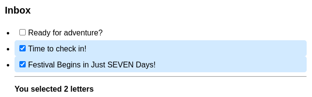

    Одним из небольших недостатков использования массива является то, что для каждого элемента вы вызываете `selectedIds.includes(letter.id)`, чтобы проверить, выбран ли он. Если массив очень большой, это может стать проблемой производительности, поскольку поиск в массиве с помощью [`includes()`](https://developer.mozilla.org/docs/Web/JavaScript/Reference/Global_Objects/Array/includes) занимает линейное время, а вы выполняете этот поиск для каждого отдельного элемента.

    Чтобы решить эту проблему, вы можете держать в состоянии [Set](https://developer.mozilla.org/docs/Web/JavaScript/Reference/Global_Objects/Set), что обеспечивает быструю операцию [`has()`](https://developer.mozilla.org/docs/Web/JavaScript/Reference/Global_Objects/Set/has):

    === "App.js"

    	<div markdown style="max-height: 400px; overflow-y: auto;">

    	```js
    	import { useState } from 'react';
    	import { letters } from './data.js';
    	import Letter from './Letter.js';

    	export default function MailClient() {
    		const [selectedIds, setSelectedIds] = useState(
    			new Set()
    		);

    		const selectedCount = selectedIds.size;

    		function handleToggle(toggledId) {
    			// Create a copy (to avoid mutation).
    			const nextIds = new Set(selectedIds);
    			if (nextIds.has(toggledId)) {
    				nextIds.delete(toggledId);
    			} else {
    				nextIds.add(toggledId);
    			}
    			setSelectedIds(nextIds);
    		}

    		return (
    			<>
    				<h2>Inbox</h2>
    				<ul>
    					{letters.map((letter) => (
    						<Letter
    							key={letter.id}
    							letter={letter}
    							isSelected={selectedIds.has(
    								letter.id
    							)}
    							onToggle={handleToggle}
    						/>
    					))}
    					<hr />
    					<p>
    						<b>
    							You selected {selectedCount} letters
    						</b>
    					</p>
    				</ul>
    			</>
    		);
    	}
    	```

    	</div>

    === "Letter.js"

    	```js
    	export default function Letter({
    		letter,
    		onToggle,
    		isSelected,
    	}) {
    		return (
    			<li className={isSelected ? 'selected' : ''}>
    				<label>
    					<input
    						type="checkbox"
    						checked={isSelected}
    						onChange={() => {
    							onToggle(letter.id);
    						}}
    					/>
    					{letter.subject}
    				</label>
    			</li>
    		);
    	}
    	```

    === "data.js"

    	```js
    	export const letters = [
    		{
    			id: 0,
    			subject: 'Ready for adventure?',
    			isStarred: true,
    		},
    		{
    			id: 1,
    			subject: 'Time to check in!',
    			isStarred: false,
    		},
    		{
    			id: 2,
    			subject: 'Festival Begins in Just SEVEN Days!',
    			isStarred: false,
    		},
    	];
    	```

    === "Результат"

    	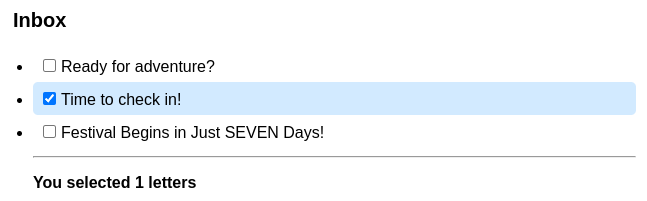

    Теперь каждый элемент выполняет проверку `selectedIds.has(letter.id)`, что очень быстро.

    Помните, что [не следует мутировать объекты в состоянии](updating-objects-in-state.md), и это относится и к наборам. Вот почему функция `handleToggle` сначала создает _копию_ набора, а затем обновляет эту копию.

## Ссылки

-   [https://react.dev/learn/choosing-the-state-structure](https://react.dev/learn/choosing-the-state-structure)
