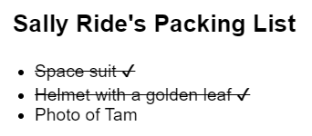
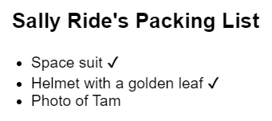
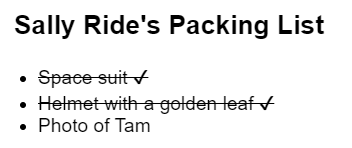
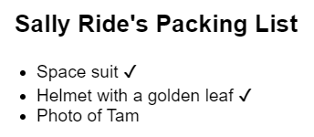
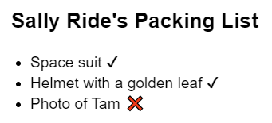
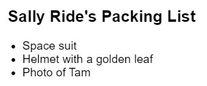
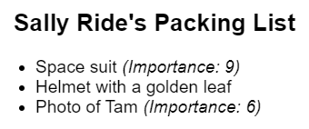
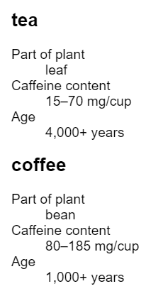
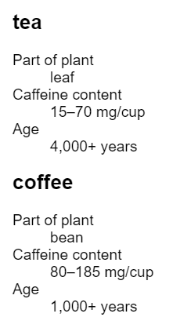
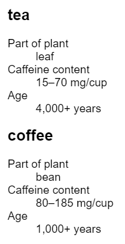

# Условное рендеринг

Ваши компоненты часто должны отображать разные вещи в зависимости от различных условий. В React вы можете условно выводить JSX, используя синтаксис JavaScript, такой как операторы `if`, `&&` и `? :`.

!!!tip "Вы узнаете"

    -   Как возвращать различные JSX в зависимости от условия
    -   Как условно включить или исключить фрагмент JSX
    -   Общие сокращения условного синтаксиса, которые вы можете встретить в кодовых базах React

## Условное возвращение JSX

Допустим, у вас есть компонент `PackingList`, отображающий несколько `Item`, которые могут быть помечены как упакованные или нет:

<!-- 0001.part.md -->

=== "App.js"

    ```js
    function Item({ name, isPacked }) {
    	return <li className="item">{name}</li>;
    }

    export default function PackingList() {
    	return (
    		<section>
    			<h1>Sally Ride's Packing List</h1>
    			<ul>
    				<Item isPacked={true} name="Space suit" />
    				<Item
    					isPacked={true}
    					name="Helmet with a golden leaf"
    				/>
    				<Item
    					isPacked={false}
    					name="Photo of Tam"
    				/>
    			</ul>
    		</section>
    	);
    }
    ```

=== "Результат"

    

<!-- 0002.part.md -->

Обратите внимание, что у некоторых компонентов `Item` свойство `isPacked` установлено в `true` вместо `false`. Вы хотите добавить галочку (✔) к упакованным элементам, если `isPacked={true}`.

Вы можете написать это в виде [`if/else` оператора](https://developer.mozilla.org/en-US/docs/Web/JavaScript/Reference/Statements/if...else), например, так:

<!-- 0003.part.md -->

```js
if (isPacked) {
    return <li className="item">{name} ✔</li>;
}
return <li className="item">{name}</li>;
```

<!-- 0004.part.md -->

Если параметр `isPacked` имеет значение `true`, этот код **возвращает другое JSX-дерево.** С этим изменением некоторые элементы получают галочку в конце:

<!-- 0005.part.md -->

=== "App.js"

    ```js
    function Item({ name, isPacked }) {
    	if (isPacked) {
    		return <li className="item">{name} ✔</li>;
    	}
    	return <li className="item">{name}</li>;
    }

    export default function PackingList() {
    	return (
    		<section>
    			<h1>Sally Ride's Packing List</h1>
    			<ul>
    				<Item isPacked={true} name="Space suit" />
    				<Item
    					isPacked={true}
    					name="Helmet with a golden leaf"
    				/>
    				<Item
    					isPacked={false}
    					name="Photo of Tam"
    				/>
    			</ul>
    		</section>
    	);
    }
    ```

=== "Результат"

    

<!-- 0006.part.md -->

Попробуйте изменить то, что будет возвращено в любом случае, и посмотрите, как изменится результат!

Обратите внимание, как вы создаете разветвленную логику с помощью операторов JavaScript `if` и `return`. В React поток управления (как и условия) обрабатывается JavaScript.

### Условное возвращение ничего с `null`

В некоторых ситуациях вы вообще не захотите ничего выводить. Например, вы не хотите показывать упакованные элементы вообще. Компонент должен что-то возвращать. В этом случае вы можете вернуть `null`:

<!-- 0007.part.md -->

```js
if (isPacked) {
    return null;
}
return <li className="item">{name}</li>;
```

<!-- 0008.part.md -->

Если `isPacked` истинно, компонент не вернет ничего, `null`. В противном случае он вернет JSX для рендеринга.

<!-- 0009.part.md -->

=== "App.js"

    ```js
    function Item({ name, isPacked }) {
    	if (isPacked) {
    		return null;
    	}
    	return <li className="item">{name}</li>;
    }

    export default function PackingList() {
    	return (
    		<section>
    			<h1>Sally Ride's Packing List</h1>
    			<ul>
    				<Item isPacked={true} name="Space suit" />
    				<Item
    					isPacked={true}
    					name="Helmet with a golden leaf"
    				/>
    				<Item
    					isPacked={false}
    					name="Photo of Tam"
    				/>
    			</ul>
    		</section>
    	);
    }
    ```

=== "Результат"

    

<!-- 0010.part.md -->

На практике возврат `null` из компонента не является обычным делом, поскольку это может удивить разработчика, пытающегося его отобразить. Чаще всего вы условно включаете или исключаете компонент в JSX родительского компонента. Вот как это сделать!

## Условное включение JSX

В предыдущем примере вы контролировали, какое (если вообще!) дерево JSX будет возвращено компонентом. Возможно, вы уже заметили дублирование в выводе рендера:

<!-- 0011.part.md -->

```js
<li className="item">{name} ✔</li>
```

<!-- 0012.part.md -->

очень похожа на

<!-- 0013.part.md -->

```js
<li className="item">{name}</li>
```

<!-- 0014.part.md -->

Обе условные ветви возвращают `<li className="item">...</li>`:

<!-- 0015.part.md -->

```js
if (isPacked) {
    return <li className="item">{name} ✔</li>;
}
return <li className="item">{name}</li>;
```

<!-- 0016.part.md -->

Хотя такое дублирование не вредно, оно может усложнить сопровождение вашего кода. Что если вы захотите изменить `className`? Вам придется делать это в двух местах в вашем коде! В такой ситуации вы можете условно включить немного JSX, чтобы сделать ваш код более [DRY](https://ru.wikipedia.org/wiki/Don%E2%80%99t_repeat_yourself).

### Условный (тернарный) оператор (`? :`)

В JavaScript есть компактный синтаксис для записи условного выражения — [условный оператор](https://developer.mozilla.org/ru/docs/Web/JavaScript/Reference/Operators/Conditional_Operator) или "тернарный оператор".

Вместо этого:

<!-- 0017.part.md -->

```js
if (isPacked) {
    return <li className="item">{name} ✔</li>;
}
return <li className="item">{name}</li>;
```

<!-- 0018.part.md -->

Вы можете написать это:

<!-- 0019.part.md -->

```js
return (
    <li className="item">
        {isPacked ? name + ' ✔' : name}
    </li>
);
```

<!-- 0020.part.md -->

Вы можете прочитать это как _"если `isPacked` истинно, то (`?`) render `name + ' ✔'`, иначе (`:`) render `name`"_.

!!!note "Являются ли эти два примера полностью эквивалентными?"

    Если вы знакомы с объектно-ориентированным программированием, вы можете предположить, что два приведенных выше примера мало чем отличаются друг от друга, поскольку один из них может создавать два разных "экземпляра" `<li>`. Но элементы JSX не являются "экземплярами", потому что они не хранят никакого внутреннего состояния и не являются реальными узлами DOM. Это легкие описания, как чертежи. Так что эти два примера, на самом деле, полностью эквивалентны. В [сохранение и сброс состояния](preserving-and-resetting-state.md) подробно описано, как это работает.

Теперь предположим, что вы хотите обернуть текст завершенного элемента в другой HTML-тег, например `<del>`, чтобы вычеркнуть его. Вы можете добавить еще больше новых строк и круглых скобок, чтобы было легче вложить больше JSX в каждом из случаев:

<!-- 0021.part.md -->

=== "App.js"

    ```js
    function Item({ name, isPacked }) {
    	return (
    		<li className="item">
    			{isPacked ? <del>{name + ' ✔'}</del> : name}
    		</li>
    	);
    }

    export default function PackingList() {
    	return (
    		<section>
    			<h1>Sally Ride's Packing List</h1>
    			<ul>
    				<Item isPacked={true} name="Space suit" />
    				<Item
    					isPacked={true}
    					name="Helmet with a golden leaf"
    				/>
    				<Item
    					isPacked={false}
    					name="Photo of Tam"
    				/>
    			</ul>
    		</section>
    	);
    }
    ```

=== "Результат"

    

<!-- 0022.part.md -->

Этот стиль хорошо работает для простых условий, но используйте его умеренно. Если в ваших компонентах слишком много вложенной условной разметки, подумайте об извлечении дочерних компонентов, чтобы навести порядок. В React разметка является частью вашего кода, поэтому вы можете использовать такие инструменты, как переменные и функции, чтобы привести в порядок сложные выражения.

### Логический оператор AND (`&&`)

Еще одно часто встречающееся сокращение — это оператор [JavaScript logical AND (`&&`)](https://developer.mozilla.org/ru/docs/Web/JavaScript/Reference/Operators/Logical_AND). В компонентах React это часто возникает, когда вы хотите отобразить некоторый JSX, когда условие истинно, **или ничего не отображать в противном случае.** Используя `&&`, вы можете условно отобразить флажок только если `isPacked` является `true`:

<!-- 0023.part.md -->

```js
return (
    <li className="item">
        {name} {isPacked && '✔'}
    </li>
);
```

<!-- 0024.part.md -->

Вы можете прочитать это как _"если `isPacked`, то (`&&&`) выводим галочку, иначе ничего не выводим "_.

Вот это в действии:

<!-- 0025.part.md -->

=== "App.js"

    ```js
    function Item({ name, isPacked }) {
    	return (
    		<li className="item">
    			{name} {isPacked && '✔'}
    		</li>
    	);
    }

    export default function PackingList() {
    	return (
    		<section>
    			<h1>Sally Ride's Packing List</h1>
    			<ul>
    				<Item isPacked={true} name="Space suit" />
    				<Item
    					isPacked={true}
    					name="Helmet with a golden leaf"
    				/>
    				<Item
    					isPacked={false}
    					name="Photo of Tam"
    				/>
    			</ul>
    		</section>
    	);
    }
    ```

=== "Результат"

    

<!-- 0026.part.md -->

Выражение [JavaScript && expression](https://developer.mozilla.org/docs/Web/JavaScript/Reference/Operators/Logical_AND) возвращает значение своей правой части (в нашем случае, галочку), если левая часть (наше условие) `истина`. Но если условие `false`, то все выражение становится `false`. React рассматривает `false` как "дыру" в дереве JSX, так же как `null` или `undefined`, и ничего не отображает на его месте.

!!!warning "Внимание"

    **Не ставьте числа в левой части `&&`.**

    Чтобы проверить условие, JavaScript автоматически преобразует левую часть в булево значение. Однако если левая часть равна `0`, то все выражение получает это значение (`0`), и React с радостью отобразит `0`, а не ничего.

    Например, распространенной ошибкой является написание кода типа `messageCount && <p>Новые сообщения</p>`. Легко предположить, что он ничего не отображает, когда `messageCount` равно `0`, но на самом деле он отображает сам `0`!

    Чтобы исправить это, сделайте левую часть булевой: `messageCount > 0 && <p>Новые сообщения</p>`.

### Условное присвоение JSX переменной

Когда ярлыки мешают писать простой код, попробуйте использовать оператор `if` и переменную. Вы можете переназначать переменные, определенные с помощью [`let`](https://developer.mozilla.org/ru/docs/Web/JavaScript/Reference/Statements/let), поэтому начните с указания содержимого по умолчанию, которое вы хотите отобразить, — имени:

<!-- 0027.part.md -->

```js
let itemContent = name;
```

<!-- 0028.part.md -->

Используйте оператор `if` для переназначения выражения JSX в `itemContent`, если `isPacked` равно `true`:

<!-- 0029.part.md -->

```js
if (isPacked) {
    itemContent = name + ' ✔';
}
```

<!-- 0030.part.md -->

[фигурные скобки открывают "окно в JavaScript"](javascript-in-jsx-with-curly-braces.md). Вставьте переменную с фигурными скобками в возвращаемое дерево JSX, вложив ранее вычисленное выражение внутрь JSX:

<!-- 0031.part.md -->

```js
<li className="item">{itemContent}</li>
```

<!-- 0032.part.md -->

Этот стиль самый многословный, но и самый гибкий. Вот он в действии:

<!-- 0033.part.md -->

=== "App.js"

    ```js
    function Item({ name, isPacked }) {
    	let itemContent = name;
    	if (isPacked) {
    		itemContent = name + ' ✔';
    	}
    	return <li className="item">{itemContent}</li>;
    }

    export default function PackingList() {
    	return (
    		<section>
    			<h1>Sally Ride's Packing List</h1>
    			<ul>
    				<Item isPacked={true} name="Space suit" />
    				<Item
    					isPacked={true}
    					name="Helmet with a golden leaf"
    				/>
    				<Item
    					isPacked={false}
    					name="Photo of Tam"
    				/>
    			</ul>
    		</section>
    	);
    }
    ```

=== "Результат"

    

<!-- 0034.part.md -->

Как и раньше, это работает не только для текста, но и для произвольного JSX:

<!-- 0035.part.md -->

=== "App.js"

    ```js
    function Item({ name, isPacked }) {
    	let itemContent = name;
    	if (isPacked) {
    		itemContent = <del>{name + ' ✔'}</del>;
    	}
    	return <li className="item">{itemContent}</li>;
    }

    export default function PackingList() {
    	return (
    		<section>
    			<h1>Sally Ride's Packing List</h1>
    			<ul>
    				<Item isPacked={true} name="Space suit" />
    				<Item
    					isPacked={true}
    					name="Helmet with a golden leaf"
    				/>
    				<Item
    					isPacked={false}
    					name="Photo of Tam"
    				/>
    			</ul>
    		</section>
    	);
    }
    ```

=== "Результат"

    

<!-- 0036.part.md -->

Если вы не знакомы с JavaScript, такое разнообразие стилей может поначалу показаться ошеломляющим. Однако их изучение поможет вам читать и писать любой код JavaScript — и не только компоненты React! Выберите для начала тот, который вам больше нравится, а затем снова обратитесь к этому справочнику, если вы забудете, как работают другие.

!!!note "Итоги"

    -   В React вы управляете логикой ветвления с помощью JavaScript.
    -   Вы можете вернуть выражение JSX условно с помощью оператора `if`.
    -   Вы можете условно сохранить некоторые JSX в переменную, а затем включить их в другие JSX с помощью фигурных скобок.
    -   В JSX, `{cond ? <A /> : <B />}` означает _“if `cond`, render `<A />`, otherwise `<B />`”_.
    -   В JSX, `{cond && <A />}` означает _“if `cond`, render `<A />`, otherwise nothing”_.
    -   Эти сокращения являются общепринятыми, но вы можете не использовать их, если предпочитаете простое `if`.

## Задачи

### 1. Показать значок для незавершенных элементов с `? :`

Используйте условный оператор (`cond ? a : b`) для отображения ❌, если `isPacked` не является `true`.

<!-- 0037.part.md -->

=== "App.js"

    ```js
    function Item({ name, isPacked }) {
    	return (
    		<li className="item">
    			{name} {isPacked && '✔'}
    		</li>
    	);
    }

    export default function PackingList() {
    	return (
    		<section>
    			<h1>Sally Ride's Packing List</h1>
    			<ul>
    				<Item isPacked={true} name="Space suit" />
    				<Item
    					isPacked={true}
    					name="Helmet with a golden leaf"
    				/>
    				<Item
    					isPacked={false}
    					name="Photo of Tam"
    				/>
    			</ul>
    		</section>
    	);
    }
    ```

=== "Результат"

    

<!-- 0039.part.md -->

???success "Показать решение"

    === "App.js"

    	```js
    	function Item({ name, isPacked }) {
    		return (
    			<li className="item">
    				{name} {isPacked ? '✔' : '❌'}
    			</li>
    		);
    	}

    	export default function PackingList() {
    		return (
    			<section>
    				<h1>Sally Ride's Packing List</h1>
    				<ul>
    					<Item isPacked={true} name="Space suit" />
    					<Item
    						isPacked={true}
    						name="Helmet with a golden leaf"
    					/>
    					<Item
    						isPacked={false}
    						name="Photo of Tam"
    					/>
    				</ul>
    			</section>
    		);
    	}
    	```

    === "Результат"

    	

### 2. Показать важность элемента с помощью `&&`

В этом примере каждый `Item` получает числовой параметр `importance`. Используйте оператор `&&`, чтобы отобразить "_(Важность: X)_" курсивом, но только для тех элементов, которые имеют ненулевую важность. В итоге ваш список предметов должен выглядеть следующим образом:

-   Космический скафандр _(Важность: 9)_.
-   Шлем с золотым листом
-   Фотография Тама _(Важность: 6)_

Не забудьте добавить пробел между двумя метками!

<!-- 0041.part.md -->

=== "App.js"

    ```js
    function Item({ name, importance }) {
    	return <li className="item">{name}</li>;
    }

    export default function PackingList() {
    	return (
    		<section>
    			<h1>Sally Ride's Packing List</h1>
    			<ul>
    				<Item importance={9} name="Space suit" />
    				<Item
    					importance={0}
    					name="Helmet with a golden leaf"
    				/>
    				<Item importance={6} name="Photo of Tam" />
    			</ul>
    		</section>
    	);
    }
    ```

=== "Результат"

    

???success "Показать решение"

    Это должно помочь:

    === "App.js"

    	```js
    	function Item({ name, importance }) {
    		return (
    			<li className="item">
    				{name}
    				{importance > 0 && ' '}
    				{importance > 0 && (
    					<i>(Importance: {importance})</i>
    				)}
    			</li>
    		);
    	}

    	export default function PackingList() {
    		return (
    			<section>
    				<h1>Sally Ride's Packing List</h1>
    				<ul>
    					<Item importance={9} name="Space suit" />
    					<Item
    						importance={0}
    						name="Helmet with a golden leaf"
    					/>
    					<Item importance={6} name="Photo of Tam" />
    				</ul>
    			</section>
    		);
    	}
    	```

    === "Результат"

    	

    Обратите внимание, что вы должны написать `importance > 0 && ...`, а не `importance && ...`, чтобы если `importance` равно `0`, `0` не отображалось как результат!

    В этом решении используются два отдельных условия для вставки пробела между именем и меткой важности. В качестве альтернативы можно использовать фрагмент с пробелом: `importance > 0 && <> <i>...</i></>` или добавьте пробел непосредственно внутри `<i>`: `importance > 0 && <i> ...</i>`.

### 3. Рефакторинг серии `? :` на `if` и переменные

Этот компонент `Drink` использует серию `? :` условий для отображения различной информации в зависимости от того, является ли `name` реквизит `"чай"` или `"кофе"`. Проблема в том, что информация о каждом напитке распределена по нескольким условиям. Переработайте этот код, чтобы использовать один оператор `if` вместо трех `? :` условий.

<!-- 0045.part.md -->

=== "App.js"

    ```js
    function Drink({ name }) {
    	return (
    		<section>
    			<h1>{name}</h1>
    			<dl>
    				<dt>Part of plant</dt>
    				<dd>{name === 'tea' ? 'leaf' : 'bean'}</dd>
    				<dt>Caffeine content</dt>
    				<dd>
    					{name === 'tea'
    						? '15–70 mg/cup'
    						: '80–185 mg/cup'}
    				</dd>
    				<dt>Age</dt>
    				<dd>
    					{name === 'tea'
    						? '4,000+ years'
    						: '1,000+ years'}
    				</dd>
    			</dl>
    		</section>
    	);
    }

    export default function DrinkList() {
    	return (
    		<div>
    			<Drink name="tea" />
    			<Drink name="coffee" />
    		</div>
    	);
    }
    ```

=== "Результат"

    

<!-- 0046.part.md -->

После рефакторинга кода для использования `if`, есть ли у вас дальнейшие идеи, как его упростить?

???success "Показать решение"

    Вы можете пойти разными путями, но вот одна из отправных точек:

    <!-- 0047.part.md -->

    === "App.js"

    	```js
    	function Drink({ name }) {
    		let part, caffeine, age;
    		if (name === 'tea') {
    			part = 'leaf';
    			caffeine = '15–70 mg/cup';
    			age = '4,000+ years';
    		} else if (name === 'coffee') {
    			part = 'bean';
    			caffeine = '80–185 mg/cup';
    			age = '1,000+ years';
    		}
    		return (
    			<section>
    				<h1>{name}</h1>
    				<dl>
    					<dt>Part of plant</dt>
    					<dd>{part}</dd>
    					<dt>Caffeine content</dt>
    					<dd>{caffeine}</dd>
    					<dt>Age</dt>
    					<dd>{age}</dd>
    				</dl>
    			</section>
    		);
    	}

    	export default function DrinkList() {
    		return (
    			<div>
    				<Drink name="tea" />
    				<Drink name="coffee" />
    			</div>
    		);
    	}
    	```

    === "Результат"

    	

    <!-- 0048.part.md -->

    Здесь информация о каждом напитке сгруппирована вместе, а не распределена по нескольким условиям. Это облегчает добавление новых напитков в будущем.

    Другим решением может быть полное удаление условий путем перемещения информации в объекты:

    <!-- 0049.part.md -->

    === "App.js"

    	```js
    	const drinks = {
    		tea: {
    			part: 'leaf',
    			caffeine: '15–70 mg/cup',
    			age: '4,000+ years',
    		},
    		coffee: {
    			part: 'bean',
    			caffeine: '80–185 mg/cup',
    			age: '1,000+ years',
    		},
    	};

    	function Drink({ name }) {
    		const info = drinks[name];
    		return (
    			<section>
    				<h1>{name}</h1>
    				<dl>
    					<dt>Part of plant</dt>
    					<dd>{info.part}</dd>
    					<dt>Caffeine content</dt>
    					<dd>{info.caffeine}</dd>
    					<dt>Age</dt>
    					<dd>{info.age}</dd>
    				</dl>
    			</section>
    		);
    	}

    	export default function DrinkList() {
    		return (
    			<div>
    				<Drink name="tea" />
    				<Drink name="coffee" />
    			</div>
    		);
    	}
    	```

    === "Результат"

    	

## Ссылки

-   [https://react.dev/learn/conditional-rendering](https://react.dev/learn/conditional-rendering)
