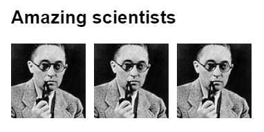
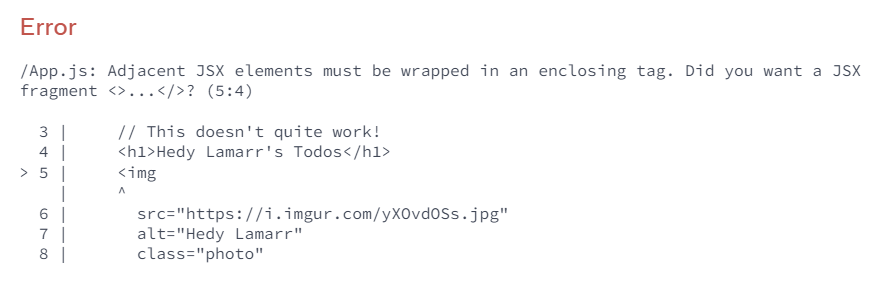
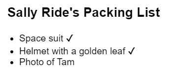
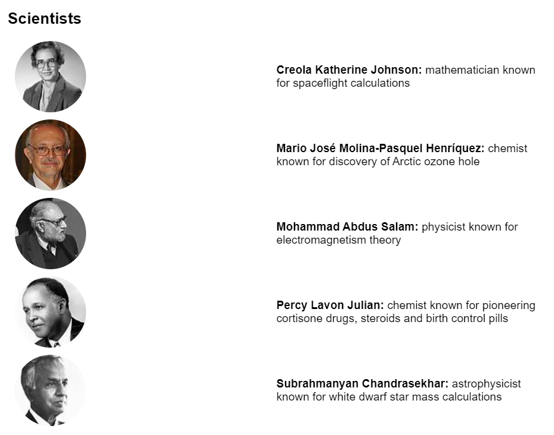
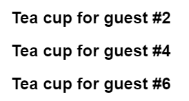
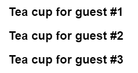

# Разработка интерфейса

**React** — это библиотека JavaScript для визуализации пользовательских интерфейсов (UI). Пользовательский интерфейс строится из небольших блоков, таких как кнопки, текст и изображения. React позволяет объединять их в многократно используемые, вложенные _компоненты._ От веб-сайтов до приложений для телефонов — все на экране может быть разбито на компоненты. В этой главе вы научитесь создавать, настраивать и условно отображать компоненты React.

!!!tip "В этой главе"

    -   [Как написать свой первый компонент React](your-first-component.md)
    -   [Когда и как создавать многокомпонентные файлы](importing-and-exporting-components.md)
    -   [Как добавить разметку в JavaScript с помощью JSX](writing-markup-with-jsx.md)
    -   [Как использовать фигурные скобки в JSX для доступа к функциональности JavaScript из ваших компонентов](javascript-in-jsx-with-curly-braces.md)
    -   [Как конфигурировать компоненты с помощью props](passing-props-to-a-component.md)
    -   [Как условно отрисовывать компоненты](conditional-rendering.md)
    -   [Как отрисовывать несколько компонентов одновременно](rendering-lists.md)
    -   [Как избежать запутанных ошибок, сохраняя чистоту компонентов](keeping-components-pure.md)

## Ваш первый компонент

Приложения React строятся из изолированных частей пользовательского интерфейса, называемых _компонентами_. Компонент React — это функция JavaScript, которую вы можете посыпать разметкой. Компоненты могут быть как маленькими, как кнопка, так и большими, как целая страница. Вот компонент `Gallery`, отображающий три компонента `Profile`:

<!-- 0001.part.md -->

=== "App.js"

    ```js
    function Profile() {
    	return (
    		
    	);
    }

    export default function Gallery() {
    	return (
    		<section>
    			<h1>Amazing scientists</h1>
    			<Profile />
    			<Profile />
    			<Profile />
    		</section>
    	);
    }
    ```

=== "Результат"

    

<!-- 0004.part.md -->

!!!note "Готовы изучить эту тему?"

    Прочитайте [Ваш первый компонент](your-first-component.md), чтобы узнать, как объявлять и использовать компоненты React.

## Импорт и экспорт компонентов

Вы можете объявить много компонентов в одном файле, но в больших файлах может быть трудно ориентироваться. Чтобы решить эту проблему, вы можете _экспортировать_ компонент в свой собственный файл, а затем _импортировать_ этот компонент из другого файла:

=== "Gallery.js"

    ```js
    import Profile from './Profile.js';

    export default function Gallery() {
    	return (
    		<section>
    			<h1>Amazing scientists</h1>
    			<Profile />
    			<Profile />
    			<Profile />
    		</section>
    	);
    }
    ```

=== "Profile.js"

    ```js
    export default function Profile() {
    	return (
    		
    	);
    }
    ```

=== "Результат"

    

<!-- 0012.part.md -->

!!!note "Готовы изучить эту тему?"

    Прочитайте [Импорт и экспорт компонентов](importing-and-exporting-components.md), чтобы узнать, как разделить компоненты на собственные файлы.

## Написание разметки с помощью JSX

Каждый компонент React — это функция JavaScript, которая может содержать некоторую разметку, которую React отображает в браузере. Компоненты React используют расширение синтаксиса под названием JSX для представления этой разметки. JSX очень похож на HTML, но он немного строже и может отображать динамическую информацию.

Если мы вставим существующую HTML-разметку в компонент React, она не будет работать:

<!-- 0013.part.md -->

=== "App.js"

    ```js
    export default function TodoList() {
    return (
    	// This doesn't quite work!
    	<h1>Hedy Lamarr's Todos</h1>
    	
    	<ul>
    	<li>Invent new traffic lights
    	<li>Rehearse a movie scene
    	<li>Improve spectrum technology
    	</ul>
    );
    }
    ```

=== "Результат"

    

<!-- 0016.part.md -->

Если у вас есть HTML, подобный этому, вы можете исправить его с помощью [конвертера](https://transform.tools/html-to-jsx):

<!-- 0017.part.md -->

=== "App.js"

    ```js
    export default function TodoList() {
    	return (
    		<>
    			<h1>Hedy Lamarr's Todos</h1>
    			
    			<ul>
    				<li>Invent new traffic lights</li>
    				<li>Rehearse a movie scene</li>
    				<li>Improve spectrum technology</li>
    			</ul>
    		</>
    	);
    }
    ```

=== "Результат"

    

<!-- 0020.part.md -->

!!!note "Готовы изучить эту тему?"

    Прочитайте [Writing Markup with JSX](writing-markup-with-jsx.md), чтобы узнать, как писать правильный JSX.

## JavaScript в JSX с фигурными скобками

JSX позволяет вам писать HTML-подобную разметку внутри JavaScript-файла, сохраняя логику рендеринга и содержимое в одном месте. Иногда вы захотите добавить немного логики JavaScript или сослаться на динамическое свойство внутри этой разметки. В этой ситуации вы можете использовать фигурные скобки в JSX, чтобы "открыть окно" в JavaScript:

<!-- 0021.part.md -->

=== "App.js"

    ```js
    const person = {
    	name: 'Gregorio Y. Zara',
    	theme: {
    		backgroundColor: 'black',
    		color: 'pink',
    	},
    };

    export default function TodoList() {
    	return (
    		<div style={person.theme}>
    			<h1>{person.name}'s Todos</h1>
    			
    			<ul>
    				<li>Improve the videophone</li>
    				<li>Prepare aeronautics lectures</li>
    				<li>Work on the alcohol-fuelled engine</li>
    			</ul>
    		</div>
    	);
    }
    ```

=== "Результат"

    

<!-- 0024.part.md -->

!!!note "Готовы изучить эту тему?"

    Читайте [JavaScript в JSX с фигурными скобками](javascript-in-jsx-with-curly-braces.md), чтобы узнать, как получить доступ к данным JavaScript из JSX.

## Передача пропсов компоненту

Компоненты React используют _props_ для взаимодействия друг с другом. Каждый родительский компонент может передавать некоторую информацию своим дочерним компонентам, передавая им пропсы. пропсы могут напомнить вам атрибуты HTML, но вы можете передавать через них любые значения JavaScript, включая объекты, массивы, функции и даже JSX!

<!-- 0025.part.md -->

=== "App.js"

    ```js
    import { getImageUrl } from './utils.js';

    export default function Profile() {
    	return (
    		<Card>
    			<Avatar
    				size={100}
    				person={{
    					name: 'Katsuko Saruhashi',
    					imageId: 'YfeOqp2',
    				}}
    			/>
    		</Card>
    	);
    }

    function Avatar({ person, size }) {
    	return (
    		
    	);
    }

    function Card({ children }) {
    	return <div className="card">{children}</div>;
    }
    ```

=== "utils.js"

    ```js
    export function getImageUrl(person, size = 's') {
    	return (
    		'https://i.imgur.com/' +
    		person.imageId +
    		size +
    		'.jpg'
    	);
    }
    ```

=== "Результат"

    

<!-- 0030.part.md -->

!!!note "Готовы изучить эту тему?"

    Прочитайте [Передача пропсов компоненту](passing-props-to-a-component.md), чтобы узнать, как передавать и читать пропсы.

## Условный рендеринг

Ваши компоненты часто должны отображать разные вещи в зависимости от различных условий. В React вы можете условно отображать JSX, используя синтаксис JavaScript, такой как операторы `if`, `&&` и `? :`.

В этом примере оператор JavaScript `&&` используется для условного отображения галочки:

<!-- 0031.part.md -->

=== "App.js"

    ```js
    function Item({ name, isPacked }) {
    	return (
    		<li className="item">
    			{name} {isPacked && '✔'}
    		</li>
    	);
    }

    export default function PackingList() {
    	return (
    		<section>
    			<h1>Sally Ride's Packing List</h1>
    			<ul>
    				<Item isPacked={true} name="Space suit" />
    				<Item
    					isPacked={true}
    					name="Helmet with a golden leaf"
    				/>
    				<Item
    					isPacked={false}
    					name="Photo of Tam"
    				/>
    			</ul>
    		</section>
    	);
    }
    ```

=== "Результат"

    

<!-- 0032.part.md -->

!!!note "Готовы изучить эту тему?"

    Прочитайте [Условный рендеринг](conditional-rendering.md), чтобы узнать о различных способах условного рендеринга контента.

## Рендеринг списков

Часто требуется отобразить несколько одинаковых компонентов из коллекции данных. Вы можете использовать JavaScript `filter()` и `map()` в React для фильтрации и преобразования массива данных в массив компонентов.

Для каждого элемента массива необходимо указать `ключ`. Обычно в качестве `ключа` используется идентификатор из базы данных. Ключи позволяют React отслеживать место каждого элемента в списке, даже если список меняется.

<!-- 0033.part.md -->

=== "App.js"

    ```js
    import { people } from './data.js';
    import { getImageUrl } from './utils.js';

    export default function List() {
    	const listItems = people.map((person) => (
    		<li key={person.id}>
    			
    			<p>
    				<b>{person.name}:</b>
    				{' ' + person.profession + ' '}
    				known for {person.accomplishment}
    			</p>
    		</li>
    	));
    	return (
    		<article>
    			<h1>Scientists</h1>
    			<ul>{listItems}</ul>
    		</article>
    	);
    }
    ```

=== "data.js"

    ```js
    export const people = [
    	{
    		id: 0,
    		name: 'Creola Katherine Johnson',
    		profession: 'mathematician',
    		accomplishment: 'spaceflight calculations',
    		imageId: 'MK3eW3A',
    	},
    	{
    		id: 1,
    		name: 'Mario José Molina-Pasquel Henríquez',
    		profession: 'chemist',
    		accomplishment: 'discovery of Arctic ozone hole',
    		imageId: 'mynHUSa',
    	},
    	{
    		id: 2,
    		name: 'Mohammad Abdus Salam',
    		profession: 'physicist',
    		accomplishment: 'electromagnetism theory',
    		imageId: 'bE7W1ji',
    	},
    	{
    		id: 3,
    		name: 'Percy Lavon Julian',
    		profession: 'chemist',
    		accomplishment:
    			'pioneering cortisone drugs, steroids and birth control pills',
    		imageId: 'IOjWm71',
    	},
    	{
    		id: 4,
    		name: 'Subrahmanyan Chandrasekhar',
    		profession: 'astrophysicist',
    		accomplishment:
    			'white dwarf star mass calculations',
    		imageId: 'lrWQx8l',
    	},
    ];
    ```

=== "utils.js"

    ```js
    export function getImageUrl(person) {
    	return (
    		'https://i.imgur.com/' + person.imageId + 's.jpg'
    	);
    }
    ```

=== "Результат"

    

<!-- 0040.part.md -->

!!!note "Готовы изучить эту тему?"

    Прочитайте [Rendering Lists](rendering-lists.md), чтобы узнать, как отобразить список компонентов и как выбрать ключ.

## Соблюдение чистоты компонентов

Некоторые функции JavaScript являются _чистыми._ Чистая функция:

-   **занимается своими делами.** Она не изменяет никаких объектов или переменных, которые существовали до ее вызова.
-   **Одинаковые входные данные, одинаковый выход.** При одинаковых входных данных чистая функция всегда должна возвращать один и тот же результат.

Если вы будете писать свои компоненты только как чистые функции, вы сможете избежать целого класса непонятных ошибок и непредсказуемого поведения по мере роста вашей кодовой базы. Вот пример нечистого компонента:

<!-- 0041.part.md -->

=== "App.js"

    ```js
    let guest = 0;

    function Cup() {
    	// Bad: changing a preexisting variable!
    	guest = guest + 1;
    	return <h2>Tea cup for guest #{guest}</h2>;
    }

    export default function TeaSet() {
    	return (
    		<>
    			<Cup />
    			<Cup />
    			<Cup />
    		</>
    	);
    }
    ```

=== "Результат"

    

<!-- 0042.part.md -->

Вы можете сделать этот компонент чистым, передав ему параметр вместо изменения предварительно существующей переменной:

<!-- 0043.part.md -->

=== "App.js"

    ```js
    function Cup({ guest }) {
    	return <h2>Tea cup for guest #{guest}</h2>;
    }

    export default function TeaSet() {
    	return (
    		<>
    			<Cup guest={1} />
    			<Cup guest={2} />
    			<Cup guest={3} />
    		</>
    	);
    }
    ```

=== "Результат"

    

<!-- 0044.part.md -->

!!!note "Готовы изучить эту тему?"

    Прочитайте [Keeping Components Pure](keeping-components-pure.md), чтобы узнать, как писать компоненты как чистые, предсказуемые функции.

## Что дальше?

Перейдите по ссылке [Ваш первый компонент](your-first-component.md), чтобы начать читать эту главу страница за страницей!

Или, если вы уже знакомы с этими темами, почему бы не прочитать [Добаление интерактивности](adding-interactivity.md)?

<!-- 0045.part.md -->

## Ссылки

-   [https://react.dev/learn/describing-the-ui](https://react.dev/learn/describing-the-ui)
