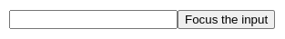
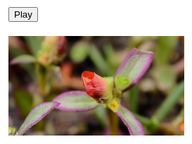
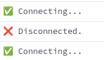
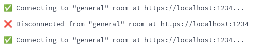
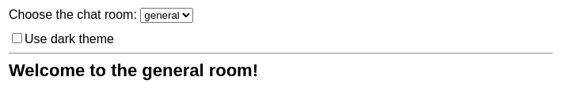
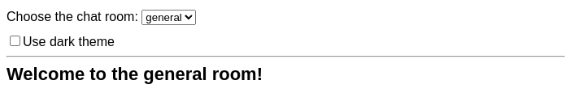
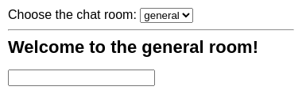
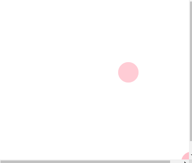

# Внешний доступ

Некоторые из ваших компонентов могут нуждаться в управлении и синхронизации с системами за пределами React. Например, вам может понадобиться сфокусировать ввод с помощью API браузера, воспроизвести и поставить на паузу видеоплеер, реализованный без React, или подключиться и прослушать сообщения от удаленного сервера. В этой главе вы познакомитесь с аварийными люками, которые позволят вам "выйти за пределы" React и подключиться к внешним системам. Большая часть логики вашего приложения и потока данных не должна полагаться на эти возможности.

!!!tip "В этой главе"

    -   [Как "запомнить" информацию без повторного рендеринга](referencing-values-with-refs.md)
    -   [Как получить доступ к элементам DOM, управляемым React](manipulating-the-dom-with-refs.md)
    -   [Как синхронизировать компоненты с внешними системами](synchronizing-with-effects.md)
    -   [Как удалить ненужные Эффекты из ваших компонентов](you-might-not-need-an-effect.md)
    -   [Чем жизненный цикл Эффекта отличается от жизненного цикла компонента](lifecycle-of-reactive-effects.md)
    -   [Как предотвратить повторное срабатывание эффектов от некоторых значений](separating-events-from-effects.md)
    -   [Как сделать так, чтобы эффект запускался реже](removing-effect-dependencies.md)
    -   [Как разделить логику между компонентами](reusing-logic-with-custom-hooks.md)

## Ссылки на значения с помощью ссылок

Когда вы хотите, чтобы компонент "запомнил" некоторую информацию, но не хотите, чтобы эта информация [запускала новые рендеры](render-and-commit.md), вы можете использовать _ref_:

<!-- 0001.part.md -->

```js
const ref = useRef(0);
```

<!-- 0002.part.md -->

Как и состояние, ссылки сохраняются React между рендерингами. Однако установка состояния пересматривает компонент. Изменение ссылки не делает этого! Вы можете получить доступ к текущему значению ссылки через свойство `ref.current`.

=== "App.js"

    ```js
    import { useRef } from 'react';

    export default function Counter() {
    	let ref = useRef(0);

    	function handleClick() {
    		ref.current = ref.current + 1;
    		alert('You clicked ' + ref.current + ' times!');
    	}

    	return <button onClick={handleClick}>Click me!</button>;
    }
    ```

=== "Результат"

    

<!-- 0004.part.md -->

Ссылка - это как секретный карман вашего компонента, который React не отслеживает. Например, вы можете использовать ссылки для хранения [идентификаторов таймаута](https://developer.mozilla.org/docs/Web/API/setTimeout#return_value), [элементов DOM](https://developer.mozilla.org/docs/Web/API/Element) и других объектов, которые не влияют на вывод компонента.

!!!note "Готовы изучить эту тему?"

    Прочитайте **[Ссылка на значения с помощью ссылок](referencing-values-with-refs.md)**, чтобы узнать, как использовать ссылки для запоминания информации.

## Манипулирование DOM с помощью ссылок

React автоматически обновляет DOM в соответствии с вашим рендерингом, поэтому вашим компонентам не часто требуется манипулировать им. Однако иногда вам может понадобиться доступ к элементам DOM, управляемым React - например, для фокусировки узла, прокрутки к нему или измерения его размера и положения. Встроенного способа сделать это в React нет, поэтому вам понадобится ссылка на узел DOM. Например, нажатие на кнопку фокусирует ввод, используя ссылку:

=== "App.js"

    ```js
    import { useRef } from 'react';

    export default function Form() {
    	const inputRef = useRef(null);

    	function handleClick() {
    		inputRef.current.focus();
    	}

    	return (
    		<>
    			<input ref={inputRef} />
    			<button onClick={handleClick}>
    				Focus the input
    			</button>
    		</>
    	);
    }
    ```

=== "Результат"

    

<!-- 0006.part.md -->

!!!note "Готовы изучить эту тему?"

    Прочитайте **[Manipulating the DOM with Refs](manipulating-the-dom-with-refs.md)**, чтобы узнать, как получить доступ к элементам DOM, управляемым React.

## Синхронизация с эффектами

Некоторые компоненты должны синхронизироваться с внешними системами. Например, вы можете захотеть управлять не-React компонентом на основе состояния React, установить соединение с сервером или отправить журнал аналитики, когда компонент появляется на экране. В отличие от обработчиков событий, которые позволяют вам обрабатывать определенные события, _Effects_ позволяют вам выполнять некоторый код после рендеринга. Используйте их для синхронизации вашего компонента с системой вне React.

Нажмите Play/Pause несколько раз и посмотрите, как видеоплеер синхронизируется со значением параметра `isPlaying`:

=== "App.js"

    ```js
    import { useState, useRef, useEffect } from 'react';

    function VideoPlayer({ src, isPlaying }) {
        const ref = useRef(null);

        useEffect(() => {
            if (isPlaying) {
                ref.current.play();
            } else {
                ref.current.pause();
            }
        }, [isPlaying]);

        return <video ref={ref} src={src} loop playsInline />;
    }

    export default function App() {
        const [isPlaying, setIsPlaying] = useState(false);
        return (
            <>
                <button
                    onClick={() => setIsPlaying(!isPlaying)}
                >
                    {isPlaying ? 'Pause' : 'Play'}
                </button>
                <VideoPlayer
                    isPlaying={isPlaying}
                    src="https://interactive-examples.mdn.mozilla.net/media/cc0-videos/flower.mp4"
                />
            </>
        );
    }
    ```

=== "Результат"

    

Многие эффекты также "убирают" за собой. Например, эффект, устанавливающий соединение с сервером чата, должен возвращать функцию _cleanup_, которая сообщает React, как отключить ваш компонент от сервера:

=== "App.js"

    ```js
    import { useState, useEffect } from 'react';
    import { createConnection } from './chat.js';

    export default function ChatRoom() {
        useEffect(() => {
            const connection = createConnection();
            connection.connect();
            return () => connection.disconnect();
        }, []);
        return <h1>Welcome to the chat!</h1>;
    }
    ```

=== "chat.js"

    ```js
    export function createConnection() {
        // A real implementation would actually connect to the server
        return {
            connect() {
                console.log('✅ Connecting...');
            },
            disconnect() {
                console.log('❌ Disconnected.');
            },
        };
    }
    ```

=== "Результат"

    

В процессе разработки React будет немедленно запущен и очистит ваш Effect еще один дополнительный раз. Вот почему вы видите, что `"✅ Connecting..."` выводится дважды. Это гарантирует, что вы не забудете реализовать функцию очистки.

!!!note "Готовы изучить эту тему?"

    Прочитайте **[Синхронизация с эффектами](synchronizing-with-effects.md)**, чтобы узнать, как синхронизировать компоненты с внешними системами.

## Возможно, вам не нужен эффект

Эффекты - это люк для выхода из парадигмы React. Они позволяют вам "выйти за пределы" React и синхронизировать ваши компоненты с какой-либо внешней системой. Если внешняя система не задействована (например, если вы хотите обновить состояние компонента при изменении некоторых пропсов или состояния), вам не нужен Эффект. Удаление ненужных Эффектов сделает ваш код более понятным, быстрым в исполнении и менее подверженным ошибкам.

Есть два распространенных случая, когда эффекты не нужны: - **Эффекты не нужны для преобразования данных для рендеринга.** - **Эффекты не нужны для обработки пользовательских событий.**.

Например, вам не нужен Эффект для изменения одного состояния на основе другого состояния:

<!-- 0017.part.md -->

```js
function Form() {
    const [firstName, setFirstName] = useState('Taylor');
    const [lastName, setLastName] = useState('Swift');

    // 🔴 Avoid: redundant state and unnecessary Effect
    const [fullName, setFullName] = useState('');
    useEffect(() => {
        setFullName(firstName + ' ' + lastName);
    }, [firstName, lastName]);
    // ...
}
```

<!-- 0018.part.md -->

Вместо этого рассчитайте как можно больше во время рендеринга:

<!-- 0019.part.md -->

```js
function Form() {
    const [firstName, setFirstName] = useState('Taylor');
    const [lastName, setLastName] = useState('Swift');
    // ✅ Good: calculated during rendering
    const fullName = firstName + ' ' + lastName;
    // ...
}
```

<!-- 0020.part.md -->

Тем не менее, вам нужны Эффекты для синхронизации с внешними системами.

!!!note "Готовы изучить эту тему?"

    Прочитайте **[Вы можете не нуждаться в эффектах](you-might-not-need-an-effect.md)**, чтобы узнать, как убрать ненужные Эффекты.

## Жизненный цикл реактивных эффектов

Жизненный цикл эффектов отличается от жизненного цикла компонентов. Компоненты могут монтироваться, обновляться и размонтироваться. Эффект может делать только две вещи: начать синхронизировать что-то, а затем прекратить синхронизацию. Этот цикл может происходить несколько раз, если ваш Эффект зависит от пропсов и состояния, которые меняются со временем.

Этот Эффект зависит от значения пропса `roomId`. пропсы - это _реактивные значения_, что означает, что они могут меняться при повторном рендере. Обратите внимание, что Эффект _пересинхронизируется_ (и повторно подключается к серверу), если `roomId` изменится:

=== "App.js"

    ```js
    import { useState, useEffect } from 'react';
    import { createConnection } from './chat.js';

    const serverUrl = 'https://localhost:1234';

    function ChatRoom({ roomId }) {
        useEffect(() => {
            const connection = createConnection(
                serverUrl,
                roomId
            );
            connection.connect();
            return () => connection.disconnect();
        }, [roomId]);

        return <h1>Welcome to the {roomId} room!</h1>;
    }

    export default function App() {
        const [roomId, setRoomId] = useState('general');
        return (
            <>
                <label>
                    Choose the chat room:{' '}
                    <select
                        value={roomId}
                        onChange={(e) =>
                            setRoomId(e.target.value)
                        }
                    >
                        <option value="general">general</option>
                        <option value="travel">travel</option>
                        <option value="music">music</option>
                    </select>
                </label>
                <hr />
                <ChatRoom roomId={roomId} />
            </>
        );
    }
    ```

=== "chat.js"

    ```js
    export function createConnection(serverUrl, roomId) {
        // A real implementation would actually connect to the server
        return {
            connect() {
                console.log(
                    '✅ Connecting to "' +
                        roomId +
                        '" room at ' +
                        serverUrl +
                        '...'
                );
            },
            disconnect() {
                console.log(
                    '❌ Disconnected from "' +
                        roomId +
                        '" room at ' +
                        serverUrl
                );
            },
        };
    }
    ```

=== "Результат"

    

React предоставляет правило linter для проверки правильности указания зависимостей вашего Effect. Если вы забыли указать `roomId` в списке зависимостей в приведенном выше примере, линтер найдет эту ошибку автоматически.

!!!note "Готовы изучить эту тему?"

    Прочитайте **[Жизненный цикл реактивных событий](lifecycle-of-reactive-effects.md)**, чтобы узнать, чем жизненный цикл эффекта отличается от жизненного цикла компонента.

## Отделение событий от Эффектов

!!!warning "В разработке"

    Этот раздел описывает **экспериментальный API, который еще не был выпущен** в стабильной версии React.

Обработчики событий запускаются повторно только тогда, когда вы снова выполняете то же самое действие. В отличие от обработчиков событий, эффекты повторно синхронизируются, если любое из значений, которые они считывают, например, props или state, отличается от того, что было во время последнего рендеринга. Иногда требуется сочетание обоих типов поведения: Эффект, который повторно запускается в ответ на некоторые значения, но не на другие.

Весь код внутри Эффектов является _реактивным._ Он будет запущен снова, если какое-то реактивное значение, которое он считывает, изменилось в результате повторного рендеринга. Например, этот Эффект повторно подключится к чату, если изменились `roomId` или `theme`:

=== "App.js"

    <div markdown style="max-height: 400px; overflow-y: auto;">

    ```js
    import { useState, useEffect } from 'react';
    import { createConnection, sendMessage } from './chat.js';
    import { showNotification } from './notifications.js';

    const serverUrl = 'https://localhost:1234';

    function ChatRoom({ roomId, theme }) {
    	useEffect(() => {
    		const connection = createConnection(
    			serverUrl,
    			roomId
    		);
    		connection.on('connected', () => {
    			showNotification('Connected!', theme);
    		});
    		connection.connect();
    		return () => connection.disconnect();
    	}, [roomId, theme]);

    	return <h1>Welcome to the {roomId} room!</h1>;
    }

    export default function App() {
    	const [roomId, setRoomId] = useState('general');
    	const [isDark, setIsDark] = useState(false);
    	return (
    		<>
    			<label>
    				Choose the chat room:{' '}
    				<select
    					value={roomId}
    					onChange={(e) =>
    						setRoomId(e.target.value)
    					}
    				>
    					<option value="general">general</option>
    					<option value="travel">travel</option>
    					<option value="music">music</option>
    				</select>
    			</label>
    			<label>
    				<input
    					type="checkbox"
    					checked={isDark}
    					onChange={(e) =>
    						setIsDark(e.target.checked)
    					}
    				/>
    				Use dark theme
    			</label>
    			<hr />
    			<ChatRoom
    				roomId={roomId}
    				theme={isDark ? 'dark' : 'light'}
    			/>
    		</>
    	);
    }
    ```

    </div>

=== "chat.js"

    ```js
    export function createConnection(serverUrl, roomId) {
    	// A real implementation would actually connect to the server
    	let connectedCallback;
    	let timeout;
    	return {
    		connect() {
    			timeout = setTimeout(() => {
    				if (connectedCallback) {
    					connectedCallback();
    				}
    			}, 100);
    		},
    		on(event, callback) {
    			if (connectedCallback) {
    				throw Error(
    					'Cannot add the handler twice.'
    				);
    			}
    			if (event !== 'connected') {
    				throw Error(
    					'Only "connected" event is supported.'
    				);
    			}
    			connectedCallback = callback;
    		},
    		disconnect() {
    			clearTimeout(timeout);
    		},
    	};
    }
    ```

=== "notifications.js"

    ```js
    import Toastify from 'toastify-js';
    import 'toastify-js/src/toastify.css';

    export function showNotification(message, theme) {
    	Toastify({
    		text: message,
    		duration: 2000,
    		gravity: 'top',
    		position: 'right',
    		style: {
    			background:
    				theme === 'dark' ? 'black' : 'white',
    			color: theme === 'dark' ? 'white' : 'black',
    		},
    	}).showToast();
    }
    ```

=== "Результат"

    

Это не идеальный вариант. Вы хотите переподключиться к чату только в том случае, если `roomId` изменился. Переключение `темы` не должно повторно подключаться к чату! Переместите код, считывающий `тему` из вашего Эффекта в _Событие Эффекта_:

=== "App.js"

    <div markdown style="max-height: 400px; overflow-y: auto;">

    ```js
    import { useState, useEffect } from 'react';
    import { experimental_useEffectEvent as useEffectEvent } from 'react';
    import { createConnection, sendMessage } from './chat.js';
    import { showNotification } from './notifications.js';

    const serverUrl = 'https://localhost:1234';

    function ChatRoom({ roomId, theme }) {
    	const onConnected = useEffectEvent(() => {
    		showNotification('Connected!', theme);
    	});

    	useEffect(() => {
    		const connection = createConnection(
    			serverUrl,
    			roomId
    		);
    		connection.on('connected', () => {
    			onConnected();
    		});
    		connection.connect();
    		return () => connection.disconnect();
    	}, [roomId]);

    	return <h1>Welcome to the {roomId} room!</h1>;
    }

    export default function App() {
    	const [roomId, setRoomId] = useState('general');
    	const [isDark, setIsDark] = useState(false);
    	return (
    		<>
    			<label>
    				Choose the chat room:{' '}
    				<select
    					value={roomId}
    					onChange={(e) =>
    						setRoomId(e.target.value)
    					}
    				>
    					<option value="general">general</option>
    					<option value="travel">travel</option>
    					<option value="music">music</option>
    				</select>
    			</label>
    			<label>
    				<input
    					type="checkbox"
    					checked={isDark}
    					onChange={(e) =>
    						setIsDark(e.target.checked)
    					}
    				/>
    				Use dark theme
    			</label>
    			<hr />
    			<ChatRoom
    				roomId={roomId}
    				theme={isDark ? 'dark' : 'light'}
    			/>
    		</>
    	);
    }
    ```

    </div>

=== "chat.js"

    ```js
    export function createConnection(serverUrl, roomId) {
    	// A real implementation would actually connect to the server
    	let connectedCallback;
    	let timeout;
    	return {
    		connect() {
    			timeout = setTimeout(() => {
    				if (connectedCallback) {
    					connectedCallback();
    				}
    			}, 100);
    		},
    		on(event, callback) {
    			if (connectedCallback) {
    				throw Error(
    					'Cannot add the handler twice.'
    				);
    			}
    			if (event !== 'connected') {
    				throw Error(
    					'Only "connected" event is supported.'
    				);
    			}
    			connectedCallback = callback;
    		},
    		disconnect() {
    			clearTimeout(timeout);
    		},
    	};
    }
    ```

=== "Результат"

    

Код внутри событий эффектов не является реактивным, поэтому изменение `темы` больше не заставит ваш эффект подключиться заново.

!!!note "Готовы изучить эту тему?"

    Читайте **[Отделение событий от эффектов](separating-events-from-effects.md)**, чтобы узнать, как предотвратить повторное срабатывание эффектов при некоторых значениях.

## Удаление зависимостей эффектов

Когда вы пишете Эффект, линтер проверяет, что вы включили все реактивные значения (такие как props и state), которые Эффект считывает, в список зависимостей вашего Эффекта. Это гарантирует, что ваш Эффект будет синхронизирован с последними пропсами и состоянием вашего компонента. Ненужные зависимости могут заставить ваш Эффект запускаться слишком часто или даже создать бесконечный цикл. Способ их удаления зависит от конкретного случая.

Например, этот Эффект зависит от объекта `options`, который создается заново каждый раз, когда вы редактируете входные данные:

=== "App.js"

    <div markdown style="max-height: 400px; overflow-y: auto;">

    ```js
    import { useState, useEffect } from 'react';
    import { createConnection } from './chat.js';

    const serverUrl = 'https://localhost:1234';

    function ChatRoom({ roomId }) {
    	const [message, setMessage] = useState('');

    	const options = {
    		serverUrl: serverUrl,
    		roomId: roomId,
    	};

    	useEffect(() => {
    		const connection = createConnection(options);
    		connection.connect();
    		return () => connection.disconnect();
    	}, [options]);

    	return (
    		<>
    			<h1>Welcome to the {roomId} room!</h1>
    			<input
    				value={message}
    				onChange={(e) => setMessage(e.target.value)}
    			/>
    		</>
    	);
    }

    export default function App() {
    	const [roomId, setRoomId] = useState('general');
    	return (
    		<>
    			<label>
    				Choose the chat room:{' '}
    				<select
    					value={roomId}
    					onChange={(e) =>
    						setRoomId(e.target.value)
    					}
    				>
    					<option value="general">general</option>
    					<option value="travel">travel</option>
    					<option value="music">music</option>
    				</select>
    			</label>
    			<hr />
    			<ChatRoom roomId={roomId} />
    		</>
    	);
    }
    ```

    </div>

=== "chat.js"

    ```js
    export function createConnection({ serverUrl, roomId }) {
    	// A real implementation would actually connect to the server
    	return {
    		connect() {
    			console.log(
    				'✅ Connecting to "' +
    					roomId +
    					'" room at ' +
    					serverUrl +
    					'...'
    			);
    		},
    		disconnect() {
    			console.log(
    				'❌ Disconnected from "' +
    					roomId +
    					'" room at ' +
    					serverUrl
    			);
    		},
    	};
    }
    ```

=== "Результат"

    

Вы же не хотите, чтобы чат переподключался каждый раз, когда вы начинаете набирать сообщение в этом чате. Чтобы решить эту проблему, переместите создание объекта `options` внутрь Эффекта, чтобы Эффект зависел только от строки `roomId`:

=== "App.js"

    <div markdown style="max-height: 400px; overflow-y: auto;">

    ```js
    import { useState, useEffect } from 'react';
    import { createConnection } from './chat.js';

    const serverUrl = 'https://localhost:1234';

    function ChatRoom({ roomId }) {
    	const [message, setMessage] = useState('');

    	useEffect(() => {
    		const options = {
    			serverUrl: serverUrl,
    			roomId: roomId,
    		};
    		const connection = createConnection(options);
    		connection.connect();
    		return () => connection.disconnect();
    	}, [roomId]);

    	return (
    		<>
    			<h1>Welcome to the {roomId} room!</h1>
    			<input
    				value={message}
    				onChange={(e) => setMessage(e.target.value)}
    			/>
    		</>
    	);
    }

    export default function App() {
    	const [roomId, setRoomId] = useState('general');
    	return (
    		<>
    			<label>
    				Choose the chat room:{' '}
    				<select
    					value={roomId}
    					onChange={(e) =>
    						setRoomId(e.target.value)
    					}
    				>
    					<option value="general">general</option>
    					<option value="travel">travel</option>
    					<option value="music">music</option>
    				</select>
    			</label>
    			<hr />
    			<ChatRoom roomId={roomId} />
    		</>
    	);
    }
    ```

    </div>

=== "chat.js"

    ```js
    export function createConnection({ serverUrl, roomId }) {
    	// A real implementation would actually connect to the server
    	return {
    		connect() {
    			console.log(
    				'✅ Connecting to "' +
    					roomId +
    					'" room at ' +
    					serverUrl +
    					'...'
    			);
    		},
    		disconnect() {
    			console.log(
    				'❌ Disconnected from "' +
    					roomId +
    					'" room at ' +
    					serverUrl
    			);
    		},
    	};
    }
    ```

=== "Результат"

    

Обратите внимание, что вы не начали с редактирования списка зависимостей, чтобы удалить зависимость `options`. Это было бы неправильно. Вместо этого вы изменили окружающий код так, что зависимость стала _ненужной_. Думайте о списке зависимостей как о списке всех реактивных значений, используемых кодом вашего Эффекта. Вы не выбираете намеренно, что включить в этот список. Список описывает ваш код. Чтобы изменить список зависимостей, измените код.

!!!note "Готовы изучить эту тему?"

    Читайте **[Удаление зависимостей эффектов](removing-effect-dependencies.md)**, чтобы узнать, как сделать так, чтобы ваш эффект запускался реже.

## Повторное использование логики с помощью пользовательских хуков

React поставляется со встроенными хуками, такими как `useState`, `useContext` и `useEffect`. Иногда вам захочется иметь хук для какой-то более конкретной цели: например, для получения данных, отслеживания того, находится ли пользователь в сети, или для подключения к чату. Для этого вы можете создать собственные хуки для нужд вашего приложения.

В этом примере пользовательский хук `usePointerPosition` отслеживает положение курсора, а пользовательский хук `useDelayedValue` возвращает значение, которое "отстает" от переданного вами значения на определенное количество миллисекунд. Наведите курсор на область предварительного просмотра песочницы, чтобы увидеть движущийся след из точек, следующий за курсором:

=== "App.js"

    <div markdown style="max-height: 400px; overflow-y: auto;">

    ```js
    import { usePointerPosition } from './usePointerPosition.js';
    import { useDelayedValue } from './useDelayedValue.js';

    export default function Canvas() {
    	const pos1 = usePointerPosition();
    	const pos2 = useDelayedValue(pos1, 100);
    	const pos3 = useDelayedValue(pos2, 200);
    	const pos4 = useDelayedValue(pos3, 100);
    	const pos5 = useDelayedValue(pos4, 50);
    	return (
    		<>
    			<Dot position={pos1} opacity={1} />
    			<Dot position={pos2} opacity={0.8} />
    			<Dot position={pos3} opacity={0.6} />
    			<Dot position={pos4} opacity={0.4} />
    			<Dot position={pos5} opacity={0.2} />
    		</>
    	);
    }

    function Dot({ position, opacity }) {
    	return (
    		<div
    			style={{
    				position: 'absolute',
    				backgroundColor: 'pink',
    				borderRadius: '50%',
    				opacity,
    				transform: `translate(${position.x}px, ${position.y}px)`,
    				pointerEvents: 'none',
    				left: -20,
    				top: -20,
    				width: 40,
    				height: 40,
    			}}
    		/>
    	);
    }
    ```

    </div>

=== "usePointerPosition.js"

    ```js
    import { useState, useEffect } from 'react';

    export function usePointerPosition() {
    	const [position, setPosition] = useState({
    		x: 0,
    		y: 0,
    	});
    	useEffect(() => {
    		function handleMove(e) {
    			setPosition({ x: e.clientX, y: e.clientY });
    		}
    		window.addEventListener('pointermove', handleMove);
    		return () =>
    			window.removeEventListener(
    				'pointermove',
    				handleMove
    			);
    	}, []);
    	return position;
    }
    ```

=== "useDelayedValue.js"

    ```js
    import { useState, useEffect } from 'react';

    export function useDelayedValue(value, delay) {
    	const [delayedValue, setDelayedValue] = useState(value);

    	useEffect(() => {
    		setTimeout(() => {
    			setDelayedValue(value);
    		}, delay);
    	}, [value, delay]);

    	return delayedValue;
    }
    ```

=== "Результат"

    

Вы можете создавать пользовательские хуки, компоновать их вместе, передавать между ними данные и повторно использовать их между компонентами. По мере роста вашего приложения вы будете писать меньше эффектов вручную, потому что сможете повторно использовать уже созданные пользовательские Hooks. Существует также множество отличных пользовательских хуков, поддерживаемых сообществом React.

!!!note "Готовы изучить эту тему?"

    Прочитайте **[Reusing Logic with Custom Hooks](reusing-logic-with-custom-hooks.md)**, чтобы узнать, как обмениваться логикой между компонентами.

## Что дальше?

Перейдите по ссылке [Referencing Values with Refs](referencing-values-with-refs.md), чтобы начать читать эту главу страница за страницей!

## Ссылки

-   [https://react.dev/learn/escape-hatches](https://react.dev/learn/escape-hatches)
