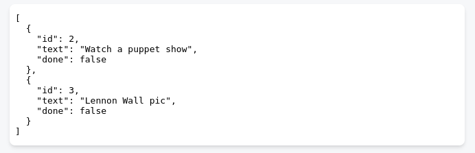
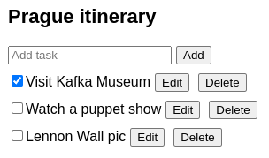
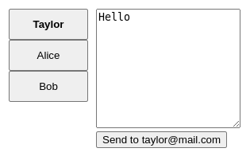
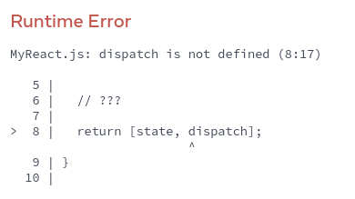

# Извлечение логики состояний в редуктор

Компоненты с большим количеством обновлений состояния, распределенных по многим обработчикам событий, могут стать непомерно сложными. В таких случаях вы можете объединить всю логику обновления состояния за пределами вашего компонента в одной функции, называемой _редуктором_.

!!!tip "Вы узнаете"

    -   Что такое функция редуктора
    -   Как рефакторить `useState` в `useReducer`.
    -   Когда использовать редуктор
    -   Как написать редуктор

## Консолидируйте логику состояния с помощью редуктора

По мере роста сложности ваших компонентов становится все труднее увидеть с первого взгляда все различные способы обновления состояния компонента. Например, компонент `TaskApp` ниже хранит массив `tasks` в состоянии и использует три различных обработчика событий для добавления, удаления и редактирования задач:

=== "App.js"

    ```js
    import { useState } from 'react';
    import AddTask from './AddTask.js';
    import TaskList from './TaskList.js';

    export default function TaskApp() {
    	const [tasks, setTasks] = useState(initialTasks);

    	function handleAddTask(text) {
    		setTasks([
    			...tasks,
    			{
    				id: nextId++,
    				text: text,
    				done: false,
    			},
    		]);
    	}

    	function handleChangeTask(task) {
    		setTasks(
    			tasks.map((t) => {
    				if (t.id === task.id) {
    					return task;
    				} else {
    					return t;
    				}
    			})
    		);
    	}

    	function handleDeleteTask(taskId) {
    		setTasks(tasks.filter((t) => t.id !== taskId));
    	}

    	return (
    		<>
    			<h1>Prague itinerary</h1>
    			<AddTask onAddTask={handleAddTask} />
    			<TaskList
    				tasks={tasks}
    				onChangeTask={handleChangeTask}
    				onDeleteTask={handleDeleteTask}
    			/>
    		</>
    	);
    }

    let nextId = 3;
    const initialTasks = [
    	{ id: 0, text: 'Visit Kafka Museum', done: true },
    	{ id: 1, text: 'Watch a puppet show', done: false },
    	{ id: 2, text: 'Lennon Wall pic', done: false },
    ];
    ```

=== "Результат"

    

Каждый из его обработчиков событий вызывает `setTasks` для обновления состояния. По мере роста этого компонента увеличивается и количество логики состояния, разбросанной по всему компоненту. Чтобы уменьшить эту сложность и держать всю логику в одном легкодоступном месте, вы можете переместить логику состояния в одну функцию вне вашего компонента, **называемую "редуктором "**.

Редукторы - это другой способ работы с состоянием. Вы можете перейти от `useState` к `useReducer` в три шага:

1.  **Переход** от установки состояния к диспетчеризации действий.
2.  **Напишите** функцию редуктора.
3.  **Используйте** редуктор из вашего компонента.

### Шаг 1: Переход от установки состояния к диспетчеризации действий

Ваши обработчики событий в настоящее время определяют _что делать_, устанавливая состояние:

<!-- 0009.part.md -->

```js
function handleAddTask(text) {
    setTasks([
        ...tasks,
        {
            id: nextId++,
            text: text,
            done: false,
        },
    ]);
}

function handleChangeTask(task) {
    setTasks(
        tasks.map((t) => {
            if (t.id === task.id) {
                return task;
            } else {
                return t;
            }
        })
    );
}

function handleDeleteTask(taskId) {
    setTasks(tasks.filter((t) => t.id !== taskId));
}
```

<!-- 0010.part.md -->

Удалите всю логику установки состояния. Остаются только три обработчика событий:

-   `handleAddTask(text)` вызывается, когда пользователь нажимает кнопку "Добавить".
-   `handleChangeTask(task)` вызывается, когда пользователь переключает задачу или нажимает "Сохранить".
-   `handleDeleteTask(taskId)` вызывается, когда пользователь нажимает "Delete".

Управление состоянием с помощью редукторов несколько отличается от непосредственного задания состояния. Вместо того чтобы говорить React "что делать", устанавливая состояние, вы указываете, "что пользователь только что сделал", отправляя "действия" из ваших обработчиков событий. (Логика обновления состояния будет жить в другом месте!) Таким образом, вместо "установки `задач`" через обработчик событий, вы отправляете действие "добавить/изменить/удалить задачу". Это более точно описывает намерения пользователя.

<!-- 0011.part.md -->

```js
function handleAddTask(text) {
    dispatch({
        type: 'added',
        id: nextId++,
        text: text,
    });
}

function handleChangeTask(task) {
    dispatch({
        type: 'changed',
        task: task,
    });
}

function handleDeleteTask(taskId) {
    dispatch({
        type: 'deleted',
        id: taskId,
    });
}
```

<!-- 0012.part.md -->

Объект, который вы передаете в `dispatch`, называется "действие":

<!-- 0013.part.md -->

```js
function handleDeleteTask(taskId) {
    dispatch(
        // "action" object:
        {
            type: 'deleted',
            id: taskId,
        }
    );
}
```

<!-- 0014.part.md -->

Это обычный объект JavaScript. Вы сами решаете, что в него поместить, но в целом он должен содержать минимальную информацию о том, _что произошло_. (Саму функцию `dispatch` вы добавите на следующем этапе).

!!!note ""

    Объект действия может иметь любую форму.

    По общему правилу, принято задавать ему строку `type`, описывающую произошедшее, и передавать любую дополнительную информацию в других полях. Тип" специфичен для компонента, поэтому в данном примере подойдет либо `'added'`, либо `'added_task'`. Выберите имя, которое говорит о том, что произошло!

    ```js
    dispatch({
    	// specific to component
    	type: 'what_happened',
    	// other fields go here
    });
    ```

### Шаг 2: Напишите функцию-редуктор

Редукторная функция - это то место, где вы будете размещать логику состояния. Она принимает два аргумента, текущее состояние и объект действия, и возвращает следующее состояние:

<!-- 0017.part.md -->

```js
function yourReducer(state, action) {
    // return next state for React to set
}
```

<!-- 0018.part.md -->

React установит состояние на то, что вы вернете из редуктора.

Чтобы перенести логику установки состояния из обработчиков событий в функцию редуктора в этом примере, необходимо:

1.  Объявите текущее состояние (`tasks`) в качестве первого аргумента.
2.  Объявить объект `action` в качестве второго аргумента.
3.  Вернуть _следующее_ состояние из редуктора (в которое React установит состояние).

Вот вся логика установки состояния, перенесенная в функцию reducer:

<!-- 0019.part.md -->

```js
function tasksReducer(tasks, action) {
    if (action.type === 'added') {
        return [
            ...tasks,
            {
                id: action.id,
                text: action.text,
                done: false,
            },
        ];
    } else if (action.type === 'changed') {
        return tasks.map((t) => {
            if (t.id === action.task.id) {
                return action.task;
            } else {
                return t;
            }
        });
    } else if (action.type === 'deleted') {
        return tasks.filter((t) => t.id !== action.id);
    } else {
        throw Error('Unknown action: ' + action.type);
    }
}
```

<!-- 0020.part.md -->

Поскольку функция reducer принимает состояние (`tasks`) в качестве аргумента, вы можете **объявить его вне вашего компонента.** Это уменьшает уровень отступов и может сделать ваш код более легким для чтения.

!!!note ""

    В приведенном выше коде используются операторы `if`/`else`, но принято использовать [операторы `switch`](https://developer.mozilla.org/docs/Web/JavaScript/Reference/Statements/switch) внутри редукторов. Результат тот же, но читать операторы `switch` с первого взгляда может быть проще.

    Мы будем использовать их в остальной части этой документации следующим образом:

    ```js
    function tasksReducer(tasks, action) {
    	switch (action.type) {
    		case 'added': {
    			return [
    				...tasks,
    				{
    					id: action.id,
    					text: action.text,
    					done: false,
    				},
    			];
    		}
    		case 'changed': {
    			return tasks.map((t) => {
    				if (t.id === action.task.id) {
    					return action.task;
    				} else {
    					return t;
    				}
    			});
    		}
    		case 'deleted': {
    			return tasks.filter((t) => t.id !== action.id);
    		}
    		default: {
    			throw Error('Unknown action: ' + action.type);
    		}
    	}
    }
    ```

    Мы рекомендуем заключать каждый блок `case` в фигурные скобки `{` и `}`, чтобы переменные, объявленные внутри разных `case`, не конфликтовали друг с другом. Кроме того, блок `case` обычно должен заканчиваться `return`. Если вы забудете `return`, код "провалится" в следующий `case`, что может привести к ошибкам!

    Если вы еще не освоились с операторами `switch`, то вполне можно использовать `if/else`.

!!!note "Почему редукторы называются именно так?"

Хотя редукторы могут "уменьшить" количество кода в вашем компоненте, на самом деле они названы в честь операции [`reduce()`](https://developer.mozilla.org/docs/Web/JavaScript/Reference/Global_Objects/Array/Reduce), которую вы можете выполнять над массивами.

Операция `reduce()` позволяет вам взять массив и "накопить" одно значение из многих:

```js
const arr = [1, 2, 3, 4, 5];
const sum = arr.reduce((result, number) => result + number); // 1 + 2 + 3 + 4 + 5
```

Функция, которую вы передаете в `reduce`, известна как "reducer". Она принимает _результат на данный момент_ и _текущий элемент_, а затем возвращает _следующий результат_. React reducers - пример той же идеи: они принимают _состояние на данный момент_ и _действие_, а возвращают _следующее состояние_. Таким образом, они накапливают действия со временем в состояние.

Вы даже можете использовать метод `reduce()` с `initialState` и массивом `actions` для вычисления конечного состояния, передав ему свою функцию reducer:

=== "index.js"

    ```js
    import tasksReducer from './tasksReducer.js';

    let initialState = [];
    let actions = [
    	{ type: 'added', id: 1, text: 'Visit Kafka Museum' },
    	{ type: 'added', id: 2, text: 'Watch a puppet show' },
    	{ type: 'deleted', id: 1 },
    	{ type: 'added', id: 3, text: 'Lennon Wall pic' },
    ];

    let finalState = actions.reduce(tasksReducer, initialState);

    const output = document.getElementById('output');
    output.textContent = JSON.stringify(finalState, null, 2);
    ```

=== "taskReducer.js"

    ```js
    export default function tasksReducer(tasks, action) {
    	switch (action.type) {
    		case 'added': {
    			return [
    				...tasks,
    				{
    					id: action.id,
    					text: action.text,
    					done: false,
    				},
    			];
    		}
    		case 'changed': {
    			return tasks.map((t) => {
    				if (t.id === action.task.id) {
    					return action.task;
    				} else {
    					return t;
    				}
    			});
    		}
    		case 'deleted': {
    			return tasks.filter((t) => t.id !== action.id);
    		}
    		default: {
    			throw Error('Unknown action: ' + action.type);
    		}
    	}
    }
    ```

=== "index.html"

    ```html
    <pre id="output"></pre>
    ```

=== "Результат"

    

Скорее всего, вам не понадобится делать это самостоятельно, но это похоже на то, что делает React!

### Шаг 3: Используйте редуктор из вашего компонента

Наконец, вам нужно подключить `tasksReducer` к вашему компоненту. Импортируйте хук `useReducer` из React:

<!-- 0027.part.md -->

```js
import { useReducer } from 'react';
```

<!-- 0028.part.md -->

Тогда вы можете заменить `useState`:

<!-- 0029.part.md -->

```js
const [tasks, setTasks] = useState(initialTasks);
```

<!-- 0030.part.md -->

с `useReducer` следующим образом:

<!-- 0031.part.md -->

```js
const [tasks, dispatch] = useReducer(
    tasksReducer,
    initialTasks
);
```

<!-- 0032.part.md -->

Хук `useReducer` похож на `useState` - вы должны передать ему начальное состояние, а он возвращает значение состояния и способ установки состояния (в данном случае функцию диспетчеризации). Но он немного отличается.

Хук `useReducer` принимает два аргумента:

1.  Функция редуктора
2.  Начальное состояние

И возвращает:

1.  Значение с состоянием
2.  Диспетчерская функция (для "отправки" действий пользователя на редуктор).

Теперь он полностью подключен! Здесь редуктор объявлен в нижней части файла компонента:

=== "App.js"

    ```js
    import { useReducer } from 'react';
    import AddTask from './AddTask.js';
    import TaskList from './TaskList.js';

    export default function TaskApp() {
    	const [tasks, dispatch] = useReducer(
    		tasksReducer,
    		initialTasks
    	);

    	function handleAddTask(text) {
    		dispatch({
    			type: 'added',
    			id: nextId++,
    			text: text,
    		});
    	}

    	function handleChangeTask(task) {
    		dispatch({
    			type: 'changed',
    			task: task,
    		});
    	}

    	function handleDeleteTask(taskId) {
    		dispatch({
    			type: 'deleted',
    			id: taskId,
    		});
    	}

    	return (
    		<>
    			<h1>Prague itinerary</h1>
    			<AddTask onAddTask={handleAddTask} />
    			<TaskList
    				tasks={tasks}
    				onChangeTask={handleChangeTask}
    				onDeleteTask={handleDeleteTask}
    			/>
    		</>
    	);
    }

    function tasksReducer(tasks, action) {
    	switch (action.type) {
    		case 'added': {
    			return [
    				...tasks,
    				{
    					id: action.id,
    					text: action.text,
    					done: false,
    				},
    			];
    		}
    		case 'changed': {
    			return tasks.map((t) => {
    				if (t.id === action.task.id) {
    					return action.task;
    				} else {
    					return t;
    				}
    			});
    		}
    		case 'deleted': {
    			return tasks.filter((t) => t.id !== action.id);
    		}
    		default: {
    			throw Error('Unknown action: ' + action.type);
    		}
    	}
    }

    let nextId = 3;
    const initialTasks = [
    	{ id: 0, text: 'Visit Kafka Museum', done: true },
    	{ id: 1, text: 'Watch a puppet show', done: false },
    	{ id: 2, text: 'Lennon Wall pic', done: false },
    ];
    ```

=== "Результат"

    

При желании можно даже переместить редуктор в другой файл:

=== "App.js"

    ```js
    import { useReducer } from 'react';
    import AddTask from './AddTask.js';
    import TaskList from './TaskList.js';
    import tasksReducer from './tasksReducer.js';

    export default function TaskApp() {
    	const [tasks, dispatch] = useReducer(
    		tasksReducer,
    		initialTasks
    	);

    	function handleAddTask(text) {
    		dispatch({
    			type: 'added',
    			id: nextId++,
    			text: text,
    		});
    	}

    	function handleChangeTask(task) {
    		dispatch({
    			type: 'changed',
    			task: task,
    		});
    	}

    	function handleDeleteTask(taskId) {
    		dispatch({
    			type: 'deleted',
    			id: taskId,
    		});
    	}

    	return (
    		<>
    			<h1>Prague itinerary</h1>
    			<AddTask onAddTask={handleAddTask} />
    			<TaskList
    				tasks={tasks}
    				onChangeTask={handleChangeTask}
    				onDeleteTask={handleDeleteTask}
    			/>
    		</>
    	);
    }

    let nextId = 3;
    const initialTasks = [
    	{ id: 0, text: 'Visit Kafka Museum', done: true },
    	{ id: 1, text: 'Watch a puppet show', done: false },
    	{ id: 2, text: 'Lennon Wall pic', done: false },
    ];
    ```

=== "taskReducer.js"

    ```js
    export default function tasksReducer(tasks, action) {
    	switch (action.type) {
    		case 'added': {
    			return [
    				...tasks,
    				{
    					id: action.id,
    					text: action.text,
    					done: false,
    				},
    			];
    		}
    		case 'changed': {
    			return tasks.map((t) => {
    				if (t.id === action.task.id) {
    					return action.task;
    				} else {
    					return t;
    				}
    			});
    		}
    		case 'deleted': {
    			return tasks.filter((t) => t.id !== action.id);
    		}
    		default: {
    			throw Error('Unknown action: ' + action.type);
    		}
    	}
    }
    ```

=== "Результат"

    

Логику компонентов легче читать, когда вы разделяете проблемы подобным образом. Теперь обработчики событий только определяют _что произошло_, отправляя действия, а функция reducer определяет _как обновляется состояние_ в ответ на них.

## Сравнение `useState` и `useReducer`

Редукторы не лишены недостатков! Вот несколько способов сравнить их:

-   **Размер кода:** Как правило, при использовании `useState` вам придется написать меньше кода. При использовании `useReducer` вам придется написать как функцию reducer, так и действия диспетчеризации. Однако `useReducer` может помочь сократить код, если многие обработчики событий изменяют состояние аналогичным образом.
-   **Удобство чтения:** `useState` очень легко читается, когда обновления состояния просты. Когда они становятся более сложными, они могут раздуть код вашего компонента и сделать его трудным для сканирования. В этом случае `useReducer` позволяет вам чисто отделить _как_ логику обновления от _что произошло_ обработчиков событий.
-   **Отладка:** Когда у вас есть ошибка с `useState`, может быть трудно сказать, _где_ состояние было установлено неправильно, и _почему_. С `useReducer` вы можете добавить консольный журнал в ваш reducer, чтобы видеть каждое обновление состояния и _почему_ это произошло (из-за какого `действия`). Если каждое `действие` корректно, вы будете знать, что ошибка в самой логике редуктора. Однако, вам придется просмотреть больше кода, чем при использовании `useState`.
-   **Тестирование:** Редуктор - это чистая функция, которая не зависит от вашего компонента. Это означает, что вы можете экспортировать и тестировать его отдельно, в изоляции. Хотя обычно лучше тестировать компоненты в более реалистичной среде, для сложной логики обновления состояния может быть полезно утверждать, что ваш редуктор возвращает определенное состояние для определенного начального состояния и действия.
-   **Личные предпочтения:** Некоторым людям нравятся редукторы, другим нет. Это нормально. Это вопрос предпочтений. Вы всегда можете конвертировать между `useState` и `useReducer` туда и обратно: они эквивалентны!

Мы рекомендуем использовать reducer, если вы часто сталкиваетесь с ошибками, связанными с некорректным обновлением состояния какого-либо компонента, и хотите внести больше структуры в его код. Вы не обязаны использовать редукторы для всего: смело сочетайте их друг с другом! Вы даже можете `использоватьState` и `использоватьReducer` в одном и том же компоненте.

## Правильное написание редукторов

Помните об этих двух советах при написании редукторов:

-   **Редукторы должны быть чистыми.** Подобно [функциям обновления состояния](queueing-a-series-of-state-updates.md), редукторы работают во время рендеринга! (Действия ставятся в очередь до следующего рендера.) Это означает, что редукторы [должны быть чистыми](keeping-components-pure.md) - одинаковые входы всегда приводят к одинаковому выходу. Они не должны посылать запросы, планировать таймауты или выполнять какие-либо побочные эффекты (операции, которые влияют на вещи за пределами компонента). Они должны обновлять [объекты](updating-objects-in-state.md) и [массивы](updating-arrays-in-state.md) без мутаций.
-   Каждое действие описывает одно взаимодействие пользователя, даже если оно приводит к нескольким изменениям данных. Например, если пользователь нажимает кнопку "Reset" на форме с пятью полями, управляемыми редуктором, логичнее отправить одно действие `reset_form`, чем пять отдельных действий `set_field`. Если вы регистрируете каждое действие в редукторе, этот журнал должен быть достаточно ясным, чтобы вы могли восстановить, какие взаимодействия или ответы происходили в каком порядке. Это помогает при отладке!

<!-- 0051.part.md -->

## Написание кратких редукторов с помощью Immer

Так же, как и в случае с [update objects](updating-objects-in-state.md#write-concise-update-logic-with-immer) и [arrays](updating-arrays-in-state.md#write-concise-update-logic-with-immer) в обычном состоянии, вы можете использовать библиотеку Immer, чтобы сделать редукторы более лаконичными. Здесь [`useImmerReducer`](https://github.com/immerjs/use-immer#useimmerreducer) позволяет вам мутировать состояние с помощью `push` или `arr[i] =` присваивания:

=== "App.js"

    ```js
    import { useImmerReducer } from 'use-immer';
    import AddTask from './AddTask.js';
    import TaskList from './TaskList.js';

    function tasksReducer(draft, action) {
    	switch (action.type) {
    		case 'added': {
    			draft.push({
    				id: action.id,
    				text: action.text,
    				done: false,
    			});
    			break;
    		}
    		case 'changed': {
    			const index = draft.findIndex(
    				(t) => t.id === action.task.id
    			);
    			draft[index] = action.task;
    			break;
    		}
    		case 'deleted': {
    			return draft.filter((t) => t.id !== action.id);
    		}
    		default: {
    			throw Error('Unknown action: ' + action.type);
    		}
    	}
    }

    export default function TaskApp() {
    	const [tasks, dispatch] = useImmerReducer(
    		tasksReducer,
    		initialTasks
    	);

    	function handleAddTask(text) {
    		dispatch({
    			type: 'added',
    			id: nextId++,
    			text: text,
    		});
    	}

    	function handleChangeTask(task) {
    		dispatch({
    			type: 'changed',
    			task: task,
    		});
    	}

    	function handleDeleteTask(taskId) {
    		dispatch({
    			type: 'deleted',
    			id: taskId,
    		});
    	}

    	return (
    		<>
    			<h1>Prague itinerary</h1>
    			<AddTask onAddTask={handleAddTask} />
    			<TaskList
    				tasks={tasks}
    				onChangeTask={handleChangeTask}
    				onDeleteTask={handleDeleteTask}
    			/>
    		</>
    	);
    }

    let nextId = 3;
    const initialTasks = [
    	{ id: 0, text: 'Visit Kafka Museum', done: true },
    	{ id: 1, text: 'Watch a puppet show', done: false },
    	{ id: 2, text: 'Lennon Wall pic', done: false },
    ];
    ```

=== "Результат"

    

Редукторы должны быть чистыми, поэтому они не должны мутировать состояние. Но Immer предоставляет вам специальный объект `draft`, который безопасен для мутации. Под капотом Immer создаст копию вашего состояния с изменениями, которые вы внесли в `draft`. Вот почему редукторы, управляемые `useImmerReducer`, могут мутировать свой первый аргумент и не должны возвращать состояние.

!!!note "Итого"

    -   Чтобы перейти от `useState` к `useReducer`:
    	1.  Отправляйте действия из обработчиков событий.
    	2.  Напишите функцию-редуктор, которая возвращает следующее состояние для заданного состояния и действия.
    	3.  Замените `useState` на `useReducer`.
    -   Редукторы требуют написания большего количества кода, но они помогают при отладке и тестировании.
    -   Редукторы должны быть чистыми.
    -   Каждое действие описывает одно взаимодействие с пользователем.
    -   Используйте Immer, если вы хотите писать редукторы в мутирующем стиле.

## Задачи

### 1. Диспетчеризация действий из обработчиков событий

В настоящее время обработчики событий в `ContactList.js` и `Chat.js` имеют комментарии `// TODO`. Именно поэтому ввод текста не работает, а нажатие на кнопки не изменяет выбранного получателя.

Замените эти два `// TODO` на код для `диспетчеризации` соответствующих действий. Чтобы увидеть ожидаемую форму и тип действий, проверьте редуктор в `messengerReducer.js`. Редуктор уже написан, поэтому вам не придется его изменять. Вам нужно только диспетчеризировать действия в `ContactList.js` и `Chat.js`.

=== "App.js"

    ```js
    import { useReducer } from 'react';
    import Chat from './Chat.js';
    import ContactList from './ContactList.js';
    import {
    	initialState,
    	messengerReducer,
    } from './messengerReducer';

    export default function Messenger() {
    	const [state, dispatch] = useReducer(
    		messengerReducer,
    		initialState
    	);
    	const message = state.message;
    	const contact = contacts.find(
    		(c) => c.id === state.selectedId
    	);
    	return (
    		<div>
    			<ContactList
    				contacts={contacts}
    				selectedId={state.selectedId}
    				dispatch={dispatch}
    			/>
    			<Chat
    				key={contact.id}
    				message={message}
    				contact={contact}
    				dispatch={dispatch}
    			/>
    		</div>
    	);
    }

    const contacts = [
    	{ id: 0, name: 'Taylor', email: 'taylor@mail.com' },
    	{ id: 1, name: 'Alice', email: 'alice@mail.com' },
    	{ id: 2, name: 'Bob', email: 'bob@mail.com' },
    ];
    ```

=== "messengerReducer.js"

    ```js
    export const initialState = {
    	selectedId: 0,
    	message: 'Hello',
    };

    export function messengerReducer(state, action) {
    	switch (action.type) {
    		case 'changed_selection': {
    			return {
    				...state,
    				selectedId: action.contactId,
    				message: '',
    			};
    		}
    		case 'edited_message': {
    			return {
    				...state,
    				message: action.message,
    			};
    		}
    		default: {
    			throw Error('Unknown action: ' + action.type);
    		}
    	}
    }
    ```

=== "ContactList.js"

    ```js
    export default function ContactList({
    	contacts,
    	selectedId,
    	dispatch,
    }) {
    	return (
    		<section className="contact-list">
    			<ul>
    				{contacts.map((contact) => (
    					<li key={contact.id}>
    						<button
    							onClick={() => {
    								// TODO: dispatch changed_selection
    							}}
    						>
    							{selectedId === contact.id ? (
    								<b>{contact.name}</b>
    							) : (
    								contact.name
    							)}
    						</button>
    					</li>
    				))}
    			</ul>
    		</section>
    	);
    }
    ```

=== "Chat.js"

    ```js
    import { useState } from 'react';

    export default function Chat({
    	contact,
    	message,
    	dispatch,
    }) {
    	return (
    		<section className="chat">
    			<textarea
    				value={message}
    				placeholder={'Chat to ' + contact.name}
    				onChange={(e) => {
    					// TODO: dispatch edited_message
    					// (Read the input value from e.target.value)
    				}}
    			/>
    			<br />
    			<button>Send to {contact.email}</button>
    		</section>
    	);
    }
    ```

=== "Результат"

    

???tip "Показать подсказку"

    Функция `dispatch` уже доступна в обоих компонентах, потому что она была передана в качестве пропса. Поэтому вам нужно вызвать `dispatch` с соответствующим объектом действия.

    Чтобы проверить форму объекта действия, вы можете посмотреть на редуктор и увидеть, какие поля `action` он ожидает увидеть. Например, случай `changed_selection` в редукторе выглядит следующим образом:

    ```js
    case 'changed_selection': {
    return {
    	...state,
    	selectedId: action.contactId
    };
    }
    ```

    Это означает, что объект вашего действия должен иметь `type: 'changed_selection'`. Вы также видите, что используется `action.contactId`, поэтому вам необходимо включить свойство `contactId` в ваше действие.

???success "Показать решение"

    Из кода редуктора можно сделать вывод, что действия должны выглядеть следующим образом:

    <!-- 0074.part.md -->

    ```js
    // When the user presses "Alice"
    dispatch({
    	type: 'changed_selection',
    	contactId: 1,
    });

    // When user types "Hello!"
    dispatch({
    	type: 'edited_message',
    	message: 'Hello!',
    });
    ```

    <!-- 0075.part.md -->

    Вот пример, обновленный для отправки соответствующих сообщений:

    === "App.js"

    	```js
    	import { useReducer } from 'react';
    	import Chat from './Chat.js';
    	import ContactList from './ContactList.js';
    	import {
    		initialState,
    		messengerReducer,
    	} from './messengerReducer';

    	export default function Messenger() {
    		const [state, dispatch] = useReducer(
    			messengerReducer,
    			initialState
    		);
    		const message = state.message;
    		const contact = contacts.find(
    			(c) => c.id === state.selectedId
    		);
    		return (
    			<div>
    				<ContactList
    					contacts={contacts}
    					selectedId={state.selectedId}
    					dispatch={dispatch}
    				/>
    				<Chat
    					key={contact.id}
    					message={message}
    					contact={contact}
    					dispatch={dispatch}
    				/>
    			</div>
    		);
    	}

    	const contacts = [
    		{ id: 0, name: 'Taylor', email: 'taylor@mail.com' },
    		{ id: 1, name: 'Alice', email: 'alice@mail.com' },
    		{ id: 2, name: 'Bob', email: 'bob@mail.com' },
    	];
    	```

    === "messengerReducer.js"

    	```js
    	export const initialState = {
    		selectedId: 0,
    		message: 'Hello',
    	};

    	export function messengerReducer(state, action) {
    		switch (action.type) {
    			case 'changed_selection': {
    				return {
    					...state,
    					selectedId: action.contactId,
    					message: '',
    				};
    			}
    			case 'edited_message': {
    				return {
    					...state,
    					message: action.message,
    				};
    			}
    			default: {
    				throw Error('Unknown action: ' + action.type);
    			}
    		}
    	}
    	```

    === "ContactList.js"

    	```js
    	export default function ContactList({
    		contacts,
    		selectedId,
    		dispatch,
    	}) {
    		return (
    			<section className="contact-list">
    				<ul>
    					{contacts.map((contact) => (
    						<li key={contact.id}>
    							<button
    								onClick={() => {
    									dispatch({
    										type:
    											'changed_selection',
    										contactId: contact.id,
    									});
    								}}
    							>
    								{selectedId === contact.id ? (
    									<b>{contact.name}</b>
    								) : (
    									contact.name
    								)}
    							</button>
    						</li>
    					))}
    				</ul>
    			</section>
    		);
    	}
    	```

    === "Chat.js"

    	```js
    	import { useState } from 'react';

    	export default function Chat({
    		contact,
    		message,
    		dispatch,
    	}) {
    		return (
    			<section className="chat">
    				<textarea
    					value={message}
    					placeholder={'Chat to ' + contact.name}
    					onChange={(e) => {
    						dispatch({
    							type: 'edited_message',
    							message: e.target.value,
    						});
    					}}
    				/>
    				<br />
    				<button>Send to {contact.email}</button>
    			</section>
    		);
    	}
    	```

    === "Результат"

    	

### 2. Очистка ввода при отправке сообщения

В настоящее время нажатие кнопки "Отправить" ничего не делает. Добавьте обработчик события для кнопки "Отправить", который будет:

1.  Показывать `оповещение` с электронной почтой получателя и сообщением.
2.  Очищать вход сообщения.

=== "App.js"

    ```js
    import { useReducer } from 'react';
    import Chat from './Chat.js';
    import ContactList from './ContactList.js';
    import {
    	initialState,
    	messengerReducer,
    } from './messengerReducer';

    export default function Messenger() {
    	const [state, dispatch] = useReducer(
    		messengerReducer,
    		initialState
    	);
    	const message = state.message;
    	const contact = contacts.find(
    		(c) => c.id === state.selectedId
    	);
    	return (
    		<div>
    			<ContactList
    				contacts={contacts}
    				selectedId={state.selectedId}
    				dispatch={dispatch}
    			/>
    			<Chat
    				key={contact.id}
    				message={message}
    				contact={contact}
    				dispatch={dispatch}
    			/>
    		</div>
    	);
    }

    const contacts = [
    	{ id: 0, name: 'Taylor', email: 'taylor@mail.com' },
    	{ id: 1, name: 'Alice', email: 'alice@mail.com' },
    	{ id: 2, name: 'Bob', email: 'bob@mail.com' },
    ];
    ```

=== "messengerReducer.js"

    ```js
    export const initialState = {
    	selectedId: 0,
    	message: 'Hello',
    };

    export function messengerReducer(state, action) {
    	switch (action.type) {
    		case 'changed_selection': {
    			return {
    				...state,
    				selectedId: action.contactId,
    				message: '',
    			};
    		}
    		case 'edited_message': {
    			return {
    				...state,
    				message: action.message,
    			};
    		}
    		default: {
    			throw Error('Unknown action: ' + action.type);
    		}
    	}
    }
    ```

=== "ContactList.js"

    ```js
    export default function ContactList({
    	contacts,
    	selectedId,
    	dispatch,
    }) {
    	return (
    		<section className="contact-list">
    			<ul>
    				{contacts.map((contact) => (
    					<li key={contact.id}>
    						<button
    							onClick={() => {
    								dispatch({
    									type:
    										'changed_selection',
    									contactId: contact.id,
    								});
    							}}
    						>
    							{selectedId === contact.id ? (
    								<b>{contact.name}</b>
    							) : (
    								contact.name
    							)}
    						</button>
    					</li>
    				))}
    			</ul>
    		</section>
    	);
    }
    ```

=== "Chat.js"

    ```js
    import { useState } from 'react';

    export default function Chat({
    	contact,
    	message,
    	dispatch,
    }) {
    	return (
    		<section className="chat">
    			<textarea
    				value={message}
    				placeholder={'Chat to ' + contact.name}
    				onChange={(e) => {
    					dispatch({
    						type: 'edited_message',
    						message: e.target.value,
    					});
    				}}
    			/>
    			<br />
    			<button>Send to {contact.email}</button>
    		</section>
    	);
    }
    ```

=== "Результат"

    

???success "Показать решение"

    Есть несколько способов сделать это в обработчике события кнопки "Отправить". Один из подходов - показать оповещение, а затем отправить действие `edited_message` с пустым `message`:

    === "App.js"

    	```js
    	import { useReducer } from 'react';
    	import Chat from './Chat.js';
    	import ContactList from './ContactList.js';
    	import {
    		initialState,
    		messengerReducer,
    	} from './messengerReducer';

    	export default function Messenger() {
    		const [state, dispatch] = useReducer(
    			messengerReducer,
    			initialState
    		);
    		const message = state.message;
    		const contact = contacts.find(
    			(c) => c.id === state.selectedId
    		);
    		return (
    			<div>
    				<ContactList
    					contacts={contacts}
    					selectedId={state.selectedId}
    					dispatch={dispatch}
    				/>
    				<Chat
    					key={contact.id}
    					message={message}
    					contact={contact}
    					dispatch={dispatch}
    				/>
    			</div>
    		);
    	}

    	const contacts = [
    		{ id: 0, name: 'Taylor', email: 'taylor@mail.com' },
    		{ id: 1, name: 'Alice', email: 'alice@mail.com' },
    		{ id: 2, name: 'Bob', email: 'bob@mail.com' },
    	];
    	```

    === "messengerReducer.js"

    	```js
    	export const initialState = {
    		selectedId: 0,
    		message: 'Hello',
    	};

    	export function messengerReducer(state, action) {
    		switch (action.type) {
    			case 'changed_selection': {
    				return {
    					...state,
    					selectedId: action.contactId,
    					message: '',
    				};
    			}
    			case 'edited_message': {
    				return {
    					...state,
    					message: action.message,
    				};
    			}
    			default: {
    				throw Error('Unknown action: ' + action.type);
    			}
    		}
    	}
    	```

    === "ContactList.js"

    	```js
    	export default function ContactList({
    		contacts,
    		selectedId,
    		dispatch,
    	}) {
    		return (
    			<section className="contact-list">
    				<ul>
    					{contacts.map((contact) => (
    						<li key={contact.id}>
    							<button
    								onClick={() => {
    									dispatch({
    										type:
    											'changed_selection',
    										contactId: contact.id,
    									});
    								}}
    							>
    								{selectedId === contact.id ? (
    									<b>{contact.name}</b>
    								) : (
    									contact.name
    								)}
    							</button>
    						</li>
    					))}
    				</ul>
    			</section>
    		);
    	}
    	```

    === "Chat.js"

    	```js
    	import { useState } from 'react';

    	export default function Chat({
    		contact,
    		message,
    		dispatch,
    	}) {
    		return (
    			<section className="chat">
    				<textarea
    					value={message}
    					placeholder={'Chat to ' + contact.name}
    					onChange={(e) => {
    						dispatch({
    							type: 'edited_message',
    							message: e.target.value,
    						});
    					}}
    				/>
    				<br />
    				<button
    					onClick={() => {
    						alert(
    							`Sending "${message}" to ${contact.email}`
    						);
    						dispatch({
    							type: 'edited_message',
    							message: '',
    						});
    					}}
    				>
    					Send to {contact.email}
    				</button>
    			</section>
    		);
    	}
    	```

    === "Результат"

    	

    Это работает и очищает ввод при нажатии кнопки "Отправить".

    Однако, _с точки зрения пользователя_, отправка сообщения - это другое действие, чем редактирование поля. Чтобы отразить это, можно вместо этого создать _новое_ действие под названием `sent_message`, и обрабатывать его отдельно в редукторе:

    === "App.js"

    	```js
    	import { useReducer } from 'react';
    	import Chat from './Chat.js';
    	import ContactList from './ContactList.js';
    	import {
    		initialState,
    		messengerReducer,
    	} from './messengerReducer';

    	export default function Messenger() {
    		const [state, dispatch] = useReducer(
    			messengerReducer,
    			initialState
    		);
    		const message = state.message;
    		const contact = contacts.find(
    			(c) => c.id === state.selectedId
    		);
    		return (
    			<div>
    				<ContactList
    					contacts={contacts}
    					selectedId={state.selectedId}
    					dispatch={dispatch}
    				/>
    				<Chat
    					key={contact.id}
    					message={message}
    					contact={contact}
    					dispatch={dispatch}
    				/>
    			</div>
    		);
    	}

    	const contacts = [
    		{ id: 0, name: 'Taylor', email: 'taylor@mail.com' },
    		{ id: 1, name: 'Alice', email: 'alice@mail.com' },
    		{ id: 2, name: 'Bob', email: 'bob@mail.com' },
    	];
    	```

    === "messengerReducer.js"

    	```js
    	export const initialState = {
    		selectedId: 0,
    		message: 'Hello',
    	};

    	export function messengerReducer(state, action) {
    		switch (action.type) {
    			case 'changed_selection': {
    				return {
    					...state,
    					selectedId: action.contactId,
    					message: '',
    				};
    			}
    			case 'edited_message': {
    				return {
    					...state,
    					message: action.message,
    				};
    			}
    			case 'sent_message': {
    				return {
    					...state,
    					message: '',
    				};
    			}
    			default: {
    				throw Error('Unknown action: ' + action.type);
    			}
    		}
    	}
    	```

    === "ContactList.js"

    	```js
    	export default function ContactList({
    		contacts,
    		selectedId,
    		dispatch,
    	}) {
    		return (
    			<section className="contact-list">
    				<ul>
    					{contacts.map((contact) => (
    						<li key={contact.id}>
    							<button
    								onClick={() => {
    									dispatch({
    										type:
    											'changed_selection',
    										contactId: contact.id,
    									});
    								}}
    							>
    								{selectedId === contact.id ? (
    									<b>{contact.name}</b>
    								) : (
    									contact.name
    								)}
    							</button>
    						</li>
    					))}
    				</ul>
    			</section>
    		);
    	}
    	```

    === "Chat.js"

    	```js
    	import { useState } from 'react';

    	export default function Chat({
    		contact,
    		message,
    		dispatch,
    	}) {
    		return (
    			<section className="chat">
    				<textarea
    					value={message}
    					placeholder={'Chat to ' + contact.name}
    					onChange={(e) => {
    						dispatch({
    							type: 'edited_message',
    							message: e.target.value,
    						});
    					}}
    				/>
    				<br />
    				<button
    					onClick={() => {
    						alert(
    							`Sending "${message}" to ${contact.email}`
    						);
    						dispatch({
    							type: 'sent_message',
    						});
    					}}
    				>
    					Send to {contact.email}
    				</button>
    			</section>
    		);
    	}
    	```

    === "Результат"

    	

    В результате поведение будет одинаковым. Но имейте в виду, что типы действий в идеале должны описывать "что сделал пользователь", а не "как вы хотите, чтобы изменилось состояние". Это облегчает последующее добавление дополнительных функций.

    При любом решении важно, чтобы вы **не** помещали `alert` внутри редуктора. Редуктор должен быть чистой функцией - он должен только вычислять следующее состояние. Он не должен ничего "делать", включая отображение сообщений пользователю. Это должно происходить в обработчике события. (Чтобы помочь отловить подобные ошибки, React будет вызывать ваши редукторы несколько раз в строгом режиме. Вот почему, если вы поместите оповещение в редуктор, оно сработает дважды).

### 3. Восстановление значений ввода при переключении между вкладками

В этом примере переключение между разными получателями всегда очищает текстовый ввод:

<!-- 0116.part.md -->

```js
case 'changed_selection': {
  return {
    ...state,
    selectedId: action.contactId,
    message: '' // Clears the input
  };
  // ...
}
```

<!-- 0117.part.md -->

Это связано с тем, что вы не хотите разделять черновик одного сообщения между несколькими получателями. Но было бы лучше, если бы ваше приложение "запоминало" черновики для каждого контакта отдельно, восстанавливая их при переключении контактов.

Ваша задача - изменить структуру состояния таким образом, чтобы запоминать отдельный черновик сообщения _для каждого контакта_. Вам потребуется внести несколько изменений в редуктор, начальное состояние и компоненты.

=== "App.js"

    ```js
    import { useReducer } from 'react';
    import Chat from './Chat.js';
    import ContactList from './ContactList.js';
    import {
    	initialState,
    	messengerReducer,
    } from './messengerReducer';

    export default function Messenger() {
    	const [state, dispatch] = useReducer(
    		messengerReducer,
    		initialState
    	);
    	const message = state.message;
    	const contact = contacts.find(
    		(c) => c.id === state.selectedId
    	);
    	return (
    		<div>
    			<ContactList
    				contacts={contacts}
    				selectedId={state.selectedId}
    				dispatch={dispatch}
    			/>
    			<Chat
    				key={contact.id}
    				message={message}
    				contact={contact}
    				dispatch={dispatch}
    			/>
    		</div>
    	);
    }

    const contacts = [
    	{ id: 0, name: 'Taylor', email: 'taylor@mail.com' },
    	{ id: 1, name: 'Alice', email: 'alice@mail.com' },
    	{ id: 2, name: 'Bob', email: 'bob@mail.com' },
    ];
    ```

=== "messengerReducer.js"

    ```js
    export const initialState = {
    	selectedId: 0,
    	message: 'Hello',
    };

    export function messengerReducer(state, action) {
    	switch (action.type) {
    		case 'changed_selection': {
    			return {
    				...state,
    				selectedId: action.contactId,
    				message: '',
    			};
    		}
    		case 'edited_message': {
    			return {
    				...state,
    				message: action.message,
    			};
    		}
    		case 'sent_message': {
    			return {
    				...state,
    				message: '',
    			};
    		}
    		default: {
    			throw Error('Unknown action: ' + action.type);
    		}
    	}
    }
    ```

=== "ContactList.js"

    ```js
    export default function ContactList({
    	contacts,
    	selectedId,
    	dispatch,
    }) {
    	return (
    		<section className="contact-list">
    			<ul>
    				{contacts.map((contact) => (
    					<li key={contact.id}>
    						<button
    							onClick={() => {
    								dispatch({
    									type:
    										'changed_selection',
    									contactId: contact.id,
    								});
    							}}
    						>
    							{selectedId === contact.id ? (
    								<b>{contact.name}</b>
    							) : (
    								contact.name
    							)}
    						</button>
    					</li>
    				))}
    			</ul>
    		</section>
    	);
    }
    ```

=== "Chat.js"

    ```js
    import { useState } from 'react';

    export default function Chat({
    	contact,
    	message,
    	dispatch,
    }) {
    	return (
    		<section className="chat">
    			<textarea
    				value={message}
    				placeholder={'Chat to ' + contact.name}
    				onChange={(e) => {
    					dispatch({
    						type: 'edited_message',
    						message: e.target.value,
    					});
    				}}
    			/>
    			<br />
    			<button
    				onClick={() => {
    					alert(
    						`Sending "${message}" to ${contact.email}`
    					);
    					dispatch({
    						type: 'sent_message',
    					});
    				}}
    			>
    				Send to {contact.email}
    			</button>
    		</section>
    	);
    }
    ```

=== "Результат"

    

???tip "Показать подсказку"

    Вы можете структурировать свое состояние следующим образом:

    <!-- 0118.part.md -->

    ```js
    export const initialState = {
    	selectedId: 0,
    	messages: {
    		0: 'Hello, Taylor', // Draft for contactId = 0
    		1: 'Hello, Alice', // Draft for contactId = 1
    	},
    };
    ```

    <!-- 0119.part.md -->

    Синтаксис `[key]: value` [computed property](https://developer.mozilla.org/docs/Web/JavaScript/Reference/Operators/Object_initializer#computed_property_names) поможет вам обновить объект `messages`:

    <!-- 0120.part.md -->

    ```js
    {
    ...state.messages,
    [id]: message
    }
    ```

???success "Показать решение"

    Вам нужно будет обновить редуктор, чтобы хранить и обновлять отдельный проект сообщения для каждого контакта:

    <!-- 0132.part.md -->

    ```js
    // When the input is edited
    case 'edited_message': {
    return {
    	// Keep other state like selection
    	...state,
    	messages: {
    	// Keep messages for other contacts
    	...state.messages,
    	// But change the selected contact's message
    	[state.selectedId]: action.message
    	}
    };
    }
    ```

    <!-- 0133.part.md -->

    Вы также обновите компонент `Messenger`, чтобы прочитать сообщение для текущего выбранного контакта:

    <!-- 0134.part.md -->

    ```js
    const message = state.messages[state.selectedId];
    ```

    <!-- 0135.part.md -->

    Вот полное решение:

    === "App.js"

    	```js
    	import { useReducer } from 'react';
    	import Chat from './Chat.js';
    	import ContactList from './ContactList.js';
    	import {
    		initialState,
    		messengerReducer,
    	} from './messengerReducer';

    	export default function Messenger() {
    		const [state, dispatch] = useReducer(
    			messengerReducer,
    			initialState
    		);
    		const message = state.messages[state.selectedId];
    		const contact = contacts.find(
    			(c) => c.id === state.selectedId
    		);
    		return (
    			<div>
    				<ContactList
    					contacts={contacts}
    					selectedId={state.selectedId}
    					dispatch={dispatch}
    				/>
    				<Chat
    					key={contact.id}
    					message={message}
    					contact={contact}
    					dispatch={dispatch}
    				/>
    			</div>
    		);
    	}

    	const contacts = [
    		{ id: 0, name: 'Taylor', email: 'taylor@mail.com' },
    		{ id: 1, name: 'Alice', email: 'alice@mail.com' },
    		{ id: 2, name: 'Bob', email: 'bob@mail.com' },
    	];
    	```

    === "messengerReducer.js"

    	```js
    	export const initialState = {
    		selectedId: 0,
    		messages: {
    			0: 'Hello, Taylor',
    			1: 'Hello, Alice',
    			2: 'Hello, Bob',
    		},
    	};

    	export function messengerReducer(state, action) {
    		switch (action.type) {
    			case 'changed_selection': {
    				return {
    					...state,
    					selectedId: action.contactId,
    				};
    			}
    			case 'edited_message': {
    				return {
    					...state,
    					messages: {
    						...state.messages,
    						[state.selectedId]: action.message,
    					},
    				};
    			}
    			case 'sent_message': {
    				return {
    					...state,
    					messages: {
    						...state.messages,
    						[state.selectedId]: '',
    					},
    				};
    			}
    			default: {
    				throw Error('Unknown action: ' + action.type);
    			}
    		}
    	}
    	```

    === "ContactList.js"

    	```js
    	export default function ContactList({
    		contacts,
    		selectedId,
    		dispatch,
    	}) {
    		return (
    			<section className="contact-list">
    				<ul>
    					{contacts.map((contact) => (
    						<li key={contact.id}>
    							<button
    								onClick={() => {
    									dispatch({
    										type:
    											'changed_selection',
    										contactId: contact.id,
    									});
    								}}
    							>
    								{selectedId === contact.id ? (
    									<b>{contact.name}</b>
    								) : (
    									contact.name
    								)}
    							</button>
    						</li>
    					))}
    				</ul>
    			</section>
    		);
    	}
    	```

    === "Chat.js"

    	```js
    	import { useState } from 'react';

    	export default function Chat({
    		contact,
    		message,
    		dispatch,
    	}) {
    		return (
    			<section className="chat">
    				<textarea
    					value={message}
    					placeholder={'Chat to ' + contact.name}
    					onChange={(e) => {
    						dispatch({
    							type: 'edited_message',
    							message: e.target.value,
    						});
    					}}
    				/>
    				<br />
    				<button
    					onClick={() => {
    						alert(
    							`Sending "${message}" to ${contact.email}`
    						);
    						dispatch({
    							type: 'sent_message',
    						});
    					}}
    				>
    					Send to {contact.email}
    				</button>
    			</section>
    		);
    	}
    	```

    === "Результат"

    	

    Примечательно, что для реализации этого другого поведения вам не пришлось менять ни один из обработчиков событий. Без редуктора вам пришлось бы изменить каждый обработчик событий, который обновляет состояние.

### 4. Реализация `useReducer` с нуля

В предыдущих примерах вы импортировали хук `useReducer` из React. В этот раз вам предстоит реализовать хук `useReducer` самостоятельно! Вот заглушка для начала работы. Он не должен занимать более 10 строк кода.

Чтобы проверить свои изменения, попробуйте ввести текст в поле ввода или выбрать контакт.

=== "App.js"

    ```js
    import { useReducer } from './MyReact.js';
    import Chat from './Chat.js';
    import ContactList from './ContactList.js';
    import {
    	initialState,
    	messengerReducer,
    } from './messengerReducer';

    export default function Messenger() {
    	const [state, dispatch] = useReducer(
    		messengerReducer,
    		initialState
    	);
    	const message = state.messages[state.selectedId];
    	const contact = contacts.find(
    		(c) => c.id === state.selectedId
    	);
    	return (
    		<div>
    			<ContactList
    				contacts={contacts}
    				selectedId={state.selectedId}
    				dispatch={dispatch}
    			/>
    			<Chat
    				key={contact.id}
    				message={message}
    				contact={contact}
    				dispatch={dispatch}
    			/>
    		</div>
    	);
    }

    const contacts = [
    	{ id: 0, name: 'Taylor', email: 'taylor@mail.com' },
    	{ id: 1, name: 'Alice', email: 'alice@mail.com' },
    	{ id: 2, name: 'Bob', email: 'bob@mail.com' },
    ];
    ```

=== "messengerReducer.js"

    ```js
    export const initialState = {
    	selectedId: 0,
    	messages: {
    		0: 'Hello, Taylor',
    		1: 'Hello, Alice',
    		2: 'Hello, Bob',
    	},
    };

    export function messengerReducer(state, action) {
    	switch (action.type) {
    		case 'changed_selection': {
    			return {
    				...state,
    				selectedId: action.contactId,
    			};
    		}
    		case 'edited_message': {
    			return {
    				...state,
    				messages: {
    					...state.messages,
    					[state.selectedId]: action.message,
    				},
    			};
    		}
    		case 'sent_message': {
    			return {
    				...state,
    				messages: {
    					...state.messages,
    					[state.selectedId]: '',
    				},
    			};
    		}
    		default: {
    			throw Error('Unknown action: ' + action.type);
    		}
    	}
    }
    ```

=== "MyReact.js"

    ```js
    import { useState } from 'react';

    export function useReducer(reducer, initialState) {
    	const [state, setState] = useState(initialState);

    	// ???

    	return [state, dispatch];
    }
    ```

=== "Результат"

    

???tip "Показать подсказку"

    Вот более подробный набросок реализации:

    ```js
    export function useReducer(reducer, initialState) {
    	const [state, setState] = useState(initialState);

    	function dispatch(action) {
    		// ???
    	}

    	return [state, dispatch];
    }
    ```

    Напомним, что функция reducer принимает два аргумента - текущее состояние и объект действия - и возвращает следующее состояние. Что ваша реализация `dispatch` должна с ней делать?

???success "Показать решение"

    Диспетчеризация действия вызывает редуктор с текущим состоянием и действием, и сохраняет результат как следующее состояние. Вот как это выглядит в коде:

    === "App.js"

    	```js
    	import { useReducer } from './MyReact.js';
    	import Chat from './Chat.js';
    	import ContactList from './ContactList.js';
    	import {
    		initialState,
    		messengerReducer,
    	} from './messengerReducer';

    	export default function Messenger() {
    		const [state, dispatch] = useReducer(
    			messengerReducer,
    			initialState
    		);
    		const message = state.messages[state.selectedId];
    		const contact = contacts.find(
    			(c) => c.id === state.selectedId
    		);
    		return (
    			<div>
    				<ContactList
    					contacts={contacts}
    					selectedId={state.selectedId}
    					dispatch={dispatch}
    				/>
    				<Chat
    					key={contact.id}
    					message={message}
    					contact={contact}
    					dispatch={dispatch}
    				/>
    			</div>
    		);
    	}

    	const contacts = [
    		{ id: 0, name: 'Taylor', email: 'taylor@mail.com' },
    		{ id: 1, name: 'Alice', email: 'alice@mail.com' },
    		{ id: 2, name: 'Bob', email: 'bob@mail.com' },
    	];
    	```

    === "messengerReducer.js"

    	```js
    	export const initialState = {
    		selectedId: 0,
    		messages: {
    			0: 'Hello, Taylor',
    			1: 'Hello, Alice',
    			2: 'Hello, Bob',
    		},
    	};

    	export function messengerReducer(state, action) {
    		switch (action.type) {
    			case 'changed_selection': {
    				return {
    					...state,
    					selectedId: action.contactId,
    				};
    			}
    			case 'edited_message': {
    				return {
    					...state,
    					messages: {
    						...state.messages,
    						[state.selectedId]: action.message,
    					},
    				};
    			}
    			case 'sent_message': {
    				return {
    					...state,
    					messages: {
    						...state.messages,
    						[state.selectedId]: '',
    					},
    				};
    			}
    			default: {
    				throw Error('Unknown action: ' + action.type);
    			}
    		}
    	}
    	```

    === "MyReact.js"

    	```js
    	import { useState } from 'react';

    	export function useReducer(reducer, initialState) {
    		const [state, setState] = useState(initialState);

    		function dispatch(action) {
    			const nextState = reducer(state, action);
    			setState(nextState);
    		}

    		return [state, dispatch];
    	}
    	```

    Хотя в большинстве случаев это не имеет значения, немного более точная реализация выглядит следующим образом:

    ```js
    function dispatch(action) {
    	setState((s) => reducer(s, action));
    }
    ```

    Это происходит потому, что отправленные действия ставятся в очередь до следующего рендера, [аналогично функциям обновления](queueing-a-series-of-state-updates.md).

## Ссылки

-   [https://react.dev/learn/extracting-state-logic-into-a-reducer](https://react.dev/learn/extracting-state-logic-into-a-reducer)
