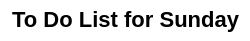
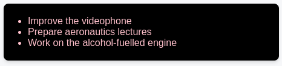
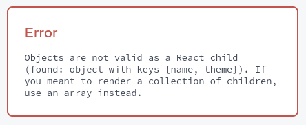

# JavaScript в JSX с фигурными скобками

JSX позволяет вам писать HTML-подобную разметку внутри файла JavaScript, сохраняя логику рендеринга и содержимое в одном месте. Иногда вы захотите добавить немного логики JavaScript или сослаться на динамическое свойство внутри этой разметки. В этой ситуации вы можете использовать фигурные скобки в JSX, чтобы открыть окно для JavaScript.

!!!tip "Вы узнаете"

    -   Как передавать строки с кавычками
    -   Как ссылаться на переменную JavaScript внутри JSX с помощью фигурных скобок
    -   Как вызвать функцию JavaScript в JSX с помощью фигурных скобок
    -   Как использовать объект JavaScript внутри JSX с фигурными скобками

## Передача строк с кавычками

Когда вы хотите передать строковый атрибут в JSX, вы заключаете его в одинарные или двойные кавычки:

<!-- 0001.part.md -->

=== "App.js"

    ```js
    export default function Avatar() {
    	return (
    		
    	);
    }
    ```

=== "Результат"

    

<!-- 0004.part.md -->

Здесь `"https://i.imgur.com/7vQD0fPs.jpg"` и `"Gregorio Y. Zara"` передаются как строки.

Но что если вы хотите динамически указать текст `src` или `alt`? Вы можете **использовать значение из JavaScript, заменив `и` на `{` и ``}`**:

<!-- 0005.part.md -->

=== "App.js"

    ```js
    export default function Avatar() {
    	const avatar = 'https://i.imgur.com/7vQD0fPs.jpg';
    	const description = 'Gregorio Y. Zara';
    	return (
    		
    	);
    }
    ```

=== "Результат"

    

<!-- 0008.part.md -->

Обратите внимание на разницу между `className="avatar"`, которая определяет имя CSS-класса `"avatar"`, который делает изображение круглым, и `src={avatar}`, которая читает значение переменной JavaScript под названием `avatar`. Это потому, что фигурные скобки позволяют вам работать с JavaScript прямо в вашей разметке!

## Использование фигурных скобок: Окно в мир JavaScript

JSX - это особый способ написания JavaScript. Это означает, что можно использовать JavaScript внутри него - с фигурными скобками `{ }`. В приведенном ниже примере сначала объявляется имя ученого, `name`, затем оно помещается в фигурные скобки внутри `<h1>`:

<!-- 0009.part.md -->

=== "App.js"

    ```js
    export default function TodoList() {
    	const name = 'Gregorio Y. Zara';
    	return <h1>{name}'s To Do List</h1>;
    }
    ```

=== "Результат"

    

<!-- 0010.part.md -->

Попробуйте изменить значение `name` с `Грегорио Й. Зара` на `Хеди Ламарр`. Видите, как изменился заголовок списка?

Любое выражение JavaScript будет работать между фигурными скобками, включая вызовы функций, таких как `formatDate()`:

<!-- 0011.part.md -->

=== "App.js"

    ```js
    const today = new Date();

    function formatDate(date) {
    	return new Intl.DateTimeFormat('en-US', {
    		weekday: 'long',
    	}).format(date);
    }

    export default function TodoList() {
    	return <h1>To Do List for {formatDate(today)}</h1>;
    }
    ```

=== "Результат"

    

<!-- 0012.part.md -->

### Где использовать фигурные скобки

В JSX фигурные скобки можно использовать только двумя способами:

1.  **В качестве текста** непосредственно внутри тега JSX: `<h1>{name}'s To Do List</h1>` работает, а <code>&lt;{tag}&gt;Gregorio Y. Zara's To Do List&lt;/{tag}&gt;</code> не работает.
2.  **Атрибуты** сразу после знака `=`: `src={avatar}` прочитает переменную `avatar`, но `src="{avatar}"` передаст строку `"{avatar}"`.

## Использование "двойных завитушек": CSS и другие объекты в JSX

Помимо строк, чисел и других выражений JavaScript, в JSX можно передавать даже объекты. Объекты также обозначаются фигурными скобками, например `{ name: "Hedy Lamarr", inventions: 5 }`. Поэтому, чтобы передать объект JS в JSX, вы должны обернуть объект в другую пару фигурных скобок: `person={{ name: "Hedy Lamarr", inventions: 5 }}`.

Подобное можно увидеть при использовании встроенных стилей CSS в JSX. React не требует использования встроенных стилей (классы CSS отлично подходят для большинства случаев). Но когда вам нужен встроенный стиль, вы передаете объект в атрибут `style`:

<!-- 0013.part.md -->

=== "App.js"

    ```js
    export default function TodoList() {
    	return (
    		<ul
    			style={{
    				backgroundColor: 'black',
    				color: 'pink',
    			}}
    		>
    			<li>Improve the videophone</li>
    			<li>Prepare aeronautics lectures</li>
    			<li>Work on the alcohol-fuelled engine</li>
    		</ul>
    	);
    }
    ```

=== "Результат"

    

<!-- 0016.part.md -->

Попробуйте изменить значения `backgroundColor` и `color`.

Вы действительно можете увидеть объект JavaScript внутри фигурных скобок, если напишете его так:

<!-- 0017.part.md -->

```js
<ul style={
  {
    backgroundColor: 'black',
    color: 'pink'
  }
}>
```

<!-- 0018.part.md -->

Когда в следующий раз вы увидите `{{` и `}}` в JSX, знайте, что это не что иное, как объект внутри JSX curlies!

!!!warning "Внимание"

    Инлайн-свойства `style` записываются в camelCase. Например, HTML `<ul style="background-color: black">` будет записан как `<ul style={{ backgroundColor: 'black' }}>` в вашем компоненте.

## Больше веселья с объектами JavaScript и фигурными скобками

Вы можете поместить несколько выражений в один объект и ссылаться на них в JSX внутри фигурных скобок:

<!-- 0019.part.md -->

=== "App.js"

    ```js
    const person = {
    	name: 'Gregorio Y. Zara',
    	theme: {
    		backgroundColor: 'black',
    		color: 'pink',
    	},
    };

    export default function TodoList() {
    	return (
    		<div style={person.theme}>
    			<h1>{person.name}'s Todos</h1>
    			
    			<ul>
    				<li>Improve the videophone</li>
    				<li>Prepare aeronautics lectures</li>
    				<li>Work on the alcohol-fuelled engine</li>
    			</ul>
    		</div>
    	);
    }
    ```

=== "Результат"

    

<!-- 0022.part.md -->

В этом примере объект JavaScript `person` содержит строку `name` и объект `theme`:

<!-- 0023.part.md -->

```js
const person = {
    name: 'Gregorio Y. Zara',
    theme: {
        backgroundColor: 'black',
        color: 'pink',
    },
};
```

<!-- 0024.part.md -->

Компонент может использовать эти значения из `person` следующим образом:

<!-- 0025.part.md -->

```js
<div style={person.theme}>
  <h1>{person.name}'s Todos</h1>
```

<!-- 0026.part.md -->

JSX очень минимален как язык шаблонов, потому что он позволяет организовать данные и логику с помощью JavaScript.

!!!note "Итого"

    Теперь вы знаете почти все о JSX:

    -   Атрибуты JSX, заключенные в кавычки, передаются как строки.
    -   Фигурные скобки позволяют вам привнести логику и переменные JavaScript в вашу разметку.
    -   Они работают внутри содержимого тега JSX или сразу после `=` в атрибутах.
    -   `{{` и `}}` - это не специальный синтаксис: это объект JavaScript, помещенный в фигурные скобки JSX.

## Задачи

### 1. Исправьте ошибку

Этот код аварийно завершается с ошибкой `Objects are not valid as a React child`:

<!-- 0027.part.md -->

=== "App.js"

    ```js
    const person = {
    	name: 'Gregorio Y. Zara',
    	theme: {
    		backgroundColor: 'black',
    		color: 'pink',
    	},
    };

    export default function TodoList() {
    	return (
    		<div style={person.theme}>
    			<h1>{person}'s Todos</h1>
    			
    			<ul>
    				<li>Improve the videophone</li>
    				<li>Prepare aeronautics lectures</li>
    				<li>Work on the alcohol-fuelled engine</li>
    			</ul>
    		</div>
    	);
    }
    ```

=== "Результат"

    

<!-- 0030.part.md -->

Можете ли вы найти проблему?

???tip "Показать подсказку"

    Посмотрите, что находится внутри фигурных скобок. Мы поместили туда то, что нужно?

???success "Показать решение"

    Это происходит потому, что в данном примере в разметку помещается _сам объект_, а не строка: `<h1>{person}'s Todos</h1>` пытается отобразить весь объект `person`! Включение необработанных объектов в текстовое содержимое приводит к ошибке, потому что React не знает, как вы хотите их отобразить.

    Чтобы исправить это, замените `<h1>{person}'s Todos</h1>` на `<h1>{person.name}'s Todos</h1>`:

    <!-- 0031.part.md -->

    === "App.js"

    	```js
    	const person = {
    		name: 'Gregorio Y. Zara',
    		theme: {
    			backgroundColor: 'black',
    			color: 'pink',
    		},
    	};

    	export default function TodoList() {
    		return (
    			<div style={person.theme}>
    				<h1>{person.name}'s Todos</h1>
    				
    				<ul>
    					<li>Improve the videophone</li>
    					<li>Prepare aeronautics lectures</li>
    					<li>Work on the alcohol-fuelled engine</li>
    				</ul>
    			</div>
    		);
    	}
    	```

    === "Результат"

    	

<!-- 0034.part.md -->

### 2. Извлечение информации в объект

Извлеките URL изображения в объект `person`.

<!-- 0035.part.md -->

=== "App.js"

    ```js
    const person = {
    	name: 'Gregorio Y. Zara',
    	theme: {
    		backgroundColor: 'black',
    		color: 'pink',
    	},
    };

    export default function TodoList() {
    	return (
    		<div style={person.theme}>
    			<h1>{person.name}'s Todos</h1>
    			
    			<ul>
    				<li>Improve the videophone</li>
    				<li>Prepare aeronautics lectures</li>
    				<li>Work on the alcohol-fuelled engine</li>
    			</ul>
    		</div>
    	);
    }
    ```

=== "Результат"

    

<!-- 0038.part.md -->

???success "Показать решение"

    Переместите URL изображения в свойство `person.imageUrl` и считайте его из тега `` с помощью фигурных символов:

    === "App.js"

    	```js
    	const person = {
    		name: 'Gregorio Y. Zara',
    		imageUrl: 'https://i.imgur.com/7vQD0fPs.jpg',
    		theme: {
    			backgroundColor: 'black',
    			color: 'pink',
    		},
    	};

    	export default function TodoList() {
    		return (
    			<div style={person.theme}>
    				<h1>{person.name}'s Todos</h1>
    				
    				<ul>
    					<li>Improve the videophone</li>
    					<li>Prepare aeronautics lectures</li>
    					<li>Work on the alcohol-fuelled engine</li>
    				</ul>
    			</div>
    		);
    	}
    	```

    === "Результат"

    	

### 3. Запишите выражение внутри фигурных скобок JSX

В приведенном ниже объекте полный URL изображения разделен на четыре части: базовый URL, `imageId`, `imageSize` и расширение файла.

Мы хотим, чтобы URL изображения объединял эти атрибуты: базовый URL (всегда `'https://i.imgur.com/'`), `imageId` (`'7vQD0fP'`), `imageSize` (`'s'`) и расширение файла (всегда `'jpg'`). Однако что-то не так с тем, как тег `` указывает свой `src`.

Вы можете это исправить?

=== "App.js"

    ```js
    const baseUrl = 'https://i.imgur.com/';
    const person = {
    	name: 'Gregorio Y. Zara',
    	imageId: '7vQD0fP',
    	imageSize: 's',
    	theme: {
    		backgroundColor: 'black',
    		color: 'pink',
    	},
    };

    export default function TodoList() {
    	return (
    		<div style={person.theme}>
    			<h1>{person.name}'s Todos</h1>
    			
    			<ul>
    				<li>Improve the videophone</li>
    				<li>Prepare aeronautics lectures</li>
    				<li>Work on the alcohol-fuelled engine</li>
    			</ul>
    		</div>
    	);
    }
    ```

=== "Результат"

    

<!-- 0046.part.md -->

Чтобы проверить, что ваше исправление сработало, попробуйте изменить значение `imageSize` на `'b'`. Размер изображения должен измениться после вашей правки.

???success "Показать решение"

    Вы можете записать это как `src={baseUrl + person.imageId + person.imageSize + '.jpg'}`.

    1.  `{` открывает выражение JavaScript
    2.  `baseUrl + person.imageId + person.imageSize + '.jpg'` выдает правильную строку URL
    3.  `}` закрывает выражение JavaScript

    === "App.js"

    	```js
    	const baseUrl = 'https://i.imgur.com/';
    	const person = {
    		name: 'Gregorio Y. Zara',
    		imageId: '7vQD0fP',
    		imageSize: 's',
    		theme: {
    			backgroundColor: 'black',
    			color: 'pink',
    		},
    	};

    	export default function TodoList() {
    		return (
    			<div style={person.theme}>
    				<h1>{person.name}'s Todos</h1>
    				
    				<ul>
    					<li>Improve the videophone</li>
    					<li>Prepare aeronautics lectures</li>
    					<li>Work on the alcohol-fuelled engine</li>
    				</ul>
    			</div>
    		);
    	}
    	```

    === "Результат"

    	

    Вы также можете перенести это выражение в отдельную функцию, как `getImageUrl` ниже:

    === "App.js"

    	```js
    	import { getImageUrl } from './utils.js';

    	const person = {
    		name: 'Gregorio Y. Zara',
    		imageId: '7vQD0fP',
    		imageSize: 's',
    		theme: {
    			backgroundColor: 'black',
    			color: 'pink',
    		},
    	};

    	export default function TodoList() {
    		return (
    			<div style={person.theme}>
    				<h1>{person.name}'s Todos</h1>
    				
    				<ul>
    					<li>Improve the videophone</li>
    					<li>Prepare aeronautics lectures</li>
    					<li>Work on the alcohol-fuelled engine</li>
    				</ul>
    			</div>
    		);
    	}
    	```

    === "utils.js"

    	```js
    	export function getImageUrl(person) {
    		return (
    			'https://i.imgur.com/' +
    			person.imageId +
    			person.imageSize +
    			'.jpg'
    		);
    	}
    	```

    === "Результат"

    	

    Переменные и функции помогут вам сохранить простоту разметки!

## Ссылки

-   [https://react.dev/learn/javascript-in-jsx-with-curly-braces](https://react.dev/learn/javascript-in-jsx-with-curly-braces)
