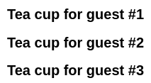
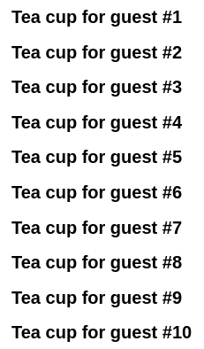
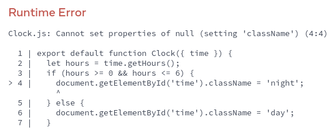
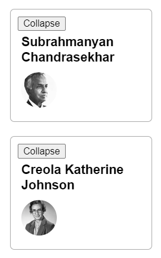
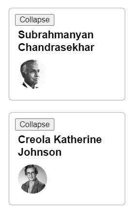
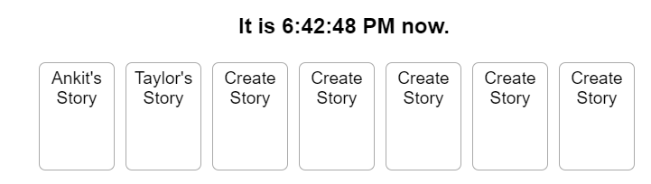
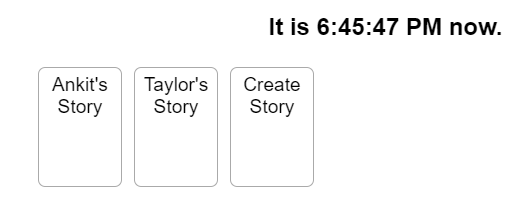

# Поддержание чистоты компонентов

Некоторые функции JavaScript являются _чистыми._ Чистые функции выполняют только вычисления и ничего более. Если вы будете писать свои компоненты только как чистые функции, вы сможете избежать целого класса непонятных ошибок и непредсказуемого поведения по мере роста вашей кодовой базы. Однако, чтобы получить эти преимущества, необходимо следовать нескольким правилам.

!!!tip "Вы узнаете"

    -   Что такое чистота и как она помогает избежать ошибок
    -   Как сохранить чистоту компонентов, не допуская изменений на этапе рендеринга
    -   Как использовать режим Strict Mode для поиска ошибок в ваших компонентах

## Чистота: Компоненты как формулы

В компьютерной науке (и особенно в мире функционального программирования) [чистая функция](https://ru.wikipedia.org/wiki/%D0%A7%D0%B8%D1%81%D1%82%D0%BE%D1%82%D0%B0_%D1%84%D1%83%D0%BD%D0%BA%D1%86%D0%B8%D0%B8) — это функция со следующими характеристиками:

-   **Она занимается своими делами.** Она не изменяет никаких объектов или переменных, существовавших до ее вызова.
-   **Одинаковые входы, одинаковый выход.** При одинаковых входах чистая функция всегда должна возвращать один и тот же результат.

Возможно, вы уже знакомы с одним примером чистых функций: формулами в математике.

Рассмотрим эту математическую формулу: $y = 2x$.

Если $x = 2$, то $y = 4$. Всегда.

Если $x = 3$, то $y = 6$. Всегда.

Если $x = 3$, то y иногда не будет 9 или -1 или 2.5 в зависимости от времени суток или состояния фондового рынка.

Если $4y = 2x$ и $x = 3$, то y всегда будет 6.

Если бы мы сделали это в виде функции JavaScript, то это выглядело бы следующим образом:

<!-- 0001.part.md -->

```js
function double(number) {
    return 2 * number;
}
```

<!-- 0002.part.md -->

В приведенном выше примере `double` — это **чистая функция.** Если вы передадите ей `3`, она вернет `6`. Всегда.

React разработан на основе этой концепции. **React предполагает, что каждый написанный вами компонент является чистой функцией.** Это означает, что написанные вами компоненты React должны всегда возвращать один и тот же JSX при одинаковых входных данных:

<!-- 0003.part.md -->

=== "App.js"

    ```js
    function Recipe({ drinkers }) {
    	return (
    		<ol>
    			<li>Boil {drinkers} cups of water.</li>
    			<li>
    				Add {drinkers} spoons of tea and{' '}
    				{0.5 * drinkers} spoons of spice.
    			</li>
    			<li>
    				Add {0.5 * drinkers} cups of milk to boil
    				and sugar to taste.
    			</li>
    		</ol>
    	);
    }

    export default function App() {
    	return (
    		<section>
    			<h1>Spiced Chai Recipe</h1>
    			<h2>For two</h2>
    			<Recipe drinkers={2} />
    			<h2>For a gathering</h2>
    			<Recipe drinkers={4} />
    		</section>
    	);
    }
    ```

=== "Результат"

    

<!-- 0004.part.md -->

Когда вы передаете `drinkers={2}` в `Recipe`, он вернет JSX, содержащий `2 чашки воды`. Всегда.

Если вы передадите `drinkers={4}`, он вернет JSX, содержащий `4 чашки воды`. Всегда.

Прямо как математическая формула.

Вы можете думать о своих компонентах как о рецептах: если вы будете следовать им и не будете вводить новые ингредиенты в процессе приготовления, то каждый раз будете получать одно и то же блюдо. Это "блюдо" — JSX, который компонент передает React для [рендеринга](render-and-commit.md).


## Побочные эффекты: (не)запланированные последствия

Процесс рендеринга в React всегда должен быть чистым. Компоненты должны только _возвращать_ свой JSX, но не _изменять_ какие-либо объекты или переменные, существовавшие до рендеринга — это сделает их нечистыми!

Вот компонент, который нарушает это правило:

<!-- 0005.part.md -->

=== "App.js"

    ```js
    let guest = 0;

    function Cup() {
    	// Bad: changing a preexisting variable!
    	guest = guest + 1;
    	return <h2>Tea cup for guest #{guest}</h2>;
    }

    export default function TeaSet() {
    	return (
    		<>
    			<Cup />
    			<Cup />
    			<Cup />
    		</>
    	);
    }
    ```

=== "Результат"

    

<!-- 0006.part.md -->

Этот компонент читает и записывает переменную `guest`, объявленную вне его. Это означает, что **вызов этого компонента несколько раз будет выдавать разные JSX!** И более того, если _другие_ компоненты будут читать `guest`, они тоже будут выдавать разные JSX, в зависимости от того, когда они были вызваны! Это не предсказуемо.

Возвращаясь к нашей формуле $y = 2x$, теперь, даже если $x = 2$, мы не можем доверять, что $y = 4$. Наши тесты могут не сработать, наши пользователи будут озадачены, самолеты будут падать с неба — вы видите, как это может привести к запутанным ошибкам!

Вы можете исправить этот компонент, [передав `guest` как prop вместо этого](passing-props-to-a-component.md):

<!-- 0007.part.md -->

=== "App.js"

    ```js
    function Cup({ guest }) {
    	return <h2>Tea cup for guest #{guest}</h2>;
    }

    export default function TeaSet() {
    	return (
    		<>
    			<Cup guest={1} />
    			<Cup guest={2} />
    			<Cup guest={3} />
    		</>
    	);
    }
    ```

=== "Результат"

    

<!-- 0008.part.md -->

Теперь ваш компонент чист, поскольку JSX, который он возвращает, зависит только от реквизита `guest`.

В целом, вы не должны ожидать, что ваши компоненты будут отображаться в каком-то определенном порядке. Не имеет значения, вызываете ли вы $y = 2x$ до или после $y = 5x$: обе формулы будут разрешены независимо друг от друга. Точно так же каждый компонент должен "думать только за себя", и не пытаться координировать свою работу с другими или зависеть от них во время рендеринга. Рендеринг — это как школьный экзамен: каждый компонент должен вычислять JSX самостоятельно!

!!!note "Обнаружение нечистых вычислений с помощью StrictMode"

    Хотя вы, возможно, еще не использовали их все, в React есть три вида входных данных, которые вы можете читать во время рендеринга: [props](passing-props-to-a-component.md), [state](state-a-components-memory.md), и [context](passing-data-deeply-with-context.md). Вы всегда должны рассматривать эти входы как доступные только для чтения.

    Когда вы хотите _изменить_ что-то в ответ на ввод пользователя, вам следует [set state](state-a-components-memory.md) вместо записи в переменную. Вы никогда не должны изменять уже существующие переменные или объекты во время рендеринга вашего компонента.

    React предлагает "Строгий режим", в котором он дважды вызывает функцию каждого компонента во время разработки. **Вызывая функции компонента дважды, "Строгий режим" помогает найти компоненты, которые нарушают эти правила.**

    Обратите внимание, как в исходном примере вместо "Гость \#2", "Гость \#4" и "Гость \#6" отображаются "Гость \#1", "Гость \#2" и "Гость \#3". Оригинальная функция была нечистой, поэтому вызов ее дважды нарушал ее. Но исправленная чистая версия работает, даже если функция вызывается каждый раз дважды. **Чистые функции только вычисляют, поэтому вызов их дважды ничего не изменит** — так же, как вызов `double(2)` дважды не меняет того, что возвращается, и решение $y = 2x$ дважды не меняет того, чем является `y`. Те же входы, те же выходы. Всегда.

    Строгий режим не имеет эффекта в производстве, поэтому он не замедлит работу приложения для ваших пользователей. Чтобы перейти в строгий режим, вы можете обернуть ваш корневой компонент в `<React.StrictMode>`. Некоторые фреймворки делают это по умолчанию.

### Локальная мутация: Маленький секрет вашего компонента

В приведенном выше примере проблема заключалась в том, что компонент изменял _предшествующую_ переменную во время рендеринга. Это часто называют **"мутацией "**, чтобы звучало немного страшнее. Чистые функции не мутируют переменные вне области видимости функции или объекты, которые были созданы до вызова — это делает их нечистыми!

Однако **совершенно нормально изменять переменные и объекты, которые вы _только что_ создали во время рендеринга.** В этом примере вы создаете массив `[]`, присваиваете его переменной `cups`, а затем `толкаете` в него дюжину чашек:

<!-- 0009.part.md -->

=== "App.js"

    ```js
    function Cup({ guest }) {
    	return <h2>Tea cup for guest #{guest}</h2>;
    }

    export default function TeaGathering() {
    	let cups = [];
    	for (let i = 1; i <= 10; i++) {
    		cups.push(<Cup key={i} guest={i} />);
    	}
    	return cups;
    }
    ```

=== "Результат"

    

<!-- 0010.part.md -->

Если бы переменная `cups` или массив `[]` были созданы вне функции `TeaGathering`, это было бы огромной проблемой! Вы бы изменяли _предшествующий_ объект, заталкивая элементы в этот массив.

Однако, все в порядке, потому что вы создали их _во время того же рендера_, внутри `TeaGathering`. Никакой код вне `TeaGathering` никогда не узнает, что это произошло. Это называется **"локальная мутация "** — это как маленький секрет вашего компонента.

## Где вы _можете_ вызвать побочные эффекты

Хотя функциональное программирование в значительной степени полагается на чистоту, в какой-то момент, где-то, _что-то_ должно измениться. В этом и заключается смысл программирования! Эти изменения — обновление экрана, запуск анимации, изменение данных — называются **боковыми эффектами.** Они происходят _"на стороне "_, не во время рендеринга.

В React **сторонние эффекты обычно находятся внутри [обработчиков событий](responding-to-events.md)** Обработчики событий — это функции, которые React запускает при выполнении какого-либо действия — например, при нажатии на кнопку. Несмотря на то, что обработчики событий определяются _внутри_ вашего компонента, они не выполняются _во время_ рендеринга! **Поэтому обработчики событий не обязательно должны быть чистыми.**

Если вы исчерпали все другие варианты и не можете найти подходящий обработчик событий для вашего побочного эффекта, вы все равно можете прикрепить его к возвращаемому JSX с помощью вызова [`useEffect`](../reference/useEffect.md) в вашем компоненте. Это говорит React выполнить его позже, после рендеринга, когда побочные эффекты разрешены. Однако этот подход должен быть вашим последним средством.

Когда это возможно, старайтесь выражать свою логику только с помощью рендеринга. Вы будете удивлены, как далеко это может завести вас!

!!!note "Почему React заботится о чистоте?"

    Написание чистых функций требует некоторой привычки и дисциплины. Но это также открывает чудесные возможности:

    -   Ваши компоненты могут работать в другой среде — например, на сервере! Поскольку они возвращают один и тот же результат при одинаковых входных данных, один компонент может обслуживать множество запросов пользователей.
    -   Вы можете повысить производительность, [пропуская рендеринг](../reference/memo.md) компонентов, входные данные которых не изменились. Это безопасно, потому что чистые функции всегда возвращают одинаковые результаты, поэтому их можно кэшировать.
    -   Если какие-то данные изменяются в середине рендеринга глубокого дерева компонентов, React может перезапустить рендеринг, не тратя время на завершение устаревшего рендеринга. Чистота делает безопасным прекращение вычислений в любое время.

    Каждая новая функция React, которую мы создаем, использует преимущества чистоты. От выборки данных до анимации и производительности, сохранение чистоты компонентов раскрывает всю мощь парадигмы React.

!!! note "Итоги"

    -   Компонент должен быть чистым, что означает:
    	-   **Он занимается своими делами.** Он не должен изменять никакие объекты или переменные, которые существовали до рендеринга.
    	-   **Одинаковые входы, одинаковый выход.** При одинаковых входах компонент всегда должен возвращать одинаковый JSX.
    -   Рендеринг может произойти в любое время, поэтому компоненты не должны зависеть друг от друга.
    -   Вы не должны изменять никакие входные данные, которые ваши компоненты используют для рендеринга. Это включает в себя реквизиты, состояние и контекст. Чтобы обновить экран, ["установите" состояние](state-a-components-memory.md) вместо того, чтобы мутировать уже существующие объекты.
    -   Стремитесь выразить логику вашего компонента в JSX, который вы возвращаете. Когда вам нужно "что-то изменить", вы обычно хотите сделать это в обработчике событий. В крайнем случае, вы можете использовать `Effect`.
    -   Написание чистых функций требует некоторой практики, но оно раскрывает всю мощь парадигмы React.

## Задачи

### 1. Починить сломанные часы

Этот компонент пытается установить CSS-класс `<h1>` на `night` в период с полуночи до шести часов утра, и на `day` во все остальное время. Однако это не срабатывает. Можете ли вы исправить этот компонент?

Вы можете проверить, работает ли ваше решение, временно изменив часовой пояс компьютера. Когда текущее время находится между полуночью и шестью часами утра, часы должны иметь инвертированные цвета!

Рендеринг — это _вычисление_, он не должен пытаться "делать" вещи. Можете ли вы выразить ту же идею по-другому?

<!-- 0012.part.md -->

=== "Clock.js"

    ```js
    export default function Clock({ time }) {
    	let hours = time.getHours();
    	if (hours >= 0 && hours <= 6) {
    		document.getElementById('time').className = 'night';
    	} else {
    		document.getElementById('time').className = 'day';
    	}
    	return <h1 id="time">{time.toLocaleTimeString()}</h1>;
    }
    ```

=== "Результат"

    

<!-- 0017.part.md -->

???tip "Показать подсказку"

    Рендеринг — это расчет, он не должен пытаться "делать" что-то. Можете ли вы выразить ту же идею по-другому?

???success "Показать решение"

    Вы можете исправить этот компонент, вычислив `className` и включив его в вывод рендера:

    <!-- 0018.part.md -->

    === "App.js"

    	```js
    	export default function Clock({ time }) {
    		let hours = time.getHours();
    		let className;
    		if (hours >= 0 && hours <= 6) {
    			className = 'night';
    		} else {
    			className = 'day';
    		}
    		return (
    			<h1 className={className}>
    				{time.toLocaleTimeString()}
    			</h1>
    		);
    	}
    	```

    === "Результат"

    	

    В этом примере побочный эффект (изменение DOM) был совсем не нужен. Вам нужно было только вернуть JSX.

### 2. Исправление сломанного профиля

Два компонента `Profile` отображаются бок о бок с разными данными. Нажмите "Свернуть" на первом профиле, а затем "Развернуть" его. Вы заметите, что теперь в обоих профилях отображается один и тот же человек. Это ошибка.

Найдите причину ошибки и исправьте ее.

Код ошибки находится в файле `Profile.js`. Убедитесь, что вы прочитали его сверху вниз!

<!-- 0024.part.md -->

=== "Profile.js"

    ```js
    import Panel from './Panel.js';
    import { getImageUrl } from './utils.js';

    let currentPerson;

    export default function Profile({ person }) {
    	currentPerson = person;
    	return (
    		<Panel>
    			<Header />
    			<Avatar />
    		</Panel>
    	);
    }

    function Header() {
    	return <h1>{currentPerson.name}</h1>;
    }

    function Avatar() {
    	return (
    		
    	);
    }
    ```

=== "Panel.js"

    ```js
    import { useState } from 'react';

    export default function Panel({ children }) {
    	const [open, setOpen] = useState(true);
    	return (
    		<section className="panel">
    			<button onClick={() => setOpen(!open)}>
    				{open ? 'Collapse' : 'Expand'}
    			</button>
    			{open && children}
    		</section>
    	);
    }
    ```

=== "App.js"

    ```js
    import Profile from './Profile.js';

    export default function App() {
    	return (
    		<>
    			<Profile
    				person={{
    					imageId: 'lrWQx8l',
    					name: 'Subrahmanyan Chandrasekhar',
    				}}
    			/>
    			<Profile
    				person={{
    					imageId: 'MK3eW3A',
    					name: 'Creola Katherine Johnson',
    				}}
    			/>
    		</>
    	);
    }
    ```

=== "utils.js"

    ```js
    export function getImageUrl(person, size = 's') {
    	return (
    		'https://i.imgur.com/' +
    		person.imageId +
    		size +
    		'.jpg'
    	);
    }
    ```

=== "Результат"

    

<!-- 0033.part.md -->

???tip "Показать подсказку"

    Ошибочный код находится в файле `Profile.js`. Обязательно прочитайте его сверху вниз!

???success "Показать решение"

    Проблема в том, что компонент `Profile` записывает в заранее существующую переменную `currentPerson`, а компоненты `Header` и `Avatar` читают из нее. Это делает _все три компонента_ нечистыми и трудно предсказуемыми.

    Чтобы исправить ошибку, удалите переменную `currentPerson`. Вместо этого передайте всю информацию из `Profile` в `Header` и `Avatar` через props. Вам нужно будет добавить параметр `person` в оба компонента и передавать его по всему пути вниз.

    <!-- 0034.part.md -->

    === "Profile.js"

    	```js
    	import Panel from './Panel.js';
    	import { getImageUrl } from './utils.js';

    	export default function Profile({ person }) {
    		return (
    			<Panel>
    				<Header person={person} />
    				<Avatar person={person} />
    			</Panel>
    		);
    	}

    	function Header({ person }) {
    		return <h1>{person.name}</h1>;
    	}

    	function Avatar({ person }) {
    		return (
    			
    		);
    	}
    	```

    === "App.js"

    	```js
    	import Profile from './Profile.js';

    	export default function App() {
    		return (
    			<>
    				<Profile
    					person={{
    						imageId: 'lrWQx8l',
    						name: 'Subrahmanyan Chandrasekhar',
    					}}
    				/>
    				<Profile
    					person={{
    						imageId: 'MK3eW3A',
    						name: 'Creola Katherine Johnson',
    					}}
    				/>
    			</>
    		);
    	}
    	```

    === "Результат"

    	

    <!-- 0043.part.md -->

    Помните, что React не гарантирует, что функции компонентов будут выполняться в каком-либо определенном порядке, поэтому вы не можете взаимодействовать между ними, задавая переменные. Все взаимодействие должно происходить через параметры.

### 3. Почините сломанный лоток для историй

Генеральный директор вашей компании просит вас добавить "истории" в ваше приложение онлайн-часов, и вы не можете отказать. Вы написали компонент `StoryTray`, который принимает список `stories`, за которым следует заполнитель "Create Story".

Вы реализовали заполнитель "Create Story", поместив еще одну фальшивую историю в конец массива `stories`, который вы получаете в качестве реквизита. Но по какой-то причине "Create Story" появляется более одного раза. Исправьте эту проблему.

<!-- 0044.part.md -->

=== "StoryTray.js"

    ```js
    export default function StoryTray({ stories }) {
    	stories.push({
    		id: 'create',
    		label: 'Create Story',
    	});

    	return (
    		<ul>
    			{stories.map((story) => (
    				<li key={story.id}>{story.label}</li>
    			))}
    		</ul>
    	);
    }
    ```

=== "Результат"

    

<!-- 0051.part.md -->

???success "Показать решение"

    Обратите внимание, что каждый раз, когда часы обновляются, "Create Story" добавляется _дважды_. Это служит подсказкой, что у нас есть мутация во время рендеринга — строгий режим вызывает компоненты дважды, чтобы сделать эти проблемы более заметными.

    Функция `StoryTray` не является чистой. Вызывая `push` на полученном массиве `stories` (prop!), она мутирует объект, который был создан _до_ того, как `StoryTray` начал рендеринг. Это делает его глючным и очень трудно предсказуемым.

    Самое простое исправление — не трогать массив вообще, и рендерить "Create Story" отдельно:

    <!-- 0052.part.md -->

    === "StoryTray.js"

    	```js
    	export default function StoryTray({ stories }) {
    		return (
    			<ul>
    				{stories.map((story) => (
    					<li key={story.id}>{story.label}</li>
    				))}
    				<li>Create Story</li>
    			</ul>
    		);
    	}
    	```

    === "Результат"

    	

    <!-- 0057.part.md -->

    В качестве альтернативы вы можете создать _новый_ массив (скопировав существующий), прежде чем поместить в него элемент:

    <!-- 0058.part.md -->

    === "StoryTray.js"

    	```js
    	export default function StoryTray({ stories }) {
    		// Copy the array!
    		let storiesToDisplay = stories.slice();

    		// Does not affect the original array:
    		storiesToDisplay.push({
    			id: 'create',
    			label: 'Create Story',
    		});

    		return (
    			<ul>
    				{storiesToDisplay.map((story) => (
    					<li key={story.id}>{story.label}</li>
    				))}
    			</ul>
    		);
    	}
    	```

    === "Результат"

    	

    <!-- 0063.part.md -->

    Это позволяет сохранить локальность мутации и чистоту функции рендеринга. Однако все равно нужно быть осторожным: например, если вы попытаетесь изменить любой из существующих элементов массива, вам придется клонировать и эти элементы.

    Полезно помнить, какие операции над массивами изменяют их, а какие нет. Например, `push`, `pop`, `reverse` и `sort` изменяют исходный массив, а `slice`, `filter` и `map` создают новый.

<!-- 0064.part.md -->

## Ссылки

-   [https://react.dev/learn/keeping-components-pure](https://react.dev/learn/keeping-components-pure)
