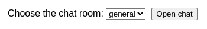
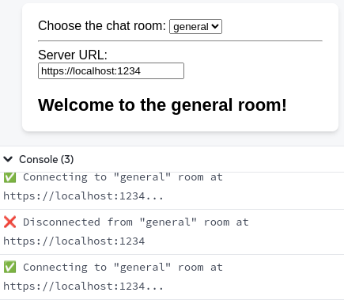
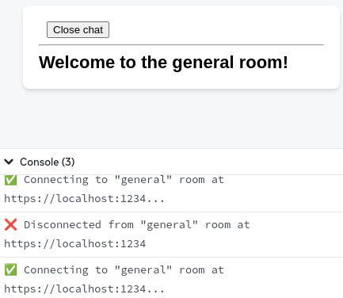
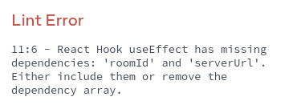
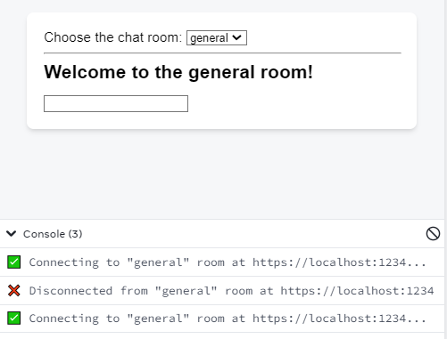
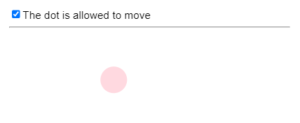
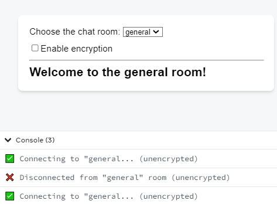
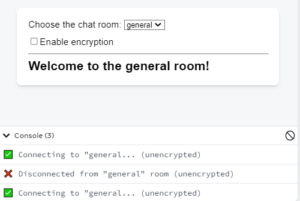
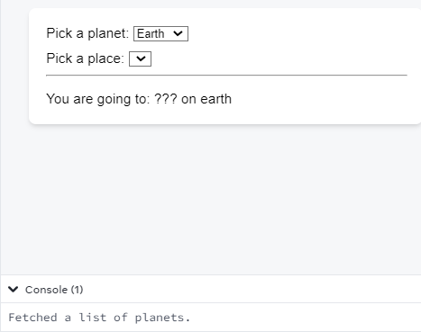
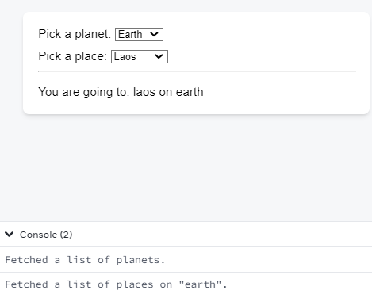

# Жизненный цикл реактивных эффектов

Эффекты имеют отличный от компонентов жизненный цикл. Компоненты могут монтироваться, обновляться и размонтироваться. Эффект может делать только две вещи: начать синхронизировать что-то, а затем прекратить синхронизацию. Этот цикл может происходить несколько раз, если ваш Эффект зависит от пропсов и состояния, которые меняются со временем. React предоставляет правило линтера для проверки того, что вы правильно указали зависимости вашего Эффекта. Благодаря этому ваш Эффект синхронизируется с последними пропсами и состоянием.

!!!tip "Вы узнаете"

    -   Чем жизненный цикл Эффекта отличается от жизненного цикла компонента
    -   Как думать о каждом отдельном Эффекте в отдельности
    -   Когда ваш Эффект должен повторно синхронизироваться и почему
    -   Как определяются зависимости вашего Эффекта
    -   Что значит для значения быть реактивным
    -   Что означает пустой массив зависимостей
    -   Как React проверяет правильность ваших зависимостей с помощью линтера
    -   Что делать, если вы не согласны с линтером.

## Жизненный цикл эффекта

Каждый компонент React проходит через один и тот же жизненный цикл:

-   Компонент _монтируется_, когда его добавляют на экран.
-   Компонент _обновляется_, когда получает новые пропсы или состояние, обычно в ответ на взаимодействие.
-   Компонент _размонтируется_, когда его удаляют с экрана.

**Это хороший способ думать о компонентах, но _не_ об Эффектах.** Вместо этого постарайтесь думать о каждом Эффекте независимо от жизненного цикла вашего компонента. Эффект описывает, как [синхронизировать внешнюю систему](synchronizing-with-effects.md) с текущим пропсом и состоянием. По мере изменения вашего кода синхронизация будет требоваться чаще или реже.

Чтобы проиллюстрировать этот момент, рассмотрим этот Эффект, соединяющий ваш компонент с сервером чата:

<!-- 0001.part.md -->

```js
const serverUrl = 'https://localhost:1234';

function ChatRoom({ roomId }) {
    useEffect(() => {
        const connection = createConnection(
            serverUrl,
            roomId
        );
        connection.connect();
        return () => {
            connection.disconnect();
        };
    }, [roomId]);
    // ...
}
```

<!-- 0002.part.md -->

Тело вашего Эффекта определяет, как **начать синхронизацию:**.

<!-- 0003.part.md -->

```js
// ...
const connection = createConnection(serverUrl, roomId);
connection.connect();
return () => {
    connection.disconnect();
};
// ...
```

<!-- 0004.part.md -->

Функция очистки, возвращаемая вашим Effect, определяет, как **остановить синхронизацию:**.

<!-- 0005.part.md -->

```js
// ...
const connection = createConnection(serverUrl, roomId);
connection.connect();
return () => {
    connection.disconnect();
};
// ...
```

<!-- 0006.part.md -->

Интуитивно вы можете подумать, что React **начнет синхронизацию**, когда ваш компонент монтируется, и **остановит синхронизацию**, когда ваш компонент размонтируется. Однако, это еще не конец истории! Иногда может потребоваться **запускать и останавливать синхронизацию несколько раз**, пока компонент остается смонтированным.

Давайте рассмотрим, _почему_ это необходимо, _когда_ это происходит, и _как_ вы можете контролировать это поведение.

!!!note ""

    Некоторые эффекты вообще не возвращают функцию очистки. [Чаще всего](synchronizing-with-effects.md#how-to-handle-the-effect-firing-twice-in-development) вы захотите вернуть такую функцию - но если вы этого не сделаете, React будет вести себя так, как будто вы вернули пустую функцию очистки.

### Почему синхронизация может потребоваться более одного раза

Представьте, что компонент `ChatRoom` получает параметр `roomId`, который пользователь выбирает в выпадающем списке. Предположим, что изначально пользователь выбирает в качестве `roomId` комнату `"general"`. Ваше приложение отображает чат `общий`:

<!-- 0007.part.md -->

```js
const serverUrl = 'https://localhost:1234';

function ChatRoom({ roomId /* "general" */ }) {
    // ...
    return <h1>Welcome to the {roomId} room!</h1>;
}
```

<!-- 0008.part.md -->

После отображения пользовательского интерфейса React запустит ваш Эффект, чтобы **начать синхронизацию.** Он подключается к комнате `general`:

<!-- 0009.part.md -->

```js
function ChatRoom({ roomId /* "general" */ }) {
  useEffect(() => {
    const connection = createConnection(serverUrl, roomId); // Connects to the "general" room
    connection.connect();
    return () => {
      connection.disconnect(); // Disconnects from the "general" room
    };
  }, [roomId]);
  // ...
```

<!-- 0010.part.md -->

Пока все хорошо.

Позже пользователь выбирает в выпадающем списке другой номер (например, `"travel"`). Сначала React обновит пользовательский интерфейс:

<!-- 0011.part.md -->

```js
function ChatRoom({ roomId /* "travel" */ }) {
    // ...
    return <h1>Welcome to the {roomId} room!</h1>;
}
```

<!-- 0012.part.md -->

Подумайте, что должно произойти дальше. Пользователь видит, что `"travel"` является выбранной комнатой чата в пользовательском интерфейсе. Однако Эффект, запущенный в прошлый раз, все еще подключен к комнате `"general"`. **Показатель `roomId` изменился, поэтому то, что ваш Эффект сделал тогда (подключился к комнате `"general"`), больше не соответствует UI.**.

На данном этапе вы хотите, чтобы React сделал две вещи:

1.  Прекратить синхронизацию со старым `roomId` (отсоединиться от `"общей"` комнаты).
2.  Начать синхронизацию с новым `roomId` (подключиться к комнате `"travel"`)

**К счастью, вы уже научили React делать обе эти вещи!** Тело вашего эффекта определяет, как начать синхронизацию, а функция очистки - как остановить синхронизацию. Все, что теперь нужно сделать React, это вызвать их в правильном порядке и с правильными пропсами и состоянием. Давайте посмотрим, как именно это происходит.

### Как React повторно синхронизирует ваш эффект

Вспомните, что ваш компонент `ChatRoom` получил новое значение для своего параметра `roomId`. Раньше это было `"general"`, а теперь `"travel"`. React должен повторно синхронизировать ваш Effect, чтобы переподключить вас к другой комнате.

Чтобы **остановить синхронизацию,** React вызовет функцию очистки, которую ваш Эффект вернул после подключения к комнате `"general"`. Поскольку `roomId` был `"general"`, функция очистки отсоединяется от `"general"` комнаты:

<!-- 0013.part.md -->

```js
function ChatRoom({ roomId /* "general" */ }) {
    useEffect(() => {
        const connection = createConnection(
            serverUrl,
            roomId
        ); // Connects to the "general" room
        connection.connect();
        return () => {
            connection.disconnect(); // Disconnects from the "general" room
        };
        // ...
    });
}
```

<!-- 0014.part.md -->

Затем React запустит Effect, который вы предоставили во время этого рендеринга. На этот раз `roomId` будет `"travel"`, поэтому он **начнет синхронизацию** с чатом `"travel"` (пока не будет вызвана его функция очистки):

<!-- 0015.part.md -->

```js
function ChatRoom({ roomId /* "travel" */ }) {
    useEffect(() => {
        const connection = createConnection(
            serverUrl,
            roomId
        ); // Connects to the "travel" room
        connection.connect();
        // ...
    });
}
```

<!-- 0016.part.md -->

Благодаря этому, вы теперь подключены к той же комнате, которую пользователь выбрал в пользовательском интерфейсе. Катастрофа предотвращена!

Каждый раз, когда ваш компонент будет рендериться с другим `roomId`, ваш Effect будет заново синхронизироваться. Например, допустим, пользователь меняет `roomId` с `"travel"` на `"music"`. React снова **остановит синхронизацию** вашего Эффекта, вызвав свою функцию очистки (отсоединив вас от комнаты `"travel"`). Затем он **начнет синхронизацию** снова, запустив свое тело с новым параметром `roomId` (подключив вас к комнате `"music"`).

Наконец, когда пользователь переходит на другой экран, `ChatRoom` размонтируется. Теперь нет необходимости оставаться на связи. React **остановит синхронизацию** вашего Эффекта в последний раз и отключит вас от чата `музыкальной` комнаты.

### Мышление с точки зрения Эффекта

Давайте вспомним все, что произошло с точки зрения компонента `ChatRoom`:

1.  `ChatRoom` смонтирован с `roomId`, установленным на `"general"`.
2.  `ChatRoom` обновлен с `roomId`, установленным в `"travel"`.
3.  Обновлена `ChatRoom` с `roomId`, установленным на `"music"`.
4.  `ChatRoom` размонтирован

В каждой из этих точек жизненного цикла компонента ваш Effect делал разные вещи:

1.  Ваш Эффект подключился к комнате `"general"`.
2.  Ваш Эффект отсоединился от `общей` комнаты и подключился к `комнате путешествий`.
3.  Ваш эффект отключен от комнаты `путешествий` и подключен к комнате `музыкальной`
4.  Ваш Эффект отключился от комнаты `музыка`.

Теперь давайте подумаем о том, что произошло с точки зрения самого Эффекта:

<!-- 0017.part.md -->

```js
useEffect(() => {
    // Your Effect connected to the room specified with roomId...
    const connection = createConnection(serverUrl, roomId);
    connection.connect();
    return () => {
        // ...until it disconnected
        connection.disconnect();
    };
}, [roomId]);
```

<!-- 0018.part.md -->

Структура этого кода может вдохновить вас увидеть произошедшее как последовательность непересекающихся временных периодов:

1.  Ваш Эффект подключился к `общей` комнате (пока не отключился)
2.  Ваш Эффект подключился к комнате `путешествия` (пока не отключился)
3.  Ваш Эффект, подключенный к комнате `музыкальной` (до отключения).

Ранее вы думали с точки зрения компонента. Когда вы смотрели с точки зрения компонента, было соблазнительно думать об Эффектах как об "обратных вызовах" или "событиях жизненного цикла", которые срабатывают в определенное время, например, "после рендеринга" или "перед размонтированием". Такой образ мышления очень быстро становится сложным, поэтому лучше его избегать.

**Вместо этого всегда фокусируйтесь на одном цикле запуска/остановки за один раз. Не должно иметь значения, монтируется ли компонент, обновляется или размонтируется. Все, что вам нужно сделать, это описать, как начать синхронизацию и как ее остановить. Если вы сделаете это хорошо, ваш Effect будет устойчив к запуску и остановке столько раз, сколько потребуется**.

Это может напомнить вам, как вы не думаете о том, монтируется или обновляется компонент, когда пишете логику рендеринга, которая создает JSX. Вы описываете, что должно быть на экране, а React [вычисляет остальное](reacting-to-input-with-state.md).

### Как React проверяет, что ваш эффект может повторно синхронизироваться

Вот живой пример, с которым вы можете поиграть. Нажмите "Open chat", чтобы смонтировать компонент `ChatRoom`:

=== "App.js"

    <div markdown style="max-height: 400px; overflow-y: auto;">

    ```js
    import { useState, useEffect } from 'react';
    import { createConnection } from './chat.js';

    const serverUrl = 'https://localhost:1234';

    function ChatRoom({ roomId }) {
    	useEffect(() => {
    		const connection = createConnection(
    			serverUrl,
    			roomId
    		);
    		connection.connect();
    		return () => connection.disconnect();
    	}, [roomId]);
    	return <h1>Welcome to the {roomId} room!</h1>;
    }

    export default function App() {
    	const [roomId, setRoomId] = useState('general');
    	const [show, setShow] = useState(false);
    	return (
    		<>
    			<label>
    				Choose the chat room:{' '}
    				<select
    					value={roomId}
    					onChange={(e) =>
    						setRoomId(e.target.value)
    					}
    				>
    					<option value="general">general</option>
    					<option value="travel">travel</option>
    					<option value="music">music</option>
    				</select>
    			</label>
    			<button onClick={() => setShow(!show)}>
    				{show ? 'Close chat' : 'Open chat'}
    			</button>
    			{show && <hr />}
    			{show && <ChatRoom roomId={roomId} />}
    		</>
    	);
    }
    ```

    </div>

=== "chat.js"

    ```js
    export function createConnection(serverUrl, roomId) {
    	// A real implementation would actually connect to the server
    	return {
    		connect() {
    			console.log(
    				'✅ Connecting to "' +
    					roomId +
    					'" room at ' +
    					serverUrl +
    					'...'
    			);
    		},
    		disconnect() {
    			console.log(
    				'❌ Disconnected from "' +
    					roomId +
    					'" room at ' +
    					serverUrl
    			);
    		},
    	};
    }
    ```

=== "Результат"

    

Обратите внимание, что когда компонент монтируется в первый раз, вы видите три журнала:

1.  `✅ Подключение к "общей" комнате на https://localhost:1234...` _(только для разработчиков)_.
2.  `❌ Отключение от "общей" комнаты по адресу https://localhost:1234.` _(только для разработки)_.
3.  `✅ Подключение к "общей" комнате по адресу https://localhost:1234...`.

Первые два журнала относятся только к разработке. В процессе разработки React всегда перемонтирует каждый компонент один раз.

**React проверяет, что ваш Эффект может повторно синхронизироваться, заставляя его сделать это немедленно в разработке.** Это может напомнить вам открытие двери и закрытие ее дополнительный раз, чтобы проверить, работает ли дверной замок. React запускает и останавливает ваш Эффект один дополнительный раз в процессе разработки, чтобы проверить [вы хорошо реализовали его очистку](synchronizing-with-effects.md).

Основная причина, по которой ваш Эффект будет повторно синхронизироваться на практике, это если некоторые данные, которые он использует, изменились. В приведенной выше песочнице измените выбранную комнату чата. Обратите внимание, как при изменении `roomId` ваш Эффект пересинхронизируется.

Однако есть и более необычные случаи, когда повторная синхронизация необходима. Например, попробуйте отредактировать `serverUrl` в приведенной выше песочнице, пока открыт чат. Обратите внимание, как Эффект повторно синхронизируется в ответ на ваши изменения в коде. В будущем React может добавить больше функций, которые полагаются на повторную синхронизацию.

### Как React узнает, что ему нужно пересинхронизировать Эффект

Вам может быть интересно, как React узнал, что ваш Эффект нуждается в повторной синхронизации после изменения `roomId`. Это потому, что _вы сказали React_, что его код зависит от `roomId`, включив его в [список зависимостей:](synchronizing-with-effects.md).

<!-- 0025.part.md -->

```js
function ChatRoom({ roomId }) {
    // The roomId prop may change over time
    useEffect(() => {
        const connection = createConnection(
            serverUrl,
            roomId
        ); // This Effect reads roomId
        connection.connect();
        return () => {
            connection.disconnect();
        };
    }, [roomId]); // So you tell React that this Effect "depends on" roomId
    // ...
}
```

<!-- 0026.part.md -->

Вот как это работает:

1.  Вы знали, что `roomId` - это пропс, что означает, что он может меняться со временем.
2.  Вы знали, что ваш Effect читает `roomId` (поэтому его логика зависит от значения, которое может измениться позже).
3.  Поэтому вы указали его как зависимость вашего Эффекта (чтобы он повторно синхронизировался при изменении `roomId`).

Каждый раз после рендеринга вашего компонента React будет просматривать массив зависимостей, которые вы передали. Если любое из значений в массиве отличается от значения в том же месте, которое вы передали во время предыдущего рендеринга, React будет повторно синхронизировать ваш Effect.

Например, если вы передали `["general"]` во время первоначального рендера, а затем передали `["travel"]` во время следующего рендера, React сравнит `"general"` и `"travel"`. Это разные значения (по сравнению с [`Object.is`](https://developer.mozilla.org/docs/Web/JavaScript/Reference/Global_Objects/Object/is)), поэтому React пересинхронизирует ваш Effect. С другой стороны, если ваш компонент перерендерится, но `roomId` не изменится, ваш Эффект останется подключенным к той же комнате.

### Каждый эффект представляет собой отдельный процесс синхронизации

Не добавляйте несвязанную логику в свой Эффект только потому, что эта логика должна выполняться одновременно с уже написанным вами Эффектом. Например, допустим, вы хотите отправлять событие аналитики, когда пользователь посещает комнату. У вас уже есть Эффект, который зависит от `roomId`, поэтому у вас может возникнуть соблазн добавить вызов аналитики туда:

<!-- 0027.part.md -->

```js
function ChatRoom({ roomId }) {
    useEffect(() => {
        logVisit(roomId);
        const connection = createConnection(
            serverUrl,
            roomId
        );
        connection.connect();
        return () => {
            connection.disconnect();
        };
    }, [roomId]);
    // ...
}
```

<!-- 0028.part.md -->

Но представьте, что позже вы добавите к этому Эффекту другую зависимость, которой нужно будет восстановить соединение. Если этот Эффект повторно синхронизируется, он также вызовет `logVisit(roomId)` для той же комнаты, чего вы не предполагали. Регистрация посещения **является отдельным процессом** от подключения. Напишите их как два отдельных Эффекта:

<!-- 0029.part.md -->

```js
function ChatRoom({ roomId }) {
    useEffect(() => {
        logVisit(roomId);
    }, [roomId]);

    useEffect(() => {
        const connection = createConnection(
            serverUrl,
            roomId
        );
        // ...
    }, [roomId]);
    // ...
}
```

<!-- 0030.part.md -->

**Каждый Эффект в вашем коде должен представлять отдельный и независимый процесс синхронизации**.

В приведенном выше примере удаление одного Эффекта не нарушит логику другого Эффекта. Это хороший признак того, что они синхронизируют разные вещи, и поэтому имеет смысл разделить их. С другой стороны, если разделить целостную часть логики на отдельные Эффекты, код может выглядеть "чище", но его будет [сложнее поддерживать](you-might-not-need-an-effect.md) Вот почему вы должны думать, являются ли процессы одинаковыми или отдельными, а не о том, выглядит ли код чище.

## Эффекты "реагируют" на реактивные значения

Ваш эффект считывает две переменные (`serverUrl` и `roomId`), но вы указали только `roomId` в качестве зависимости:

<!-- 0031.part.md -->

```js
const serverUrl = 'https://localhost:1234';

function ChatRoom({ roomId }) {
    useEffect(() => {
        const connection = createConnection(
            serverUrl,
            roomId
        );
        connection.connect();
        return () => {
            connection.disconnect();
        };
    }, [roomId]);
    // ...
}
```

<!-- 0032.part.md -->

Почему `serverUrl` не должен быть зависимостью?

Потому что `serverUrl` никогда не меняется при повторном рендеринге. Она всегда одна и та же, независимо от того, сколько раз компонент перерендерится и почему. Поскольку `serverUrl` никогда не меняется, не имеет смысла указывать его как зависимость. В конце концов, зависимости делают что-то только тогда, когда они изменяются во времени!

С другой стороны, `roomId` может быть другим при повторном рендеринге. **Показатели, состояние и другие значения, объявленные внутри компонента, являются _реактивными_, потому что они вычисляются во время рендеринга и участвуют в потоке данных React.**.

Если бы `serverUrl` была переменной состояния, она была бы реактивной. Реактивные значения должны быть включены в зависимости:

<!-- 0033.part.md -->

```js
function ChatRoom({ roomId }) {
    // Props change over time
    const [serverUrl, setServerUrl] = useState(
        'https://localhost:1234'
    ); // State may change over time

    useEffect(() => {
        const connection = createConnection(
            serverUrl,
            roomId
        ); // Your Effect reads props and state
        connection.connect();
        return () => {
            connection.disconnect();
        };
    }, [roomId, serverUrl]); // So you tell React that this Effect "depends on" on props and state
    // ...
}
```

<!-- 0034.part.md -->

Включая `serverUrl` в качестве зависимости, вы обеспечиваете повторную синхронизацию Effect после его изменения.

Попробуйте изменить выбранную комнату чата или отредактировать URL сервера в этой песочнице:

=== "App.js"

    <div markdown style="max-height: 400px; overflow-y: auto;">

    ```js
    import { useState, useEffect } from 'react';
    import { createConnection } from './chat.js';

    function ChatRoom({ roomId }) {
    	const [serverUrl, setServerUrl] = useState(
    		'https://localhost:1234'
    	);

    	useEffect(() => {
    		const connection = createConnection(
    			serverUrl,
    			roomId
    		);
    		connection.connect();
    		return () => connection.disconnect();
    	}, [roomId, serverUrl]);

    	return (
    		<>
    			<label>
    				Server URL:{' '}
    				<input
    					value={serverUrl}
    					onChange={(e) =>
    						setServerUrl(e.target.value)
    					}
    				/>
    			</label>
    			<h1>Welcome to the {roomId} room!</h1>
    		</>
    	);
    }

    export default function App() {
    	const [roomId, setRoomId] = useState('general');
    	return (
    		<>
    			<label>
    				Choose the chat room:{' '}
    				<select
    					value={roomId}
    					onChange={(e) =>
    						setRoomId(e.target.value)
    					}
    				>
    					<option value="general">general</option>
    					<option value="travel">travel</option>
    					<option value="music">music</option>
    				</select>
    			</label>
    			<hr />
    			<ChatRoom roomId={roomId} />
    		</>
    	);
    }
    ```

    </div>

=== "chat.js"

    ```js
    export function createConnection(serverUrl, roomId) {
    	// A real implementation would actually connect to the server
    	return {
    		connect() {
    			console.log(
    				'✅ Connecting to "' +
    					roomId +
    					'" room at ' +
    					serverUrl +
    					'...'
    			);
    		},
    		disconnect() {
    			console.log(
    				'❌ Disconnected from "' +
    					roomId +
    					'" room at ' +
    					serverUrl
    			);
    		},
    	};
    }
    ```

=== "Результат"

    

Всякий раз, когда вы изменяете реактивное значение, например `roomId` или `serverUrl`, эффект заново подключается к серверу чата.

### Что означает эффект с пустыми зависимостями

Что произойдет, если вы переместите `serverUrl` и `roomId` за пределы компонента?

<!-- 0041.part.md -->

```js
const serverUrl = 'https://localhost:1234';
const roomId = 'general';

function ChatRoom() {
    useEffect(() => {
        const connection = createConnection(
            serverUrl,
            roomId
        );
        connection.connect();
        return () => {
            connection.disconnect();
        };
    }, []); // ✅ All dependencies declared
    // ...
}
```

<!-- 0042.part.md -->

Теперь код вашего Эффекта не использует _любые_ реактивные значения, поэтому его зависимости могут быть пустыми (`[]`).

С точки зрения компонента, пустой массив зависимостей `[]` означает, что этот Эффект подключается к чату только тогда, когда компонент монтируется, и отключается только тогда, когда компонент размонтируется. (Имейте в виду, что React все равно повторно синхронизирует его дополнительный раз в процессе разработки для стресс-тестирования вашей логики).

=== "App.js"

    <div markdown style="max-height: 400px; overflow-y: auto;">

    ```js
    import { useState, useEffect } from 'react';
    import { createConnection } from './chat.js';

    const serverUrl = 'https://localhost:1234';
    const roomId = 'general';

    function ChatRoom() {
    	useEffect(() => {
    		const connection = createConnection(
    			serverUrl,
    			roomId
    		);
    		connection.connect();
    		return () => connection.disconnect();
    	}, []);
    	return <h1>Welcome to the {roomId} room!</h1>;
    }

    export default function App() {
    	const [show, setShow] = useState(false);
    	return (
    		<>
    			<button onClick={() => setShow(!show)}>
    				{show ? 'Close chat' : 'Open chat'}
    			</button>
    			{show && <hr />}
    			{show && <ChatRoom />}
    		</>
    	);
    }
    ```

    </div>

=== "chat.js"

    ```js
    export function createConnection(serverUrl, roomId) {
    	// A real implementation would actually connect to the server
    	return {
    		connect() {
    			console.log(
    				'✅ Connecting to "' +
    					roomId +
    					'" room at ' +
    					serverUrl +
    					'...'
    			);
    		},
    		disconnect() {
    			console.log(
    				'❌ Disconnected from "' +
    					roomId +
    					'" room at ' +
    					serverUrl
    			);
    		},
    	};
    }
    ```

=== "Результат"

    

Однако, если вы думаете с точки зрения Эффекта, вам вообще не нужно думать о монтировании и размонтировании. Важно то, что вы указали, что делает ваш Эффект, чтобы начать и прекратить синхронизацию. Сегодня у него нет реактивных зависимостей. Но если вы когда-нибудь захотите, чтобы пользователь со временем изменил `roomId` или `serverUrl` (и они станут реактивными), код вашего Эффекта не изменится. Вам нужно будет только добавить их в зависимости.

### Все переменные, объявленные в теле компонента, являются реактивными

Пропсы и состояние - не единственные реактивные значения. Значения, которые вы вычисляете на их основе, также реактивны. Если пропсы или состояние изменятся, ваш компонент перерисуется, и значения, вычисленные на их основе, также изменятся. Вот почему все переменные из тела компонента, используемые эффектом, должны быть в списке зависимостей эффекта.

Допустим, пользователь может выбрать сервер чата в выпадающем списке, но он также может настроить сервер по умолчанию в настройках. Предположим, что вы уже поместили состояние настроек в [контекст](scaling-up-with-reducer-and-context.md), поэтому вы читаете `settings` из этого контекста. Теперь вы вычисляете `serverUrl` на основе выбранного сервера из props и сервера по умолчанию:

<!-- 0049.part.md -->

```js
function ChatRoom({ roomId, selectedServerUrl }) {
    // roomId is reactive
    const settings = useContext(SettingsContext); // settings is reactive
    const serverUrl =
        selectedServerUrl ?? settings.defaultServerUrl; // serverUrl is reactive
    useEffect(() => {
        const connection = createConnection(
            serverUrl,
            roomId
        ); // Your Effect reads roomId and serverUrl
        connection.connect();
        return () => {
            connection.disconnect();
        };
    }, [roomId, serverUrl]); // So it needs to re-synchronize when either of them changes!
    // ...
}
```

<!-- 0050.part.md -->

В этом примере `serverUrl` - это не prop или переменная состояния. Это обычная переменная, которую вы вычисляете во время рендеринга. Но она вычисляется во время рендеринга, поэтому может измениться при повторном рендеринге. Вот почему она реактивна.

**Все значения внутри компонента (включая пропсы, состояние и переменные в теле вашего компонента) являются реактивными. Любое реактивное значение может измениться при повторном рендеринге, поэтому вам нужно включить реактивные значения в зависимости Effect'а**.

Другими словами, Эффекты "реагируют" на все значения из тела компонента.

!!!note "Могут ли глобальные или изменяемые значения быть зависимостями?"

    Мутабельные значения (включая глобальные переменные) не являются реактивными.

    **Мутабельное значение, например [`location.pathname`](https://developer.mozilla.org/docs/Web/API/Location/pathname), не может быть зависимостью.** Оно мутабельно, поэтому может измениться в любой момент вне потока данных рендеринга React. Его изменение не вызовет повторного рендеринга вашего компонента. Поэтому, даже если вы укажете его в зависимостях, React _не будет знать_, что нужно пересинхронизировать Effect при его изменении. Это также нарушает правила React, поскольку чтение изменяемых данных во время рендеринга (а именно тогда вы рассчитываете зависимости) нарушает [чистоту рендеринга](keeping-components-pure.md). Вместо этого вы должны читать и подписываться на внешнее изменяемое значение с помощью [`useSyncExternalStore`](you-might-not-need-an-effect.md).

    **Изменчивое значение, такое как [`ref.current`](../reference/useRef.md) или то, что вы читаете из него, также не может быть зависимостью.** Сам объект ref, возвращаемый `useRef`, может быть зависимостью, но его свойство `current` намеренно изменчиво. Это позволяет вам [отслеживать что-то, не вызывая повторного рендеринга](referencing-values-with-refs.md). Но поскольку его изменение не вызывает повторного рендеринга, это не реактивное значение, и React не будет знать, что нужно повторно запустить ваш Эффект, когда оно изменится.

    Как вы узнаете ниже на этой странице, линтер будет проверять эти проблемы автоматически.

### React проверяет, что вы указали каждое реактивное значение в качестве зависимости

Если ваш линтер [настроен на React](editor-setup.md), он проверит, что каждое реактивное значение, используемое кодом вашего Эффекта, объявлено как зависимость. Например, это ошибка lint, потому что и `roomId`, и `serverUrl` являются реактивными:

=== "App.js"

    <div markdown style="max-height: 400px; overflow-y: auto;">

    ```js
    import { useState, useEffect } from 'react';
    import { createConnection } from './chat.js';

    function ChatRoom({ roomId }) {
    	// roomId is reactive
    	const [serverUrl, setServerUrl] = useState(
    		'https://localhost:1234'
    	); // serverUrl is reactive

    	useEffect(() => {
    		const connection = createConnection(
    			serverUrl,
    			roomId
    		);
    		connection.connect();
    		return () => connection.disconnect();
    	}, []); // <-- Something's wrong here!

    	return (
    		<>
    			<label>
    				Server URL:{' '}
    				<input
    					value={serverUrl}
    					onChange={(e) =>
    						setServerUrl(e.target.value)
    					}
    				/>
    			</label>
    			<h1>Welcome to the {roomId} room!</h1>
    		</>
    	);
    }

    export default function App() {
    	const [roomId, setRoomId] = useState('general');
    	return (
    		<>
    			<label>
    				Choose the chat room:{' '}
    				<select
    					value={roomId}
    					onChange={(e) =>
    						setRoomId(e.target.value)
    					}
    				>
    					<option value="general">general</option>
    					<option value="travel">travel</option>
    					<option value="music">music</option>
    				</select>
    			</label>
    			<hr />
    			<ChatRoom roomId={roomId} />
    		</>
    	);
    }
    ```

    </div>

=== "chat.js"

    ```js
    export function createConnection(serverUrl, roomId) {
    	// A real implementation would actually connect to the server
    	return {
    		connect() {
    			console.log(
    				'✅ Connecting to "' +
    					roomId +
    					'" room at ' +
    					serverUrl +
    					'...'
    			);
    		},
    		disconnect() {
    			console.log(
    				'❌ Disconnected from "' +
    					roomId +
    					'" room at ' +
    					serverUrl
    			);
    		},
    	};
    }
    ```

=== "Результат"

    

Это может выглядеть как ошибка React, но на самом деле React указывает на ошибку в вашем коде. И `roomId`, и `serverUrl` могут меняться со временем, но вы забываете пересинхронизировать ваш Effect при их изменении. Вы будете оставаться подключенным к первоначальным `roomId` и `serverUrl` даже после того, как пользователь выберет другие значения в пользовательском интерфейсе.

Чтобы исправить ошибку, следуйте предложению linter'а указать `roomId` и `serverUrl` в качестве зависимостей вашего Эффекта:

<!-- 0057.part.md -->

```js
function ChatRoom({ roomId }) {
    // roomId is reactive
    const [serverUrl, setServerUrl] = useState(
        'https://localhost:1234'
    ); // serverUrl is reactive
    useEffect(() => {
        const connection = createConnection(
            serverUrl,
            roomId
        );
        connection.connect();
        return () => {
            connection.disconnect();
        };
    }, [serverUrl, roomId]); // ✅ All dependencies declared
    // ...
}
```

<!-- 0058.part.md -->

Попробуйте это исправление в песочнице выше. Убедитесь, что ошибка линтера исчезла, а чат снова подключается при необходимости.

!!!note ""

    В некоторых случаях React _знает_, что значение никогда не изменится, даже если оно объявлено внутри компонента. Например, функция [`set`](../reference/useState.md), возвращаемая из `useState`, и объект ref, возвращаемый [`useRef`](../reference/useRef.md), являются _стабильными_ - они гарантированно не изменятся при повторном рендере. Стабильные значения не являются реактивными, поэтому вы можете опустить их из списка. Включать их разрешается: они не изменятся, поэтому это не имеет значения.

### Что делать, если вы не хотите пересинхронизировать

В предыдущем примере вы исправили ошибку lint, указав `roomId` и `serverUrl` в качестве зависимостей.

**Однако вместо этого вы можете "доказать" линтеру, что эти значения не являются реактивными,** т.е. что они _не могут_ измениться в результате повторного рендеринга. Например, если `serverUrl` и `roomId` не зависят от рендеринга и всегда имеют одинаковые значения, вы можете вынести их за пределы компонента. Теперь им не нужно быть зависимостями:

<!-- 0059.part.md -->

```js
const serverUrl = 'https://localhost:1234'; // serverUrl is not reactive
const roomId = 'general'; // roomId is not reactive

function ChatRoom() {
    useEffect(() => {
        const connection = createConnection(
            serverUrl,
            roomId
        );
        connection.connect();
        return () => {
            connection.disconnect();
        };
    }, []); // ✅ All dependencies declared
    // ...
}
```

<!-- 0060.part.md -->

Вы также можете перемещать их _внутри эффекта._ Они не вычисляются во время рендеринга, поэтому не являются реактивными:

<!-- 0061.part.md -->

```js
function ChatRoom() {
    useEffect(() => {
        const serverUrl = 'https://localhost:1234'; // serverUrl is not reactive
        const roomId = 'general'; // roomId is not reactive
        const connection = createConnection(
            serverUrl,
            roomId
        );
        connection.connect();
        return () => {
            connection.disconnect();
        };
    }, []); // ✅ All dependencies declared
    // ...
}
```

<!-- 0062.part.md -->

**Эффекты - это реактивные блоки кода.** Они повторно синхронизируются при изменении значений, которые вы считываете внутри них. В отличие от обработчиков событий, которые выполняются только один раз за взаимодействие, эффекты запускаются всякий раз, когда необходима синхронизация.

**Вы не можете "выбирать" свои зависимости.** Ваши зависимости должны включать каждое реактивное значение, которое вы читаете в Эффекте. Линтер принуждает к этому. Иногда это может привести к таким проблемам, как бесконечные циклы и слишком частая пересинхронизация вашего Эффекта. Не решайте эти проблемы подавлением линтера! Вот что можно сделать вместо этого:

-   **Проверьте, что ваш Эффект представляет независимый процесс синхронизации.** Если ваш Эффект ничего не синхронизирует, [он может быть ненужным](you-might-not-need-an-effect.md). Если он синхронизирует несколько независимых вещей, разделите его.

-   **Если вы хотите прочитать последнее значение пропса или состояния без "реакции" на него и повторной синхронизации Эффекта,** вы можете разделить свой Эффект на реактивную часть (которую вы сохраните в Эффекте) и нереактивную часть (которую вы извлечете в нечто, называемое _Событие Эффекта_). [Читайте о разделении Событий и Эффектов](separating-events-from-effects.md)

-   **Не полагайтесь на объекты и функции в качестве зависимостей.** Если вы создаете объекты и функции во время рендеринга, а затем считываете их из Эффекта, они будут разными при каждом рендеринге. Это заставит ваш Эффект каждый раз заново синхронизироваться. [Подробнее об удалении ненужных зависимостей из Эффектов](removing-effect-dependencies.md).

!!!warning ""

    Линтер - ваш друг, но его возможности ограничены. Линтер знает только, когда зависимости _неправильные_. Он не знает _лучшего_ способа решения каждого случая. Если линтер предлагает зависимость, но ее добавление вызывает цикл, это не значит, что линтер следует игнорировать. Вам нужно изменить код внутри (или снаружи) Effect так, чтобы это значение не было реактивным и не _нуждалось_ в зависимости.

    Если у вас есть существующая кодовая база, у вас могут быть некоторые Эффекты, которые подавляют линтер подобным образом:

    <!-- 0063.part.md -->

    ```js
    useEffect(() => {
    	// ...
    	// 🔴 Avoid suppressing the linter like this:
    	// eslint-ignore-next-line react-hooks/exhaustive-deps
    }, []);
    ```

    На [следующих](separating-events-from-effects.md) [страницах](removing-effect-dependencies.md) вы узнаете, как исправить этот код, не нарушая правил. Всегда стоит исправлять!

!!!note "Итоги"

    -   Компоненты могут монтироваться, обновляться и размонтироваться.
    -   Каждый Эффект имеет отдельный жизненный цикл от окружающего компонента.
    -   Каждый Эффект описывает отдельный процесс синхронизации, который может _запускаться_ и _останавливаться_.
    -   Когда вы пишете и читаете Эффекты, думайте с точки зрения каждого отдельного Эффекта (как запустить и остановить синхронизацию), а не с точки зрения компонента (как он монтируется, обновляется или размонтируется).
    -   Значения, объявленные внутри тела компонента, являются "реактивными".
    -   Реактивные значения должны повторно синхронизировать Effect, поскольку они могут меняться со временем.
    -   Линтер проверяет, что все реактивные значения, используемые внутри Эффекта, указаны как зависимости.
    -   Все ошибки, отмеченные линтером, являются легитимными. Всегда есть способ исправить код, чтобы не нарушать правила.

## Задачи

### 1. Исправить переподключение при каждом нажатии клавиши

В этом примере компонент `ChatRoom` подключается к чату, когда он монтируется, отключается, когда размонтируется, и снова подключается, когда вы выбираете другой чат. Такое поведение является правильным, поэтому необходимо, чтобы оно работало.

Однако существует проблема. Всякий раз, когда вы вводите текст в поле ввода сообщения внизу, `ChatRoom` _также_ переподключается к чату. (Вы можете заметить это, очистив консоль и введя текст в поле ввода). Исправьте проблему, чтобы этого не происходило.

=== "App.js"

    <div markdown style="max-height: 400px; overflow-y: auto;">

    ```js
    import { useState, useEffect } from 'react';
    import { createConnection } from './chat.js';

    const serverUrl = 'https://localhost:1234';

    function ChatRoom({ roomId }) {
    	const [message, setMessage] = useState('');

    	useEffect(() => {
    		const connection = createConnection(
    			serverUrl,
    			roomId
    		);
    		connection.connect();
    		return () => connection.disconnect();
    	});

    	return (
    		<>
    			<h1>Welcome to the {roomId} room!</h1>
    			<input
    				value={message}
    				onChange={(e) => setMessage(e.target.value)}
    			/>
    		</>
    	);
    }

    export default function App() {
    	const [roomId, setRoomId] = useState('general');
    	return (
    		<>
    			<label>
    				Choose the chat room:{' '}
    				<select
    					value={roomId}
    					onChange={(e) =>
    						setRoomId(e.target.value)
    					}
    				>
    					<option value="general">general</option>
    					<option value="travel">travel</option>
    					<option value="music">music</option>
    				</select>
    			</label>
    			<hr />
    			<ChatRoom roomId={roomId} />
    		</>
    	);
    }
    ```

    </div>

=== "chat.js"

    ```js
    export function createConnection(serverUrl, roomId) {
    	// A real implementation would actually connect to the server
    	return {
    		connect() {
    			console.log(
    				'✅ Connecting to "' +
    					roomId +
    					'" room at ' +
    					serverUrl +
    					'...'
    			);
    		},
    		disconnect() {
    			console.log(
    				'❌ Disconnected from "' +
    					roomId +
    					'" room at ' +
    					serverUrl
    			);
    		},
    	};
    }
    ```

=== "Результат"

    

???tip "Показать подсказку"

    Возможно, вам понадобится добавить массив зависимостей для этого Эффекта. Какие зависимости должны быть там?

???success "Показать решение"

    У этого Эффекта вообще не было массива зависимостей, поэтому он пересинхронизировался после каждого повторного рендеринга. Сначала добавьте массив зависимостей. Затем убедитесь, что каждое реактивное значение, используемое эффектом, указано в массиве. Например, `roomId` является реактивным (потому что это пропс), поэтому он должен быть включен в массив. Это гарантирует, что когда пользователь выберет другую комнату, чат переподключится. С другой стороны, `serverUrl` определяется вне компонента. Поэтому его не нужно включать в массив.

    === "App.js"

    	<div markdown style="max-height: 400px; overflow-y: auto;">

    	```js
    	import { useState, useEffect } from 'react';
    	import { createConnection } from './chat.js';

    	const serverUrl = 'https://localhost:1234';

    	function ChatRoom({ roomId }) {
    		const [message, setMessage] = useState('');

    		useEffect(() => {
    			const connection = createConnection(
    				serverUrl,
    				roomId
    			);
    			connection.connect();
    			return () => connection.disconnect();
    		}, [roomId]);

    		return (
    			<>
    				<h1>Welcome to the {roomId} room!</h1>
    				<input
    					value={message}
    					onChange={(e) => setMessage(e.target.value)}
    				/>
    			</>
    		);
    	}

    	export default function App() {
    		const [roomId, setRoomId] = useState('general');
    		return (
    			<>
    				<label>
    					Choose the chat room:{' '}
    					<select
    						value={roomId}
    						onChange={(e) =>
    							setRoomId(e.target.value)
    						}
    					>
    						<option value="general">general</option>
    						<option value="travel">travel</option>
    						<option value="music">music</option>
    					</select>
    				</label>
    				<hr />
    				<ChatRoom roomId={roomId} />
    			</>
    		);
    	}
    	```

    	</div>

    === "chat.js"

    	```js
    	export function createConnection(serverUrl, roomId) {
    		// A real implementation would actually connect to the server
    		return {
    			connect() {
    				console.log(
    					'✅ Connecting to "' +
    						roomId +
    						'" room at ' +
    						serverUrl +
    						'...'
    				);
    			},
    			disconnect() {
    				console.log(
    					'❌ Disconnected from "' +
    						roomId +
    						'" room at ' +
    						serverUrl
    				);
    			},
    		};
    	}
    	```

    === "Результат"

    	

### 2. Включение и выключение синхронизации

В этом примере Эффект подписывается на событие window [`pointermove`](https://developer.mozilla.org/docs/Web/API/Element/pointermove_event), чтобы переместить розовую точку на экране. Попробуйте навести курсор на область предварительного просмотра (или коснуться экрана, если вы пользуетесь мобильным устройством) и посмотрите, как розовая точка следует за вашим движением.

Также имеется флажок. Установка флажка переключает переменную состояния `canMove`, но эта переменная состояния не используется нигде в коде. Ваша задача - изменить код так, чтобы при значении `canMove`, равном `false` (флажок снят), точка переставала двигаться. После того, как вы снова включите флажок (и установите `canMove` в `true`), точка снова должна следовать за движением. Другими словами, то, может ли точка двигаться или нет, должно синхронизироваться с тем, установлен ли флажок.

=== "App.js"

    <div markdown style="max-height: 400px; overflow-y: auto;">

    ```js
    import { useState, useEffect } from 'react';

    export default function App() {
    	const [position, setPosition] = useState({
    		x: 0,
    		y: 0,
    	});
    	const [canMove, setCanMove] = useState(true);

    	useEffect(() => {
    		function handleMove(e) {
    			setPosition({ x: e.clientX, y: e.clientY });
    		}
    		window.addEventListener('pointermove', handleMove);
    		return () =>
    			window.removeEventListener(
    				'pointermove',
    				handleMove
    			);
    	}, []);

    	return (
    		<>
    			<label>
    				<input
    					type="checkbox"
    					checked={canMove}
    					onChange={(e) =>
    						setCanMove(e.target.checked)
    					}
    				/>
    				The dot is allowed to move
    			</label>
    			<hr />
    			<div
    				style={{
    					position: 'absolute',
    					backgroundColor: 'pink',
    					borderRadius: '50%',
    					opacity: 0.6,
    					transform: `translate(${position.x}px, ${position.y}px)`,
    					pointerEvents: 'none',
    					left: -20,
    					top: -20,
    					width: 40,
    					height: 40,
    				}}
    			/>
    		</>
    	);
    }
    ```

    </div>

=== "Результат"

    

???tip "Показать подсказку"

    Вы не можете объявить Эффект условно. Однако, код внутри Эффекта может использовать условия!

???success "Показать решение"

    Одно из решений - обернуть вызов `setPosition` в `if (canMove) { ... }` условие:

    === "App.js"

    	<div markdown style="max-height: 400px; overflow-y: auto;">

    	```js
    	import { useState, useEffect } from 'react';

    	export default function App() {
    		const [position, setPosition] = useState({
    			x: 0,
    			y: 0,
    		});
    		const [canMove, setCanMove] = useState(true);

    		useEffect(() => {
    			function handleMove(e) {
    				if (canMove) {
    					setPosition({ x: e.clientX, y: e.clientY });
    				}
    			}
    			window.addEventListener('pointermove', handleMove);
    			return () =>
    				window.removeEventListener(
    					'pointermove',
    					handleMove
    				);
    		}, [canMove]);

    		return (
    			<>
    				<label>
    					<input
    						type="checkbox"
    						checked={canMove}
    						onChange={(e) =>
    							setCanMove(e.target.checked)
    						}
    					/>
    					The dot is allowed to move
    				</label>
    				<hr />
    				<div
    					style={{
    						position: 'absolute',
    						backgroundColor: 'pink',
    						borderRadius: '50%',
    						opacity: 0.6,
    						transform: `translate(${position.x}px, ${position.y}px)`,
    						pointerEvents: 'none',
    						left: -20,
    						top: -20,
    						width: 40,
    						height: 40,
    					}}
    				/>
    			</>
    		);
    	}
    	```

    	</div>

    === "Результат"

    	

    В качестве альтернативы можно обернуть логику _подписки на событие_ в `if (canMove) { ... }` условие:

    === "App.js"

    	<div markdown style="max-height: 400px; overflow-y: auto;">

    	```js
    	import { useState, useEffect } from 'react';

    	export default function App() {
    		const [position, setPosition] = useState({
    			x: 0,
    			y: 0,
    		});
    		const [canMove, setCanMove] = useState(true);

    		useEffect(() => {
    			function handleMove(e) {
    				setPosition({ x: e.clientX, y: e.clientY });
    			}
    			if (canMove) {
    				window.addEventListener(
    					'pointermove',
    					handleMove
    				);
    				return () =>
    					window.removeEventListener(
    						'pointermove',
    						handleMove
    					);
    			}
    		}, [canMove]);

    		return (
    			<>
    				<label>
    					<input
    						type="checkbox"
    						checked={canMove}
    						onChange={(e) =>
    							setCanMove(e.target.checked)
    						}
    					/>
    					The dot is allowed to move
    				</label>
    				<hr />
    				<div
    					style={{
    						position: 'absolute',
    						backgroundColor: 'pink',
    						borderRadius: '50%',
    						opacity: 0.6,
    						transform: `translate(${position.x}px, ${position.y}px)`,
    						pointerEvents: 'none',
    						left: -20,
    						top: -20,
    						width: 40,
    						height: 40,
    					}}
    				/>
    			</>
    		);
    	}
    	```

    	</div>

    === "Результат"

    	

    В обоих случаях `canMove` является реактивной переменной, которую вы читаете внутри Эффекта. Именно поэтому она должна быть указана в списке зависимостей Эффекта. Это гарантирует, что Эффект повторно синхронизируется после каждого изменения ее значения.

### 3. Исследуйте ошибку устаревшего значения

В этом примере розовая точка должна двигаться, когда флажок включен, и прекращать движение, когда флажок выключен. Логика для этого уже реализована: обработчик события `handleMove` проверяет переменную состояния `canMove`.

Однако по какой-то причине переменная состояния `canMove` внутри `handleMove` кажется "несвежей": она всегда `true`, даже после того, как вы установили флажок. Как такое возможно? Найдите ошибку в коде и исправьте ее.

=== "App.js"

    <div markdown style="max-height: 400px; overflow-y: auto;">

    ```js
    import { useState, useEffect } from 'react';

    export default function App() {
    	const [position, setPosition] = useState({
    		x: 0,
    		y: 0,
    	});
    	const [canMove, setCanMove] = useState(true);

    	function handleMove(e) {
    		if (canMove) {
    			setPosition({ x: e.clientX, y: e.clientY });
    		}
    	}

    	useEffect(() => {
    		window.addEventListener('pointermove', handleMove);
    		return () =>
    			window.removeEventListener(
    				'pointermove',
    				handleMove
    			);
    		// eslint-disable-next-line react-hooks/exhaustive-deps
    	}, []);

    	return (
    		<>
    			<label>
    				<input
    					type="checkbox"
    					checked={canMove}
    					onChange={(e) =>
    						setCanMove(e.target.checked)
    					}
    				/>
    				The dot is allowed to move
    			</label>
    			<hr />
    			<div
    				style={{
    					position: 'absolute',
    					backgroundColor: 'pink',
    					borderRadius: '50%',
    					opacity: 0.6,
    					transform: `translate(${position.x}px, ${position.y}px)`,
    					pointerEvents: 'none',
    					left: -20,
    					top: -20,
    					width: 40,
    					height: 40,
    				}}
    			/>
    		</>
    	);
    }
    ```

    </div>

=== "Результат"

    

???tip "Показать подсказку"

    Если вы видите, что правило линтера подавляется, уберите подавление! Именно там обычно и находятся ошибки.

???success "Показать решение"

    Проблема оригинального кода заключалась в подавлении линтера зависимостей. Если убрать подавление, вы увидите, что этот Effect зависит от функции `handleMove`. Это имеет смысл: `handleMove` объявлена внутри тела компонента, что делает ее реактивным значением. Каждое реактивное значение должно быть указано как зависимость, иначе оно может устареть со временем!

    Автор оригинального кода "соврал" React, сказав, что Effect не зависит (`[]`) ни от каких реактивных значений. Именно поэтому React не пересинхронизировал Effect после изменения `canMove` (и `handleMove` вместе с ним). Поскольку React не повторно синхронизировал Эффект, `handleMove`, присоединенная в качестве слушателя, является функцией `handleMove`, созданной во время первоначального рендеринга. Во время первоначального рендера `canMove` было `true`, поэтому `handleMove` из первоначального рендера всегда будет видеть это значение.

    **Если вы никогда не подавляете линтер, вы никогда не увидите проблем с устаревшими значениями.** Есть несколько различных способов решения этой ошибки, но всегда следует начинать с удаления подавления линтера. Затем измените код, чтобы исправить ошибку lint.

    Вы можете изменить зависимость Effect на `[handleMove]`, но так как это будет заново определенная функция для каждого рендера, то лучше вообще убрать массив зависимостей. Тогда Эффект _будет_ повторно синхронизироваться после каждого повторного рендера:

    === "App.js"

    	<div markdown style="max-height: 400px; overflow-y: auto;">

    	```js
    	import { useState, useEffect } from 'react';

    	export default function App() {
    		const [position, setPosition] = useState({
    			x: 0,
    			y: 0,
    		});
    		const [canMove, setCanMove] = useState(true);

    		function handleMove(e) {
    			if (canMove) {
    				setPosition({ x: e.clientX, y: e.clientY });
    			}
    		}

    		useEffect(() => {
    			window.addEventListener('pointermove', handleMove);
    			return () =>
    				window.removeEventListener(
    					'pointermove',
    					handleMove
    				);
    		});

    		return (
    			<>
    				<label>
    					<input
    						type="checkbox"
    						checked={canMove}
    						onChange={(e) =>
    							setCanMove(e.target.checked)
    						}
    					/>
    					The dot is allowed to move
    				</label>
    				<hr />
    				<div
    					style={{
    						position: 'absolute',
    						backgroundColor: 'pink',
    						borderRadius: '50%',
    						opacity: 0.6,
    						transform: `translate(${position.x}px, ${position.y}px)`,
    						pointerEvents: 'none',
    						left: -20,
    						top: -20,
    						width: 40,
    						height: 40,
    					}}
    				/>
    			</>
    		);
    	}
    	```

    	</div>

    === "Результат"

    

    Это решение работает, но оно не идеально. Если вы поместите `console.log('Resubscribing')` внутрь Effect, вы заметите, что он переподписывается после каждого повторного рендеринга. Переподписка происходит быстро, но все же было бы неплохо не делать это так часто.

    Лучшим решением было бы переместить функцию `handleMove` _внутрь_ Эффекта. Тогда `handleMove` не будет реактивным значением, и ваш Эффект не будет зависеть от функции. Вместо этого он должен будет зависеть от `canMove`, которую ваш код теперь считывает изнутри Эффекта. Это соответствует тому поведению, которое вы хотели, поскольку теперь ваш Эффект будет синхронизирован со значением `canMove`:

    === "App.js"

    	<div markdown style="max-height: 400px; overflow-y: auto;">

    	```js
    	import { useState, useEffect } from 'react';

    	export default function App() {
    		const [position, setPosition] = useState({
    			x: 0,
    			y: 0,
    		});
    		const [canMove, setCanMove] = useState(true);

    		useEffect(() => {
    			function handleMove(e) {
    				if (canMove) {
    					setPosition({ x: e.clientX, y: e.clientY });
    				}
    			}

    			window.addEventListener('pointermove', handleMove);
    			return () =>
    				window.removeEventListener(
    					'pointermove',
    					handleMove
    				);
    		}, [canMove]);

    		return (
    			<>
    				<label>
    					<input
    						type="checkbox"
    						checked={canMove}
    						onChange={(e) =>
    							setCanMove(e.target.checked)
    						}
    					/>
    					The dot is allowed to move
    				</label>
    				<hr />
    				<div
    					style={{
    						position: 'absolute',
    						backgroundColor: 'pink',
    						borderRadius: '50%',
    						opacity: 0.6,
    						transform: `translate(${position.x}px, ${position.y}px)`,
    						pointerEvents: 'none',
    						left: -20,
    						top: -20,
    						width: 40,
    						height: 40,
    					}}
    				/>
    			</>
    		);
    	}
    	```

    	</div>

    === "Результат"

    	

    Попробуйте добавить `console.log('Resubscribing')` в тело Effect и обратите внимание, что теперь он переподписывается только при переключении флажка (изменяется `canMove`) или при редактировании кода. Это лучше, чем предыдущий подход, который всегда переподписывался.

    Более общий подход к решению этой проблемы вы узнаете в [Отделение событий от эффектов](separating-events-from-effects.md).

### 4. Исправление переключателя соединений

В этом примере сервис чата в `chat.js` раскрывает два различных API: `createEncryptedConnection` и `createUnencryptedConnection`. Корневой компонент `App` позволяет пользователю выбрать, использовать шифрование или нет, а затем передает соответствующий метод API дочернему компоненту `ChatRoom` в качестве пропса `createConnection`.

Обратите внимание, что изначально в консольных журналах говорится, что соединение не зашифровано. Попробуйте установить флажок: ничего не произойдет. Однако если после этого вы измените выбранную комнату, то чат снова подключится _и_ включит шифрование (как вы увидите из консольных сообщений). Это ошибка. Исправьте ошибку, чтобы переключение флажка _также_ приводило к переподключению чата.

=== "App.js"

    <div markdown style="max-height: 400px; overflow-y: auto;">

    ```js
    import { useState } from 'react';
    import ChatRoom from './ChatRoom.js';
    import {
    	createEncryptedConnection,
    	createUnencryptedConnection,
    } from './chat.js';

    export default function App() {
    	const [roomId, setRoomId] = useState('general');
    	const [isEncrypted, setIsEncrypted] = useState(false);
    	return (
    		<>
    			<label>
    				Choose the chat room:{' '}
    				<select
    					value={roomId}
    					onChange={(e) =>
    						setRoomId(e.target.value)
    					}
    				>
    					<option value="general">general</option>
    					<option value="travel">travel</option>
    					<option value="music">music</option>
    				</select>
    			</label>
    			<label>
    				<input
    					type="checkbox"
    					checked={isEncrypted}
    					onChange={(e) =>
    						setIsEncrypted(e.target.checked)
    					}
    				/>
    				Enable encryption
    			</label>
    			<hr />
    			<ChatRoom
    				roomId={roomId}
    				createConnection={
    					isEncrypted
    						? createEncryptedConnection
    						: createUnencryptedConnection
    				}
    			/>
    		</>
    	);
    }
    ```

    </div>

=== "ChatRoom.js"

    ```js
    import { useState, useEffect } from 'react';

    export default function ChatRoom({
    	roomId,
    	createConnection,
    }) {
    	useEffect(() => {
    		const connection = createConnection(roomId);
    		connection.connect();
    		return () => connection.disconnect();
    		// eslint-disable-next-line react-hooks/exhaustive-deps
    	}, [roomId]);

    	return <h1>Welcome to the {roomId} room!</h1>;
    }
    ```

=== "chat.js"

    <div markdown style="max-height: 400px; overflow-y: auto;">

    ```js
    export function createEncryptedConnection(roomId) {
    	// A real implementation would actually connect to the server
    	return {
    		connect() {
    			console.log(
    				'✅ 🔐 Connecting to "' +
    					roomId +
    					'... (encrypted)'
    			);
    		},
    		disconnect() {
    			console.log(
    				'❌ 🔐 Disconnected from "' +
    					roomId +
    					'" room (encrypted)'
    			);
    		},
    	};
    }

    export function createUnencryptedConnection(roomId) {
    	// A real implementation would actually connect to the server
    	return {
    		connect() {
    			console.log(
    				'✅ Connecting to "' +
    					roomId +
    					'... (unencrypted)'
    			);
    		},
    		disconnect() {
    			console.log(
    				'❌ Disconnected from "' +
    					roomId +
    					'" room (unencrypted)'
    			);
    		},
    	};
    }
    ```

    </div>

=== "Результат"

    

???tip "Показать подсказку"

    Подавление линтера всегда подозрительно. Может ли это быть багом?

???success "Показать решение"

    Если вы удалите подавление линтера, вы увидите ошибку lint. Проблема в том, что `createConnection` является prop, то есть это реактивное значение. Оно может меняться в течение времени! (И действительно, так и должно быть - когда пользователь устанавливает флажок, родительский компонент передает другое значение параметра `createConnection`). Вот почему это должна быть зависимость. Включите его в список, чтобы исправить ошибку:

    === "App.js"

    	<div markdown style="max-height: 400px; overflow-y: auto;">

    	```js
    	import { useState } from 'react';
    	import ChatRoom from './ChatRoom.js';
    	import {
    		createEncryptedConnection,
    		createUnencryptedConnection,
    	} from './chat.js';

    	export default function App() {
    		const [roomId, setRoomId] = useState('general');
    		const [isEncrypted, setIsEncrypted] = useState(false);
    		return (
    			<>
    				<label>
    					Choose the chat room:{' '}
    					<select
    						value={roomId}
    						onChange={(e) =>
    							setRoomId(e.target.value)
    						}
    					>
    						<option value="general">general</option>
    						<option value="travel">travel</option>
    						<option value="music">music</option>
    					</select>
    				</label>
    				<label>
    					<input
    						type="checkbox"
    						checked={isEncrypted}
    						onChange={(e) =>
    							setIsEncrypted(e.target.checked)
    						}
    					/>
    					Enable encryption
    				</label>
    				<hr />
    				<ChatRoom
    					roomId={roomId}
    					createConnection={
    						isEncrypted
    							? createEncryptedConnection
    							: createUnencryptedConnection
    					}
    				/>
    			</>
    		);
    	}
    	```

    	</div>

    === "ChatRoom.js"

    	```js
    	import { useState, useEffect } from 'react';

    	export default function ChatRoom({
    		roomId,
    		createConnection,
    	}) {
    		useEffect(() => {
    			const connection = createConnection(roomId);
    			connection.connect();
    			return () => connection.disconnect();
    		}, [roomId, createConnection]);

    		return <h1>Welcome to the {roomId} room!</h1>;
    	}
    	```

    === "chat.js"

    	<div markdown style="max-height: 400px; overflow-y: auto;">

    	```js
    	export function createEncryptedConnection(roomId) {
    		// A real implementation would actually connect to the server
    		return {
    			connect() {
    				console.log(
    					'✅ 🔐 Connecting to "' +
    						roomId +
    						'... (encrypted)'
    				);
    			},
    			disconnect() {
    				console.log(
    					'❌ 🔐 Disconnected from "' +
    						roomId +
    						'" room (encrypted)'
    				);
    			},
    		};
    	}

    	export function createUnencryptedConnection(roomId) {
    		// A real implementation would actually connect to the server
    		return {
    			connect() {
    				console.log(
    					'✅ Connecting to "' +
    						roomId +
    						'... (unencrypted)'
    				);
    			},
    			disconnect() {
    				console.log(
    					'❌ Disconnected from "' +
    						roomId +
    						'" room (unencrypted)'
    				);
    			},
    		};
    	}
    	```

    	</div>

    === "Результат"

    	

    Правильно, что `createConnection` является зависимостью. Однако, этот код немного хрупок, потому что кто-то может отредактировать компонент `App`, чтобы передать встроенную функцию в качестве значения этого пропса. В этом случае его значение будет отличаться каждый раз, когда компонент `App` пересматривается, поэтому Effect может слишком часто пересинхронизироваться. Чтобы избежать этого, вы можете передать `isEncrypted` вниз вместо этого:

    === "App.js"

    	<div markdown style="max-height: 400px; overflow-y: auto;">

    	```js
    	import { useState } from 'react';
    	import ChatRoom from './ChatRoom.js';

    	export default function App() {
    		const [roomId, setRoomId] = useState('general');
    		const [isEncrypted, setIsEncrypted] = useState(false);
    		return (
    			<>
    				<label>
    					Choose the chat room:{' '}
    					<select
    						value={roomId}
    						onChange={(e) =>
    							setRoomId(e.target.value)
    						}
    					>
    						<option value="general">general</option>
    						<option value="travel">travel</option>
    						<option value="music">music</option>
    					</select>
    				</label>
    				<label>
    					<input
    						type="checkbox"
    						checked={isEncrypted}
    						onChange={(e) =>
    							setIsEncrypted(e.target.checked)
    						}
    					/>
    					Enable encryption
    				</label>
    				<hr />
    				<ChatRoom
    					roomId={roomId}
    					isEncrypted={isEncrypted}
    				/>
    			</>
    		);
    	}
    	```

    	</div>

    === "ChatRoom.js"

    	```js
    	import { useState, useEffect } from 'react';
    	import {
    		createEncryptedConnection,
    		createUnencryptedConnection,
    	} from './chat.js';

    	export default function ChatRoom({ roomId, isEncrypted }) {
    		useEffect(() => {
    			const createConnection = isEncrypted
    				? createEncryptedConnection
    				: createUnencryptedConnection;
    			const connection = createConnection(roomId);
    			connection.connect();
    			return () => connection.disconnect();
    		}, [roomId, isEncrypted]);

    		return <h1>Welcome to the {roomId} room!</h1>;
    	}
    	```

    === "chat.js"

    	<div markdown style="max-height: 400px; overflow-y: auto;">

    	```js
    	export function createEncryptedConnection(roomId) {
    		// A real implementation would actually connect to the server
    		return {
    			connect() {
    				console.log(
    					'✅ 🔐 Connecting to "' +
    						roomId +
    						'... (encrypted)'
    				);
    			},
    			disconnect() {
    				console.log(
    					'❌ 🔐 Disconnected from "' +
    						roomId +
    						'" room (encrypted)'
    				);
    			},
    		};
    	}

    	export function createUnencryptedConnection(roomId) {
    		// A real implementation would actually connect to the server
    		return {
    			connect() {
    				console.log(
    					'✅ Connecting to "' +
    						roomId +
    						'... (unencrypted)'
    				);
    			},
    			disconnect() {
    				console.log(
    					'❌ Disconnected from "' +
    						roomId +
    						'" room (unencrypted)'
    				);
    			},
    		};
    	}
    	```

    	</div>

    === "Результат"

    	

    В этой версии компонент `App` передает булево свойство вместо функции. Внутри Effect вы сами решаете, какую функцию использовать. Поскольку `createEncryptedConnection` и `createUnencryptedConnection` объявлены вне компонента, они не являются реактивными и не нуждаются в зависимостях. Вы узнаете больше об этом в [Удаление зависимостей эффектов](removing-effect-dependencies.md).

### 5. Заполнение цепочки полей выбора

В этом примере есть два поля выбора. Одно поле позволяет пользователю выбрать планету. Другое поле позволяет пользователю выбрать место _на этой планете._ Второе поле пока не работает. Ваша задача - заставить его показывать места на выбранной планете.

Посмотрите, как работает первое поле выбора. Оно заполняет состояние `planetList` результатом вызова API `"/planets"`. ID выбранной планеты хранится в переменной состояния `planetId`. Вам нужно найти, куда добавить дополнительный код, чтобы переменная состояния `placeList` заполнялась результатом вызова API `"/planets/" + planetId + "/places"`.

Если вы реализуете это правильно, выбор планеты должен заполнить список мест. Изменение планеты должно изменить список мест.

=== "App.js"

    <div markdown style="max-height: 400px; overflow-y: auto;">

    ```js
    import { useState, useEffect } from 'react';
    import { fetchData } from './api.js';

    export default function Page() {
    	const [planetList, setPlanetList] = useState([]);
    	const [planetId, setPlanetId] = useState('');

    	const [placeList, setPlaceList] = useState([]);
    	const [placeId, setPlaceId] = useState('');

    	useEffect(() => {
    		let ignore = false;
    		fetchData('/planets').then((result) => {
    			if (!ignore) {
    				console.log('Fetched a list of planets.');
    				setPlanetList(result);
    				setPlanetId(result[0].id); // Select the first planet
    			}
    		});
    		return () => {
    			ignore = true;
    		};
    	}, []);

    	return (
    		<>
    			<label>
    				Pick a planet:{' '}
    				<select
    					value={planetId}
    					onChange={(e) => {
    						setPlanetId(e.target.value);
    					}}
    				>
    					{planetList.map((planet) => (
    						<option
    							key={planet.id}
    							value={planet.id}
    						>
    							{planet.name}
    						</option>
    					))}
    				</select>
    			</label>
    			<label>
    				Pick a place:{' '}
    				<select
    					value={placeId}
    					onChange={(e) => {
    						setPlaceId(e.target.value);
    					}}
    				>
    					{placeList.map((place) => (
    						<option
    							key={place.id}
    							value={place.id}
    						>
    							{place.name}
    						</option>
    					))}
    				</select>
    			</label>
    			<hr />
    			<p>
    				You are going to: {placeId || '???'} on{' '}
    				{planetId || '???'}{' '}
    			</p>
    		</>
    	);
    }
    ```

    </div>

=== "Результат"

    

???tip "Показать подсказку"

    Если у вас есть два независимых процесса синхронизации, вам нужно написать два отдельных Effects.

???success "Показать решение"

    Существует два независимых процесса синхронизации:

    -   Первое поле выбора синхронизируется с удаленным списком планет.
    -   Второе поле выбора синхронизируется с удаленным списком мест для текущего `planetId`.

    Вот почему имеет смысл описать их как два отдельных Эффекта. Вот пример того, как это можно сделать:

    === "App.js"

    	<div markdown style="max-height: 400px; overflow-y: auto;">

    	```js
    	import { useState, useEffect } from 'react';
    	import { fetchData } from './api.js';

    	export default function Page() {
    		const [planetList, setPlanetList] = useState([]);
    		const [planetId, setPlanetId] = useState('');

    		const [placeList, setPlaceList] = useState([]);
    		const [placeId, setPlaceId] = useState('');

    		useEffect(() => {
    			let ignore = false;
    			fetchData('/planets').then((result) => {
    				if (!ignore) {
    					console.log('Fetched a list of planets.');
    					setPlanetList(result);
    					setPlanetId(result[0].id); // Select the first planet
    				}
    			});
    			return () => {
    				ignore = true;
    			};
    		}, []);

    		useEffect(() => {
    			if (planetId === '') {
    				// Nothing is selected in the first box yet
    				return;
    			}

    			let ignore = false;
    			fetchData('/planets/' + planetId + '/places').then(
    				(result) => {
    					if (!ignore) {
    						console.log(
    							'Fetched a list of places on "' +
    								planetId +
    								'".'
    						);
    						setPlaceList(result);
    						setPlaceId(result[0].id); // Select the first place
    					}
    				}
    			);
    			return () => {
    				ignore = true;
    			};
    		}, [planetId]);

    		return (
    			<>
    				<label>
    					Pick a planet:{' '}
    					<select
    						value={planetId}
    						onChange={(e) => {
    							setPlanetId(e.target.value);
    						}}
    					>
    						{planetList.map((planet) => (
    							<option
    								key={planet.id}
    								value={planet.id}
    							>
    								{planet.name}
    							</option>
    						))}
    					</select>
    				</label>
    				<label>
    					Pick a place:{' '}
    					<select
    						value={placeId}
    						onChange={(e) => {
    							setPlaceId(e.target.value);
    						}}
    					>
    						{placeList.map((place) => (
    							<option
    								key={place.id}
    								value={place.id}
    							>
    								{place.name}
    							</option>
    						))}
    					</select>
    				</label>
    				<hr />
    				<p>
    					You are going to: {placeId || '???'} on{' '}
    					{planetId || '???'}{' '}
    				</p>
    			</>
    		);
    	}
    	```

    	</div>

    === "Результат"

    	

    Этот код немного повторяется. Однако это не причина объединять его в один Effect! Если бы вы сделали это, вам пришлось бы объединить обе зависимости Эффекта в один список, и тогда изменение планеты привело бы к повторному получению списка всех планет. Эффекты не являются инструментом для повторного использования кода.

    Вместо этого, чтобы сократить количество повторений, вы можете извлечь некоторую логику в пользовательский хук, как `useSelectOptions` ниже:

    === "App.js"

    	<div markdown style="max-height: 400px; overflow-y: auto;">

    	```js
    	import { useState } from 'react';
    	import { useSelectOptions } from './useSelectOptions.js';

    	export default function Page() {
    		const [
    			planetList,
    			planetId,
    			setPlanetId,
    		] = useSelectOptions('/planets');

    		const [
    			placeList,
    			placeId,
    			setPlaceId,
    		] = useSelectOptions(
    			planetId ? `/planets/${planetId}/places` : null
    		);

    		return (
    			<>
    				<label>
    					Pick a planet:{' '}
    					<select
    						value={planetId}
    						onChange={(e) => {
    							setPlanetId(e.target.value);
    						}}
    					>
    						{planetList?.map((planet) => (
    							<option
    								key={planet.id}
    								value={planet.id}
    							>
    								{planet.name}
    							</option>
    						))}
    					</select>
    				</label>
    				<label>
    					Pick a place:{' '}
    					<select
    						value={placeId}
    						onChange={(e) => {
    							setPlaceId(e.target.value);
    						}}
    					>
    						{placeList?.map((place) => (
    							<option
    								key={place.id}
    								value={place.id}
    							>
    								{place.name}
    							</option>
    						))}
    					</select>
    				</label>
    				<hr />
    				<p>
    					You are going to: {placeId || '...'} on{' '}
    					{planetId || '...'}{' '}
    				</p>
    			</>
    		);
    	}
    	```

    	</div>

    === "Результат"

    	

    Посмотрите вкладку `useSelectOptions.js` в песочнице, чтобы увидеть, как это работает. В идеале, большинство эффектов в вашем приложении должны быть заменены пользовательскими хуками, написанными вами или сообществом. Пользовательские хуки скрывают логику синхронизации, поэтому вызывающий компонент не знает об эффекте. По мере того, как вы будете продолжать работать над своим приложением, у вас появится палитра хуков на выбор, и в конечном итоге вам не придется часто писать эффекты в своих компонентах.

## Ссылки

-   [https://react.dev/learn/lifecycle-of-reactive-effects](https://react.dev/learn/lifecycle-of-reactive-effects)
