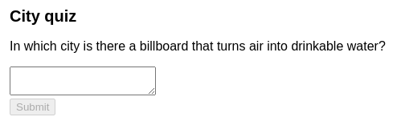
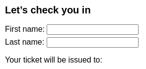
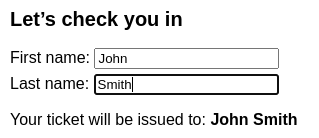
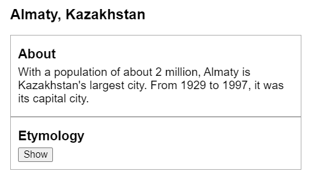
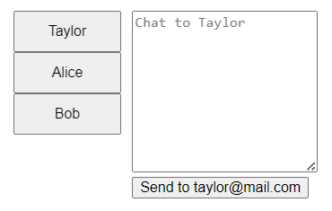
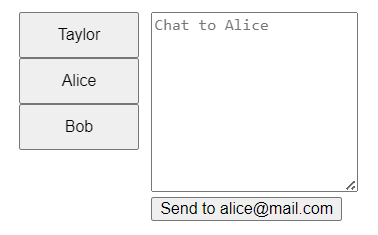
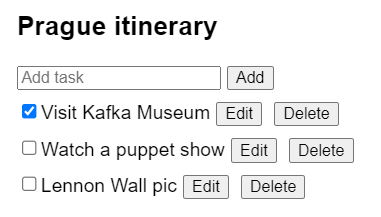
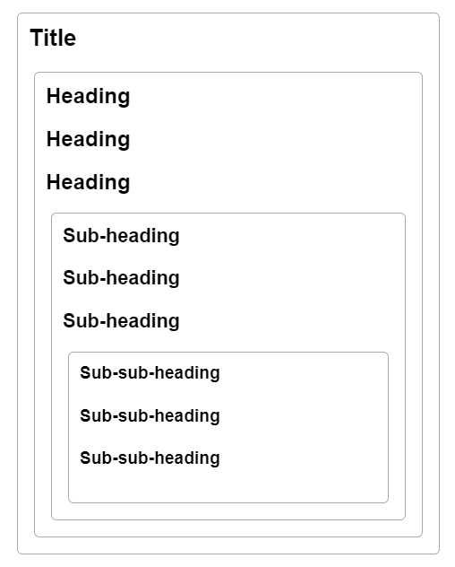
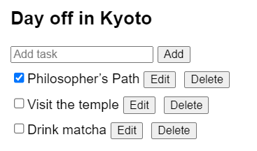

# Управление состоянием

По мере роста приложения необходимо более тщательно подходить к организации состояния и потоков данных между компонентами. Избыточное или дублирующееся состояние является распространенным источником ошибок. В этой главе вы узнаете, как правильно структурировать состояние, как поддерживать логику обновления состояния и как обмениваться состоянием между удаленными компонентами.

!!!tip "В этом разделе"

    -   [Как рассматривать изменения пользовательского интерфейса как изменения состояния](reacting-to-input-with-state.md)
    -   [Как правильно структурировать состояние](choosing-the-state-structure.md)
    -   [Как "поднять состояние вверх", чтобы поделиться им между компонентами](sharing-state-between-components.md)
    -   [Как контролировать сохранение или сброс состояния](preserving-and-resetting-state.md)
    -   [Как объединить сложную логику состояния в функции](extracting-state-logic-into-a-reducer.md)
    -   [Как передавать информацию без "бурения пропсов"](passing-data-deeply-with-context.md)
    -   [Как масштабировать управление состояниями по мере роста вашего приложения](scaling-up-with-reducer-and-context.md)

## Реакция на ввод с состоянием

В React вы не будете изменять пользовательский интерфейс из кода напрямую. Например, вы не будете писать команды типа "отключить кнопку", "включить кнопку", "показать сообщение об успехе" и т. д. Вместо этого вы будете описывать пользовательский интерфейс, который вы хотите видеть для различных визуальных состояний вашего компонента ("начальное состояние", "состояние набора текста", "состояние успеха"), а затем запускать изменения состояния в ответ на ввод пользователя. Это похоже на то, как дизайнеры думают о пользовательском интерфейсе.

Вот форма викторины, построенная с использованием React. Обратите внимание, как она использует переменную состояния `status` для определения того, включать или отключать кнопку отправки, а также показывать ли вместо нее сообщение об успехе.

<!-- 0001.part.md -->

=== "App.js"

    ```js
    import { useState } from 'react';

    export default function Form() {
    	const [answer, setAnswer] = useState('');
    	const [error, setError] = useState(null);
    	const [status, setStatus] = useState('typing');

    	if (status === 'success') {
    		return <h1>That was right!</h1>;
    	}

    	async function handleSubmit(e) {
    		e.preventDefault();
    		setStatus('submitting');
    		try {
    			await submitForm(answer);
    			setStatus('success');
    		} catch (err) {
    			setStatus('typing');
    			setError(err);
    		}
    	}

    	function handleTextareaChange(e) {
    		setAnswer(e.target.value);
    	}

    	return (
    		<>
    			<h2>City quiz</h2>
    			<p>
    				In which city is there a billboard that
    				turns air into drinkable water?
    			</p>
    			<form onSubmit={handleSubmit}>
    				<textarea
    					value={answer}
    					onChange={handleTextareaChange}
    					disabled={status === 'submitting'}
    				/>
    				<br />
    				<button
    					disabled={
    						answer.length === 0 ||
    						status === 'submitting'
    					}
    				>
    					Submit
    				</button>
    				{error !== null && (
    					<p className="Error">{error.message}</p>
    				)}
    			</form>
    		</>
    	);
    }

    function submitForm(answer) {
    	// Pretend it's hitting the network.
    	return new Promise((resolve, reject) => {
    		setTimeout(() => {
    			let shouldError =
    				answer.toLowerCase() !== 'lima';
    			if (shouldError) {
    				reject(
    					new Error(
    						'Good guess but a wrong answer. Try again!'
    					)
    				);
    			} else {
    				resolve();
    			}
    		}, 1500);
    	});
    }
    ```

=== "Результат"

    

!!!note "Готовы изучить эту тему?"

    Прочитайте [Reacting to Input with State](reacting-to-input-with-state.md), чтобы узнать, как подходить к взаимодействию с учетом состояния.

## Выбор структуры состояния

Правильное структурирование состояния может сделать разницу между компонентом, который приятно модифицировать и отлаживать, и компонентом, который является постоянным источником ошибок. Самый важный принцип заключается в том, что состояние не должно содержать избыточной или дублирующейся информации. Если есть ненужное состояние, легко забыть обновить его, что приведет к ошибкам!

Например, в этой форме есть **избыточная** переменная состояния `fullName`:

<!-- 0005.part.md -->

=== "App.js"

    ```js
    import { useState } from 'react';

    export default function Form() {
    	const [firstName, setFirstName] = useState('');
    	const [lastName, setLastName] = useState('');
    	const [fullName, setFullName] = useState('');

    	function handleFirstNameChange(e) {
    		setFirstName(e.target.value);
    		setFullName(e.target.value + ' ' + lastName);
    	}

    	function handleLastNameChange(e) {
    		setLastName(e.target.value);
    		setFullName(firstName + ' ' + e.target.value);
    	}

    	return (
    		<>
    			<h2>Let’s check you in</h2>
    			<label>
    				First name:{' '}
    				<input
    					value={firstName}
    					onChange={handleFirstNameChange}
    				/>
    			</label>
    			<label>
    				Last name:{' '}
    				<input
    					value={lastName}
    					onChange={handleLastNameChange}
    				/>
    			</label>
    			<p>
    				Your ticket will be issued to:{' '}
    				<b>{fullName}</b>
    			</p>
    		</>
    	);
    }
    ```

=== "Результат"

    

Вы можете удалить его и упростить код, вычисляя `fullName` во время рендеринга компонента:

<!-- 0009.part.md -->

=== "App.js"

    ```js
    import { useState } from 'react';

    export default function Form() {
    	const [firstName, setFirstName] = useState('');
    	const [lastName, setLastName] = useState('');

    	const fullName = firstName + ' ' + lastName;

    	function handleFirstNameChange(e) {
    		setFirstName(e.target.value);
    	}

    	function handleLastNameChange(e) {
    		setLastName(e.target.value);
    	}

    	return (
    		<>
    			<h2>Let’s check you in</h2>
    			<label>
    				First name:{' '}
    				<input
    					value={firstName}
    					onChange={handleFirstNameChange}
    				/>
    			</label>
    			<label>
    				Last name:{' '}
    				<input
    					value={lastName}
    					onChange={handleLastNameChange}
    				/>
    			</label>
    			<p>
    				Your ticket will be issued to:{' '}
    				<b>{fullName}</b>
    			</p>
    		</>
    	);
    }
    ```

=== "Результат"

    

Это может показаться незначительным изменением, но многие ошибки в приложениях React исправляются именно таким образом.

!!!note "Готовы изучить эту тему?"

    Прочитайте [Выбор структуры состояния](choosing-the-state-structure.md), чтобы узнать, как спроектировать форму состояния, чтобы избежать ошибок.

## Разделение состояния между компонентами

Иногда вы хотите, чтобы состояние двух компонентов всегда менялось вместе. Для этого удалите состояние из обоих компонентов, переместите его к их ближайшему общему родителю, а затем передайте его вниз через пропсы. Это известно как "поднимать состояние вверх", и это одна из самых распространенных вещей, которые вы будете делать при написании кода React.

В этом примере только одна панель должна быть активна одновременно. Чтобы достичь этого, вместо того чтобы хранить активное состояние внутри каждой отдельной панели, родительский компонент хранит состояние и определяет пропсы для своих дочерних элементов.

<!-- 0013.part.md -->

=== "App.js"

    ```js
    import { useState } from 'react';

    export default function Accordion() {
    	const [activeIndex, setActiveIndex] = useState(0);
    	return (
    		<>
    			<h2>Almaty, Kazakhstan</h2>
    			<Panel
    				title="About"
    				isActive={activeIndex === 0}
    				onShow={() => setActiveIndex(0)}
    			>
    				With a population of about 2 million, Almaty
    				is Kazakhstan's largest city. From 1929 to
    				1997, it was its capital city.
    			</Panel>
    			<Panel
    				title="Etymology"
    				isActive={activeIndex === 1}
    				onShow={() => setActiveIndex(1)}
    			>
    				The name comes from{' '}
    				<span lang="kk-KZ">алма</span>, the Kazakh
    				word for "apple" and is often translated as
    				"full of apples". In fact, the region
    				surrounding Almaty is thought to be the
    				ancestral home of the apple, and the wild{' '}
    				<i lang="la">Malus sieversii</i> is
    				considered a likely candidate for the
    				ancestor of the modern domestic apple.
    			</Panel>
    		</>
    	);
    }

    function Panel({ title, children, isActive, onShow }) {
    	return (
    		<section className="panel">
    			<h3>{title}</h3>
    			{isActive ? (
    				<p>{children}</p>
    			) : (
    				<button onClick={onShow}>Show</button>
    			)}
    		</section>
    	);
    }
    ```

=== "Результат"

    

!!!note "Готовы изучить эту тему?"

    Прочитайте [Sharing State Between Components](sharing-state-between-components.md), чтобы узнать, как поднять состояние вверх и синхронизировать компоненты.

## Сохранение и сброс состояния

Когда вы перерисовываете компонент, React должен решить, какие части дерева сохранить (и обновить), а какие отбросить или создать заново. В большинстве случаев автоматическое поведение React работает достаточно хорошо. По умолчанию React сохраняет те части дерева, которые "совпадают" с ранее отрисованным деревом компонентов.

Однако иногда это не то, что вам нужно. В этом приложении для чата при наборе сообщения и последующем переключении получателя ввод не сбрасывается. В результате пользователь может случайно отправить сообщение не тому человеку:

<!-- 0017.part.md -->

=== "App.js"

    ```js
    import { useState } from 'react';
    import Chat from './Chat.js';
    import ContactList from './ContactList.js';

    export default function Messenger() {
    	const [to, setTo] = useState(contacts[0]);
    	return (
    		<div>
    			<ContactList
    				contacts={contacts}
    				selectedContact={to}
    				onSelect={(contact) => setTo(contact)}
    			/>
    			<Chat contact={to} />
    		</div>
    	);
    }

    const contacts = [
    	{ name: 'Taylor', email: 'taylor@mail.com' },
    	{ name: 'Alice', email: 'alice@mail.com' },
    	{ name: 'Bob', email: 'bob@mail.com' },
    ];
    ```

=== "ContactList.js"

    ```js
    export default function ContactList({
    	selectedContact,
    	contacts,
    	onSelect,
    }) {
    	return (
    		<section className="contact-list">
    			<ul>
    				{contacts.map((contact) => (
    					<li key={contact.email}>
    						<button
    							onClick={() => {
    								onSelect(contact);
    							}}
    						>
    							{contact.name}
    						</button>
    					</li>
    				))}
    			</ul>
    		</section>
    	);
    }
    ```

=== "Chat.js"

    ```js
    import { useState } from 'react';

    export default function Chat({ contact }) {
    	const [text, setText] = useState('');
    	return (
    		<section className="chat">
    			<textarea
    				value={text}
    				placeholder={'Chat to ' + contact.name}
    				onChange={(e) => setText(e.target.value)}
    			/>
    			<br />
    			<button>Send to {contact.email}</button>
    		</section>
    	);
    }
    ```

=== "Результат"

    

React позволяет отменить поведение по умолчанию и _принудить_ компонент сбросить свое состояние, передав ему другой `ключ`, например `<Ключ чата={email} />`. Это говорит React, что если получатель другой, то он должен рассматриваться как _другой_ компонент `Chat`, который должен быть создан заново с новыми данными (и UI, как входы). Теперь переключение между получателями сбрасывает поле ввода - даже если вы отображаете один и тот же компонент.

<!-- 0025.part.md -->

=== "App.js"

    ```js
    import { useState } from 'react';
    import Chat from './Chat.js';
    import ContactList from './ContactList.js';

    export default function Messenger() {
    	const [to, setTo] = useState(contacts[0]);
    	return (
    		<div>
    			<ContactList
    				contacts={contacts}
    				selectedContact={to}
    				onSelect={(contact) => setTo(contact)}
    			/>
    			<Chat key={to.email} contact={to} />
    		</div>
    	);
    }

    const contacts = [
    	{ name: 'Taylor', email: 'taylor@mail.com' },
    	{ name: 'Alice', email: 'alice@mail.com' },
    	{ name: 'Bob', email: 'bob@mail.com' },
    ];
    ```

=== "ContactList.js"

    ```js
    export default function ContactList({
    	selectedContact,
    	contacts,
    	onSelect,
    }) {
    	return (
    		<section className="contact-list">
    			<ul>
    				{contacts.map((contact) => (
    					<li key={contact.email}>
    						<button
    							onClick={() => {
    								onSelect(contact);
    							}}
    						>
    							{contact.name}
    						</button>
    					</li>
    				))}
    			</ul>
    		</section>
    	);
    }
    ```

=== "Chat.js"

    ```js
    import { useState } from 'react';

    export default function Chat({ contact }) {
    	const [text, setText] = useState('');
    	return (
    		<section className="chat">
    			<textarea
    				value={text}
    				placeholder={'Chat to ' + contact.name}
    				onChange={(e) => setText(e.target.value)}
    			/>
    			<br />
    			<button>Send to {contact.email}</button>
    		</section>
    	);
    }
    ```

=== "Результат"

    

<!-- 0032.part.md -->

!!!note "Готовы изучить эту тему?"

    Прочитайте [Preserving and Resetting State](preserving-and-resetting-state.md), чтобы узнать о времени жизни состояния и о том, как им управлять.

## Извлечение логики состояния в редуктор

Компоненты с большим количеством обновлений состояния, распределенных по множеству обработчиков событий, могут стать непомерно сложными. Для таких случаев вы можете объединить всю логику обновления состояния за пределами вашего компонента в одной функции, называемой "reducer". Ваши обработчики событий становятся лаконичными, поскольку они указывают только "действия" пользователя. В нижней части файла функция reducer определяет, как состояние должно обновляться в ответ на каждое действие!

<!-- 0033.part.md -->

=== "App.js"

    ```js
    import { useReducer } from 'react';
    import AddTask from './AddTask.js';
    import TaskList from './TaskList.js';

    export default function TaskApp() {
    	const [tasks, dispatch] = useReducer(
    		tasksReducer,
    		initialTasks
    	);

    	function handleAddTask(text) {
    		dispatch({
    			type: 'added',
    			id: nextId++,
    			text: text,
    		});
    	}

    	function handleChangeTask(task) {
    		dispatch({
    			type: 'changed',
    			task: task,
    		});
    	}

    	function handleDeleteTask(taskId) {
    		dispatch({
    			type: 'deleted',
    			id: taskId,
    		});
    	}

    	return (
    		<>
    			<h1>Prague itinerary</h1>
    			<AddTask onAddTask={handleAddTask} />
    			<TaskList
    				tasks={tasks}
    				onChangeTask={handleChangeTask}
    				onDeleteTask={handleDeleteTask}
    			/>
    		</>
    	);
    }

    function tasksReducer(tasks, action) {
    	switch (action.type) {
    		case 'added': {
    			return [
    				...tasks,
    				{
    					id: action.id,
    					text: action.text,
    					done: false,
    				},
    			];
    		}
    		case 'changed': {
    			return tasks.map((t) => {
    				if (t.id === action.task.id) {
    					return action.task;
    				} else {
    					return t;
    				}
    			});
    		}
    		case 'deleted': {
    			return tasks.filter((t) => t.id !== action.id);
    		}
    		default: {
    			throw Error('Unknown action: ' + action.type);
    		}
    	}
    }

    let nextId = 3;
    const initialTasks = [
    	{ id: 0, text: 'Visit Kafka Museum', done: true },
    	{ id: 1, text: 'Watch a puppet show', done: false },
    	{ id: 2, text: 'Lennon Wall pic', done: false },
    ];
    ```

=== "AddTask.js"

    ```js
    import { useState } from 'react';

    export default function AddTask({ onAddTask }) {
    	const [text, setText] = useState('');
    	return (
    		<>
    			<input
    				placeholder="Add task"
    				value={text}
    				onChange={(e) => setText(e.target.value)}
    			/>
    			<button
    				onClick={() => {
    					setText('');
    					onAddTask(text);
    				}}
    			>
    				Add
    			</button>
    		</>
    	);
    }
    ```

=== "TaskList.js"

    ```js
    import { useState } from 'react';

    export default function TaskList({
    	tasks,
    	onChangeTask,
    	onDeleteTask,
    }) {
    	return (
    		<ul>
    			{tasks.map((task) => (
    				<li key={task.id}>
    					<Task
    						task={task}
    						onChange={onChangeTask}
    						onDelete={onDeleteTask}
    					/>
    				</li>
    			))}
    		</ul>
    	);
    }

    function Task({ task, onChange, onDelete }) {
    	const [isEditing, setIsEditing] = useState(false);
    	let taskContent;
    	if (isEditing) {
    		taskContent = (
    			<>
    				<input
    					value={task.text}
    					onChange={(e) => {
    						onChange({
    							...task,
    							text: e.target.value,
    						});
    					}}
    				/>
    				<button onClick={() => setIsEditing(false)}>
    					Save
    				</button>
    			</>
    		);
    	} else {
    		taskContent = (
    			<>
    				{task.text}
    				<button onClick={() => setIsEditing(true)}>
    					Edit
    				</button>
    			</>
    		);
    	}
    	return (
    		<label>
    			<input
    				type="checkbox"
    				checked={task.done}
    				onChange={(e) => {
    					onChange({
    						...task,
    						done: e.target.checked,
    					});
    				}}
    			/>
    			{taskContent}
    			<button onClick={() => onDelete(task.id)}>
    				Delete
    			</button>
    		</label>
    	);
    }
    ```

=== "Результат"

    

<!-- 0040.part.md -->

!!!note "Готовы изучить эту тему?"

    Читайте [Extracting State Logic into a Reducer](extracting-state-logic-into-a-reducer.md), чтобы узнать, как консолидировать логику в функции `reducer`.

## Передача данных глубоко с контекстом

Обычно вы передаете информацию от родительского компонента к дочернему компоненту через props. Но передача пропсов может стать неудобной, если вам нужно передать какой-то пропс через множество компонентов, или если многим компонентам нужна одна и та же информация. Context позволяет родительскому компоненту сделать некоторую информацию доступной для любого компонента в дереве под ним - независимо от того, насколько глубоко он находится - без явной передачи ее через props.

Здесь компонент `Heading` определяет уровень своего заголовка, "спрашивая" ближайший `Section` о его уровне. Каждый `Section` отслеживает свой собственный уровень, спрашивая родительский `Section` и добавляя к нему один. Каждый `Section` предоставляет информацию всем компонентам ниже него без передачи пропсов - он делает это через контекст.

<!-- 0041.part.md -->

=== "App.js"

    ```js
    import Heading from './Heading.js';
    import Section from './Section.js';

    export default function Page() {
    	return (
    		<Section>
    			<Heading>Title</Heading>
    			<Section>
    				<Heading>Heading</Heading>
    				<Heading>Heading</Heading>
    				<Heading>Heading</Heading>
    				<Section>
    					<Heading>Sub-heading</Heading>
    					<Heading>Sub-heading</Heading>
    					<Heading>Sub-heading</Heading>
    					<Section>
    						<Heading>Sub-sub-heading</Heading>
    						<Heading>Sub-sub-heading</Heading>
    						<Heading>Sub-sub-heading</Heading>
    					</Section>
    				</Section>
    			</Section>
    		</Section>
    	);
    }
    ```

=== "Section.js"

    ```js
    import { useContext } from 'react';
    import { LevelContext } from './LevelContext.js';

    export default function Section({ children }) {
    	const level = useContext(LevelContext);
    	return (
    		<section className="section">
    			<LevelContext.Provider value={level + 1}>
    				{children}
    			</LevelContext.Provider>
    		</section>
    	);
    }
    ```

=== "Heading.js"

    ```js
    import { useContext } from 'react';
    import { LevelContext } from './LevelContext.js';

    export default function Heading({ children }) {
    	const level = useContext(LevelContext);
    	switch (level) {
    		case 0:
    			throw Error(
    				'Heading must be inside a Section!'
    			);
    		case 1:
    			return <h1>{children}</h1>;
    		case 2:
    			return <h2>{children}</h2>;
    		case 3:
    			return <h3>{children}</h3>;
    		case 4:
    			return <h4>{children}</h4>;
    		case 5:
    			return <h5>{children}</h5>;
    		case 6:
    			return <h6>{children}</h6>;
    		default:
    			throw Error('Unknown level: ' + level);
    	}
    }
    ```

=== "LevelContext.js"

    ```js
    import { createContext } from 'react';

    export const LevelContext = createContext(0);
    ```

=== "Результат"

    

!!!note "Готовы изучить эту тему?"

    Читайте [Передача данных глубоко с контекстом](passing-data-deeply-with-context.md), чтобы узнать об использовании контекста в качестве альтернативы передаче пропсов.

## Масштабирование с помощью редуктора и контекста

Редукторы позволяют консолидировать логику обновления состояния компонента. Контекст позволяет передавать информацию другим компонентам. Вы можете объединить редукторы и контекст для управления состоянием сложного экрана.

При таком подходе родительский компонент со сложным состоянием управляет им с помощью редуктора. Другие компоненты, находящиеся в глубине дерева, могут читать его состояние через контекст. Они также могут отправлять действия для обновления этого состояния.

<!-- 0051.part.md -->

=== "App.js"

    ```js
    import AddTask from './AddTask.js';
    import TaskList from './TaskList.js';
    import { TasksProvider } from './TasksContext.js';

    export default function TaskApp() {
    	return (
    		<TasksProvider>
    			<h1>Day off in Kyoto</h1>
    			<AddTask />
    			<TaskList />
    		</TasksProvider>
    	);
    }
    ```

=== "TasksContext.js"

    ```js
    import {
    	createContext,
    	useContext,
    	useReducer,
    } from 'react';

    const TasksContext = createContext(null);
    const TasksDispatchContext = createContext(null);

    export function TasksProvider({ children }) {
    	const [tasks, dispatch] = useReducer(
    		tasksReducer,
    		initialTasks
    	);

    	return (
    		<TasksContext.Provider value={tasks}>
    			<TasksDispatchContext.Provider value={dispatch}>
    				{children}
    			</TasksDispatchContext.Provider>
    		</TasksContext.Provider>
    	);
    }

    export function useTasks() {
    	return useContext(TasksContext);
    }

    export function useTasksDispatch() {
    	return useContext(TasksDispatchContext);
    }

    function tasksReducer(tasks, action) {
    	switch (action.type) {
    		case 'added': {
    			return [
    				...tasks,
    				{
    					id: action.id,
    					text: action.text,
    					done: false,
    				},
    			];
    		}
    		case 'changed': {
    			return tasks.map((t) => {
    				if (t.id === action.task.id) {
    					return action.task;
    				} else {
    					return t;
    				}
    			});
    		}
    		case 'deleted': {
    			return tasks.filter((t) => t.id !== action.id);
    		}
    		default: {
    			throw Error('Unknown action: ' + action.type);
    		}
    	}
    }

    const initialTasks = [
    	{ id: 0, text: 'Philosopher’s Path', done: true },
    	{ id: 1, text: 'Visit the temple', done: false },
    	{ id: 2, text: 'Drink matcha', done: false },
    ];
    ```

=== "AddTask.js"

    ```js
    import { useState, useContext } from 'react';
    import { useTasksDispatch } from './TasksContext.js';

    export default function AddTask({ onAddTask }) {
    	const [text, setText] = useState('');
    	const dispatch = useTasksDispatch();
    	return (
    		<>
    			<input
    				placeholder="Add task"
    				value={text}
    				onChange={(e) => setText(e.target.value)}
    			/>
    			<button
    				onClick={() => {
    					setText('');
    					dispatch({
    						type: 'added',
    						id: nextId++,
    						text: text,
    					});
    				}}
    			>
    				Add
    			</button>
    		</>
    	);
    }

    let nextId = 3;
    ```

=== "TaskList.js"

    ```js
    import { useState, useContext } from 'react';
    import {
    	useTasks,
    	useTasksDispatch,
    } from './TasksContext.js';

    export default function TaskList() {
    	const tasks = useTasks();
    	return (
    		<ul>
    			{tasks.map((task) => (
    				<li key={task.id}>
    					<Task task={task} />
    				</li>
    			))}
    		</ul>
    	);
    }

    function Task({ task }) {
    	const [isEditing, setIsEditing] = useState(false);
    	const dispatch = useTasksDispatch();
    	let taskContent;
    	if (isEditing) {
    		taskContent = (
    			<>
    				<input
    					value={task.text}
    					onChange={(e) => {
    						dispatch({
    							type: 'changed',
    							task: {
    								...task,
    								text: e.target.value,
    							},
    						});
    					}}
    				/>
    				<button onClick={() => setIsEditing(false)}>
    					Save
    				</button>
    			</>
    		);
    	} else {
    		taskContent = (
    			<>
    				{task.text}
    				<button onClick={() => setIsEditing(true)}>
    					Edit
    				</button>
    			</>
    		);
    	}
    	return (
    		<label>
    			<input
    				type="checkbox"
    				checked={task.done}
    				onChange={(e) => {
    					dispatch({
    						type: 'changed',
    						task: {
    							...task,
    							done: e.target.checked,
    						},
    					});
    				}}
    			/>
    			{taskContent}
    			<button
    				onClick={() => {
    					dispatch({
    						type: 'deleted',
    						id: task.id,
    					});
    				}}
    			>
    				Delete
    			</button>
    		</label>
    	);
    }
    ```

=== "Результат"

    

!!!note "Готовы изучить эту тему?"

    Прочитайте [Scaling Up with Reducer and Context](scaling-up-with-reducer-and-context.md), чтобы узнать, как управление состояниями масштабируется в растущем приложении.

## Что дальше?

Перейдите по ссылке [Reacting to Input with State](reacting-to-input-with-state.md), чтобы начать читать эту главу страница за страницей!

Или, если вы уже знакомы с этими темами, почему бы не прочитать о [Escape Hatches](escape-hatches.md)?

<!-- 0061.part.md -->

## Ссылки

-   [https://react.dev/learn/managing-state](https://react.dev/learn/managing-state)
