# Манипулирование DOM с помощью Refs

React автоматически обновляет [DOM](https://developer.mozilla.org/docs/Web/API/Document_Object_Model/Introduction) в соответствии с вашим выводом на экран, поэтому вашим компонентам не часто требуется манипулировать им. Однако иногда вам может понадобиться доступ к элементам DOM, управляемым React - например, для фокусировки узла, прокрутки к нему или измерения его размера и положения. Встроенного способа сделать это в React нет, поэтому вам понадобится _ref_ на узел DOM.

!!!tip "Вы узнаете"

    -   Как получить доступ к узлу DOM, управляемому React, с помощью атрибута `ref`
    -   Как JSX-атрибут `ref` связан с хуком `useRef`.
    -   Как получить доступ к DOM-узлу другого компонента
    -   В каких случаях безопасно изменять DOM под управлением React

## Получение ссылки на узел

Чтобы получить доступ к узлу DOM, управляемому React, сначала импортируйте хук `useRef`:

<!-- 0001.part.md -->

```js
import { useRef } from 'react';
```

<!-- 0002.part.md -->

Затем используйте его для объявления ссылки внутри вашего компонента:

<!-- 0003.part.md -->

```js
const myRef = useRef(null);
```

<!-- 0004.part.md -->

Наконец, передайте его узлу DOM в качестве атрибута `ref`:

<!-- 0005.part.md -->

```js
<div ref={myRef}>
```

<!-- 0006.part.md -->

Хук `useRef` возвращает объект с единственным свойством `current`. Изначально `myRef.current` будет `null`. Когда React создаст DOM-узел для этого `<div>`, React поместит ссылку на этот узел в `myRef.current`. Затем вы сможете обращаться к этому узлу DOM из ваших [обработчиков событий](responding-to-events.md) и использовать встроенные [API браузера](https://developer.mozilla.org/docs/Web/API/Element), определенные на нем.

<!-- 0007.part.md -->

```js
// You can use any browser APIs, for example:
myRef.current.scrollIntoView();
```

<!-- 0008.part.md -->

### Пример: Фокусировка текстового ввода

В этом примере нажатие на кнопку фокусирует ввод:

=== "App.js"

    ```js
    import { useRef } from 'react';

    export default function Form() {
    	const inputRef = useRef(null);

    	function handleClick() {
    		inputRef.current.focus();
    	}

    	return (
    		<>
    			<input ref={inputRef} />
    			<button onClick={handleClick}>
    				Focus the input
    			</button>
    		</>
    	);
    }
    ```

=== "Результат"

    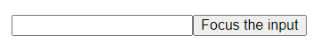

<!-- 0010.part.md -->

Чтобы реализовать это:

1.  Объявите `inputRef` с помощью хука `useRef`.
2.  Передайте его как `<input ref={inputRef}>`. Это говорит React **ввести DOM-узел этого `<input>` в `inputRef.current`.**.
3.  В функции `handleClick` прочитайте входной DOM-узел из `inputRef.current` и вызовите [`focus()`](https://developer.mozilla.org/docs/Web/API/HTMLElement/focus) на нем с помощью `inputRef.current.focus()`.
4.  Передайте обработчик события `handleClick` в `<button>` с помощью `onClick`.

Хотя манипуляции с DOM являются наиболее распространенным случаем использования ссылок, хук `useRef` можно использовать для хранения других вещей вне React, например, идентификаторов таймеров. Аналогично состоянию, ссылки остаются между рендерами. Ссылки похожи на переменные состояния, которые не вызывают повторных рендеров, когда вы их устанавливаете. Читайте о реферерах в [Referencing Values with Refs](referencing-values-with-refs.md).

### Пример: Прокрутка к элементу

В компоненте может быть более одного элемента. В этом примере имеется карусель из трех изображений. Каждая кнопка центрирует изображение, вызывая метод браузера [`scrollIntoView()`](https://developer.mozilla.org/docs/Web/API/Element/scrollIntoView) на соответствующем узле DOM:

=== "App.js"

    <div markdown style="max-height: 400px; overflow-y: auto;">

    ```js
    import { useRef } from 'react';

    export default function CatFriends() {
    	const firstCatRef = useRef(null);
    	const secondCatRef = useRef(null);
    	const thirdCatRef = useRef(null);

    	function handleScrollToFirstCat() {
    		firstCatRef.current.scrollIntoView({
    			behavior: 'smooth',
    			block: 'nearest',
    			inline: 'center',
    		});
    	}

    	function handleScrollToSecondCat() {
    		secondCatRef.current.scrollIntoView({
    			behavior: 'smooth',
    			block: 'nearest',
    			inline: 'center',
    		});
    	}

    	function handleScrollToThirdCat() {
    		thirdCatRef.current.scrollIntoView({
    			behavior: 'smooth',
    			block: 'nearest',
    			inline: 'center',
    		});
    	}

    	return (
    		<>
    			<nav>
    				<button onClick={handleScrollToFirstCat}>
    					Tom
    				</button>
    				<button onClick={handleScrollToSecondCat}>
    					Maru
    				</button>
    				<button onClick={handleScrollToThirdCat}>
    					Jellylorum
    				</button>
    			</nav>
    			<div>
    				<ul>
    					<li>
    						
    					</li>
    					<li>
    						
    					</li>
    					<li>
    						
    					</li>
    				</ul>
    			</div>
    		</>
    	);
    }
    ```

    </div>

=== "Результат"

    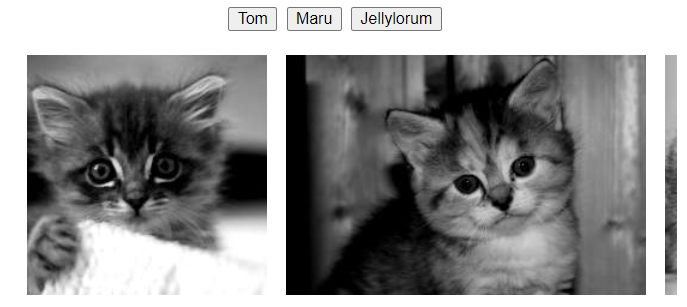

!!!note "Как управлять списком ссылок с помощью обратного вызова"

    В приведенных выше примерах существует предопределенное количество ссылок. Однако иногда вам может понадобиться ссылка на каждый элемент списка, и вы не знаете, сколько их будет. Что-то вроде этого **не будет работать**:

    ```js
    <ul>
    	{items.map((item) => {
    		// Doesn't work!
    		const ref = useRef(null);
    		return <li ref={ref} />;
    	})}
    </ul>
    ```

    Это происходит потому, что **Хуки должны вызываться только на верхнем уровне вашего компонента.** Вы не можете вызвать `useRef` в цикле, в условии или внутри вызова `map()`.

    Один из возможных способов обойти это - получить единственную ссылку на их родительский элемент, а затем использовать методы манипуляции DOM, такие как [`querySelectorAll`](https://developer.mozilla.org/docs/Web/API/Document/querySelectorAll), чтобы "найти" отдельные дочерние узлы из него. Однако это хрупкий метод и может сломаться, если структура DOM изменится.

    Другое решение - **передать функцию атрибуту `ref`.** Это называется `ref` callback. React вызовет ваш ref callback с узлом DOM, когда придет время установить ref, и с `null`, когда придет время очистить его. Это позволяет вам вести свой собственный массив или [Map](https://developer.mozilla.org/docs/Web/JavaScript/Reference/Global_Objects/Map), и обращаться к любому ref по его индексу или какому-либо идентификатору.

    В данном примере показано, как можно использовать этот подход для прокрутки к произвольному узлу в длинном списке:

    === "App.js"

    	<div markdown style="max-height: 400px; overflow-y: auto;">

    	```js
    	import { useRef } from 'react';

    	export default function CatFriends() {
    		const itemsRef = useRef(null);

    		function scrollToId(itemId) {
    			const map = getMap();
    			const node = map.get(itemId);
    			node.scrollIntoView({
    				behavior: 'smooth',
    				block: 'nearest',
    				inline: 'center',
    			});
    		}

    		function getMap() {
    			if (!itemsRef.current) {
    				// Initialize the Map on first usage.
    				itemsRef.current = new Map();
    			}
    			return itemsRef.current;
    		}

    		return (
    			<>
    				<nav>
    					<button onClick={() => scrollToId(0)}>
    						Tom
    					</button>
    					<button onClick={() => scrollToId(5)}>
    						Maru
    					</button>
    					<button onClick={() => scrollToId(9)}>
    						Jellylorum
    					</button>
    				</nav>
    				<div>
    					<ul>
    						{catList.map((cat) => (
    							<li
    								key={cat.id}
    								ref={(node) => {
    									const map = getMap();
    									if (node) {
    										map.set(cat.id, node);
    									} else {
    										map.delete(cat.id);
    									}
    								}}
    							>
    								
    							</li>
    						))}
    					</ul>
    				</div>
    			</>
    		);
    	}

    	const catList = [];
    	for (let i = 0; i < 10; i++) {
    		catList.push({
    			id: i,
    			imageUrl:
    				'https://placekitten.com/250/200?image=' + i,
    		});
    	}
    	```

    	</div>

    === "Результат"

    	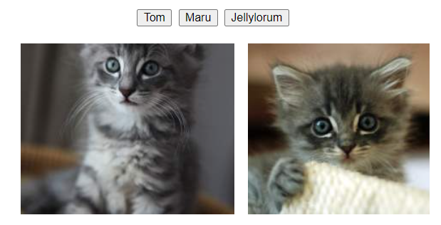

    В этом примере `itemsRef` не содержит ни одного узла DOM. Вместо этого он содержит [Map](https://developer.mozilla.org/docs/Web/JavaScript/Reference/Global_Objects/Map) от ID элемента к узлу DOM. ([Ссылки могут содержать любые значения!](referencing-values-with-refs.md)) Обратный вызов `ref` для каждого элемента списка заботится об обновлении карты:

    ```js
    <li
    	key={cat.id}
    	ref={(node) => {
    		const map = getMap();
    		if (node) {
    			// Add to the Map
    			map.set(cat.id, node);
    		} else {
    			// Remove from the Map
    			map.delete(cat.id);
    		}
    	}}
    />
    ```

    Это позволит вам впоследствии считывать отдельные узлы DOM из карты.

## Доступ к узлам DOM другого компонента

Когда вы помещаете ссылку на встроенный компонент, который выводит элемент браузера, такой как `<input />`, React установит свойство `current` этой ссылки на соответствующий узел DOM (такой как фактический `<input />` в браузере).

Однако если вы попытаетесь поместить ссылку на **свой собственный** компонент, например `<MyInput />`, по умолчанию вы получите `null`. Вот пример, демонстрирующий это. Обратите внимание, что нажатие на кнопку **не** фокусирует ввод:

=== "App.js"

    ```js
    import { useRef } from 'react';

    function MyInput(props) {
    	return <input {...props} />;
    }

    export default function MyForm() {
    	const inputRef = useRef(null);

    	function handleClick() {
    		inputRef.current.focus();
    	}

    	return (
    		<>
    			<MyInput ref={inputRef} />
    			<button onClick={handleClick}>
    				Focus the input
    			</button>
    		</>
    	);
    }
    ```

=== "Результат"

    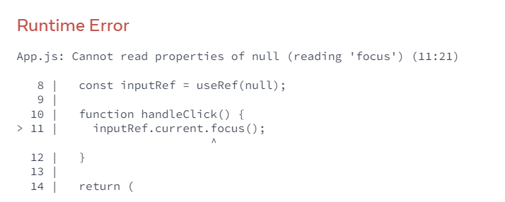

<!-- 0024.part.md -->

Чтобы помочь вам заметить проблему, React также выводит ошибку в консоль:

```console
Warning: Function components cannot be given refs.
Attempts to access this ref will fail.
Did you mean to use React.forwardRef()?
```

Это происходит потому, что по умолчанию React не позволяет компоненту обращаться к узлам DOM других компонентов. Даже своим собственным детям! Это намеренно. Ссылки - это аварийный люк, который следует использовать очень редко. Ручное манипулирование DOM-узлами _другого_ компонента делает ваш код еще более хрупким.

Вместо этого, компоненты, которые _хотят_ раскрыть свои узлы DOM, должны **оптировать** такое поведение. Компонент может указать, что он "переадресует" свою ссылку одному из своих дочерних компонентов. Вот как `MyInput` может использовать API `forwardRef`:

<!-- 0025.part.md -->

```js
const MyInput = forwardRef((props, ref) => {
    return <input {...props} ref={ref} />;
});
```

<!-- 0026.part.md -->

Вот как это работает:

1.  `<MyInput ref={inputRef} />` говорит React поместить соответствующий узел DOM в `inputRef.current`. Однако компонент `MyInput` должен сам принять это решение - по умолчанию он этого не делает.
2.  Компонент `MyInput` объявлен с использованием `forwardRef`. **Это позволяет ему получать `inputRef` сверху в качестве второго аргумента `ref`**, который объявляется после `props`.
3.  Сам `MyInput` передает полученный `ref` в `<input>` внутри него.

Теперь нажатие на кнопку для фокусировки ввода работает:

=== "App.js"

    ```js
    import { forwardRef, useRef } from 'react';

    const MyInput = forwardRef((props, ref) => {
    	return <input {...props} ref={ref} />;
    });

    export default function Form() {
    	const inputRef = useRef(null);

    	function handleClick() {
    		inputRef.current.focus();
    	}

    	return (
    		<>
    			<MyInput ref={inputRef} />
    			<button onClick={handleClick}>
    				Focus the input
    			</button>
    		</>
    	);
    }
    ```

=== "Результат"

    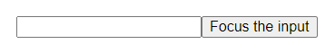

<!-- 0028.part.md -->

В системах проектирования обычным шаблоном для низкоуровневых компонентов, таких как кнопки, входы и т.д., является передача ссылок на их узлы DOM. С другой стороны, высокоуровневые компоненты, такие как формы, списки или разделы страницы, обычно не раскрывают свои узлы DOM, чтобы избежать случайных зависимостей от структуры DOM.

!!!note "Раскрытие подмножества API с помощью императивного дескриптора"

    В приведенном выше примере `MyInput` раскрывает исходный элемент ввода DOM. Это позволяет родительскому компоненту вызывать `focus()` на нем. Однако это также позволяет родительскому компоненту делать что-то еще - например, изменять стили CSS. В редких случаях вы можете захотеть ограничить открытую функциональность. Вы можете сделать это с помощью `useImperativeHandle`:

    === "App.js"

    	```js
    	import {
    		forwardRef,
    		useRef,
    		useImperativeHandle,
    	} from 'react';

    	const MyInput = forwardRef((props, ref) => {
    		const realInputRef = useRef(null);
    		useImperativeHandle(ref, () => ({
    			// Only expose focus and nothing else
    			focus() {
    				realInputRef.current.focus();
    			},
    		}));
    		return <input {...props} ref={realInputRef} />;
    	});

    	export default function Form() {
    		const inputRef = useRef(null);

    		function handleClick() {
    			inputRef.current.focus();
    		}

    		return (
    			<>
    				<MyInput ref={inputRef} />
    				<button onClick={handleClick}>
    					Focus the input
    				</button>
    			</>
    		);
    	}
    	```

    === "Результат"

    	

    Здесь `realInputRef` внутри `MyInput` содержит фактический входной DOM-узел. Однако `useImperativeHandle` инструктирует React предоставлять ваш собственный специальный объект в качестве значения ссылки на родительский компонент. Таким образом, `inputRef.current` внутри компонента `Form` будет иметь только метод `focus`. В этом случае ref "handle" - это не узел DOM, а пользовательский объект, который вы создаете внутри вызова `useImperativeHandle`.

## Когда React присоединяет рефы

В React каждое обновление делится на [две фазы](render-and-commit.md):

-   Во время **render,** React вызывает ваши компоненты, чтобы выяснить, что должно быть на экране.
-   Во время **commit,** React применяет изменения в DOM.

В общем, вы [не хотите](referencing-values-with-refs.md) обращаться к рефкам во время рендеринга. Это относится и к ссылкам, содержащим узлы DOM. Во время первого рендеринга узлы DOM еще не были созданы, поэтому `ref.current` будет `null`. А во время рендеринга обновлений, узлы DOM еще не были обновлены. Поэтому читать их еще рано.

React устанавливает `ref.current` во время фиксации. Перед обновлением DOM, React устанавливает затронутые значения `ref.current` в `null`. После обновления DOM, React немедленно устанавливает их в соответствующие узлы DOM.

**Обычно вы обращаетесь к рефкам из обработчиков событий.** Если вы хотите что-то сделать с рефкой, но нет конкретного события, в котором это можно сделать, вам может понадобиться эффект. Мы обсудим эффекты на следующих страницах.

!!!note "Промывка обновлений состояния синхронно с помощью flushSync"

    Рассмотрим код, подобный этому, который добавляет новый todo и прокручивает экран вниз до последнего дочернего элемента списка. Обратите внимание, что по какой-то причине он всегда прокручивается к тому todo, который был _прямо перед_ последним добавленным:

    === "App.js"

    	<div markdown style="max-height: 400px; overflow-y: auto;">

    	```js
    	import { useState, useRef } from 'react';

    	export default function TodoList() {
    		const listRef = useRef(null);
    		const [text, setText] = useState('');
    		const [todos, setTodos] = useState(initialTodos);

    		function handleAdd() {
    			const newTodo = { id: nextId++, text: text };
    			setText('');
    			setTodos([...todos, newTodo]);
    			listRef.current.lastChild.scrollIntoView({
    				behavior: 'smooth',
    				block: 'nearest',
    			});
    		}

    		return (
    			<>
    				<button onClick={handleAdd}>Add</button>
    				<input
    					value={text}
    					onChange={(e) => setText(e.target.value)}
    				/>
    				<ul ref={listRef}>
    					{todos.map((todo) => (
    						<li key={todo.id}>{todo.text}</li>
    					))}
    				</ul>
    			</>
    		);
    	}

    	let nextId = 0;
    	let initialTodos = [];
    	for (let i = 0; i < 20; i++) {
    		initialTodos.push({
    			id: nextId++,
    			text: 'Todo #' + (i + 1),
    		});
    	}
    	```

    	</div>

    === "Результат"

    	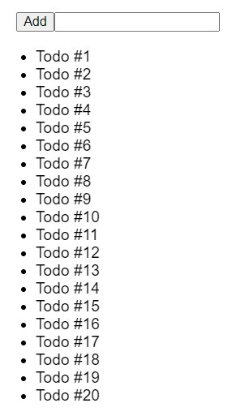

    Проблема заключается в этих двух линиях:

    ```js
    setTodos([...todos, newTodo]);
    listRef.current.lastChild.scrollIntoView();
    ```

    В React [обновления состояния ставятся в очередь](queueing-a-series-of-state-updates.md). Обычно это то, что вам нужно. Однако здесь это вызывает проблему, потому что `setTodos` не обновляет DOM немедленно. Поэтому, когда вы прокручиваете список до последнего элемента, todo еще не был добавлен. Поэтому прокрутка всегда "отстает" на один элемент.

    Чтобы решить эту проблему, вы можете заставить React обновлять ("промывать") DOM синхронно. Для этого импортируйте `flushSync` из `react-dom` и **оберните обновление состояния** в вызов `flushSync`:

    ```js
    flushSync(() => {
    	setTodos([...todos, newTodo]);
    });
    listRef.current.lastChild.scrollIntoView();
    ```

    Это даст команду React синхронно обновить DOM сразу после выполнения кода, обернутого в `flushSync`. В результате, последний todo уже будет в DOM к тому моменту, когда вы попытаетесь перейти к нему:

    === "App.js"

    	<div markdown style="max-height: 400px; overflow-y: auto;">

    	```js
    	import { useState, useRef } from 'react';
    	import { flushSync } from 'react-dom';

    	export default function TodoList() {
    		const listRef = useRef(null);
    		const [text, setText] = useState('');
    		const [todos, setTodos] = useState(initialTodos);

    		function handleAdd() {
    			const newTodo = { id: nextId++, text: text };
    			flushSync(() => {
    				setText('');
    				setTodos([...todos, newTodo]);
    			});
    			listRef.current.lastChild.scrollIntoView({
    				behavior: 'smooth',
    				block: 'nearest',
    			});
    		}

    		return (
    			<>
    				<button onClick={handleAdd}>Add</button>
    				<input
    					value={text}
    					onChange={(e) => setText(e.target.value)}
    				/>
    				<ul ref={listRef}>
    					{todos.map((todo) => (
    						<li key={todo.id}>{todo.text}</li>
    					))}
    				</ul>
    			</>
    		);
    	}

    	let nextId = 0;
    	let initialTodos = [];
    	for (let i = 0; i < 20; i++) {
    		initialTodos.push({
    			id: nextId++,
    			text: 'Todo #' + (i + 1),
    		});
    	}
    	```

    	</div>

    === "Результат"

    	

<!-- 0038.part.md -->

## Лучшие практики работы с DOM с помощью ссылок

Ссылки - это аварийный люк. Вы должны использовать их только тогда, когда вам нужно "выйти за пределы React". Обычные примеры этого - управление фокусом, позицией прокрутки или вызов API браузера, которые React не раскрывает.

Если вы придерживаетесь неразрушающих действий, таких как фокусировка и прокрутка, вы не должны столкнуться с какими-либо проблемами. Однако, если вы попытаетесь **изменить** DOM вручную, вы рискуете вступить в конфликт с изменениями, которые вносит React.

Чтобы проиллюстрировать эту проблему, данный пример включает в себя приветственное сообщение и две кнопки. Первая кнопка переключает свое присутствие, используя [conditional rendering](conditional-rendering.md) и [state](state-a-components-memory.md), как вы обычно делаете в React. Вторая кнопка использует [`remove()` DOM API](https://developer.mozilla.org/docs/Web/API/Element/remove), чтобы принудительно удалить ее из DOM вне контроля React.

Попробуйте нажать "Toggle with setState" несколько раз. Сообщение должно исчезнуть и появиться снова. Затем нажмите "Удалить из DOM". Это приведет к принудительному удалению. Наконец, нажмите "Toggle with setState":

=== "App.js"

    <div markdown style="max-height: 400px; overflow-y: auto;">

    ```js
    import { useState, useRef } from 'react';

    export default function Counter() {
    	const [show, setShow] = useState(true);
    	const ref = useRef(null);

    	return (
    		<div>
    			<button
    				onClick={() => {
    					setShow(!show);
    				}}
    			>
    				Toggle with setState
    			</button>
    			<button
    				onClick={() => {
    					ref.current.remove();
    				}}
    			>
    				Remove from the DOM
    			</button>
    			{show && <p ref={ref}>Hello world</p>}
    		</div>
    	);
    }
    ```

    </div>

=== "Результат"

    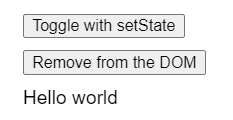

После того, как вы вручную удалили элемент DOM, попытка использовать `setState`, чтобы снова показать его, приведет к сбою. Это происходит потому, что вы изменили DOM, и React не знает, как продолжать управлять им правильно.

**Избегайте изменения узлов DOM, управляемых React.** Изменение, добавление дочерних элементов или удаление дочерних элементов из элементов, управляемых React, может привести к непоследовательным визуальным результатам или сбоям, как описано выше.

Однако это не означает, что этого нельзя делать вообще. Это требует осторожности. **Вы можете безопасно изменять части DOM, которые у React нет причин обновлять.** Например, если какой-то `<div>` всегда пуст в JSX, у React не будет причин трогать его список детей. Поэтому безопасно вручную добавлять или удалять там элементы.

!!!note "Итоги"

    -   Refs - это общая концепция, но чаще всего вы будете использовать их для хранения элементов DOM.
    -   Вы даете команду React поместить узел DOM в `myRef.current`, передавая `<div ref={myRef}>`.
    -   Обычно вы используете рефлексы для неразрушающих действий, таких как фокусировка, прокрутка или измерение элементов DOM.
    -   Компонент по умолчанию не раскрывает свои DOM-узлы. Вы можете раскрыть узел DOM, используя `forwardRef` и передавая второй аргумент `ref` вниз к определенному узлу.
    -   Избегайте изменения узлов DOM, управляемых React.
    -   Если вы изменяете узлы DOM, управляемые React, изменяйте те части, которые React не имеет причин обновлять.

## Задачи

### 1. Воспроизведение и пауза видео

В этом примере кнопка переключает переменную состояния для перехода между воспроизведением и паузой. Однако для того, чтобы действительно воспроизвести или поставить видео на паузу, переключения состояния недостаточно. Вам также необходимо вызвать [`play()`](https://developer.mozilla.org/docs/Web/API/HTMLMediaElement/play) и [`pause()`](https://developer.mozilla.org/docs/Web/API/HTMLMediaElement/pause) на элементе DOM для `<video>`. Добавьте к нему ссылку и заставьте кнопку работать.

=== "App.js"

    ```js
    import { useState, useRef } from 'react';

    export default function VideoPlayer() {
    	const [isPlaying, setIsPlaying] = useState(false);

    	function handleClick() {
    		const nextIsPlaying = !isPlaying;
    		setIsPlaying(nextIsPlaying);
    	}

    	return (
    		<>
    			<button onClick={handleClick}>
    				{isPlaying ? 'Pause' : 'Play'}
    			</button>
    			<video width="250">
    				<source
    					src="https://interactive-examples.mdn.mozilla.net/media/cc0-videos/flower.mp4"
    					type="video/mp4"
    				/>
    			</video>
    		</>
    	);
    }
    ```

=== "Результат"

    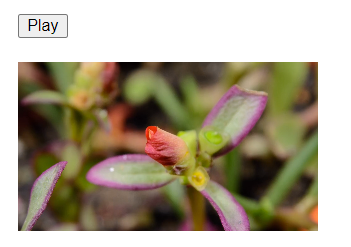

Для решения дополнительной задачи синхронизируйте кнопку "Play" с тем, воспроизводится ли видео, даже если пользователь щелкает правой кнопкой мыши на видео и воспроизводит его с помощью встроенных элементов управления мультимедиа браузера. Для этого вам может понадобиться прослушать `onPlay` и `onPause` на видео.

???tip "Показать решение"

    Объявите ссылку и поместите ее на элемент `<video>`. Затем вызовите `ref.current.play()` и `ref.current.pause()` в обработчике событий в зависимости от следующего состояния.

    === "App.js"

    	<div markdown style="max-height: 400px; overflow-y: auto;">

    	```js
    	import { useState, useRef } from 'react';

    	export default function VideoPlayer() {
    		const [isPlaying, setIsPlaying] = useState(false);
    		const ref = useRef(null);

    		function handleClick() {
    			const nextIsPlaying = !isPlaying;
    			setIsPlaying(nextIsPlaying);

    			if (nextIsPlaying) {
    				ref.current.play();
    			} else {
    				ref.current.pause();
    			}
    		}

    		return (
    			<>
    				<button onClick={handleClick}>
    					{isPlaying ? 'Pause' : 'Play'}
    				</button>
    				<video
    					width="250"
    					ref={ref}
    					onPlay={() => setIsPlaying(true)}
    					onPause={() => setIsPlaying(false)}
    				>
    					<source
    						src="https://interactive-examples.mdn.mozilla.net/media/cc0-videos/flower.mp4"
    						type="video/mp4"
    					/>
    				</video>
    			</>
    		);
    	}
    	```

    	</div>

    === "Результат"

    	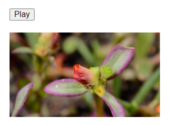

    Для работы со встроенными элементами управления браузера вы можете добавить обработчики `onPlay` и `onPause` к элементу `<video>` и вызвать из них `setIsPlaying`. Таким образом, если пользователь воспроизводит видео с помощью элементов управления браузера, состояние будет соответствующим образом изменено.

### 2. Фокусировка поля поиска

Сделайте так, чтобы нажатие на кнопку "Поиск" наводило фокус на поле.

=== "App.js"

    ```js
    export default function Page() {
    	return (
    		<>
    			<nav>
    				<button>Search</button>
    			</nav>
    			<input placeholder="Looking for something?" />
    		</>
    	);
    }
    ```

=== "Результат"

    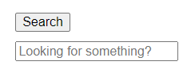

???success "Показать решение"

    Добавьте ссылку на вход и вызовите `focus()` на узле DOM, чтобы сфокусировать его:

    === "App.js"

    	```js
    	import { useRef } from 'react';

    	export default function Page() {
    		const inputRef = useRef(null);
    		return (
    			<>
    				<nav>
    					<button
    						onClick={() => {
    							inputRef.current.focus();
    						}}
    					>
    						Search
    					</button>
    				</nav>
    				<input
    					ref={inputRef}
    					placeholder="Looking for something?"
    				/>
    			</>
    		);
    	}
    	```

    === "Результат"

    	

### 3. Прокрутка карусели изображений

Эта карусель изображений имеет кнопку "Next", которая переключает активное изображение. Заставьте галерею прокручиваться горизонтально до активного изображения по щелчку. Для этого нужно вызвать [`scrollIntoView()`](https://developer.mozilla.org/docs/Web/API/Element/scrollIntoView) на DOM-узле активного изображения:

<!-- 0059.part.md -->

```js
node.scrollIntoView({
    behavior: 'smooth',
    block: 'nearest',
    inline: 'center',
});
```

=== "App.js"

    <div markdown style="max-height: 400px; overflow-y: auto;">

    ```js
    import { useState } from 'react';

    export default function CatFriends() {
    	const [index, setIndex] = useState(0);
    	return (
    		<>
    			<nav>
    				<button
    					onClick={() => {
    						if (index < catList.length - 1) {
    							setIndex(index + 1);
    						} else {
    							setIndex(0);
    						}
    					}}
    				>
    					Next
    				</button>
    			</nav>
    			<div>
    				<ul>
    					{catList.map((cat, i) => (
    						<li key={cat.id}>
    							
    						</li>
    					))}
    				</ul>
    			</div>
    		</>
    	);
    }

    const catList = [];
    for (let i = 0; i < 10; i++) {
    	catList.push({
    		id: i,
    		imageUrl:
    			'https://placekitten.com/250/200?image=' + i,
    	});
    }
    ```

    </div>

=== "Результат"

    

???tip "Показать подсказку"

    Для этого упражнения не обязательно иметь ссылку на каждое изображение. Достаточно иметь ссылку на текущее активное изображение или на сам список. Используйте `flushSync` для обеспечения обновления DOM _до_ прокрутки.

<!-- 0064.part.md -->

???success "Показать решение"

    Вы можете объявить `selectedRef`, а затем передать его условно только текущему изображению:

    ```js
    <li ref={index === i ? selectedRef : null}>
    ```

    Когда `index === i`, что означает, что изображение является выбранным, `<li>` получит `selectedRef`. React будет следить за тем, чтобы `selectedRef.current` всегда указывал на правильный узел DOM.

    Обратите внимание, что вызов `flushSync` необходим для того, чтобы заставить React обновить DOM перед прокруткой. В противном случае `selectedRef.current` всегда будет указывать на ранее выбранный элемент.

    === "App.js"

    	<div markdown style="max-height: 400px; overflow-y: auto;">

    	```js
    	import { useRef, useState } from 'react';
    	import { flushSync } from 'react-dom';

    	export default function CatFriends() {
    		const selectedRef = useRef(null);
    		const [index, setIndex] = useState(0);

    		return (
    			<>
    				<nav>
    					<button
    						onClick={() => {
    							flushSync(() => {
    								if (
    									index <
    									catList.length - 1
    								) {
    									setIndex(index + 1);
    								} else {
    									setIndex(0);
    								}
    							});
    							selectedRef.current.scrollIntoView({
    								behavior: 'smooth',
    								block: 'nearest',
    								inline: 'center',
    							});
    						}}
    					>
    						Next
    					</button>
    				</nav>
    				<div>
    					<ul>
    						{catList.map((cat, i) => (
    							<li
    								key={cat.id}
    								ref={
    									index === i
    										? selectedRef
    										: null
    								}
    							>
    								
    							</li>
    						))}
    					</ul>
    				</div>
    			</>
    		);
    	}

    	const catList = [];
    	for (let i = 0; i < 10; i++) {
    		catList.push({
    			id: i,
    			imageUrl:
    				'https://placekitten.com/250/200?image=' + i,
    		});
    	}
    	```

    	</div>

    === "Результат"

    	

### 4. Фокусировка поля поиска с помощью отдельных компонентов

Сделайте так, чтобы нажатие на кнопку "Поиск" наводило фокус на поле. Обратите внимание, что каждый компонент определен в отдельном файле и не должен быть перемещен из него. Как соединить их вместе?

=== "App.js"

    ```js
    import SearchButton from './SearchButton.js';
    import SearchInput from './SearchInput.js';

    export default function Page() {
    	return (
    		<>
    			<nav>
    				<SearchButton />
    			</nav>
    			<SearchInput />
    		</>
    	);
    }
    ```

=== "SearchButton.js"

    ```js
    export default function SearchButton() {
    	return <button>Search</button>;
    }
    ```

=== "SearchInput.js"

    ```js
    export default function SearchInput() {
    	return <input placeholder="Looking for something?" />;
    }
    ```

=== "Результат"

    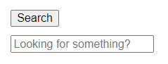

???tip "Показать подсказку"

    Вам понадобится `forwardRef`, чтобы открыть узел DOM из вашего собственного компонента, такого как `SearchInput`.

???success "Показать решение"

    Вам нужно добавить свойство `onClick` к `SearchButton` и заставить `SearchButton` передать его браузеру `<button>`. Вы также передадите ссылку в `<SearchInput>`, который передаст ее в настоящий `<input>` и заполнит его. Наконец, в обработчике клика вы вызовете `focus` для узла DOM, хранящегося внутри ссылки.

    === "App.js"

    	```js
    	import { useRef } from 'react';
    	import SearchButton from './SearchButton.js';
    	import SearchInput from './SearchInput.js';

    	export default function Page() {
    		const inputRef = useRef(null);
    		return (
    			<>
    				<nav>
    					<SearchButton
    						onClick={() => {
    							inputRef.current.focus();
    						}}
    					/>
    				</nav>
    				<SearchInput ref={inputRef} />
    			</>
    		);
    	}
    	```

    === "SearchButton.js"

    	```js
    	export default function SearchButton({ onClick }) {
    		return <button onClick={onClick}>Search</button>;
    	}
    	```

    === "SearchInput.js"

    	```js
    	import { forwardRef } from 'react';

    	export default forwardRef(function SearchInput(props, ref) {
    		return (
    			<input
    				ref={ref}
    				placeholder="Looking for something?"
    			/>
    		);
    	});
    	```

    === "Результат"

    	

## Ссылки

-   [https://react.dev/learn/manipulating-the-dom-with-refs](https://react.dev/learn/manipulating-the-dom-with-refs)
