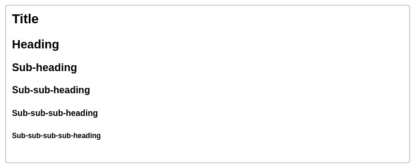
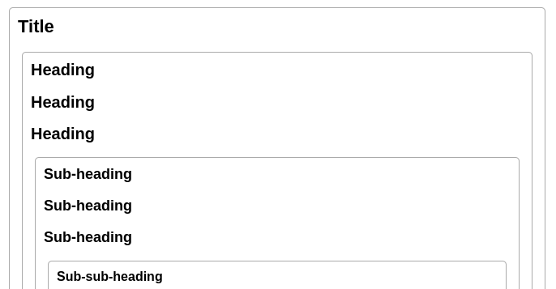
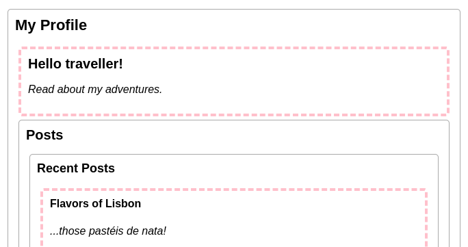
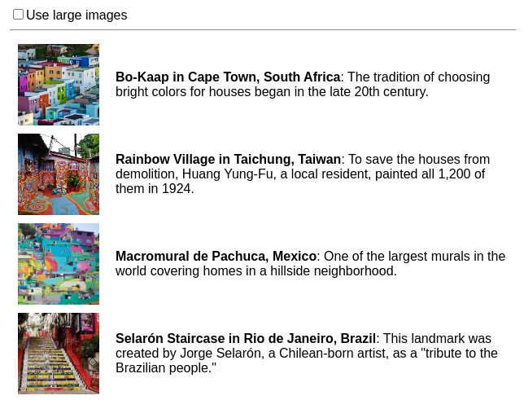

# Глубокая передача данных с помощью контекста

Обычно вы передаете информацию от родительского компонента к дочернему компоненту с помощью пропсов. Но передача пропсов может стать многословной и неудобной, если вам приходится передавать их через множество компонентов в середине, или если многим компонентам в вашем приложении нужна одна и та же информация. _Context_ позволяет родительскому компоненту сделать некоторую информацию доступной для любого компонента в дереве под ним - независимо от глубины - без явной передачи ее через `props`.

!!!tip "Вы узнаете"

    -   Что такое "бурение пропсов"
    -   Как заменить повторяющуюся передачу пропсов контекстом
    -   Общие случаи использования контекста
    -   Общие альтернативы контексту

## Проблема с передачей пропсов

[Передача пропсов](passing-props-to-a-component.md) - это отличный способ явной передачи данных через дерево вашего пользовательского интерфейса компонентам, которые их используют.

Но передача пропсов может стать многословной и неудобной, если вам нужно передать какой-то пропс глубоко в дереве, или если многим компонентам нужен один и тот же пропс. Ближайший общий предок может быть далеко от компонентов, которым нужны данные, а [поднятие состояния вверх](sharing-state-between-components.md) так высоко может привести к ситуации, называемой "prop drilling".


Подъем состояния вверх

![Диаграмма с деревом из десяти узлов, каждый узел с двумя детьми или меньше. Корневой узел содержит пузырек, представляющий значение, выделенное фиолетовым цветом. Значение проходит вниз через два дочерних узла, каждый из которых передает значение, но не содержит его. Левый ребенок передает значение вниз двум детям, которые оба выделены фиолетовым цветом. Правый ребенок корня передает значение одному из двух своих детей - правому, который выделен фиолетовым цветом. Этот ребенок передает значение через своего единственного ребенка, который передает его обоим своим детям, выделенным фиолетовым цветом.](passing_data_prop_drilling.webp)

Бурение пропса

Было бы здорово, если бы существовал способ "телепортировать" данные к тем компонентам в дереве, которым они нужны, без передачи пропсов. С функцией контекста React это возможно!

## Контекст: альтернатива передаче `props`

Контекст позволяет родительскому компоненту предоставлять данные всему дереву под ним. Существует множество вариантов использования контекста. Вот один из примеров. Рассмотрим компонент `Heading`, который принимает `level` для своего размера:

=== "App.js"

    ```js
    import Heading from './Heading.js';
    import Section from './Section.js';

    export default function Page() {
    	return (
    		<Section>
    			<Heading level={1}>Title</Heading>
    			<Heading level={2}>Heading</Heading>
    			<Heading level={3}>Sub-heading</Heading>
    			<Heading level={4}>Sub-sub-heading</Heading>
    			<Heading level={5}>Sub-sub-sub-heading</Heading>
    			<Heading level={6}>
    				Sub-sub-sub-sub-heading
    			</Heading>
    		</Section>
    	);
    }
    ```

=== "Section.js"

    ```js
    export default function Section({ children }) {
    	return (
    		<section className="section">{children}</section>
    	);
    }
    ```

=== "Heading.js"

    ```js
    export default function Heading({ level, children }) {
    	switch (level) {
    		case 1:
    			return <h1>{children}</h1>;
    		case 2:
    			return <h2>{children}</h2>;
    		case 3:
    			return <h3>{children}</h3>;
    		case 4:
    			return <h4>{children}</h4>;
    		case 5:
    			return <h5>{children}</h5>;
    		case 6:
    			return <h6>{children}</h6>;
    		default:
    			throw Error('Unknown level: ' + level);
    	}
    }
    ```

=== "Результат"

    

Допустим, вы хотите, чтобы несколько заголовков в одном `Section` всегда имели одинаковый размер:

=== "App.js"

    ```js
    import Heading from './Heading.js';
    import Section from './Section.js';

    export default function Page() {
    	return (
    		<Section>
    			<Heading level={1}>Title</Heading>
    			<Section>
    				<Heading level={2}>Heading</Heading>
    				<Heading level={2}>Heading</Heading>
    				<Heading level={2}>Heading</Heading>
    				<Section>
    					<Heading level={3}>Sub-heading</Heading>
    					<Heading level={3}>Sub-heading</Heading>
    					<Heading level={3}>Sub-heading</Heading>
    					<Section>
    						<Heading level={4}>
    							Sub-sub-heading
    						</Heading>
    						<Heading level={4}>
    							Sub-sub-heading
    						</Heading>
    						<Heading level={4}>
    							Sub-sub-heading
    						</Heading>
    					</Section>
    				</Section>
    			</Section>
    		</Section>
    	);
    }
    ```

=== "Section.js"

    ```js
    export default function Section({ children }) {
    	return (
    		<section className="section">{children}</section>
    	);
    }
    ```

=== "Heading.js"

    ```js
    export default function Heading({ level, children }) {
    	switch (level) {
    		case 1:
    			return <h1>{children}</h1>;
    		case 2:
    			return <h2>{children}</h2>;
    		case 3:
    			return <h3>{children}</h3>;
    		case 4:
    			return <h4>{children}</h4>;
    		case 5:
    			return <h5>{children}</h5>;
    		case 6:
    			return <h6>{children}</h6>;
    		default:
    			throw Error('Unknown level: ' + level);
    	}
    }
    ```

=== "Результат"

    

В настоящее время вы передаете параметр `level` каждому `<Heading>` отдельно:

<!-- 0017.part.md -->

```js
<Section>
    <Heading level={3}>About</Heading>
    <Heading level={3}>Photos</Heading>
    <Heading level={3}>Videos</Heading>
</Section>
```

<!-- 0018.part.md -->

Было бы неплохо, если бы вы могли передавать параметр `level` компоненту `<Section>` и удалять его из `<Heading>`. Таким образом можно было бы добиться того, чтобы все заголовки в одном разделе имели одинаковый размер:

<!-- 0019.part.md -->

```js
<Section level={3}>
    <Heading>About</Heading>
    <Heading>Photos</Heading>
    <Heading>Videos</Heading>
</Section>
```

<!-- 0020.part.md -->

Но как компонент `<Heading>` может узнать параметр `level` ближайшего к нему `<Section>`? **Для этого нужно, чтобы дочерний компонент мог "запрашивать" данные откуда-то сверху в дереве**.

Вы не можете сделать это только с помощью пропсов. Здесь в игру вступает контекст. Вы сделаете это в три шага:

1.  **Создайте** контекст. (Вы можете назвать его `LevelContext`, поскольку он предназначен для параметр `level` в `Heading`).
2.  **Используем** этот контекст из компонента, которому нужны данные. (`Heading` будет использовать `LevelContext`).
3.  **Предоставить** этот контекст от компонента, который определяет данные. (`Section` будет предоставлять `LevelContext`).

Контекст позволяет родителю - даже очень далекому - предоставлять некоторые данные всему дереву внутри него.


Использование контекста в близких дочерних компонентах


Использование контекста в далеких детях

### Шаг 1: Создание контекста

Во-первых, вам нужно создать контекст. Вам нужно будет **экспортировать его из файла**, чтобы ваши компоненты могли его использовать:

=== "App.js"

    ```js
    import Heading from './Heading.js';
    import Section from './Section.js';

    export default function Page() {
    	return (
    		<Section>
    			<Heading level={1}>Title</Heading>
    			<Section>
    				<Heading level={2}>Heading</Heading>
    				<Heading level={2}>Heading</Heading>
    				<Heading level={2}>Heading</Heading>
    				<Section>
    					<Heading level={3}>Sub-heading</Heading>
    					<Heading level={3}>Sub-heading</Heading>
    					<Heading level={3}>Sub-heading</Heading>
    					<Section>
    						<Heading level={4}>
    							Sub-sub-heading
    						</Heading>
    						<Heading level={4}>
    							Sub-sub-heading
    						</Heading>
    						<Heading level={4}>
    							Sub-sub-heading
    						</Heading>
    					</Section>
    				</Section>
    			</Section>
    		</Section>
    	);
    }
    ```

=== "Section.js"

    ```js
    export default function Section({ children }) {
    	return (
    		<section className="section">{children}</section>
    	);
    }
    ```

=== "Heading.js"

    ```js
    export default function Heading({ level, children }) {
    	switch (level) {
    		case 1:
    			return <h1>{children}</h1>;
    		case 2:
    			return <h2>{children}</h2>;
    		case 3:
    			return <h3>{children}</h3>;
    		case 4:
    			return <h4>{children}</h4>;
    		case 5:
    			return <h5>{children}</h5>;
    		case 6:
    			return <h6>{children}</h6>;
    		default:
    			throw Error('Unknown level: ' + level);
    	}
    }
    ```

=== "LevelContext.js"

    ```js
    import { createContext } from 'react';

    export const LevelContext = createContext(1);
    ```

=== "Результат"

    

Единственным аргументом для `createContext` является значение _по умолчанию_. Здесь `1` означает самый большой уровень заголовка, но вы можете передать любое значение (даже объект). Значение значения по умолчанию вы увидите в следующем шаге.

### Шаг 2: Использование контекста

Импортируйте хук `useContext` из React и ваш контекст:

<!-- 0031.part.md -->

```js
import { useContext } from 'react';
import { LevelContext } from './LevelContext.js';
```

<!-- 0032.part.md -->

В настоящее время компонент `Heading` считывает параметр `level` из пропса:

<!-- 0033.part.md -->

```js
export default function Heading({ level, children }) {
    // ...
}
```

<!-- 0034.part.md -->

Вместо этого удалите параметр `level` и считайте значение из только что импортированного контекста `LevelContext`:

<!-- 0035.part.md -->

```js
export default function Heading({ children }) {
    const level = useContext(LevelContext);
    // ...
}
```

<!-- 0036.part.md -->

`useContext` - это хук. Как и `useState` и `useReducer`, хук можно вызывать только непосредственно внутри компонента React (не внутри циклов или условий). **`useContext` сообщает React, что компонент `Heading` хочет прочитать `LevelContext`.**

Теперь, когда у компонента `Heading` нет свойства `level`, вам больше не нужно передавать свойство level компоненту `Heading` в вашем JSX таким образом:

<!-- 0037.part.md -->

```js
<Section>
    <Heading level={4}>Sub-sub-heading</Heading>
    <Heading level={4}>Sub-sub-heading</Heading>
    <Heading level={4}>Sub-sub-heading</Heading>
</Section>
```

<!-- 0038.part.md -->

Обновите JSX так, чтобы вместо него его получала `Section`:

<!-- 0039.part.md -->

```js
<Section level={4}>
    <Heading>Sub-sub-heading</Heading>
    <Heading>Sub-sub-heading</Heading>
    <Heading>Sub-sub-heading</Heading>
</Section>
```

<!-- 0040.part.md -->

Напомним, что это разметка, которую вы пытались заставить работать:

=== "App.js"

    ```js
    import Heading from './Heading.js';
    import Section from './Section.js';

    export default function Page() {
    	return (
    		<Section level={1}>
    			<Heading>Title</Heading>
    			<Section level={2}>
    				<Heading>Heading</Heading>
    				<Heading>Heading</Heading>
    				<Heading>Heading</Heading>
    				<Section level={3}>
    					<Heading>Sub-heading</Heading>
    					<Heading>Sub-heading</Heading>
    					<Heading>Sub-heading</Heading>
    					<Section level={4}>
    						<Heading>Sub-sub-heading</Heading>
    						<Heading>Sub-sub-heading</Heading>
    						<Heading>Sub-sub-heading</Heading>
    					</Section>
    				</Section>
    			</Section>
    		</Section>
    	);
    }
    ```

=== "Section.js"

    ```js
    export default function Section({ children }) {
    	return (
    		<section className="section">{children}</section>
    	);
    }
    ```

=== "Heading.js"

    ```js
    import { useContext } from 'react';
    import { LevelContext } from './LevelContext.js';

    export default function Heading({ children }) {
    	const level = useContext(LevelContext);
    	switch (level) {
    		case 1:
    			return <h1>{children}</h1>;
    		case 2:
    			return <h2>{children}</h2>;
    		case 3:
    			return <h3>{children}</h3>;
    		case 4:
    			return <h4>{children}</h4>;
    		case 5:
    			return <h5>{children}</h5>;
    		case 6:
    			return <h6>{children}</h6>;
    		default:
    			throw Error('Unknown level: ' + level);
    	}
    }
    ```

=== "LevelContext.js"

    ```js
    import { createContext } from 'react';

    export const LevelContext = createContext(1);
    ```

=== "Результат"

    

<!-- 0050.part.md -->

Заметьте, что этот пример не совсем работает! Все заголовки имеют одинаковый размер, потому что **хотя вы _используете_ контекст, вы еще не _предоставили_ его.** React не знает, где его взять!

Если вы не предоставите контекст, React будет использовать значение по умолчанию, которое вы указали в предыдущем шаге. В этом примере вы указали `1` в качестве аргумента для `createContext`, поэтому `useContext(LevelContext)` возвращает `1`, устанавливая все эти заголовки в `<h1>`. Давайте решим эту проблему, предоставив каждой `Section` свой собственный контекст.

### Шаг 3: Предоставление контекста

Компонент `Section` в настоящее время отображает свои дочерние элементы:

<!-- 0051.part.md -->

```js
export default function Section({ children }) {
    return (
        <section className="section">{children}</section>
    );
}
```

<!-- 0052.part.md -->

**Оберните их провайдером контекста**, чтобы предоставить им `LevelContext`:

<!-- 0053.part.md -->

```js
import { LevelContext } from './LevelContext.js';

export default function Section({ level, children }) {
    return (
        <section className="section">
            <LevelContext.Provider value={level}>
                {children}
            </LevelContext.Provider>
        </section>
    );
}
```

<!-- 0054.part.md -->

React говорит: "если какой-либо компонент внутри этой `<Section>` запрашивает `LevelContext`, дайте ему этот `level`". Компонент будет использовать значение ближайшего `<LevelContext.Provider>` в дереве пользовательского интерфейса над ним.

=== "App.js"

    ```js
    import Heading from './Heading.js';
    import Section from './Section.js';

    export default function Page() {
    	return (
    		<Section level={1}>
    			<Heading>Title</Heading>
    			<Section level={2}>
    				<Heading>Heading</Heading>
    				<Heading>Heading</Heading>
    				<Heading>Heading</Heading>
    				<Section level={3}>
    					<Heading>Sub-heading</Heading>
    					<Heading>Sub-heading</Heading>
    					<Heading>Sub-heading</Heading>
    					<Section level={4}>
    						<Heading>Sub-sub-heading</Heading>
    						<Heading>Sub-sub-heading</Heading>
    						<Heading>Sub-sub-heading</Heading>
    					</Section>
    				</Section>
    			</Section>
    		</Section>
    	);
    }
    ```

=== "Secton.js"

    ```js
    import { LevelContext } from './LevelContext.js';

    export default function Section({ level, children }) {
    	return (
    		<section className="section">
    			<LevelContext.Provider value={level}>
    				{children}
    			</LevelContext.Provider>
    		</section>
    	);
    }
    ```

=== "Heading.js"

    ```js
    import { useContext } from 'react';
    import { LevelContext } from './LevelContext.js';

    export default function Heading({ children }) {
    	const level = useContext(LevelContext);
    	switch (level) {
    		case 1:
    			return <h1>{children}</h1>;
    		case 2:
    			return <h2>{children}</h2>;
    		case 3:
    			return <h3>{children}</h3>;
    		case 4:
    			return <h4>{children}</h4>;
    		case 5:
    			return <h5>{children}</h5>;
    		case 6:
    			return <h6>{children}</h6>;
    		default:
    			throw Error('Unknown level: ' + level);
    	}
    }
    ```

=== "LevelContext.js"

    ```js
    import { createContext } from 'react';

    export const LevelContext = createContext(1);
    ```

=== "Результат"

    

<!-- 0064.part.md -->

Это тот же результат, что и в оригинальном коде, но вам не нужно передавать свойство `level` каждому компоненту `Heading`\! Вместо этого, он "вычисляет" уровень заголовка, спрашивая ближайший `Section` выше:

1.  Вы передаете пропс `level` компоненту `<Section>`.
2.  `Section` оборачивает свои дочерние элементы в `<LevelContext.Provider value={level}>`.
3.  `Heading` запрашивает ближайшее значение `LevelContext` выше с помощью `useContext(LevelContext)`.

## Использование и предоставление контекста из одного и того же компонента

В настоящее время вы все еще должны указывать параметр `level` каждой секции вручную:

<!-- 0065.part.md -->

```
export default function Page() {
  return (
    <Section level={1}>
      ...
      <Section level={2}>
        ...
        <Section level={3}>
          ...
```

<!-- 0066.part.md -->

Поскольку контекст позволяет вам читать информацию из компонента выше, каждый `Section` мог бы читать `level` из `Section` выше, и передавать `level + 1` вниз автоматически. Вот как это можно сделать:

<!-- 0067.part.md -->

```js
import { useContext } from 'react';
import { LevelContext } from './LevelContext.js';

export default function Section({ children }) {
    const level = useContext(LevelContext);
    return (
        <section className="section">
            <LevelContext.Provider value={level + 1}>
                {children}
            </LevelContext.Provider>
        </section>
    );
}
```

<!-- 0068.part.md -->

С этим изменением вам не нужно передавать параметр `level` _либо_ в `<Section>`, либо в `<Heading>`:

=== "App.js"

    ```js
    import Heading from './Heading.js';
    import Section from './Section.js';

    export default function Page() {
    	return (
    		<Section>
    			<Heading>Title</Heading>
    			<Section>
    				<Heading>Heading</Heading>
    				<Heading>Heading</Heading>
    				<Heading>Heading</Heading>
    				<Section>
    					<Heading>Sub-heading</Heading>
    					<Heading>Sub-heading</Heading>
    					<Heading>Sub-heading</Heading>
    					<Section>
    						<Heading>Sub-sub-heading</Heading>
    						<Heading>Sub-sub-heading</Heading>
    						<Heading>Sub-sub-heading</Heading>
    					</Section>
    				</Section>
    			</Section>
    		</Section>
    	);
    }
    ```

=== "Section.js"

    ```js
    import { useContext } from 'react';
    import { LevelContext } from './LevelContext.js';

    export default function Section({ children }) {
    	const level = useContext(LevelContext);
    	return (
    		<section className="section">
    			<LevelContext.Provider value={level + 1}>
    				{children}
    			</LevelContext.Provider>
    		</section>
    	);
    }
    ```

=== "Heading.js"

    ```js
    import { useContext } from 'react';
    import { LevelContext } from './LevelContext.js';

    export default function Heading({ children }) {
    	const level = useContext(LevelContext);
    	switch (level) {
    		case 0:
    			throw Error(
    				'Heading must be inside a Section!'
    			);
    		case 1:
    			return <h1>{children}</h1>;
    		case 2:
    			return <h2>{children}</h2>;
    		case 3:
    			return <h3>{children}</h3>;
    		case 4:
    			return <h4>{children}</h4>;
    		case 5:
    			return <h5>{children}</h5>;
    		case 6:
    			return <h6>{children}</h6>;
    		default:
    			throw Error('Unknown level: ' + level);
    	}
    }
    ```

=== "LevelContext.js"

    ```js
    import { createContext } from 'react';

    export const LevelContext = createContext(0);
    ```

=== "Результат"

    

<!-- 0078.part.md -->

Теперь и `Heading`, и `Section` читают `LevelContext`, чтобы определить, насколько "глубоко" они находятся. А `Section` оборачивает свои дочерние компоненты в `LevelContext`, чтобы указать, что все, что находится внутри него, находится на более "глубоком" уровне.

!!!note ""

    В этом примере используются уровни заголовков, потому что они наглядно показывают, как вложенные компоненты могут переопределять контекст. Но контекст полезен и во многих других случаях. Вы можете передать любую информацию, необходимую всему поддереву: текущую цветовую тему, пользователя, вошедшего в систему, и так далее.

## Контекст проходит через промежуточные компоненты

Между компонентом, который предоставляет контекст, и компонентом, который его использует, можно вставить сколько угодно компонентов. Сюда входят как встроенные компоненты типа `<div>`, так и компоненты, которые вы можете создать самостоятельно.

В этом примере один и тот же компонент `Post` (с пунктирной границей) отображается на двух разных уровнях вложенности. Обратите внимание, что `<Heading>` внутри него получает свой уровень автоматически от ближайшего `<Section>`:

=== "App.js"

    ```js
    import Heading from './Heading.js';
    import Section from './Section.js';

    export default function ProfilePage() {
    	return (
    		<Section>
    			<Heading>My Profile</Heading>
    			<Post
    				title="Hello traveller!"
    				body="Read about my adventures."
    			/>
    			<AllPosts />
    		</Section>
    	);
    }

    function AllPosts() {
    	return (
    		<Section>
    			<Heading>Posts</Heading>
    			<RecentPosts />
    		</Section>
    	);
    }

    function RecentPosts() {
    	return (
    		<Section>
    			<Heading>Recent Posts</Heading>
    			<Post
    				title="Flavors of Lisbon"
    				body="...those pastéis de nata!"
    			/>
    			<Post
    				title="Buenos Aires in the rhythm of tango"
    				body="I loved it!"
    			/>
    		</Section>
    	);
    }

    function Post({ title, body }) {
    	return (
    		<Section isFancy={true}>
    			<Heading>{title}</Heading>
    			<p>
    				<i>{body}</i>
    			</p>
    		</Section>
    	);
    }
    ```

=== "Section.js"

    ```js
    import { useContext } from 'react';
    import { LevelContext } from './LevelContext.js';

    export default function Section({ children, isFancy }) {
    	const level = useContext(LevelContext);
    	return (
    		<section
    			className={
    				'section ' + (isFancy ? 'fancy' : '')
    			}
    		>
    			<LevelContext.Provider value={level + 1}>
    				{children}
    			</LevelContext.Provider>
    		</section>
    	);
    }
    ```

=== "Heading.js"

    ```js
    import { useContext } from 'react';
    import { LevelContext } from './LevelContext.js';

    export default function Heading({ children }) {
    	const level = useContext(LevelContext);
    	switch (level) {
    		case 0:
    			throw Error(
    				'Heading must be inside a Section!'
    			);
    		case 1:
    			return <h1>{children}</h1>;
    		case 2:
    			return <h2>{children}</h2>;
    		case 3:
    			return <h3>{children}</h3>;
    		case 4:
    			return <h4>{children}</h4>;
    		case 5:
    			return <h5>{children}</h5>;
    		case 6:
    			return <h6>{children}</h6>;
    		default:
    			throw Error('Unknown level: ' + level);
    	}
    }
    ```

=== "LevelContext.js"

    ```js
    import { createContext } from 'react';

    export const LevelContext = createContext(0);
    ```

=== "Результат"

    

Вы не сделали ничего особенного, чтобы это сработало. Секция `Section` определяет контекст для дерева внутри нее, поэтому вы можете вставить `<Heading>` куда угодно, и он будет иметь правильный размер. Попробуйте это в песочнице выше!

**Контекст позволяет вам писать компоненты, которые "адаптируются к окружению" и отображаются по-разному в зависимости от того, _где_ (или, другими словами, _в каком контексте_) они отображаются**.

Работа контекста может напомнить вам [CSS property inheritance](https://developer.mozilla.org/docs/Web/CSS/inheritance). В CSS вы можете указать `color: blue` для `div`, и любой DOM-узел внутри него, независимо от глубины, унаследует этот цвет, если только какой-либо другой DOM-узел в середине не переопределит его с `color: green`. Аналогично, в React единственный способ переопределить какой-то контекст, идущий сверху, - это обернуть дочерние элементы в провайдер контекста с другим значением.

В CSS различные свойства, такие как `color` и `background-color`, не отменяют друг друга. Вы можете установить `color` всех `div` в красный цвет, не влияя на `background-color`. Аналогично, **различные контексты React не отменяют друг друга.** Каждый контекст, который вы создаете с помощью `createContext()`, полностью отделен от других, и связывает вместе компоненты, использующие и предоставляющие _этот конкретный_ контекст. Один компонент может использовать или предоставлять множество различных контекстов без проблем.

## Прежде чем использовать контекст

Контекст очень заманчиво использовать! Однако, это также означает, что его слишком легко использовать чрезмерно. **Если вам нужно передать некоторые пропсы на несколько уровней вглубь, это не значит, что вы должны поместить эту информацию в контекст.**

Вот несколько альтернатив, которые вы должны рассмотреть, прежде чем использовать контекст:

1.  **Начните с [передачи пропсов](passing-props-to-a-component.md)** Если ваши компоненты не тривиальны, нет ничего необычного в том, чтобы передать дюжину пропсов вниз через дюжину компонентов. Это может показаться трудоемкой задачей, но так становится ясно, какие компоненты используют те или иные данные! Человек, обслуживающий ваш код, будет рад, что вы сделали поток данных явным с помощью пропсов.
2.  **Извлекайте компоненты и [передавайте JSX как `дети`](passing-props-to-a-component.md) к ним.** Если вы передаете некоторые данные через множество уровней промежуточных компонентов, которые не используют эти данные (и передают их только дальше вниз), это часто означает, что вы забыли извлечь некоторые компоненты по пути. Например, вы передаете пропсы данных, такие как `posts`, визуальным компонентам, которые не используют их напрямую, например `<Layout posts={posts} />`. Вместо этого, заставьте `Layout` принимать `children` в качестве пропса и выводить `<Layout><Posts posts={posts} /></Layout>`. Это уменьшает количество уровней между компонентом, задающим данные, и компонентом, которому они нужны.

Если ни один из этих подходов вам не подходит, подумайте о контексте.

## Примеры использования контекста

-   **Тематика:** Если ваше приложение позволяет пользователю изменять его внешний вид (например, темный режим), вы можете поместить провайдер контекста в верхней части вашего приложения,

<!-- 0089.part.md -->

-   **Текущая учетная запись:** Многим компонентам может понадобиться знать текущего пользователя, вошедшего в систему. Если поместить его в контекст, его будет удобно прочитать в любом месте дерева. Некоторые приложения также позволяют работать с несколькими учетными записями одновременно (например, оставлять комментарии под другим пользователем). В этих случаях может быть удобно обернуть часть пользовательского интерфейса во вложенный провайдер с другим значением текущего счета.
-   **Маршрутизация:** Большинство решений для маршрутизации используют внутренний контекст для хранения текущего маршрута. Так каждая ссылка "знает", активна она или нет. Если вы создаете свой собственный маршрутизатор, вы, возможно, захотите сделать это тоже.
-   **Управление состоянием:** По мере роста вашего приложения, вы можете оказаться с большим количеством состояния ближе к вершине приложения. Многие удаленные компоненты внизу могут захотеть его изменить. Обычно [используется reducer вместе с контекстом](scaling-up-with-reducer-and-context.md) для управления сложным состоянием и передачи его вниз к удаленным компонентам без лишних проблем.

Контекст не ограничивается статическими значениями. Если при следующем рендере вы передадите другое значение, React обновит все компоненты, читающие его ниже! Вот почему контекст часто используется в сочетании с состоянием.

В общем, если какая-то информация нужна удаленным компонентам в разных частях дерева, это верный признак того, что контекст вам поможет.

!!!note "Итого"

    -   Контекст позволяет компоненту предоставлять некоторую информацию всему дереву под ним.
    -   Чтобы передать контекст:
    	1.  Создайте и экспортируйте его с помощью `export const MyContext = createContext(defaultValue)`.
    	2.  Передайте его в хук `useContext(MyContext)`, чтобы прочитать его в любом дочернем компоненте, независимо от его глубины.
    	3.  Заверните дочерние компоненты в `<MyContext.Provider value={...}>`, чтобы предоставить его от родителя.
    -   Контекст проходит через любые компоненты в середине.
    -   Контекст позволяет вам писать компоненты, которые "адаптируются к своему окружению".
    -   Прежде чем использовать контекст, попробуйте передать props или передать JSX в качестве `children`.

## Задача

### 1. Замените сверление пропса контекстом

В этом примере переключение флажка изменяет параметр `imageSize`, передаваемый каждому `<PlaceImage>`. Состояние флажка хранится в компоненте верхнего уровня `App`, но каждый `<PlaceImage>` должен знать об этом.

В настоящее время `App` передает `imageSize` в `List`, который передает его в каждое `Place`, которое передает его в `PlaceImage`. Удалите пропс `imageSize`, и вместо этого передавайте его из компонента `App` непосредственно в `PlaceImage`.

Вы можете объявить контекст в файле `Context.js`.

=== "App.js"

    ```js
    import { useState } from 'react';
    import { places } from './data.js';
    import { getImageUrl } from './utils.js';

    export default function App() {
    	const [isLarge, setIsLarge] = useState(false);
    	const imageSize = isLarge ? 150 : 100;
    	return (
    		<>
    			<label>
    				<input
    					type="checkbox"
    					checked={isLarge}
    					onChange={(e) => {
    						setIsLarge(e.target.checked);
    					}}
    				/>
    				Use large images
    			</label>
    			<hr />
    			<List imageSize={imageSize} />
    		</>
    	);
    }

    function List({ imageSize }) {
    	const listItems = places.map((place) => (
    		<li key={place.id}>
    			<Place place={place} imageSize={imageSize} />
    		</li>
    	));
    	return <ul>{listItems}</ul>;
    }

    function Place({ place, imageSize }) {
    	return (
    		<>
    			<PlaceImage
    				place={place}
    				imageSize={imageSize}
    			/>
    			<p>
    				<b>{place.name}</b>
    				{': ' + place.description}
    			</p>
    		</>
    	);
    }

    function PlaceImage({ place, imageSize }) {
    	return (
    		
    	);
    }
    ```

=== "Context.js"

    ```js

    ```

=== "data.js"

    ```js
    export const places = [
    	{
    		id: 0,
    		name: 'Bo-Kaap in Cape Town, South Africa',
    		description:
    			'The tradition of choosing bright colors for houses began in the late 20th century.',
    		imageId: 'K9HVAGH',
    	},
    	{
    		id: 1,
    		name: 'Rainbow Village in Taichung, Taiwan',
    		description:
    			'To save the houses from demolition, Huang Yung-Fu, a local resident, painted all 1,200 of them in 1924.',
    		imageId: '9EAYZrt',
    	},
    	{
    		id: 2,
    		name: 'Macromural de Pachuca, Mexico',
    		description:
    			'One of the largest murals in the world covering homes in a hillside neighborhood.',
    		imageId: 'DgXHVwu',
    	},
    	{
    		id: 3,
    		name: 'Selarón Staircase in Rio de Janeiro, Brazil',
    		description:
    			'This landmark was created by Jorge Selarón, a Chilean-born artist, as a "tribute to the Brazilian people."',
    		imageId: 'aeO3rpI',
    	},
    	{
    		id: 4,
    		name: 'Burano, Italy',
    		description:
    			'The houses are painted following a specific color system dating back to 16th century.',
    		imageId: 'kxsph5C',
    	},
    	{
    		id: 5,
    		name: 'Chefchaouen, Marocco',
    		description:
    			'There are a few theories on why the houses are painted blue, including that the color repells mosquitos or that it symbolizes sky and heaven.',
    		imageId: 'rTqKo46',
    	},
    	{
    		id: 6,
    		name:
    			'Gamcheon Culture Village in Busan, South Korea',
    		description:
    			'In 2009, the village was converted into a cultural hub by painting the houses and featuring exhibitions and art installations.',
    		imageId: 'ZfQOOzf',
    	},
    ];
    ```

=== "utils.js"

    ```js
    export function getImageUrl(place) {
    	return 'https://i.imgur.com/' + place.imageId + 'l.jpg';
    }
    ```

=== "Результат"

    

???success "Показать решение"

    Удалите свойство `imageSize` из всех компонентов.

    Создайте и экспортируйте `ImageSizeContext` из `Context.js`. Затем оберните список в `<ImageSizeContext.Provider value={imageSize}>`, чтобы передать значение вниз, и `useContext(ImageSizeContext)`, чтобы прочитать его в `PlaceImage`:

    === "App.js"

    	```js
    	import { useState, useContext } from 'react';
    	import { places } from './data.js';
    	import { getImageUrl } from './utils.js';
    	import { ImageSizeContext } from './Context.js';

    	export default function App() {
    		const [isLarge, setIsLarge] = useState(false);
    		const imageSize = isLarge ? 150 : 100;
    		return (
    			<ImageSizeContext.Provider value={imageSize}>
    				<label>
    					<input
    						type="checkbox"
    						checked={isLarge}
    						onChange={(e) => {
    							setIsLarge(e.target.checked);
    						}}
    					/>
    					Use large images
    				</label>
    				<hr />
    				<List />
    			</ImageSizeContext.Provider>
    		);
    	}

    	function List() {
    		const listItems = places.map((place) => (
    			<li key={place.id}>
    				<Place place={place} />
    			</li>
    		));
    		return <ul>{listItems}</ul>;
    	}

    	function Place({ place }) {
    		return (
    			<>
    				<PlaceImage place={place} />
    				<p>
    					<b>{place.name}</b>
    					{': ' + place.description}
    				</p>
    			</>
    		);
    	}

    	function PlaceImage({ place }) {
    		const imageSize = useContext(ImageSizeContext);
    		return (
    			
    		);
    	}
    	```

    === "Context.js"

    	```js
    	import { createContext } from 'react';

    	export const ImageSizeContext = createContext(500);
    	```

    === "data.js"

    	```js
    	export const places = [
    		{
    			id: 0,
    			name: 'Bo-Kaap in Cape Town, South Africa',
    			description:
    				'The tradition of choosing bright colors for houses began in the late 20th century.',
    			imageId: 'K9HVAGH',
    		},
    		{
    			id: 1,
    			name: 'Rainbow Village in Taichung, Taiwan',
    			description:
    				'To save the houses from demolition, Huang Yung-Fu, a local resident, painted all 1,200 of them in 1924.',
    			imageId: '9EAYZrt',
    		},
    		{
    			id: 2,
    			name: 'Macromural de Pachuca, Mexico',
    			description:
    				'One of the largest murals in the world covering homes in a hillside neighborhood.',
    			imageId: 'DgXHVwu',
    		},
    		{
    			id: 3,
    			name: 'Selarón Staircase in Rio de Janeiro, Brazil',
    			description:
    				'This landmark was created by Jorge Selarón, a Chilean-born artist, as a "tribute to the Brazilian people".',
    			imageId: 'aeO3rpI',
    		},
    		{
    			id: 4,
    			name: 'Burano, Italy',
    			description:
    				'The houses are painted following a specific color system dating back to 16th century.',
    			imageId: 'kxsph5C',
    		},
    		{
    			id: 5,
    			name: 'Chefchaouen, Marocco',
    			description:
    				'There are a few theories on why the houses are painted blue, including that the color repells mosquitos or that it symbolizes sky and heaven.',
    			imageId: 'rTqKo46',
    		},
    		{
    			id: 6,
    			name:
    				'Gamcheon Culture Village in Busan, South Korea',
    			description:
    				'In 2009, the village was converted into a cultural hub by painting the houses and featuring exhibitions and art installations.',
    			imageId: 'ZfQOOzf',
    		},
    	];
    	```

    === "utils.js"

    	```js
    	export function getImageUrl(place) {
    		return 'https://i.imgur.com/' + place.imageId + 'l.jpg';
    	}
    	```

    === "Результат"

    	

    Обратите внимание, что компонентам в середине больше не нужно передавать `imageSize`.

## Ссылки

-   [https://react.dev/learn/passing-data-deeply-with-context](https://react.dev/learn/passing-data-deeply-with-context)
