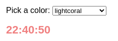
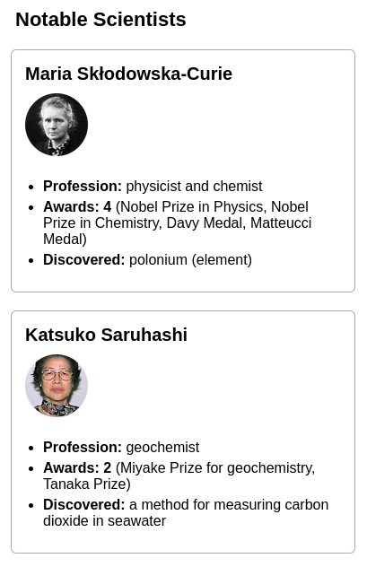
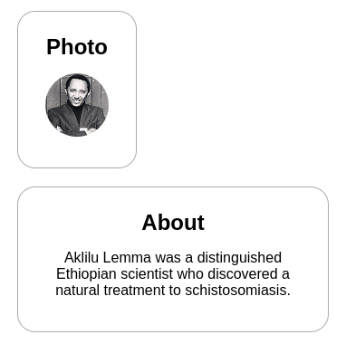

# Передача параметров

Компоненты React используют _props_ для взаимодействия друг с другом. Каждый родительский компонент может передавать некоторую информацию своим дочерним компонентам, передавая им параметры. Параметры могут напомнить вам атрибуты HTML, но через них можно передавать любые значения JavaScript, включая объекты, массивы и функции.

!!!tip "Вы узнаете"

    -   Как передать параметры компоненту
    -   Как читать параметры из компонента
    -   Как указать значения по умолчанию для параметров
    -   Как передать некоторый JSX в компонент
    -   Как параметры изменяются со временем

## Известные параметры

Параметры - это информация, которую вы передаете в тег JSX. Например, `className`, `src`, `alt`, `width` и `height` - вот некоторые из параметров, которые вы можете передать тегу ``:

<!-- 0001.part.md -->

=== "App.js"

    ```js
    function Avatar() {
    	return (
    		
    	);
    }

    export default function Profile() {
    	return <Avatar />;
    }
    ```

=== "Результат"

    

Параметры, которые вы можете передать тегу ``, предопределены (ReactDOM соответствует [стандарту HTML](https://www.w3.org/TR/html52/semantics-embedded-content.html#the-img-element)). Но вы можете передавать любые параметры _своим_ компонентам, таким как `<Avatar>`, чтобы настроить их. Вот как!

## Передача параметров компоненту

В этом коде компонент `Profile` не передает никаких параметров своему дочернему компоненту `Avatar`:

<!-- 0005.part.md -->

```js
export default function Profile() {
    return <Avatar />;
}
```

<!-- 0006.part.md -->

Вы можете передать `Avatar` некоторые параметры в два этапа.

### Шаг 1: Передайте параметры дочернему компоненту

Сначала передайте `Avatar` некоторые параметры. Например, передадим два параметра: `person` (объект) и `size` (число):

<!-- 0007.part.md -->

```js
export default function Profile() {
    return (
        <Avatar
            person={{
                name: 'Lin Lanying',
                imageId: '1bX5QH6',
            }}
            size={100}
        />
    );
}
```

<!-- 0008.part.md -->

!!!note ""

    Если двойные фигурные скобки после `person=` вас смущают, вспомните [они просто объект](javascript-in-jsx-with-curly-braces.md) внутри JSX-скобок.

Теперь вы можете прочитать эти параметры внутри компонента `Avatar`.

### Шаг 2: Чтение параметров внутри дочернего компонента

Вы можете прочитать эти параметры, перечислив их имена `person, size`, разделенные запятыми внутри `({` и `})` непосредственно после `функции Avatar`. Это позволит вам использовать их внутри кода `Avatar`, как вы бы сделали это с переменной.

<!-- 0009.part.md -->

```js
function Avatar({ person, size }) {
    // person and size are available here
}
```

<!-- 0010.part.md -->

Добавьте в `Avatar` логику, которая использует параметры `person` и `Size` для рендеринга, и все готово.

Теперь вы можете настроить `Avatar` для рендеринга различными способами с различными параметрами. Попробуйте настроить значения!

<!-- 0011.part.md -->

=== "App.js"

    <div markdown style="max-height: 400px; overflow-y: auto;">

    ```js
    import { getImageUrl } from './utils.js';

    function Avatar({ person, size }) {
    	return (
    		
    	);
    }

    export default function Profile() {
    	return (
    		<div>
    			<Avatar
    				size={100}
    				person={{
    					name: 'Katsuko Saruhashi',
    					imageId: 'YfeOqp2',
    				}}
    			/>
    			<Avatar
    				size={80}
    				person={{
    					name: 'Aklilu Lemma',
    					imageId: 'OKS67lh',
    				}}
    			/>
    			<Avatar
    				size={50}
    				person={{
    					name: 'Lin Lanying',
    					imageId: '1bX5QH6',
    				}}
    			/>
    		</div>
    	);
    }
    ```

    </div>

=== "utils.js"

    ```js
    export function getImageUrl(person, size = 's') {
    	return (
    		'https://i.imgur.com/' +
    		person.imageId +
    		size +
    		'.jpg'
    	);
    }
    ```

=== "Результат"

    

<!-- 0016.part.md -->

Параметры позволяют вам думать о родительских и дочерних компонентах независимо друг от друга. Например, вы можете изменить параметры `person` или `Size` внутри `Profile` без необходимости думать о том, как `Avatar` использует их. Аналогично, вы можете изменить, как `Avatar` использует эти параметры, не заглядывая в `Profile`.

Вы можете думать о параметрах как о "ручках", которые можно регулировать. Они выполняют ту же роль, что и аргументы для функций - фактически, параметр _является_ единственным аргументом вашего компонента! Функции компонентов React принимают единственный аргумент - объект `props`:

<!-- 0017.part.md -->

```js
function Avatar(props) {
    let person = props.person;
    let size = props.size;
    // ...
}
```

<!-- 0018.part.md -->

Обычно вам не нужен весь объект `props`, поэтому вы деструктурируете его на отдельные параметры.

!!!warning "Внимание"

    Не пропустите пару символов `{` и `}` внутри `(` и `)` при объявлении параметров:

    ```js
    function Avatar({ person, size }) {
    	// ...
    }
    ```

    Этот синтаксис называется ["деструктуризация"](https://developer.mozilla.org/docs/Web/JavaScript/Reference/Operators/Destructuring_assignment#Unpacking_fields_from_objects_passed_as_a_function_parameter) и эквивалентен чтению свойств из параметра функции:

    ```js
    function Avatar(props) {
    	let person = props.person;
    	let size = props.size;
    	// ...
    }
    ```

## Указание значения по умолчанию для параметра

Если вы хотите задать значение по умолчанию для параметра, когда значение не указано, вы можете сделать это с помощью деструктуризации, поместив `=` и значение по умолчанию сразу после параметра:

<!-- 0023.part.md -->

```js
function Avatar({ person, size = 100 }) {
    // ...
}
```

<!-- 0024.part.md -->

Теперь, если `<Avatar person={...} />` отображается без свойства `size`, то `size` будет установлен в `100`.

Значение по умолчанию используется только в том случае, если параметр `size` отсутствует или если вы передали `size={undefined}`. Но если вы передадите `size={null}` или `size={0}`, значение по умолчанию **не** будет использоваться.

## Пересылка параметров с синтаксисом JSX spread

Иногда передача параметров становится очень повторяющейся:

<!-- 0025.part.md -->

```js
function Profile({ person, size, isSepia, thickBorder }) {
    return (
        <div className="card">
            <Avatar
                person={person}
                size={size}
                isSepia={isSepia}
                thickBorder={thickBorder}
            />
        </div>
    );
}
```

<!-- 0026.part.md -->

Нет ничего плохого в повторяющемся коде - он может быть более разборчивым. Но иногда вам может быть важна краткость. Некоторые компоненты передают все свои параметры своим дочерним компонентам, например, как этот `Profile` делает это с `Avatar`. Поскольку они не используют параметры напрямую, имеет смысл использовать более лаконичный синтаксис "spread":

<!-- 0027.part.md -->

```js
function Profile(props) {
    return (
        <div className="card">
            <Avatar {...props} />
        </div>
    );
}
```

<!-- 0028.part.md -->

Это пересылает все параметры `Profile` в `Avatar` без перечисления имен каждого из них.

**Используйте синтаксис распространения сдержанно.** Если вы используете его в каждом втором компоненте, что-то не так. Часто это указывает на то, что вам следует разделить ваши компоненты и передавать дочерние компоненты как JSX. Подробнее об этом далее!

## Передача JSX в качестве дочерних компонентов

Часто встречается вложение встроенных тегов браузера:

<!-- 0029.part.md -->

```js
<div>
    
</div>
```

<!-- 0030.part.md -->

Иногда вы захотите вложить свои собственные компоненты таким же образом:

<!-- 0031.part.md -->

```js
<Card>
    <Avatar />
</Card>
```

<!-- 0032.part.md -->

Когда вы вложите содержимое в JSX-тег, родительский компонент получит это содержимое в свойстве `children`. Например, компонент `Card` ниже получит параметр `children`, установленный в `<Avatar />`, и отобразит его в обертке div:

<!-- 0033.part.md -->

=== "App.js"

    ```js
    import Avatar from './Avatar.js';

    function Card({ children }) {
    	return <div className="card">{children}</div>;
    }

    export default function Profile() {
    	return (
    		<Card>
    			<Avatar
    				size={100}
    				person={{
    					name: 'Katsuko Saruhashi',
    					imageId: 'YfeOqp2',
    				}}
    			/>
    		</Card>
    	);
    }
    ```

=== "Avatar.js"

    ```js
    import { getImageUrl } from './utils.js';

    export default function Avatar({ person, size }) {
    	return (
    		
    	);
    }
    ```

=== "utils.js"

    ```js
    export function getImageUrl(person, size = 's') {
    	return (
    		'https://i.imgur.com/' +
    		person.imageId +
    		size +
    		'.jpg'
    	);
    }
    ```

=== "Результат"

    

<!-- 0040.part.md -->

Попробуйте заменить `<Avatar>` внутри `<Card>` каким-нибудь текстом, чтобы увидеть, как компонент `Card` может обернуть любое вложенное содержимое. Ему не нужно "знать", что отображается внутри него. Вы увидите этот гибкий шаблон во многих местах.

Вы можете думать о компоненте с параметром `children` как о компоненте с "дырой", которая может быть "заполнена" его родительскими компонентами с помощью произвольного JSX. Вы часто будете использовать параметр `children` для визуальных оберток: панелей, сеток и т. д.


## Как параметры меняются со временем

Компонент `Clock` ниже получает два параметра от своего родительского компонента: `color` и `time`. (Код родительского компонента опущен, поскольку он использует [state](state-a-components-memory.md), в который мы пока не будем углубляться).

Попробуйте изменить цвет в поле выбора ниже:

<!-- 0041.part.md -->

=== "Clock.js"

    ```js
    export default function Clock({ color, time }) {
    	return <h1 style={{ color: color }}>{time}</h1>;
    }
    ```

=== "App.js"

    <div markdown style="max-height: 400px; overflow-y: auto;">

    ```js
    import { useState, useEffect } from 'react';
    import Clock from './Clock.js';

    function useTime() {
    	const [time, setTime] = useState(() => new Date());
    	useEffect(() => {
    		const id = setInterval(() => {
    			setTime(new Date());
    		}, 1000);
    		return () => clearInterval(id);
    	}, []);
    	return time;
    }

    export default function App() {
    	const time = useTime();
    	const [color, setColor] = useState('lightcoral');
    	return (
    		<div>
    			<p>
    				Pick a color:{' '}
    				<select
    					value={color}
    					onChange={(e) =>
    						setColor(e.target.value)
    					}
    				>
    					<option value="lightcoral">
    						lightcoral
    					</option>
    					<option value="midnightblue">
    						midnightblue
    					</option>
    					<option value="rebeccapurple">
    						rebeccapurple
    					</option>
    				</select>
    			</p>
    			<Clock
    				color={color}
    				time={time.toLocaleTimeString()}
    			/>
    		</div>
    	);
    }
    ```

    </div>

=== "Результат"

    

<!-- 0044.part.md -->

Этот пример иллюстрирует, что **компонент может получать различные параметры с течением времени.** параметры не всегда статичны! Здесь параметр `time` меняется каждую секунду, а параметр `color` меняется, когда вы выбираете другой цвет. параметры отражают данные компонента в любой момент времени, а не только в начале.

Однако параметры являются [immutable](https://ru.wikipedia.org/wiki/%D0%9D%D0%B5%D0%B8%D0%B7%D0%BC%D0%B5%D0%BD%D1%8F%D0%B5%D0%BC%D1%8B%D0%B9_%D0%BE%D0%B1%D1%8A%D0%B5%D0%BA%D1%82)- термин из информатики, означающий "неизменный". Когда компоненту нужно изменить свой параметр (например, в ответ на взаимодействие с пользователем или новые данные), он должен "попросить" свой родительский компонент передать ему _другой параметр_ - новый объект! Его старые параметры будут отброшены, и в конечном итоге движок JavaScript вернет память, занятую ими.

**Не пытайтесь "менять параметры".** Когда вам нужно отреагировать на ввод пользователя (например, изменить выбранный цвет), вам нужно будет "установить состояние", о котором вы можете узнать в [State: A Component's Memory](state-a-components-memory.md).

!!!note "Итоги"

    -   Чтобы передать параметры, добавьте их в JSX, точно так же, как это делается с атрибутами HTML.
    -   Чтобы прочитать параметр, используйте синтаксис деструктуризации `function Avatar({ person, size })`.
    -   Вы можете указать значение по умолчанию, например `size = 100`, которое используется для отсутствующих и `неопределенных` параметров.
    -   Вы можете переслать все параметры с помощью `<Avatar {...props} />` Синтаксис распространения JSX, но не злоупотребляйте им!
    -   Вложенные JSX типа `<Card><Avatar /></Card>` будут отображаться как `дочерние` параметры компонента `Card`.
    -   параметры - это снимки времени, доступные только для чтения: каждый рендер получает новую версию параметра.
    -   Вы не можете изменять параметры. Когда вам понадобится интерактивность, вам нужно будет установить состояние.

## Задачи

### 1. Извлечение компонента

Этот компонент `Gallery` содержит очень похожую разметку для двух профилей. Извлеките из него компонент `Profile`, чтобы уменьшить дублирование. Вам нужно будет выбрать, какие параметры передать ему.

<!-- 0045.part.md -->

=== "App.js"

    <div markdown style="max-height: 400px; overflow-y: auto;">

    ```js
    import { getImageUrl } from './utils.js';

    export default function Gallery() {
    	return (
    		<div>
    			<h1>Notable Scientists</h1>
    			<section className="profile">
    				<h2>Maria Skłodowska-Curie</h2>
    				
    				<ul>
    					<li>
    						<b>Profession: </b>
    						physicist and chemist
    					</li>
    					<li>
    						<b>Awards: 4 </b>
    						(Nobel Prize in Physics, Nobel Prize
    						in Chemistry, Davy Medal, Matteucci Medal)
    					</li>
    					<li>
    						<b>Discovered: </b>
    						polonium (element)
    					</li>
    				</ul>
    			</section>
    			<section className="profile">
    				<h2>Katsuko Saruhashi</h2>
    				
    				<ul>
    					<li>
    						<b>Profession: </b>
    						geochemist
    					</li>
    					<li>
    						<b>Awards: 2 </b>
    						(Miyake Prize for geochemistry, Tanaka
    						Prize)
    					</li>
    					<li>
    						<b>Discovered: </b>a method for
    						measuring carbon dioxide in seawater
    					</li>
    				</ul>
    			</section>
    		</div>
    	);
    }
    ```

    </div>

=== "utils.js"

    ```js
    export function getImageUrl(imageId, size = 's') {
    	return 'https://i.imgur.com/' + imageId + size + '.jpg';
    }
    ```

=== "Результат"

    

???tip "Показать подсказку"

    Начните с извлечения разметки для одного из ученых. Затем найдите части, которые не соответствуют ему во втором примере, и сделайте их настраиваемыми с помощью параметров.

???success "Показать решение"

    В этом решении компонент `Profile` принимает несколько параметров: `imageId` (строка), `name` (строка), `profession` (строка), `awards` (массив строк), `discovery` (строка) и `imageSize` (число).

    Обратите внимание, что параметр `imageSize` имеет значение по умолчанию, поэтому мы не передаем его компоненту.

    === "App.js"

    	<div markdown style="max-height: 400px; overflow-y: auto;">

    	```js
    	import { getImageUrl } from './utils.js';

    	function Profile({
    		imageId,
    		name,
    		profession,
    		awards,
    		discovery,
    		imageSize = 70,
    	}) {
    		return (
    			<section className="profile">
    				<h2>{name}</h2>
    				
    				<ul>
    					<li>
    						<b>Profession:</b> {profession}
    					</li>
    					<li>
    						<b>Awards: {awards.length} </b>(
    						{awards.join(', ')})
    					</li>
    					<li>
    						<b>Discovered: </b>
    						{discovery}
    					</li>
    				</ul>
    			</section>
    		);
    	}

    	export default function Gallery() {
    		return (
    			<div>
    				<h1>Notable Scientists</h1>
    				<Profile
    					imageId="szV5sdG"
    					name="Maria Skłodowska-Curie"
    					profession="physicist and chemist"
    					discovery="polonium (chemical element)"
    					awards={[
    						'Nobel Prize in Physics',
    						'Nobel Prize in Chemistry',
    						'Davy Medal',
    						'Matteucci Medal',
    					]}
    				/>
    				<Profile
    					imageId="YfeOqp2"
    					name="Katsuko Saruhashi"
    					profession="geochemist"
    					discovery="a method for measuring carbon dioxide in seawater"
    					awards={[
    						'Miyake Prize for geochemistry',
    						'Tanaka Prize',
    					]}
    				/>
    			</div>
    		);
    	}
    	```

    	</div>

    === "utils.js"

    	```js
    	export function getImageUrl(imageId, size = 's') {
    		return 'https://i.imgur.com/' + imageId + size + '.jpg';
    	}
    	```

    === "Результат"

    	

    <!-- 0056.part.md -->

    Обратите внимание, что вам не нужен отдельный параметр `awardCount`, если `awards` - это массив. Тогда вы можете использовать `awards.length` для подсчета количества наград. Помните, что параметр может принимать любые значения, в том числе и массивы тоже!

    Другое решение, более похожее на предыдущие примеры на этой странице, заключается в том, чтобы сгруппировать всю информацию о человеке в одном объекте и передать этот объект как один параметр:

    === "App.js"

    	<div markdown style="max-height: 400px; overflow-y: auto;">

    	```js
    	import { getImageUrl } from './utils.js';

    	function Profile({ person, imageSize = 70 }) {
    		const imageSrc = getImageUrl(person);

    		return (
    			<section className="profile">
    				<h2>{person.name}</h2>
    				
    				<ul>
    					<li>
    						<b>Profession:</b> {person.profession}
    					</li>
    					<li>
    						<b>Awards: {person.awards.length} </b>(
    						{person.awards.join(', ')})
    					</li>
    					<li>
    						<b>Discovered: </b>
    						{person.discovery}
    					</li>
    				</ul>
    			</section>
    		);
    	}

    	export default function Gallery() {
    		return (
    			<div>
    				<h1>Notable Scientists</h1>
    				<Profile
    					person={{
    						imageId: 'szV5sdG',
    						name: 'Maria Skłodowska-Curie',
    						profession: 'physicist and chemist',
    						discovery:
    							'polonium (chemical element)',
    						awards: [
    							'Nobel Prize in Physics',
    							'Nobel Prize in Chemistry',
    							'Davy Medal',
    							'Matteucci Medal',
    						],
    					}}
    				/>
    				<Profile
    					person={{
    						imageId: 'YfeOqp2',
    						name: 'Katsuko Saruhashi',
    						profession: 'geochemist',
    						discovery:
    							'a method for measuring carbon dioxide in seawater',
    						awards: [
    							'Miyake Prize for geochemistry',
    							'Tanaka Prize',
    						],
    					}}
    				/>
    			</div>
    		);
    	}
    	```

    	</div>

    === "utils.js"

    	```js
    	export function getImageUrl(person, size = 's') {
    		return (
    			'https://i.imgur.com/' +
    			person.imageId +
    			size +
    			'.jpg'
    		);
    	}
    	```

    === "Результат"

    	

    Хотя синтаксис выглядит несколько иначе, поскольку вы описываете свойства объекта JavaScript, а не коллекцию атрибутов JSX, эти примеры в основном эквивалентны, и вы можете выбрать любой подход.

### 2. Настройте размер изображения на основе параметров

В этом примере `Avatar` получает числовой параметр `size`, который определяет ширину и высоту ``. В данном примере параметр `size` установлен на `40`. Однако если вы откроете изображение в новой вкладке, вы заметите, что само изображение больше (`160` пикселей). Реальный размер изображения определяется тем, какой размер миниатюры вы запрашиваете.

Измените компонент `Avatar`, чтобы он запрашивал наиболее близкий размер изображения на основе параметра `size`. В частности, если `size` меньше `90`, передавайте `'s'` ("small"), а не `'b'` ("big") в функцию `getImageUrl`. Проверьте, что ваши изменения работают, отобразив аватары с разными значениями параметра `size` и открыв изображения в новой вкладке.

=== "App.js"

    ```js
    import { getImageUrl } from './utils.js';

    function Avatar({ person, size }) {
    	return (
    		
    	);
    }

    export default function Profile() {
    	return (
    		<Avatar
    			size={40}
    			person={{
    				name: 'Gregorio Y. Zara',
    				imageId: '7vQD0fP',
    			}}
    		/>
    	);
    }
    ```

=== "utils.js"

    ```js
    export function getImageUrl(person, size) {
    	return (
    		'https://i.imgur.com/' +
    		person.imageId +
    		size +
    		'.jpg'
    	);
    }
    ```

=== "Результат"

    

<!-- 0068.part.md -->

???success "Показать решение"

    Вот как вы можете поступить:

    === "App.js"

    	```js
    	import { getImageUrl } from './utils.js';

    	function Avatar({ person, size }) {
    		let thumbnailSize = 's';
    		if (size > 90) {
    			thumbnailSize = 'b';
    		}
    		return (
    			
    		);
    	}

    	export default function Profile() {
    		return (
    			<>
    				<Avatar
    					size={40}
    					person={{
    						name: 'Gregorio Y. Zara',
    						imageId: '7vQD0fP',
    					}}
    				/>
    				<Avatar
    					size={120}
    					person={{
    						name: 'Gregorio Y. Zara',
    						imageId: '7vQD0fP',
    					}}
    				/>
    			</>
    		);
    	}
    	```

    === "utils.js"

    	```js
    	export function getImageUrl(person, size) {
    		return (
    			'https://i.imgur.com/' +
    			person.imageId +
    			size +
    			'.jpg'
    		);
    	}
    	```

    === "Результат"

    	

    <!-- 0074.part.md -->

    Вы также можете показать более четкое изображение для экранов с высоким DPI, принимая во внимание [`window.devicePixelRatio`](https://developer.mozilla.org/docs/Web/API/Window/devicePixelRatio):

    === "App.js"

    	```js
    	import { getImageUrl } from './utils.js';

    	const ratio = window.devicePixelRatio;

    	function Avatar({ person, size }) {
    		let thumbnailSize = 's';
    		if (size * ratio > 90) {
    			thumbnailSize = 'b';
    		}
    		return (
    			
    		);
    	}

    	export default function Profile() {
    		return (
    			<>
    				<Avatar
    					size={40}
    					person={{
    						name: 'Gregorio Y. Zara',
    						imageId: '7vQD0fP',
    					}}
    				/>
    				<Avatar
    					size={70}
    					person={{
    						name: 'Gregorio Y. Zara',
    						imageId: '7vQD0fP',
    					}}
    				/>
    				<Avatar
    					size={120}
    					person={{
    						name: 'Gregorio Y. Zara',
    						imageId: '7vQD0fP',
    					}}
    				/>
    			</>
    		);
    	}
    	```

    === "utils.js"

    	```js
    	export function getImageUrl(person, size) {
    		return (
    			'https://i.imgur.com/' +
    			person.imageId +
    			size +
    			'.jpg'
    		);
    	}
    	```

    === "Результат"

    	

    <!-- 0080.part.md -->

    Параметры позволяют инкапсулировать подобную логику внутри компонента `Avatar` (и изменить ее позже, если потребуется), чтобы каждый мог использовать компонент `<Avatar>`, не задумываясь о том, как запрашиваются и изменяются размеры изображений.

### 3. Передача JSX в `children` параметр

Извлеките компонент `Card` из приведенной ниже разметки и используйте параметр `children` для передачи ему различных JSX:

=== "App.js"

    ```js
    export default function Profile() {
    	return (
    		<div>
    			<div className="card">
    				<div className="card-content">
    					<h1>Photo</h1>
    					
    				</div>
    			</div>
    			<div className="card">
    				<div className="card-content">
    					<h1>About</h1>
    					<p>
    						Aklilu Lemma was a distinguished
    						Ethiopian scientist who discovered a
    						natural treatment to
    						schistosomiasis.
    					</p>
    				</div>
    			</div>
    		</div>
    	);
    }
    ```

=== "Результат"

    

<!-- 0084.part.md -->

???tip "Показать подсказку"

    Любой JSX, который вы поместите внутрь тега компонента, будет передан в качестве параметра `children` этому компоненту.

???success "Показать решение"

    Вот как вы можете использовать компонент `Card` в обоих местах:

    === "App.js"

    	```js
    	function Card({ children }) {
    		return (
    			<div className="card">
    				<div className="card-content">{children}</div>
    			</div>
    		);
    	}

    	export default function Profile() {
    		return (
    			<div>
    				<Card>
    					<h1>Photo</h1>
    					
    				</Card>
    				<Card>
    					<h1>About</h1>
    					<p>
    						Aklilu Lemma was a distinguished
    						Ethiopian scientist who discovered a
    						natural treatment to schistosomiasis.
    					</p>
    				</Card>
    			</div>
    		);
    	}
    	```

    === "Результат"

    	

    <!-- 0088.part.md -->

    Вы также можете сделать `title` отдельным параметром, если хотите, чтобы каждая `Card` всегда имела заголовок:

    === "App.js"

    	```js
    	function Card({ children, title }) {
    		return (
    			<div className="card">
    				<div className="card-content">
    					<h1>{title}</h1>
    					{children}
    				</div>
    			</div>
    		);
    	}

    	export default function Profile() {
    		return (
    			<div>
    				<Card title="Photo">
    					
    				</Card>
    				<Card title="About">
    					<p>
    						Aklilu Lemma was a distinguished
    						Ethiopian scientist who discovered a
    						natural treatment to schistosomiasis.
    					</p>
    				</Card>
    			</div>
    		);
    	}
    	```

    === "Результат"

    	

## Ссылки

-   [https://react.dev/learn/passing-props-to-a-component](https://react.dev/learn/passing-props-to-a-component)
