# Сохранение и сброс состояния

Состояние изолировано между компонентами. React отслеживает, какое состояние принадлежит тому или иному компоненту, основываясь на их месте в дереве пользовательского интерфейса. Вы можете контролировать, когда сохранять состояние, а когда сбрасывать его между повторными рендерами.

!!!tip "Вы узнаете"

    -   Как React "видит" структуры компонентов
    -   Когда React решает сохранить или сбросить состояние
    -   Как заставить React сбросить состояние компонента
    -   Как ключи и типы влияют на сохранение состояния

## Дерево пользовательского интерфейса

Браузеры используют множество древовидных структур для моделирования пользовательского интерфейса. [DOM](https://developer.mozilla.org/ru/docs/Web/API/Document_Object_Model/Introduction) представляет элементы HTML, [CSSOM](https://developer.mozilla.org/docs/Web/API/CSS_Object_Model) делает то же самое для CSS. Есть даже [Accessibility tree](https://developer.mozilla.org/docs/Glossary/Accessibility_tree)!

React также использует древовидные структуры для управления и моделирования пользовательского интерфейса. React создает **деревья пользовательского интерфейса** из вашего JSX. Затем React DOM обновляет элементы DOM браузера в соответствии с этим деревом пользовательского интерфейса. (React Native переводит эти деревья в элементы, специфичные для мобильных платформ).

![Диаграмма с тремя секциями, расположенными горизонтально. В первой секции есть три прямоугольника, сложенные вертикально, с метками "Компонент A", "Компонент B" и "Компонент C". Переход к следующей панели представляет собой стрелку с логотипом React на вершине с надписью 'React'. Средняя секция содержит дерево компонентов, корень которого обозначен 'A', а два дочерних компонента - 'B' и 'C'. Переход к следующей секции снова осуществляется с помощью стрелки с логотипом React на вершине с надписью 'React'. Третий и последний раздел представляет собой каркас браузера, содержащий дерево из 8 узлов, в котором выделено только подмножество (указывающее на поддерево из среднего раздела).](preserving_state_dom_tree.webp)

Из компонентов React создает дерево UI, которое React DOM использует для рендеринга DOM

## Состояние привязано к позиции в дереве

Когда вы передаете компоненту состояние, вы можете подумать, что это состояние "живет" внутри компонента. Но на самом деле состояние хранится внутри React. React связывает каждую часть состояния, которую он хранит, с нужным компонентом по тому, где этот компонент находится в дереве пользовательского интерфейса.

Здесь есть только один JSX-тег `<Counter />`, но он отображается в двух разных позициях:

=== "App.js"

    ```js
    import { useState } from 'react';

    export default function App() {
        const counter = <Counter />;
        return (
            <div>
                {counter}
                {counter}
            </div>
        );
    }

    function Counter() {
        const [score, setScore] = useState(0);
        const [hover, setHover] = useState(false);

        let className = 'counter';
        if (hover) {
            className += ' hover';
        }

        return (
            <div
                className={className}
                onPointerEnter={() => setHover(true)}
                onPointerLeave={() => setHover(false)}
            >
                <h1>{score}</h1>
                <button onClick={() => setScore(score + 1)}>
                    Add one
                </button>
            </div>
        );
    }
    ```

=== "Результат"

    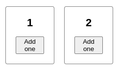

Вот как они выглядят в виде дерева:

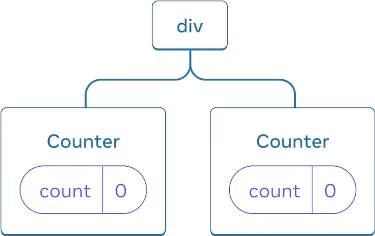

Дерево React

**Это два отдельных счетчика, потому что каждый из них отображается в своей позиции в дереве.** Обычно вам не нужно думать об этих позициях, чтобы использовать React, но может быть полезно понять, как это работает.

В React каждый компонент на экране имеет полностью изолированное состояние. Например, если вы отобразите два компонента `Counter` рядом друг с другом, каждый из них получит свои собственные, независимые состояния `score` и `hover`.

Попробуйте нажать на оба счетчика и заметите, что они не влияют друг на друга:

=== "App.js"

    ```js
    import { useState } from 'react';

    export default function App() {
        return (
            <div>
                <Counter />
                <Counter />
            </div>
        );
    }

    function Counter() {
        const [score, setScore] = useState(0);
        const [hover, setHover] = useState(false);

        let className = 'counter';
        if (hover) {
            className += ' hover';
        }

        return (
            <div
                className={className}
                onPointerEnter={() => setHover(true)}
                onPointerLeave={() => setHover(false)}
            >
                <h1>{score}</h1>
                <button onClick={() => setScore(score + 1)}>
                    Add one
                </button>
            </div>
        );
    }
    ```

=== "Результат"

    

Как вы можете видеть, при обновлении одного счетчика обновляется только состояние этого компонента:


Обновление состояния

React будет сохранять состояние до тех пор, пока вы рендерите один и тот же компонент в одной и той же позиции. Чтобы увидеть это, увеличьте оба счетчика, затем удалите второй компонент, сняв флажок "Render the second counter", а затем добавьте его обратно, снова установив флажок:

=== "App.js"

    <div markdown style="max-height: 400px; overflow-y: auto;">

    ```js
    import { useState } from 'react';

    export default function App() {
        const [showB, setShowB] = useState(true);
        return (
            <div>
                <Counter />
                {showB && <Counter />}
                <label>
                    <input
                        type="checkbox"
                        checked={showB}
                        onChange={(e) => {
                            setShowB(e.target.checked);
                        }}
                    />
                    Render the second counter
                </label>
            </div>
        );
    }

    function Counter() {
        const [score, setScore] = useState(0);
        const [hover, setHover] = useState(false);

        let className = 'counter';
        if (hover) {
            className += ' hover';
        }

        return (
            <div
                className={className}
                onPointerEnter={() => setHover(true)}
                onPointerLeave={() => setHover(false)}
            >
                <h1>{score}</h1>
                <button onClick={() => setScore(score + 1)}>
                    Add one
                </button>
            </div>
        );
    }
    ```

    </div>

=== "Результат"

    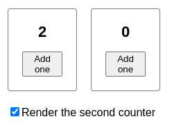

Обратите внимание, что в момент, когда вы прекращаете рендеринг второго счетчика, его состояние полностью исчезает. Это потому, что когда React удаляет компонент, он уничтожает его состояние.


Удаление компонента

Когда вы отметите "Render the second counter", второй `Counter` и его состояние инициализируются с нуля (`score = 0`) и добавляются в DOM.


Добавление компонента

**React сохраняет состояние компонента до тех пор, пока он отображается в своей позиции в дереве пользовательского интерфейса.** Если компонент удаляется, или другой компонент отображается в той же позиции, React удаляет его состояние.

## Тот же компонент в той же позиции сохраняет состояние

В этом примере есть два разных тега `<Counter />`:

=== "App.js"

    <div markdown style="max-height: 400px; overflow-y: auto;">

    ```js
    import { useState } from 'react';

    export default function App() {
        const [isFancy, setIsFancy] = useState(false);
        return (
            <div>
                {isFancy ? (
                    <Counter isFancy={true} />
                ) : (
                    <Counter isFancy={false} />
                )}
                <label>
                    <input
                        type="checkbox"
                        checked={isFancy}
                        onChange={(e) => {
                            setIsFancy(e.target.checked);
                        }}
                    />
                    Use fancy styling
                </label>
            </div>
        );
    }

    function Counter({ isFancy }) {
        const [score, setScore] = useState(0);
        const [hover, setHover] = useState(false);

        let className = 'counter';
        if (hover) {
            className += ' hover';
        }
        if (isFancy) {
            className += ' fancy';
        }

        return (
            <div
                className={className}
                onPointerEnter={() => setHover(true)}
                onPointerLeave={() => setHover(false)}
            >
                <h1>{score}</h1>
                <button onClick={() => setScore(score + 1)}>
                    Add one
                </button>
            </div>
        );
    }
    ```

    </div>

=== "Результат"

    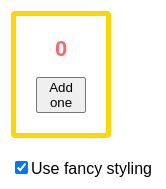

Когда вы устанавливаете или снимаете флажок, состояние счетчика не сбрасывается. Независимо от того, является ли `isFancy` `true` или `false`, у вас всегда будет `<Counter />` в качестве первого дочернего элемента `div`, возвращаемого из корневого компонента `App`:

![Диаграмма с двумя секциями, разделенными стрелкой перехода между ними. Каждая секция содержит макет компонентов с родительским компонентом с меткой 'App', содержащим пузырек состояния с меткой isFancy. Этот компонент имеет одного ребенка с меткой 'div', что приводит к тому, что пузырь состояния, содержащий isFancy (выделенный фиолетовым цветом), передается единственному ребенку. Последний ребенок имеет метку 'Counter' и содержит пузырек состояния с меткой 'count' и значением 3 на обеих диаграммах. В левой части диаграммы ничего не выделено, а значение состояния родительского объекта isFancy равно false. В правой части диаграммы значение родительского состояния isFancy изменилось на true и выделено желтым цветом, как и расположенный ниже реквизитный пузырь, который также изменил свое значение isFancy на true.](preserving_state_same_component.webp)

Обновление состояния `App` не сбрасывает `Counter`, потому что `Counter` остается в том же положении

Это тот же компонент в той же позиции, поэтому с точки зрения React, это тот же счетчик.

!!!warning "Внимание"

    Помните, что **для React важна позиция в дереве пользовательского интерфейса, а не в JSX-разметке!** Этот компонент имеет два предложения `return` с разными JSX-тегами `<Counter />` внутри и вне `if`:

    === "App.js"

        <div markdown style="max-height: 400px; overflow-y: auto;">

        ```js
        import { useState } from 'react';

        export default function App() {
            const [isFancy, setIsFancy] = useState(false);
            if (isFancy) {
                return (
                    <div>
                        <Counter isFancy={true} />
                        <label>
                            <input
                                type="checkbox"
                                checked={isFancy}
                                onChange={(e) => {
                                    setIsFancy(e.target.checked);
                                }}
                            />
                            Use fancy styling
                        </label>
                    </div>
                );
            }
            return (
                <div>
                    <Counter isFancy={false} />
                    <label>
                        <input
                            type="checkbox"
                            checked={isFancy}
                            onChange={(e) => {
                                setIsFancy(e.target.checked);
                            }}
                        />
                        Use fancy styling
                    </label>
                </div>
            );
        }

        function Counter({ isFancy }) {
            const [score, setScore] = useState(0);
            const [hover, setHover] = useState(false);

            let className = 'counter';
            if (hover) {
                className += ' hover';
            }
            if (isFancy) {
                className += ' fancy';
            }

            return (
                <div
                    className={className}
                    onPointerEnter={() => setHover(true)}
                    onPointerLeave={() => setHover(false)}
                >
                    <h1>{score}</h1>
                    <button onClick={() => setScore(score + 1)}>
                        Add one
                    </button>
                </div>
            );
        }
        ```

        </div>

    === "Результат"

        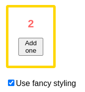

    Можно было бы ожидать, что состояние сбросится, когда вы поставите галочку, но этого не происходит! Это происходит потому, что **оба этих тега `<Counter />` отображаются в одной и той же позиции.** React не знает, где вы размещаете условия в вашей функции. Все, что он "видит" - это дерево, которое вы возвращаете.

    В обоих случаях компонент `App` возвращает `<div>` с `<Counter />` в качестве первого дочернего элемента. Для React эти два счетчика имеют одинаковый "адрес": первый ребенок первого ребенка корня. Вот как React сопоставляет их между предыдущим и следующим рендерами, независимо от того, как вы структурируете свою логику.

## Разные компоненты в одной и той же позиции сбрасывают состояние

В этом примере установка флажка заменит `<Counter>` на `<p>`:

=== "App.js"

    <div markdown style="max-height: 400px; overflow-y: auto;">

    ```js
    import { useState } from 'react';

    export default function App() {
        const [isPaused, setIsPaused] = useState(false);
        return (
            <div>
                {isPaused ? <p>See you later!</p> : <Counter />}
                <label>
                    <input
                        type="checkbox"
                        checked={isPaused}
                        onChange={(e) => {
                            setIsPaused(e.target.checked);
                        }}
                    />
                    Take a break
                </label>
            </div>
        );
    }

    function Counter() {
        const [score, setScore] = useState(0);
        const [hover, setHover] = useState(false);

        let className = 'counter';
        if (hover) {
            className += ' hover';
        }

        return (
            <div
                className={className}
                onPointerEnter={() => setHover(true)}
                onPointerLeave={() => setHover(false)}
            >
                <h1>{score}</h1>
                <button onClick={() => setScore(score + 1)}>
                    Add one
                </button>
            </div>
        );
    }
    ```

    </div>

=== "Результат"

    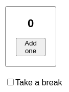

Здесь вы переключаетесь между _различными_ типами компонентов в одной и той же позиции. Изначально первый дочерний компонент `<div>` содержал `Counter`. Но когда вы поменяли местами `p`, React удалил `Counter` из дерева пользовательского интерфейса и уничтожил его состояние.

![Диаграмма с тремя секциями со стрелкой, переходящей от одной секции к другой. Первая секция содержит компонент React с меткой 'div' с одним дочерним компонентом с меткой 'Counter', содержащим пузырек состояния с меткой 'count' со значением 3. Средняя секция имеет тот же родительский компонент 'div', но дочерний компонент теперь удален, на что указывает желтое изображение "proof". Третья секция имеет тот же родительский компонент 'div', но теперь с новым дочерним компонентом с меткой 'p', выделенным желтым цветом.](preserving_state_diff_pt1.webp)

Когда `Counter` меняется на `p`, `Counter` удаляется, а `p` добавляется


При обратном переключении `p` удаляется, а `Counter` добавляется

Также, **когда вы отображаете другой компонент в той же позиции, он сбрасывает состояние всего своего поддерева.** Чтобы увидеть, как это работает, увеличьте счетчик, а затем установите флажок:

=== "App.js"

    <div markdown style="max-height: 400px; overflow-y: auto;">

    ```js
    import { useState } from 'react';

    export default function App() {
    	const [isFancy, setIsFancy] = useState(false);
    	return (
    		<div>
    			{isFancy ? (
    				<div>
    					<Counter isFancy={true} />
    				</div>
    			) : (
    				<section>
    					<Counter isFancy={false} />
    				</section>
    			)}
    			<label>
    				<input
    					type="checkbox"
    					checked={isFancy}
    					onChange={(e) => {
    						setIsFancy(e.target.checked);
    					}}
    				/>
    				Use fancy styling
    			</label>
    		</div>
    	);
    }

    function Counter({ isFancy }) {
    	const [score, setScore] = useState(0);
    	const [hover, setHover] = useState(false);

    	let className = 'counter';
    	if (hover) {
    		className += ' hover';
    	}
    	if (isFancy) {
    		className += ' fancy';
    	}

    	return (
    		<div
    			className={className}
    			onPointerEnter={() => setHover(true)}
    			onPointerLeave={() => setHover(false)}
    		>
    			<h1>{score}</h1>
    			<button onClick={() => setScore(score + 1)}>
    				Add one
    			</button>
    		</div>
    	);
    }
    ```

    </div>

=== "Результат"

    

Состояние счетчика сбрасывается, когда вы нажимаете на флажок. Хотя вы отображаете `Counter`, первый ребенок `div` меняется с `div` на `секцию`. Когда дочерний `div` был удален из DOM, все дерево под ним (включая `Counter` и его состояние) также было уничтожено.

![Диаграмма с тремя секциями, со стрелкой, переходящей от одной секции к другой. Первая секция содержит компонент React с меткой 'div' с одним дочерним элементом с меткой 'section', который имеет один дочерний элемент с меткой 'Counter', содержащий пузырек состояния с меткой 'count' со значением 3. Средняя секция имеет тот же родительский компонент 'div', но дочерние компоненты теперь удалены, на что указывает желтое изображение "proof". Третья секция имеет того же родителя 'div', но теперь с новым дочерним компонентом 'div', выделенным желтым цветом, а также с новым дочерним компонентом 'Counter', содержащим пузырек состояния 'count' со значением 0, все выделено желтым цветом.](preserving_state_diff_same_pt1.webp)

Когда `section` меняется на `div`, `section` удаляется и добавляется новый `div`.

![Диаграмма с тремя секциями, со стрелкой, переходящей от одной секции к другой. Первая секция содержит компонент React с меткой 'div' с одним дочерним элементом с меткой 'div', который имеет один дочерний элемент с меткой 'Counter', содержащий пузырек состояния с меткой 'count' со значением 0. Средняя секция имеет тот же родительский компонент 'div', но дочерние компоненты теперь удалены, на что указывает желтое изображение "proof". Третья секция имеет тот же родительский компонент 'div', но теперь с новым дочерним компонентом с меткой 'section', выделенным желтым цветом, а также с новым дочерним компонентом с меткой 'Counter', содержащим пузырек состояния с меткой 'count' и значением 0, все выделено желтым цветом.](preserving_state_diff_same_pt2.webp)

При обратном переключении, `div` удаляется, а новый `секция` добавляется

Как правило, **если вы хотите сохранить состояние между повторными рендерами, структура дерева должна "совпадать "** от одного рендера к другому. Если структура отличается, состояние будет уничтожено, потому что React уничтожает состояние, когда удаляет компонент из дерева.

!!!warning "Внимание"

    Вот почему не следует вставлять определения функций компонентов.

    Здесь функция компонента `MyTextField` определена _внутри_ `MyComponent`:

    === "App.js"

    	```js
    	import { useState } from 'react';

    	export default function MyComponent() {
    		const [counter, setCounter] = useState(0);

    		function MyTextField() {
    			const [text, setText] = useState('');

    			return (
    				<input
    					value={text}
    					onChange={(e) => setText(e.target.value)}
    				/>
    			);
    		}

    		return (
    			<>
    				<MyTextField />
    				<button
    					onClick={() => {
    						setCounter(counter + 1);
    					}}
    				>
    					Clicked {counter} times
    				</button>
    			</>
    		);
    	}
    	```

    === "Результат"

    	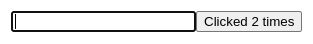

    Каждый раз, когда вы нажимаете на кнопку, состояние ввода исчезает! Это происходит потому, что _различная_ функция `MyTextField` создается для каждого рендера `MyComponent`. Вы рендерите _разный_ компонент в той же позиции, поэтому React сбрасывает все состояние ниже. Это приводит к ошибкам и проблемам с производительностью. Чтобы избежать этой проблемы, _всегда объявляйте функции компонента на верхнем уровне и не вкладывайте их определения_.

## Сброс состояния в одной и той же позиции

По умолчанию React сохраняет состояние компонента, пока он остается в той же позиции. Обычно это именно то, что вам нужно, поэтому это имеет смысл как поведение по умолчанию. Но иногда вам может понадобиться сбросить состояние компонента. Рассмотрим это приложение, позволяющее двум игрокам следить за своими результатами во время каждого хода:

=== "App.js"

    <div markdown style="max-height: 400px; overflow-y: auto;">

    ```js
    import { useState } from 'react';

    export default function Scoreboard() {
    	const [isPlayerA, setIsPlayerA] = useState(true);
    	return (
    		<div>
    			{isPlayerA ? (
    				<Counter person="Taylor" />
    			) : (
    				<Counter person="Sarah" />
    			)}
    			<button
    				onClick={() => {
    					setIsPlayerA(!isPlayerA);
    				}}
    			>
    				Next player!
    			</button>
    		</div>
    	);
    }

    function Counter({ person }) {
    	const [score, setScore] = useState(0);
    	const [hover, setHover] = useState(false);

    	let className = 'counter';
    	if (hover) {
    		className += ' hover';
    	}

    	return (
    		<div
    			className={className}
    			onPointerEnter={() => setHover(true)}
    			onPointerLeave={() => setHover(false)}
    		>
    			<h1>
    				{person}'s score: {score}
    			</h1>
    			<button onClick={() => setScore(score + 1)}>
    				Add one
    			</button>
    		</div>
    	);
    }
    ```

    </div>

=== "Результат"

    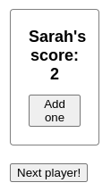

В настоящее время, когда вы меняете игрока, счет сохраняется. Два `счетчика` появляются в одной и той же позиции, поэтому React воспринимает их как _один и тот же_ `счетчик`, чей параметр `персона` изменился.

Но концептуально в этом приложении они должны быть двумя отдельными счетчиками. Они могут появляться в одном и том же месте пользовательского интерфейса, но один из них будет счетчиком для Тейлора, а другой - для Сары.

Есть два способа сбросить состояние при переключении между ними:

1.  Рендерить компоненты в разных позициях
2.  Придать каждому компоненту явную идентичность с помощью `key`.

### Вариант 1: Рендеринг компонента в разных позициях

Если вы хотите, чтобы эти два `Counter` были независимыми, вы можете отобразить их в двух разных позициях:

=== "App.js"

    <div markdown style="max-height: 400px; overflow-y: auto;">

    ```js
    import { useState } from 'react';

    export default function Scoreboard() {
    	const [isPlayerA, setIsPlayerA] = useState(true);
    	return (
    		<div>
    			{isPlayerA && <Counter person="Taylor" />}
    			{!isPlayerA && <Counter person="Sarah" />}
    			<button
    				onClick={() => {
    					setIsPlayerA(!isPlayerA);
    				}}
    			>
    				Next player!
    			</button>
    		</div>
    	);
    }

    function Counter({ person }) {
    	const [score, setScore] = useState(0);
    	const [hover, setHover] = useState(false);

    	let className = 'counter';
    	if (hover) {
    		className += ' hover';
    	}

    	return (
    		<div
    			className={className}
    			onPointerEnter={() => setHover(true)}
    			onPointerLeave={() => setHover(false)}
    		>
    			<h1>
    				{person}'s score: {score}
    			</h1>
    			<button onClick={() => setScore(score + 1)}>
    				Add one
    			</button>
    		</div>
    	);
    }
    ```

    </div>

=== "Результат"

    

-   Изначально `isPlayerA` имеет значение `true`. Поэтому первая позиция содержит состояние `Counter`, а вторая пуста.
-   Когда вы нажимаете кнопку "Следующий игрок", первая позиция очищается, но вторая теперь содержит `Counter`.


Начальное состояние

![Диаграмма с деревом компонентов React. Родительский компонент имеет метку 'Scoreboard' и пузырь состояния isPlayerA со значением 'false'. Пузырек состояния выделен желтым цветом, что указывает на его изменение. Левый дочерний элемент заменен желтым изображением "пуф", указывающим на то, что он был удален, а справа появился новый дочерний элемент, выделенный желтым цветом, указывающим на то, что он был добавлен. Новый ребенок имеет метку 'Counter' и содержит пузырек состояния с меткой 'count' и значением 0.](preserving_state_diff_position_p2.webp)

Нажимаем "далее"


Снова нажимаем "далее"

Состояние каждого `Counter` уничтожается каждый раз, когда он удаляется из DOM. Вот почему они обнуляются каждый раз, когда вы нажимаете на кнопку.

Это решение удобно, когда у вас есть только несколько независимых компонентов, отображаемых в одном месте. В этом примере их всего два, поэтому нет необходимости рендерить оба отдельно в JSX.

### Вариант 2: Сброс состояния с помощью ключа

Существует и другой, более общий способ сброса состояния компонента.

Вы могли видеть `key` при [рендеринге списков](rendering-lists.md#keeping-list-items-in-order-with-key). Ключи нужны не только для списков! Вы можете использовать ключи, чтобы заставить React различать любые компоненты. По умолчанию React использует порядок внутри родителя ("первый счетчик", "второй счетчик") для различения компонентов. Но ключи позволяют сообщить React, что это не просто _первый_ счетчик или _второй_ счетчик, а конкретный счетчик - например, _счетчик Тейлора_. Таким образом, React будет знать счетчик _Тейлора_, где бы он ни появился в дереве!

В этом примере два `<Counter />` не имеют общего состояния, хотя они появляются в одном и том же месте в JSX:

=== "App.js"

    <div markdown style="max-height: 400px; overflow-y: auto;">

    ```js
    import { useState } from 'react';

    export default function Scoreboard() {
    	const [isPlayerA, setIsPlayerA] = useState(true);
    	return (
    		<div>
    			{isPlayerA ? (
    				<Counter key="Taylor" person="Taylor" />
    			) : (
    				<Counter key="Sarah" person="Sarah" />
    			)}
    			<button
    				onClick={() => {
    					setIsPlayerA(!isPlayerA);
    				}}
    			>
    				Next player!
    			</button>
    		</div>
    	);
    }

    function Counter({ person }) {
    	const [score, setScore] = useState(0);
    	const [hover, setHover] = useState(false);

    	let className = 'counter';
    	if (hover) {
    		className += ' hover';
    	}

    	return (
    		<div
    			className={className}
    			onPointerEnter={() => setHover(true)}
    			onPointerLeave={() => setHover(false)}
    		>
    			<h1>
    				{person}'s score: {score}
    			</h1>
    			<button onClick={() => setScore(score + 1)}>
    				Add one
    			</button>
    		</div>
    	);
    }
    ```

    </div>

=== "Результат"

    

При переключении между Тейлором и Сарой состояние не сохраняется. Это происходит потому, что **вы дали им разные "ключи":**.

<!-- 0044.part.md -->

```js
{
    isPlayerA ? (
        <Counter key="Taylor" person="Taylor" />
    ) : (
        <Counter key="Sarah" person="Sarah" />
    );
}
```

<!-- 0045.part.md -->

Указание `key` говорит React использовать сам `key` как часть позиции, а не их порядок внутри родителя. Вот почему, даже если вы отображаете их в одном и том же месте в JSX, React воспринимает их как два разных счетчика, и поэтому они никогда не будут иметь общего состояния. Каждый раз, когда счетчик появляется на экране, создается его состояние. Каждый раз, когда он удаляется, его состояние уничтожается. Переключение между ними сбрасывает их состояние снова и снова.

!!!note ""

    Помните, что ключи не являются глобально уникальными. Они определяют только позицию _в пределах родителя_.

### Сброс формы с помощью ключа

Сброс состояния с помощью ключа особенно полезен при работе с формами.

В этом приложении для чата компонент `<Chat>` содержит состояние ввода текста:

=== "App.js"

    ```js
    import { useState } from 'react';
    import Chat from './Chat.js';
    import ContactList from './ContactList.js';

    export default function Messenger() {
    	const [to, setTo] = useState(contacts[0]);
    	return (
    		<div>
    			<ContactList
    				contacts={contacts}
    				selectedContact={to}
    				onSelect={(contact) => setTo(contact)}
    			/>
    			<Chat contact={to} />
    		</div>
    	);
    }

    const contacts = [
    	{ id: 0, name: 'Taylor', email: 'taylor@mail.com' },
    	{ id: 1, name: 'Alice', email: 'alice@mail.com' },
    	{ id: 2, name: 'Bob', email: 'bob@mail.com' },
    ];
    ```

=== "ContactList.js"

    ```js
    export default function ContactList({
    	selectedContact,
    	contacts,
    	onSelect,
    }) {
    	return (
    		<section className="contact-list">
    			<ul>
    				{contacts.map((contact) => (
    					<li key={contact.id}>
    						<button
    							onClick={() => {
    								onSelect(contact);
    							}}
    						>
    							{contact.name}
    						</button>
    					</li>
    				))}
    			</ul>
    		</section>
    	);
    }
    ```

=== "Chat.js"

    ```js
    import { useState } from 'react';

    export default function Chat({ contact }) {
    	const [text, setText] = useState('');
    	return (
    		<section className="chat">
    			<textarea
    				value={text}
    				placeholder={'Chat to ' + contact.name}
    				onChange={(e) => setText(e.target.value)}
    			/>
    			<br />
    			<button>Send to {contact.email}</button>
    		</section>
    	);
    }
    ```

=== "Результат"

    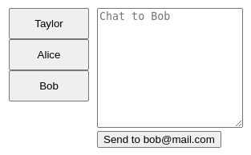

Попробуйте ввести что-нибудь в поле ввода, а затем нажмите "Алиса" или "Боб", чтобы выбрать другого адресата. Вы заметите, что состояние ввода сохраняется, потому что `<Chat>` отображается в той же позиции в дереве.

**В многих приложениях это может быть желаемым поведением, но не в приложении чата!** Вы же не хотите, чтобы пользователь отправил сообщение, которое он уже набрал, не тому человеку из-за случайного нажатия. Чтобы исправить это, добавьте `key`:

<!-- 0054.part.md -->

```js
<Chat key={to.id} contact={to} />
```

<!-- 0055.part.md -->

Это гарантирует, что при выборе другого получателя компонент `Chat` будет воссоздан с нуля, включая все состояния в дереве под ним. React также создаст элементы DOM заново, вместо того чтобы использовать их повторно.

Теперь переключение получателя всегда очищает текстовое поле:

=== "App.js"

    ```js
    import { useState } from 'react';
    import Chat from './Chat.js';
    import ContactList from './ContactList.js';

    export default function Messenger() {
    	const [to, setTo] = useState(contacts[0]);
    	return (
    		<div>
    			<ContactList
    				contacts={contacts}
    				selectedContact={to}
    				onSelect={(contact) => setTo(contact)}
    			/>
    			<Chat key={to.id} contact={to} />
    		</div>
    	);
    }

    const contacts = [
    	{ id: 0, name: 'Taylor', email: 'taylor@mail.com' },
    	{ id: 1, name: 'Alice', email: 'alice@mail.com' },
    	{ id: 2, name: 'Bob', email: 'bob@mail.com' },
    ];
    ```

=== "ContactList.js"

    ```js
    export default function ContactList({
    	selectedContact,
    	contacts,
    	onSelect,
    }) {
    	return (
    		<section className="contact-list">
    			<ul>
    				{contacts.map((contact) => (
    					<li key={contact.id}>
    						<button
    							onClick={() => {
    								onSelect(contact);
    							}}
    						>
    							{contact.name}
    						</button>
    					</li>
    				))}
    			</ul>
    		</section>
    	);
    }
    ```

=== "Chat.js"

    ```js
    import { useState } from 'react';

    export default function Chat({ contact }) {
    	const [text, setText] = useState('');
    	return (
    		<section className="chat">
    			<textarea
    				value={text}
    				placeholder={'Chat to ' + contact.name}
    				onChange={(e) => setText(e.target.value)}
    			/>
    			<br />
    			<button>Send to {contact.email}</button>
    		</section>
    	);
    }
    ```

=== "Результат"

    

!!!note "Сохранение состояния для удаленных компонентов"

    В реальном приложении для чата вы, вероятно, захотите восстановить состояние ввода, когда пользователь снова выберет предыдущего получателя. Есть несколько способов сохранить состояние "живым" для компонента, который больше не виден:

    -   Вы можете отобразить _все_ чаты, а не только текущий, но скрыть все остальные с помощью CSS. Чаты не будут удалены из дерева, поэтому их локальное состояние будет сохранено. Это решение отлично подходит для простых пользовательских интерфейсов. Но оно может стать очень медленным, если скрытые деревья большие и содержат много узлов DOM.
    -   Можно [поднять состояние вверх](sharing-state-between-components.md) и хранить ожидающее сообщение для каждого получателя в родительском компоненте. Таким образом, когда дочерние компоненты будут удалены, это не будет иметь значения, потому что важная информация будет храниться в родительском компоненте. Это наиболее распространенное решение.
    -   Вы также можете использовать другой источник в дополнение к React state. Например, вы, вероятно, хотите, чтобы черновик сообщения сохранялся, даже если пользователь случайно закроет страницу. Чтобы реализовать это, вы можете заставить компонент `Chat` инициализировать свое состояние, читая из [`localStorage`](https://developer.mozilla.org/docs/Web/API/Window/localStorage), и сохранять черновики там же.

    Независимо от того, какую стратегию вы выберете, чат _с Алисой_ концептуально отличается от чата _с Бобом_, поэтому имеет смысл дать `ключ` дереву `<Чат>`, основанный на текущем получателе.

!!!note "Итого"

    -   React сохраняет состояние до тех пор, пока один и тот же компонент отображается в одной и той же позиции.
    -   Состояние не хранится в JSX-тегах. Оно связано с позицией дерева, в которую вы поместили JSX.
    -   Вы можете заставить поддерево сбросить свое состояние, задав ему другой ключ.
    -   Не вставляйте определения компонентов, иначе вы случайно сбросите состояние.

## Задачи

### 1. Исправление исчезающего текста ввода

Этот пример показывает сообщение при нажатии на кнопку. Однако при нажатии кнопки также происходит случайный сброс ввода. Почему так происходит? Исправьте, чтобы нажатие кнопки не сбрасывало вводимый текст.

=== "App.js"

    <div markdown style="max-height: 400px; overflow-y: auto;">

    ```js
    import { useState } from 'react';

    export default function App() {
    	const [showHint, setShowHint] = useState(false);
    	if (showHint) {
    		return (
    			<div>
    				<p>
    					<i>Hint: Your favorite city?</i>
    				</p>
    				<Form />
    				<button
    					onClick={() => {
    						setShowHint(false);
    					}}
    				>
    					Hide hint
    				</button>
    			</div>
    		);
    	}
    	return (
    		<div>
    			<Form />
    			<button
    				onClick={() => {
    					setShowHint(true);
    				}}
    			>
    				Show hint
    			</button>
    		</div>
    	);
    }

    function Form() {
    	const [text, setText] = useState('');
    	return (
    		<textarea
    			value={text}
    			onChange={(e) => setText(e.target.value)}
    		/>
    	);
    }
    ```

    </div>

=== "Результат"

    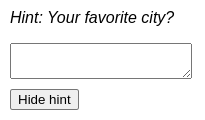

???success "Показать решение"

    Проблема в том, что `Form` отображается в разных позициях. В ветке `if` она является вторым дочерним элементом `div`, а в ветке `else` - первым. Поэтому тип компонента в каждой позиции меняется. Первая позиция меняется между `p` и `Form`, а вторая позиция меняется между `Form` и `button`. React сбрасывает состояние каждый раз, когда меняется тип компонента.

    Самое простое решение - объединить ветви, чтобы `Form` всегда отображалась в одной и той же позиции:

    === "App.js"

    	<div markdown style="max-height: 400px; overflow-y: auto;">

    	```js
    	import { useState } from 'react';

    	export default function App() {
    		const [showHint, setShowHint] = useState(false);
    		return (
    			<div>
    				{showHint && (
    					<p>
    						<i>Hint: Your favorite city?</i>
    					</p>
    				)}
    				<Form />
    				{showHint ? (
    					<button
    						onClick={() => {
    							setShowHint(false);
    						}}
    					>
    						Hide hint
    					</button>
    				) : (
    					<button
    						onClick={() => {
    							setShowHint(true);
    						}}
    					>
    						Show hint
    					</button>
    				)}
    			</div>
    		);
    	}

    	function Form() {
    		const [text, setText] = useState('');
    		return (
    			<textarea
    				value={text}
    				onChange={(e) => setText(e.target.value)}
    			/>
    		);
    	}
    	```

    	</div>

    === "Результат"

    	

    Технически, вы также можете добавить `null` перед `<Form />` в ветке `else`, чтобы соответствовать структуре ветки `if`:

    === "App.js"

    	<div markdown style="max-height: 400px; overflow-y: auto;">

    	```js
    	import { useState } from 'react';

    	export default function App() {
    		const [showHint, setShowHint] = useState(false);
    		if (showHint) {
    			return (
    				<div>
    					<p>
    						<i>Hint: Your favorite city?</i>
    					</p>
    					<Form />
    					<button
    						onClick={() => {
    							setShowHint(false);
    						}}
    					>
    						Hide hint
    					</button>
    				</div>
    			);
    		}
    		return (
    			<div>
    				{null}
    				<Form />
    				<button
    					onClick={() => {
    						setShowHint(true);
    					}}
    				>
    					Show hint
    				</button>
    			</div>
    		);
    	}

    	function Form() {
    		const [text, setText] = useState('');
    		return (
    			<textarea
    				value={text}
    				onChange={(e) => setText(e.target.value)}
    			/>
    		);
    	}
    	```

    	</div>

    === "Результат"

    	

    Таким образом, `Form` всегда является вторым дочерним элементом, поэтому он остается в той же позиции и сохраняет свое состояние. Но этот подход гораздо менее очевиден и создает риск того, что кто-то другой удалит этот `null`.

### 2. Поменять местами два поля формы

Эта форма позволяет вводить имя и фамилию. В ней также есть флажок, контролирующий, какое поле будет первым. Если установить флажок, поле "Фамилия" появится перед полем "Имя".

Это почти работает, но есть ошибка. Если вы заполните поле "Имя" и установите флажок, текст останется в первом поле (теперь это "Фамилия"). Исправьте это так, чтобы при изменении порядка ввода текст _также_ перемещался.

=== "App.js"

    <div markdown style="max-height: 400px; overflow-y: auto;">

    ```js
    import { useState } from 'react';

    export default function App() {
    	const [reverse, setReverse] = useState(false);
    	let checkbox = (
    		<label>
    			<input
    				type="checkbox"
    				checked={reverse}
    				onChange={(e) =>
    					setReverse(e.target.checked)
    				}
    			/>
    			Reverse order
    		</label>
    	);
    	if (reverse) {
    		return (
    			<>
    				<Field label="Last name" />
    				<Field label="First name" />
    				{checkbox}
    			</>
    		);
    	} else {
    		return (
    			<>
    				<Field label="First name" />
    				<Field label="Last name" />
    				{checkbox}
    			</>
    		);
    	}
    }

    function Field({ label }) {
    	const [text, setText] = useState('');
    	return (
    		<label>
    			{label}:{' '}
    			<input
    				type="text"
    				value={text}
    				placeholder={label}
    				onChange={(e) => setText(e.target.value)}
    			/>
    		</label>
    	);
    }
    ```

    </div>

=== "Результат"

    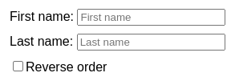

???tip "Показать подсказку"

    Похоже, что для этих полей недостаточно их положения внутри родительского поля. Есть ли какой-то способ указать React, как сопоставить состояние между повторными рендерами?

???success "Показать решение"

    Дайте `key` обоим компонентам `<Field>` в ветвях `if` и `else`. Это подскажет React, как "подобрать" правильное состояние для любого из `<Полей>`, даже если их порядок в родительском компоненте изменится:

    === "App.js"

    	<div markdown style="max-height: 400px; overflow-y: auto;">

    	```js
    	import { useState } from 'react';

    	export default function App() {
    		const [reverse, setReverse] = useState(false);
    		let checkbox = (
    			<label>
    				<input
    					type="checkbox"
    					checked={reverse}
    					onChange={(e) =>
    						setReverse(e.target.checked)
    					}
    				/>
    				Reverse order
    			</label>
    		);
    		if (reverse) {
    			return (
    				<>
    					<Field key="lastName" label="Last name" />
    					<Field key="firstName" label="First name" />
    					{checkbox}
    				</>
    			);
    		} else {
    			return (
    				<>
    					<Field key="firstName" label="First name" />
    					<Field key="lastName" label="Last name" />
    					{checkbox}
    				</>
    			);
    		}
    	}

    	function Field({ label }) {
    		const [text, setText] = useState('');
    		return (
    			<label>
    				{label}:{' '}
    				<input
    					type="text"
    					value={text}
    					placeholder={label}
    					onChange={(e) => setText(e.target.value)}
    				/>
    			</label>
    		);
    	}
    	```

    	</div>

    === "Результат"

    	

### 3. Сброс детальной формы

Это редактируемый список контактов. Вы можете редактировать данные выбранного контакта, а затем либо нажать "Сохранить", чтобы обновить его, либо "Сбросить", чтобы отменить изменения.

Когда вы выбираете другой контакт (например, Алису), состояние обновляется, но форма продолжает показывать данные предыдущего контакта. Исправьте это так, чтобы форма сбрасывалась при изменении выбранного контакта.

=== "App.js"

    <div markdown style="max-height: 400px; overflow-y: auto;">

    ```js
    import { useState } from 'react';
    import ContactList from './ContactList.js';
    import EditContact from './EditContact.js';

    export default function ContactManager() {
    	const [contacts, setContacts] = useState(
    		initialContacts
    	);
    	const [selectedId, setSelectedId] = useState(0);
    	const selectedContact = contacts.find(
    		(c) => c.id === selectedId
    	);

    	function handleSave(updatedData) {
    		const nextContacts = contacts.map((c) => {
    			if (c.id === updatedData.id) {
    				return updatedData;
    			} else {
    				return c;
    			}
    		});
    		setContacts(nextContacts);
    	}

    	return (
    		<div>
    			<ContactList
    				contacts={contacts}
    				selectedId={selectedId}
    				onSelect={(id) => setSelectedId(id)}
    			/>
    			<hr />
    			<EditContact
    				initialData={selectedContact}
    				onSave={handleSave}
    			/>
    		</div>
    	);
    }

    const initialContacts = [
    	{ id: 0, name: 'Taylor', email: 'taylor@mail.com' },
    	{ id: 1, name: 'Alice', email: 'alice@mail.com' },
    	{ id: 2, name: 'Bob', email: 'bob@mail.com' },
    ];
    ```

    </div>

=== "ContactList.js"

    ```js
    export default function ContactList({
    	contacts,
    	selectedId,
    	onSelect,
    }) {
    	return (
    		<section>
    			<ul>
    				{contacts.map((contact) => (
    					<li key={contact.id}>
    						<button
    							onClick={() => {
    								onSelect(contact.id);
    							}}
    						>
    							{contact.id === selectedId ? (
    								<b>{contact.name}</b>
    							) : (
    								contact.name
    							)}
    						</button>
    					</li>
    				))}
    			</ul>
    		</section>
    	);
    }
    ```

=== "EditContact.js"

    <div markdown style="max-height: 400px; overflow-y: auto;">

    ```js
    import { useState } from 'react';

    export default function EditContact({
    	initialData,
    	onSave,
    }) {
    	const [name, setName] = useState(initialData.name);
    	const [email, setEmail] = useState(initialData.email);
    	return (
    		<section>
    			<label>
    				Name:{' '}
    				<input
    					type="text"
    					value={name}
    					onChange={(e) =>
    						setName(e.target.value)
    					}
    				/>
    			</label>
    			<label>
    				Email:{' '}
    				<input
    					type="email"
    					value={email}
    					onChange={(e) =>
    						setEmail(e.target.value)
    					}
    				/>
    			</label>
    			<button
    				onClick={() => {
    					const updatedData = {
    						id: initialData.id,
    						name: name,
    						email: email,
    					};
    					onSave(updatedData);
    				}}
    			>
    				Save
    			</button>
    			<button
    				onClick={() => {
    					setName(initialData.name);
    					setEmail(initialData.email);
    				}}
    			>
    				Reset
    			</button>
    		</section>
    	);
    }
    ```

    </div>

=== "Результат"

    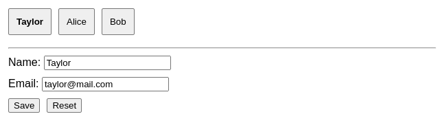

???success "Показать решение"

    Дайте `key={selectedId}` компоненту `EditContact`. Таким образом, при переключении между разными контактами форма будет перезагружаться:

    === "App.js"

    	<div markdown style="max-height: 400px; overflow-y: auto;">

    	```js
    	import { useState } from 'react';
    	import ContactList from './ContactList.js';
    	import EditContact from './EditContact.js';

    	export default function ContactManager() {
    		const [contacts, setContacts] = useState(
    			initialContacts
    		);
    		const [selectedId, setSelectedId] = useState(0);
    		const selectedContact = contacts.find(
    			(c) => c.id === selectedId
    		);

    		function handleSave(updatedData) {
    			const nextContacts = contacts.map((c) => {
    				if (c.id === updatedData.id) {
    					return updatedData;
    				} else {
    					return c;
    				}
    			});
    			setContacts(nextContacts);
    		}

    		return (
    			<div>
    				<ContactList
    					contacts={contacts}
    					selectedId={selectedId}
    					onSelect={(id) => setSelectedId(id)}
    				/>
    				<hr />
    				<EditContact
    					key={selectedId}
    					initialData={selectedContact}
    					onSave={handleSave}
    				/>
    			</div>
    		);
    	}

    	const initialContacts = [
    		{ id: 0, name: 'Taylor', email: 'taylor@mail.com' },
    		{ id: 1, name: 'Alice', email: 'alice@mail.com' },
    		{ id: 2, name: 'Bob', email: 'bob@mail.com' },
    	];
    	```

    	</div>

    === "ContactList.js"

    	```js
    	export default function ContactList({
    		contacts,
    		selectedId,
    		onSelect,
    	}) {
    		return (
    			<section>
    				<ul>
    					{contacts.map((contact) => (
    						<li key={contact.id}>
    							<button
    								onClick={() => {
    									onSelect(contact.id);
    								}}
    							>
    								{contact.id === selectedId ? (
    									<b>{contact.name}</b>
    								) : (
    									contact.name
    								)}
    							</button>
    						</li>
    					))}
    				</ul>
    			</section>
    		);
    	}
    	```

    === "EditContact.js"

    	<div markdown style="max-height: 400px; overflow-y: auto;">

    	```js
    	import { useState } from 'react';

    	export default function EditContact({
    		initialData,
    		onSave,
    	}) {
    		const [name, setName] = useState(initialData.name);
    		const [email, setEmail] = useState(initialData.email);
    		return (
    			<section>
    				<label>
    					Name:{' '}
    					<input
    						type="text"
    						value={name}
    						onChange={(e) =>
    							setName(e.target.value)
    						}
    					/>
    				</label>
    				<label>
    					Email:{' '}
    					<input
    						type="email"
    						value={email}
    						onChange={(e) =>
    							setEmail(e.target.value)
    						}
    					/>
    				</label>
    				<button
    					onClick={() => {
    						const updatedData = {
    							id: initialData.id,
    							name: name,
    							email: email,
    						};
    						onSave(updatedData);
    					}}
    				>
    					Save
    				</button>
    				<button
    					onClick={() => {
    						setName(initialData.name);
    						setEmail(initialData.email);
    					}}
    				>
    					Reset
    				</button>
    			</section>
    		);
    	}
    	```

    	</div>

    === "Результат"

    	

### 4. Очистить изображение во время его загрузки

Когда вы нажимаете кнопку "Далее", браузер начинает загрузку следующего изображения. Однако, поскольку оно отображается в том же теге `img`, по умолчанию вы будете видеть предыдущее изображение, пока не загрузится следующее. Это может быть нежелательно, если важно, чтобы текст всегда совпадал с изображением. Измените это так, чтобы при нажатии кнопки "Next" предыдущее изображение сразу же убиралось.

=== "App.js"

    <div markdown style="max-height: 400px; overflow-y: auto;">

    ```js
    import { useState } from 'react';

    export default function Gallery() {
    	const [index, setIndex] = useState(0);
    	const hasNext = index < images.length - 1;

    	function handleClick() {
    		if (hasNext) {
    			setIndex(index + 1);
    		} else {
    			setIndex(0);
    		}
    	}

    	let image = images[index];
    	return (
    		<>
    			<button onClick={handleClick}>Next</button>
    			<h3>
    				Image {index + 1} of {images.length}
    			</h3>
    			
    			<p>{image.place}</p>
    		</>
    	);
    }

    let images = [
    	{
    		place: 'Penang, Malaysia',
    		src: 'https://i.imgur.com/FJeJR8M.jpg',
    	},
    	{
    		place: 'Lisbon, Portugal',
    		src: 'https://i.imgur.com/dB2LRbj.jpg',
    	},
    	{
    		place: 'Bilbao, Spain',
    		src: 'https://i.imgur.com/z08o2TS.jpg',
    	},
    	{
    		place: 'Valparaíso, Chile',
    		src: 'https://i.imgur.com/Y3utgTi.jpg',
    	},
    	{
    		place: 'Schwyz, Switzerland',
    		src: 'https://i.imgur.com/JBbMpWY.jpg',
    	},
    	{
    		place: 'Prague, Czechia',
    		src: 'https://i.imgur.com/QwUKKmF.jpg',
    	},
    	{
    		place: 'Ljubljana, Slovenia',
    		src: 'https://i.imgur.com/3aIiwfm.jpg',
    	},
    ];
    ```

    </div>

=== "Результат"

    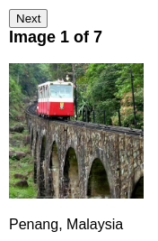

???tip "Показать подсказку"

    Есть ли способ указать React на повторное создание DOM вместо его повторного использования?

???success "Показать решение"

    Вы можете указать `key` для тега `img`. Когда этот `key` изменится, React заново создаст DOM-узел `img` с нуля. Это вызывает кратковременную вспышку при загрузке каждого изображения, поэтому это не то, что вы хотели бы делать для каждого изображения в вашем приложении. Но это имеет смысл, если вы хотите, чтобы изображение всегда соответствовало тексту.

    === "App.js"

    	<div markdown style="max-height: 400px; overflow-y: auto;">

    	```js
    	import { useState } from 'react';

    	export default function Gallery() {
    		const [index, setIndex] = useState(0);
    		const hasNext = index < images.length - 1;

    		function handleClick() {
    			if (hasNext) {
    				setIndex(index + 1);
    			} else {
    				setIndex(0);
    			}
    		}

    		let image = images[index];
    		return (
    			<>
    				<button onClick={handleClick}>Next</button>
    				<h3>
    					Image {index + 1} of {images.length}
    				</h3>
    				
    				<p>{image.place}</p>
    			</>
    		);
    	}

    	let images = [
    		{
    			place: 'Penang, Malaysia',
    			src: 'https://i.imgur.com/FJeJR8M.jpg',
    		},
    		{
    			place: 'Lisbon, Portugal',
    			src: 'https://i.imgur.com/dB2LRbj.jpg',
    		},
    		{
    			place: 'Bilbao, Spain',
    			src: 'https://i.imgur.com/z08o2TS.jpg',
    		},
    		{
    			place: 'Valparaíso, Chile',
    			src: 'https://i.imgur.com/Y3utgTi.jpg',
    		},
    		{
    			place: 'Schwyz, Switzerland',
    			src: 'https://i.imgur.com/JBbMpWY.jpg',
    		},
    		{
    			place: 'Prague, Czechia',
    			src: 'https://i.imgur.com/QwUKKmF.jpg',
    		},
    		{
    			place: 'Ljubljana, Slovenia',
    			src: 'https://i.imgur.com/3aIiwfm.jpg',
    		},
    	];
    	```

    	</div>

    === "Результат"

    	

### 5. Исправьте неуместное состояние в списке

В этом списке каждый `контакт` имеет состояние, которое определяет, была ли для него нажата галочка "Показать почту". Нажмите "Показать почту" для Алисы, а затем установите флажок "Показывать в обратном порядке". Вы заметите, что письмо _Тейлора_ теперь развернуто, а письмо Алисы, которое переместилось в самый низ, кажется свернутым.

Исправьте это так, чтобы развернутое состояние было связано с каждым контактом, независимо от выбранного порядка.

=== "App.js"

    ```js
    import { useState } from 'react';
    import Contact from './Contact.js';

    export default function ContactList() {
    	const [reverse, setReverse] = useState(false);

    	const displayedContacts = [...contacts];
    	if (reverse) {
    		displayedContacts.reverse();
    	}

    	return (
    		<>
    			<label>
    				<input
    					type="checkbox"
    					value={reverse}
    					onChange={(e) => {
    						setReverse(e.target.checked);
    					}}
    				/>{' '}
    				Show in reverse order
    			</label>
    			<ul>
    				{displayedContacts.map((contact, i) => (
    					<li key={i}>
    						<Contact contact={contact} />
    					</li>
    				))}
    			</ul>
    		</>
    	);
    }

    const contacts = [
    	{ id: 0, name: 'Alice', email: 'alice@mail.com' },
    	{ id: 1, name: 'Bob', email: 'bob@mail.com' },
    	{ id: 2, name: 'Taylor', email: 'taylor@mail.com' },
    ];
    ```

=== "Contact.js"

    ```js
    import { useState } from 'react';

    export default function Contact({ contact }) {
    	const [expanded, setExpanded] = useState(false);
    	return (
    		<>
    			<p>
    				<b>{contact.name}</b>
    			</p>
    			{expanded && (
    				<p>
    					<i>{contact.email}</i>
    				</p>
    			)}
    			<button
    				onClick={() => {
    					setExpanded(!expanded);
    				}}
    			>
    				{expanded ? 'Hide' : 'Show'} email
    			</button>
    		</>
    	);
    }
    ```

=== "Результат"

    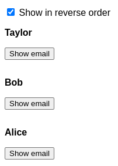

???success "Показать решение"

    Проблема в том, что в этом примере в качестве `key` использовался индекс:

    <!-- 0114.part.md -->

    ```js
    {displayedContacts.map((contact, i) =>
    <li key={i}>
    )}
    ```

    <!-- 0115.part.md -->

    Однако вы хотите, чтобы состояние было связано с _каждым конкретным контактом_.

    Использование идентификатора контакта в качестве `key` устраняет проблему:

    === "App.js"

    	```js
    	import { useState } from 'react';
    	import Contact from './Contact.js';

    	export default function ContactList() {
    		const [reverse, setReverse] = useState(false);

    		const displayedContacts = [...contacts];
    		if (reverse) {
    			displayedContacts.reverse();
    		}

    		return (
    			<>
    				<label>
    					<input
    						type="checkbox"
    						value={reverse}
    						onChange={(e) => {
    							setReverse(e.target.checked);
    						}}
    					/>{' '}
    					Show in reverse order
    				</label>
    				<ul>
    					{displayedContacts.map((contact) => (
    						<li key={contact.id}>
    							<Contact contact={contact} />
    						</li>
    					))}
    				</ul>
    			</>
    		);
    	}

    	const contacts = [
    		{ id: 0, name: 'Alice', email: 'alice@mail.com' },
    		{ id: 1, name: 'Bob', email: 'bob@mail.com' },
    		{ id: 2, name: 'Taylor', email: 'taylor@mail.com' },
    	];
    	```

    === "Contact.js"

    	```js
    	import { useState } from 'react';

    	export default function Contact({ contact }) {
    		const [expanded, setExpanded] = useState(false);
    		return (
    			<>
    				<p>
    					<b>{contact.name}</b>
    				</p>
    				{expanded && (
    					<p>
    						<i>{contact.email}</i>
    					</p>
    				)}
    				<button
    					onClick={() => {
    						setExpanded(!expanded);
    					}}
    				>
    					{expanded ? 'Hide' : 'Show'} email
    				</button>
    			</>
    		);
    	}
    	```

    === "Результат"

    	

    Состояние ассоциируется с позицией дерева. Ключ `key` позволяет указать именованную позицию вместо того, чтобы полагаться на порядок.

## Ссылки

-   [https://react.dev/learn/preserving-and-resetting-state](https://react.dev/learn/preserving-and-resetting-state)
