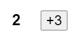
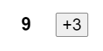
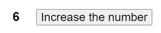
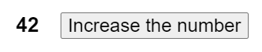
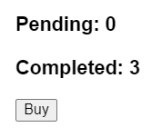
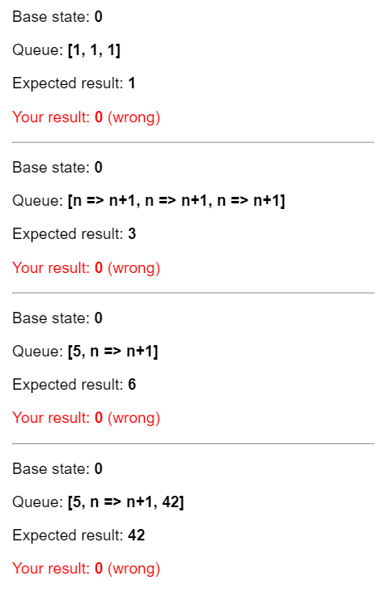
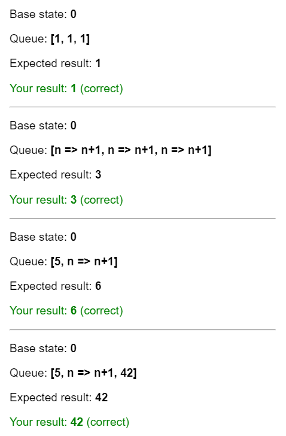

# Постановка в очередь серии обновлений состояния

Установка переменной состояния ставит в очередь очередной рендеринг. Но иногда вы можете захотеть выполнить несколько операций над значением перед постановкой в очередь следующего рендера. Для этого необходимо понять, как React выполняет пакетную обработку обновлений состояния.

!!!tip "Вы узнаете"

    -   Что такое "пакетная обработка" и как React использует ее для обработки нескольких обновлений состояния
    -   Как применить несколько обновлений к одной и той же переменной состояния подряд

## React собирает обновления состояния

Вы можете ожидать, что нажатие кнопки "+3" увеличит счетчик три раза, потому что он вызывает `setNumber(number + 1)` три раза:

<!-- 0001.part.md -->

=== "App.js"

    ```js
    import { useState } from 'react';

    export default function Counter() {
    	const [number, setNumber] = useState(0);

    	return (
    		<>
    			<h1>{number}</h1>
    			<button
    				onClick={() => {
    					setNumber(number + 1);
    					setNumber(number + 1);
    					setNumber(number + 1);
    				}}
    			>
    				+3
    			</button>
    		</>
    	);
    }
    ```

=== "Результат"

    

<!-- 0004.part.md -->

Однако, как вы помните из предыдущего раздела, [значения состояния каждого рендера фиксированы](state-as-a-snapshot.md#rendering-takes-a-snapshot-in-time), поэтому значение `number` в обработчике событий первого рендера всегда `0`, независимо от того, сколько раз вы вызовете `setNumber(1)`:

<!-- 0005.part.md -->

```js
setNumber(0 + 1);
setNumber(0 + 1);
setNumber(0 + 1);
```

<!-- 0006.part.md -->

Но здесь есть еще один фактор. **React ждет, пока не будет выполнен _весь_ код в обработчиках событий, прежде чем обрабатывать ваши обновления состояния.** Вот почему повторный рендеринг происходит только _после_ всех этих вызовов `setNumber()`.

Это может напомнить вам официанта, принимающего заказ в ресторане. Официант не бежит на кухню при упоминании вашего первого блюда! Вместо этого он дает вам закончить заказ, позволяет вносить в него изменения и даже принимает заказы от других людей за столом.

Это позволяет вам обновлять несколько переменных состояния - даже из нескольких компонентов - не вызывая слишком много [повторных рендеров](render-and-commit.md#re-renders-when-state-updates). Но это также означает, что пользовательский интерфейс не будет обновлен, пока _после_ вашего обработчика событий и любого кода в нем не завершится. Такое поведение, также известное как **батчинг,** заставляет ваше приложение React работать намного быстрее. Оно также позволяет избежать путаницы с "полузаконченными" рендерами, в которых обновлены только некоторые переменные.

**React не выполняет пакетную обработку _многочисленных_ намеренных событий, таких как клики** - каждый клик обрабатывается отдельно. Будьте уверены, что React выполняет пакетную обработку только тогда, когда это в целом безопасно. Это гарантирует, что, например, если первое нажатие кнопки отключит форму, второе нажатие не отправит ее снова.

## Обновление одного и того же состояния несколько раз до следующего рендера

Это редкий случай использования, но если вы хотите обновить одну и ту же переменную состояния несколько раз до следующего рендера, вместо передачи _значения следующего состояния_, как `setNumber(number + 1)`, вы можете передать _функцию_, которая вычисляет следующее состояние на основе предыдущего в очереди, как `setNumber(n => n + 1)`. Это способ сказать React "сделать что-то со значением состояния" вместо того, чтобы просто заменить его.

Попробуйте теперь увеличить счетчик:

=== "App.js"

    ```js
    import { useState } from 'react';

    export default function Counter() {
    	const [number, setNumber] = useState(0);

    	return (
    		<>
    			<h1>{number}</h1>
    			<button
    				onClick={() => {
    					setNumber((n) => n + 1);
    					setNumber((n) => n + 1);
    					setNumber((n) => n + 1);
    				}}
    			>
    				+3
    			</button>
    		</>
    	);
    }
    ```

=== "Результат"

    

<!-- 0010.part.md -->

Здесь `n => n + 1` называется **функцией апдейтера.** Когда вы передаете ее установщику состояния:

1.  React ставит эту функцию в очередь на обработку после выполнения всего остального кода в обработчике событий.
2.  Во время следующего рендеринга React просматривает очередь и выдает окончательное обновленное состояние.

<!-- конец списка -->

<!-- 0011.part.md -->

```js
setNumber((n) => n + 1);
setNumber((n) => n + 1);
setNumber((n) => n + 1);
```

<!-- 0012.part.md -->

Вот как React работает через эти строки кода при выполнении обработчика события:

1.  `setNumber(n => n + 1)`: `n => n + 1` - это функция. React добавляет ее в очередь.
2.  `setNumber(n => n + 1)`: `n => n + 1` - функция. React добавляет ее в очередь.
3.  `setNumber(n => n + 1)`: `n => n + 1` - функция. React добавляет ее в очередь.

Когда вы вызываете `useState` во время следующего рендеринга, React просматривает очередь. Предыдущее состояние `number` было `0`, поэтому именно его React передает первой функции обновления в качестве аргумента `n`. Затем React берет возвращаемое значение предыдущей функции обновления и передает его следующей функции обновления как `n`, и так далее:

| queued update | `n` | returns     |
| ------------- | --- | ----------- |
| `n => n + 1`  | `0` | `0 + 1 = 1` |
| `n => n + 1`  | `1` | `1 + 1 = 2` |
| `n => n + 1`  | `2` | `2 + 1 = 3` |

React сохраняет `3` как конечный результат и возвращает его из `useState`.

Вот почему нажатие на "+3" в примере выше правильно увеличивает значение на 3.

### Что произойдет, если вы обновите состояние после его замены

Как насчет этого обработчика событий? Как вы думаете, каким будет `number` в следующем рендере?

<!-- 0013.part.md -->

```js
<button onClick={() => {
  setNumber(number + 5);
  setNumber(n => n + 1);
}}>
```

=== "App.js"

    ```js
    import { useState } from 'react';

    export default function Counter() {
    	const [number, setNumber] = useState(0);

    	return (
    		<>
    			<h1>{number}</h1>
    			<button
    				onClick={() => {
    					setNumber(number + 5);
    					setNumber((n) => n + 1);
    				}}
    			>
    				Increase the number
    			</button>
    		</>
    	);
    }
    ```

=== "Результат"

    

<!-- 0018.part.md -->

Вот что этот обработчик событий говорит React сделать:

1.  `setNumber(number + 5)`: `number` - это `0`, поэтому `setNumber(0 + 5)`. React добавляет _"заменить на `5`"_ в свою очередь.
2.  `setNumber(n => n + 1)`: `n => n + 1` - это функция обновления. React добавляет _эту функцию_ в свою очередь.

Во время следующего рендеринга React просматривает очередь состояний:

| queued update      | `n`                  | returns     |
| ------------------ | -------------------- | ----------- |
| "replace with `5`" | `0` (неиспользуемый) | `5`         |
| `n => n + 1`       | `5`                  | `5 + 1 = 6` |

React сохраняет `6` как конечный результат и возвращает его из `useState`.

!!!note ""

    Вы могли заметить, что `setState(5)` на самом деле работает как `setState(n => 5)`, но `n` не используется!

### Что произойдет, если вы замените состояние после его обновления

Давайте попробуем еще один пример. Как вы думаете, каким будет `number` в следующем рендере?

<!-- 0019.part.md -->

```js
<button onClick={() => {
  setNumber(number + 5);
  setNumber(n => n + 1);
  setNumber(42);
}}>
```

=== "App.js"

    ```js
    import { useState } from 'react';

    export default function Counter() {
    	const [number, setNumber] = useState(0);

    	return (
    		<>
    			<h1>{number}</h1>
    			<button
    				onClick={() => {
    					setNumber(number + 5);
    					setNumber((n) => n + 1);
    					setNumber(42);
    				}}
    			>
    				Increase the number
    			</button>
    		</>
    	);
    }
    ```

=== "Результат"

    

<!-- 0024.part.md -->

Вот как React работает через эти строки кода при выполнении обработчика этого события:

1.  `setNumber(number + 5)`: `number` - это `0`, поэтому `setNumber(0 + 5)`. React добавляет _"заменить на `5`"_ в свою очередь.
2.  `setNumber(n => n + 1)`: `n => n + 1` - это функция обновления. React добавляет _эту функцию_ в свою очередь.
3.  `setNumber(42)`: React добавляет _"replace with `42`"_ в свою очередь.

Во время следующего рендеринга React просматривает очередь состояний:

| queued update      | `n`                   | returns     |
| ------------------ | --------------------- | ----------- |
| "replace with `5`" | `0` (неиспользуемый)  | `5`         |
| `n => n + 1`       | `5`                   | `5 + 1 = 6` |
| "заменить на `42`" | `6` (не используется) | `42`        |

Затем React сохраняет `42` как конечный результат и возвращает его из `useState`.

Подводя итог, вот как вы можете думать о том, что вы передаете сеттеру состояния `setNumber`:

-   **Функция обновления** (например, `n => n + 1`) добавляется в очередь.
-   **Любое другое значение** (например, число `5`) добавляет в очередь "заменить на `5`", игнорируя то, что уже поставлено в очередь.

После завершения обработчика события React запустит повторный рендеринг. Во время повторного рендеринга React будет обрабатывать очередь. Функции обновления выполняются во время рендеринга, поэтому **функции обновления должны быть [чистыми](keeping-components-pure.md)** и только _возвращать_ результат. Не пытайтесь устанавливать состояние внутри них или запускать другие побочные эффекты. В строгом режиме React будет запускать каждую функцию обновления дважды (но отбрасывать второй результат), чтобы помочь вам найти ошибки.

### Соглашения об именовании

Обычно принято называть аргумент функции обновления по первым буквам соответствующей переменной состояния:

<!-- 0025.part.md -->

```js
setEnabled((e) => !e);
setLastName((ln) => ln.reverse());
setFriendCount((fc) => fc * 2);
```

<!-- 0026.part.md -->

Если вы предпочитаете более многословный код, еще одним распространенным способом является повторение полного имени переменной состояния, например `setEnabled(enabled => !enabled)`, или использование префикса, например `setEnabled(prevEnabled => !prevEnabled)`.

!!!tip "Итоги"

    -   Установка состояния не изменяет переменную в существующем рендере, но запрашивает новый рендер.
    -   React обрабатывает обновления состояния после завершения работы обработчиков событий. Это называется пакетной обработкой.
    -   Чтобы обновить состояние несколько раз в одном событии, вы можете использовать функцию обновления `setNumber(n => n + 1)`.

## Задачи

### 1. Исправление счетчика запросов

Вы работаете над приложением для рынка предметов искусства, которое позволяет пользователю одновременно отправлять несколько заказов на предметы искусства. Каждый раз, когда пользователь нажимает кнопку "Купить", счетчик "Отложенные" должен увеличиваться на единицу. Через три секунды счетчик "Ожидающие" должен уменьшиться, а счетчик "Выполненные" - увеличиться.

Однако счетчик "Отложенные" ведет себя не так, как задумано. Когда вы нажимаете кнопку "Купить", он уменьшается до `-1` (что не должно быть возможно!). А если дважды нажать кнопку "Быстро", то оба счетчика ведут себя непредсказуемо.

Почему так происходит? Исправьте оба счетчика.

=== "App.js"

    ```js
    import { useState } from 'react';

    export default function RequestTracker() {
    	const [pending, setPending] = useState(0);
    	const [completed, setCompleted] = useState(0);

    	async function handleClick() {
    		setPending(pending + 1);
    		await delay(3000);
    		setPending(pending - 1);
    		setCompleted(completed + 1);
    	}

    	return (
    		<>
    			<h3>Pending: {pending}</h3>
    			<h3>Completed: {completed}</h3>
    			<button onClick={handleClick}>Buy</button>
    		</>
    	);
    }

    function delay(ms) {
    	return new Promise((resolve) => {
    		setTimeout(resolve, ms);
    	});
    }
    ```

=== "Результат"

    

???success "Показать решение"

    Внутри обработчика события `handleClick` значения `pending` и `completed` соответствуют тому, какими они были во время события click. Для первого рендера `pending` было `0`, поэтому `setPending(pending - 1)` становится `setPending(-1)`, что неправильно. Поскольку вы хотите _увеличить_ или _уменьшить_ счетчики, а не установить их в конкретное значение, определенное во время щелчка, вы можете вместо этого передать функции обновления:

    === "App.js"

    	```js
    	import { useState } from 'react';

    	export default function RequestTracker() {
    		const [pending, setPending] = useState(0);
    		const [completed, setCompleted] = useState(0);

    		async function handleClick() {
    			setPending((p) => p + 1);
    			await delay(3000);
    			setPending((p) => p - 1);
    			setCompleted((c) => c + 1);
    		}

    		return (
    			<>
    				<h3>Pending: {pending}</h3>
    				<h3>Completed: {completed}</h3>
    				<button onClick={handleClick}>Buy</button>
    			</>
    		);
    	}

    	function delay(ms) {
    		return new Promise((resolve) => {
    			setTimeout(resolve, ms);
    		});
    	}
    	```

    === "Результат"

    	

    <!-- 0030.part.md -->

    Это гарантирует, что когда вы увеличиваете или уменьшаете счетчик, вы делаете это относительно его _последнего_ состояния, а не того состояния, которое было во время щелчка.

### 2. Реализуйте очередь состояний самостоятельно

В этом задании вам предстоит реализовать крошечную часть React с нуля! Это не так сложно, как кажется.

Прокрутите предварительный просмотр песочницы. Обратите внимание, что в ней показаны **четыре тестовых случая.** Они соответствуют примерам, которые вы видели ранее на этой странице. Ваша задача — реализовать функцию `getFinalState` так, чтобы она возвращала правильный результат для каждого из этих случаев. Если вы реализуете функцию правильно, все четыре теста должны пройти.

Вы получите два аргумента: `baseState` — начальное состояние (например, `0`), и `queue` — массив, содержащий смесь чисел (например, `5`) и функций обновления (например, `n => n + 1`) в порядке их добавления.

Ваша задача — вернуть конечное состояние, точно так же, как таблицы на этой странице show!

<!-- 0031.part.md -->

=== "processQueue.js"

    ```js
    export function getFinalState(baseState, queue) {
    	let finalState = baseState;

    	// TODO: do something with the queue...

    	return finalState;
    }
    ```

=== "App.js"

    ```js
    import { getFinalState } from './processQueue.js';

    function increment(n) {
    	return n + 1;
    }
    increment.toString = () => 'n => n+1';

    export default function App() {
    	return (
    		<>
    			<TestCase
    				baseState={0}
    				queue={[1, 1, 1]}
    				expected={1}
    			/>
    			<hr />
    			<TestCase
    				baseState={0}
    				queue={[increment, increment, increment]}
    				expected={3}
    			/>
    			<hr />
    			<TestCase
    				baseState={0}
    				queue={[5, increment]}
    				expected={6}
    			/>
    			<hr />
    			<TestCase
    				baseState={0}
    				queue={[5, increment, 42]}
    				expected={42}
    			/>
    		</>
    	);
    }

    function TestCase({ baseState, queue, expected }) {
    	const actual = getFinalState(baseState, queue);
    	return (
    		<>
    			<p>
    				Base state: <b>{baseState}</b>
    			</p>
    			<p>
    				Queue: <b>[{queue.join(', ')}]</b>
    			</p>
    			<p>
    				Expected result: <b>{expected}</b>
    			</p>
    			<p
    				style={{
    					color:
    						actual === expected
    							? 'green'
    							: 'red',
    				}}
    			>
    				Your result: <b>{actual}</b> (
    				{actual === expected ? 'correct' : 'wrong'})
    			</p>
    		</>
    	);
    }
    ```

=== "Результат"

    

???tip "Показать подсказку"

    Если вы чувствуете, что застряли, начните с этой структуры кода:

    ```js
    export function getFinalState(baseState, queue) {
    	let finalState = baseState;

    	for (let update of queue) {
    		if (typeof update === 'function') {
    			// TODO: apply the updater function
    		} else {
    			// TODO: replace the state
    		}
    	}

    	return finalState;
    }
    ```

    Заполните недостающие строки!

???success "Показать решение"

    Это точный алгоритм, описанный на этой странице, который React использует для вычисления конечного состояния:

    === "processQueue.js"

    	```js
    	export function getFinalState(baseState, queue) {
    		let finalState = baseState;

    		for (let update of queue) {
    			if (typeof update === 'function') {
    				// Apply the updater function.
    				finalState = update(finalState);
    			} else {
    				// Replace the next state.
    				finalState = update;
    			}
    		}

    		return finalState;
    	}
    	```

    === "App.js"

    	```js
    	import { getFinalState } from './processQueue.js';

    	function increment(n) {
    		return n + 1;
    	}
    	increment.toString = () => 'n => n+1';

    	export default function App() {
    		return (
    			<>
    				<TestCase
    					baseState={0}
    					queue={[1, 1, 1]}
    					expected={1}
    				/>
    				<hr />
    				<TestCase
    					baseState={0}
    					queue={[increment, increment, increment]}
    					expected={3}
    				/>
    				<hr />
    				<TestCase
    					baseState={0}
    					queue={[5, increment]}
    					expected={6}
    				/>
    				<hr />
    				<TestCase
    					baseState={0}
    					queue={[5, increment, 42]}
    					expected={42}
    				/>
    			</>
    		);
    	}

    	function TestCase({ baseState, queue, expected }) {
    		const actual = getFinalState(baseState, queue);
    		return (
    			<>
    				<p>
    					Base state: <b>{baseState}</b>
    				</p>
    				<p>
    					Queue: <b>[{queue.join(', ')}]</b>
    				</p>
    				<p>
    					Expected result: <b>{expected}</b>
    				</p>
    				<p
    					style={{
    						color:
    							actual === expected
    								? 'green'
    								: 'red',
    					}}
    				>
    					Your result: <b>{actual}</b> (
    					{actual === expected ? 'correct' : 'wrong'})
    				</p>
    			</>
    		);
    	}
    	```

    === "Результат"

    	

    Теперь вы знаете, как работает эта часть React!

## Ссылки

-   [https://react.dev/learn/queueing-a-series-of-state-updates](https://react.dev/learn/queueing-a-series-of-state-updates)
