# Реагирование на ввод с помощью состояния

React предоставляет декларативный способ манипулирования пользовательским интерфейсом. Вместо того чтобы напрямую управлять отдельными частями пользовательского интерфейса, вы описываете различные состояния, в которых может находиться ваш компонент, и переключаетесь между ними в ответ на ввод пользователя. Это похоже на то, как дизайнеры думают о пользовательском интерфейсе.

!!!note "Вы узнаете"

    -   Чем декларативное программирование пользовательского интерфейса отличается от императивного программирования пользовательского интерфейса
    -   Как перечислить различные визуальные состояния, в которых может находиться ваш компонент
    -   Как вызвать изменения между различными визуальными состояниями из кода

## Как декларативный пользовательский интерфейс отличается от императивного

Когда вы проектируете взаимодействие пользовательского интерфейса, вы, вероятно, думаете о том, как пользовательский интерфейс _изменяется_ в ответ на действия пользователя. Рассмотрим форму, которая позволяет пользователю отправить ответ:

-   Когда вы вводите что-то в форму, кнопка "Отправить" _становится активной_.
-   Когда вы нажимаете кнопку "Отправить", и форма, и кнопка **отключаются,** и появляется волчок.
-   Если сетевой запрос прошел успешно, форма **спрячется,** и появится сообщение "Спасибо".
-   Если сетевой запрос не удался, появляется сообщение об ошибке, и форма снова становится открытой.

В **императивном программировании** вышесказанное прямо соответствует тому, как вы реализуете взаимодействие. Вы должны написать точные инструкции для манипулирования пользовательским интерфейсом в зависимости от того, что только что произошло. Вот еще один способ подумать об этом: представьте, что вы едете рядом с кем-то в машине и говорите ему пошагово, куда ехать.


Они не знают, куда вы хотите поехать, они просто следуют вашим командам. (И если вы ошибетесь в указаниях, вы окажетесь не в том месте!) Это называется _императивным_, потому что вы должны "командовать" каждым элементом, от спиннера до кнопки, указывая компьютеру _как_ обновить пользовательский интерфейс.

В этом примере императивного программирования пользовательского интерфейса форма построена _без_ React. Она использует только браузерный [DOM](https://developer.mozilla.org/ru/docs/Web/API/Document_Object_Model):

<!-- 0001.part.md -->

=== "index.js"

    <div markdown style="max-height: 400px; overflow-y: auto;">

    ```js
    async function handleFormSubmit(e) {
    	e.preventDefault();
    	disable(textarea);
    	disable(button);
    	show(loadingMessage);
    	hide(errorMessage);
    	try {
    		await submitForm(textarea.value);
    		show(successMessage);
    		hide(form);
    	} catch (err) {
    		show(errorMessage);
    		errorMessage.textContent = err.message;
    	} finally {
    		hide(loadingMessage);
    		enable(textarea);
    		enable(button);
    	}
    }

    function handleTextareaChange() {
    	if (textarea.value.length === 0) {
    		disable(button);
    	} else {
    		enable(button);
    	}
    }

    function hide(el) {
    	el.style.display = 'none';
    }

    function show(el) {
    	el.style.display = '';
    }

    function enable(el) {
    	el.disabled = false;
    }

    function disable(el) {
    	el.disabled = true;
    }

    function submitForm(answer) {
    	// Pretend it's hitting the network.
    	return new Promise((resolve, reject) => {
    		setTimeout(() => {
    			if (answer.toLowerCase() == 'istanbul') {
    				resolve();
    			} else {
    				reject(
    					new Error(
    						'Good guess but a wrong answer. Try again!'
    					)
    				);
    			}
    		}, 1500);
    	});
    }

    let form = document.getElementById('form');
    let textarea = document.getElementById('textarea');
    let button = document.getElementById('button');
    let loadingMessage = document.getElementById('loading');
    let errorMessage = document.getElementById('error');
    let successMessage = document.getElementById('success');
    form.onsubmit = handleFormSubmit;
    textarea.oninput = handleTextareaChange;
    ```

    </div>

=== "index.html"

    ```html
    <form id="form">
    	<h2>City quiz</h2>
    	<p>What city is located on two continents?</p>
    	<textarea id="textarea"></textarea>
    	<br />
    	<button id="button" disabled>Submit</button>
    	<p id="loading" style="display: none">Loading...</p>
    	<p id="error" style="display: none; color: red;"></p>
    </form>
    <h1 id="success" style="display: none">That's right!</h1>

    <style>
    	* {
    		box-sizing: border-box;
    	}
    	body {
    		font-family: sans-serif;
    		margin: 20px;
    		padding: 0;
    	}
    </style>
    ```

=== "Результат"

    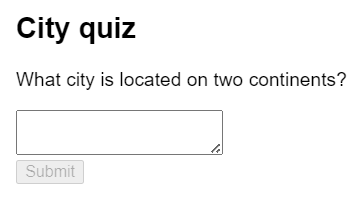

Манипулирование пользовательским интерфейсом в императивном порядке достаточно хорошо работает для отдельных примеров, но в более сложных системах управлять им становится экспоненциально сложнее. Представьте себе обновление страницы, полной различных форм, как эта. Добавление нового элемента пользовательского интерфейса или нового взаимодействия потребует тщательной проверки всего существующего кода, чтобы убедиться, что вы не внесли ошибку (например, забыли показать или скрыть что-то).

React был создан для решения этой проблемы.

В React вы не управляете пользовательским интерфейсом напрямую - то есть не включаете, не отключаете, не показываете и не скрываете компоненты. Вместо этого вы **заявляете, что вы хотите показать,** а React сам решает, как обновить пользовательский интерфейс. Подумайте о том, чтобы сесть в такси и сказать водителю, куда вы хотите поехать, вместо того, чтобы сказать ему, куда именно повернуть. Это работа водителя - доставить вас туда, и он может даже знать некоторые короткие пути, о которых вы не подумали!


## Размышления о декларативном интерфейсе

Вы уже видели выше, как реализовать форму императивно. Чтобы лучше понять, как мыслить в React, ниже вы пройдете через повторную реализацию этого пользовательского интерфейса в React:

1.  **Определите** различные визуальные состояния вашего компонента
2.  **Определите**, что вызывает изменение состояния.
3.  **Представьте** состояние в памяти с помощью `useState`.
4.  **Удалите** любые несущественные переменные состояния
5.  **Подключите** обработчики событий для установки состояния

### Шаг 1: Определите различные визуальные состояния вашего компонента

В компьютерных науках вы можете услышать о том, что ["машина состояний"](https://ru.wikipedia.org/wiki/%D0%9A%D0%BE%D0%BD%D0%B5%D1%87%D0%BD%D1%8B%D0%B9_%D0%B0%D0%B2%D1%82%D0%BE%D0%BC%D0%B0%D1%82) находится в одном из нескольких "состояний". Если вы работаете с дизайнером, вы могли видеть макеты для различных "визуальных состояний". React стоит на пересечении дизайна и информатики, поэтому обе эти идеи являются источниками вдохновения.

Во-первых, вам нужно представить все различные "состояния" пользовательского интерфейса, которые может увидеть пользователь:

-   **Пусто**: Форма имеет отключенную кнопку "Отправить".
-   **Типирование**: Форма имеет включенную кнопку "Отправить".
-   **Отправка**: Форма полностью отключена. Отображается спиннер.
-   **Успех**: Вместо формы отображается сообщение "Спасибо".
-   **Ошибка**: То же самое, что и состояние типирования, но с дополнительным сообщением об ошибке.

Как и дизайнеру, вам нужно "смоделировать" или создать "макеты" для различных состояний, прежде чем добавлять логику. Например, здесь показан макет только для визуальной части формы. Этот макет управляется параметром `status` со значением по умолчанию `'empty'`:

=== "App.js"

    ```js
    export default function Form({ status = 'empty' }) {
    	if (status === 'success') {
    		return <h1>That's right!</h1>;
    	}
    	return (
    		<>
    			<h2>City quiz</h2>
    			<p>
    				In which city is there a billboard that
    				turns air into drinkable water?
    			</p>
    			<form>
    				<textarea />
    				<br />
    				<button>Submit</button>
    			</form>
    		</>
    	);
    }
    ```

=== "Результат"

    

Вы можете назвать этот реквизит как угодно, именование не имеет значения. Попробуйте изменить `status = 'empty'` на `status = 'success'`, чтобы увидеть появление сообщения об успехе. Мокинг позволяет вам быстро проработать пользовательский интерфейс, прежде чем вы подключите какую-либо логику. Вот более подробный прототип того же компонента, все еще "управляемый" реквизитом `status`:

=== "App.js"

    <div markdown style="max-height: 400px; overflow-y: auto;">

    ```js
    export default function Form({
    	// Try 'submitting', 'error', 'success':
    	status = 'empty',
    }) {
    	if (status === 'success') {
    		return <h1>That's right!</h1>;
    	}
    	return (
    		<>
    			<h2>City quiz</h2>
    			<p>
    				In which city is there a billboard that
    				turns air into drinkable water?
    			</p>
    			<form>
    				<textarea
    					disabled={status === 'submitting'}
    				/>
    				<br />
    				<button
    					disabled={
    						status === 'empty' ||
    						status === 'submitting'
    					}
    				>
    					Submit
    				</button>
    				{status === 'error' && (
    					<p className="Error">
    						Good guess but a wrong answer. Try
    						again!
    					</p>
    				)}
    			</form>
    		</>
    	);
    }
    ```

    </div>

=== "Результат"

    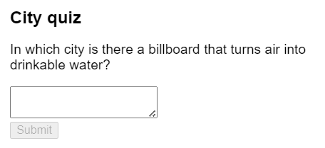

!!!note "Отображение множества визуальных состояний одновременно"

    Если компонент имеет много визуальных состояний, может быть удобно показать их все на одной странице:

    === "App.js"

    	```js
    	import Form from './Form.js';

    	let statuses = [
    		'empty',
    		'typing',
    		'submitting',
    		'success',
    		'error',
    	];

    	export default function App() {
    		return (
    			<>
    				{statuses.map((status) => (
    					<section key={status}>
    						<h4>Форма ({status}):</h4>
    						<Form status={status} />
    					</section>
    				))}
    			</>
    		);
    	}
    	```

    === "Form.js"

    	```js
    	export default function Form({ status }) {
    		if (status === 'success') {
    			return <h1>That's right!</h1>;
    		}
    		return (
    			<form>
    				<textarea disabled={status === 'submitting'} />
    				<br />
    				<button
    					disabled={
    						status === 'empty' ||
    						status === 'submitting'
    					}
    				>
    					Submit
    				</button>
    				{status === 'error' && (
    					<p className="Error">
    						Good guess but a wrong answer. Try
    						again!
    					</p>
    				)}
    			</form>
    		);
    	}
    	```

    === "Результат"

    	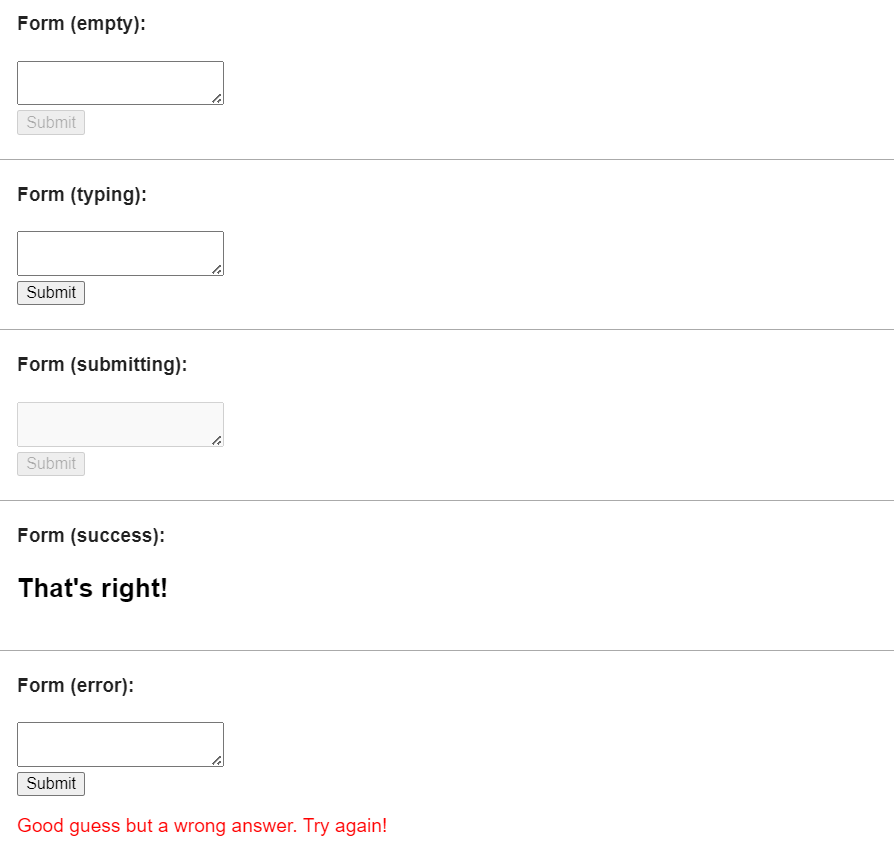

    Подобные страницы часто называют “живыми styleguides” или “storybooks”.

### Шаг 2: Определите, что вызывает эти изменения состояния

Вы можете инициировать обновление состояния в ответ на два вида входных данных:

-   **человеческие входы,** такие как нажатие кнопки, ввод текста в поле, переход по ссылке.
-   **Компьютерные данные,** такие как получение ответа от сети, завершение тайм-аута, загрузка изображения.

В обоих случаях **вы должны установить [переменные состояния](state-a-components-memory.md#anatomy-of-usestate) для обновления пользовательского интерфейса.** Для разрабатываемой вами формы вам нужно будет изменять состояние в ответ на несколько различных входов:

-   **Изменение текстового ввода** (человек) должно переводить его из состояния _Empty_ в состояние _Typing_ или обратно, в зависимости от того, пустое текстовое поле или нет.
-   **Нажатие кнопки "Отправить "** (человек) должно перевести его в состояние _Отправить_.
-   **Успешный ответ сети** (компьютер) должен перевести его в состояние _Успех_.
-   **Неуспешный сетевой ответ** (компьютер) должен перевести его в состояние _Ошибка_ с соответствующим сообщением об ошибке.

!!!note ""

    Обратите внимание, что человеческий ввод часто требует [обработчиков событий](responding-to-events.md)!

Чтобы помочь визуализировать этот поток, попробуйте нарисовать на бумаге каждое состояние в виде круга с меткой, а каждое изменение между двумя состояниями - в виде стрелки. Таким образом можно набросать множество потоков и отсеять ошибки задолго до внедрения.


_Состояние формы_

### Шаг 3: Представьте состояние в памяти с помощью `useState`

Далее вам нужно будет представить визуальные состояния вашего компонента в памяти с помощью [`useState`.](../reference/useState.md) Простота - это ключ: каждая часть состояния - это "движущаяся часть", и **вы хотите как можно меньше "движущихся частей".** Больше сложности приводит к большему количеству ошибок!

Начните с состояния, которое _абсолютно должно_ быть там. Например, вам нужно хранить `ответ` для ввода, и `ошибку` (если она существует) для хранения последней ошибки:

```js
const [answer, setAnswer] = useState('');
const [error, setError] = useState(null);
```

Затем вам понадобится переменная состояния, представляющая одно из визуальных состояний, которое вы хотите отобразить. Обычно существует более чем один способ представить это в памяти, поэтому вам придется поэкспериментировать с этим.

Если вам трудно сразу придумать лучший способ, начните с добавления достаточного количества состояний, чтобы вы были _определенно_ уверены, что все возможные визуальные состояния охвачены:

```js
const [isEmpty, setIsEmpty] = useState(true);
const [isTyping, setIsTyping] = useState(false);
const [isSubmitting, setIsSubmitting] = useState(false);
const [isSuccess, setIsSuccess] = useState(false);
const [isError, setIsError] = useState(false);
```

Ваша первая идея, скорее всего, не будет лучшей, но это нормально - рефакторинг состояния является частью процесса!

### Шаг 4: Удалите все несущественные переменные состояния

Вы хотите избежать дублирования в содержимом состояния, чтобы отслеживать только то, что необходимо. Потратив немного времени на рефакторинг структуры состояния, вы сделаете ваши компоненты более понятными, сократите дублирование и избежите непреднамеренных значений. Ваша цель - **предотвратить случаи, когда состояние в памяти не представляет никакого действительного пользовательского интерфейса, который вы хотели бы видеть у пользователя** (например, вы никогда не захотите показывать сообщение об ошибке и одновременно отключать ввод, иначе пользователь не сможет исправить ошибку!)

Вот несколько вопросов, которые можно задать переменным состояния:

-   **Приводит ли это состояние к парадоксу?** Например, `isTyping` и `isSubmitting` не могут быть одновременно `true`. Парадокс обычно означает, что состояние недостаточно ограничено. Существует четыре возможных комбинации двух булевых чисел, но только три соответствуют допустимым состояниям. Чтобы убрать "невозможное" состояние, вы можете объединить их в `status`, который должен быть одним из трех значений: `'typing'`, `'submitting'` или `'success'`.
-   **Есть ли та же информация в другой переменной состояния?** Еще один парадокс: `isEmpty` и `isTyping` не могут быть одновременно `true`. Делая их отдельными переменными состояния, вы рискуете рассинхронизировать их и вызвать ошибки. К счастью, вы можете убрать `isEmpty` и вместо этого проверять `answer.length === 0`.
-   **Можно ли получить ту же информацию из обратной переменной состояния?** `isError` не нужен, потому что вместо него можно проверить `error !== null`.

После этой чистки у вас осталось 3 (меньше 7!) _существенных_ переменных состояния:

```js
const [answer, setAnswer] = useState('');
const [error, setError] = useState(null);

// 'typing', 'submitting', or 'success'
const [status, setStatus] = useState('typing');
```

Вы знаете, что они важны, потому что вы не можете удалить ни одно из них без нарушения функциональности.

!!!note "Устранение невозможных состояний с помощью редуктора"

    Эти три переменные достаточно хорошо отображают состояние формы. Однако все еще есть некоторые промежуточные состояния, которые не имеют полного смысла. Например, ненулевая `error` не имеет смысла, когда `status` - `success`. Чтобы смоделировать состояние более точно, вы можете [извлечь его в редуктор](extracting-state-logic-into-a-reducer.md) Редукторы позволяют вам объединить несколько переменных состояния в один объект и консолидировать всю связанную логику!

### Шаг 5: Подключите обработчики событий для установки состояния

Наконец, создайте обработчики событий, которые будут обновлять состояние. Ниже показана окончательная форма с подключенными обработчиками событий:

=== "App.js"

    <div markdown style="max-height: 400px; overflow-y: auto;">

    ```js
    import { useState } from 'react';

    export default function Form() {
    	const [answer, setAnswer] = useState('');
    	const [error, setError] = useState(null);
    	const [status, setStatus] = useState('typing');

    	if (status === 'success') {
    		return <h1>Это правильно!</h1>;
    	}

    	async function handleSubmit(e) {
    		e.preventDefault();
    		setStatus('submitting');
    		try {
    			await submitForm(answer);
    			setStatus('success');
    		} catch (err) {
    			setStatus('ввод');
    			setError(err);
    		}
    	}

    	function handleTextareaChange(e) {
    		setAnswer(e.target.value);
    	}

    	return (
    		<>
    			<h2>Городская викторина</h2>
    			<p>
    				В каком городе есть рекламный щит, который
    				превращает воздух в питьевую воду?
    			</p>
    			<form onSubmit={handleSubmit}>
    				<textarea
    					value={ответ}
    					onChange={handleTextareaChange}
    					disabled={status === 'submitting'}
    				/>
    				<br />
    				<button
    					disabled={
    						answer.length === 0 ||
    						status === 'submitting'
    					}
    				>
    					Submit
    				</button>
    				{error !== null && (
    					<p className="Error">{error.message}</p>
    				)}
    			</form>
    		</>
    	);
    }

    function submitForm(answer) {
    	// Pretend it's hitting the network.
    	return new Promise((resolve, reject) => {
    		setTimeout(() => {
    			let shouldError =
    				answer.toLowerCase() !== 'lima';
    			if (shouldError) {
    				reject(
    					new Error(
    						'Good guess but a wrong answer. Try again!'
    					)
    				);
    			} else {
    				resolve();
    			}
    		}, 1500);
    	});
    }
    ```

    </div>

=== "Результат"

    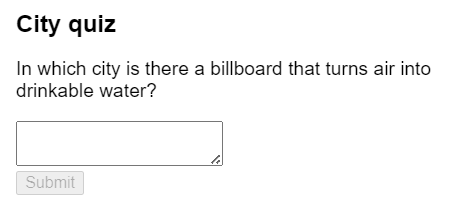

Хотя этот код длиннее, чем оригинальный императивный пример, он гораздо менее хрупок. Выражение всех взаимодействий в виде изменений состояния позволяет впоследствии вводить новые визуальные состояния без нарушения существующих. Это также позволяет изменять то, что должно отображаться в каждом состоянии, не меняя логику самого взаимодействия.

!!!note "Итого"

    -   Декларативное программирование означает описание пользовательского интерфейса для каждого визуального состояния, а не микроменеджмент пользовательского интерфейса (императивное программирование).
    -   При разработке компонента:
    	1.  Определите все его визуальные состояния.
    	2.  Определите человеческие и компьютерные триггеры для изменения состояния.
    	3.  Смоделируйте состояние с помощью `useState`.
    	4.  Удалите несущественные состояния, чтобы избежать ошибок и парадоксов.
    	5.  Подключите обработчики событий для установки состояния.

## Задачи

### 1. Добавление и удаление класса CSS

Сделайте так, чтобы щелчок на картинке _удалял_ CSS-класс `background--active` из внешнего `<div>`, но _добавлял_ класс `picture--active` к ``. Повторный щелчок по фону восстановит исходные CSS-классы.

Визуально вы должны увидеть, что щелчок на изображении удаляет фиолетовый фон и выделяет границу изображения. Щелчок за пределами изображения выделяет фон, но убирает выделение границы изображения.

=== "App.js"

    ```js
    export default function Picture() {
    	return (
    		<div className="background background--active">
    			
    		</div>
    	);
    }
    ```

=== "Результат"

    

???success "Показать решение"

    Этот компонент имеет два визуальных состояния: когда изображение активно и когда оно неактивно:

    -   Когда изображение активно, CSS-классами являются `background` и `picture picture--active`.
    -   Когда изображение неактивно, CSS-классами являются `background background--active` и `picture`.

    Одной булевой переменной состояния достаточно, чтобы помнить, активно ли изображение. Первоначальная задача заключалась в удалении или добавлении CSS-классов. Однако в React вам нужно _описывать_ то, что вы хотите видеть, а не _манипулировать_ элементами пользовательского интерфейса. Поэтому вам нужно вычислить оба класса CSS на основе текущего состояния. Также необходимо [остановить распространение](responding-to-events.md#stopping-propagation), чтобы щелчок на изображении не регистрировался как щелчок на фоне.

    Проверьте, что эта версия работает, щелкнув изображение, а затем за его пределами:

    === "App.js"

    	```js
    	import { useState } from 'react';

    	export default function Picture() {
    		const [isActive, setIsActive] = useState(false);

    		let backgroundClassName = 'background';
    		let pictureClassName = 'picture';
    		if (isActive) {
    			pictureClassName += ' picture--active';
    		} else {
    			backgroundClassName += ' background--active';
    		}

    		return (
    			<div
    				className={backgroundClassName}
    				onClick={() => setIsActive(false)}
    			>
    				 {
    						e.stopPropagation();
    						setIsActive(true);
    					}}
    					className={pictureClassName}
    					alt="Rainbow houses in Kampung Pelangi, Indonesia"
    					src="https://i.imgur.com/5qwVYb1.jpeg"
    				/>
    			</div>
    		);
    	}
    	```

    === "Результат"

    	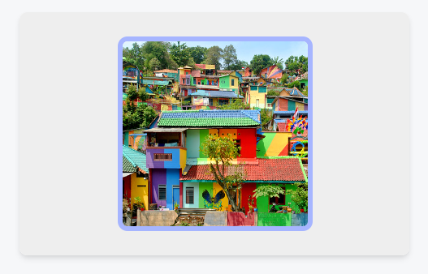

    В качестве альтернативы вы можете вернуть два отдельных куска JSX:

    === "App.js"

    	```js
    	import { useState } from 'react';

    	export default function Picture() {
    		const [isActive, setIsActive] = useState(false);
    		if (isActive) {
    			return (
    				<div
    					className="background"
    					onClick={() => setIsActive(false)}
    				>
    					 e.stopPropagation()}
    					/>
    				</div>
    			);
    		}
    		return (
    			<div className="background background--active">
    				 setIsActive(true)}
    				/>
    			</div>
    		);
    	}
    	```

    === "Результат"

    	

    Помните, что если два разных JSX-куска описывают одно и то же дерево, их вложенность (первый `<div>` → первый ``) должна совпадать. В противном случае переключение `isActive` приведет к воссозданию всего дерева внизу и [сбросу его состояния](preserving-and-resetting-state.md). Вот почему, если в обоих случаях возвращается одинаковое JSX-дерево, лучше писать их как один кусок JSX.

### 2. Редактор профиля

Вот небольшая форма, реализованная с помощью обычного JavaScript и DOM. Поиграйте с ней, чтобы понять ее поведение:

=== "index.js"

    <div markdown style="max-height: 400px; overflow-y: auto;">

    ```js
    function handleFormSubmit(e) {
    	e.preventDefault();
    	if (
    		editButton.textContent === 'Редактировать профиль'
    	) {
    		editButton.textContent = 'Сохранить профиль';
    		hide(firstNameText);
    		hide(lastNameText);
    		show(firstNameInput);
    		show(lastNameInput);
    	} else {
    		editButton.textContent = 'Редактировать профиль';
    		hide(firstNameInput);
    		hide(lastNameInput);
    		show(firstNameText);
    		show(lastNameText);
    	}
    }

    function handleFirstNameChange() {
    	firstNameText.textContent = firstNameInput.value;
    	helloText.textContent =
    		'Hello ' +
    		firstNameInput.value +
    		' ' +
    		lastNameInput.value +
    		'!';
    }

    function handleLastNameChange() {
    	lastNameText.textContent = lastNameInput.value;
    	helloText.textContent =
    		'Hello ' +
    		firstNameInput.value +
    		' ' +
    		lastNameInput.value +
    		'!';
    }

    function hide(el) {
    	el.style.display = 'none';
    }

    function show(el) {
    	el.style.display = '';
    }

    let form = document.getElementById('form');
    let editButton = document.getElementById('editButton');
    let firstNameInput = document.getElementById(
    	'firstNameInput'
    );
    let firstNameText = document.getElementById(
    	'firstNameText'
    );
    let lastNameInput = document.getElementById(
    	'lastNameInput'
    );
    let lastNameText = document.getElementById('lastNameText');
    let helloText = document.getElementById('helloText');
    form.onsubmit = handleFormSubmit;
    firstNameInput.oninput = handleFirstNameChange;
    lastNameInput.oninput = handleLastNameChange;
    ```

    </div>

=== "index.html"

    <div markdown style="max-height: 400px; overflow-y: auto;">

    ```html
    <form id="form">
    	<label>
    		First name:
    		<b id="firstNameText">Jane</b>
    		<input
    			id="firstNameInput"
    			value="Jane"
    			style="display: none"
    		/>
    	</label>
    	<label>
    		Last name:
    		<b id="lastNameText">Jacobs</b>
    		<input
    			id="lastNameInput"
    			value="Jacobs"
    			style="display: none"
    		/>
    	</label>
    	<button type="submit" id="editButton">
    		Edit Profile
    	</button>
    	<p><i id="helloText">Hello, Jane Jacobs!</i></p>
    </form>

    <style>
    	* {
    		box-sizing: border-box;
    	}
    	body {
    		font-family: sans-serif;
    		margin: 20px;
    		padding: 0;
    	}
    	label {
    		display: block;
    		margin-bottom: 20px;
    	}
    </style>
    ```

    </div>

=== "Результат"

    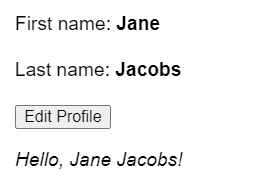

Эта форма переключается между двумя режимами: в режиме редактирования вы видите вводимые данные, а в режиме просмотра - только результат. Метка кнопки меняется между "Редактировать" и "Сохранить" в зависимости от того, в каком режиме вы находитесь. Когда вы изменяете вводимые данные, приветственное сообщение внизу обновляется в режиме реального времени.

Ваша задача - реализовать это на React в песочнице ниже. Для вашего удобства разметка уже была преобразована в JSX, но вам нужно будет сделать так, чтобы она показывала и скрывала входы, как это делает оригинал.

Убедитесь, что она также обновляет текст внизу!

<!-- 0045.part.md -->

=== "App.js"

    ```js
    export default function EditProfile() {
    	return (
    		<form>
    			<label>
    				First name: <b>Jane</b>
    				<input />
    			</label>
    			<label>
    				Last name: <b>Jacobs</b>
    				<input />
    			</label>
    			<button type="submit">Edit Profile</button>
    			<p>
    				<i>Hello, Jane Jacobs!</i>
    			</p>
    		</form>
    	);
    }
    ```

=== "Результат"

    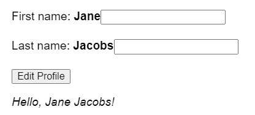

???success "Показать решение"

    Вам понадобятся две переменные состояния для хранения входных значений: `firstName` и `lastName`. Вам также понадобится переменная состояния `isEditing`, которая будет определять, отображать ли вводимые значения или нет. Вам _не_ понадобится переменная `fullName`, потому что полное имя всегда может быть вычислено из `firstName` и `lastName`.

    Наконец, вы должны использовать [условный рендеринг](conditional-rendering.md), чтобы показывать или скрывать входы в зависимости от `isEditing`.

    <!-- 0049.part.md -->

    === "App.js"

    	<div markdown style="max-height: 400px; overflow-y: auto;">

    	```js
    	import { useState } from 'react';

    	export default function EditProfile() {
    		const [isEditing, setIsEditing] = useState(false);
    		const [firstName, setFirstName] = useState('Jane');
    		const [lastName, setLastName] = useState('Jacobs');

    		return (
    			<form
    				onSubmit={(e) => {
    					e.preventDefault();
    					setIsEditing(!isEditing);
    				}}
    			>
    				<label>
    					First name:{' '}
    					{isEditing ? (
    						<input
    							value={firstName}
    							onChange={(e) => {
    								setFirstName(e.target.value);
    							}}
    						/>
    					) : (
    						<b>{firstName}</b>
    					)}
    				</label>
    				<label>
    					Last name:{' '}
    					{isEditing ? (
    						<input
    							value={lastName}
    							onChange={(e) => {
    								setLastName(e.target.value);
    							}}
    						/>
    					) : (
    						<b>{lastName}</b>
    					)}
    				</label>
    				<button type="submit">
    					{isEditing ? 'Save' : 'Edit'} Profile
    				</button>
    				<p>
    					<i>
    						Hello, {firstName} {lastName}!
    					</i>
    				</p>
    			</form>
    		);
    	}
    	```

    	</div>

    === "Результат"

    	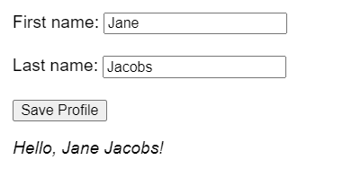

    Сравните это решение с исходным императивным кодом. Чем они отличаются?

### 3. Рефакторинг императивного решения без React

Вот исходная песочница из предыдущей задачи, написанная императивно без React:

<!-- 0053.part.md -->

=== "index.js"

    <div markdown style="max-height: 400px; overflow-y: auto;">

    ```js
    function handleFormSubmit(e) {
    	e.preventDefault();
    	if (editButton.textContent === 'Edit Profile') {
    		editButton.textContent = 'Save Profile';
    		hide(firstNameText);
    		hide(lastNameText);
    		show(firstNameInput);
    		show(lastNameInput);
    	} else {
    		editButton.textContent = 'Edit Profile';
    		hide(firstNameInput);
    		hide(lastNameInput);
    		show(firstNameText);
    		show(lastNameText);
    	}
    }

    function handleFirstNameChange() {
    	firstNameText.textContent = firstNameInput.value;
    	helloText.textContent =
    		'Hello ' +
    		firstNameInput.value +
    		' ' +
    		lastNameInput.value +
    		'!';
    }

    function handleLastNameChange() {
    	lastNameText.textContent = lastNameInput.value;
    	helloText.textContent =
    		'Hello ' +
    		firstNameInput.value +
    		' ' +
    		lastNameInput.value +
    		'!';
    }

    function hide(el) {
    	el.style.display = 'none';
    }

    function show(el) {
    	el.style.display = '';
    }

    let form = document.getElementById('form');
    let editButton = document.getElementById('editButton');
    let firstNameInput = document.getElementById(
    	'firstNameInput'
    );
    let firstNameText = document.getElementById(
    	'firstNameText'
    );
    let lastNameInput = document.getElementById(
    	'lastNameInput'
    );
    let lastNameText = document.getElementById('lastNameText');
    let helloText = document.getElementById('helloText');
    form.onsubmit = handleFormSubmit;
    firstNameInput.oninput = handleFirstNameChange;
    lastNameInput.oninput = handleLastNameChange;
    ```

    </div>

=== "index.html"

    <div markdown style="max-height: 400px; overflow-y: auto;">

    ```html
    <form id="form">
    	<label>
    		First name:
    		<b id="firstNameText">Jane</b>
    		<input
    			id="firstNameInput"
    			value="Jane"
    			style="display: none"
    		/>
    	</label>
    	<label>
    		Last name:
    		<b id="lastNameText">Jacobs</b>
    		<input
    			id="lastNameInput"
    			value="Jacobs"
    			style="display: none"
    		/>
    	</label>
    	<button type="submit" id="editButton">
    		Edit Profile
    	</button>
    	<p><i id="helloText">Hello, Jane Jacobs!</i></p>
    </form>

    <style>
    	* {
    		box-sizing: border-box;
    	}
    	body {
    		font-family: sans-serif;
    		margin: 20px;
    		padding: 0;
    	}
    	label {
    		display: block;
    		margin-bottom: 20px;
    	}
    </style>
    ```

    </div>

=== "Результат"

    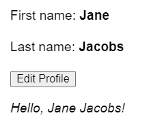

Представьте, что React не существует. Можете ли вы рефакторить этот код таким образом, чтобы сделать логику менее хрупкой и более похожей на версию React? Как бы это выглядело, если бы состояние было явным, как в React?

Если вам трудно сообразить, с чего начать, то в приведенной ниже заглушке уже есть большая часть структуры. Если вы начнете здесь, заполните недостающую логику в функции `updateDOM`. (При необходимости ссылайтесь на исходный код).

=== "index.js"

    <div markdown style="max-height: 400px; overflow-y: auto;">

    ```js
    let firstName = 'Jane';
    let LastName = 'Jacobs';
    let isEditing = false;

    function handleFormSubmit(e) {
    	e.preventDefault();
    	setIsEditing(!isEditing);
    }

    function handleFirstNameChange(e) {
    	setFirstName(e.target.value);
    }

    function handleLastNameChange(e) {
    	setLastName(e.target.value);
    }

    function setFirstName(value) {
    	firstName = value;
    	updateDOM();
    }

    function setLastName(value) {
    	lastName = value;
    	updateDOM();
    }

    function setIsEditing(value) {
    	isEditing = value;
    	updateDOM();
    }

    function updateDOM() {
    	if (isEditing) {
    		editButton.textContent = 'Сохранить профиль';
    		// TODO: показать входы, скрыть содержимое
    	} else {
    		editButton.textContent = 'Редактировать профиль';
    		// TODO: скрыть входы, показать содержимое
    	}
    	// TODO: обновить текстовые метки
    }

    function hide(el) {
    	el.style.display = 'none';
    }

    function show(el) {
    	el.style.display = '';
    }

    let form = document.getElementById('form');
    let editButton = document.getElementById('editButton');
    let firstNameInput = document.getElementById(
    	'firstNameInput'
    );
    let firstNameText = document.getElementById(
    	'firstNameText'
    );
    let lastNameInput = document.getElementById(
    	'lastNameInput'
    );
    let lastNameText = document.getElementById('lastNameText');
    let helloText = document.getElementById('helloText');
    form.onsubmit = handleFormSubmit;
    firstNameInput.oninput = handleFirstNameChange;
    lastNameInput.oninput = handleLastNameChange;
    ```

    </div>

=== "index.html"

    <div markdown style="max-height: 400px; overflow-y: auto;">

    ```html
    <form id="form">
    	<label>
    		First name:
    		<b id="firstNameText">Jane</b>
    		<input
    			id="firstNameInput"
    			value="Jane"
    			style="display: none"
    		/>
    	</label>
    	<label>
    		Last name:
    		<b id="lastNameText">Jacobs</b>
    		<input
    			id="lastNameInput"
    			value="Jacobs"
    			style="display: none"
    		/>
    	</label>
    	<button type="submit" id="editButton">
    		Edit Profile
    	</button>
    	<p><i id="helloText">Hello, Jane Jacobs!</i></p>
    </form>

    <style>
    	* {
    		box-sizing: border-box;
    	}
    	body {
    		font-family: sans-serif;
    		margin: 20px;
    		padding: 0;
    	}
    	label {
    		display: block;
    		margin-bottom: 20px;
    	}
    </style>
    ```

    </div>

=== "Результат"

    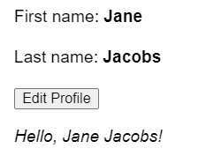

???success "Показать решение"

    Отсутствующая логика включала переключение отображения входов и содержимого, а также обновление меток:

    <!-- 0063.part.md -->

    === "index.js"

    	<div markdown style="max-height: 400px; overflow-y: auto;">

    	```js
    	let firstName = 'Jane';
    	let lastName = 'Jacobs';
    	let isEditing = false;

    	function handleFormSubmit(e) {
    		e.preventDefault();
    		setIsEditing(!isEditing);
    	}

    	function handleFirstNameChange(e) {
    		setFirstName(e.target.value);
    	}

    	function handleLastNameChange(e) {
    		setLastName(e.target.value);
    	}

    	function setFirstName(value) {
    		firstName = value;
    		updateDOM();
    	}

    	function setLastName(value) {
    		lastName = value;
    		updateDOM();
    	}

    	function setIsEditing(value) {
    		isEditing = value;
    		updateDOM();
    	}

    	function updateDOM() {
    		if (isEditing) {
    			editButton.textContent = 'Save Profile';
    			hide(firstNameText);
    			hide(lastNameText);
    			show(firstNameInput);
    			show(lastNameInput);
    		} else {
    			editButton.textContent = 'Edit Profile';
    			hide(firstNameInput);
    			hide(lastNameInput);
    			show(firstNameText);
    			show(lastNameText);
    		}
    		firstNameText.textContent = firstName;
    		lastNameText.textContent = lastName;
    		helloText.textContent =
    			'Hello ' + firstName + ' ' + lastName + '!';
    	}

    	function hide(el) {
    		el.style.display = 'none';
    	}

    	function show(el) {
    		el.style.display = '';
    	}

    	let form = document.getElementById('form');
    	let editButton = document.getElementById('editButton');
    	let firstNameInput = document.getElementById(
    		'firstNameInput'
    	);
    	let firstNameText = document.getElementById(
    		'firstNameText'
    	);
    	let lastNameInput = document.getElementById(
    		'lastNameInput'
    	);
    	let lastNameText = document.getElementById('lastNameText');
    	let helloText = document.getElementById('helloText');
    	form.onsubmit = handleFormSubmit;
    	firstNameInput.oninput = handleFirstNameChange;
    	lastNameInput.oninput = handleLastNameChange;
    	```

    	</div>

    === "index.html"

    	<div markdown style="max-height: 400px; overflow-y: auto;">

    	```html
    	<form id="form">
    		<label>
    			First name:
    			<b id="firstNameText">Jane</b>
    			<input
    				id="firstNameInput"
    				value="Jane"
    				style="display: none"
    			/>
    		</label>
    		<label>
    			Last name:
    			<b id="lastNameText">Jacobs</b>
    			<input
    				id="lastNameInput"
    				value="Jacobs"
    				style="display: none"
    			/>
    		</label>
    		<button type="submit" id="editButton">
    			Edit Profile
    		</button>
    		<p><i id="helloText">Hello, Jane Jacobs!</i></p>
    	</form>

    	<style>
    		* {
    			box-sizing: border-box;
    		}
    		body {
    			font-family: sans-serif;
    			margin: 20px;
    			padding: 0;
    		}
    		label {
    			display: block;
    			margin-bottom: 20px;
    		}
    	</style>
    	```

    	</div>

    === "Результат"

    	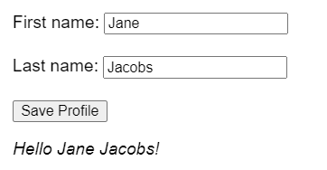

    Функция `updateDOM`, которую вы написали, показывает, что React делает под капотом, когда вы устанавливаете состояние. (Однако React также избегает обращения к DOM для свойств, которые не изменились с момента их последней установки).

## Ссылки

-   [https://react.dev/learn/reacting-to-input-with-state](https://react.dev/learn/reacting-to-input-with-state)
