# Удаление зависимостей эффектов

Когда вы пишете Эффект, линтер проверяет, включили ли вы все реактивные значения (такие как props и state), которые Эффект считывает, в список зависимостей вашего Эффекта. Это гарантирует, что ваш Эффект будет синхронизирован с последними пропсами и состоянием вашего компонента. Ненужные зависимости могут привести к тому, что ваш Эффект будет запускаться слишком часто или даже создаст бесконечный цикл. Следуйте этому руководству, чтобы просмотреть и удалить ненужные зависимости из ваших Эффектов.

!!!tip "Вы узнаете"

    -   Как исправить бесконечные циклы зависимостей Эффектов
    -   Что делать, если вы хотите удалить зависимость
    -   Как считать значение из вашего Эффекта, не "реагируя" на него
    -   Как и почему следует избегать зависимостей от объектов и функций
    -   Почему подавление линтера зависимостей опасно, и что делать вместо этого.

## Зависимости должны соответствовать коду

Когда вы пишете эффект, вы сначала указываете, как [запускать и останавливать](lifecycle-of-reactive-effects.md) то, что вы хотите, чтобы делал ваш эффект:

<!-- 0001.part.md -->

```js
const serverUrl = 'https://localhost:1234';

function ChatRoom({ roomId }) {
    useEffect(() => {
        const connection = createConnection(
            serverUrl,
            roomId
        );
        connection.connect();
        return () => connection.disconnect();
        // ...
    });
}
```

<!-- 0002.part.md -->

Затем, если вы оставите Effect dependencies пустым (`[]`), линтер предложит правильные зависимости:

=== "App.js"

    ```js
    import { useState, useEffect } from 'react';
    import { createConnection } from './chat.js';

    const serverUrl = 'https://localhost:1234';

    function ChatRoom({ roomId }) {
    	useEffect(() => {
    		const connection = createConnection(
    			serverUrl,
    			roomId
    		);
    		connection.connect();
    		return () => connection.disconnect();
    	}, []); // <-- Fix the mistake here!
    	return <h1>Welcome to the {roomId} room!</h1>;
    }

    export default function App() {
    	const [roomId, setRoomId] = useState('general');
    	return (
    		<>
    			<label>
    				Choose the chat room:{' '}
    				<select
    					value={roomId}
    					onChange={(e) =>
    						setRoomId(e.target.value)
    					}
    				>
    					<option value="general">general</option>
    					<option value="travel">travel</option>
    					<option value="music">music</option>
    				</select>
    			</label>
    			<hr />
    			<ChatRoom roomId={roomId} />
    		</>
    	);
    }
    ```

=== "chat.js"

    ```js
    export function createConnection(serverUrl, roomId) {
    	// A real implementation would actually connect to the server
    	return {
    		connect() {
    			console.log(
    				'✅ Connecting to "' +
    					roomId +
    					'" room at ' +
    					serverUrl +
    					'...'
    			);
    		},
    		disconnect() {
    			console.log(
    				'❌ Disconnected from "' +
    					roomId +
    					'" room at ' +
    					serverUrl
    			);
    		},
    	};
    }
    ```

=== "Результат"

    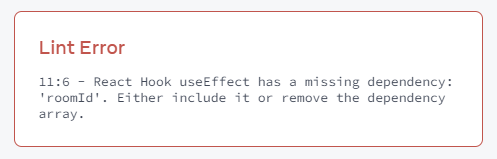

Заполните их в соответствии с указаниями на вкладыше:

<!-- 0009.part.md -->

```js
function ChatRoom({ roomId }) {
    useEffect(() => {
        const connection = createConnection(
            serverUrl,
            roomId
        );
        connection.connect();
        return () => connection.disconnect();
    }, [roomId]); // ✅ All dependencies declared
    // ...
}
```

<!-- 0010.part.md -->

[Эффекты "реагируют" на реактивные значения.](lifecycle-of-reactive-effects.md) Поскольку `roomId` является реактивным значением (оно может измениться в результате повторного рендеринга), линтер проверяет, указали ли вы его в качестве зависимости. Если `roomId` получит другое значение, React пересинхронизирует ваш Effect. Это гарантирует, что чат остается подключенным к выбранной комнате и "реагирует" на выпадающий список:

=== "App.js"

    ```js
    import { useState, useEffect } from 'react';
    import { createConnection } from './chat.js';

    const serverUrl = 'https://localhost:1234';

    function ChatRoom({ roomId }) {
    	useEffect(() => {
    		const connection = createConnection(
    			serverUrl,
    			roomId
    		);
    		connection.connect();
    		return () => connection.disconnect();
    	}, [roomId]);
    	return <h1>Welcome to the {roomId} room!</h1>;
    }

    export default function App() {
    	const [roomId, setRoomId] = useState('general');
    	return (
    		<>
    			<label>
    				Choose the chat room:{' '}
    				<select
    					value={roomId}
    					onChange={(e) =>
    						setRoomId(e.target.value)
    					}
    				>
    					<option value="general">general</option>
    					<option value="travel">travel</option>
    					<option value="music">music</option>
    				</select>
    			</label>
    			<hr />
    			<ChatRoom roomId={roomId} />
    		</>
    	);
    }
    ```

=== "chat.js"

    ```js
    export function createConnection(serverUrl, roomId) {
    	// A real implementation would actually connect to the server
    	return {
    		connect() {
    			console.log(
    				'✅ Connecting to "' +
    					roomId +
    					'" room at ' +
    					serverUrl +
    					'...'
    			);
    		},
    		disconnect() {
    			console.log(
    				'❌ Disconnected from "' +
    					roomId +
    					'" room at ' +
    					serverUrl
    			);
    		},
    	};
    }
    ```

=== "Результат"

    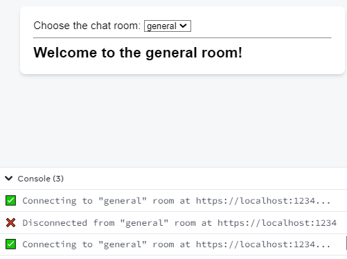

### Чтобы удалить зависимость, докажите, что она не является зависимостью

Обратите внимание, что вы не можете "выбрать" зависимости вашего Эффекта. Каждое реактивное значение, используемое кодом вашего Эффекта, должно быть объявлено в списке зависимостей. Список зависимостей определяется окружающим кодом:

<!-- 0017.part.md -->

```js
const serverUrl = 'https://localhost:1234';

function ChatRoom({ roomId }) {
    // This is a reactive value
    useEffect(() => {
        const connection = createConnection(
            serverUrl,
            roomId
        ); // This Effect reads that reactive value
        connection.connect();
        return () => connection.disconnect();
    }, [roomId]); // ✅ So you must specify that reactive value as
    // a dependency of your Effect
    // ...
}
```

<!-- 0018.part.md -->

[Reactive values](lifecycle-of-reactive-effects.md) включают props и все переменные и функции, объявленные непосредственно внутри вашего компонента. Поскольку `roomId` является реактивным значением, вы не можете удалить его из списка зависимостей. Линтер не позволит этого сделать:

<!-- 0019.part.md -->

```js
const serverUrl = 'https://localhost:1234';

function ChatRoom({ roomId }) {
    useEffect(() => {
        const connection = createConnection(
            serverUrl,
            roomId
        );
        connection.connect();
        return () => connection.disconnect();
    }, []); // 🔴 React Hook useEffect has a missing dependency: 'roomId'
    // ...
}
```

<!-- 0020.part.md -->

И линтер будет прав! Поскольку `roomId` может меняться со временем, это внесет ошибку в ваш код.

**Чтобы удалить зависимость, "докажите" линтеру, что она _не должна_ быть зависимостью.** Например, вы можете убрать `roomId` из вашего компонента, чтобы доказать, что он не реактивный и не будет меняться при повторных рендерингах:

<!-- 0021.part.md -->

```js
const serverUrl = 'https://localhost:1234';
const roomId = 'music'; // Not a reactive value anymore

function ChatRoom() {
    useEffect(() => {
        const connection = createConnection(
            serverUrl,
            roomId
        );
        connection.connect();
        return () => connection.disconnect();
    }, []); // ✅ All dependencies declared
    // ...
}
```

<!-- 0022.part.md -->

Теперь, когда `roomId` не является реактивным значением (и не может измениться при повторном рендере), ему не нужно быть зависимостью:

=== "App.js"

    ```js
    import { useState, useEffect } from 'react';
    import { createConnection } from './chat.js';

    const serverUrl = 'https://localhost:1234';
    const roomId = 'music';

    export default function ChatRoom() {
    	useEffect(() => {
    		const connection = createConnection(
    			serverUrl,
    			roomId
    		);
    		connection.connect();
    		return () => connection.disconnect();
    	}, []);
    	return <h1>Welcome to the {roomId} room!</h1>;
    }
    ```

=== "chat.js"

    ```js
    export function createConnection(serverUrl, roomId) {
    	// A real implementation would actually connect to the server
    	return {
    		connect() {
    			console.log(
    				'✅ Connecting to "' +
    					roomId +
    					'" room at ' +
    					serverUrl +
    					'...'
    			);
    		},
    		disconnect() {
    			console.log(
    				'❌ Disconnected from "' +
    					roomId +
    					'" room at ' +
    					serverUrl
    			);
    		},
    	};
    }
    ```

=== "Результат"

    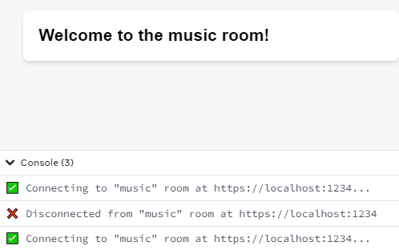

Вот почему теперь вы можете указать [пустой (`[]`) список зависимостей](lifecycle-of-reactive-effects.md) Ваш эффект _действительно_ больше не зависит ни от какого реактивного значения, поэтому ему _действительно_ не нужно перезапускаться при изменении пропсов или состояния компонента.

### Чтобы изменить зависимости, измените код

Возможно, вы заметили закономерность в своем рабочем процессе:

1.  Сначала вы **изменяете код** вашего Эффекта или то, как объявлены ваши реактивные значения.
2.  Затем, следуя за линтером, вы настраиваете зависимости, чтобы **соответствовать измененному коду**.
3.  Если список зависимостей вас не устраивает, вы **возвращаетесь к первому шагу** (и снова изменяете код).

Последняя часть очень важна. **Если вы хотите изменить зависимости, сначала измените окружающий код.** Вы можете думать о списке зависимостей как о [списке всех реактивных значений, используемых кодом вашего Эффекта](lifecycle-of-reactive-effects.md) Вы не _выбираете_, что включить в этот список. Список _описывает_ ваш код. Чтобы изменить список зависимостей, измените код.

Это может показаться похожим на решение уравнения. Вы можете начать с цели (например, удалить зависимость), и вам нужно "найти" код, соответствующий этой цели. Не все находят решение уравнений забавным, и то же самое можно сказать о написании Effects! К счастью, существует список общих рецептов, которые вы можете попробовать ниже.

!!!warning "Внимание"

    Если у вас есть существующая кодовая база, возможно, у вас есть Effects, которые подавляют линтер, например, так:

    ```js
    useEffect(() => {
    	// ...
    	// 🔴 Avoid suppressing the linter like this:
    	// eslint-ignore-next-line react-hooks/exhaustive-deps
    }, []);
    ```

    **Когда зависимости не соответствуют коду, очень высок риск появления ошибок.** Подавляя линтер, вы "лжете" React о значениях, от которых зависит ваш Effect.

    Вместо этого используйте приемы, описанные ниже.

!!!note "Почему подавление линтера зависимостей так опасно?"

    Подавление линтера приводит к очень неинтуитивным ошибкам, которые трудно найти и исправить. Вот один из примеров:

    === "App.js"

    	```js
    	import { useState, useEffect } from 'react';

    	export default function Timer() {
    		const [count, setCount] = useState(0);
    		const [increment, setIncrement] = useState(1);

    		function onTick() {
    			setCount(count + increment);
    		}

    		useEffect(() => {
    			const id = setInterval(onTick, 1000);
    			return () => clearInterval(id);
    			// eslint-disable-next-line react-hooks/exhaustive-deps
    		}, []);

    		return (
    			<>
    				<h1>
    					Counter: {count}
    					<button onClick={() => setCount(0)}>
    						Reset
    					</button>
    				</h1>
    				<hr />
    				<p>
    					Every second, increment by:
    					<button
    						disabled={increment === 0}
    						onClick={() => {
    							setIncrement((i) => i - 1);
    						}}
    					>
    						–
    					</button>
    					<b>{increment}</b>
    					<button
    						onClick={() => {
    							setIncrement((i) => i + 1);
    						}}
    					>
    						+
    					</button>
    				</p>
    			</>
    		);
    	}
    	```

    === "Результат"

    	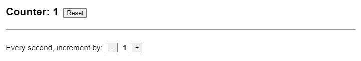

    Допустим, вы хотите запустить эффект "только при монтировании". Вы прочитали, что [пустые (`[]`) зависимости](lifecycle-of-reactive-effects.md) делают это, поэтому вы решили проигнорировать линтер и принудительно указали `[]` в качестве зависимостей.

    Этот счетчик должен был увеличиваться каждую секунду на величину, настраиваемую с помощью двух кнопок. Однако, поскольку вы "соврали" React, что этот Effect ни от чего не зависит, React вечно продолжает использовать функцию `onTick` из начального рендера. [Во время этого рендера](state-as-a-snapshot.md) `count` был `0` и `increment` был `1`. Вот почему `onTick` из этого рендера всегда вызывает `setCount(0 + 1)` каждую секунду, и вы всегда видите `1`. Подобные ошибки труднее исправить, когда они распространяются на несколько компонентов.

    Всегда есть лучшее решение, чем игнорирование linter! Чтобы исправить этот код, вам нужно добавить `onTick` в список зависимостей. (Чтобы гарантировать, что интервал устанавливается только один раз, [сделайте `onTick` событием эффекта.](separating-events-from-effects.md))

    **Мы рекомендуем рассматривать ошибку dependency lint как ошибку компиляции. Если вы не подавите ее, вы никогда не увидите ошибок, подобных этой.** Остальная часть этой страницы документирует альтернативы для этого и других случаев.

## Удаление ненужных зависимостей

Каждый раз, когда вы изменяете зависимости Эффекта, чтобы отразить код, посмотрите на список зависимостей. Имеет ли смысл повторно запускать Эффект при изменении любой из этих зависимостей? Иногда ответ будет "нет":

-   Вы можете захотеть повторно выполнить _различные части_ вашего Эффекта при различных условиях.
-   Вы можете захотеть прочитать только _последнее значение_ какой-то зависимости вместо того, чтобы "реагировать" на ее изменения.
-   Зависимость может меняться слишком часто _непреднамеренно_, потому что это объект или функция.

Чтобы найти правильное решение, вам нужно ответить на несколько вопросов о вашем Effect. Давайте пройдемся по ним.

### Должен ли этот код переместиться в обработчик событий?

Первое, о чем вы должны подумать, это о том, должен ли этот код вообще быть Эффектом.

Представьте себе форму. При отправке вы устанавливаете переменную состояния `submitted` в значение `true`. Вам нужно отправить POST-запрос и показать уведомление. Вы поместили эту логику в Effect, который "реагирует" на то, что `submitted` стала `true`:

<!-- 0035.part.md -->

```js
function Form() {
    const [submitted, setSubmitted] = useState(false);

    useEffect(() => {
        if (submitted) {
            // 🔴 Avoid: Event-specific logic inside an Effect
            post('/api/register');
            showNotification('Successfully registered!');
        }
    }, [submitted]);

    function handleSubmit() {
        setSubmitted(true);
    }

    // ...
}
```

<!-- 0036.part.md -->

Позже вы захотите стилизовать сообщение уведомления в соответствии с текущей темой, поэтому вы читаете текущую тему. Поскольку `theme` объявлена в теле компонента, она является реактивным значением, поэтому вы добавляете ее как зависимость:

<!-- 0037.part.md -->

```js
function Form() {
    const [submitted, setSubmitted] = useState(false);
    const theme = useContext(ThemeContext);

    useEffect(() => {
        if (submitted) {
            // 🔴 Avoid: Event-specific logic inside an Effect
            post('/api/register');
            showNotification(
                'Successfully registered!',
                theme
            );
        }
    }, [submitted, theme]); // ✅ All dependencies declared

    function handleSubmit() {
        setSubmitted(true);
    }

    // ...
}
```

<!-- 0038.part.md -->

Сделав это, вы ввели ошибку. Представьте, что вы сначала отправляете форму, а затем переключаетесь между темной и светлой темами. Тема изменится, Эффект запустится заново и снова покажет то же самое уведомление!

**Проблема в том, что это вообще не должно быть Эффектом.** Вы хотите отправить POST-запрос и показать уведомление в ответ на _отправку формы_, что является определенным взаимодействием. Чтобы выполнить некоторый код в ответ на определенное взаимодействие, поместите эту логику непосредственно в соответствующий обработчик события:

<!-- 0039.part.md -->

```js
function Form() {
    const theme = useContext(ThemeContext);

    function handleSubmit() {
        // ✅ Good: Event-specific logic is called from event handlers
        post('/api/register');
        showNotification('Successfully registered!', theme);
    }

    // ...
}
```

<!-- 0040.part.md -->

Теперь, когда код находится в обработчике событий, он не является реактивным - он будет выполняться только тогда, когда пользователь отправит форму. Читайте больше о [выборе между обработчиками событий и Эффектами](separating-events-from-effects.md) и [как удалить ненужные Эффекты](you-might-not-need-an-effect.md).

### Ваш Эффект делает несколько несвязанных вещей?

Следующий вопрос, который вы должны задать себе, - не делает ли ваш Эффект несколько несвязанных вещей.

Представьте, что вы создаете форму доставки, в которой пользователю нужно выбрать город и область. Вы получаете список `городов` с сервера в соответствии с выбранной `страной`, чтобы показать их в выпадающем списке:

<!-- 0041.part.md -->

```js
function ShippingForm({ country }) {
  const [cities, setCities] = useState(null);
  const [city, setCity] = useState(null);

  useEffect(() => {
    let ignore = false;
    fetch(`/api/cities?country=${country}`)
      .then(response => response.json())
      .then(json => {
        if (!ignore) {
          setCities(json);
        }
      });
    return () => {
      ignore = true;
    };
  }, [country]); // ✅ All dependencies declared

  // ...
```

<!-- 0042.part.md -->

Это хороший пример [получения данных в эффекте](you-might-not-need-an-effect.md) Вы синхронизируете состояние `cities` с сетью в соответствии с параметром `country`. Вы не можете сделать это в обработчике событий, потому что вам нужно получить данные, как только отображается `ShippingForm` и всякий раз, когда изменяется `country` (независимо от того, какое взаимодействие это вызывает).

Теперь предположим, что вы добавляете второе поле выбора для районов города, которое должно получить `районы` для текущего выбранного `города`. Вы можете начать с добавления второго вызова `fetch` для списка областей внутри того же Effect:

<!-- 0043.part.md -->

```js
function ShippingForm({ country }) {
  const [cities, setCities] = useState(null);
  const [city, setCity] = useState(null);
  const [areas, setAreas] = useState(null);

  useEffect(() => {
    let ignore = false;
    fetch(`/api/cities?country=${country}`)
      .then(response => response.json())
      .then(json => {
        if (!ignore) {
          setCities(json);
        }
      });
    // 🔴 Avoid: A single Effect synchronizes two independent processes
    if (city) {
      fetch(`/api/areas?city=${city}`)
        .then(response => response.json())
        .then(json => {
          if (!ignore) {
            setAreas(json);
          }
        });
    }
    return () => {
      ignore = true;
    };
  }, [country, city]); // ✅ All dependencies declared

  // ...
```

<!-- 0044.part.md -->

Однако, поскольку Эффект теперь использует переменную состояния `city`, вам пришлось добавить `city` в список зависимостей. Это, в свою очередь, создало проблему: когда пользователь выберет другой город, Эффект запустится заново и вызовет `fetchCities(country)`. В результате вы будете без необходимости многократно перевыполнять список городов.

**Проблема этого кода в том, что вы синхронизируете две разные несвязанные вещи:**.

1.  Вы хотите синхронизировать состояние `cities` с сетью на основе пропса `country`.
2.  Вы хотите синхронизировать состояние `areas` с сетью на основе состояния `city`.

Разделите логику на два Effects, каждый из которых реагирует на пропс, с которым ему нужно синхронизироваться:

<!-- 0045.part.md -->

```js
function ShippingForm({ country }) {
    const [cities, setCities] = useState(null);
    useEffect(() => {
        let ignore = false;
        fetch(`/api/cities?country=${country}`)
            .then((response) => response.json())
            .then((json) => {
                if (!ignore) {
                    setCities(json);
                }
            });
        return () => {
            ignore = true;
        };
    }, [country]); // ✅ All dependencies declared

    const [city, setCity] = useState(null);
    const [areas, setAreas] = useState(null);
    useEffect(() => {
        if (city) {
            let ignore = false;
            fetch(`/api/areas?city=${city}`)
                .then((response) => response.json())
                .then((json) => {
                    if (!ignore) {
                        setAreas(json);
                    }
                });
            return () => {
                ignore = true;
            };
        }
    }, [city]); // ✅ All dependencies declared

    // ...
}
```

<!-- 0046.part.md -->

Теперь первый Эффект запускается повторно только при изменении `страны`, а второй Эффект запускается повторно при изменении `города`. Вы разделили их по цели: две разные вещи синхронизируются двумя разными Эффектами. Два отдельных Эффекта имеют два отдельных списка зависимостей, поэтому они не будут непреднамеренно вызывать друг друга.

Окончательный код длиннее исходного, но разделение этих Эффектов все равно правильное. [Каждый Эффект должен представлять независимый процесс синхронизации](lifecycle-of-reactive-effects.md) В этом примере удаление одного Эффекта не нарушает логику другого Эффекта. Это означает, что они _синхронизируют разные вещи_, и хорошо бы их разделить. Если вас беспокоит дублирование, вы можете улучшить этот код, [извлекая повторяющуюся логику в пользовательский хук](reusing-logic-with-custom-hooks.md).

### Читаете ли вы какое-то состояние для вычисления следующего состояния?

Этот Эффект обновляет переменную состояния `messages` вновь созданным массивом каждый раз, когда приходит новое сообщение:

<!-- 0047.part.md -->

```js
function ChatRoom({ roomId }) {
    const [messages, setMessages] = useState([]);
    useEffect(() => {
        const connection = createConnection();
        connection.connect();
        connection.on('message', (receivedMessage) => {
            setMessages([...messages, receivedMessage]);
        });
        // ...
    });
}
```

<!-- 0048.part.md -->

Она использует переменную `messages` для [создания нового массива](updating-arrays-in-state.md), начиная со всех существующих сообщений и добавляя новое сообщение в конец. Однако, поскольку `messages` - это реактивное значение, считываемое Эффектом, оно должно быть зависимым:

<!-- 0049.part.md -->

```js
function ChatRoom({ roomId }) {
    const [messages, setMessages] = useState([]);
    useEffect(() => {
        const connection = createConnection();
        connection.connect();
        connection.on('message', (receivedMessage) => {
            setMessages([...messages, receivedMessage]);
        });
        return () => connection.disconnect();
    }, [roomId, messages]); // ✅ All dependencies declared
    // ...
}
```

<!-- 0050.part.md -->

А если сделать `messages` зависимостью, то возникает проблема.

Каждый раз, когда вы получаете сообщение, `setMessages()` вызывает повторное отображение компонента с новым массивом `messages`, который включает полученное сообщение. Однако, поскольку этот Эффект теперь зависит от `messages`, это _также_ пересинхронизирует Эффект. Таким образом, каждое новое сообщение будет заставлять чат заново соединяться. Пользователю это не понравится!

Чтобы решить эту проблему, не читайте `messages` внутри Эффекта. Вместо этого, передайте функцию [updater](../reference/useState.md) в `setMessages`:

<!-- 0051.part.md -->

```js
function ChatRoom({ roomId }) {
    const [messages, setMessages] = useState([]);
    useEffect(() => {
        const connection = createConnection();
        connection.connect();
        connection.on('message', (receivedMessage) => {
            setMessages((msgs) => [
                ...msgs,
                receivedMessage,
            ]);
        });
        return () => connection.disconnect();
    }, [roomId]); // ✅ All dependencies declared
    // ...
}
```

```js
function ChatRoom({ roomId }) {
    const [messages, setMessages] = useState([]);
    const [isMuted, setIsMuted] = useState(false);

    useEffect(() => {
        const connection = createConnection();
        connection.connect();
        connection.on('message', (receivedMessage) => {
            setMessages((msgs) => [
                ...msgs,
                receivedMessage,
            ]);
            if (!isMuted) {
                playSound();
            }
        });
        // ...
    });
}
```

<!-- 0054.part.md -->

Поскольку ваш Effect теперь использует `isMuted` в своем коде, вы должны добавить его в зависимости:

<!-- 0055.part.md -->

```js
function ChatRoom({ roomId }) {
    const [messages, setMessages] = useState([]);
    const [isMuted, setIsMuted] = useState(false);

    useEffect(() => {
        const connection = createConnection();
        connection.connect();
        connection.on('message', (receivedMessage) => {
            setMessages((msgs) => [
                ...msgs,
                receivedMessage,
            ]);
            if (!isMuted) {
                playSound();
            }
        });
        return () => connection.disconnect();
    }, [roomId, isMuted]); // ✅ All dependencies declared
    // ...
}
```

<!-- 0056.part.md -->

Проблема заключается в том, что каждый раз, когда `isMuted` изменяется (например, когда пользователь нажимает кнопку "Muted"), Effect будет повторно синхронизироваться и снова подключаться к чату. Это не является желаемым пользовательским опытом! (В этом примере даже отключение линтера не поможет - если вы это сделаете, `isMuted` "застрянет" со своим старым значением).

Чтобы решить эту проблему, вам нужно извлечь из эффекта логику, которая не должна быть реактивной. Вы не хотите, чтобы этот Эффект "реагировал" на изменения в `isMuted`. [Переместите эту нереактивную часть логики в событие эффекта](separating-events-from-effects.md):

<!-- 0057.part.md -->

```js
import { useState, useEffect, useEffectEvent } from 'react';

function ChatRoom({ roomId }) {
    const [messages, setMessages] = useState([]);
    const [isMuted, setIsMuted] = useState(false);

    const onMessage = useEffectEvent((receivedMessage) => {
        setMessages((msgs) => [...msgs, receivedMessage]);
        if (!isMuted) {
            playSound();
        }
    });

    useEffect(() => {
        const connection = createConnection();
        connection.connect();
        connection.on('message', (receivedMessage) => {
            onMessage(receivedMessage);
        });
        return () => connection.disconnect();
    }, [roomId]); // ✅ All dependencies declared
    // ...
}
```

<!-- 0058.part.md -->

События эффектов позволяют разделить эффект на реактивные части (которые должны "реагировать" на реактивные значения, такие как `roomId` и их изменения) и нереактивные части (которые считывают только последние значения, например, `onMessage` считывает `isMuted`). **Теперь, когда вы читаете `isMuted` внутри события эффекта, оно не должно быть зависимым от вашего эффекта.** В результате, чат не будет переподключаться, когда вы переключаете настройку "Muted", решая первоначальную проблему!

#### Обертывание обработчика события из пропса

Вы можете столкнуться с подобной проблемой, когда ваш компонент получает обработчик события в качестве пропса:

<!-- 0059.part.md -->

```js
function ChatRoom({ roomId, onReceiveMessage }) {
    const [messages, setMessages] = useState([]);

    useEffect(() => {
        const connection = createConnection();
        connection.connect();
        connection.on('message', (receivedMessage) => {
            onReceiveMessage(receivedMessage);
        });
        return () => connection.disconnect();
    }, [roomId, onReceiveMessage]); // ✅ All dependencies declared
    // ...
}
```

<!-- 0060.part.md -->

Предположим, что родительский компонент передает _различную_ функцию `onReceiveMessage` при каждом рендере:

<!-- 0061.part.md -->

```js
<ChatRoom
    roomId={roomId}
    onReceiveMessage={(receivedMessage) => {
        // ...
    }}
/>
```

<!-- 0062.part.md -->

Поскольку `onReceiveMessage` является зависимостью, это заставит Эффект повторно синхронизироваться после каждого повторного рендеринга родителя. Это заставило бы его заново подключаться к чату. Чтобы решить эту проблему, оберните вызов в событие эффекта:

<!-- 0063.part.md -->

```js
function ChatRoom({ roomId, onReceiveMessage }) {
    const [messages, setMessages] = useState([]);

    const onMessage = useEffectEvent((receivedMessage) => {
        onReceiveMessage(receivedMessage);
    });

    useEffect(() => {
        const connection = createConnection();
        connection.connect();
        connection.on('message', (receivedMessage) => {
            onMessage(receivedMessage);
        });
        return () => connection.disconnect();
    }, [roomId]); // ✅ All dependencies declared
    // ...
}
```

<!-- 0064.part.md -->

События эффектов не являются реактивными, поэтому вам не нужно указывать их в качестве зависимостей. В результате чат больше не будет переподключаться, даже если родительский компонент передает функцию, которая отличается при каждом повторном рендере.

#### Разделение реактивного и нереактивного кода

В этом примере вы хотите регистрировать посещение при каждом изменении `roomId`. Вы хотите включать текущее значение `notificationCount` в каждый журнал, но вы _не_ хотите, чтобы изменение `notificationCount` вызывало событие журнала.

Решение снова состоит в том, чтобы разделить нереактивный код на события Effect Event:

<!-- 0065.part.md -->

```js
function Chat({ roomId, notificationCount }) {
    const onVisit = useEffectEvent((visitedRoomId) => {
        logVisit(visitedRoomId, notificationCount);
    });

    useEffect(() => {
        onVisit(roomId);
    }, [roomId]); // ✅ All dependencies declared
    // ...
}
```

<!-- 0066.part.md -->

Вы хотите, чтобы ваша логика была реактивной в отношении `roomId`, поэтому вы считываете `roomId` внутри вашего Effect. Однако вы не хотите, чтобы изменение `notificationCount` регистрировало дополнительный визит, поэтому вы читаете `notificationCount` внутри события Effect. [Подробнее о чтении последних пропсов и состояния из эффектов с помощью событий эффектов](separating-events-from-effects.md)

### Меняется ли непреднамеренно какое-то реактивное значение?

Иногда вы _хотите_, чтобы ваш Эффект "реагировал" на определенное значение, но это значение меняется чаще, чем вам хотелось бы - и может не отражать никаких реальных изменений с точки зрения пользователя. Например, допустим, вы создаете объект `options` в теле вашего компонента, а затем считываете этот объект внутри вашего Эффекта:

<!-- 0067.part.md -->

```js
function ChatRoom({ roomId }) {
    // ...
    const options = {
        serverUrl: serverUrl,
        roomId: roomId,
    };

    useEffect(() => {
        const connection = createConnection(options);
        connection.connect();
        // ...
    });
}
```

<!-- 0068.part.md -->

Этот объект объявлен в теле компонента, поэтому это [реактивное значение](lifecycle-of-reactive-effects.md) Когда вы читаете реактивное значение, подобное этому, внутри Эффекта, вы объявляете его как зависимость. Это гарантирует, что ваш Эффект "реагирует" на его изменения:

<!-- 0069.part.md -->

```js
// ...
useEffect(() => {
    const connection = createConnection(options);
    connection.connect();
    return () => connection.disconnect();
}, [options]); // ✅ All dependencies declared
// ...
```

<!-- 0070.part.md -->

Важно объявить его как зависимость! Это гарантирует, например, что если `roomId` изменится, то ваш Effect заново подключится к чату с новыми `options`. Однако в приведенном выше коде также есть проблема. Чтобы увидеть ее, попробуйте ввести данные в поле ввода в песочнице ниже и посмотрите, что произойдет в консоли:

=== "App.js"

    ```js
    import { useState, useEffect } from 'react';
    import { createConnection } from './chat.js';

    const serverUrl = 'https://localhost:1234';

    function ChatRoom({ roomId }) {
    	const [message, setMessage] = useState('');

    	// Temporarily disable the linter to demonstrate the problem
    	// eslint-disable-next-line react-hooks/exhaustive-deps
    	const options = {
    		serverUrl: serverUrl,
    		roomId: roomId,
    	};

    	useEffect(() => {
    		const connection = createConnection(options);
    		connection.connect();
    		return () => connection.disconnect();
    	}, [options]);

    	return (
    		<>
    			<h1>Welcome to the {roomId} room!</h1>
    			<input
    				value={message}
    				onChange={(e) => setMessage(e.target.value)}
    			/>
    		</>
    	);
    }

    export default function App() {
    	const [roomId, setRoomId] = useState('general');
    	return (
    		<>
    			<label>
    				Choose the chat room:{' '}
    				<select
    					value={roomId}
    					onChange={(e) =>
    						setRoomId(e.target.value)
    					}
    				>
    					<option value="general">general</option>
    					<option value="travel">travel</option>
    					<option value="music">music</option>
    				</select>
    			</label>
    			<hr />
    			<ChatRoom roomId={roomId} />
    		</>
    	);
    }
    ```

=== "chat.js"

    ```js
    export function createConnection({ serverUrl, roomId }) {
    	// A real implementation would actually connect to the server
    	return {
    		connect() {
    			console.log(
    				'✅ Connecting to "' +
    					roomId +
    					'" room at ' +
    					serverUrl +
    					'...'
    			);
    		},
    		disconnect() {
    			console.log(
    				'❌ Disconnected from "' +
    					roomId +
    					'" room at ' +
    					serverUrl
    			);
    		},
    	};
    }
    ```

=== "Результат"

    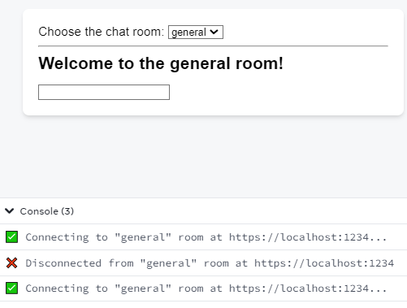

В приведенной выше песочнице ввод только обновляет переменную состояния `message`. С точки зрения пользователя, это не должно влиять на соединение с чатом. Однако каждый раз, когда вы обновляете `message`, ваш компонент перерисовывается. Когда ваш компонент пересматривается, код внутри него снова запускается с нуля.

Новый объект `options` создается с нуля при каждом повторном рендеринге компонента `ChatRoom`. React видит, что объект `options` является _отличным объектом_ от объекта `options`, созданного во время последнего рендеринга. Поэтому он повторно синхронизирует ваш Effect (который зависит от `options`), и чат снова подключается, когда вы набираете текст.

**Эта проблема затрагивает только объекты и функции. В JavaScript каждый вновь созданный объект и функция считаются отдельными от всех остальных. Не имеет значения, что содержимое внутри них может быть одинаковым!**.

<!-- 0077.part.md -->

```js
// During the first render
const options1 = {
    serverUrl: 'https://localhost:1234',
    roomId: 'music',
};

// During the next render
const options2 = {
    serverUrl: 'https://localhost:1234',
    roomId: 'music',
};

// These are two different objects!
console.log(Object.is(options1, options2)); // false
```

<!-- 0078.part.md -->

**Зависимости от объектов и функций могут заставить ваш Эффект пересинхронизироваться чаще, чем вам нужно**.

Поэтому, по возможности, старайтесь избегать объектов и функций в качестве зависимостей вашего Эффекта. Вместо этого попробуйте переместить их за пределы компонента, внутрь Эффекта или извлечь из них примитивные значения.

#### Перемещение статических объектов и функций за пределы компонента

Если объект не зависит от пропсов и состояния, вы можете переместить этот объект за пределы вашего компонента:

<!-- 0079.part.md -->

```js
const options = {
    serverUrl: 'https://localhost:1234',
    roomId: 'music',
};

function ChatRoom() {
    const [message, setMessage] = useState('');

    useEffect(() => {
        const connection = createConnection(options);
        connection.connect();
        return () => connection.disconnect();
    }, []); // ✅ All dependencies declared
    // ...
}
```

<!-- 0080.part.md -->

Таким образом, вы _доказываете_ линтеру, что он не реактивный. Он не может измениться в результате повторного рендеринга, поэтому ему не нужно быть зависимостью. Теперь повторное отображение `ChatRoom` не заставит ваш Effect повторно синхронизироваться.

Это работает и для функций:

<!-- 0081.part.md -->

```js
function createOptions() {
    return {
        serverUrl: 'https://localhost:1234',
        roomId: 'music',
    };
}

function ChatRoom() {
    const [message, setMessage] = useState('');

    useEffect(() => {
        const options = createOptions();
        const connection = createConnection();
        connection.connect();
        return () => connection.disconnect();
    }, []); // ✅ All dependencies declared
    // ...
}
```

<!-- 0082.part.md -->

Поскольку `createOptions` объявляется вне вашего компонента, это не реактивное значение. Поэтому его не нужно указывать в зависимостях вашего Эффекта, и поэтому он никогда не заставит ваш Эффект пересинхронизироваться.

#### Перемещение динамических объектов и функций внутри вашего Эффекта

Если ваш объект зависит от какого-то реактивного значения, которое может измениться в результате повторного рендеринга, например, параметр `roomId`, вы не можете переместить его _внутрь_ вашего компонента. Однако вы можете переместить его создание _внутрь_ кода вашего Эффекта:

<!-- 0083.part.md -->

```js
const serverUrl = 'https://localhost:1234';

function ChatRoom({ roomId }) {
    const [message, setMessage] = useState('');

    useEffect(() => {
        const options = {
            serverUrl: serverUrl,
            roomId: roomId,
        };
        const connection = createConnection(options);
        connection.connect();
        return () => connection.disconnect();
    }, [roomId]); // ✅ All dependencies declared
    // ...
}
```

<!-- 0084.part.md -->

Теперь, когда `options` объявлено внутри вашего Эффекта, оно больше не является зависимостью вашего Эффекта. Вместо этого, единственным реактивным значением, используемым вашим Эффектом, является `roomId`. Поскольку `roomId` не является объектом или функцией, вы можете быть уверены, что оно не будет _непреднамеренно_ отличаться. В JavaScript числа и строки сравниваются по их содержанию:

<!-- 0085.part.md -->

```js
// During the first render
const roomId1 = 'music';

// During the next render
const roomId2 = 'music';

// These two strings are the same!
console.log(Object.is(roomId1, roomId2)); // true
```

<!-- 0086.part.md -->

Благодаря этому исправлению чат больше не переподключается, если вы редактируете входные данные:

=== "App.js"

    ```js
    import { useState, useEffect } from 'react';
    import { createConnection } from './chat.js';

    const serverUrl = 'https://localhost:1234';

    function ChatRoom({ roomId }) {
    	const [message, setMessage] = useState('');

    	useEffect(() => {
    		const options = {
    			serverUrl: serverUrl,
    			roomId: roomId,
    		};
    		const connection = createConnection(options);
    		connection.connect();
    		return () => connection.disconnect();
    	}, [roomId]);

    	return (
    		<>
    			<h1>Welcome to the {roomId} room!</h1>
    			<input
    				value={message}
    				onChange={(e) => setMessage(e.target.value)}
    			/>
    		</>
    	);
    }

    export default function App() {
    	const [roomId, setRoomId] = useState('general');
    	return (
    		<>
    			<label>
    				Choose the chat room:{' '}
    				<select
    					value={roomId}
    					onChange={(e) =>
    						setRoomId(e.target.value)
    					}
    				>
    					<option value="general">general</option>
    					<option value="travel">travel</option>
    					<option value="music">music</option>
    				</select>
    			</label>
    			<hr />
    			<ChatRoom roomId={roomId} />
    		</>
    	);
    }
    ```

=== "chat.js"

    ```js
    export function createConnection({ serverUrl, roomId }) {
    	// A real implementation would actually connect to the server
    	return {
    		connect() {
    			console.log(
    				'✅ Connecting to "' +
    					roomId +
    					'" room at ' +
    					serverUrl +
    					'...'
    			);
    		},
    		disconnect() {
    			console.log(
    				'❌ Disconnected from "' +
    					roomId +
    					'" room at ' +
    					serverUrl
    			);
    		},
    	};
    }
    ```

=== "Результат"

    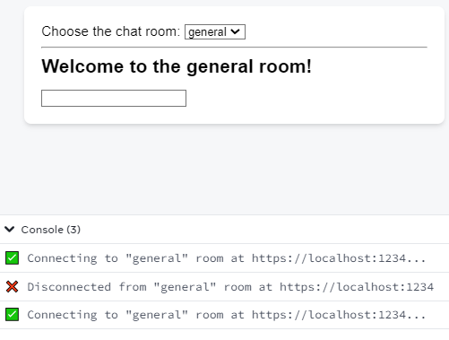

Однако он _делает_ повторное подключение, когда вы изменяете выпадающий `roomId`, как вы и ожидали.

Это работает и для функций:

<!-- 0093.part.md -->

```js
const serverUrl = 'https://localhost:1234';

function ChatRoom({ roomId }) {
    const [message, setMessage] = useState('');

    useEffect(() => {
        function createOptions() {
            return {
                serverUrl: serverUrl,
                roomId: roomId,
            };
        }

        const options = createOptions();
        const connection = createConnection(options);
        connection.connect();
        return () => connection.disconnect();
    }, [roomId]); // ✅ All dependencies declared
    // ...
}
```

<!-- 0094.part.md -->

Вы можете писать свои собственные функции для группировки частей логики внутри вашего Эффекта. Если вы также объявляете их _внутри_ вашего Эффекта, они не являются реактивными значениями, и поэтому им не нужно быть зависимыми от вашего Эффекта.

#### Чтение примитивных значений из объектов

Иногда вы можете получить объект из пропса:

<!-- 0095.part.md -->

```js
function ChatRoom({ options }) {
    const [message, setMessage] = useState('');

    useEffect(() => {
        const connection = createConnection(options);
        connection.connect();
        return () => connection.disconnect();
    }, [options]); // ✅ All dependencies declared
    // ...
}
```

<!-- 0096.part.md -->

Риск здесь заключается в том, что родительский компонент создаст объект во время рендеринга:

<!-- 0097.part.md -->

```js
<ChatRoom
    roomId={roomId}
    options={{
        serverUrl: serverUrl,
        roomId: roomId,
    }}
/>
```

<!-- 0098.part.md -->

Это приведет к тому, что ваш Эффект будет подключаться заново каждый раз, когда родительский компонент будет перестраиваться. Чтобы исправить это, считывайте информацию из объекта _вне_ Эффекта и избегайте зависимостей между объектом и функцией:

<!-- 0099.part.md -->

```js
function ChatRoom({ options }) {
    const [message, setMessage] = useState('');

    const { roomId, serverUrl } = options;
    useEffect(() => {
        const connection = createConnection({
            roomId: roomId,
            serverUrl: serverUrl,
        });
        connection.connect();
        return () => connection.disconnect();
    }, [roomId, serverUrl]); // ✅ All dependencies declared
    // ...
}
```

<!-- 0100.part.md -->

Логика становится немного повторяющейся (вы считываете некоторые значения из объекта вне Эффекта, а затем создаете объект с теми же значениями внутри Эффекта). Но это позволяет четко определить, от какой информации на самом деле зависит ваш Эффект. Если объект непреднамеренно пересоздается родительским компонентом, чат не будет переподключаться. Однако, если `options.roomId` или `options.serverUrl` действительно отличаются, чат будет переподключен.

#### Вычисление примитивных значений из функций

Тот же подход может работать и для функций. Например, предположим, что родительский компонент передает функцию:

<!-- 0101.part.md -->

```js
<ChatRoom
    roomId={roomId}
    getOptions={() => {
        return {
            serverUrl: serverUrl,
            roomId: roomId,
        };
    }}
/>
```

<!-- 0102.part.md -->

Чтобы не делать его зависимым (и не заставлять его переподключаться при повторных рендерах), вызывайте его вне Эффекта. Это даст вам значения `roomId` и `serverUrl`, которые не являются объектами, и которые вы можете прочитать изнутри вашего Эффекта:

<!-- 0103.part.md -->

```js
function ChatRoom({ getOptions }) {
    const [message, setMessage] = useState('');

    const { roomId, serverUrl } = getOptions();
    useEffect(() => {
        const connection = createConnection({
            roomId: roomId,
            serverUrl: serverUrl,
        });
        connection.connect();
        return () => connection.disconnect();
    }, [roomId, serverUrl]); // ✅ All dependencies declared
    // ...
}
```

<!-- 0104.part.md -->

Это работает только для [чистых](keeping-components-pure.md) функций, потому что их безопасно вызывать во время рендеринга. Если ваша функция является обработчиком событий, но вы не хотите, чтобы ее изменения повторно синхронизировали ваш Эффект, оберните ее в событие Эффекта.

!!!note "Итоги"

    -   Зависимости всегда должны соответствовать коду.
    -   Если вы недовольны своими зависимостями, вам нужно отредактировать код.
    -   Подавление линтера приводит к очень запутанным ошибкам, и вы всегда должны избегать этого.
    -   Чтобы удалить зависимость, нужно "доказать" линтеру, что она не нужна.
    -   Если какой-то код должен выполняться в ответ на определенное взаимодействие, перенесите его в обработчик событий.
    -   Если разные части вашего Эффекта должны запускаться повторно по разным причинам, разделите его на несколько Эффектов.
    -   Если вы хотите обновить некоторое состояние на основе предыдущего состояния, передайте функцию обновления.
    -   Если вы хотите прочитать последнее значение, не "реагируя" на него, извлеките событие Effect Event из вашего Эффекта.
    -   В JavaScript объекты и функции считаются разными, если они были созданы в разное время.
    -   Старайтесь избегать зависимостей между объектами и функциями. Перенесите их за пределы компонента или внутрь Эффекта.

## Задачи

### 1. Фиксировать интервал сброса

Этот Эффект устанавливает интервал, который тикает каждую секунду. Вы заметили, что происходит что-то странное: кажется, что интервал уничтожается и создается заново каждый раз, когда он тикает. Исправьте код так, чтобы интервал не создавался постоянно заново.

=== "App.js"

    ```js
    import { useState, useEffect } from 'react';

    export default function Timer() {
    	const [count, setCount] = useState(0);

    	useEffect(() => {
    		console.log('✅ Creating an interval');
    		const id = setInterval(() => {
    			console.log('⏰ Interval tick');
    			setCount(count + 1);
    		}, 1000);
    		return () => {
    			console.log('❌ Clearing an interval');
    			clearInterval(id);
    		};
    	}, [count]);

    	return <h1>Counter: {count}</h1>;
    }
    ```

=== "Результат"

    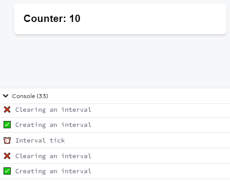

???tip "Показать подсказку"

    Кажется, что код этого Эффекта зависит от `count`. Есть ли способ избежать этой зависимости? Должен быть способ обновить состояние `count` на основе его предыдущего значения без добавления зависимости от этого значения.

???success "Показать решение"

    Вы хотите обновить состояние `count` до `count + 1` изнутри Эффекта. Однако это заставит ваш Эффект зависеть от `count`, который меняется с каждым тиком, и поэтому ваш интервал создается заново на каждом тике.

    Чтобы решить эту проблему, используйте функцию [updater](../reference/useState.md) и напишите `setCount(c => c + 1)` вместо `setCount(count + 1)`:

    === "App.js"

    	```js
    	import { useState, useEffect } from 'react';

    	export default function Timer() {
    		const [count, setCount] = useState(0);

    		useEffect(() => {
    			console.log('✅ Creating an interval');
    			const id = setInterval(() => {
    				console.log('⏰ Interval tick');
    				setCount((c) => c + 1);
    			}, 1000);
    			return () => {
    				console.log('❌ Clearing an interval');
    				clearInterval(id);
    			};
    		}, []);

    		return <h1>Counter: {count}</h1>;
    	}
    	```

    === "Результат"

    	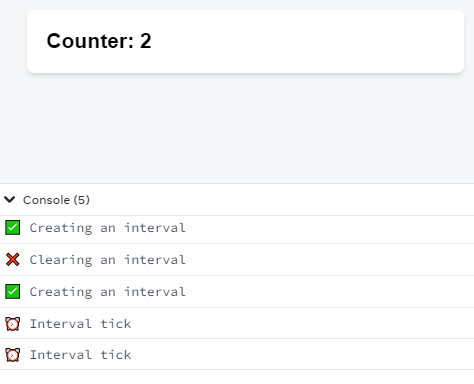

    Вместо чтения `count` внутри Effect, вы передаете React инструкцию `c => c + 1` ("увеличить это число!"). React применит ее при следующем рендере. А поскольку вам больше не нужно считывать значение `count` внутри вашего Эффекта, вы можете держать зависимости вашего Эффекта пустыми (`[]`). Это предотвратит повторное создание интервала в каждом тике вашего Эффекта.

### 2. Исправление ретриггерной анимации

В этом примере, когда вы нажимаете кнопку "Показать", появляется приветственное сообщение. Анимация длится секунду. При нажатии кнопки "Убрать" приветственное сообщение сразу же исчезает. Логика анимации затухания реализована в файле `animation.js` в виде обычного JavaScript [animation loop](https://developer.mozilla.org/docs/Web/API/window/requestAnimationFrame). Вам не нужно изменять эту логику. Вы можете обращаться с ней как со сторонней библиотекой. Ваш Effect создает экземпляр `FadeInAnimation` для узла DOM, а затем вызывает `start(duration)` или `stop()` для управления анимацией. Длительность" контролируется ползунком. Отрегулируйте ползунок и посмотрите, как изменится анимация.

Этот код уже работает, но есть кое-что, что вы хотите изменить. В настоящее время, когда вы перемещаете ползунок, управляющий переменной состояния `duration`, он перезапускает анимацию. Измените поведение так, чтобы Эффект не "реагировал" на переменную `duration`. Когда вы нажимаете "Show", Эффект должен использовать текущую `duration` на ползунке. Однако перемещение ползунка само по себе не должно запускать анимацию.

=== "App.js"

    ```js
    import { useState, useEffect, useRef } from 'react';
    import { experimental_useEffectEvent as useEffectEvent } from 'react';
    import { FadeInAnimation } from './animation.js';

    function Welcome({ duration }) {
    	const ref = useRef(null);

    	useEffect(() => {
    		const animation = new FadeInAnimation(ref.current);
    		animation.start(duration);
    		return () => {
    			animation.stop();
    		};
    	}, [duration]);

    	return (
    		<h1
    			ref={ref}
    			style={{
    				opacity: 0,
    				color: 'white',
    				padding: 50,
    				textAlign: 'center',
    				fontSize: 50,
    				backgroundImage:
    					'radial-gradient(circle, rgba(63,94,251,1) 0%, rgba(252,70,107,1) 100%)',
    			}}
    		>
    			Welcome
    		</h1>
    	);
    }

    export default function App() {
    	const [duration, setDuration] = useState(1000);
    	const [show, setShow] = useState(false);

    	return (
    		<>
    			<label>
    				<input
    					type="range"
    					min="100"
    					max="3000"
    					value={duration}
    					onChange={(e) =>
    						setDuration(Number(e.target.value))
    					}
    				/>
    				<br />
    				Fade in duration: {duration} ms
    			</label>
    			<button onClick={() => setShow(!show)}>
    				{show ? 'Remove' : 'Show'}
    			</button>
    			<hr />
    			{show && <Welcome duration={duration} />}
    		</>
    	);
    }
    ```

=== "animations.js"

    ```js
    export class FadeInAnimation {
    	constructor(node) {
    		this.node = node;
    	}
    	start(duration) {
    		this.duration = duration;
    		if (this.duration === 0) {
    			// Jump to end immediately
    			this.onProgress(1);
    		} else {
    			this.onProgress(0);
    			// Start animating
    			this.startTime = performance.now();
    			this.frameId = requestAnimationFrame(() =>
    				this.onFrame()
    			);
    		}
    	}
    	onFrame() {
    		const timePassed =
    			performance.now() - this.startTime;
    		const progress = Math.min(
    			timePassed / this.duration,
    			1
    		);
    		this.onProgress(progress);
    		if (progress < 1) {
    			// We still have more frames to paint
    			this.frameId = requestAnimationFrame(() =>
    				this.onFrame()
    			);
    		}
    	}
    	onProgress(progress) {
    		this.node.style.opacity = progress;
    	}
    	stop() {
    		cancelAnimationFrame(this.frameId);
    		this.startTime = null;
    		this.frameId = null;
    		this.duration = 0;
    	}
    }
    ```

=== "Результат"

    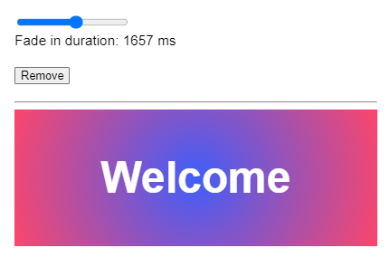

???tip "Показать подсказку"

    Есть ли внутри Эффекта строка кода, которая не должна быть реактивной? Как вы можете переместить нереактивный код из Эффекта?

???success "Показать решение"

    Ваш Эффект должен считывать последнее значение `duration`, но вы не хотите, чтобы он "реагировал" на изменения `duration`. Вы используете `duration` для запуска анимации, но запуск анимации не является реактивным. Извлеките нереактивную строку кода в событие эффекта и вызовите эту функцию из вашего эффекта.

    === "App.js"

    	```js
    	import { useState, useEffect, useRef } from 'react';
    	import { FadeInAnimation } from './animation.js';
    	import { experimental_useEffectEvent as useEffectEvent } from 'react';

    	function Welcome({ duration }) {
    		const ref = useRef(null);

    		const onAppear = useEffectEvent((animation) => {
    			animation.start(duration);
    		});

    		useEffect(() => {
    			const animation = new FadeInAnimation(ref.current);
    			onAppear(animation);
    			return () => {
    				animation.stop();
    			};
    		}, []);

    		return (
    			<h1
    				ref={ref}
    				style={{
    					opacity: 0,
    					color: 'white',
    					padding: 50,
    					textAlign: 'center',
    					fontSize: 50,
    					backgroundImage:
    						'radial-gradient(circle, rgba(63,94,251,1) 0%, rgba(252,70,107,1) 100%)',
    				}}
    			>
    				Welcome
    			</h1>
    		);
    	}

    	export default function App() {
    		const [duration, setDuration] = useState(1000);
    		const [show, setShow] = useState(false);

    		return (
    			<>
    				<label>
    					<input
    						type="range"
    						min="100"
    						max="3000"
    						value={duration}
    						onChange={(e) =>
    							setDuration(Number(e.target.value))
    						}
    					/>
    					<br />
    					Fade in duration: {duration} ms
    				</label>
    				<button onClick={() => setShow(!show)}>
    					{show ? 'Remove' : 'Show'}
    				</button>
    				<hr />
    				{show && <Welcome duration={duration} />}
    			</>
    		);
    	}
    	```

    === "animation.js"

    	```js
    	export class FadeInAnimation {
    		constructor(node) {
    			this.node = node;
    		}
    		start(duration) {
    			this.duration = duration;
    			this.onProgress(0);
    			this.startTime = performance.now();
    			this.frameId = requestAnimationFrame(() =>
    				this.onFrame()
    			);
    		}
    		onFrame() {
    			const timePassed =
    				performance.now() - this.startTime;
    			const progress = Math.min(
    				timePassed / this.duration,
    				1
    			);
    			this.onProgress(progress);
    			if (progress < 1) {
    				// We still have more frames to paint
    				this.frameId = requestAnimationFrame(() =>
    					this.onFrame()
    				);
    			}
    		}
    		onProgress(progress) {
    			this.node.style.opacity = progress;
    		}
    		stop() {
    			cancelAnimationFrame(this.frameId);
    			this.startTime = null;
    			this.frameId = null;
    			this.duration = 0;
    		}
    	}
    	```

    === "Результат"

    	

    События эффектов, такие как `onAppear`, не являются реактивными, поэтому вы можете считать `duration` внутри, не перезапуская анимацию.

### 3. Исправление переподключающегося чата

В этом примере каждый раз, когда вы нажимаете кнопку "Toggle theme", чат переподключается. Почему это происходит? Исправьте ошибку, чтобы чат переподключался только тогда, когда вы редактируете URL сервера или выбираете другой чат.

Относитесь к `chat.js` как к внешней сторонней библиотеке: вы можете обратиться к ней, чтобы проверить ее API, но не редактируйте ее.

=== "App.js"

    ```js
    import { useState } from 'react';
    import ChatRoom from './ChatRoom.js';

    export default function App() {
    	const [isDark, setIsDark] = useState(false);
    	const [roomId, setRoomId] = useState('general');
    	const [serverUrl, setServerUrl] = useState(
    		'https://localhost:1234'
    	);

    	const options = {
    		serverUrl: serverUrl,
    		roomId: roomId,
    	};

    	return (
    		<div className={isDark ? 'dark' : 'light'}>
    			<button onClick={() => setIsDark(!isDark)}>
    				Toggle theme
    			</button>
    			<label>
    				Server URL:{' '}
    				<input
    					value={serverUrl}
    					onChange={(e) =>
    						setServerUrl(e.target.value)
    					}
    				/>
    			</label>
    			<label>
    				Choose the chat room:{' '}
    				<select
    					value={roomId}
    					onChange={(e) =>
    						setRoomId(e.target.value)
    					}
    				>
    					<option value="general">general</option>
    					<option value="travel">travel</option>
    					<option value="music">music</option>
    				</select>
    			</label>
    			<hr />
    			<ChatRoom options={options} />
    		</div>
    	);
    }
    ```

=== "ChatRoom.js"

    ```js
    import { useEffect } from 'react';
    import { createConnection } from './chat.js';

    export default function ChatRoom({ options }) {
    	useEffect(() => {
    		const connection = createConnection(options);
    		connection.connect();
    		return () => connection.disconnect();
    	}, [options]);

    	return <h1>Welcome to the {options.roomId} room!</h1>;
    }
    ```

=== "chat.js"

    ```js
    export function createConnection({ serverUrl, roomId }) {
    	// A real implementation would actually connect to the server
    	if (typeof serverUrl !== 'string') {
    		throw Error(
    			'Expected serverUrl to be a string. Received: ' +
    				serverUrl
    		);
    	}
    	if (typeof roomId !== 'string') {
    		throw Error(
    			'Expected roomId to be a string. Received: ' +
    				roomId
    		);
    	}
    	return {
    		connect() {
    			console.log(
    				'✅ Connecting to "' +
    					roomId +
    					'" room at ' +
    					serverUrl +
    					'...'
    			);
    		},
    		disconnect() {
    			console.log(
    				'❌ Disconnected from "' +
    					roomId +
    					'" room at ' +
    					serverUrl
    			);
    		},
    	};
    }
    ```

=== "Результат"

    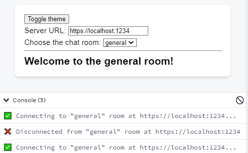

???tip "Показать подсказку"

    Есть несколько способов исправить это, но в конечном итоге вы хотите избежать наличия объекта в качестве зависимости.

???success "Показать решение"

    Ваш Эффект запускается повторно, потому что он зависит от объекта `options`. Объекты могут быть созданы заново непреднамеренно, вы должны стараться избегать их в качестве зависимостей ваших Эффектов, когда это возможно.

    Наименее инвазивное решение - это считывать `roomId` и `serverUrl` прямо вне Эффекта, а затем сделать Эффект зависимым от этих примитивных значений (которые не могут измениться непреднамеренно). Внутри эффекта создайте объект и передайте его в `createConnection`:

    === "App.js"

    	```js
    	import { useState } from 'react';
    	import ChatRoom from './ChatRoom.js';

    	export default function App() {
    		const [isDark, setIsDark] = useState(false);
    		const [roomId, setRoomId] = useState('general');
    		const [serverUrl, setServerUrl] = useState(
    			'https://localhost:1234'
    		);

    		const options = {
    			serverUrl: serverUrl,
    			roomId: roomId,
    		};

    		return (
    			<div className={isDark ? 'dark' : 'light'}>
    				<button onClick={() => setIsDark(!isDark)}>
    					Toggle theme
    				</button>
    				<label>
    					Server URL:{' '}
    					<input
    						value={serverUrl}
    						onChange={(e) =>
    							setServerUrl(e.target.value)
    						}
    					/>
    				</label>
    				<label>
    					Choose the chat room:{' '}
    					<select
    						value={roomId}
    						onChange={(e) =>
    							setRoomId(e.target.value)
    						}
    					>
    						<option value="general">general</option>
    						<option value="travel">travel</option>
    						<option value="music">music</option>
    					</select>
    				</label>
    				<hr />
    				<ChatRoom options={options} />
    			</div>
    		);
    	}
    	```

    === "ChatRoom.js"

    	```js
    	import { useEffect } from 'react';
    	import { createConnection } from './chat.js';

    	export default function ChatRoom({ options }) {
    		const { roomId, serverUrl } = options;
    		useEffect(() => {
    			const connection = createConnection({
    				roomId: roomId,
    				serverUrl: serverUrl,
    			});
    			connection.connect();
    			return () => connection.disconnect();
    		}, [roomId, serverUrl]);

    		return <h1>Welcome to the {options.roomId} room!</h1>;
    	}
    	```

    === "chat.js"

    	```js
    	export function createConnection({ serverUrl, roomId }) {
    		// A real implementation would actually connect to the server
    		if (typeof serverUrl !== 'string') {
    			throw Error(
    				'Expected serverUrl to be a string. Received: ' +
    					serverUrl
    			);
    		}
    		if (typeof roomId !== 'string') {
    			throw Error(
    				'Expected roomId to be a string. Received: ' +
    					roomId
    			);
    		}
    		return {
    			connect() {
    				console.log(
    					'✅ Connecting to "' +
    						roomId +
    						'" room at ' +
    						serverUrl +
    						'...'
    				);
    			},
    			disconnect() {
    				console.log(
    					'❌ Disconnected from "' +
    						roomId +
    						'" room at ' +
    						serverUrl
    				);
    			},
    		};
    	}
    	```

    === "Результат"

    	

    Еще лучше было бы заменить пропс объекта `options` на более конкретные пропсы `roomId` и `serverUrl`:

    === "App.js"

    	```js
    	import { useState } from 'react';
    	import ChatRoom from './ChatRoom.js';

    	export default function App() {
    		const [isDark, setIsDark] = useState(false);
    		const [roomId, setRoomId] = useState('general');
    		const [serverUrl, setServerUrl] = useState(
    			'https://localhost:1234'
    		);

    		return (
    			<div className={isDark ? 'dark' : 'light'}>
    				<button onClick={() => setIsDark(!isDark)}>
    					Toggle theme
    				</button>
    				<label>
    					Server URL:{' '}
    					<input
    						value={serverUrl}
    						onChange={(e) =>
    							setServerUrl(e.target.value)
    						}
    					/>
    				</label>
    				<label>
    					Choose the chat room:{' '}
    					<select
    						value={roomId}
    						onChange={(e) =>
    							setRoomId(e.target.value)
    						}
    					>
    						<option value="general">general</option>
    						<option value="travel">travel</option>
    						<option value="music">music</option>
    					</select>
    				</label>
    				<hr />
    				<ChatRoom
    					roomId={roomId}
    					serverUrl={serverUrl}
    				/>
    			</div>
    		);
    	}
    	```

    === "ChatRoom.js"

    	```js
    	import { useState, useEffect } from 'react';
    	import { createConnection } from './chat.js';

    	export default function ChatRoom({ roomId, serverUrl }) {
    		useEffect(() => {
    			const connection = createConnection({
    				roomId: roomId,
    				serverUrl: serverUrl,
    			});
    			connection.connect();
    			return () => connection.disconnect();
    		}, [roomId, serverUrl]);

    		return <h1>Welcome to the {roomId} room!</h1>;
    	}
    	```

    === "chat.js"

    	```js
    	export function createConnection({ serverUrl, roomId }) {
    		// A real implementation would actually connect to the server
    		if (typeof serverUrl !== 'string') {
    			throw Error(
    				'Expected serverUrl to be a string. Received: ' +
    					serverUrl
    			);
    		}
    		if (typeof roomId !== 'string') {
    			throw Error(
    				'Expected roomId to be a string. Received: ' +
    					roomId
    			);
    		}
    		return {
    			connect() {
    				console.log(
    					'✅ Connecting to "' +
    						roomId +
    						'" room at ' +
    						serverUrl +
    						'...'
    				);
    			},
    			disconnect() {
    				console.log(
    					'❌ Disconnected from "' +
    						roomId +
    						'" room at ' +
    						serverUrl
    				);
    			},
    		};
    	}
    	```

    === "Результат"

    	

    Придерживаясь по возможности примитивных пропсов, легче оптимизировать компоненты в дальнейшем.

### 4. Исправление переподключающегося чата, снова

Этот пример подключается к чату либо с шифрованием, либо без него. Переключите флажок и обратите внимание на разные сообщения в консоли, когда шифрование включено и выключено. Попробуйте сменить комнату. Затем попробуйте переключить тему. Когда вы подключены к чату, вы будете получать новые сообщения каждые несколько секунд. Убедитесь, что их цвет соответствует выбранной вами теме.

В данном примере чат подключается заново каждый раз, когда вы пытаетесь сменить тему. Исправьте это. После исправления смена темы не должна переподключать чат, но переключение настроек шифрования или смена комнаты должны переподключать.

Не изменяйте никакой код в файле `chat.js`. Кроме этого, вы можете изменять любой код, если он приводит к такому же поведению. Например, вы можете счесть полезным изменить, какие пропсы передаются вниз.

=== "App.js"

    ```js
    import { useState } from 'react';
    import ChatRoom from './ChatRoom.js';
    import {
    	createEncryptedConnection,
    	createUnencryptedConnection,
    } from './chat.js';
    import { showNotification } from './notifications.js';

    export default function App() {
    	const [isDark, setIsDark] = useState(false);
    	const [roomId, setRoomId] = useState('general');
    	const [isEncrypted, setIsEncrypted] = useState(false);

    	return (
    		<>
    			<label>
    				<input
    					type="checkbox"
    					checked={isDark}
    					onChange={(e) =>
    						setIsDark(e.target.checked)
    					}
    				/>
    				Use dark theme
    			</label>
    			<label>
    				<input
    					type="checkbox"
    					checked={isEncrypted}
    					onChange={(e) =>
    						setIsEncrypted(e.target.checked)
    					}
    				/>
    				Enable encryption
    			</label>
    			<label>
    				Choose the chat room:{' '}
    				<select
    					value={roomId}
    					onChange={(e) =>
    						setRoomId(e.target.value)
    					}
    				>
    					<option value="general">general</option>
    					<option value="travel">travel</option>
    					<option value="music">music</option>
    				</select>
    			</label>
    			<hr />
    			<ChatRoom
    				roomId={roomId}
    				onMessage={(msg) => {
    					showNotification(
    						'New message: ' + msg,
    						isDark ? 'dark' : 'light'
    					);
    				}}
    				createConnection={() => {
    					const options = {
    						serverUrl: 'https://localhost:1234',
    						roomId: roomId,
    					};
    					if (isEncrypted) {
    						return createEncryptedConnection(
    							options
    						);
    					} else {
    						return createUnencryptedConnection(
    							options
    						);
    					}
    				}}
    			/>
    		</>
    	);
    }
    ```

=== "ChatRoom.js"

    ```js
    import { useState, useEffect } from 'react';
    import { experimental_useEffectEvent as useEffectEvent } from 'react';

    export default function ChatRoom({
    	roomId,
    	createConnection,
    	onMessage,
    }) {
    	useEffect(() => {
    		const connection = createConnection();
    		connection.on('message', (msg) => onMessage(msg));
    		connection.connect();
    		return () => connection.disconnect();
    	}, [createConnection, onMessage]);

    	return <h1>Welcome to the {roomId} room!</h1>;
    }
    ```

=== "chat.js"

    ```js
    export function createEncryptedConnection({
    	serverUrl,
    	roomId,
    }) {
    	// A real implementation would actually connect to the server
    	if (typeof serverUrl !== 'string') {
    		throw Error(
    			'Expected serverUrl to be a string. Received: ' +
    				serverUrl
    		);
    	}
    	if (typeof roomId !== 'string') {
    		throw Error(
    			'Expected roomId to be a string. Received: ' +
    				roomId
    		);
    	}
    	let intervalId;
    	let messageCallback;
    	return {
    		connect() {
    			console.log(
    				'✅ 🔐 Connecting to "' +
    					roomId +
    					'" room... (encrypted)'
    			);
    			clearInterval(intervalId);
    			intervalId = setInterval(() => {
    				if (messageCallback) {
    					if (Math.random() > 0.5) {
    						messageCallback('hey');
    					} else {
    						messageCallback('lol');
    					}
    				}
    			}, 3000);
    		},
    		disconnect() {
    			clearInterval(intervalId);
    			messageCallback = null;
    			console.log(
    				'❌ 🔐 Disconnected from "' +
    					roomId +
    					'" room (encrypted)'
    			);
    		},
    		on(event, callback) {
    			if (messageCallback) {
    				throw Error(
    					'Cannot add the handler twice.'
    				);
    			}
    			if (event !== 'message') {
    				throw Error(
    					'Only "message" event is supported.'
    				);
    			}
    			messageCallback = callback;
    		},
    	};
    }

    export function createUnencryptedConnection({
    	serverUrl,
    	roomId,
    }) {
    	// A real implementation would actually connect to the server
    	if (typeof serverUrl !== 'string') {
    		throw Error(
    			'Expected serverUrl to be a string. Received: ' +
    				serverUrl
    		);
    	}
    	if (typeof roomId !== 'string') {
    		throw Error(
    			'Expected roomId to be a string. Received: ' +
    				roomId
    		);
    	}
    	let intervalId;
    	let messageCallback;
    	return {
    		connect() {
    			console.log(
    				'✅ Connecting to "' +
    					roomId +
    					'" room (unencrypted)...'
    			);
    			clearInterval(intervalId);
    			intervalId = setInterval(() => {
    				if (messageCallback) {
    					if (Math.random() > 0.5) {
    						messageCallback('hey');
    					} else {
    						messageCallback('lol');
    					}
    				}
    			}, 3000);
    		},
    		disconnect() {
    			clearInterval(intervalId);
    			messageCallback = null;
    			console.log(
    				'❌ Disconnected from "' +
    					roomId +
    					'" room (unencrypted)'
    			);
    		},
    		on(event, callback) {
    			if (messageCallback) {
    				throw Error(
    					'Cannot add the handler twice.'
    				);
    			}
    			if (event !== 'message') {
    				throw Error(
    					'Only "message" event is supported.'
    				);
    			}
    			messageCallback = callback;
    		},
    	};
    }
    ```

=== "notifications.js"

    ```js
    import Toastify from 'toastify-js';
    import 'toastify-js/src/toastify.css';

    export function showNotification(message, theme) {
    	Toastify({
    		text: message,
    		duration: 2000,
    		gravity: 'top',
    		position: 'right',
    		style: {
    			background:
    				theme === 'dark' ? 'black' : 'white',
    			color: theme === 'dark' ? 'white' : 'black',
    		},
    	}).showToast();
    }
    ```

=== "Результат"

    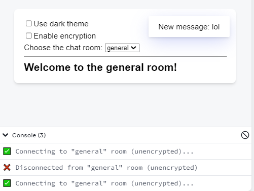

???tip "Показать подсказку"

    Вы передаете две функции: `onMessage` и `createConnection`. Обе они создаются с нуля каждый раз при повторном рендеринге `App`. Они рассматриваются как новые значения каждый раз, поэтому они повторно запускают ваш Effect.

    Одна из этих функций является обработчиком событий. Знаете ли вы какой-нибудь способ вызвать Эффект из обработчика события, не "реагируя" на новые значения функции обработчика события? Это было бы очень удобно\!

    Еще одна из этих функций существует только для того, чтобы передать некоторое состояние импортированному методу API. Действительно ли эта функция необходима? Какая важная информация передается? Возможно, вам нужно перенести некоторые импорты из `App.js` в `ChatRoom.js`.

???success "Показать решение"

    Существует не один правильный способ решения этой проблемы, но вот одно из возможных решений.

    В оригинальном примере переключение темы вызывало создание и передачу различных функций `onMessage` и `createConnection`. Поскольку эффект зависел от этих функций, чат переподключался каждый раз, когда вы переключали тему.

    Чтобы решить проблему с `onMessage`, нужно было обернуть ее в событие эффекта:

    <!-- 0161.part.md -->

    ```js
    export default function ChatRoom({
    	roomId,
    	createConnection,
    	onMessage,
    }) {
    	const onReceiveMessage = useEffectEvent(onMessage);

    	useEffect(() => {
    		const connection = createConnection();
    		connection.on('message', (msg) =>
    			onReceiveMessage(msg)
    		);
    		// ...
    	});
    }
    ```

    <!-- 0162.part.md -->

    В отличие от пропса `onMessage`, событие эффекта `onReceiveMessage` не является реактивным. Поэтому оно не должно быть зависимым от вашего эффекта. В результате, изменения в `onMessage` не приведут к повторному подключению чата.

    Вы не можете сделать то же самое с `createConnection`, потому что он _должен_ быть реактивным. Вы _хотите_, чтобы Эффект повторно срабатывал, если пользователь переключается между зашифрованным и незашифрованным соединением, или если пользователь переключает текущую комнату. Однако, поскольку `createConnection` - это функция, вы не можете проверить, изменилась ли информация, которую она считывает, _фактически_ или нет. Чтобы решить эту проблему, вместо передачи `createConnection` вниз из компонента `App`, передайте необработанные значения `roomId` и `isEncrypted`:

    <!-- 0163.part.md -->

    ```js
    <ChatRoom
    	roomId={roomId}
    	isEncrypted={isEncrypted}
    	onMessage={(msg) => {
    		showNotification(
    			'New message: ' + msg,
    			isDark ? 'dark' : 'light'
    		);
    	}}
    />
    ```

    <!-- 0164.part.md -->

    Теперь вы можете переместить функцию `createConnection` _внутрь_ Effect вместо того, чтобы передавать ее из `App`:

    <!-- 0165.part.md -->

    ```js
    import {
    	createEncryptedConnection,
    	createUnencryptedConnection,
    } from './chat.js';

    export default function ChatRoom({
    	roomId,
    	isEncrypted,
    	onMessage,
    }) {
    	const onReceiveMessage = useEffectEvent(onMessage);

    	useEffect(() => {
    		function createConnection() {
    			const options = {
    				serverUrl: 'https://localhost:1234',
    				roomId: roomId,
    			};
    			if (isEncrypted) {
    				return createEncryptedConnection(options);
    			} else {
    				return createUnencryptedConnection(options);
    			}
    		}
    		// ...
    	});
    }
    ```

    <!-- 0166.part.md -->

    После этих двух изменений ваш Effect больше не зависит ни от каких значений функции:

    <!-- 0167.part.md -->

    ```js
    export default function ChatRoom({
    	roomId,
    	isEncrypted,
    	onMessage,
    }) {
    	// Reactive values
    	const onReceiveMessage = useEffectEvent(onMessage); // Not reactive

    	useEffect(() => {
    		function createConnection() {
    			const options = {
    				serverUrl: 'https://localhost:1234',
    				roomId: roomId, // Reading a reactive value
    			};
    			if (isEncrypted) {
    				// Reading a reactive value
    				return createEncryptedConnection(options);
    			} else {
    				return createUnencryptedConnection(options);
    			}
    		}

    		const connection = createConnection();
    		connection.on('message', (msg) =>
    			onReceiveMessage(msg)
    		);
    		connection.connect();
    		return () => connection.disconnect();
    	}, [roomId, isEncrypted]); // ✅ All dependencies declared
    }
    ```

    <!-- 0168.part.md -->

    В результате чат переподключается только тогда, когда меняется что-то значимое (`roomId` или `isEncrypted`):

    === "App.js"

    	```js
    	import { useState } from 'react';
    	import ChatRoom from './ChatRoom.js';

    	import { showNotification } from './notifications.js';

    	export default function App() {
    		const [isDark, setIsDark] = useState(false);
    		const [roomId, setRoomId] = useState('general');
    		const [isEncrypted, setIsEncrypted] = useState(false);

    		return (
    			<>
    				<label>
    					<input
    						type="checkbox"
    						checked={isDark}
    						onChange={(e) =>
    							setIsDark(e.target.checked)
    						}
    					/>
    					Use dark theme
    				</label>
    				<label>
    					<input
    						type="checkbox"
    						checked={isEncrypted}
    						onChange={(e) =>
    							setIsEncrypted(e.target.checked)
    						}
    					/>
    					Enable encryption
    				</label>
    				<label>
    					Choose the chat room:{' '}
    					<select
    						value={roomId}
    						onChange={(e) =>
    							setRoomId(e.target.value)
    						}
    					>
    						<option value="general">general</option>
    						<option value="travel">travel</option>
    						<option value="music">music</option>
    					</select>
    				</label>
    				<hr />
    				<ChatRoom
    					roomId={roomId}
    					isEncrypted={isEncrypted}
    					onMessage={(msg) => {
    						showNotification(
    							'New message: ' + msg,
    							isDark ? 'dark' : 'light'
    						);
    					}}
    				/>
    			</>
    		);
    	}
    	```

    === "ChatRoom.js"

    	```js
    	import { useState, useEffect } from 'react';
    	import { experimental_useEffectEvent as useEffectEvent } from 'react';
    	import {
    		createEncryptedConnection,
    		createUnencryptedConnection,
    	} from './chat.js';

    	export default function ChatRoom({
    		roomId,
    		isEncrypted,
    		onMessage,
    	}) {
    		const onReceiveMessage = useEffectEvent(onMessage);

    		useEffect(() => {
    			function createConnection() {
    				const options = {
    					serverUrl: 'https://localhost:1234',
    					roomId: roomId,
    				};
    				if (isEncrypted) {
    					return createEncryptedConnection(options);
    				} else {
    					return createUnencryptedConnection(options);
    				}
    			}

    			const connection = createConnection();
    			connection.on('message', (msg) =>
    				onReceiveMessage(msg)
    			);
    			connection.connect();
    			return () => connection.disconnect();
    		}, [roomId, isEncrypted]);

    		return <h1>Welcome to the {roomId} room!</h1>;
    	}
    	```

    === "chat.js"

    	```js
    	export function createEncryptedConnection({
    		serverUrl,
    		roomId,
    	}) {
    		// A real implementation would actually connect to the server
    		if (typeof serverUrl !== 'string') {
    			throw Error(
    				'Expected serverUrl to be a string. Received: ' +
    					serverUrl
    			);
    		}
    		if (typeof roomId !== 'string') {
    			throw Error(
    				'Expected roomId to be a string. Received: ' +
    					roomId
    			);
    		}
    		let intervalId;
    		let messageCallback;
    		return {
    			connect() {
    				console.log(
    					'✅ 🔐 Connecting to "' +
    						roomId +
    						'" room... (encrypted)'
    				);
    				clearInterval(intervalId);
    				intervalId = setInterval(() => {
    					if (messageCallback) {
    						if (Math.random() > 0.5) {
    							messageCallback('hey');
    						} else {
    							messageCallback('lol');
    						}
    					}
    				}, 3000);
    			},
    			disconnect() {
    				clearInterval(intervalId);
    				messageCallback = null;
    				console.log(
    					'❌ 🔐 Disconnected from "' +
    						roomId +
    						'" room (encrypted)'
    				);
    			},
    			on(event, callback) {
    				if (messageCallback) {
    					throw Error(
    						'Cannot add the handler twice.'
    					);
    				}
    				if (event !== 'message') {
    					throw Error(
    						'Only "message" event is supported.'
    					);
    				}
    				messageCallback = callback;
    			},
    		};
    	}

    	export function createUnencryptedConnection({
    		serverUrl,
    		roomId,
    	}) {
    		// A real implementation would actually connect to the server
    		if (typeof serverUrl !== 'string') {
    			throw Error(
    				'Expected serverUrl to be a string. Received: ' +
    					serverUrl
    			);
    		}
    		if (typeof roomId !== 'string') {
    			throw Error(
    				'Expected roomId to be a string. Received: ' +
    					roomId
    			);
    		}
    		let intervalId;
    		let messageCallback;
    		return {
    			connect() {
    				console.log(
    					'✅ Connecting to "' +
    						roomId +
    						'" room (unencrypted)...'
    				);
    				clearInterval(intervalId);
    				intervalId = setInterval(() => {
    					if (messageCallback) {
    						if (Math.random() > 0.5) {
    							messageCallback('hey');
    						} else {
    							messageCallback('lol');
    						}
    					}
    				}, 3000);
    			},
    			disconnect() {
    				clearInterval(intervalId);
    				messageCallback = null;
    				console.log(
    					'❌ Disconnected from "' +
    						roomId +
    						'" room (unencrypted)'
    				);
    			},
    			on(event, callback) {
    				if (messageCallback) {
    					throw Error(
    						'Cannot add the handler twice.'
    					);
    				}
    				if (event !== 'message') {
    					throw Error(
    						'Only "message" event is supported.'
    					);
    				}
    				messageCallback = callback;
    			},
    		};
    	}
    	```

    === "notifications.js"

    	```js
    	import Toastify from 'toastify-js';
    	import 'toastify-js/src/toastify.css';

    	export function showNotification(message, theme) {
    		Toastify({
    			text: message,
    			duration: 2000,
    			gravity: 'top',
    			position: 'right',
    			style: {
    				background:
    					theme === 'dark' ? 'black' : 'white',
    				color: theme === 'dark' ? 'white' : 'black',
    			},
    		}).showToast();
    	}
    	```

    === "Результат"

    	

## Ссылки

-   [https://react.dev/learn/removing-effect-dependencies](https://react.dev/learn/removing-effect-dependencies)
