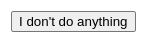
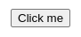
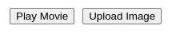
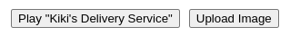
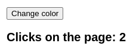
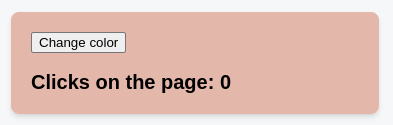

# Реакция на события

React позволяет добавлять _обработчики событий_ в JSX. Обработчики событий - это ваши собственные функции, которые будут запускаться в ответ на такие взаимодействия, как нажатие, наведение курсора, фокусировка ввода формы и так далее.

!!!tip "Вы узнаете"

    -   Различные способы написания обработчика событий
    -   Как передать логику обработки событий от родительского компонента
    -   Как распространяются события и как их остановить

## Добавление обработчиков событий

Чтобы добавить обработчик событий, вы сначала определите функцию, а затем [передадите ее как параметр](passing-props-to-a-component.md) в соответствующий JSX тег. Например, вот кнопка, которая еще ничего не делает:

<!-- 0001.part.md -->

=== "App.js"

    ```js
    export default function Button() {
    	return <button>I don't do anything</button>;
    }
    ```

=== "Результат"

    

<!-- 0002.part.md -->

Вы можете заставить его показывать сообщение, когда пользователь нажимает на кнопку, выполнив следующие три шага:

1.  Объявите функцию `handleClick` _внутри_ вашего компонента `Button`.
2.  Реализуйте логику внутри этой функции (используйте `alert` для показа сообщения).
3.  Добавьте `onClick={handleClick}` в JSX `<button>`.

=== "App.js"

    ```js
    export default function Button() {
    	function handleClick() {
    		alert('You clicked me!');
    	}

    	return <button onClick={handleClick}>Click me</button>;
    }
    ```

=== "Результат"

    

Вы определили функцию `handleClick`, а затем [передали ее как параметр](passing-props-to-a-component.md) в `<button>`. `handleClick` - это **обработчик события.** Функции обработчика события:

-   Обычно определяются _внутри_ ваших компонентов.
-   Имеют имена, начинающиеся с `handle`, за которым следует имя события.

По традиции, принято называть обработчики событий `handle`, за которым следует имя события. Часто можно встретить `onClick={handleClick}`, `onMouseEnter={handleMouseEnter}` и так далее.

В качестве альтернативы вы можете определить обработчик события в JSX:

<!-- 0007.part.md -->

```js
<button onClick={function handleClick() {
  alert('You clicked me!');
}}>
```

<!-- 0008.part.md -->

Или, более кратко, с помощью функции стрелки:

<!-- 0009.part.md -->

```js
<button onClick={() => {
  alert('You clicked me!');
}}>
```

Все эти стили эквивалентны. Инлайн-обработчики событий удобны для коротких функций.

!!!warning "Внимание"

    Функции, передаваемые в обработчики событий, должны передаваться, а не вызываться. Например:

    | передача функции (правильно)     | вызов функции (неправильно)        |
    | -------------------------------- | ---------------------------------- |
    | `<button onClick={handleClick}>` | `<button onClick={handleClick()}>` |

    Разница очень тонкая. В первом примере функция `handleClick` передается как обработчик события `onClick`. Это говорит React запомнить ее и вызывать вашу функцию только тогда, когда пользователь нажмет на кнопку.

    Во втором примере `()` в конце `handleClick()` запускает функцию _непосредственно_ во время [rendering](render-and-commit.md), без каких-либо кликов. Это происходит потому, что JavaScript внутри [JSX `{` и `}`](javascript-in-jsx-with-curly-braces.md) выполняется сразу же.

    Когда вы пишете код inline, тот же самый подводный камень проявляется по-другому:

    | передача функции (правильно)            | вызов функции (неправильно)       |
    | --------------------------------------- | --------------------------------- |
    | `<button onClick={() => alert('...')}>` | `<button onClick={alert('...')}>` |

    Передача встроенного кода таким образом не срабатывает по щелчку - он срабатывает каждый раз, когда компонент отображается:

    ```js
    // This alert fires when the component renders, not when clicked!
    <button onClick={alert('You clicked me!')}>
    ```

    Если вы хотите определить обработчик события в строке, оберните его в анонимную функцию, как показано ниже:

    ```js
    <button onClick={() => alert('You clicked me!')}>
    ```

    Вместо того чтобы выполнять внутренний код при каждом рендере, создается функция, которая будет вызвана позже.

    В обоих случаях вы хотите передать функцию:

    -   `<button onClick={handleClick}>` передает функцию `handleClick`.
    -   `<button onClick={() => alert('...')}>` передает функцию `() => alert('...')`.

    [Подробнее о стрелочных функциях.](https://javascript.info/arrow-functions-basics)

### Чтение реквизитов в обработчиках событий

Поскольку обработчики событий объявлены внутри компонента, они имеют доступ к реквизитам компонента. Вот кнопка, которая при нажатии показывает оповещение со своим реквизитом `message`:

<!-- 0015.part.md -->

=== "App.js"

    ```js
    function AlertButton({ message, children }) {
    	return (
    		<button onClick={() => alert(message)}>
    			{children}
    		</button>
    	);
    }

    export default function Toolbar() {
    	return (
    		<div>
    			<AlertButton message="Playing!">
    				Play Movie
    			</AlertButton>
    			<AlertButton message="Uploading!">
    				Upload Image
    			</AlertButton>
    		</div>
    	);
    }
    ```

=== "Результат"

    

<!-- 0018.part.md -->

Это позволяет этим двум кнопкам показывать разные сообщения. Попробуйте изменить передаваемые им сообщения.

### Передача обработчиков событий как реквизитов

Часто требуется, чтобы родительский компонент указывал обработчик событий дочернего компонента. Рассмотрим кнопки: в зависимости от того, где вы используете компонент `Button`, вы можете захотеть выполнить разные функции - возможно, одна воспроизводит фильм, а другая загружает изображение.

Для этого в качестве обработчика события передайте реквизит, который компонент получает от своего родителя, следующим образом:

<!-- 0019.part.md -->

=== "App.js"

    ```js
    function Button({ onClick, children }) {
    	return <button onClick={onClick}>{children}</button>;
    }

    function PlayButton({ movieName }) {
    	function handlePlayClick() {
    		alert(`Playing ${movieName}!`);
    	}

    	return (
    		<Button onClick={handlePlayClick}>
    			Play "{movieName}"
    		</Button>
    	);
    }

    function UploadButton() {
    	return (
    		<Button onClick={() => alert('Uploading!')}>
    			Upload Image
    		</Button>
    	);
    }

    export default function Toolbar() {
    	return (
    		<div>
    			<PlayButton movieName="Kiki's Delivery Service" />
    			<UploadButton />
    		</div>
    	);
    }
    ```

=== "Результат"

    

<!-- 0022.part.md -->

Здесь компонент `Toolbar` отображает `PlayButton` и `UploadButton`:

-   `PlayButton` передает `handlePlayClick` как свойство `onClick` для `Button` внутри.
-   `UploadButton` передает `() => alert('Uploading!')` как свойство `onClick` внутренней `кнопке`.

Наконец, ваш компонент `Button` принимает свойство `onClick`. Он передает это свойство непосредственно встроенному браузеру `<button>` с `onClick={onClick}`. Это указывает React на вызов переданной функции по щелчку.

Если вы используете [систему дизайна](https://uxdesign.cc/everything-you-need-to-know-about-design-systems-54b109851969), то обычно такие компоненты, как кнопки, содержат стиль, но не определяют поведение. Вместо этого такие компоненты, как `PlayButton` и `UploadButton`, передают обработчики событий вниз.

### Именование параметров обработчика событий

Встроенные компоненты, такие как `<button>` и `<div>`, поддерживают только [имена событий браузера](/reference/react-dom/components/common.md#common-props), такие как `onClick`. Однако, когда вы создаете свои собственные компоненты, вы можете называть их реквизиты обработчиков событий как угодно.

По соглашению, реквизиты обработчиков событий должны начинаться с `on`, за которым следует заглавная буква.

Например, реквизит `onClick` компонента `Button` можно было бы назвать `onSmash`:

<!-- 0023.part.md -->

=== "App.js"

    ```js
    function Button({ onSmash, children }) {
    	return <button onClick={onSmash}>{children}</button>;
    }

    export default function App() {
    	return (
    		<div>
    			<Button onSmash={() => alert('Playing!')}>
    				Play Movie
    			</Button>
    			<Button onSmash={() => alert('Uploading!')}>
    				Upload Image
    			</Button>
    		</div>
    	);
    }
    ```

=== "Результат"

    

<!-- 0026.part.md -->

В этом примере `<button onClick={onSmash}>` показывает, что браузеру `<button>` (строчная буква) по-прежнему нужен реквизит `onClick`, но имя реквизита, полученное вашим пользовательским компонентом `Button`, зависит от вас!

Если ваш компонент поддерживает множество взаимодействий, вы можете назвать реквизиты обработчиков событий для концепций, специфичных для конкретного приложения. Например, компонент `Toolbar` получает обработчики событий `onPlayMovie` и `onUploadImage`:

<!-- 0027.part.md -->

=== "App.js"

    ```js
    export default function App() {
    	return (
    		<Toolbar
    			onPlayMovie={() => alert('Playing!')}
    			onUploadImage={() => alert('Uploading!')}
    		/>
    	);
    }

    function Toolbar({ onPlayMovie, onUploadImage }) {
    	return (
    		<div>
    			<Button onClick={onPlayMovie}>
    				Play Movie
    			</Button>
    			<Button onClick={onUploadImage}>
    				Upload Image
    			</Button>
    		</div>
    	);
    }

    function Button({ onClick, children }) {
    	return <button onClick={onClick}>{children}</button>;
    }
    ```

=== "Результат"

    

<!-- 0030.part.md -->

Обратите внимание, что компоненту `App` не нужно знать, _что_ `Toolbar` будет делать с `onPlayMovie` или `onUploadImage`. Это деталь реализации `Toolbar`. Здесь `Toolbar` передает их как обработчики `onClick` для своих `Button`, но позже он также может вызвать их по нажатию клавиш. Именование реквизитов в честь специфических для приложения взаимодействий, таких как `onPlayMovie`, дает вам возможность гибко изменять их использование в дальнейшем.

!!!note ""

    Убедитесь, что вы используете соответствующие HTML-теги для обработчиков событий. Например, для обработки кликов используйте [`<button onClick={handleClick}>`](https://developer.mozilla.org/docs/Web/HTML/Element/button) вместо `<div onClick={handleClick}>`. Использование настоящего браузерного `<button>` позволяет использовать встроенные поведенческие характеристики браузера, такие как навигация по клавиатуре. Если вам не нравится стандартная стилизация кнопки в браузере и вы хотите сделать ее более похожей на ссылку или другой элемент пользовательского интерфейса, вы можете добиться этого с помощью CSS. [Узнайте больше](https://developer.mozilla.org/docs/Learn/Accessibility/HTML) о написании доступной разметки.

## Распространение событий

Обработчики событий также будут улавливать события от всех дочерних компонентов, которые могут быть у вашего компонента. Мы говорим, что событие "бурлит" или "распространяется" вверх по дереву: оно начинается с того места, где произошло событие, а затем поднимается вверх по дереву.

Этот `<div>` содержит две кнопки. И `<div>` _и_ каждая кнопка имеют свои собственные обработчики `onClick`. Как вы думаете, какие обработчики сработают при нажатии на кнопку?

<!-- 0031.part.md -->

=== "App.js"

    ```js
    export default function Toolbar() {
    	return (
    		<div
    			className="Toolbar"
    			onClick={() => {
    				alert('You clicked on the toolbar!');
    			}}
    		>
    			<button onClick={() => alert('Playing!')}>
    				Play Movie
    			</button>
    			<button onClick={() => alert('Uploading!')}>
    				Upload Image
    			</button>
    		</div>
    	);
    }
    ```

=== "Результат"

    

<!-- 0034.part.md -->

Если вы нажмете на любую из кнопок, сначала сработает ее `onClick`, а затем `onClick` родительской `<div>`. Таким образом, появятся два сообщения. Если щелкнуть на самой панели инструментов, то будет запущена только `onClick` родительской `<div>`.

!!!warning "Внимание"

    Все события распространяются в React, кроме `onScroll`, которое действует только на тег JSX, к которому вы его прикрепили.

### Остановка распространения

Обработчики событий получают объект **event** в качестве единственного аргумента. По традиции он обычно называется `e`, что означает "событие". Вы можете использовать этот объект для чтения информации о событии.

Этот объект события также позволяет остановить распространение. Если вы хотите, чтобы событие не достигло родительских компонентов, вам нужно вызвать `e.stopPropagation()`, как это делает компонент `Button`:

<!-- 0035.part.md -->

=== "App.js"

    ```js
    function Button({ onClick, children }) {
    	return (
    		<button
    			onClick={(e) => {
    				e.stopPropagation();
    				onClick();
    			}}
    		>
    			{children}
    		</button>
    	);
    }

    export default function Toolbar() {
    	return (
    		<div
    			className="Toolbar"
    			onClick={() => {
    				alert('You clicked on the toolbar!');
    			}}
    		>
    			<Button onClick={() => alert('Playing!')}>
    				Play Movie
    			</Button>
    			<Button onClick={() => alert('Uploading!')}>
    				Upload Image
    			</Button>
    		</div>
    	);
    }
    ```

=== "Результат"

    

<!-- 0038.part.md -->

Когда вы нажимаете на кнопку:

1.  React вызывает обработчик `onClick`, переданный в `<button>`.
2.  Этот обработчик, определенный в `Button`, делает следующее:
    -   Вызывает `e.stopPropagation()`, предотвращая дальнейшее распространение события.
    -   Вызывает функцию `onClick`, которая является реквизитом, переданным из компонента `Toolbar`.
3.  Эта функция, определенная в компоненте `Toolbar`, отображает собственное оповещение кнопки.
4.  Поскольку распространение было остановлено, обработчик `onClick` родительского `<div>` не выполняется.

В результате `e.stopPropagation()`, при нажатии на кнопки теперь отображается только одно оповещение (из `<button>`), а не оба (из `<button>` и родительской панели инструментов `<div>`). Нажатие на кнопку - это не то же самое, что нажатие на окружающую панель инструментов, поэтому остановка распространения имеет смысл для данного пользовательского интерфейса.

!!!note "Захват фазовых событий"

    В редких случаях вам может понадобиться перехватить все события на дочерних элементах, даже если они прекратили распространение. Например, вы хотите регистрировать каждый клик в аналитике, независимо от логики распространения. Вы можете сделать это, добавив `Capture` в конце имени события:

    <!-- 0039.part.md -->

    ```js
    <div
    	onClickCapture={() => {
    		/* this runs first */
    	}}
    >
    	<button onClick={(e) => e.stopPropagation()} />
    	<button onClick={(e) => e.stopPropagation()} />
    </div>
    ```

    <!-- 0040.part.md -->

    Каждое событие распространяется в три фазы:

    1.  Оно перемещается вниз, вызывая все обработчики `onClickCapture`.
    2.  Запускается обработчик `onClick` щелкнутого элемента.
    3.  Он перемещается вверх, вызывая все обработчики `onClick`.

    События захвата полезны для такого кода, как маршрутизаторы или аналитика, но вы, вероятно, не будете использовать их в коде приложений.

### Передача обработчиков как альтернатива распространению

Обратите внимание, как этот обработчик кликов выполняет строку кода _и затем_ вызывает `onClick`, переданный родителем:

```js
function Button({ onClick, children }) {
    return (
        <button
            onClick={(e) => {
                e.stopPropagation();
                onClick();
            }}
        >
            {children}
        </button>
    );
}
```

Вы можете добавить больше кода в этот обработчик перед вызовом обработчика родительского события `onClick`. Этот паттерн обеспечивает _альтернативу_ распространению. Он позволяет дочернему компоненту обрабатывать событие, в то же время позволяя родительскому компоненту задать дополнительное поведение. В отличие от распространения, он не является автоматическим. Но преимущество этого паттерна в том, что вы можете четко проследить всю цепочку кода, который выполняется в результате какого-то события.

Если вы полагаетесь на распространение и вам сложно отследить, какие обработчики выполняются и почему, попробуйте применить этот подход.

### Предотвращение поведения по умолчанию

Некоторые события браузера имеют поведение по умолчанию, связанное с ними. Например, событие отправки `<form>`, которое происходит при нажатии на кнопку внутри него, по умолчанию перезагружает всю страницу:

<!-- 0043.part.md -->

=== "App.js"

    ```js
    export default function Signup() {
    	return (
    		<form onSubmit={() => alert('Submitting!')}>
    			<input />
    			<button>Send</button>
    		</form>
    	);
    }
    ```

=== "Результат"

    

<!-- 0046.part.md -->

Чтобы этого не произошло, можно вызвать `e.preventDefault()` на объекте события:

<!-- 0047.part.md -->

=== "App.js"

    ```js
    export default function Signup() {
    	return (
    		<form
    			onSubmit={(e) => {
    				e.preventDefault();
    				alert('Submitting!');
    			}}
    		>
    			<input />
    			<button>Send</button>
    		</form>
    	);
    }
    ```

=== "Результат"

    

<!-- 0050.part.md -->

Не путайте `e.stopPropagation()` и `e.preventDefault()`. Они оба полезны, но не связаны между собой:

-   [`e.stopPropagation()`](https://developer.mozilla.org/docs/Web/API/Event/stopPropagation) останавливает срабатывание обработчиков событий, прикрепленных к вышеуказанным тегам.
-   [`e.preventDefault()`](https://developer.mozilla.org/docs/Web/API/Event/preventDefault) предотвращает поведение браузера по умолчанию для тех немногих событий, в которых он есть.

## Могут ли обработчики событий иметь побочные эффекты?

Конечно! Обработчики событий - лучшее место для побочных эффектов.

В отличие от функций рендеринга, обработчики событий не обязаны быть [чистыми](keeping-components-pure.md), поэтому это отличное место для _изменения_ чего-либо - например, изменения значения ввода в ответ на ввод текста или изменения списка в ответ на нажатие кнопки. Однако для того, чтобы изменить какую-то информацию, вам сначала нужно каким-то образом ее сохранить. В React для этого используется [state, память компонента](state-a-components-memory.md). Вы узнаете все об этом на следующей странице.

!!!note "Итоги"

    -   Вы можете обрабатывать события, передавая функцию в качестве реквизита элементу, например `<button>`.
    -   Обработчики событий должны передаваться, **а не вызываться!** `onClick={handleClick}`, а не `onClick={handleClick()}`.
    -   Вы можете определить функцию-обработчик события отдельно или в строке.
    -   Обработчики событий определяются внутри компонента, поэтому они могут обращаться к реквизитам.
    -   Вы можете объявить обработчик событий в родительском компоненте и передать его в качестве реквизита дочернему компоненту.
    -   Вы можете определить собственные реквизиты обработчика событий с именами, специфичными для конкретного приложения.
    -   События распространяются вверх. Чтобы предотвратить это, вызовите `e.stopPropagation()` для первого аргумента.
    -   События могут иметь нежелательное поведение браузера по умолчанию. Вызовите `e.preventDefault()`, чтобы предотвратить это.
    -   Явный вызов свойства обработчика события из дочернего обработчика является хорошей альтернативой распространению.

## Задачи

### 1. Исправьте обработчик события

Щелчок на этой кнопке должен переключить фон страницы между белым и черным. Однако при нажатии ничего не происходит. Исправьте проблему. (Не беспокойтесь о логике внутри `handleClick` - эта часть в порядке).

<!-- 0051.part.md -->

=== "App.js"

    ```js
    export default function LightSwitch() {
    	function handleClick() {
    		let bodyStyle = document.body.style;
    		if (bodyStyle.backgroundColor === 'black') {
    			bodyStyle.backgroundColor = 'white';
    		} else {
    			bodyStyle.backgroundColor = 'black';
    		}
    	}

    	return (
    		<button onClick={handleClick()}>
    			Toggle the lights
    		</button>
    	);
    }
    ```

=== "Результат"

    

???success "Показать решение"

    Проблема в том, что `<button onClick={handleClick()}>` _вызывает_ функцию `handleClick` во время рендеринга вместо того, чтобы _передать_ ее. Удаление вызова `()`, чтобы было `<button onClick={handleClick}>` устраняет проблему:

    === "App.js"

    	```js
    	export default function LightSwitch() {
    		function handleClick() {
    			let bodyStyle = document.body.style;
    			if (bodyStyle.backgroundColor === 'black') {
    				bodyStyle.backgroundColor = 'white';
    			} else {
    				bodyStyle.backgroundColor = 'black';
    			}
    		}

    		return (
    			<button onClick={handleClick}>
    				Toggle the lights
    			</button>
    		);
    	}
    	```

    === "Результат"

    	

    В качестве альтернативы можно обернуть вызов в другую функцию, например `<button onClick={() => handleClick()}>`:

    === "App.js"

    	```js
    	export default function LightSwitch() {
    		function handleClick() {
    			let bodyStyle = document.body.style;
    			if (bodyStyle.backgroundColor === 'black') {
    				bodyStyle.backgroundColor = 'white';
    			} else {
    				bodyStyle.backgroundColor = 'black';
    			}
    		}

    		return (
    			<button onClick={() => handleClick()}>
    				Toggle the lights
    			</button>
    		);
    	}
    	```

    === "Результат"

    	

### 2. Подключение событий

Этот компонент `ColorSwitch` отображает кнопку. Он должен менять цвет страницы. Подключите его к обработчику события `onChangeColor`, который он получает от родителя, чтобы щелчок по кнопке изменил цвет.

После того, как вы это сделаете, обратите внимание, что нажатие на кнопку также увеличивает счетчик нажатий на страницу. Ваш коллега, написавший родительский компонент, настаивает, что `onChangeColor` не увеличивает никаких счетчиков. Что еще может происходить? Исправьте это так, чтобы нажатие на кнопку _только_ изменяло цвет и _не_ увеличивало счетчик.

<!-- 0057.part.md -->

=== "App.js"

    ```js
    export default function ColorSwitch({ onChangeColor }) {
    	return <button>Change color</button>;
    }
    ```

=== "Результат"

    

???success "Показать решение"

    Сначала нужно добавить обработчик события, например `<button onClick={onChangeColor}>`.

    Однако это влечет за собой проблему увеличивающегося счетчика. Если `onChangeColor` не делает этого, как настаивает ваш коллега, то проблема в том, что это событие распространяется вверх, и какой-то обработчик выше делает это. Чтобы решить эту проблему, нужно остановить распространение. Но не забывайте, что вы все равно должны вызвать `onChangeColor`.

    === "App.js"

    	```js
    	export default function ColorSwitch({ onChangeColor }) {
    		return (
    			<button
    				onClick={(e) => {
    					e.stopPropagation();
    					onChangeColor();
    				}}
    			>
    				Change color
    			</button>
    		);
    	}
    	```

    === "Результат"

    	

## Ссылки

-   [https://react.dev/learn/responding-to-events](https://react.dev/learn/responding-to-events)
