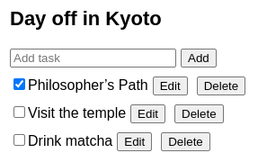

# Расширение с помощью редуктора и контекста

Редукторы позволяют консолидировать логику обновления состояния компонента. Контекст позволяет передавать информацию вглубь других компонентов. Вы можете объединить редукторы и контекст для управления состоянием сложного экрана.

!!!tip "Вы узнаете"

    -   Как объединить редуктор и контекст
    -   Как избежать передачи состояния и диспетчеризации через параметры
    -   Как хранить логику контекста и состояния в отдельном файле

## Объединение редуктора с контекстом

В этом примере из [the introduction to reducers](extracting-state-logic-into-a-reducer.md) состояние управляется редуктором. Функция reducer содержит всю логику обновления состояния и объявлена в нижней части этого файла:

=== "App.js"

    ```js
    import { useReducer } from 'react';
    import AddTask from './AddTask.js';
    import TaskList from './TaskList.js';

    export default function TaskApp() {
    	const [tasks, dispatch] = useReducer(
    		tasksReducer,
    		initialTasks
    	);

    	function handleAddTask(text) {
    		dispatch({
    			type: 'added',
    			id: nextId++,
    			text: text,
    		});
    	}

    	function handleChangeTask(task) {
    		dispatch({
    			type: 'changed',
    			task: task,
    		});
    	}

    	function handleDeleteTask(taskId) {
    		dispatch({
    			type: 'deleted',
    			id: taskId,
    		});
    	}

    	return (
    		<>
    			<h1>Day off in Kyoto</h1>
    			<AddTask onAddTask={handleAddTask} />
    			<TaskList
    				tasks={tasks}
    				onChangeTask={handleChangeTask}
    				onDeleteTask={handleDeleteTask}
    			/>
    		</>
    	);
    }

    function tasksReducer(tasks, action) {
    	switch (action.type) {
    		case 'added': {
    			return [
    				...tasks,
    				{
    					id: action.id,
    					text: action.text,
    					done: false,
    				},
    			];
    		}
    		case 'changed': {
    			return tasks.map((t) => {
    				if (t.id === action.task.id) {
    					return action.task;
    				} else {
    					return t;
    				}
    			});
    		}
    		case 'deleted': {
    			return tasks.filter((t) => t.id !== action.id);
    		}
    		default: {
    			throw Error('Unknown action: ' + action.type);
    		}
    	}
    }

    let nextId = 3;
    const initialTasks = [
    	{ id: 0, text: 'Philosopher’s Path', done: true },
    	{ id: 1, text: 'Visit the temple', done: false },
    	{ id: 2, text: 'Drink matcha', done: false },
    ];
    ```

=== "AddTask.js"

    ```js
    import { useState } from 'react';

    export default function AddTask({ onAddTask }) {
    	const [text, setText] = useState('');
    	return (
    		<>
    			<input
    				placeholder="Add task"
    				value={text}
    				onChange={(e) => setText(e.target.value)}
    			/>
    			<button
    				onClick={() => {
    					setText('');
    					onAddTask(text);
    				}}
    			>
    				Add
    			</button>
    		</>
    	);
    }
    ```

=== "TaskList.js"

    ```js
    import { useState } from 'react';

    export default function TaskList({
    	tasks,
    	onChangeTask,
    	onDeleteTask,
    }) {
    	return (
    		<ul>
    			{tasks.map((task) => (
    				<li key={task.id}>
    					<Task
    						task={task}
    						onChange={onChangeTask}
    						onDelete={onDeleteTask}
    					/>
    				</li>
    			))}
    		</ul>
    	);
    }

    function Task({ task, onChange, onDelete }) {
    	const [isEditing, setIsEditing] = useState(false);
    	let taskContent;
    	if (isEditing) {
    		taskContent = (
    			<>
    				<input
    					value={task.text}
    					onChange={(e) => {
    						onChange({
    							...task,
    							text: e.target.value,
    						});
    					}}
    				/>
    				<button onClick={() => setIsEditing(false)}>
    					Save
    				</button>
    			</>
    		);
    	} else {
    		taskContent = (
    			<>
    				{task.text}
    				<button onClick={() => setIsEditing(true)}>
    					Edit
    				</button>
    			</>
    		);
    	}
    	return (
    		<label>
    			<input
    				type="checkbox"
    				checked={task.done}
    				onChange={(e) => {
    					onChange({
    						...task,
    						done: e.target.checked,
    					});
    				}}
    			/>
    			{taskContent}
    			<button onClick={() => onDelete(task.id)}>
    				Delete
    			</button>
    		</label>
    	);
    }
    ```

=== "Результат"

    

<!-- 0008.part.md -->

Редуктор помогает сделать обработчики событий короткими и лаконичными. Однако по мере роста вашего приложения вы можете столкнуться с другой трудностью. **В настоящее время состояние `tasks` и функция `dispatch` доступны только в компоненте верхнего уровня `TaskApp`.** Чтобы позволить другим компонентам читать список задач или изменять его, вы должны явно [передать вниз](passing-props-to-a-component.md) текущее состояние и обработчики событий, которые изменяют его, как пропсы.

Например, `TaskApp` передает список задач и обработчики событий в `TaskList`:

<!-- 0009.part.md -->

```js
<TaskList
    tasks={tasks}
    onChangeTask={handleChangeTask}
    onDeleteTask={handleDeleteTask}
/>
```

<!-- 0010.part.md -->

А `TaskList` передает обработчики событий в `Task`:

<!-- 0011.part.md -->

```js
<Task
    task={task}
    onChange={onChangeTask}
    onDelete={onDeleteTask}
/>
```

<!-- 0012.part.md -->

В небольшом примере, подобном этому, это работает хорошо, но если у вас в центре десятки или сотни компонентов, передача всех состояний и функций может оказаться весьма разорительной!

Вот почему, в качестве альтернативы передаче через пропсы, вы можете поместить состояние `tasks` и функцию `dispatch` [в контекст](passing-data-deeply-with-context.md) **Таким образом, любой компонент ниже `TaskApp` в дереве может читать задачи и отправлять действия без повторяющегося "бурения пропсов "**.

Вот как можно объединить reducer с контекстом:

1.  **Создайте** контекст.
2.  **Поместить** состояние и диспетчеризацию в контекст.
3.  **Использовать** контекст в любом месте дерева.

### Шаг 1: Создание контекста

Хук `useReducer` возвращает текущие `задачи` и функцию `dispatch`, которая позволяет вам обновить их:

<!-- 0013.part.md -->

```js
const [tasks, dispatch] = useReducer(
    tasksReducer,
    initialTasks
);
```

<!-- 0014.part.md -->

Чтобы передать их по дереву, вы [создадите](passing-data-deeply-with-context.md) два отдельных контекста:

-   `TasksContext` предоставляет текущий список задач.
-   `TasksDispatchContext` предоставляет функцию, которая позволяет компонентам диспетчеризировать действия.

Экспортируйте их из отдельного файла, чтобы впоследствии вы могли импортировать их из других файлов:

=== "App.js"

    ```js
    import { useReducer } from 'react';
    import AddTask from './AddTask.js';
    import TaskList from './TaskList.js';

    export default function TaskApp() {
    	const [tasks, dispatch] = useReducer(
    		tasksReducer,
    		initialTasks
    	);

    	function handleAddTask(text) {
    		dispatch({
    			type: 'added',
    			id: nextId++,
    			text: text,
    		});
    	}

    	function handleChangeTask(task) {
    		dispatch({
    			type: 'changed',
    			task: task,
    		});
    	}

    	function handleDeleteTask(taskId) {
    		dispatch({
    			type: 'deleted',
    			id: taskId,
    		});
    	}

    	return (
    		<>
    			<h1>Day off in Kyoto</h1>
    			<AddTask onAddTask={handleAddTask} />
    			<TaskList
    				tasks={tasks}
    				onChangeTask={handleChangeTask}
    				onDeleteTask={handleDeleteTask}
    			/>
    		</>
    	);
    }

    function tasksReducer(tasks, action) {
    	switch (action.type) {
    		case 'added': {
    			return [
    				...tasks,
    				{
    					id: action.id,
    					text: action.text,
    					done: false,
    				},
    			];
    		}
    		case 'changed': {
    			return tasks.map((t) => {
    				if (t.id === action.task.id) {
    					return action.task;
    				} else {
    					return t;
    				}
    			});
    		}
    		case 'deleted': {
    			return tasks.filter((t) => t.id !== action.id);
    		}
    		default: {
    			throw Error('Unknown action: ' + action.type);
    		}
    	}
    }

    let nextId = 3;
    const initialTasks = [
    	{ id: 0, text: 'Philosopher’s Path', done: true },
    	{ id: 1, text: 'Visit the temple', done: false },
    	{ id: 2, text: 'Drink matcha', done: false },
    ];
    ```

=== "TasksContext.js"

    ```js
    import { createContext } from 'react';

    export const TasksContext = createContext(null);
    export const TasksDispatchContext = createContext(null);
    ```

=== "AddTask.js"

    ```js
    import { useState } from 'react';

    export default function AddTask({ onAddTask }) {
    	const [text, setText] = useState('');
    	return (
    		<>
    			<input
    				placeholder="Add task"
    				value={text}
    				onChange={(e) => setText(e.target.value)}
    			/>
    			<button
    				onClick={() => {
    					setText('');
    					onAddTask(text);
    				}}
    			>
    				Add
    			</button>
    		</>
    	);
    }
    ```

=== "TaskList.js"

    ```js
    import { useState } from 'react';

    export default function TaskList({
    	tasks,
    	onChangeTask,
    	onDeleteTask,
    }) {
    	return (
    		<ul>
    			{tasks.map((task) => (
    				<li key={task.id}>
    					<Task
    						task={task}
    						onChange={onChangeTask}
    						onDelete={onDeleteTask}
    					/>
    				</li>
    			))}
    		</ul>
    	);
    }

    function Task({ task, onChange, onDelete }) {
    	const [isEditing, setIsEditing] = useState(false);
    	let taskContent;
    	if (isEditing) {
    		taskContent = (
    			<>
    				<input
    					value={task.text}
    					onChange={(e) => {
    						onChange({
    							...task,
    							text: e.target.value,
    						});
    					}}
    				/>
    				<button onClick={() => setIsEditing(false)}>
    					Save
    				</button>
    			</>
    		);
    	} else {
    		taskContent = (
    			<>
    				{task.text}
    				<button onClick={() => setIsEditing(true)}>
    					Edit
    				</button>
    			</>
    		);
    	}
    	return (
    		<label>
    			<input
    				type="checkbox"
    				checked={task.done}
    				onChange={(e) => {
    					onChange({
    						...task,
    						done: e.target.checked,
    					});
    				}}
    			/>
    			{taskContent}
    			<button onClick={() => onDelete(task.id)}>
    				Delete
    			</button>
    		</label>
    	);
    }
    ```

=== "Результат"

    

Здесь вы передаете `null` в качестве значения по умолчанию в оба контекста. Фактические значения будут предоставлены компонентом `TaskApp`.

### Шаг 2: Поместите состояние и диспетчеризацию в контекст

Теперь вы можете импортировать оба контекста в компонент `TaskApp`. Возьмите `tasks` и `dispatch`, возвращенные `useReducer()`, и [предоставьте их](passing-data-deeply-with-context.md) всему дереву ниже:

<!-- 0025.part.md -->

```js
import {
    TasksContext,
    TasksDispatchContext,
} from './TasksContext.js';

export default function TaskApp() {
    const [tasks, dispatch] = useReducer(
        tasksReducer,
        initialTasks
    );
    // ...
    return (
        <TasksContext.Provider value={tasks}>
            <TasksDispatchContext.Provider value={dispatch}>
                ...
            </TasksDispatchContext.Provider>
        </TasksContext.Provider>
    );
}
```

<!-- 0026.part.md -->

Пока что вы передаете информацию как через пропс, так и в контексте:

=== "App.js"

    ```js
    import { useReducer } from 'react';
    import AddTask from './AddTask.js';
    import TaskList from './TaskList.js';
    import {
    	TasksContext,
    	TasksDispatchContext,
    } from './TasksContext.js';

    export default function TaskApp() {
    	const [tasks, dispatch] = useReducer(
    		tasksReducer,
    		initialTasks
    	);

    	function handleAddTask(text) {
    		dispatch({
    			type: 'added',
    			id: nextId++,
    			text: text,
    		});
    	}

    	function handleChangeTask(task) {
    		dispatch({
    			type: 'changed',
    			task: task,
    		});
    	}

    	function handleDeleteTask(taskId) {
    		dispatch({
    			type: 'deleted',
    			id: taskId,
    		});
    	}

    	return (
    		<TasksContext.Provider value={tasks}>
    			<TasksDispatchContext.Provider value={dispatch}>
    				<h1>Day off in Kyoto</h1>
    				<AddTask onAddTask={handleAddTask} />
    				<TaskList
    					tasks={tasks}
    					onChangeTask={handleChangeTask}
    					onDeleteTask={handleDeleteTask}
    				/>
    			</TasksDispatchContext.Provider>
    		</TasksContext.Provider>
    	);
    }

    function tasksReducer(tasks, action) {
    	switch (action.type) {
    		case 'added': {
    			return [
    				...tasks,
    				{
    					id: action.id,
    					text: action.text,
    					done: false,
    				},
    			];
    		}
    		case 'changed': {
    			return tasks.map((t) => {
    				if (t.id === action.task.id) {
    					return action.task;
    				} else {
    					return t;
    				}
    			});
    		}
    		case 'deleted': {
    			return tasks.filter((t) => t.id !== action.id);
    		}
    		default: {
    			throw Error('Unknown action: ' + action.type);
    		}
    	}
    }

    let nextId = 3;
    const initialTasks = [
    	{ id: 0, text: 'Philosopher’s Path', done: true },
    	{ id: 1, text: 'Visit the temple', done: false },
    	{ id: 2, text: 'Drink matcha', done: false },
    ];
    ```

=== "TasksContext.js"

    ```js
    import { createContext } from 'react';

    export const TasksContext = createContext(null);
    export const TasksDispatchContext = createContext(null);
    ```

=== "AddTask.js"

    ```js
    import { useState } from 'react';

    export default function AddTask({ onAddTask }) {
    	const [text, setText] = useState('');
    	return (
    		<>
    			<input
    				placeholder="Add task"
    				value={text}
    				onChange={(e) => setText(e.target.value)}
    			/>
    			<button
    				onClick={() => {
    					setText('');
    					onAddTask(text);
    				}}
    			>
    				Add
    			</button>
    		</>
    	);
    }
    ```

=== "TaskList.js"

    ```js
    import { useState } from 'react';

    export default function TaskList({
    	tasks,
    	onChangeTask,
    	onDeleteTask,
    }) {
    	return (
    		<ul>
    			{tasks.map((task) => (
    				<li key={task.id}>
    					<Task
    						task={task}
    						onChange={onChangeTask}
    						onDelete={onDeleteTask}
    					/>
    				</li>
    			))}
    		</ul>
    	);
    }

    function Task({ task, onChange, onDelete }) {
    	const [isEditing, setIsEditing] = useState(false);
    	let taskContent;
    	if (isEditing) {
    		taskContent = (
    			<>
    				<input
    					value={task.text}
    					onChange={(e) => {
    						onChange({
    							...task,
    							text: e.target.value,
    						});
    					}}
    				/>
    				<button onClick={() => setIsEditing(false)}>
    					Save
    				</button>
    			</>
    		);
    	} else {
    		taskContent = (
    			<>
    				{task.text}
    				<button onClick={() => setIsEditing(true)}>
    					Edit
    				</button>
    			</>
    		);
    	}
    	return (
    		<label>
    			<input
    				type="checkbox"
    				checked={task.done}
    				onChange={(e) => {
    					onChange({
    						...task,
    						done: e.target.checked,
    					});
    				}}
    			/>
    			{taskContent}
    			<button onClick={() => onDelete(task.id)}>
    				Delete
    			</button>
    		</label>
    	);
    }
    ```

=== "Результат"

    

<!-- 0036.part.md -->

В следующем шаге вы удалите передачу пропса.

### Шаг 3: Используйте контекст в любом месте дерева

Теперь вам не нужно передавать список задач или обработчики событий вниз по дереву:

<!-- 0037.part.md -->

```js
<TasksContext.Provider value={tasks}>
    <TasksDispatchContext.Provider value={dispatch}>
        <h1>Day off in Kyoto</h1>
        <AddTask />
        <TaskList />
    </TasksDispatchContext.Provider>
</TasksContext.Provider>
```

<!-- 0038.part.md -->

Вместо этого, любой компонент, которому нужен список задач, может прочитать его из `TaskContext`:

<!-- 0039.part.md -->

```js
export default function TaskList() {
    const tasks = useContext(TasksContext);
    // ...
}
```

<!-- 0040.part.md -->

Чтобы обновить список задач, любой компонент может прочитать функцию `dispatch` из контекста и вызвать ее:

<!-- 0041.part.md -->

```js
export default function AddTask() {
    const [text, setText] = useState('');
    const dispatch = useContext(TasksDispatchContext);
    // ...
    return (
        // ...
        <button
            onClick={() => {
                setText('');
                dispatch({
                    type: 'added',
                    id: nextId++,
                    text: text,
                });
            }}
        >
            Add
        </button>
        // ...
    );
}
```

<!-- 0042.part.md -->

**Компонент `TaskApp` не передает никаких обработчиков событий вниз, а `TaskList` также не передает никаких обработчиков событий компоненту `Task`.** Каждый компонент считывает контекст, который ему необходим:

=== "App.js"

    ```js
    import { useReducer } from 'react';
    import AddTask from './AddTask.js';
    import TaskList from './TaskList.js';
    import {
    	TasksContext,
    	TasksDispatchContext,
    } from './TasksContext.js';

    export default function TaskApp() {
    	const [tasks, dispatch] = useReducer(
    		tasksReducer,
    		initialTasks
    	);

    	return (
    		<TasksContext.Provider value={tasks}>
    			<TasksDispatchContext.Provider value={dispatch}>
    				<h1>Day off in Kyoto</h1>
    				<AddTask />
    				<TaskList />
    			</TasksDispatchContext.Provider>
    		</TasksContext.Provider>
    	);
    }

    function tasksReducer(tasks, action) {
    	switch (action.type) {
    		case 'added': {
    			return [
    				...tasks,
    				{
    					id: action.id,
    					text: action.text,
    					done: false,
    				},
    			];
    		}
    		case 'changed': {
    			return tasks.map((t) => {
    				if (t.id === action.task.id) {
    					return action.task;
    				} else {
    					return t;
    				}
    			});
    		}
    		case 'deleted': {
    			return tasks.filter((t) => t.id !== action.id);
    		}
    		default: {
    			throw Error('Unknown action: ' + action.type);
    		}
    	}
    }

    const initialTasks = [
    	{ id: 0, text: 'Philosopher’s Path', done: true },
    	{ id: 1, text: 'Visit the temple', done: false },
    	{ id: 2, text: 'Drink matcha', done: false },
    ];
    ```

=== "TasksContext.js"

    ```js
    import { createContext } from 'react';

    export const TasksContext = createContext(null);
    export const TasksDispatchContext = createContext(null);
    ```

=== "AddTask.js"

    ```js
    import { useState, useContext } from 'react';
    import { TasksDispatchContext } from './TasksContext.js';

    export default function AddTask() {
    	const [text, setText] = useState('');
    	const dispatch = useContext(TasksDispatchContext);
    	return (
    		<>
    			<input
    				placeholder="Add task"
    				value={text}
    				onChange={(e) => setText(e.target.value)}
    			/>
    			<button
    				onClick={() => {
    					setText('');
    					dispatch({
    						type: 'added',
    						id: nextId++,
    						text: text,
    					});
    				}}
    			>
    				Add
    			</button>
    		</>
    	);
    }

    let nextId = 3;
    ```

=== "TaskList.js"

    ```js
    import { useState, useContext } from 'react';
    import {
    	TasksContext,
    	TasksDispatchContext,
    } from './TasksContext.js';

    export default function TaskList() {
    	const tasks = useContext(TasksContext);
    	return (
    		<ul>
    			{tasks.map((task) => (
    				<li key={task.id}>
    					<Task task={task} />
    				</li>
    			))}
    		</ul>
    	);
    }

    function Task({ task }) {
    	const [isEditing, setIsEditing] = useState(false);
    	const dispatch = useContext(TasksDispatchContext);
    	let taskContent;
    	if (isEditing) {
    		taskContent = (
    			<>
    				<input
    					value={task.text}
    					onChange={(e) => {
    						dispatch({
    							type: 'changed',
    							task: {
    								...task,
    								text: e.target.value,
    							},
    						});
    					}}
    				/>
    				<button onClick={() => setIsEditing(false)}>
    					Save
    				</button>
    			</>
    		);
    	} else {
    		taskContent = (
    			<>
    				{task.text}
    				<button onClick={() => setIsEditing(true)}>
    					Edit
    				</button>
    			</>
    		);
    	}
    	return (
    		<label>
    			<input
    				type="checkbox"
    				checked={task.done}
    				onChange={(e) => {
    					dispatch({
    						type: 'changed',
    						task: {
    							...task,
    							done: e.target.checked,
    						},
    					});
    				}}
    			/>
    			{taskContent}
    			<button
    				onClick={() => {
    					dispatch({
    						type: 'deleted',
    						id: task.id,
    					});
    				}}
    			>
    				Delete
    			</button>
    		</label>
    	);
    }
    ```

=== "Результат"

    

<!-- 0052.part.md -->

**Состояние по-прежнему "живет" в компоненте верхнего уровня `TaskApp`, управляемом с помощью `useReducer`.** Но его `задачи` и `dispatch` теперь доступны каждому компоненту ниже в дереве путем импорта и использования этих контекстов.

## Перемещение всех проводов в один файл

Это необязательно делать, но вы можете еще больше упростить компоненты, переместив и редуктор, и контекст в один файл. В настоящее время `TasksContext.js` содержит только два объявления контекста:

<!-- 0053.part.md -->

```js
import { createContext } from 'react';

export const TasksContext = createContext(null);
export const TasksDispatchContext = createContext(null);
```

<!-- 0054.part.md -->

Этот файл скоро будет переполнен! Вы переместите редуктор в этот же файл. Затем вы объявите новый компонент `TasksProvider` в том же файле. Этот компонент свяжет все части вместе:

1.  Он будет управлять состоянием с помощью редуктора.
2.  Он будет предоставлять оба контекста компонентам ниже.
3.  Он будет [принимать `children` как пропс](passing-props-to-a-component.md), чтобы вы могли передавать ему JSX.

<!-- конец списка -->

<!-- 0055.part.md -->

```js
export function TasksProvider({ children }) {
    const [tasks, dispatch] = useReducer(
        tasksReducer,
        initialTasks
    );

    return (
        <TasksContext.Provider value={tasks}>
            <TasksDispatchContext.Provider value={dispatch}>
                {children}
            </TasksDispatchContext.Provider>
        </TasksContext.Provider>
    );
}
```

<!-- 0056.part.md -->

**Это удаляет всю сложность и проводку из вашего компонента `TaskApp`:**.

=== "App.js"

    ```js
    import AddTask from './AddTask.js';
    import TaskList from './TaskList.js';
    import { TasksProvider } from './TasksContext.js';

    export default function TaskApp() {
    	return (
    		<TasksProvider>
    			<h1>Day off in Kyoto</h1>
    			<AddTask />
    			<TaskList />
    		</TasksProvider>
    	);
    }
    ```

=== "TasksContext.js"

    ```js
    import { createContext, useReducer } from 'react';

    export const TasksContext = createContext(null);
    export const TasksDispatchContext = createContext(null);

    export function TasksProvider({ children }) {
    	const [tasks, dispatch] = useReducer(
    		tasksReducer,
    		initialTasks
    	);

    	return (
    		<TasksContext.Provider value={tasks}>
    			<TasksDispatchContext.Provider value={dispatch}>
    				{children}
    			</TasksDispatchContext.Provider>
    		</TasksContext.Provider>
    	);
    }

    function tasksReducer(tasks, action) {
    	switch (action.type) {
    		case 'added': {
    			return [
    				...tasks,
    				{
    					id: action.id,
    					text: action.text,
    					done: false,
    				},
    			];
    		}
    		case 'changed': {
    			return tasks.map((t) => {
    				if (t.id === action.task.id) {
    					return action.task;
    				} else {
    					return t;
    				}
    			});
    		}
    		case 'deleted': {
    			return tasks.filter((t) => t.id !== action.id);
    		}
    		default: {
    			throw Error('Unknown action: ' + action.type);
    		}
    	}
    }

    const initialTasks = [
    	{ id: 0, text: 'Philosopher’s Path', done: true },
    	{ id: 1, text: 'Visit the temple', done: false },
    	{ id: 2, text: 'Drink matcha', done: false },
    ];
    ```

=== "AddTask.js"

    ```js
    import { useState, useContext } from 'react';
    import { TasksDispatchContext } from './TasksContext.js';

    export default function AddTask() {
    	const [text, setText] = useState('');
    	const dispatch = useContext(TasksDispatchContext);
    	return (
    		<>
    			<input
    				placeholder="Add task"
    				value={text}
    				onChange={(e) => setText(e.target.value)}
    			/>
    			<button
    				onClick={() => {
    					setText('');
    					dispatch({
    						type: 'added',
    						id: nextId++,
    						text: text,
    					});
    				}}
    			>
    				Add
    			</button>
    		</>
    	);
    }

    let nextId = 3;
    ```

=== "TaskList.js"

    ```js
    import { useState, useContext } from 'react';
    import {
    	TasksContext,
    	TasksDispatchContext,
    } from './TasksContext.js';

    export default function TaskList() {
    	const tasks = useContext(TasksContext);
    	return (
    		<ul>
    			{tasks.map((task) => (
    				<li key={task.id}>
    					<Task task={task} />
    				</li>
    			))}
    		</ul>
    	);
    }

    function Task({ task }) {
    	const [isEditing, setIsEditing] = useState(false);
    	const dispatch = useContext(TasksDispatchContext);
    	let taskContent;
    	if (isEditing) {
    		taskContent = (
    			<>
    				<input
    					value={task.text}
    					onChange={(e) => {
    						dispatch({
    							type: 'changed',
    							task: {
    								...task,
    								text: e.target.value,
    							},
    						});
    					}}
    				/>
    				<button onClick={() => setIsEditing(false)}>
    					Save
    				</button>
    			</>
    		);
    	} else {
    		taskContent = (
    			<>
    				{task.text}
    				<button onClick={() => setIsEditing(true)}>
    					Edit
    				</button>
    			</>
    		);
    	}
    	return (
    		<label>
    			<input
    				type="checkbox"
    				checked={task.done}
    				onChange={(e) => {
    					dispatch({
    						type: 'changed',
    						task: {
    							...task,
    							done: e.target.checked,
    						},
    					});
    				}}
    			/>
    			{taskContent}
    			<button
    				onClick={() => {
    					dispatch({
    						type: 'deleted',
    						id: task.id,
    					});
    				}}
    			>
    				Delete
    			</button>
    		</label>
    	);
    }
    ```

=== "Результат"

    

<!-- 0066.part.md -->

Вы также можете экспортировать функции, которые _используют_ контекст из `TasksContext.js`:

<!-- 0067.part.md -->

```js
export function useTasks() {
    return useContext(TasksContext);
}

export function useTasksDispatch() {
    return useContext(TasksDispatchContext);
}
```

<!-- 0068.part.md -->

Когда компоненту нужно прочитать контекст, он может сделать это с помощью этих функций:

<!-- 0069.part.md -->

```js
const tasks = useTasks();
const dispatch = useTasksDispatch();
```

<!-- 0070.part.md -->

Это никак не меняет поведение, но позволяет вам впоследствии разделить эти контексты еще больше или добавить некоторую логику в эти функции. **Сейчас вся проводка контекста и редуктора находится в `TasksContext.js`. Это сохраняет компоненты чистыми и незагроможденными, сосредоточенными на том, что они отображают, а не на том, откуда они получают данные:**.

=== "App.js"

    ```js
    import AddTask from './AddTask.js';
    import TaskList from './TaskList.js';
    import { TasksProvider } from './TasksContext.js';

    export default function TaskApp() {
    	return (
    		<TasksProvider>
    			<h1>Day off in Kyoto</h1>
    			<AddTask />
    			<TaskList />
    		</TasksProvider>
    	);
    }
    ```

=== "TasksContext.js"

    ```js
    import {
    	createContext,
    	useContext,
    	useReducer,
    } from 'react';

    const TasksContext = createContext(null);

    const TasksDispatchContext = createContext(null);

    export function TasksProvider({ children }) {
    	const [tasks, dispatch] = useReducer(
    		tasksReducer,
    		initialTasks
    	);

    	return (
    		<TasksContext.Provider value={tasks}>
    			<TasksDispatchContext.Provider value={dispatch}>
    				{children}
    			</TasksDispatchContext.Provider>
    		</TasksContext.Provider>
    	);
    }

    export function useTasks() {
    	return useContext(TasksContext);
    }

    export function useTasksDispatch() {
    	return useContext(TasksDispatchContext);
    }

    function tasksReducer(tasks, action) {
    	switch (action.type) {
    		case 'added': {
    			return [
    				...tasks,
    				{
    					id: action.id,
    					text: action.text,
    					done: false,
    				},
    			];
    		}
    		case 'changed': {
    			return tasks.map((t) => {
    				if (t.id === action.task.id) {
    					return action.task;
    				} else {
    					return t;
    				}
    			});
    		}
    		case 'deleted': {
    			return tasks.filter((t) => t.id !== action.id);
    		}
    		default: {
    			throw Error('Unknown action: ' + action.type);
    		}
    	}
    }

    const initialTasks = [
    	{ id: 0, text: 'Philosopher’s Path', done: true },
    	{ id: 1, text: 'Visit the temple', done: false },
    	{ id: 2, text: 'Drink matcha', done: false },
    ];
    ```

=== "AddTask.js"

    ```js
    import { useState } from 'react';
    import { useTasksDispatch } from './TasksContext.js';

    export default function AddTask() {
    	const [text, setText] = useState('');
    	const dispatch = useTasksDispatch();
    	return (
    		<>
    			<input
    				placeholder="Add task"
    				value={text}
    				onChange={(e) => setText(e.target.value)}
    			/>
    			<button
    				onClick={() => {
    					setText('');
    					dispatch({
    						type: 'added',
    						id: nextId++,
    						text: text,
    					});
    				}}
    			>
    				Add
    			</button>
    		</>
    	);
    }

    let nextId = 3;
    ```

=== "TaskList.js"

    ```js
    import { useState } from 'react';
    import {
    	useTasks,
    	useTasksDispatch,
    } from './TasksContext.js';

    export default function TaskList() {
    	const tasks = useTasks();
    	return (
    		<ul>
    			{tasks.map((task) => (
    				<li key={task.id}>
    					<Task task={task} />
    				</li>
    			))}
    		</ul>
    	);
    }

    function Task({ task }) {
    	const [isEditing, setIsEditing] = useState(false);
    	const dispatch = useTasksDispatch();
    	let taskContent;
    	if (isEditing) {
    		taskContent = (
    			<>
    				<input
    					value={task.text}
    					onChange={(e) => {
    						dispatch({
    							type: 'changed',
    							task: {
    								...task,
    								text: e.target.value,
    							},
    						});
    					}}
    				/>
    				<button onClick={() => setIsEditing(false)}>
    					Save
    				</button>
    			</>
    		);
    	} else {
    		taskContent = (
    			<>
    				{task.text}
    				<button onClick={() => setIsEditing(true)}>
    					Edit
    				</button>
    			</>
    		);
    	}
    	return (
    		<label>
    			<input
    				type="checkbox"
    				checked={task.done}
    				onChange={(e) => {
    					dispatch({
    						type: 'changed',
    						task: {
    							...task,
    							done: e.target.checked,
    						},
    					});
    				}}
    			/>
    			{taskContent}
    			<button
    				onClick={() => {
    					dispatch({
    						type: 'deleted',
    						id: task.id,
    					});
    				}}
    			>
    				Delete
    			</button>
    		</label>
    	);
    }
    ```

=== "Результат"

    

<!-- 0080.part.md -->

Вы можете рассматривать `TasksProvider` как часть экрана, которая знает, как работать с задачами, `useTasks` - как способ их чтения, а `useTasksDispatch` - как способ их обновления из любого компонента ниже в дереве.

!!!note ""

    Функции типа `useTasks` и `useTasksDispatch` называются _[Custom Hooks.](reusing-logic-with-custom-hooks.md)_ Ваша функция считается пользовательским хуком, если ее имя начинается с `use`. Это позволяет вам использовать внутри нее другие хуки, например `useContext`.

По мере роста вашего приложения у вас может быть много пар контекст-редуктор, подобных этой. Это мощный способ масштабировать ваше приложение и [поднимать состояние вверх](sharing-state-between-components.md) без лишней работы всякий раз, когда вы хотите получить доступ к данным в глубине дерева.

!!!note "Итоги"

    -   Вы можете объединить reducer с контекстом, чтобы позволить любому компоненту читать и обновлять состояние над ним.
    -   Чтобы предоставить состояние и функцию диспетчеризации компонентам ниже:
    	1.  Создайте два контекста (для состояния и для диспетчерской функции).
    	2.  Предоставьте оба контекста из компонента, который использует reducer.
    	3.  Используйте любой из контекстов от компонентов, которым необходимо их прочитать.
    -   Вы можете еще более упростить компоненты, перенеся все проводки в один файл.
    	-   Вы можете экспортировать компонент типа `TasksProvider`, который предоставляет контекст.
    	-   Вы также можете экспортировать пользовательские хуки типа `useTasks` и `useTasksDispatch` для его чтения.
    -   В вашем приложении может быть много таких пар контекст-редуктор.

## Ссылки

-   [https://react.dev/learn/scaling-up-with-reducer-and-context](https://react.dev/learn/scaling-up-with-reducer-and-context)
