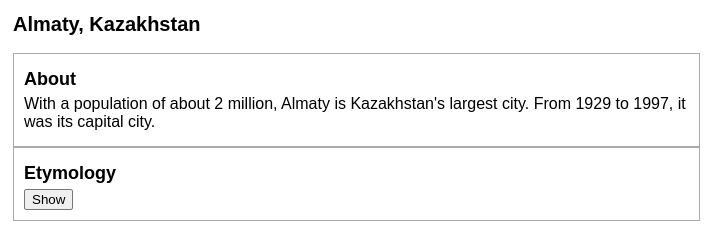
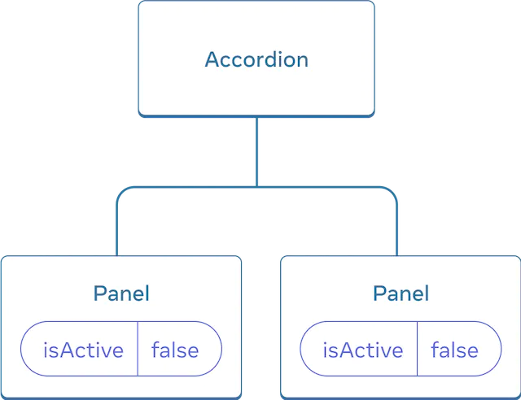
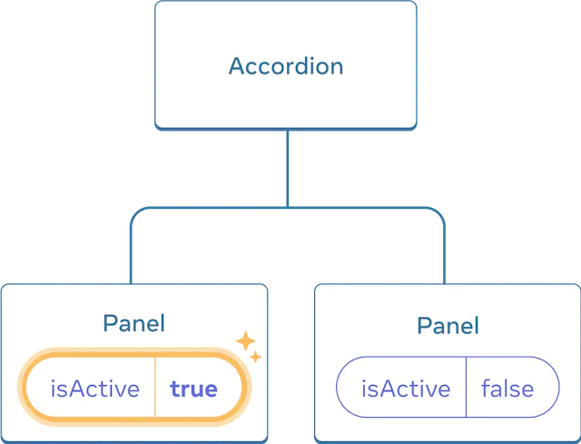
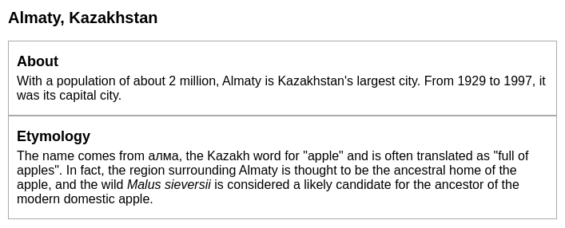
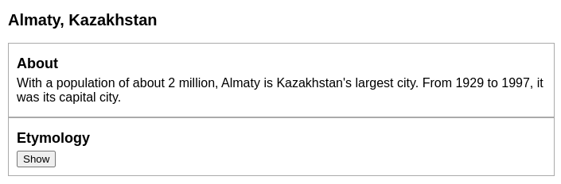
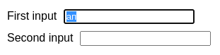
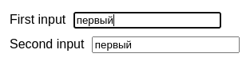
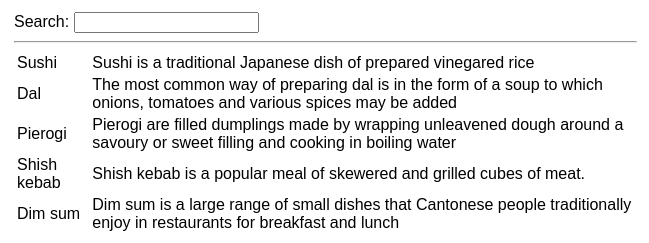
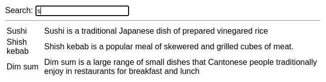

# Совместное использование состояния между компонентами

Иногда требуется, чтобы состояние двух компонентов всегда изменялось вместе. Чтобы сделать это, удалите состояние из обоих компонентов, переместите его в их ближайшего общего родителя, а затем передайте его им через `props`. Это известно как _поднятие состояния вверх_, и это одна из самых распространенных вещей, которые вы будете делать при написании кода React.

!!!tip "Вы узнаете"

    -   Как делиться состоянием между компонентами, поднимая его вверх
    -   Что такое контролируемые и неконтролируемые компоненты

## Поднятие состояния на примере

В этом примере родительский компонент `Accordion` отображает две отдельные `Panel`:

-   `Accordion`
    -   `Panel`
    -   `Panel`

Каждый компонент `Panel` имеет булево состояние `isActive`, которое определяет, видно ли его содержимое.

Нажмите кнопку Show для обеих панелей:

=== "App.js"

    ```js
    import { useState } from 'react';

    function Panel({ title, children }) {
    	const [isActive, setIsActive] = useState(false);
    	return (
    		<section className="panel">
    			<h3>{title}</h3>
    			{isActive ? (
    				<p>{children}</p>
    			) : (
    				<button onClick={() => setIsActive(true)}>
    					Show
    				</button>
    			)}
    		</section>
    	);
    }

    export default function Accordion() {
    	return (
    		<>
    			<h2>Almaty, Kazakhstan</h2>
    			<Panel title="About">
    				With a population of about 2 million, Almaty
    				is Kazakhstan's largest city. From 1929 to
    				1997, it was its capital city.
    			</Panel>
    			<Panel title="Etymology">
    				The name comes from{' '}
    				<span lang="kk-KZ">алма</span>, the Kazakh
    				word for "apple" and is often translated as
    				"full of apples". In fact, the region
    				surrounding Almaty is thought to be the
    				ancestral home of the apple, and the wild{' '}
    				<i lang="la">Malus sieversii</i> is
    				considered a likely candidate for the
    				ancestor of the modern domestic apple.
    			</Panel>
    		</>
    	);
    }
    ```

=== "Результат"

    

Обратите внимание, что нажатие на кнопку одной панели не влияет на другую - они независимы.



Изначально состояние `isActive` каждой `Panel` равно `false`, поэтому они обе отображаются свернутыми



Нажатие на кнопку любой `Panel` приведет только к обновлению состояния `isActive` этой `панели.

**Но теперь давайте предположим, что вы хотите изменить это так, чтобы только одна панель была развернута в любой момент времени.** При таком дизайне, развертывание второй панели должно свернуть первую. Как это сделать?

Чтобы скоординировать эти две панели, вам нужно "поднять их состояние вверх" к родительскому компоненту в три шага:

1.  **Удалите** состояние из дочерних компонентов.
2.  **Передать** жестко закодированные данные от общего родителя.
3.  **Добавить** состояние в общий родительский компонент и передать его вниз вместе с обработчиками событий.

Это позволит компоненту `Accordion` координировать обе `Panel` и разворачивать только одну за раз.

### Шаг 1: Удалите состояние из дочерних компонентов

Вы передадите контроль над `isActive` панели ее родительскому компоненту. Это означает, что родительский компонент будет передавать `isActive` в `Panel` в качестве пропса. Начните с **удаления этой строки** из компонента `Panel`:

<!-- 0005.part.md -->

```js
const [isActive, setIsActive] = useState(false);
```

<!-- 0006.part.md -->

И вместо этого добавьте `isActive` в список пропсов `Panel`:

<!-- 0007.part.md -->

```js
function Panel({ title, children, isActive }) {
    // ...
}
```

<!-- 0008.part.md -->

Теперь родительский компонент `Panel` может _контролировать_ `isActive`, [передавая его как prop.](passing-props-to-a-component.md) И наоборот, компонент `Panel` теперь не имеет _контроля_ над значением `isActive` - теперь это зависит от родительского компонента!

### Шаг 2: Передача жестко закодированных данных от общего родителя

Чтобы поднять состояние вверх, вы должны найти ближайший общий родительский компонент _обоих_ дочерних компонентов, которые вы хотите скоординировать:

-   `Аккордеон` _(ближайший общий родитель)_.
    -   `Панель`
    -   `Панель`

В данном примере это компонент `Accordion`. Поскольку он находится над обеими панелями и может управлять их пропсами, он станет "источником истины" для того, какая панель в данный момент активна. Заставьте компонент `Accordion` передавать жестко закодированное значение `isActive` (например, `true`) обеим панелям:

=== "App.js"

    ```js
    import { useState } from 'react';

    export default function Accordion() {
    	return (
    		<>
    			<h2>Almaty, Kazakhstan</h2>
    			<Panel title="About" isActive={true}>
    				With a population of about 2 million, Almaty
    				is Kazakhstan's largest city. From 1929 to
    				1997, it was its capital city.
    			</Panel>
    			<Panel title="Etymology" isActive={true}>
    				The name comes from{' '}
    				<span lang="kk-KZ">алма</span>, the Kazakh
    				word for "apple" and is often translated as
    				"full of apples". In fact, the region
    				surrounding Almaty is thought to be the
    				ancestral home of the apple, and the wild{' '}
    				<i lang="la">Malus sieversii</i> is
    				considered a likely candidate for the
    				ancestor of the modern domestic apple.
    			</Panel>
    		</>
    	);
    }

    function Panel({ title, children, isActive }) {
    	return (
    		<section className="panel">
    			<h3>{title}</h3>
    			{isActive ? (
    				<p>{children}</p>
    			) : (
    				<button onClick={() => setIsActive(true)}>
    					Show
    				</button>
    			)}
    		</section>
    	);
    }
    ```

=== "Результат"

    

Попробуйте отредактировать жестко закодированные значения `isActive` в компоненте `Accordion` и посмотрите результат на экране.

### Шаг 3: Добавьте состояние к общему родителю

Поднятие состояния вверх часто меняет природу того, что вы храните в качестве состояния.

В данном случае только одна панель должна быть активна одновременно. Это означает, что общий родительский компонент `Accordion` должен отслеживать, _какая_ панель является активной. Вместо значения `boolean`, он может использовать число в качестве индекса активной `панели` для переменной state:

<!-- 0013.part.md -->

```js
const [activeIndex, setActiveIndex] = useState(0);
```

<!-- 0014.part.md -->

Когда `activeIndex` равен `0`, активна первая панель, а когда `1` - вторая.

Нажатие на кнопку "Показать" в любой `панели` должно изменить активный индекс в `аккордеоне`. Панель `Panel` не может установить состояние `activeIndex` напрямую, потому что оно определено внутри `Accordion`. Компонент `Accordion` должен _явно разрешить_ компоненту `Panel` изменить свое состояние путем [передачи обработчика события в качестве пропса](responding-to-events.md#passing-event-handlers-as-props):

<!-- 0015.part.md -->

```js
<>
    <Panel
        isActive={activeIndex === 0}
        onShow={() => setActiveIndex(0)}
    >
        ...
    </Panel>
    <Panel
        isActive={activeIndex === 1}
        onShow={() => setActiveIndex(1)}
    >
        ...
    </Panel>
</>
```

<!-- 0016.part.md -->

Теперь `<button>` внутри `Panel` будет использовать пропс `onShow` в качестве обработчика события щелчка:

=== "App.js"

    ```js
    import { useState } from 'react';

    export default function Accordion() {
    	const [activeIndex, setActiveIndex] = useState(0);
    	return (
    		<>
    			<h2>Almaty, Kazakhstan</h2>
    			<Panel
    				title="About"
    				isActive={activeIndex === 0}
    				onShow={() => setActiveIndex(0)}
    			>
    				With a population of about 2 million, Almaty
    				is Kazakhstan's largest city. From 1929 to
    				1997, it was its capital city.
    			</Panel>
    			<Panel
    				title="Etymology"
    				isActive={activeIndex === 1}
    				onShow={() => setActiveIndex(1)}
    			>
    				The name comes from{' '}
    				<span lang="kk-KZ">алма</span>, the Kazakh
    				word for "apple" and is often translated as
    				"full of apples". In fact, the region
    				surrounding Almaty is thought to be the
    				ancestral home of the apple, and the wild{' '}
    				<i lang="la">Malus sieversii</i> is
    				considered a likely candidate for the
    				ancestor of the modern domestic apple.
    			</Panel>
    		</>
    	);
    }

    function Panel({ title, children, isActive, onShow }) {
    	return (
    		<section className="panel">
    			<h3>{title}</h3>
    			{isActive ? (
    				<p>{children}</p>
    			) : (
    				<button onClick={onShow}>Show</button>
    			)}
    		</section>
    	);
    }
    ```

=== "Результат"

    

Это завершает подъем состояния вверх! Перемещение состояния в общий родительский компонент позволило скоординировать две панели. Использование активного индекса вместо двух флагов "показано" обеспечило, что только одна панель активна в данный момент времени. А передача обработчика события дочернему компоненту позволила ему изменять состояние родительского компонента.


Изначально `activeIndex` `Accordion` равен `0`, поэтому первая `Panel` получает `isActive = true`.


Когда состояние `Accordion` `activeIndex` меняется на `1`, вторая `Panel` получает `isActive = true` вместо этого

!!!note "Управляемые и неуправляемые компоненты"

    Обычно принято называть компонент с некоторым локальным состоянием "неконтролируемым". Например, оригинальный компонент `Panel` с переменной состояния `isActive` является неконтролируемым, потому что его родитель не может повлиять на то, активна панель или нет.

    Напротив, можно сказать, что компонент является "управляемым", когда важная информация в нем определяется пропсами, а не его собственным локальным состоянием. Это позволяет родительскому компоненту полностью определять его поведение. Последний компонент `Panel` с пропсом `isActive` управляется компонентом `Accordion`.

    Неконтролируемые компоненты проще использовать в родительских компонентах, поскольку они требуют меньше настроек. Но они менее гибкие, когда вы хотите скоординировать их вместе. Управляемые компоненты максимально гибкие, но они требуют от родительских компонентов полной конфигурации с помощью пропсов.

    На практике "управляемый" и "неуправляемый" не являются строгими техническими терминами - каждый компонент обычно имеет некоторую смесь локального состояния и пропсов. Тем не менее, это полезный способ говорить о том, как проектируются компоненты и какие возможности они предоставляют.

    При написании компонента подумайте, какая информация в нем должна быть управляемой (через пропсы), а какая - неконтролируемой (через состояние). Но вы всегда можете передумать и рефакторить позже.

## Единый источник истины для каждого состояния

В приложении React многие компоненты будут иметь свое собственное состояние. Некоторые состояния могут "жить" рядом с листовыми компонентами (компоненты в нижней части приложения).

<!-- 0021.part.md -->

**Этот принцип также известен как наличие ["единого источника истины"](https://en.wikipedia.org/wiki/Single_source_of_truth)**. Он не означает, что все состояние живет в одном месте, но что для _каждой_ части состояния существует _конкретный_ компонент, который хранит эту часть информации. Вместо того, чтобы дублировать общее состояние между компонентами, _поднимите его_ к их общему общему родителю, и _передайте его вниз_ дочерним компонентам, которым оно необходимо.

Ваше приложение будет меняться по мере работы над ним. Часто бывает, что вы перемещаете состояние вниз или назад вверх, в то время как вы все еще выясняете, где "живет" каждая часть состояния. Это все часть процесса!

Чтобы увидеть, как это выглядит на практике с несколькими другими компонентами, прочитайте [Thinking in React](thinking-in-react.md).

!!!note "Итого"

    -   Когда вы хотите скоординировать два компонента, переместите их состояние в их общего родителя.
    -   Затем передайте информацию вниз через props от их общего родителя.
    -   Наконец, передайте обработчики событий, чтобы дочерние компоненты могли изменять состояние родительского.
    -   Полезно рассматривать компоненты как "управляемые" (управляемые пропсами) или "неуправляемые" (управляемые состоянием).

## Задачи

### 1. Синхронизированные входы

Эти два входа являются независимыми. Сделайте их синхронизированными: редактирование одного входа должно обновить другой вход с тем же текстом, и наоборот.

=== "App.js"

    ```js
    import { useState } from 'react';

    export default function SyncedInputs() {
    	return (
    		<>
    			<Input label="First input" />
    			<Input label="Second input" />
    		</>
    	);
    }

    function Input({ label }) {
    	const [text, setText] = useState('');

    	function handleChange(e) {
    		setText(e.target.value);
    	}

    	return (
    		<label>
    			{label}{' '}
    			<input value={text} onChange={handleChange} />
    		</label>
    	);
    }
    ```

=== "Результат"

    

???tip "Показать подсказку"

    Вам нужно поднять их состояние в родительский компонент.

???success "Показать решение"

    Переместите переменную состояния `text` в родительский компонент вместе с обработчиком `handleChange`. Затем передайте их как пропсы обоим компонентам `Input`. Это обеспечит их синхронизацию.

    === "App.js"

    	```js
    	import { useState } from 'react';

    	export default function SyncedInputs() {
    		const [text, setText] = useState('');

    		function handleChange(e) {
    			setText(e.target.value);
    		}

    		return (
    			<>
    				<Input
    					label="First input"
    					value={text}
    					onChange={handleChange}
    				/>
    				<Input
    					label="Second input"
    					value={text}
    					onChange={handleChange}
    				/>
    			</>
    		);
    	}

    	function Input({ label, value, onChange }) {
    		return (
    			<label>
    				{label}{' '}
    				<input value={value} onChange={onChange} />
    			</label>
    		);
    	}
    	```

    === "Результат"

    	

### 2. Фильтрация списка

В этом примере `SearchBar` имеет собственное состояние `query`, которое управляет вводом текста. Его родительский компонент `FilterableList` отображает `список` элементов, но он не учитывает поисковый запрос.

Используйте функцию `filterItems(foods, query)` для фильтрации списка в соответствии с поисковым запросом. Чтобы проверить ваши изменения, проверьте, что ввод "s" в поле ввода отфильтровывает список до "Суши", "Шашлык" и "Дим сам".

Обратите внимание, что `filterItems` уже реализован и импортирован, поэтому вам не нужно писать его самостоятельно!

=== "App.js"

    ```js
    import { useState } from 'react';
    import { foods, filterItems } from './data.js';

    export default function FilterableList() {
    	return (
    		<>
    			<SearchBar />
    			<hr />
    			<List items={foods} />
    		</>
    	);
    }

    function SearchBar() {
    	const [query, setQuery] = useState('');

    	function handleChange(e) {
    		setQuery(e.target.value);
    	}

    	return (
    		<label>
    			Search:{' '}
    			<input value={query} onChange={handleChange} />
    		</label>
    	);
    }

    function List({ items }) {
    	return (
    		<table>
    			<tbody>
    				{items.map((food) => (
    					<tr key={food.id}>
    						<td>{food.name}</td>
    						<td>{food.description}</td>
    					</tr>
    				))}
    			</tbody>
    		</table>
    	);
    }
    ```

=== "data.js"

    ```js
    export function filterItems(items, query) {
    	query = query.toLowerCase();
    	return items.filter((item) =>
    		item.name
    			.split(' ')
    			.some((word) =>
    				word.toLowerCase().startsWith(query)
    			)
    	);
    }

    export const foods = [
    	{
    		id: 0,
    		name: 'Sushi',
    		description:
    			'Sushi is a traditional Japanese dish of prepared vinegared rice',
    	},
    	{
    		id: 1,
    		name: 'Dal',
    		description:
    			'The most common way of preparing dal is in the form of a soup to which onions, tomatoes and various spices may be added',
    	},
    	{
    		id: 2,
    		name: 'Pierogi',
    		description:
    			'Pierogi are filled dumplings made by wrapping unleavened dough around a savoury or sweet filling and cooking in boiling water',
    	},
    	{
    		id: 3,
    		name: 'Shish kebab',
    		description:
    			'Shish kebab is a popular meal of skewered and grilled cubes of meat.',
    	},
    	{
    		id: 4,
    		name: 'Dim sum',
    		description:
    			'Dim sum is a large range of small dishes that Cantonese people traditionally enjoy in restaurants for breakfast and lunch',
    	},
    ];
    ```

=== "Результат"

    

???tip "Показать подсказку"

    Вы захотите удалить состояние `query` и обработчик `handleChange` из `SearchBar`, и переместить их в `FilterableList`. Затем передайте их в `SearchBar` как пропсы `query` и `onChange`.

???success "Показать решение"

    Поднимите состояние `query` в компонент `FilterableList`. Вызовите `filterItems(foods, query)` для получения отфильтрованного списка и передайте его вниз в `List`. Теперь изменение ввода запроса отражается в списке:

    === "App.js"

    	```js
    	import { useState } from 'react';
    	import { foods, filterItems } from './data.js';

    	export default function FilterableList() {
    		const [query, setQuery] = useState('');
    		const results = filterItems(foods, query);

    		function handleChange(e) {
    			setQuery(e.target.value);
    		}

    		return (
    			<>
    				<SearchBar
    					query={query}
    					onChange={handleChange}
    				/>
    				<hr />
    				<List items={results} />
    			</>
    		);
    	}

    	function SearchBar({ query, onChange }) {
    		return (
    			<label>
    				Search:{' '}
    				<input value={query} onChange={onChange} />
    			</label>
    		);
    	}

    	function List({ items }) {
    		return (
    			<table>
    				<tbody>
    					{items.map((food) => (
    						<tr key={food.id}>
    							<td>{food.name}</td>
    							<td>{food.description}</td>
    						</tr>
    					))}
    				</tbody>
    			</table>
    		);
    	}
    	```

    === "data.js"

    	```js
    	export function filterItems(items, query) {
    		query = query.toLowerCase();
    		return items.filter((item) =>
    			item.name
    				.split(' ')
    				.some((word) =>
    					word.toLowerCase().startsWith(query)
    				)
    		);
    	}

    	export const foods = [
    		{
    			id: 0,
    			name: 'Sushi',
    			description:
    				'Sushi is a traditional Japanese dish of prepared vinegared rice',
    		},
    		{
    			id: 1,
    			name: 'Dal',
    			description:
    				'The most common way of preparing dal is in the form of a soup to which onions, tomatoes and various spices may be added',
    		},
    		{
    			id: 2,
    			name: 'Pierogi',
    			description:
    				'Pierogi are filled dumplings made by wrapping unleavened dough around a savoury or sweet filling and cooking in boiling water',
    		},
    		{
    			id: 3,
    			name: 'Shish kebab',
    			description:
    				'Shish kebab is a popular meal of skewered and grilled cubes of meat.',
    		},
    		{
    			id: 4,
    			name: 'Dim sum',
    			description:
    				'Dim sum is a large range of small dishes that Cantonese people traditionally enjoy in restaurants for breakfast and lunch',
    		},
    	];
    	```

    === "Результат"

    	

## Ссылки

-   [https://react.dev/learn/sharing-state-between-components](https://react.dev/learn/sharing-state-between-components)
