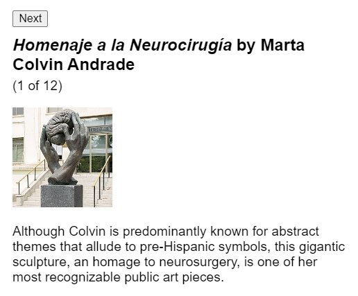
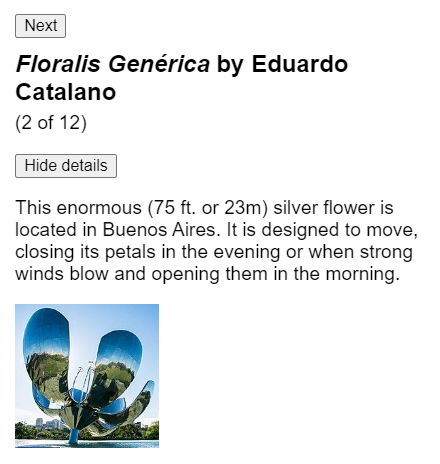
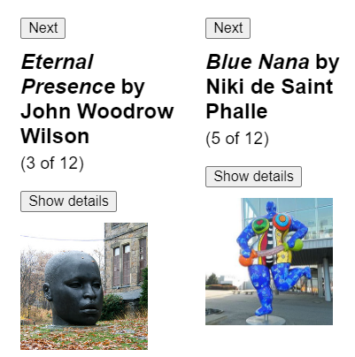
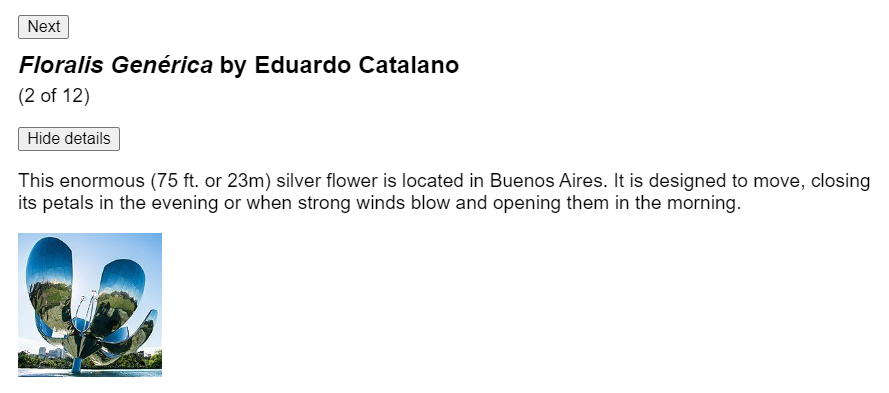
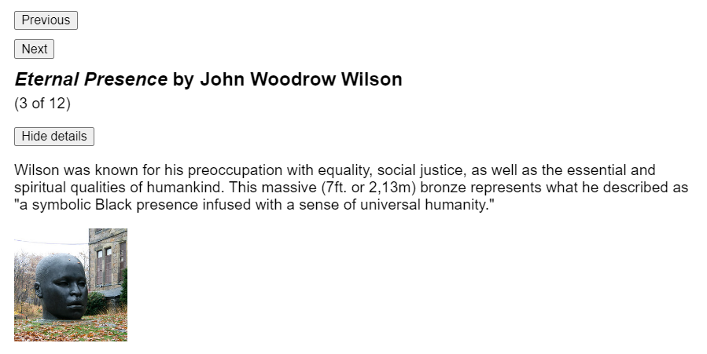
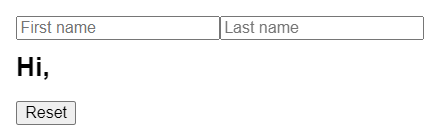
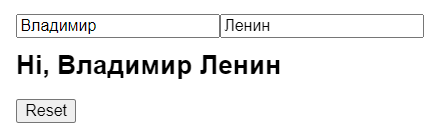
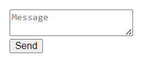
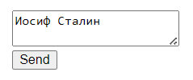

# Состояние: память компонента

Компоненты часто должны изменять то, что отображается на экране в результате взаимодействия. Ввод текста в форму должен обновить поле ввода, нажатие кнопки "next" на карусели изображений должно изменить отображаемое изображение, нажатие кнопки "buy" должно поместить товар в корзину. Компоненты должны "запоминать" вещи: текущее значение ввода, текущее изображение, корзину. В React такая специфическая для компонентов память называется "состояние" (_state_).

!!!tip "Вы узнаете"

    -   Как добавить переменную состояния с помощью хука [`useState`](../reference/useState.md)
    -   Какую пару значений возвращает хук `useState`.
    -   Как добавить более одной переменной состояния
    -   Почему состояние называется локальным

## Когда обычной переменной недостаточно

Вот компонент, который отображает изображение скульптуры. Нажатие на кнопку "Next" должно показать следующую скульптуру, изменив `index` на `1`, затем `2` и так далее. Однако, это **не работает** (вы можете попробовать!):

<!-- 0001.part.md -->

=== "App.js"

    ```js
    import { sculptureList } from './data.js';

    export default function Gallery() {
    	let index = 0;

    	function handleClick() {
    		index = index + 1;
    	}

    	let sculpture = sculptureList[index];
    	return (
    		<>
    			<button onClick={handleClick}>Next</button>
    			<h2>
    				<i>{sculpture.name} </i>
    				by {sculpture.artist}
    			</h2>
    			<h3>
    				({index + 1} of {sculptureList.length})
    			</h3>
    			
    			<p>{sculpture.description}</p>
    		</>
    	);
    }
    ```

=== "data.js"

    <div markdown style="max-height: 400px; overflow-y: auto;">

    ```js
    export const sculptureList = [
    	{
    		name: 'Homenaje a la Neurocirugía',
    		artist: 'Marta Colvin Andrade',
    		description:
    			'Although Colvin is predominantly known for abstract themes that allude to pre-Hispanic symbols, this gigantic sculpture, an homage to neurosurgery, is one of her most recognizable public art pieces.',
    		url: 'https://i.imgur.com/Mx7dA2Y.jpg',
    		alt:
    			'A bronze statue of two crossed hands delicately holding a human brain in their fingertips.',
    	},
    	{
    		name: 'Floralis Genérica',
    		artist: 'Eduardo Catalano',
    		description:
    			'This enormous (75 ft. or 23m) silver flower is located in Buenos Aires. It is designed to move, closing its petals in the evening or when strong winds blow and opening them in the morning.',
    		url: 'https://i.imgur.com/ZF6s192m.jpg',
    		alt:
    			'A gigantic metallic flower sculpture with reflective mirror-like petals and strong stamens.',
    	},
    	{
    		name: 'Eternal Presence',
    		artist: 'John Woodrow Wilson',
    		description:
    			'Wilson was known for his preoccupation with equality, social justice, as well as the essential and spiritual qualities of humankind. This massive (7ft. or 2,13m) bronze represents what he described as "a symbolic Black presence infused with a sense of universal humanity."',
    		url: 'https://i.imgur.com/aTtVpES.jpg',
    		alt:
    			'The sculpture depicting a human head seems ever-present and solemn. It radiates calm and serenity.',
    	},
    	{
    		name: 'Moai',
    		artist: 'Unknown Artist',
    		description:
    			'Located on the Easter Island, there are 1,000 moai, or extant monumental statues, created by the early Rapa Nui people, which some believe represented deified ancestors.',
    		url: 'https://i.imgur.com/RCwLEoQm.jpg',
    		alt:
    			'Three monumental stone busts with the heads that are disproportionately large with somber faces.',
    	},
    	{
    		name: 'Blue Nana',
    		artist: 'Niki de Saint Phalle',
    		description:
    			'The Nanas are triumphant creatures, symbols of femininity and maternity. Initially, Saint Phalle used fabric and found objects for the Nanas, and later on introduced polyester to achieve a more vibrant effect.',
    		url: 'https://i.imgur.com/Sd1AgUOm.jpg',
    		alt:
    			'A large mosaic sculpture of a whimsical dancing female figure in a colorful costume emanating joy.',
    	},
    	{
    		name: 'Ultimate Form',
    		artist: 'Barbara Hepworth',
    		description:
    			'This abstract bronze sculpture is a part of The Family of Man series located at Yorkshire Sculpture Park. Hepworth chose not to create literal representations of the world but developed abstract forms inspired by people and landscapes.',
    		url: 'https://i.imgur.com/2heNQDcm.jpg',
    		alt:
    			'A tall sculpture made of three elements stacked on each other reminding of a human figure.',
    	},
    	{
    		name: 'Cavaliere',
    		artist: 'Lamidi Olonade Fakeye',
    		description:
    			"Descended from four generations of woodcarvers, Fakeye's work blended traditional and contemporary Yoruba themes.",
    		url: 'https://i.imgur.com/wIdGuZwm.png',
    		alt:
    			'An intricate wood sculpture of a warrior with a focused face on a horse adorned with patterns.',
    	},
    	{
    		name: 'Big Bellies',
    		artist: 'Alina Szapocznikow',
    		description:
    			'Szapocznikow is known for her sculptures of the fragmented body as a metaphor for the fragility and impermanence of youth and beauty. This sculpture depicts two very realistic large bellies stacked on top of each other, each around five feet (1,5m) tall.',
    		url: 'https://i.imgur.com/AlHTAdDm.jpg',
    		alt:
    			'The sculpture reminds a cascade of folds, quite different from bellies in classical sculptures.',
    	},
    	{
    		name: 'Terracotta Army',
    		artist: 'Unknown Artist',
    		description:
    			'The Terracotta Army is a collection of terracotta sculptures depicting the armies of Qin Shi Huang, the first Emperor of China. The army consisted of more than 8,000 soldiers, 130 chariots with 520 horses, and 150 cavalry horses.',
    		url: 'https://i.imgur.com/HMFmH6m.jpg',
    		alt:
    			'12 terracotta sculptures of solemn warriors, each with a unique facial expression and armor.',
    	},
    	{
    		name: 'Lunar Landscape',
    		artist: 'Louise Nevelson',
    		description:
    			'Nevelson was known for scavenging objects from New York City debris, which she would later assemble into monumental constructions. In this one, she used disparate parts like a bedpost, juggling pin, and seat fragment, nailing and gluing them into boxes that reflect the influence of Cubism’s geometric abstraction of space and form.',
    		url: 'https://i.imgur.com/rN7hY6om.jpg',
    		alt:
    			'A black matte sculpture where the individual elements are initially indistinguishable.',
    	},
    	{
    		name: 'Aureole',
    		artist: 'Ranjani Shettar',
    		description:
    			'Shettar merges the traditional and the modern, the natural and the industrial. Her art focuses on the relationship between man and nature. Her work was described as compelling both abstractly and figuratively, gravity defying, and a "fine synthesis of unlikely materials."',
    		url: 'https://i.imgur.com/okTpbHhm.jpg',
    		alt:
    			'A pale wire-like sculpture mounted on concrete wall and descending on the floor. It appears light.',
    	},
    	{
    		name: 'Hippos',
    		artist: 'Taipei Zoo',
    		description:
    			'The Taipei Zoo commissioned a Hippo Square featuring submerged hippos at play.',
    		url: 'https://i.imgur.com/6o5Vuyu.jpg',
    		alt:
    			'A group of bronze hippo sculptures emerging from the sett sidewalk as if they were swimming.',
    	},
    ];
    ```

    </div>

=== "Результат"

    

<!-- 0006.part.md -->

Обработчик события `handleClick` обновляет локальную переменную `index`. Но две вещи не позволяют увидеть это изменение:

1.  **Локальные переменные не сохраняются между рендерами.** Когда React рендерит этот компонент во второй раз, он рендерит его с нуля - он не учитывает никаких изменений в локальных переменных.
2.  **Изменения локальных переменных не вызывают рендеринга.** React не понимает, что ему нужно снова рендерить компонент с новыми данными.

Чтобы обновить компонент новыми данными, должны произойти две вещи:

1.  **Сохранить** данные между рендерами.
2.  **Триггер** React для рендеринга компонента с новыми данными (повторный рендеринг).

Хук [`useState`](../reference/useState.md) обеспечивает эти две вещи:

1.  Переменная **state** для сохранения данных между рендерами.
2.  Функция **state setter** для обновления переменной и запуска React для повторного рендеринга компонента.

## Добавление переменной состояния

Чтобы добавить переменную состояния, импортируйте `useState` из React в верхней части файла:

<!-- 0007.part.md -->

```js
import { useState } from 'react';
```

<!-- 0008.part.md -->

Затем замените эту строку:

<!-- 0009.part.md -->

```js
let index = 0;
```

<!-- 0010.part.md -->

с

<!-- 0011.part.md -->

```js
const [index, setIndex] = useState(0);
```

<!-- 0012.part.md -->

`index` - это переменная состояния, а `setIndex` - функция-установщик.

!!!note ""

    Синтаксис `[` и `]` здесь называется [деструктуризация массива](https://learn.javascript.ru/destructuring-assignment) и позволяет вам читать значения из массива. Массив, возвращаемый `useState`, всегда содержит ровно два элемента.

Вот как они работают вместе в `handleClick`:

<!-- 0013.part.md -->

```js
function handleClick() {
    setIndex(index + 1);
}
```

<!-- 0014.part.md -->

Теперь нажатием кнопки "Далее" переключите текущую скульптуру:

<!-- 0015.part.md -->

=== "App.js"

    ```js
    import { useState } from 'react';
    import { sculptureList } from './data.js';

    export default function Gallery() {
    	const [index, setIndex] = useState(0);

    	function handleClick() {
    		setIndex(index + 1);
    	}

    	let sculpture = sculptureList[index];
    	return (
    		<>
    			<button onClick={handleClick}>Next</button>
    			<h2>
    				<i>{sculpture.name} </i>
    				by {sculpture.artist}
    			</h2>
    			<h3>
    				({index + 1} of {sculptureList.length})
    			</h3>
    			
    			<p>{sculpture.description}</p>
    		</>
    	);
    }
    ```

=== "data.js"

    <div markdown style="max-height: 400px; overflow-y: auto;">

    ```js
    export const sculptureList = [
    	{
    		name: 'Homenaje a la Neurocirugía',
    		artist: 'Marta Colvin Andrade',
    		description:
    			'Although Colvin is predominantly known for abstract themes that allude to pre-Hispanic symbols, this gigantic sculpture, an homage to neurosurgery, is one of her most recognizable public art pieces.',
    		url: 'https://i.imgur.com/Mx7dA2Y.jpg',
    		alt:
    			'A bronze statue of two crossed hands delicately holding a human brain in their fingertips.',
    	},
    	{
    		name: 'Floralis Genérica',
    		artist: 'Eduardo Catalano',
    		description:
    			'This enormous (75 ft. or 23m) silver flower is located in Buenos Aires. It is designed to move, closing its petals in the evening or when strong winds blow and opening them in the morning.',
    		url: 'https://i.imgur.com/ZF6s192m.jpg',
    		alt:
    			'A gigantic metallic flower sculpture with reflective mirror-like petals and strong stamens.',
    	},
    	{
    		name: 'Eternal Presence',
    		artist: 'John Woodrow Wilson',
    		description:
    			'Wilson was known for his preoccupation with equality, social justice, as well as the essential and spiritual qualities of humankind. This massive (7ft. or 2,13m) bronze represents what he described as "a symbolic Black presence infused with a sense of universal humanity."',
    		url: 'https://i.imgur.com/aTtVpES.jpg',
    		alt:
    			'The sculpture depicting a human head seems ever-present and solemn. It radiates calm and serenity.',
    	},
    	{
    		name: 'Moai',
    		artist: 'Unknown Artist',
    		description:
    			'Located on the Easter Island, there are 1,000 moai, or extant monumental statues, created by the early Rapa Nui people, which some believe represented deified ancestors.',
    		url: 'https://i.imgur.com/RCwLEoQm.jpg',
    		alt:
    			'Three monumental stone busts with the heads that are disproportionately large with somber faces.',
    	},
    	{
    		name: 'Blue Nana',
    		artist: 'Niki de Saint Phalle',
    		description:
    			'The Nanas are triumphant creatures, symbols of femininity and maternity. Initially, Saint Phalle used fabric and found objects for the Nanas, and later on introduced polyester to achieve a more vibrant effect.',
    		url: 'https://i.imgur.com/Sd1AgUOm.jpg',
    		alt:
    			'A large mosaic sculpture of a whimsical dancing female figure in a colorful costume emanating joy.',
    	},
    	{
    		name: 'Ultimate Form',
    		artist: 'Barbara Hepworth',
    		description:
    			'This abstract bronze sculpture is a part of The Family of Man series located at Yorkshire Sculpture Park. Hepworth chose not to create literal representations of the world but developed abstract forms inspired by people and landscapes.',
    		url: 'https://i.imgur.com/2heNQDcm.jpg',
    		alt:
    			'A tall sculpture made of three elements stacked on each other reminding of a human figure.',
    	},
    	{
    		name: 'Cavaliere',
    		artist: 'Lamidi Olonade Fakeye',
    		description:
    			"Descended from four generations of woodcarvers, Fakeye's work blended traditional and contemporary Yoruba themes.",
    		url: 'https://i.imgur.com/wIdGuZwm.png',
    		alt:
    			'An intricate wood sculpture of a warrior with a focused face on a horse adorned with patterns.',
    	},
    	{
    		name: 'Big Bellies',
    		artist: 'Alina Szapocznikow',
    		description:
    			'Szapocznikow is known for her sculptures of the fragmented body as a metaphor for the fragility and impermanence of youth and beauty. This sculpture depicts two very realistic large bellies stacked on top of each other, each around five feet (1,5m) tall.',
    		url: 'https://i.imgur.com/AlHTAdDm.jpg',
    		alt:
    			'The sculpture reminds a cascade of folds, quite different from bellies in classical sculptures.',
    	},
    	{
    		name: 'Terracotta Army',
    		artist: 'Unknown Artist',
    		description:
    			'The Terracotta Army is a collection of terracotta sculptures depicting the armies of Qin Shi Huang, the first Emperor of China. The army consisted of more than 8,000 soldiers, 130 chariots with 520 horses, and 150 cavalry horses.',
    		url: 'https://i.imgur.com/HMFmH6m.jpg',
    		alt:
    			'12 terracotta sculptures of solemn warriors, each with a unique facial expression and armor.',
    	},
    	{
    		name: 'Lunar Landscape',
    		artist: 'Louise Nevelson',
    		description:
    			'Nevelson was known for scavenging objects from New York City debris, which she would later assemble into monumental constructions. In this one, she used disparate parts like a bedpost, juggling pin, and seat fragment, nailing and gluing them into boxes that reflect the influence of Cubism’s geometric abstraction of space and form.',
    		url: 'https://i.imgur.com/rN7hY6om.jpg',
    		alt:
    			'A black matte sculpture where the individual elements are initially indistinguishable.',
    	},
    	{
    		name: 'Aureole',
    		artist: 'Ranjani Shettar',
    		description:
    			'Shettar merges the traditional and the modern, the natural and the industrial. Her art focuses on the relationship between man and nature. Her work was described as compelling both abstractly and figuratively, gravity defying, and a "fine synthesis of unlikely materials."',
    		url: 'https://i.imgur.com/okTpbHhm.jpg',
    		alt:
    			'A pale wire-like sculpture mounted on concrete wall and descending on the floor. It appears light.',
    	},
    	{
    		name: 'Hippos',
    		artist: 'Taipei Zoo',
    		description:
    			'The Taipei Zoo commissioned a Hippo Square featuring submerged hippos at play.',
    		url: 'https://i.imgur.com/6o5Vuyu.jpg',
    		alt:
    			'A group of bronze hippo sculptures emerging from the sett sidewalk as if they were swimming.',
    	},
    ];
    ```

    </div>

=== "Результат"

    

<!-- 0020.part.md -->

### Встречайте свой первый хук

В React функция `useState`, как и любая другая функция, начинающаяся с "`use`", называется хуком.

_Хуки_ - это специальные функции, которые доступны только во время [рендеринга](render-and-commit.md) (который мы рассмотрим более подробно на следующей странице). Они позволяют вам "подключаться" к различным функциям React.

Состояние - лишь одна из этих функций, но с другими хуками вы познакомитесь позже.

!!!warning "Внимание"

    **Хуки-функции, начинающиеся с `use`, можно вызывать только на верхнем уровне ваших компонентов или [ваших собственных хуков](reusing-logic-with-custom-hooks.md)** Вы не можете вызывать хуки внутри условий, циклов или других вложенных функций. Hooks - это функции, но полезно думать о них как о безусловных декларациях о потребностях вашего компонента. Вы "используете" функции React в верхней части вашего компонента подобно тому, как вы "импортируете" модули в верхней части вашего файла.

### Анатомия `useState`

Когда вы вызываете [`useState`](../reference/useState.md), вы говорите React, что хотите, чтобы этот компонент что-то запомнил:

<!-- 0021.part.md -->

```js
const [index, setIndex] = useState(0);
```

<!-- 0022.part.md -->

В данном случае вы хотите, чтобы React запомнил `index`.

!!!note ""

    Принято называть эту пару так: `const [something, setSomething]`. Вы можете назвать ее как угодно, но соглашения облегчают понимание в разных проектах.

Единственным аргументом для `useState` является **инициальное значение** вашей переменной состояния. В этом примере начальное значение `index` установлено в `0` с помощью `useState(0)`.

При каждом рендеринге компонента `useState` выдает массив, содержащий два значения:

1.  Переменная **state** (`index`) со значением, которое вы сохранили.
2.  Функция **установки состояния** (`setIndex`), которая может обновить переменную состояния и вызвать React для повторного рендеринга компонента.

Вот как это происходит в действии:

<!-- 0023.part.md -->

```js
const [index, setIndex] = useState(0);
```

<!-- 0024.part.md -->

1.  Поскольку вы передали `0` в `useState` в качестве начального значения для `index`, он вернет `[0, setIndex]`. React помнит, что `0` - это последнее значение состояния.
2.  **Вы обновляете состояние.** Когда пользователь нажимает на кнопку, вызывается `setIndex(index + 1)`. `index` - это `0`, поэтому вызывается `setIndex(1)`. Это указывает React на то, что `index` теперь `1`, и вызывает другой рендер.
3.  **Второй рендер вашего компонента.** React все еще видит `useState(0)`, но поскольку React _помнит_, что вы установили `index` в `1`, он возвращает `[1, setIndex]` вместо этого.
4.  И так далее!

## Предоставление компоненту нескольких переменных состояния

В одном компоненте можно иметь столько переменных состояния, сколько угодно типов. Этот компонент имеет две переменные состояния, число `index` и булево значение `showMore`, которое переключается, когда вы нажимаете кнопку "Показать подробности":

=== "App.js"

    ```js
    import { useState } from 'react';
    import { sculptureList } from './data.js';

    export default function Gallery() {
    	const [index, setIndex] = useState(0);
    	const [showMore, setShowMore] = useState(false);

    	function handleNextClick() {
    		setIndex(index + 1);
    	}

    	function handleMoreClick() {
    		setShowMore(!showMore);
    	}

    	let sculpture = sculptureList[index];
    	return (
    		<>
    			<button onClick={handleNextClick}>Next</button>
    			<h2>
    				<i>{sculpture.name} </i>
    				by {sculpture.artist}
    			</h2>
    			<h3>
    				({index + 1} of {sculptureList.length})
    			</h3>
    			<button onClick={handleMoreClick}>
    				{showMore ? 'Hide' : 'Show'} details
    			</button>
    			{showMore && <p>{sculpture.description}</p>}
    			
    		</>
    	);
    }
    ```

=== "data.js"

    <div markdown style="max-height: 400px; overflow-y: auto;">

    ```js
    export const sculptureList = [
    	{
    		name: 'Homenaje a la Neurocirugía',
    		artist: 'Marta Colvin Andrade',
    		description:
    			'Although Colvin is predominantly known for abstract themes that allude to pre-Hispanic symbols, this gigantic sculpture, an homage to neurosurgery, is one of her most recognizable public art pieces.',
    		url: 'https://i.imgur.com/Mx7dA2Y.jpg',
    		alt:
    			'A bronze statue of two crossed hands delicately holding a human brain in their fingertips.',
    	},
    	{
    		name: 'Floralis Genérica',
    		artist: 'Eduardo Catalano',
    		description:
    			'This enormous (75 ft. or 23m) silver flower is located in Buenos Aires. It is designed to move, closing its petals in the evening or when strong winds blow and opening them in the morning.',
    		url: 'https://i.imgur.com/ZF6s192m.jpg',
    		alt:
    			'A gigantic metallic flower sculpture with reflective mirror-like petals and strong stamens.',
    	},
    	{
    		name: 'Eternal Presence',
    		artist: 'John Woodrow Wilson',
    		description:
    			'Wilson was known for his preoccupation with equality, social justice, as well as the essential and spiritual qualities of humankind. This massive (7ft. or 2,13m) bronze represents what he described as "a symbolic Black presence infused with a sense of universal humanity."',
    		url: 'https://i.imgur.com/aTtVpES.jpg',
    		alt:
    			'The sculpture depicting a human head seems ever-present and solemn. It radiates calm and serenity.',
    	},
    	{
    		name: 'Moai',
    		artist: 'Unknown Artist',
    		description:
    			'Located on the Easter Island, there are 1,000 moai, or extant monumental statues, created by the early Rapa Nui people, which some believe represented deified ancestors.',
    		url: 'https://i.imgur.com/RCwLEoQm.jpg',
    		alt:
    			'Three monumental stone busts with the heads that are disproportionately large with somber faces.',
    	},
    	{
    		name: 'Blue Nana',
    		artist: 'Niki de Saint Phalle',
    		description:
    			'The Nanas are triumphant creatures, symbols of femininity and maternity. Initially, Saint Phalle used fabric and found objects for the Nanas, and later on introduced polyester to achieve a more vibrant effect.',
    		url: 'https://i.imgur.com/Sd1AgUOm.jpg',
    		alt:
    			'A large mosaic sculpture of a whimsical dancing female figure in a colorful costume emanating joy.',
    	},
    	{
    		name: 'Ultimate Form',
    		artist: 'Barbara Hepworth',
    		description:
    			'This abstract bronze sculpture is a part of The Family of Man series located at Yorkshire Sculpture Park. Hepworth chose not to create literal representations of the world but developed abstract forms inspired by people and landscapes.',
    		url: 'https://i.imgur.com/2heNQDcm.jpg',
    		alt:
    			'A tall sculpture made of three elements stacked on each other reminding of a human figure.',
    	},
    	{
    		name: 'Cavaliere',
    		artist: 'Lamidi Olonade Fakeye',
    		description:
    			"Descended from four generations of woodcarvers, Fakeye's work blended traditional and contemporary Yoruba themes.",
    		url: 'https://i.imgur.com/wIdGuZwm.png',
    		alt:
    			'An intricate wood sculpture of a warrior with a focused face on a horse adorned with patterns.',
    	},
    	{
    		name: 'Big Bellies',
    		artist: 'Alina Szapocznikow',
    		description:
    			'Szapocznikow is known for her sculptures of the fragmented body as a metaphor for the fragility and impermanence of youth and beauty. This sculpture depicts two very realistic large bellies stacked on top of each other, each around five feet (1,5m) tall.',
    		url: 'https://i.imgur.com/AlHTAdDm.jpg',
    		alt:
    			'The sculpture reminds a cascade of folds, quite different from bellies in classical sculptures.',
    	},
    	{
    		name: 'Terracotta Army',
    		artist: 'Unknown Artist',
    		description:
    			'The Terracotta Army is a collection of terracotta sculptures depicting the armies of Qin Shi Huang, the first Emperor of China. The army consisted of more than 8,000 soldiers, 130 chariots with 520 horses, and 150 cavalry horses.',
    		url: 'https://i.imgur.com/HMFmH6m.jpg',
    		alt:
    			'12 terracotta sculptures of solemn warriors, each with a unique facial expression and armor.',
    	},
    	{
    		name: 'Lunar Landscape',
    		artist: 'Louise Nevelson',
    		description:
    			'Nevelson was known for scavenging objects from New York City debris, which she would later assemble into monumental constructions. In this one, she used disparate parts like a bedpost, juggling pin, and seat fragment, nailing and gluing them into boxes that reflect the influence of Cubism’s geometric abstraction of space and form.',
    		url: 'https://i.imgur.com/rN7hY6om.jpg',
    		alt:
    			'A black matte sculpture where the individual elements are initially indistinguishable.',
    	},
    	{
    		name: 'Aureole',
    		artist: 'Ranjani Shettar',
    		description:
    			'Shettar merges the traditional and the modern, the natural and the industrial. Her art focuses on the relationship between man and nature. Her work was described as compelling both abstractly and figuratively, gravity defying, and a "fine synthesis of unlikely materials."',
    		url: 'https://i.imgur.com/okTpbHhm.jpg',
    		alt:
    			'A pale wire-like sculpture mounted on concrete wall and descending on the floor. It appears light.',
    	},
    	{
    		name: 'Hippos',
    		artist: 'Taipei Zoo',
    		description:
    			'The Taipei Zoo commissioned a Hippo Square featuring submerged hippos at play.',
    		url: 'https://i.imgur.com/6o5Vuyu.jpg',
    		alt:
    			'A group of bronze hippo sculptures emerging from the sett sidewalk as if they were swimming.',
    	},
    ];
    ```

    </div>

=== "Результат"

    

Это хорошая идея иметь несколько переменных состояния, если их состояние не связано, как `index` и `showMore` в этом примере. Но если вы обнаружите, что часто изменяете две переменные состояния вместе, может быть проще объединить их в одну. Например, если у вас есть форма с большим количеством полей, удобнее иметь одну переменную состояния, которая хранит объект, чем переменную состояния для каждого поля. Прочитайте [Выбор структуры состояния](choosing-the-state-structure.md) для получения дополнительных советов.

!!!note "Как React узнает, какое состояние нужно вернуть?"

    Вы могли заметить, что вызов `useState` не получает никакой информации о том, _к какой_ переменной состояния он обращается. Нет никакого "идентификатора", который передается в `useState`, так как же он узнает, какую из переменных состояния нужно вернуть? Полагается ли он на какую-то магию вроде разбора ваших функций? Ответ - нет.

    Вместо этого, чтобы обеспечить лаконичный синтаксис, хуки **полагаются на стабильный порядок вызова при каждом рендере одного и того же компонента.** Это хорошо работает на практике, потому что если вы следуете правилу выше ("вызывайте хуки только на верхнем уровне"), хуки всегда будут вызываться в одном и том же порядке. Кроме того, плагин [linter plugin](https://www.npmjs.com/package/eslint-plugin-react-hooks) отлавливает большинство ошибок.

    Внутри React хранит массив пар состояний для каждого компонента. Он также хранит индекс текущей пары, который устанавливается в `0` перед рендерингом. Каждый раз, когда вы вызываете `useState`, React предоставляет вам следующую пару состояний и увеличивает индекс. Подробнее об этом механизме вы можете прочитать в [React Hooks: Not Magic, Just Arrays.](https://medium.com/@ryardley/react-hooks-not-magic-just-arrays-cd4f1857236e).

    Этот пример **не использует React**, но он дает представление о том, как `useState` работает внутри:

    <!-- 0031.part.md -->

    === "App.js"

    	<div markdown style="max-height: 400px; overflow-y: auto;">

    	```js
    	let componentHooks = [];
    	let currentHookIndex = 0;

    	// How useState works inside React (simplified).
    	function useState(initialState) {
    		let pair = componentHooks[currentHookIndex];
    		if (pair) {
    			// This is not the first render,
    			// so the state pair already exists.
    			// Return it and prepare for next Hook call.
    			currentHookIndex++;
    			return pair;
    		}

    		// This is the first time we're rendering,
    		// so create a state pair and store it.
    		pair = [initialState, setState];

    		function setState(nextState) {
    			// When the user requests a state change,
    			// put the new value into the pair.
    			pair[0] = nextState;
    			updateDOM();
    		}

    		// Store the pair for future renders
    		// and prepare for the next Hook call.
    		componentHooks[currentHookIndex] = pair;
    		currentHookIndex++;
    		return pair;
    	}

    	function Gallery() {
    		// Each useState() call will get the next pair.
    		const [index, setIndex] = useState(0);
    		const [showMore, setShowMore] = useState(false);

    		function handleNextClick() {
    			setIndex(index + 1);
    		}

    		function handleMoreClick() {
    			setShowMore(!showMore);
    		}

    		let sculpture = sculptureList[index];
    		// This example doesn't use React, so
    		// return an output object instead of JSX.
    		return {
    			onNextClick: handleNextClick,
    			onMoreClick: handleMoreClick,
    			header: `${sculpture.name} by ${sculpture.artist}`,
    			counter: `${index + 1} of ${sculptureList.length}`,
    			more: `${showMore ? 'Hide' : 'Show'} details`,
    			description: showMore
    				? sculpture.description
    				: null,
    			imageSrc: sculpture.url,
    			imageAlt: sculpture.alt,
    		};
    	}

    	function updateDOM() {
    		// Reset the current Hook index
    		// before rendering the component.
    		currentHookIndex = 0;
    		let output = Gallery();

    		// Update the DOM to match the output.
    		// This is the part React does for you.
    		nextButton.onclick = output.onNextClick;
    		header.textContent = output.header;
    		moreButton.onclick = output.onMoreClick;
    		moreButton.textContent = output.more;
    		image.src = output.imageSrc;
    		image.alt = output.imageAlt;
    		if (output.description !== null) {
    			description.textContent = output.description;
    			description.style.display = '';
    		} else {
    			description.style.display = 'none';
    		}
    	}

    	let nextButton = document.getElementById('nextButton');
    	let header = document.getElementById('header');
    	let moreButton = document.getElementById('moreButton');
    	let description = document.getElementById('description');
    	let image = document.getElementById('image');
    	let sculptureList = [
    		{
    			name: 'Homenaje a la Neurocirugía',
    			artist: 'Marta Colvin Andrade',
    			description:
    				'Although Colvin is predominantly known for abstract themes that allude to pre-Hispanic symbols, this gigantic sculpture, an homage to neurosurgery, is one of her most recognizable public art pieces.',
    			url: 'https://i.imgur.com/Mx7dA2Y.jpg',
    			alt:
    				'A bronze statue of two crossed hands delicately holding a human brain in their fingertips.',
    		},
    		{
    			name: 'Floralis Genérica',
    			artist: 'Eduardo Catalano',
    			description:
    				'This enormous (75 ft. or 23m) silver flower is located in Buenos Aires. It is designed to move, closing its petals in the evening or when strong winds blow and opening them in the morning.',
    			url: 'https://i.imgur.com/ZF6s192m.jpg',
    			alt:
    				'A gigantic metallic flower sculpture with reflective mirror-like petals and strong stamens.',
    		},
    		{
    			name: 'Eternal Presence',
    			artist: 'John Woodrow Wilson',
    			description:
    				'Wilson was known for his preoccupation with equality, social justice, as well as the essential and spiritual qualities of humankind. This massive (7ft. or 2,13m) bronze represents what he described as "a symbolic Black presence infused with a sense of universal humanity."',
    			url: 'https://i.imgur.com/aTtVpES.jpg',
    			alt:
    				'The sculpture depicting a human head seems ever-present and solemn. It radiates calm and serenity.',
    		},
    		{
    			name: 'Moai',
    			artist: 'Unknown Artist',
    			description:
    				'Located on the Easter Island, there are 1,000 moai, or extant monumental statues, created by the early Rapa Nui people, which some believe represented deified ancestors.',
    			url: 'https://i.imgur.com/RCwLEoQm.jpg',
    			alt:
    				'Three monumental stone busts with the heads that are disproportionately large with somber faces.',
    		},
    		{
    			name: 'Blue Nana',
    			artist: 'Niki de Saint Phalle',
    			description:
    				'The Nanas are triumphant creatures, symbols of femininity and maternity. Initially, Saint Phalle used fabric and found objects for the Nanas, and later on introduced polyester to achieve a more vibrant effect.',
    			url: 'https://i.imgur.com/Sd1AgUOm.jpg',
    			alt:
    				'A large mosaic sculpture of a whimsical dancing female figure in a colorful costume emanating joy.',
    		},
    		{
    			name: 'Ultimate Form',
    			artist: 'Barbara Hepworth',
    			description:
    				'This abstract bronze sculpture is a part of The Family of Man series located at Yorkshire Sculpture Park. Hepworth chose not to create literal representations of the world but developed abstract forms inspired by people and landscapes.',
    			url: 'https://i.imgur.com/2heNQDcm.jpg',
    			alt:
    				'A tall sculpture made of three elements stacked on each other reminding of a human figure.',
    		},
    		{
    			name: 'Cavaliere',
    			artist: 'Lamidi Olonade Fakeye',
    			description:
    				"Descended from four generations of woodcarvers, Fakeye's work blended traditional and contemporary Yoruba themes.",
    			url: 'https://i.imgur.com/wIdGuZwm.png',
    			alt:
    				'An intricate wood sculpture of a warrior with a focused face on a horse adorned with patterns.',
    		},
    		{
    			name: 'Big Bellies',
    			artist: 'Alina Szapocznikow',
    			description:
    				'Szapocznikow is known for her sculptures of the fragmented body as a metaphor for the fragility and impermanence of youth and beauty. This sculpture depicts two very realistic large bellies stacked on top of each other, each around five feet (1,5m) tall.',
    			url: 'https://i.imgur.com/AlHTAdDm.jpg',
    			alt:
    				'The sculpture reminds a cascade of folds, quite different from bellies in classical sculptures.',
    		},
    		{
    			name: 'Terracotta Army',
    			artist: 'Unknown Artist',
    			description:
    				'The Terracotta Army is a collection of terracotta sculptures depicting the armies of Qin Shi Huang, the first Emperor of China. The army consisted of more than 8,000 soldiers, 130 chariots with 520 horses, and 150 cavalry horses.',
    			url: 'https://i.imgur.com/HMFmH6m.jpg',
    			alt:
    				'12 terracotta sculptures of solemn warriors, each with a unique facial expression and armor.',
    		},
    		{
    			name: 'Lunar Landscape',
    			artist: 'Louise Nevelson',
    			description:
    				'Nevelson was known for scavenging objects from New York City debris, which she would later assemble into monumental constructions. In this one, she used disparate parts like a bedpost, juggling pin, and seat fragment, nailing and gluing them into boxes that reflect the influence of Cubism’s geometric abstraction of space and form.',
    			url: 'https://i.imgur.com/rN7hY6om.jpg',
    			alt:
    				'A black matte sculpture where the individual elements are initially indistinguishable.',
    		},
    		{
    			name: 'Aureole',
    			artist: 'Ranjani Shettar',
    			description:
    				'Shettar merges the traditional and the modern, the natural and the industrial. Her art focuses on the relationship between man and nature. Her work was described as compelling both abstractly and figuratively, gravity defying, and a "fine synthesis of unlikely materials."',
    			url: 'https://i.imgur.com/okTpbHhm.jpg',
    			alt:
    				'A pale wire-like sculpture mounted on concrete wall and descending on the floor. It appears light.',
    		},
    		{
    			name: 'Hippos',
    			artist: 'Taipei Zoo',
    			description:
    				'The Taipei Zoo commissioned a Hippo Square featuring submerged hippos at play.',
    			url: 'https://i.imgur.com/6o5Vuyu.jpg',
    			alt:
    				'A group of bronze hippo sculptures emerging from the sett sidewalk as if they were swimming.',
    		},
    	];

    	// Make UI match the initial state.
    	updateDOM();
    	```

    	</div>

    === "index.html"

    	```html
    	<button id="nextButton">Next</button>
    	<h3 id="header"></h3>
    	<button id="moreButton"></button>
    	<p id="description"></p>
    	

    	<style>
    		* {
    			box-sizing: border-box;
    		}
    		body {
    			font-family: sans-serif;
    			margin: 20px;
    			padding: 0;
    		}
    		button {
    			display: block;
    			margin-bottom: 10px;
    		}
    	</style>
    	```

    === "Результат"

    	

    Вам не обязательно понимать это, чтобы использовать React, но вы можете найти эту модель мышления полезной.

## Состояние изолированное и частное

Состояние является локальным для экземпляра компонента на экране. Другими словами, **если вы дважды отобразите один и тот же компонент, каждая копия будет иметь полностью изолированное состояние!** Изменение одного из них не повлияет на другой.

В этом примере компонент `Gallery`, использованный ранее, отображается дважды без изменений в логике. Попробуйте нажать на кнопки внутри каждой из галерей. Обратите внимание, что их состояние независимо:

=== "App.js"

    ```js
    import Gallery from './Gallery.js';

    export default function Page() {
    	return (
    		<div className="Page">
    			<Gallery />
    			<Gallery />
    		</div>
    	);
    }
    ```

=== "Gallery.js"

    ```js
    import { useState } from 'react';
    import { sculptureList } from './data.js';

    export default function Gallery() {
    	const [index, setIndex] = useState(0);
    	const [showMore, setShowMore] = useState(false);

    	function handleNextClick() {
    		setIndex(index + 1);
    	}

    	function handleMoreClick() {
    		setShowMore(!showMore);
    	}

    	let sculpture = sculptureList[index];
    	return (
    		<section>
    			<button onClick={handleNextClick}>Next</button>
    			<h2>
    				<i>{sculpture.name} </i>
    				by {sculpture.artist}
    			</h2>
    			<h3>
    				({index + 1} of {sculptureList.length})
    			</h3>
    			<button onClick={handleMoreClick}>
    				{showMore ? 'Hide' : 'Show'} details
    			</button>
    			{showMore && <p>{sculpture.description}</p>}
    			
    		</section>
    	);
    }
    ```

=== "data.js"

    <div markdown style="max-height: 400px; overflow-y: auto;">

    ```js
    export const sculptureList = [
    	{
    		name: 'Homenaje a la Neurocirugía',
    		artist: 'Marta Colvin Andrade',
    		description:
    			'Although Colvin is predominantly known for abstract themes that allude to pre-Hispanic symbols, this gigantic sculpture, an homage to neurosurgery, is one of her most recognizable public art pieces.',
    		url: 'https://i.imgur.com/Mx7dA2Y.jpg',
    		alt:
    			'A bronze statue of two crossed hands delicately holding a human brain in their fingertips.',
    	},
    	{
    		name: 'Floralis Genérica',
    		artist: 'Eduardo Catalano',
    		description:
    			'This enormous (75 ft. or 23m) silver flower is located in Buenos Aires. It is designed to move, closing its petals in the evening or when strong winds blow and opening them in the morning.',
    		url: 'https://i.imgur.com/ZF6s192m.jpg',
    		alt:
    			'A gigantic metallic flower sculpture with reflective mirror-like petals and strong stamens.',
    	},
    	{
    		name: 'Eternal Presence',
    		artist: 'John Woodrow Wilson',
    		description:
    			'Wilson was known for his preoccupation with equality, social justice, as well as the essential and spiritual qualities of humankind. This massive (7ft. or 2,13m) bronze represents what he described as "a symbolic Black presence infused with a sense of universal humanity."',
    		url: 'https://i.imgur.com/aTtVpES.jpg',
    		alt:
    			'The sculpture depicting a human head seems ever-present and solemn. It radiates calm and serenity.',
    	},
    	{
    		name: 'Moai',
    		artist: 'Unknown Artist',
    		description:
    			'Located on the Easter Island, there are 1,000 moai, or extant monumental statues, created by the early Rapa Nui people, which some believe represented deified ancestors.',
    		url: 'https://i.imgur.com/RCwLEoQm.jpg',
    		alt:
    			'Three monumental stone busts with the heads that are disproportionately large with somber faces.',
    	},
    	{
    		name: 'Blue Nana',
    		artist: 'Niki de Saint Phalle',
    		description:
    			'The Nanas are triumphant creatures, symbols of femininity and maternity. Initially, Saint Phalle used fabric and found objects for the Nanas, and later on introduced polyester to achieve a more vibrant effect.',
    		url: 'https://i.imgur.com/Sd1AgUOm.jpg',
    		alt:
    			'A large mosaic sculpture of a whimsical dancing female figure in a colorful costume emanating joy.',
    	},
    	{
    		name: 'Ultimate Form',
    		artist: 'Barbara Hepworth',
    		description:
    			'This abstract bronze sculpture is a part of The Family of Man series located at Yorkshire Sculpture Park. Hepworth chose not to create literal representations of the world but developed abstract forms inspired by people and landscapes.',
    		url: 'https://i.imgur.com/2heNQDcm.jpg',
    		alt:
    			'A tall sculpture made of three elements stacked on each other reminding of a human figure.',
    	},
    	{
    		name: 'Cavaliere',
    		artist: 'Lamidi Olonade Fakeye',
    		description:
    			"Descended from four generations of woodcarvers, Fakeye's work blended traditional and contemporary Yoruba themes.",
    		url: 'https://i.imgur.com/wIdGuZwm.png',
    		alt:
    			'An intricate wood sculpture of a warrior with a focused face on a horse adorned with patterns.',
    	},
    	{
    		name: 'Big Bellies',
    		artist: 'Alina Szapocznikow',
    		description:
    			'Szapocznikow is known for her sculptures of the fragmented body as a metaphor for the fragility and impermanence of youth and beauty. This sculpture depicts two very realistic large bellies stacked on top of each other, each around five feet (1,5m) tall.',
    		url: 'https://i.imgur.com/AlHTAdDm.jpg',
    		alt:
    			'The sculpture reminds a cascade of folds, quite different from bellies in classical sculptures.',
    	},
    	{
    		name: 'Terracotta Army',
    		artist: 'Unknown Artist',
    		description:
    			'The Terracotta Army is a collection of terracotta sculptures depicting the armies of Qin Shi Huang, the first Emperor of China. The army consisted of more than 8,000 soldiers, 130 chariots with 520 horses, and 150 cavalry horses.',
    		url: 'https://i.imgur.com/HMFmH6m.jpg',
    		alt:
    			'12 terracotta sculptures of solemn warriors, each with a unique facial expression and armor.',
    	},
    	{
    		name: 'Lunar Landscape',
    		artist: 'Louise Nevelson',
    		description:
    			'Nevelson was known for scavenging objects from New York City debris, which she would later assemble into monumental constructions. In this one, she used disparate parts like a bedpost, juggling pin, and seat fragment, nailing and gluing them into boxes that reflect the influence of Cubism’s geometric abstraction of space and form.',
    		url: 'https://i.imgur.com/rN7hY6om.jpg',
    		alt:
    			'A black matte sculpture where the individual elements are initially indistinguishable.',
    	},
    	{
    		name: 'Aureole',
    		artist: 'Ranjani Shettar',
    		description:
    			'Shettar merges the traditional and the modern, the natural and the industrial. Her art focuses on the relationship between man and nature. Her work was described as compelling both abstractly and figuratively, gravity defying, and a "fine synthesis of unlikely materials."',
    		url: 'https://i.imgur.com/okTpbHhm.jpg',
    		alt:
    			'A pale wire-like sculpture mounted on concrete wall and descending on the floor. It appears light.',
    	},
    	{
    		name: 'Hippos',
    		artist: 'Taipei Zoo',
    		description:
    			'The Taipei Zoo commissioned a Hippo Square featuring submerged hippos at play.',
    		url: 'https://i.imgur.com/6o5Vuyu.jpg',
    		alt:
    			'A group of bronze hippo sculptures emerging from the sett sidewalk as if they were swimming.',
    	},
    ];
    ```

    </div>

=== "Результат"

    

Именно это отличает состояние от обычных переменных, которые вы можете объявить в верхней части вашего модуля. Состояние не привязано к определенному вызову функции или месту в коде, оно "локально" для конкретного места на экране. Вы отобразили два компонента `<Gallery />`, поэтому их состояние хранится отдельно.

Также обратите внимание, что компонент `Page` ничего не "знает" о состоянии `Gallery` и даже о том, есть ли оно у него. В отличие от props, **state является полностью приватным для объявляющего его компонента.** Родительский компонент не может его изменить. Это позволяет вам добавлять состояние в любой компонент или удалять его без влияния на остальные компоненты.

Что если вы хотите, чтобы обе галереи синхронизировали свои состояния? Правильный способ сделать это в React - _удалить_ состояние из дочерних компонентов и добавить его в их ближайший общий родительский компонент. Следующие несколько страниц будут посвящены организации состояния отдельного компонента, но мы вернемся к этой теме в [Совместное использование состояния между компонентами](sharing-state-between-components.md).

!!!note "Итого"

    -   Используйте переменную состояния, когда компоненту необходимо "запомнить" некоторую информацию между рендерами.
    -   Переменные состояния объявляются путем вызова хука `useState`.
    -   Хуки - это специальные функции, начинающиеся с `use`. Они позволяют вам "подключаться" к таким функциям React, как состояние.
    -   Хуки могут напомнить вам об импорте: их нужно вызывать безусловно. Вызов хуков, включая `useState`, возможен только на верхнем уровне компонента или другого хука.
    -   Хук `useState` возвращает пару значений: текущее состояние и функцию для его обновления.
    -   У вас может быть более одной переменной состояния. Внутри React сопоставляет их по порядку.
    -   Состояние является приватным для компонента. Если вы рендерите его в двух местах, каждая копия получает свое собственное состояние.

## Задачи

### 1. Завершение галереи

При нажатии кнопки "Next" на последней скульптуре происходит сбой кода. Исправьте логику, чтобы предотвратить сбой. Вы можете сделать это, добавив дополнительную логику в обработчик события или отключив кнопку, когда действие невозможно.

После устранения сбоя добавьте кнопку "Предыдущая", которая показывает предыдущую скульптуру. Она не должна разбиваться на первой скульптуре.

=== "App.js"

    ```js
    import { useState } from 'react';
    import { sculptureList } from './data.js';

    export default function Gallery() {
    	const [index, setIndex] = useState(0);
    	const [showMore, setShowMore] = useState(false);

    	function handleNextClick() {
    		setIndex(index + 1);
    	}

    	function handleMoreClick() {
    		setShowMore(!showMore);
    	}

    	let sculpture = sculptureList[index];
    	return (
    		<>
    			<button onClick={handleNextClick}>Next</button>
    			<h2>
    				<i>{sculpture.name} </i>
    				by {sculpture.artist}
    			</h2>
    			<h3>
    				({index + 1} of {sculptureList.length})
    			</h3>
    			<button onClick={handleMoreClick}>
    				{showMore ? 'Hide' : 'Show'} details
    			</button>
    			{showMore && <p>{sculpture.description}</p>}
    			
    		</>
    	);
    }
    ```

=== "Результат"

    

???success "Показать решение"

    Это добавляет условие защиты внутри обоих обработчиков событий и отключает кнопки, когда это необходимо:

    === "App.js"

    	<div markdown style="max-height: 400px; overflow-y: auto;">

    	```js
    	import { useState } from 'react';
    	import { sculptureList } from './data.js';

    	export default function Gallery() {
    		const [index, setIndex] = useState(0);
    		const [showMore, setShowMore] = useState(false);

    		let hasPrev = index > 0;
    		let hasNext = index < sculptureList.length - 1;

    		function handlePrevClick() {
    			if (hasPrev) {
    				setIndex(index - 1);
    			}
    		}

    		function handleNextClick() {
    			if (hasNext) {
    				setIndex(index + 1);
    			}
    		}

    		function handleMoreClick() {
    			setShowMore(!showMore);
    		}

    		let sculpture = sculptureList[index];
    		return (
    			<>
    				<button
    					onClick={handlePrevClick}
    					disabled={!hasPrev}
    				>
    					Previous
    				</button>
    				<button
    					onClick={handleNextClick}
    					disabled={!hasNext}
    				>
    					Next
    				</button>
    				<h2>
    					<i>{sculpture.name} </i>
    					by {sculpture.artist}
    				</h2>
    				<h3>
    					({index + 1} of {sculptureList.length})
    				</h3>
    				<button onClick={handleMoreClick}>
    					{showMore ? 'Hide' : 'Show'} details
    				</button>
    				{showMore && <p>{sculpture.description}</p>}
    				
    			</>
    		);
    	}
    	```

    	</div>

    === "Результат"

    	

    Обратите внимание, что `hasPrev` и `hasNext` используются _как_ для возвращаемого JSX, так и внутри обработчиков событий! Эта удобная схема работает потому, что функции обработчиков событий ["закрывают"](https://developer.mozilla.org/docs/Web/JavaScript/Closures) любые переменные, объявленные во время рендеринга.

### 2. Исправление застрявших вводов формы

Когда вы вводите текст в поля ввода, ничего не появляется. Как будто входные значения "застряли" с пустыми строками. "Значение" первого `<input>` установлено так, чтобы всегда соответствовать переменной `firstName`, а "значение" второго `<input>` установлено так, чтобы всегда соответствовать переменной `lastName`. Это правильно. Оба входа имеют обработчики событий `onChange`, которые пытаются обновить переменные на основе последнего введенного пользователем значения (`e.target.value`). Однако переменные, похоже, не "запоминают" свои значения между повторными рендерингами. Исправьте это, используя вместо них переменные состояния.

=== "App.js"

    ```js
    export default function Form() {
    	let firstName = '';
    	let lastName = '';

    	function handleFirstNameChange(e) {
    		firstName = e.target.value;
    	}

    	function handleLastNameChange(e) {
    		lastName = e.target.value;
    	}

    	function handleReset() {
    		firstName = '';
    		lastName = '';
    	}

    	return (
    		<form onSubmit={(e) => e.preventDefault()}>
    			<input
    				placeholder="First name"
    				value={firstName}
    				onChange={handleFirstNameChange}
    			/>
    			<input
    				placeholder="Last name"
    				value={lastName}
    				onChange={handleLastNameChange}
    			/>
    			<h1>
    				Hi, {firstName} {lastName}
    			</h1>
    			<button onClick={handleReset}>Reset</button>
    		</form>
    	);
    }
    ```

=== "Результат"

    

???success "Показать решение"

    Сначала импортируйте `useState` из React. Затем замените `firstName` и `lastName` на переменные состояния, объявленные вызовом `useState`. Наконец, замените каждое присваивание `firstName = ...` на `setFirstName(...)`, и сделайте то же самое для `lastName`. Не забудьте также обновить `handleReset`, чтобы кнопка сброса работала.

    === "App.js"

    	```js
    	import { useState } from 'react';

    	export default function Form() {
    		const [firstName, setFirstName] = useState('');
    		const [lastName, setLastName] = useState('');

    		function handleFirstNameChange(e) {
    			setFirstName(e.target.value);
    		}

    		function handleLastNameChange(e) {
    			setLastName(e.target.value);
    		}

    		function handleReset() {
    			setFirstName('');
    			setLastName('');
    		}

    		return (
    			<form onSubmit={(e) => e.preventDefault()}>
    				<input
    					placeholder="First name"
    					value={firstName}
    					onChange={handleFirstNameChange}
    				/>
    				<input
    					placeholder="Last name"
    					value={lastName}
    					onChange={handleLastNameChange}
    				/>
    				<h1>
    					Hi, {firstName} {lastName}
    				</h1>
    				<button onClick={handleReset}>Reset</button>
    			</form>
    		);
    	}
    	```

    === "Результат"

    	

### 3. Устранение сбоя

Вот небольшая форма, которая должна позволить пользователю оставить отзыв. Когда отзыв отправлен, предполагается отобразить сообщение с благодарностью. Однако при этом происходит сбой с сообщением об ошибке: "Rendered lesser hooks than expected". Можете ли вы заметить ошибку и исправить ее?

=== "App.js"

    ```js
    import { useState } from 'react';

    export default function FeedbackForm() {
    	const [isSent, setIsSent] = useState(false);
    	if (isSent) {
    		return <h1>Thank you!</h1>;
    	} else {
    		// eslint-disable-next-line
    		const [message, setMessage] = useState('');
    		return (
    			<form
    				onSubmit={(e) => {
    					e.preventDefault();
    					alert(`Sending: "${message}"`);
    					setIsSent(true);
    				}}
    			>
    				<textarea
    					placeholder="Message"
    					value={message}
    					onChange={(e) =>
    						setMessage(e.target.value)
    					}
    				/>
    				<br />
    				<button type="submit">Send</button>
    			</form>
    		);
    	}
    }
    ```

=== "Результат"

    

???tip "Показать подсказку"

    Существуют ли какие-либо ограничения на _где_ могут быть вызваны хуки? Нарушает ли этот компонент какие-либо правила? Проверьте, нет ли комментариев, отключающих проверку линтера - именно здесь часто скрываются ошибки!

???success "Показать решение"

    Хуки можно вызывать только на верхнем уровне функции компонента. Здесь первое определение `isSent` следует этому правилу, но определение `message` вложено в условие.

    Переместите его из условия, чтобы решить проблему:

    === "App.js"

    	```js
    	import { useState } from 'react';

    	export default function FeedbackForm() {
    		const [isSent, setIsSent] = useState(false);
    		const [message, setMessage] = useState('');

    		if (isSent) {
    			return <h1>Thank you!</h1>;
    		} else {
    			return (
    				<form
    					onSubmit={(e) => {
    						e.preventDefault();
    						alert(`Sending: "${message}"`);
    						setIsSent(true);
    					}}
    				>
    					<textarea
    						placeholder="Message"
    						value={message}
    						onChange={(e) =>
    							setMessage(e.target.value)
    						}
    					/>
    					<br />
    					<button type="submit">Send</button>
    				</form>
    			);
    		}
    	}
    	```

    === "Результат"

    	

    Помните, что хуки должны вызываться безоговорочно и всегда в одном и том же порядке!

    Вы также можете удалить ненужную ветвь `else`, чтобы уменьшить вложенность. Однако по-прежнему важно, чтобы все вызовы хуков происходили _до_ первого `возврата`.

    === "App.js"

    	```js
    	import { useState } from 'react';

    	export default function FeedbackForm() {
    		const [isSent, setIsSent] = useState(false);
    		const [message, setMessage] = useState('');

    		if (isSent) {
    			return <h1>Thank you!</h1>;
    		}

    		return (
    			<form
    				onSubmit={(e) => {
    					e.preventDefault();
    					alert(`Sending: "${message}"`);
    					setIsSent(true);
    				}}
    			>
    				<textarea
    					placeholder="Message"
    					value={message}
    					onChange={(e) => setMessage(e.target.value)}
    				/>
    				<br />
    				<button type="submit">Send</button>
    			</form>
    		);
    	}
    	```

    === "Результат"

    	

    Попробуйте перенести второй вызов `useState` после условия `if` и обратите внимание, как это снова нарушает его.

    Если ваш linter [настроен на React](editor-setup.md), то при такой ошибке вы должны увидеть ошибку lint. Если вы не видите ошибки при локальной проверке ошибочного кода, вам необходимо настроить линтинг для вашего проекта.

### 4. Удалите ненужное состояние

При нажатии на кнопку этот пример должен запросить имя пользователя, а затем вывести приветствие. Вы попытались использовать state для хранения имени, но по какой-то причине всегда выводится "Hello, !".

Чтобы исправить этот код, удалите ненужную переменную state (мы обсудим [почему это не сработало](state-as-a-snapshot.md) позже).

Можете ли вы объяснить, почему эта переменная состояния была ненужной?

```js
import { useState } from 'react';

export default function FeedbackForm() {
    const [name, setName] = useState('');

    function handleClick() {
        setName(prompt('What is your name?'));
        alert(`Hello, ${name}!`);
    }

    return <button onClick={handleClick}>Greet</button>;
}
```

???success "Показать решение"

    Вот исправленная версия, которая использует обычную переменную `name`, объявленную в функции, которой она нужна:

    ```js
    import { useState } from 'react';

    export default function FeedbackForm() {
    	function handleClick() {
    		const name = prompt('What is your name?');
    		alert(`Hello, ${name}!`);
    	}

    	return <button onClick={handleClick}>Greet</button>;
    }
    ```

    Переменная состояния необходима только для сохранения информации между повторными рендерингами компонента. В рамках одного обработчика событий обычная переменная будет работать нормально. Не вводите переменные состояния, если обычная переменная работает хорошо.

## Ссылки

-   [https://react.dev/learn/state-a-components-memory](https://react.dev/learn/state-a-components-memory)
