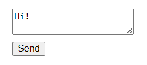
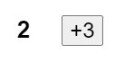
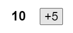
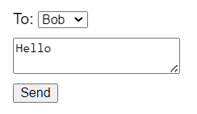
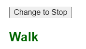

# Состояние как моментальный снимок

Переменные состояния могут выглядеть как обычные переменные JavaScript, которые можно читать и записывать. Однако состояние ведет себя скорее как моментальный снимок. Установка состояния не изменяет уже имеющуюся переменную состояния, а вместо этого вызывает повторный рендеринг.

!!!tip "Вы узнаете"

    -   Как установка состояния вызывает повторный рендеринг
    -   Когда и как обновляется состояние
    -   Почему состояние не обновляется сразу после его установки
    -   Как обработчики событий получают доступ к "снимку" состояния

## Установка состояния запускает рендеринг

Вы можете думать о том, что ваш пользовательский интерфейс меняется непосредственно в ответ на событие пользователя, например, на клик. В React эта мысленная модель работает несколько иначе. На предыдущей странице вы видели, что [установка состояния запрашивает повторный рендеринг](render-and-commit.md#step-1-trigger-a-render) в React. Это означает, что для того, чтобы интерфейс отреагировал на событие, необходимо _обновить состояние_.

В этом примере, когда вы нажимаете кнопку "отправить", `setIsSent(true)` сообщает React о необходимости повторного рендеринга пользовательского интерфейса:

<!-- 0001.part.md -->

=== "App.js"

    ```js
    import { useState } from 'react';

    export default function Form() {
    	const [isSent, setIsSent] = useState(false);
    	const [message, setMessage] = useState('Hi!');
    	if (isSent) {
    		return <h1>Your message is on its way!</h1>;
    	}
    	return (
    		<form
    			onSubmit={(e) => {
    				e.preventDefault();
    				setIsSent(true);
    				sendMessage(message);
    			}}
    		>
    			<textarea
    				placeholder="Message"
    				value={message}
    				onChange={(e) => setMessage(e.target.value)}
    			/>
    			<button type="submit">Send</button>
    		</form>
    	);
    }

    function sendMessage(message) {
    	// ...
    }
    ```

=== "Результат"

    

Вот что происходит, когда вы нажимаете на кнопку:

1.  Выполняется обработчик события `onSubmit`.
2.  `setIsSent(true)` устанавливает `isSent` в `true` и ставит в очередь новый рендер.
3.  React повторно рендерит компонент в соответствии с новым значением `isSent`.

Давайте подробнее рассмотрим связь между состоянием и рендерингом.

## Рендеринг делает моментальный снимок времени

["Rendering"](render-and-commit.md#step-2-react-renders-your-components) означает, что React вызывает ваш компонент, который является функцией. JSX, который вы возвращаете из этой функции, — это как снимок пользовательского интерфейса во времени. Его реквизиты, обработчики событий и локальные переменные были рассчитаны _используя его состояние на момент рендеринга_.

В отличие от фотографии или кадра фильма, возвращаемый вами "снимок" пользовательского интерфейса является интерактивным. Он включает в себя логику, например, обработчики событий, которые определяют, что происходит в ответ на входные данные. React обновляет экран в соответствии с этим снимком и подключает обработчики событий. В результате нажатие кнопки вызовет обработчик нажатия из вашего JSX.

Когда React перерисовывает компонент:

1.  React снова вызывает вашу функцию.
2.  Ваша функция возвращает новый снимок JSX.
3.  Затем React обновляет экран в соответствии с полученным снимком.

Как память компонента, state не похож на обычную переменную, которая исчезает после возвращения вашей функции. Состояние фактически "живет" в самом React - как будто на полке!- вне вашей функции. Когда React вызывает ваш компонент, он дает вам снимок состояния для этого конкретного рендера. Ваш компонент возвращает снимок пользовательского интерфейса со свежим набором реквизитов и обработчиков событий в своем JSX, все рассчитано **используя значения состояния из этого рендера!**.

-   Вы говорите React обновить состояние
-   React обновляет значение состояния
-   React передает снимок значения состояния в компонент

Вот небольшой эксперимент, чтобы показать вам, как это работает. В этом примере вы можете ожидать, что нажатие кнопки "+3" увеличит счетчик в три раза, потому что он вызывает `setNumber(number + 1)` три раза.

Посмотрите, что произойдет, когда вы нажмете кнопку "+3":

=== "App.js"

    ```js
    import { useState } from 'react';

    export default function Counter() {
    	const [number, setNumber] = useState(0);

    	return (
    		<>
    			<h1>{number}</h1>
    			<button
    				onClick={() => {
    					setNumber(number + 1);
    					setNumber(number + 1);
    					setNumber(number + 1);
    				}}
    			>
    				+3
    			</button>
    		</>
    	);
    }
    ```

=== "Результат"

    

Обратите внимание, что `number` увеличивается только один раз за клик!

**Установка состояния изменяет его только для _следующего_ рендера.** Во время первого рендера `number` было `0`. Вот почему в обработчике `onClick` того рендера значение `number` все еще `0`, даже после вызова `setNumber(number + 1)`:

<!-- 0009.part.md -->

```js
<button
    onClick={() => {
        setNumber(number + 1);
        setNumber(number + 1);
        setNumber(number + 1);
    }}
>
    +3
</button>
```

<!-- 0010.part.md -->

Вот что обработчик нажатия этой кнопки говорит React сделать:

1.  `setNumber(number + 1)`: `number` - это `0`, поэтому `setNumber(0 + 1)`.
    -   React готовится изменить `число` на `1` при следующем рендере.
2.  `setNumber(number + 1)`: `number` - `0`, поэтому `setNumber(0 + 1)`.
    -   React готовится изменить `number` на `1` при следующем рендере.
3.  `setNumber(number + 1)`: `number` - `0`, поэтому `setNumber(0 + 1)`.
    -   React готовится изменить `number` на `1` при следующем рендере.

Несмотря на то, что вы вызвали `setNumber(number + 1)` три раза, в обработчике событий этого рендера `number` всегда `0`, поэтому вы установили состояние `1` три раза. Вот почему после завершения обработчика событий React повторно рендерит компонент с `number`, равным `1`, а не `3`.

Вы также можете представить себе это, мысленно заменив переменные состояния их значениями в коде. Поскольку переменная состояния `number` равна `0` для _этого рендера_, его обработчик событий выглядит следующим образом:

<!-- 0011.part.md -->

```js
<button
    onClick={() => {
        setNumber(0 + 1);
        setNumber(0 + 1);
        setNumber(0 + 1);
    }}
>
    +3
</button>
```

<!-- 0012.part.md -->

Для следующего рендера `number` будет `1`, поэтому _обработчик клика этого рендера_ будет выглядеть следующим образом:

<!-- 0013.part.md -->

```js
<button
    onClick={() => {
        setNumber(1 + 1);
        setNumber(1 + 1);
        setNumber(1 + 1);
    }}
>
    +3
</button>
```

<!-- 0014.part.md -->

Вот почему повторное нажатие на кнопку установит счетчик на `2`, затем на `3` при следующем нажатии и т. д.

## Состояние с течением времени

Что ж, это было забавно. Попробуйте угадать, о чем предупредит нажатие на эту кнопку:

=== "App.js"

    ```js
    import { useState } from 'react';

    export default function Counter() {
    	const [number, setNumber] = useState(0);

    	return (
    		<>
    			<h1>{number}</h1>
    			<button
    				onClick={() => {
    					setNumber(number + 5);
    					alert(number);
    				}}
    			>
    				+5
    			</button>
    		</>
    	);
    }
    ```

=== "Результат"

    

<!-- 0018.part.md -->

Если использовать предыдущий метод подстановки, то можно догадаться, что оповещение показывает "0":

<!-- 0019.part.md -->

```js
setNumber(0 + 5);
alert(0);
```

<!-- 0020.part.md -->

Но что если поставить таймер на оповещение, чтобы оно срабатывало только после того, как компонент перерендерится? Будет ли он говорить "0" или "5"? Угадайте!

=== "App.js"

    ```js
    import { useState } from 'react';

    export default function Counter() {
    	const [number, setNumber] = useState(0);

    	return (
    		<>
    			<h1>{number}</h1>
    			<button
    				onClick={() => {
    					setNumber(number + 5);
    					setTimeout(() => {
    						alert(number);
    					}, 3000);
    				}}
    			>
    				+5
    			</button>
    		</>
    	);
    }
    ```

=== "Результат"

    

<!-- 0024.part.md -->

Удивлены? Если вы используете метод подстановки, вы можете увидеть "снимок" состояния, переданного в оповещение.

<!-- 0025.part.md -->

```js
setNumber(0 + 5);
setTimeout(() => {
    alert(0);
}, 3000);
```

<!-- 0026.part.md -->

Состояние, хранящееся в React, может измениться к моменту запуска оповещения, но оно было запланировано с использованием снимка состояния на момент взаимодействия пользователя с ним!

**Значение переменной состояния никогда не меняется во время рендеринга,** даже если код обработчика события асинхронный. Внутри _этого рендера_ `onClick`, значение `number` продолжает быть `0` даже после вызова `setNumber(number + 5)`. Его значение было "зафиксировано", когда React "сделал снимок" пользовательского интерфейса, вызвав ваш компонент.

Вот пример того, как это делает ваши обработчики событий менее подверженными ошибкам синхронизации. Ниже приведена форма, которая отправляет сообщение с пятисекундной задержкой. Представьте себе следующий сценарий:

1.  Вы нажимаете кнопку "Отправить", отправляя сообщение "Привет" Алисе.
2.  До истечения пятисекундной задержки вы изменяете значение поля "Кому" на "Бобу".

Что вы ожидаете увидеть в сообщении `alert`? Будет ли оно отображать: "Вы сказали "Привет" Алисе"? Или "Вы поздоровались с Бобом"? Сделайте предположение, основываясь на том, что вы знаете, а затем попробуйте:

<!-- 0027.part.md -->

=== "App.js"

    ```js
    import { useState } from 'react';

    export default function Form() {
    	const [to, setTo] = useState('Alice');
    	const [message, setMessage] = useState('Hello');

    	function handleSubmit(e) {
    		e.preventDefault();
    		setTimeout(() => {
    			alert(`You said ${message} to ${to}`);
    		}, 5000);
    	}

    	return (
    		<form onSubmit={handleSubmit}>
    			<label>
    				To:{' '}
    				<select
    					value={to}
    					onChange={(e) => setTo(e.target.value)}
    				>
    					<option value="Alice">Alice</option>
    					<option value="Bob">Bob</option>
    				</select>
    			</label>
    			<textarea
    				placeholder="Message"
    				value={message}
    				onChange={(e) => setMessage(e.target.value)}
    			/>
    			<button type="submit">Send</button>
    		</form>
    	);
    }
    ```

=== "Результат"

    

**React сохраняет значения состояния "фиксированными" в обработчиках событий одного рендера.** Вам не нужно беспокоиться о том, изменилось ли состояние во время выполнения кода.

Но что если вы хотите прочитать последнее состояние перед повторным рендерингом? Вам понадобится функция [обновления состояния](queueing-a-series-of-state-updates.md), о которой мы расскажем на следующей странице!

!!!tip "Резюме"

    -   Установка состояния запрашивает новый рендер.
    -   React хранит состояние вне вашего компонента, как на полке.
    -   Когда вы вызываете `useState`, React дает вам снимок состояния _для данного рендера_.
    -   Переменные и обработчики событий не "переживают" повторных рендеров. Каждый рендер имеет свои собственные обработчики событий.
    -   Каждый рендер (и функции внутри него) всегда будет "видеть" снимок состояния, который React передал _этому_ рендеру.
    -   Вы можете мысленно подставлять состояние в обработчики событий, аналогично тому, как вы думаете о рендеринге JSX.
    -   Обработчики событий, созданные в прошлом, имеют значения состояния из рендера, в котором они были созданы.

## Задача

### 1. Реализация светофора

Здесь представлен компонент светофора для пешеходного перехода, который включается при нажатии на кнопку:

=== "App.js"

    ```js
    import { useState } from 'react';

    export default function TrafficLight() {
    	const [walk, setWalk] = useState(true);

    	function handleClick() {
    		setWalk(!walk);
    	}

    	return (
    		<>
    			<button onClick={handleClick}>
    				Change to {walk ? 'Stop' : 'Walk'}
    			</button>
    			<h1
    				style={{
    					color: walk ? 'darkgreen' : 'darkred',
    				}}
    			>
    				{walk ? 'Walk' : 'Stop'}
    			</h1>
    		</>
    	);
    }
    ```

=== "Результат"

    

<!-- 0034.part.md -->

Добавьте `alert` в обработчик нажатия. Когда свет зеленый и говорит "Идти", щелчок по кнопке должен говорить "Следующая остановка". Когда свет красный и говорит "Стоп", нажатие на кнопку должно говорить "Следующим будет идти".

Есть ли разница в том, поместить ли `alert` до или после вызова `setWalk`?

???success "Показать решение"

    Ваше `оповещение` должно выглядеть следующим образом:

    === "App.js"

    	```js
    	import { useState } from 'react';

    	export default function TrafficLight() {
    		const [walk, setWalk] = useState(true);

    		function handleClick() {
    			setWalk(!walk);
    			alert(walk ? 'Stop is next' : 'Walk is next');
    		}

    		return (
    			<>
    				<button onClick={handleClick}>
    					Change to {walk ? 'Stop' : 'Walk'}
    				</button>
    				<h1
    					style={{
    						color: walk ? 'darkgreen' : 'darkred',
    					}}
    				>
    					{walk ? 'Walk' : 'Stop'}
    				</h1>
    			</>
    		);
    	}
    	```

    === "Результат"

    	

    Поместите ли вы его до или после вызова `setWalk`, не имеет никакого значения. Значение `walk` в этом рендере фиксировано. Вызов `setWalk` изменит его только для _следующего_ рендера, но не повлияет на обработчик события предыдущего рендера.

    Эта строка сначала может показаться неинтуитивной:

    ```js
    alert(walk ? 'Stop is next' : 'Walk is next');
    ```

    Но это имеет смысл, если прочитать это как: "Если светофор показывает "Идти сейчас", то в сообщении должно быть написано "Остановка следующая"". Переменная `walk` внутри вашего обработчика событий соответствует значению `walk` в рендере и не изменяется.

    Вы можете убедиться в правильности этого, применив метод подстановки. Когда `walk` имеет значение `true`, вы получите:

    ```js
    <button onClick={() => {
    	setWalk(false);
    	alert('Stop is next');
    }}>
    	Change to Stop
    </button>
    <h1 style={{color: 'darkgreen'}}>
    	Walk
    </h1>
    ```

    Таким образом, нажатие "Change to Stop" ставит в очередь рендеринг с `walk`, установленным в `false`, и предупреждает "Stop is next".

<!-- 0043.part.md -->

## Ссылки

-   [https://react.dev/learn/state-as-a-snapshot](https://react.dev/learn/state-as-a-snapshot)
