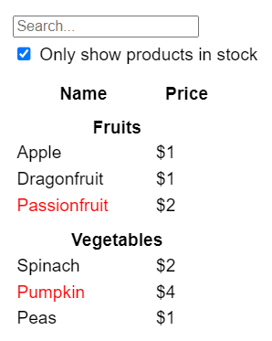
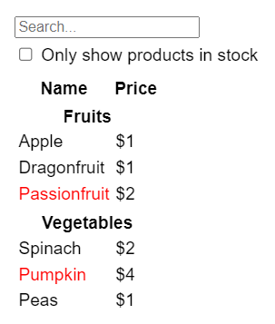
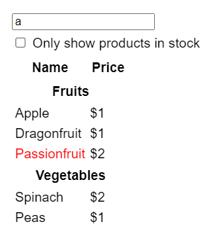

# Мыслим как React

React может изменить ваше представление о дизайне и приложениях, которые вы создаете. Когда вы создаете пользовательский интерфейс с помощью React, вы сначала разбиваете его на части, называемые _компонентами_. Затем вы опишете различные визуальные состояния для каждого из компонентов. Наконец, вы соедините компоненты вместе, чтобы данные проходили через них. В этом руководстве мы проведем вас через весь процесс создания таблицы данных о продукте с возможностью поиска с помощью React.

## Начните с макета

Представьте, что у вас уже есть JSON API и макет от дизайнера.

JSON API возвращает некоторые данные, которые выглядят следующим образом:

<!-- 0001.part.md -->

```js
[
    {
        category: 'Fruits',
        price: '$1',
        stocked: true,
        name: 'Apple',
    },
    {
        category: 'Fruits',
        price: '$1',
        stocked: true,
        name: 'Dragonfruit',
    },
    {
        category: 'Fruits',
        price: '$2',
        stocked: false,
        name: 'Passionfruit',
    },
    {
        category: 'Vegetables',
        price: '$2',
        stocked: true,
        name: 'Spinach',
    },
    {
        category: 'Vegetables',
        price: '$4',
        stocked: false,
        name: 'Pumpkin',
    },
    {
        category: 'Vegetables',
        price: '$1',
        stocked: true,
        name: 'Peas',
    },
];
```

<!-- 0002.part.md -->

Макет выглядит следующим образом:


Чтобы реализовать пользовательский интерфейс в React, вы обычно следуете тем же пяти шагам.

## Шаг 1: Разбейте пользовательский интерфейс на иерархию компонентов

Начните с того, что нарисуйте рамки вокруг каждого компонента и подкомпонента в макете и назовите их. Если вы работаете с дизайнером, возможно, он уже дал названия этим компонентам в своем инструменте проектирования. Спросите их!

В зависимости от вашего опыта, вы можете думать о разделении дизайна на компоненты разными способами:

-   **Программирование** - используйте те же приемы для принятия решения о том, следует ли создавать новую функцию или объект. Одним из таких методов является [принцип единой ответственности](https://ru.wikipedia.org/wiki/%D0%9F%D1%80%D0%B8%D0%BD%D1%86%D0%B8%D0%BF_%D0%B5%D0%B4%D0%B8%D0%BD%D1%81%D1%82%D0%B2%D0%B5%D0%BD%D0%BD%D0%BE%D0%B9_%D0%BE%D1%82%D0%B2%D0%B5%D1%82%D1%81%D1%82%D0%B2%D0%B5%D0%BD%D0%BD%D0%BE%D1%81%D1%82%D0%B8), то есть компонент в идеале должен делать только одну вещь. Если он разрастается, его следует декомпозировать на более мелкие подкомпоненты.
-   **CSS** - подумайте, для чего бы вы сделали селекторы классов. (Однако компоненты немного менее детализированы).
-   **Дизайн** - подумайте, как вы организуете слои дизайна.

Если ваш JSON хорошо структурирован, вы часто обнаружите, что он естественным образом соответствует компонентной структуре вашего пользовательского интерфейса. Это потому, что пользовательский интерфейс и модели данных часто имеют одну и ту же информационную архитектуру, то есть одну и ту же форму. Разделите свой пользовательский интерфейс на компоненты, где каждый компонент соответствует одной части вашей модели данных.

На этом экране пять компонентов:


1.  `FilterableProductTable` (серый) содержит все приложение.
2.  `SearchBar` (синий) получает пользовательский ввод.
3.  `ProductTable` (лавандовый) отображает и фильтрует список в соответствии с введенными пользователем данными.
4.  `ProductCategoryRow` (зеленый) отображает заголовок для каждой категории.
5.  `ProductRow` (желтый) отображает строку для каждого продукта.

Если вы посмотрите на `ProductTable` (лавандовый), то увидите, что заголовок таблицы (содержащий метки "Название" и "Цена") не является собственным компонентом. Это вопрос предпочтений, и вы можете пойти по любому пути. В данном примере он является частью `ProductTable`, поскольку появляется внутри списка `ProductTable`. Однако, если этот заголовок станет сложным (например, если вы добавите сортировку), вы можете переместить его в собственный компонент `ProductTableHeader`.

Теперь, когда вы определили компоненты в макете, расположите их в иерархию. Компоненты, которые появляются внутри другого компонента в макете, должны появляться как дочерние в иерархии:

-   `FilterableProductTable`
    -   `SearchBar`
    -   `ProductTable`
        -   `ProductCategoryRow`
        -   `ProductRow`

## Шаг 2: Создайте статическую версию в React

Теперь, когда у вас есть иерархия компонентов, пришло время реализовать ваше приложение. Наиболее простой подход заключается в создании версии

<!-- 0003.part.md -->

Чтобы создать статическую версию вашего приложения, которая отображает вашу модель данных, вам нужно создать [компоненты](your-first-component.md), которые повторно используют другие компоненты и передают данные с помощью [props](passing-props-to-a-component.md). Props - это способ передачи данных от родительского компонента к дочернему. (Если вы знакомы с концепцией [state](state-a-components-memory.md), не используйте state вообще для создания этой статической версии. Состояние предназначено только для интерактивности, то есть данных, которые изменяются во времени. Поскольку это статическая версия приложения, оно вам не нужно).

Вы можете строить либо "сверху вниз", начиная с создания компонентов выше по иерархии (например, `FilterableProductTable`), либо "снизу вверх", работая с компонентами ниже по иерархии (например, `ProductRow`). В более простых примерах обычно проще идти сверху вниз, а в больших проектах проще идти снизу вверх.

<!-- 0004.part.md -->

=== "App.js"

    ```js
    function ProductCategoryRow({ category }) {
    	return (
    		<tr>
    			<th colSpan="2">{category}</th>
    		</tr>
    	);
    }

    function ProductRow({ product }) {
    	const name = product.stocked ? (
    		product.name
    	) : (
    		<span style={{ color: 'red' }}>{product.name}</span>
    	);

    	return (
    		<tr>
    			<td>{name}</td>
    			<td>{product.price}</td>
    		</tr>
    	);
    }

    function ProductTable({ products }) {
    	const rows = [];
    	let lastCategory = null;

    	products.forEach((product) => {
    		if (product.category !== lastCategory) {
    			rows.push(
    				<ProductCategoryRow
    					category={product.category}
    					key={product.category}
    				/>
    			);
    		}
    		rows.push(
    			<ProductRow
    				product={product}
    				key={product.name}
    			/>
    		);
    		lastCategory = product.category;
    	});

    	return (
    		<table>
    			<thead>
    				<tr>
    					<th>Name</th>
    					<th>Price</th>
    				</tr>
    			</thead>
    			<tbody>{rows}</tbody>
    		</table>
    	);
    }

    function SearchBar() {
    	return (
    		<form>
    			<input type="text" placeholder="Search..." />
    			<label>
    				<input type="checkbox" /> Only show products
    				in stock
    			</label>
    		</form>
    	);
    }

    function FilterableProductTable({ products }) {
    	return (
    		<div>
    			<SearchBar />
    			<ProductTable products={products} />
    		</div>
    	);
    }

    const PRODUCTS = [
    	{
    		category: 'Fruits',
    		price: '$1',
    		stocked: true,
    		name: 'Apple',
    	},
    	{
    		category: 'Fruits',
    		price: '$1',
    		stocked: true,
    		name: 'Dragonfruit',
    	},
    	{
    		category: 'Fruits',
    		price: '$2',
    		stocked: false,
    		name: 'Passionfruit',
    	},
    	{
    		category: 'Vegetables',
    		price: '$2',
    		stocked: true,
    		name: 'Spinach',
    	},
    	{
    		category: 'Vegetables',
    		price: '$4',
    		stocked: false,
    		name: 'Pumpkin',
    	},
    	{
    		category: 'Vegetables',
    		price: '$1',
    		stocked: true,
    		name: 'Peas',
    	},
    ];

    export default function App() {
    	return <FilterableProductTable products={PRODUCTS} />;
    }
    ```

=== "Результат"

    

<!-- 0007.part.md -->

(Если этот код кажется пугающим, пройдите [Быстрый старт](index.md) сначала!)

После создания компонентов у вас будет библиотека многократно используемых компонентов, которые отображают вашу модель данных. Поскольку это статическое приложение, компоненты будут возвращать только JSX. Компонент на вершине иерархии (`FilterableProductTable`) будет принимать вашу модель данных в качестве пропса. Это называется _односторонним потоком данных_, потому что данные стекаются от компонента верхнего уровня к компонентам в нижней части дерева.

!!!warning "Внимание"

    На данном этапе вы не должны использовать никаких значений состояния. Это для следующего шага!

## Шаг 3: Найдите минимальное, но полное представление состояния пользовательского интерфейса

Чтобы сделать пользовательский интерфейс интерактивным, вам нужно позволить пользователям изменять вашу базовую модель данных. Для этого вы будете использовать _состояние_.

Думайте о состоянии как о минимальном наборе изменяемых данных, которые ваше приложение должно помнить. Наиболее важным принципом структурирования состояния является его [DRY (Don't Repeat Yourself)](https://en.wikipedia.org/wiki/Don%27t_repeat_yourself). Определите абсолютно минимальное представление состояния, которое необходимо вашему приложению, а все остальное вычисляйте по требованию. Например, если вы создаете список покупок, вы можете хранить элементы в виде массива в state. Если вы хотите также отобразить количество элементов в списке, не храните количество элементов как другое значение состояния - вместо этого считайте длину вашего массива.

Теперь подумайте обо всех элементах данных в этом примере приложения:

1.  Исходный список товаров
2.  Текст для поиска, введенный пользователем
3.  Значение флажка
4.  Отфильтрованный список продуктов

Какие из них являются состоянием? Определите те, которые не являются:

-   Остается ли он **неизменным** с течением времени? Если да, то это не состояние.
-   Передается ли он **от родителя** через пропсы? Если да, то это не состояние.
-   Можете ли вы вычислить его на основе существующего состояния или пропса в вашем компоненте? Если да, то это определенно не состояние!

То, что осталось - это, вероятно, состояние.

Давайте пройдемся по ним по одному:

1.  Исходный список продуктов _передается как пропс, поэтому это не состояние_.
2.  Текст поиска, похоже, является состоянием, поскольку он меняется со временем и не может быть вычислен из чего-либо.
3.  Значение флажка кажется состоянием, поскольку оно изменяется со временем и не может быть вычислено из чего-либо.
4.  Отфильтрованный список товаров **не является состоянием, потому что его можно вычислить**, взяв исходный список товаров и отфильтровав его в соответствии с текстом поиска и значением флажка.

Это означает, что только текст поиска и значение флажка являются состоянием! Отлично сделано!

!!!note "Props против State"

    В React есть два типа данных "модели": props и state. Эти два типа очень разные:

    -   [**Пропсы** - это как аргументы, которые вы передаете](passing-props-to-a-component.md) в функцию. Они позволяют родительскому компоненту передавать данные дочернему компоненту и настраивать его внешний вид. Например, `Форма` может

    -   [**Состояние** - это как память компонента](state-a-components-memory.md) Оно позволяет компоненту отслеживать некоторую информацию и изменять ее в ответ на взаимодействие. Например, `Button` может отслеживать состояние `isHovered`.

    пропсы и состояние - это разные вещи, но они работают вместе. Родительский компонент часто хранит некоторую информацию в состоянии (чтобы иметь возможность изменять ее) и _передает ее вниз_ дочерним компонентам в качестве их пропсов. Ничего страшного, если при первом прочтении разница покажется нечеткой. Потребуется немного практики, чтобы это действительно закрепилось!

## Шаг 4: Определите, где должно жить ваше состояние

После определения минимальных данных о состоянии вашего приложения, вам нужно определить, какой компонент отвечает за изменение этого состояния, или _владеет_ этим состоянием. Помните: React использует односторонний поток данных, передавая данные по иерархии компонентов от родительского компонента к дочернему. Может быть не сразу понятно, какой компонент должен владеть каким состоянием. Это может быть непросто, если вы новичок в этой концепции, но вы сможете разобраться, следуя этим шагам!

Для каждой части состояния в вашем приложении:

1.  Определите _каждый_ компонент, который отображает что-то на основе этого состояния.
2.  Найдите их ближайший общий родительский компонент - компонент, находящийся выше всех в иерархии.
3.  Решите, где должно находиться состояние:
    1.  Часто можно поместить состояние непосредственно в их общего родителя.
    2.  Вы также можете поместить состояние в какой-либо компонент над их общим родителем.
    3.  Если вы не можете найти компонент, в котором имеет смысл разместить состояние, создайте новый компонент только для хранения состояния и добавьте его куда-нибудь в иерархию над общим родительским компонентом.

В предыдущем шаге вы нашли две части состояния в этом приложении: текст ввода для поиска и значение флажка. В этом примере они всегда появляются вместе, поэтому имеет смысл поместить их в одно и то же место.

Теперь давайте проверим нашу стратегию для них:

1.  **Определите компоненты, использующие состояние:**.
    -   `ProductTable` должен фильтровать список товаров на основе этого состояния (текст поиска и значение флажка).
    -   `SearchBar` должен отображать это состояние (текст поиска и значение флажка).
2.  **Найдите их общего родителя:** Первый родительский компонент, который имеют оба компонента - `FilterableProductTable`.
3.  **Решите, где будет находиться состояние**: Мы будем хранить текст фильтра и проверенные значения состояния в `FilterableProductTable`.

Поэтому значения состояния будут находиться в `FilterableProductTable`.

Добавьте состояние в компонент с помощью хука [`useState()`](../reference/useState.md). Хуки - это специальные функции, которые позволяют вам "подключиться" к React. Добавьте две переменные состояния в верхней части `FilterableProductTable` и укажите их начальное состояние:

<!-- 0009.part.md -->

```js
function FilterableProductTable({ products }) {
    const [filterText, setFilterText] = useState('');
    const [inStockOnly, setInStockOnly] = useState(false);
}
```

<!-- 0010.part.md -->

Затем передайте `filterText` и `inStockOnly` в `ProductTable` и `SearchBar` в качестве пропсов:

<!-- 0011.part.md -->

```js
<div>
    <SearchBar
        filterText={filterText}
        inStockOnly={inStockOnly}
    />
    <ProductTable
        products={products}
        filterText={filterText}
        inStockOnly={inStockOnly}
    />
</div>
```

<!-- 0012.part.md -->

Вы можете начать видеть, как будет вести себя ваше приложение. Измените начальное значение `filterText` с `useState('')` на `useState('fruit')` в коде песочницы ниже. Вы увидите обновление как текста ввода поиска, так и таблицы:

<!-- 0013.part.md -->

=== "App.js"

    ```js
    import { useState } from 'react';

    function FilterableProductTable({ products }) {
    	const [filterText, setFilterText] = useState('');
    	const [inStockOnly, setInStockOnly] = useState(false);

    	return (
    		<div>
    			<SearchBar
    				filterText={filterText}
    				inStockOnly={inStockOnly}
    			/>
    			<ProductTable
    				products={products}
    				filterText={filterText}
    				inStockOnly={inStockOnly}
    			/>
    		</div>
    	);
    }

    function ProductCategoryRow({ category }) {
    	return (
    		<tr>
    			<th colSpan="2">{category}</th>
    		</tr>
    	);
    }

    function ProductRow({ product }) {
    	const name = product.stocked ? (
    		product.name
    	) : (
    		<span style={{ color: 'red' }}>{product.name}</span>
    	);

    	return (
    		<tr>
    			<td>{name}</td>
    			<td>{product.price}</td>
    		</tr>
    	);
    }

    function ProductTable({
    	products,
    	filterText,
    	inStockOnly,
    }) {
    	const rows = [];
    	let lastCategory = null;

    	products.forEach((product) => {
    		if (
    			product.name
    				.toLowerCase()
    				.indexOf(filterText.toLowerCase()) === -1
    		) {
    			return;
    		}
    		if (inStockOnly && !product.stocked) {
    			return;
    		}
    		if (product.category !== lastCategory) {
    			rows.push(
    				<ProductCategoryRow
    					category={product.category}
    					key={product.category}
    				/>
    			);
    		}
    		rows.push(
    			<ProductRow
    				product={product}
    				key={product.name}
    			/>
    		);
    		lastCategory = product.category;
    	});

    	return (
    		<table>
    			<thead>
    				<tr>
    					<th>Name</th>
    					<th>Price</th>
    				</tr>
    			</thead>
    			<tbody>{rows}</tbody>
    		</table>
    	);
    }

    function SearchBar({ filterText, inStockOnly }) {
    	return (
    		<form>
    			<input
    				type="text"
    				value={filterText}
    				placeholder="Search..."
    			/>
    			<label>
    				<input
    					type="checkbox"
    					checked={inStockOnly}
    				/>{' '}
    				Only show products in stock
    			</label>
    		</form>
    	);
    }

    const PRODUCTS = [
    	{
    		category: 'Fruits',
    		price: '$1',
    		stocked: true,
    		name: 'Apple',
    	},
    	{
    		category: 'Fruits',
    		price: '$1',
    		stocked: true,
    		name: 'Dragonfruit',
    	},
    	{
    		category: 'Fruits',
    		price: '$2',
    		stocked: false,
    		name: 'Passionfruit',
    	},
    	{
    		category: 'Vegetables',
    		price: '$2',
    		stocked: true,
    		name: 'Spinach',
    	},
    	{
    		category: 'Vegetables',
    		price: '$4',
    		stocked: false,
    		name: 'Pumpkin',
    	},
    	{
    		category: 'Vegetables',
    		price: '$1',
    		stocked: true,
    		name: 'Peas',
    	},
    ];

    export default function App() {
    	return <FilterableProductTable products={PRODUCTS} />;
    }
    ```

=== "Результат"

    

<!-- 0016.part.md -->

Обратите внимание, что редактирование формы пока не работает. В песочнице выше есть консольная ошибка, объясняющая почему:

```
You provided a `value` prop to a form field without an `onChange` handler.
This will render a read-only field.
```

В приведенной выше песочнице, `ProductTable` и `SearchBar` читают пропсы `filterText` и `inStockOnly` для рендеринга таблицы, input и checkbox. Например, вот как `SearchBar` заполняет значение ввода:

<!-- 0017.part.md -->

```js
function SearchBar({ filterText, inStockOnly }) {
    return (
        <form>
            <input
                type="text"
                value={filterText}
                placeholder="Search..."
            />
        </form>
    );
}
```

<!-- 0018.part.md -->

Однако вы еще не добавили код, реагирующий на действия пользователя, такие как ввод текста. Это будет ваш последний шаг.

## Шаг 5: Добавьте обратный поток данных

В настоящее время ваше приложение отображается правильно с пропсами и состоянием, перетекающими вниз по иерархии. Но чтобы изменить состояние в соответствии с пользовательским вводом, вам нужно поддерживать поток данных в обратном направлении: компоненты формы в глубине иерархии должны обновить состояние в `FilterableProductTable`.

React делает этот поток данных явным, но он требует немного больше ввода, чем двусторонняя привязка данных. Если вы попытаетесь напечатать или установить флажок в примере выше, вы увидите, что React игнорирует ваш ввод. Это сделано намеренно. Написав `<input value={filterText} />`, вы установили свойство `value` в `input`, чтобы оно всегда было равно состоянию `filterText`, переданному из `FilterableProductTable`. Поскольку состояние `filterText` никогда не устанавливается, вход никогда не изменяется.

Вы хотите сделать так, чтобы каждый раз, когда пользователь изменяет входные данные формы, состояние обновлялось, отражая эти изменения. Состояние принадлежит `FilterableProductTable`, поэтому только он может вызывать `setFilterText` и `setInStockOnly`. Чтобы позволить `SearchBar` обновлять состояние `FilterableProductTable`, необходимо передать эти функции `SearchBar`:

<!-- 0019.part.md -->

```js
function FilterableProductTable({ products }) {
    const [filterText, setFilterText] = useState('');
    const [inStockOnly, setInStockOnly] = useState(false);

    return (
        <div>
            <SearchBar
                filterText={filterText}
                inStockOnly={inStockOnly}
                onFilterTextChange={setFilterText}
                onInStockOnlyChange={setInStockOnly}
            />
        </div>
    );
}
```

<!-- 0020.part.md -->

Внутри `SearchBar` вы добавите обработчики событий `onChange` и установите родительское состояние из них:

<!-- 0021.part.md -->

```js
<input
    type="text"
    value={filterText}
    placeholder="Search..."
    onChange={(e) => onFilterTextChange(e.target.value)}
/>
```

<!-- 0022.part.md -->

Теперь приложение полностью работает!

<!-- 0023.part.md -->

=== "App.js"

    ```js
    import { useState } from 'react';

    function FilterableProductTable({ products }) {
    	const [filterText, setFilterText] = useState('');
    	const [inStockOnly, setInStockOnly] = useState(false);

    	return (
    		<div>
    			<SearchBar
    				filterText={filterText}
    				inStockOnly={inStockOnly}
    				onFilterTextChange={setFilterText}
    				onInStockOnlyChange={setInStockOnly}
    			/>
    			<ProductTable
    				products={products}
    				filterText={filterText}
    				inStockOnly={inStockOnly}
    			/>
    		</div>
    	);
    }

    function ProductCategoryRow({ category }) {
    	return (
    		<tr>
    			<th colSpan="2">{category}</th>
    		</tr>
    	);
    }

    function ProductRow({ product }) {
    	const name = product.stocked ? (
    		product.name
    	) : (
    		<span style={{ color: 'red' }}>{product.name}</span>
    	);

    	return (
    		<tr>
    			<td>{name}</td>
    			<td>{product.price}</td>
    		</tr>
    	);
    }

    function ProductTable({
    	products,
    	filterText,
    	inStockOnly,
    }) {
    	const rows = [];
    	let lastCategory = null;

    	products.forEach((product) => {
    		if (
    			product.name
    				.toLowerCase()
    				.indexOf(filterText.toLowerCase()) === -1
    		) {
    			return;
    		}
    		if (inStockOnly && !product.stocked) {
    			return;
    		}
    		if (product.category !== lastCategory) {
    			rows.push(
    				<ProductCategoryRow
    					category={product.category}
    					key={product.category}
    				/>
    			);
    		}
    		rows.push(
    			<ProductRow
    				product={product}
    				key={product.name}
    			/>
    		);
    		lastCategory = product.category;
    	});

    	return (
    		<table>
    			<thead>
    				<tr>
    					<th>Name</th>
    					<th>Price</th>
    				</tr>
    			</thead>
    			<tbody>{rows}</tbody>
    		</table>
    	);
    }

    function SearchBar({
    	filterText,
    	inStockOnly,
    	onFilterTextChange,
    	onInStockOnlyChange,
    }) {
    	return (
    		<form>
    			<input
    				type="text"
    				value={filterText}
    				placeholder="Search..."
    				onChange={(e) =>
    					onFilterTextChange(e.target.value)
    				}
    			/>
    			<label>
    				<input
    					type="checkbox"
    					checked={inStockOnly}
    					onChange={(e) =>
    						onInStockOnlyChange(
    							e.target.checked
    						)
    					}
    				/>{' '}
    				Only show products in stock
    			</label>
    		</form>
    	);
    }

    const PRODUCTS = [
    	{
    		category: 'Fruits',
    		price: '$1',
    		stocked: true,
    		name: 'Apple',
    	},
    	{
    		category: 'Fruits',
    		price: '$1',
    		stocked: true,
    		name: 'Dragonfruit',
    	},
    	{
    		category: 'Fruits',
    		price: '$2',
    		stocked: false,
    		name: 'Passionfruit',
    	},
    	{
    		category: 'Vegetables',
    		price: '$2',
    		stocked: true,
    		name: 'Spinach',
    	},
    	{
    		category: 'Vegetables',
    		price: '$4',
    		stocked: false,
    		name: 'Pumpkin',
    	},
    	{
    		category: 'Vegetables',
    		price: '$1',
    		stocked: true,
    		name: 'Peas',
    	},
    ];

    export default function App() {
    	return <FilterableProductTable products={PRODUCTS} />;
    }
    ```

=== "Результат"

    

<!-- 0026.part.md -->

Вы можете узнать все об обработке событий и обновлении состояния в разделе [Добавление интерактивности](adding-interactivity.md).

## Куда двигаться дальше

Это было очень краткое введение в то, как думать о создании компонентов и приложений с помощью React. Вы можете [начать проект React](installation.md) прямо сейчас или [углубиться в синтаксис](describing-the-ui.md), использованный в этом руководстве.

<!-- 0027.part.md -->

## Ссылки

-   [https://react.dev/learn/thinking-in-react](https://react.dev/learn/thinking-in-react)
