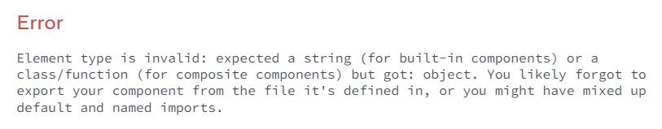

# Ваш первый компонент

**Компоненты** — это одна из основных концепций React. Они являются фундаментом, на котором вы строите пользовательские интерфейсы (UI), что делает их идеальным местом для начала вашего путешествия по React!

!!!tip "Вы узнаете"

    -   Что такое компонент
    -   Какую роль играют компоненты в приложении React
    -   Как написать свой первый компонент React

## Компоненты: UI строительные блоки

В Интернете HTML позволяет нам создавать богатые структурированные документы с помощью встроенного набора тегов, таких как `<h1>` и `<li>`:

<!-- 0001.part.md -->

```html
<article>
    <h1>My First Component</h1>
    <ol>
        <li>Components: UI Building Blocks</li>
        <li>Defining a Component</li>
        <li>Using a Component</li>
    </ol>
</article>
```

<!-- 0002.part.md -->

Эта разметка представляет статью `<article>`, ее заголовок `<h1>` и (сокращенное) оглавление в виде упорядоченного списка `<ol>`. Подобная разметка в сочетании с CSS для стиля и JavaScript для интерактивности лежит в основе каждой боковой панели, аватара, модала, выпадающего окна — всех элементов пользовательского интерфейса, которые вы видите в Интернете.

React позволяет объединять разметку, CSS и JavaScript в пользовательские "компоненты", **повторно используемые элементы пользовательского интерфейса для вашего приложения.** Код оглавления, который вы видели выше, можно превратить в компонент `<TableOfContents />`, который можно отображать на каждой странице. Под капотом он по-прежнему использует те же HTML-теги, такие как `<article>`, `<h1>` и т. д.

Как и в случае с HTML-тегами, вы можете компоновать, упорядочивать и вкладывать компоненты для создания целых страниц. Например, страница документации, которую вы читаете, состоит из компонентов React:

<!-- 0003.part.md -->

```js
<PageLayout>
    <NavigationHeader>
        <SearchBar />
        <Link to="/docs">Docs</Link>
    </NavigationHeader>
    <Sidebar />
    <PageContent>
        <TableOfContents />
        <DocumentationText />
    </PageContent>
</PageLayout>
```

<!-- 0004.part.md -->

По мере роста вашего проекта вы заметите, что многие из ваших конструкций могут быть составлены путем повторного использования уже написанных компонентов, что ускорит вашу разработку. Наше оглавление выше может быть добавлено на любой экран с помощью `<TableOfContents />`! Вы даже можете начать свой проект с тысяч компонентов, которыми поделилось сообщество разработчиков React, например, [Chakra UI](https://chakra-ui.com/) и [Material UI](https://material-ui.com/).

## Определение компонента

Традиционно при создании веб-страниц веб-разработчики размечали содержимое, а затем добавляли взаимодействие, добавляя немного JavaScript. Это отлично работало, когда взаимодействие было просто необходимостью в Интернете. Теперь от него ждут многие сайты и все приложения. React ставит интерактивность на первое место, используя при этом ту же технологию: **компонент React — это функция JavaScript, которую вы можете _посыпать разметкой_.** Вот как это выглядит:

<!-- 0005.part.md -->

=== "App.js"

    ```js
    export default function Profile() {
    	return (
    		
    	);
    }
    ```

=== "Результат"

    

<!-- 0008.part.md -->

А вот как создать компонент:

### Шаг 1: Экспорт компонента

Префикс `export default` — это [стандартный синтаксис JavaScript](https://developer.mozilla.org/docs/web/javascript/reference/statements/export) (не специфичный для React). Он позволяет отметить главную функцию в файле, чтобы впоследствии ее можно было импортировать из других файлов. Подробнее об импорте в [импорт и экспорт компонент](importing-and-exporting-components.md)!

### Шаг 2: Определить функцию

С помощью `function Profile() { }` вы определяете функцию JavaScript с именем `Profile`.

!!!warning "Внимание"

    Компоненты React являются обычными функциями JavaScript, но **их имена должны начинаться с заглавной буквы**, иначе они не будут работать!

### Шаг 3: Добавить разметку

Компонент возвращает тег `` с атрибутами `src` и `alt`. `` написан как HTML, но на самом деле это JavaScript под капотом! Этот синтаксис называется [JSX](writing-markup-with-jsx.md), и он позволяет встраивать разметку внутрь JavaScript.

Выражения return могут быть написаны на одной строке. Но если ваша разметка не находится на одной строке с ключевым словом `return`, вы должны заключить его в пару круглых скобок:

<!-- 0011.part.md -->

```js
return (
    <div>
        
    </div>
);
```

<!-- 0012.part.md -->

!!!warning "Внимание"

    Без круглых скобок любой код в строках после `return` [будет проигнорирован](https://stackoverflow.com/questions/2846283/what-are-the-rules-for-javascripts-automatic-semicolon-insertion-asi)!

## Использование компонента

Теперь, когда вы определили свой компонент `Profile`, вы можете вложить его в другие компоненты. Например, вы можете экспортировать компонент `Gallery`, который использует несколько компонентов `Profile`:

<!-- 0013.part.md -->

=== "App.js"

    ```js
    function Profile() {
    	return (
    		
    	);
    }

    export default function Gallery() {
    	return (
    		<section>
    			<h1>Amazing scientists</h1>
    			<Profile />
    			<Profile />
    			<Profile />
    		</section>
    	);
    }
    ```

=== "Результат"

    

<!-- 0016.part.md -->

### Что видит браузер

Обратите внимание на разницу в корпусе:

-   `<section>` строчная, поэтому React знает, что мы ссылаемся на HTML-тег.
-   `<Profile />` начинается с заглавной буквы `P`, поэтому React знает, что мы хотим использовать наш компонент под названием `Profile`.

А `Профиль` содержит еще больше HTML: ``. В итоге, вот что видит браузер:

<!-- 0017.part.md -->

```html
<section>
    <h1>Amazing scientists</h1>
    
    
    
</section>
```

<!-- 0018.part.md -->

### Вложение и организация компонентов

Компоненты — это обычные функции JavaScript, поэтому вы можете хранить несколько компонентов в одном файле. Это удобно, когда компоненты относительно небольшие или тесно связаны друг с другом. Если этот файл станет тесноват, вы всегда можете переместить `Profile` в отдельный файл. Как это сделать, вы узнаете в ближайшее время на [странице об импорте](importing-and-exporting-components.md).

Поскольку компоненты `Profile` отображаются внутри `Gallery` — даже несколько раз! — мы можем сказать, что `Gallery` является **родительским компонентом,** отображающим каждый `Profile` в качестве "ребенка". Это часть магии React: вы можете определить компонент один раз, а затем использовать его во многих местах и столько раз, сколько захотите.

!!!warning "Внимание"

    Компоненты могут рендерить другие компоненты, но **вы никогда не должны вкладывать их определения друг в друга:**.

    <!-- 0019.part.md -->

    ```js
    export default function Gallery() {
    	// 🔴 Never define a component inside another component!
    	function Profile() {
    		// ...
    	}
    	// ...
    }
    ```

    <!-- 0020.part.md -->

    Приведенный выше фрагмент [очень медленный и вызывает ошибки](preserving-and-resetting-state.md) Вместо этого определите каждый компонент на верхнем уровне:

    <!-- 0021.part.md -->

    ```js
    export default function Gallery() {
    	// ...
    }

    // ✅ Declare components at the top level
    function Profile() {
    	// ...
    }
    ```

    <!-- 0022.part.md -->

    Когда дочернему компоненту нужны данные от родительского, [передайте их параметрами](passing-props-to-a-component.md) вместо вложенных определений.

!!!note "Компоненты по порядку"

    Ваше приложение React начинается с "корневого" компонента. Обычно он создается автоматически, когда вы начинаете новый проект. Например, если вы используете [CodeSandbox](https://codesandbox.io/) или [Create React App](https://create-react-app.dev/), корневой компонент определяется в `src/App.js`. Если вы используете фреймворк [Next.js](https://nextjs.org/), корневой компонент определяется в `pages/index.js`. В этих примерах вы экспортировали корневые компоненты.

    Большинство приложений React используют компоненты по всему пути. Это означает, что вы будете использовать компоненты не только для многоразовых элементов, таких как кнопки, но и для более крупных элементов, таких как боковые панели, списки и, в конечном итоге, целые страницы! Компоненты — это удобный способ организации кода и разметки пользовательского интерфейса, даже если некоторые из них используются только один раз.

    [Фреймворки на основе React](start-a-new-react-project.md) делают еще один шаг вперед. Вместо того чтобы использовать пустой HTML-файл и позволить React "взять на себя" управление страницей с помощью JavaScript, они _также_ генерируют HTML автоматически из ваших компонентов React. Это позволяет вашему приложению показать некоторое содержимое до загрузки кода JavaScript.

    Тем не менее, многие веб-сайты используют React только для [добавления интерактивности на существующие HTML-страницы](add-react-to-an-existing-project.md) У них много корневых компонентов вместо одного для всей страницы. Вы можете использовать так много или так мало React, как вам нужно.

Вы только что впервые попробовали React! Давайте вспомним некоторые ключевые моменты.

!!!tip "Итого"

    -   React позволяет создавать компоненты, _повторно используемые элементы пользовательского интерфейса для вашего приложения_.
    -   В приложении React каждый элемент пользовательского интерфейса является компонентом.
    -   Компоненты React — это обычные функции JavaScript, за исключением:
    	1.  Их имена всегда начинаются с заглавной буквы.
    	2.  Они возвращают JSX-разметку.

## Задачи

### 1. Экспорт компонента

Этот код не работает, потому что корневой компонент не экспортируется:

=== "App.js"

    ```js
    function Profile() {
    	return (
    		
    	);
    }
    ```

=== "Результат"

    

<!-- 0026.part.md -->

Попробуйте исправить это сами, прежде чем смотреть на решение!

???success "Показать решение"

    Добавьте `export default` перед определением функции следующим образом:

    === "App.js"

    	```js
    	export default function Profile() {
    		return (
    			
    		);
    	}
    	```

    === "Результат"

    	

    Вам может быть интересно, почему одного написания `export` недостаточно для исправления этого примера. Вы можете узнать разницу между `export` и `export default` в [Импорт и экспорт компонентов](importing-and-exporting-components.md).

### 2. Исправьте оператор возврата

Что-то не так в этом выражении `return`. Можете ли вы исправить это?

```
export default function Profile() {
  return
    ;
}
```

???info "Показать подсказку"

    Вы можете получить ошибку "Unexpected token" при попытке исправить это. В этом случае проверьте, что точка с запятой стоит _после_ закрывающей скобки. Если оставить точку с запятой внутри `return ( )`, это приведет к ошибке.

???success "Показать решение"

    Вы можете исправить этот компонент, переместив оператор возврата на одну строку, как показано ниже:

    ```
    export default function Profile() {
    	return ;
    }
    ```

    Или обернув возвращаемую JSX-разметку в круглые скобки, которые открываются сразу после `return`:

    ```js
    export default function Profile() {
    	return (
    		
    	);
    }
    ```

<!-- 0042.part.md -->

### 3. Заметить ошибку

Что-то не так в том, как объявлен и используется компонент `Profile`. Можете ли вы найти ошибку? Постарайтесь вспомнить, как React отличает компоненты от обычных HTML-тегов!

<!-- 0043.part.md -->

```js
function profile() {
    return (
        
    );
}

export default function Gallery() {
    return (
        <section>
            <h1>Amazing scientists</h1>
            <profile />
            <profile />
            <profile />
        </section>
    );
}
```

<!-- 0046.part.md -->

???success "Показать решение"

    Имена компонентов React должны начинаться с заглавной буквы.

    Измените `function profile()` на `function Profile()`, а затем измените каждый `<profile />` на `<Profile />`:

    ```js
    function Profile() {
    	return (
    		
    	);
    }

    export default function Gallery() {
    	return (
    		<section>
    			<h1>Amazing scientists</h1>
    			<Profile />
    			<Profile />
    			<Profile />
    		</section>
    	);
    }
    ```

<!-- 0050.part.md -->

### 4. Ваш собственный компонент

Напишите компонент с нуля. Вы можете дать ему любое допустимое имя и вернуть любую разметку. Если у вас нет идей, вы можете написать компонент `Congratulations`, который показывает `<h1>Хорошая работа!</h1>`. Не забудьте экспортировать это!

```js
// Write your component below!
```

???success "Показать решение"

    ```js
    export default function Congratulations() {
    	return <h1>Хорошая работа!</h1>;
    }
    ```

## Ссылки

-   [https://react.dev/learn/your-first-component](https://react.dev/learn/your-first-component)
