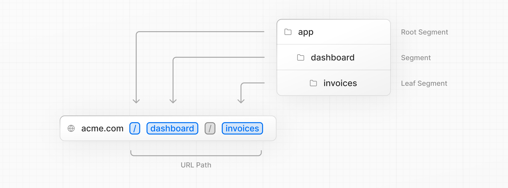
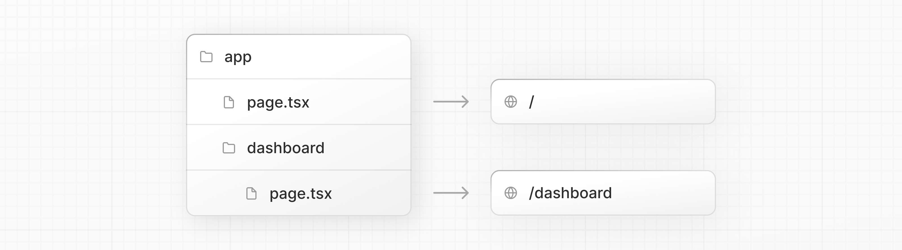
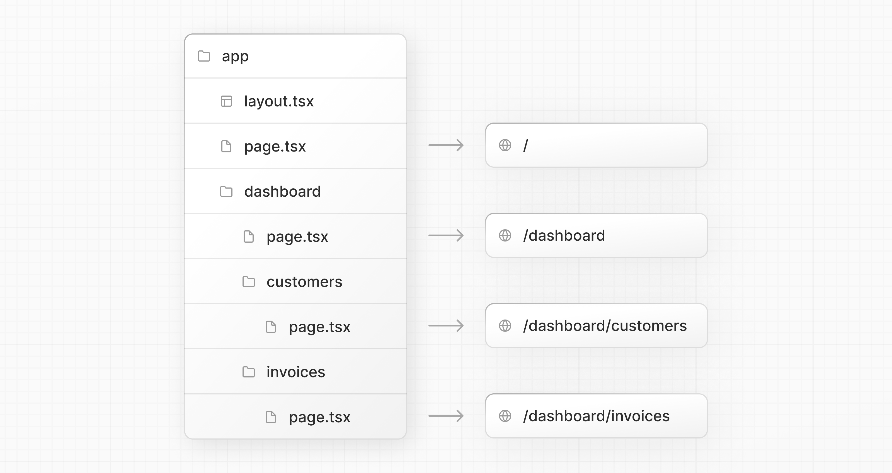
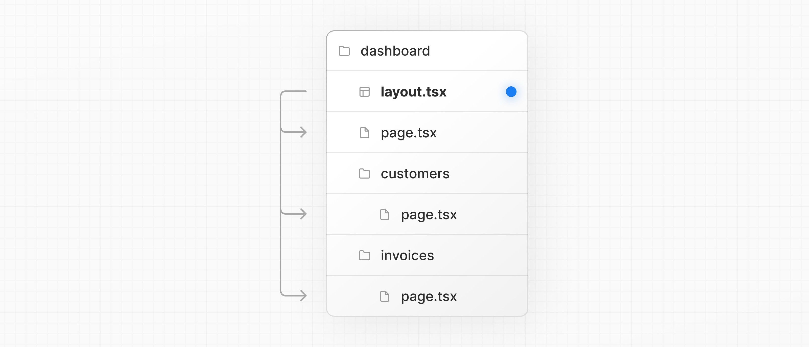
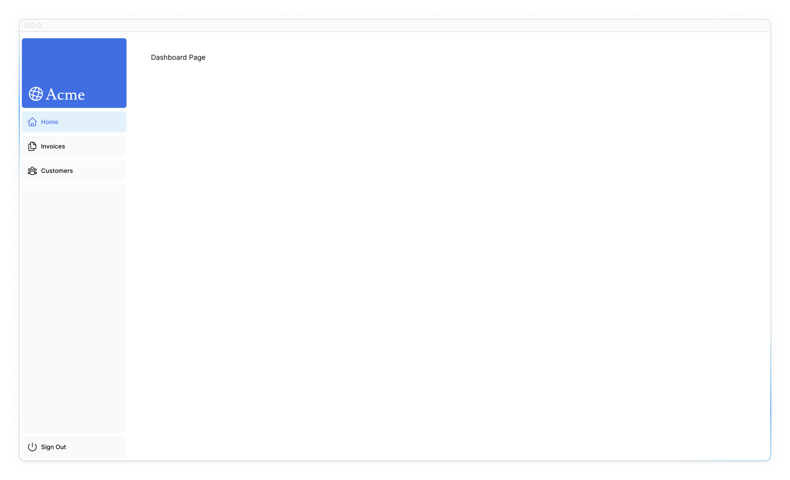
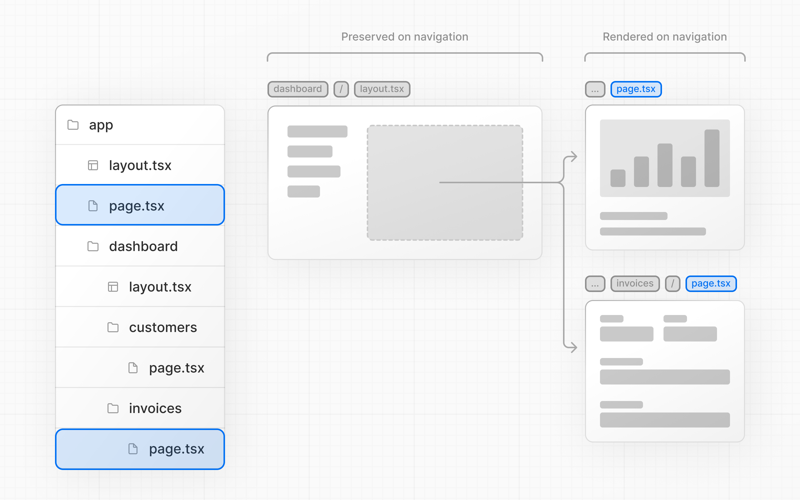

# Создание макетов и страниц

<big>Пока что в вашем приложении есть только главная страница. Давайте узнаем, как можно создать больше маршрутов с помощью макетов и страниц.</big>

!!!tip "Вот темы, которые мы рассмотрим"

    -   Создание маршрутов дашборда с использованием маршрутизации файловой системы.
    -   Поймите роль папок и файлов при создании новых сегментов маршрута.
    -   Создайте вложенный макет, который можно использовать совместно для нескольких страниц дашборда.
    -   Поймите, что такое размещение, частичный рендеринг и корневой макет.

## Вложенная маршрутизация

Next.js использует маршрутизацию с помощью файловой системы, где папки используются для создания вложенных маршрутов. Каждая папка представляет собой сегмент маршрута, который сопоставляется с сегментом URL.



Вы можете создавать отдельные пользовательские интерфейсы для каждого маршрута с помощью файлов `layout.tsx` и `page.tsx`.

`page.tsx` - это специальный файл Next.js, который экспортирует компонент React, и он необходим для того, чтобы маршрут был доступен. В вашем приложении уже есть файл страницы: `/app/page.tsx` - это главная страница, связанная с маршрутом `/`.

Чтобы создать вложенный маршрут, вы можете вложить папки друг в друга и добавить в них файлы `page.tsx`. Например:



`/app/dashboard/page.tsx` ассоциируется с путем `/dashboard`. Давайте создадим страницу, чтобы посмотреть, как она работает!

## Создание страницы дашборда

Создайте новую папку `dashboard` внутри `/app`. Затем создайте новый файл `page.tsx` в папке `dashboard` со следующим содержимым:

```ts title="/app/dashboard/page.tsx"
export default function Page() {
    return <p>Dashboard Page</p>;
}
```

Теперь убедитесь, что сервер разработки запущен, и посетите <http://localhost:3000/dashboard>. Вы должны увидеть текст «Страница дашборда».

Вот как можно создавать различные страницы в Next.js: создайте новый сегмент маршрута, используя папку, и добавьте в него файл `page`.

Благодаря специальному названию для файлов `page` Next.js позволяет [размещать](https://nextjs.org/docs/app/building-your-application/routing#colocation) компоненты пользовательского интерфейса, тестовые файлы и другой связанный код вместе с маршрутами. Только содержимое внутри файла `page` будет общедоступным. Например, папки `/ui` и `/lib` _размещаются_ внутри папки `/app` вместе с маршрутами.

## Практика: Создание страниц дашборда

Давайте попрактикуемся в создании дополнительных маршрутов. В вашем дашборде создайте еще две страницы:

1.  Страница клиентов: Страница должна быть доступна по адресу <http://localhost:3000/dashboard/customers>. Пока что она должна возвращать элемент `<p>Customers Page</p>`.
2.  Страница счетов: Страница счетов должна быть доступна по адресу <http://localhost:3000/dashboard/invoices>. Пока что она также должна возвращать элемент `<p>Invoices Page</p>`.

Потратьте некоторое время на выполнение этого упражнения, а когда будете готовы, разверните тумблер ниже для получения решения:

???info "Откройте решение"

    У вас должна быть следующая структура папок:

    

    Страница клиентов:

    ```ts title="/app/dashboard/customers/page.tsx"
    export default function Page() {
    	return <p>Customers Page</p>;
    }
    ```

    Страница «Счета-фактуры»:

    ```ts title="/app/dashboard/invoices/page.tsx"
    export default function Page() {
    	return <p>Invoices Page</p>;
    }
    ```

## Создание макета дашборда

Дашборды имеют некую навигацию, которая используется на нескольких страницах. В Next.js вы можете использовать специальный файл `layout.tsx` для создания пользовательского интерфейса, разделяемого между несколькими страницами. Давайте создадим макет для страниц дашборда!

В папке `/dashboard` добавьте новый файл `layout.tsx` и вставьте в него следующий код:

```ts title="/app/dashboard/layout.tsx"
import SideNav from '@/app/ui/dashboard/sidenav';

export default function Layout({
    children,
}: {
    children: React.ReactNode;
}) {
    return (
        <div className="flex h-screen flex-col md:flex-row md:overflow-hidden">
            <div className="w-full flex-none md:w-64">
                <SideNav />
            </div>
            <div className="flex-grow p-6 md:overflow-y-auto md:p-12">
                {children}
            </div>
        </div>
    );
}
```

В этом коде происходит несколько вещей, поэтому давайте разберем их по порядку:

Во-первых, вы импортируете компонент `<SideNav />` в ваш макет. Все компоненты, которые вы импортируете в этот файл, будут частью макета.

Компонент `<Layout />` получает свойство `children`. Этим дочерним компонентом может быть либо страница, либо другой макет. В вашем случае страницы внутри `/dashboard` будут автоматически вложены в `<Layout />` следующим образом:



Проверьте, что все работает правильно, сохранив изменения и проверив локальный хост. Вы должны увидеть следующее:



Одним из преимуществ использования макетов в Next.js является то, что при навигации обновляются только компоненты страницы, а макет не перерисовывается. Это называется [частичным рендерингом](https://nextjs.org/docs/app/building-your-application/routing/linking-and-navigating#4-partial-rendering), который сохраняет состояние React на стороне клиента в макете при переходе между страницами.



## Корневой макет

В главе 3 вы импортировали шрифт `Inter` в другой макет: `/app/layout.tsx`. Напоминаем:

```ts title="/app/layout.tsx"
import '@/app/ui/global.css';
import { inter } from '@/app/ui/fonts';

export default function RootLayout({
    children,
}: {
    children: React.ReactNode;
}) {
    return (
        <html lang="en">
            <body
                className={`${inter.className} antialiased`}
            >
                {children}
            </body>
        </html>
    );
}
```

Это называется [корневой макет](https://nextjs.org/docs/app/api-reference/file-conventions/layout#root-layouts) и требуется в каждом приложении Next.js. Любой пользовательский интерфейс, который вы добавите в корневой макет, будет общим для **всех** страниц вашего приложения. Вы можете использовать корневой макет для изменения тегов `<html>` и `<body>`, а также для добавления метаданных (подробнее о метаданных вы узнаете в [следующей главе](adding-metadata.md)).

Поскольку новый макет, который вы только что создали (`/app/dashboard/layout.tsx`), уникален для страниц дашборда, вам не нужно добавлять какой-либо пользовательский интерфейс в корневой макет выше.

<?quiz?>

question: Каково назначение файла layout в Next.js?
answer: Чтобы действовать в качестве глобального обработчика ошибок
answer: Для получения данных и управления состоянием всего приложения
answer-correct: Чтобы разделить пользовательский интерфейс на нескольких страницах
answer: Выступает в качестве точки входа для всего приложения
content:

<p>Именно так, файл макета - это лучший способ создать общий макет, который могут использовать все страницы вашего приложения.</p>
<?/quiz?>

<small>:material-information-outline: Источник &mdash; <https://nextjs.org/learn/dashboard-app/creating-layouts-and-pages></small>
