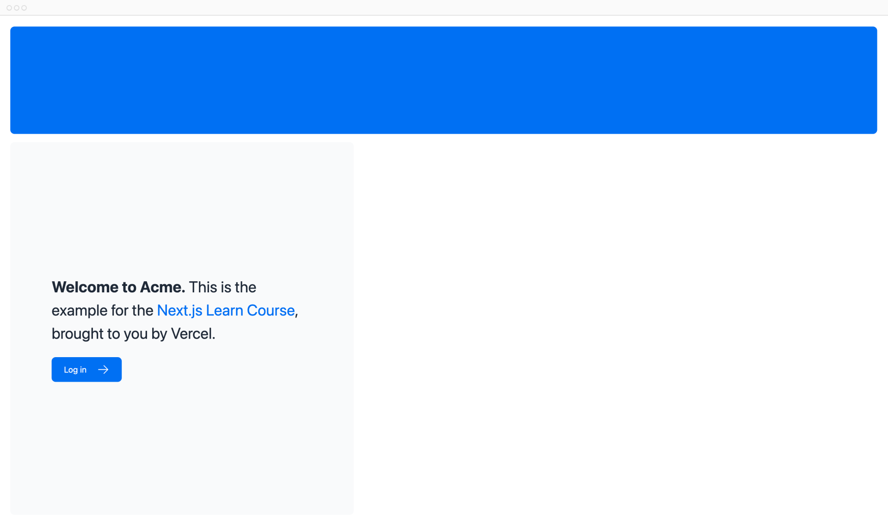

# Стилизация CSS

<big>В настоящее время у вашей домашней страницы нет никаких стилей. Давайте рассмотрим различные способы стилизации вашего приложения Next.js.</big>

!!!tip "Вот темы, которые мы рассмотрим"

    -   Как добавить глобальный CSS-файл в ваше приложение.
    -   Два разных способа стилизации: Tailwind и CSS-модули.
    -   Как условно добавлять имена классов с помощью пакета утилит `clsx`.

## Глобальные стили

Если вы заглянете в папку `/app/ui`, то увидите файл под названием `global.css`. Вы можете использовать этот файл для добавления CSS-правил ко **всем** маршрутам в вашем приложении - например, правила сброса CSS, общие для сайта стили для HTML-элементов, таких как ссылки, и многое другое.

Вы можете импортировать `global.css` в любой компонент вашего приложения, но обычно рекомендуется добавлять его в компонент верхнего уровня. В Next.js это [корневой макет](https://nextjs.org/docs/app/api-reference/file-conventions/layout#root-layouts) (подробнее об этом позже).

Добавьте глобальные стили в приложение, перейдя в `/app/layout.tsx` и импортировав файл `global.css`:

```ts title="/app/layout.tsx" hl_lines="1"
import '@/app/ui/global.css';

export default function RootLayout({
    children,
}: {
    children: React.ReactNode;
}) {
    return (
        <html lang="en">
            <body>{children}</body>
        </html>
    );
}
```

Если сервер разработки все еще работает, сохраните изменения и просмотрите их в браузере. Теперь ваша домашняя страница должна выглядеть следующим образом:



Но подождите секунду, вы же не добавили никаких CSS-правил, откуда взялись стили?

Если вы заглянете в `global.css`, то заметите несколько директив `@tailwind`:

```css title="/app/ui/global.css"
@tailwind base;
@tailwind components;
@tailwind utilities;
```

## Tailwind

[Tailwind](https://tailwindcss.com/) - это CSS-фреймворк, который ускоряет процесс разработки, позволяя вам быстро писать [полезные классы](https://tailwindcss.com/docs/utility-first) прямо в коде React.

В Tailwind вы придаете стиль элементам, добавляя имена классов. Например, добавив `"text-blue-500"`, вы сделаете текст `<h1>` синим:

```html
<h1 className="text-blue-500">I'm blue!</h1>
```

Хотя стили CSS используются глобально, каждый класс применяется к каждому элементу отдельно. Это означает, что если вы добавляете или удаляете элемент, вам не нужно беспокоиться о поддержании отдельных таблиц стилей, коллизии стилей или о том, что размер вашего пакета CSS будет расти по мере расширения приложения.

Когда вы используете `create-next-app` для начала нового проекта, Next.js спросит, хотите ли вы использовать Tailwind. Если вы выберете `да`, Next.js автоматически установит необходимые пакеты и настроит Tailwind в вашем приложении.

Если вы посмотрите на `/app/page.tsx`, то увидите, что в примере мы используем классы Tailwind.

```ts title="/app/page.tsx"
import AcmeLogo from '@/app/ui/acme-logo';
import { ArrowRightIcon } from '@heroicons/react/24/outline';
import Link from 'next/link';

export default function Page() {
    return (
        <main className="flex min-h-screen flex-col p-6">
            {/* These are Tailwind classes: */}
            <div className="flex h-20 shrink-0 items-end rounded-lg bg-blue-500 p-4 md:h-52">
                {/* ... */}
            </div>
        </main>
    );
}
```

Не волнуйтесь, если вы впервые используете Tailwind. Чтобы сэкономить время, мы уже стилизовали все компоненты, которые вы будете использовать.

Давайте поиграем с Tailwind! Скопируйте приведенный ниже код и вставьте его над элементом `<p>` в файле `/app/page.tsx`:

```html title="/app/page.tsx"
<div
    className="relative w-0 h-0 border-l-[15px] border-r-[15px] border-b-[26px] border-l-transparent border-r-transparent border-b-black"
/>
```

<?quiz?>

question: Какую фигуру вы видите при использовании приведенного выше фрагмента кода?
answer: Желтая звезда
answer: Синий треугольник
answer-correct: Черный треугольник
answer: Красный круг
content:

<p>Имена классов границ используются для создания формы треугольника.</p>
<?/quiz?>

Если вы предпочитаете писать традиционные правила CSS или хранить стили отдельно от JSX - модули CSS являются отличной альтернативой.

## CSS модули

[CSS модули](https://nextjs.org/docs/basic-features/built-in-css-support) позволяют привязать CSS к компоненту, автоматически создавая уникальные имена классов, так что вам не придется беспокоиться о коллизии стилей.

Мы продолжим использовать Tailwind в этом курсе, но давайте посмотрим, как можно добиться тех же результатов, что и в приведенном выше тесте, используя модули CSS.

Внутри `/app/ui` создайте новый файл `home.module.css` и добавьте в него следующие CSS-правила:

```css title="/app/ui/home.module.css"
.shape {
    height: 0;
    width: 0;
    border-bottom: 30px solid black;
    border-left: 20px solid transparent;
    border-right: 20px solid transparent;
}
```

Затем в файле `/app/page.tsx` импортируйте стили и замените имена классов Tailwind из `<div>`, которые вы добавили, на `styles.shape`:

```ts title="/app/page.tsx" hl_lines="4 9"
import AcmeLogo from '@/app/ui/acme-logo';
import { ArrowRightIcon } from '@heroicons/react/24/outline';
import Link from 'next/link';
import styles from '@/app/ui/home.module.css';

export default function Page() {
    return (
        <main className="flex min-h-screen flex-col p-6">
            <div className={styles.shape} />
            {/* ... */}
        </main>
    );
}
```

Сохраните изменения и просмотрите их в браузере. Вы должны увидеть ту же форму, что и раньше.

Tailwind и модули CSS - это два наиболее распространенных способа стилизации приложений Next.js. Использовать тот или иной способ - это вопрос предпочтений, вы даже можете использовать оба в одном приложении!

<?quiz?>

question: В чем одно из преимуществ использования модулей CSS?
answer: Увеличьте глобальную область видимости классов CSS, чтобы ими было проще управлять в разных файлах.
answer-correct: Предоставьте возможность сделать классы CSS локально привязанными к компонентам по умолчанию, что снижает риск конфликтов стилей.
answer: Автоматическое сжатие и минификация CSS-файлов для ускорения загрузки страниц.
content:

<p>Модули CSS создают уникальные имена классов для каждого компонента, поэтому вам не придется беспокоиться о столкновении стилей.</p>
<?/quiz?>

## Использование библиотеки clsx для переключения имен классов

Бывают случаи, когда необходимо условно стилизовать элемент, основываясь на состоянии или каком-то другом условии.

[`clsx`](https://www.npmjs.com/package/clsx) - это библиотека, позволяющая легко переключать имена классов. Для получения более подробной информации мы рекомендуем заглянуть в [documentation](https://github.com/lukeed/clsx), но вот основные способы использования:

Предположим, вы хотите создать компонент `InvoiceStatus`, который принимает `status`. Статус может быть `'pending'` или `'paid'`.
Если статус `'paid'`, то цвет должен быть зеленым. Если `'pending'`, то цвет должен быть серым.

Вы можете использовать `clsx` для условного применения классов, например, так:

```ts title="/app/ui/invoices/status.tsx" hl_lines="13-16"
import clsx from 'clsx';

export default function InvoiceStatus({
    status,
}: {
    status: string;
}) {
    return (
        <span
            className={clsx(
                'inline-flex items-center rounded-full px-2 py-1 text-sm',
                {
                    'bg-gray-100 text-gray-500':
                        status === 'pending',
                    'bg-green-500 text-white':
                        status === 'paid',
                }
            )}
        >
            {/* ... */}
        </span>
    );
}
```

<?quiz?>

question: Найдите `clsx` в редакторе кода, какие компоненты используют его для условного применения имен классов?
answer-correct: `status.tsx` и `pagination.tsx`
answer: `table.tsx` и `status.tsx`
answer: `nav-links.tsx` и `table.tsx`
content:

<p><code>status.tsx</code> и <code>pagination.tsx</code> компоненты используют <code>clsx</code></p>
<?/quiz?>

## Другие решения для стилизации

В дополнение к рассмотренным подходам, вы также можете стилизовать свое приложение Next.js с помощью:

-   Sass, который позволяет импортировать файлы `.css` и `.scss`.
-   Библиотеки CSS-in-JS, такие как [styled-jsx](https://github.com/vercel/styled-jsx), [styled-components](https://github.com/vercel/next.js/tree/canary/examples/with-styled-components) и [emotion](https://github.com/vercel/next.js/tree/canary/examples/with-emotion).

Для получения дополнительной информации посмотрите [CSS documentation](https://nextjs.org/docs/app/building-your-application/styling).

<small>:material-information-outline: Источник &mdash; <https://nextjs.org/learn/dashboard-app/css-styling></small>
