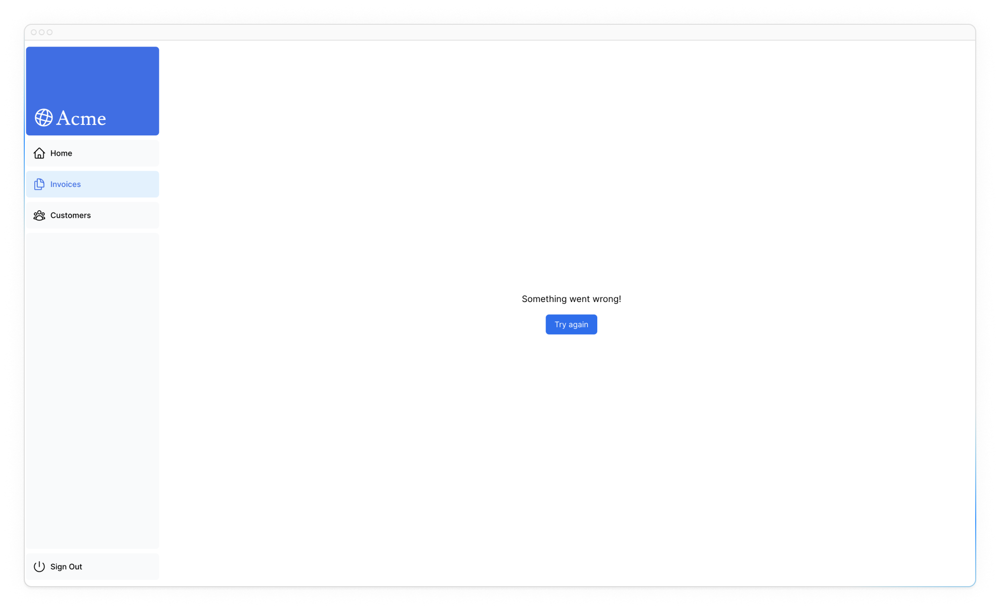
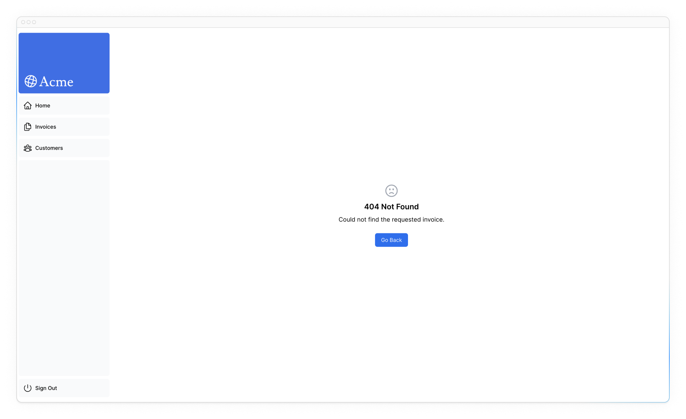

# Обработка ошибок

<big>В предыдущей главе вы узнали, как изменять данные с помощью Server Actions. Давайте посмотрим, как можно обрабатывать ошибки _грациозно_, используя операторы JavaScript `try/catch` и API Next.js для не пойманных исключений.</big>

!!!tip "Вот темы, которые мы рассмотрим"

    -   Как с помощью специального файла `error.tsx` отлавливать ошибки в сегментах маршрута и показывать пользователю резервный UI.
    -   Как использовать функцию `notFound` и файл `not-found` для обработки 404 ошибки (для несуществующих ресурсов).

## Добавление `try/catch` к действиям сервера

Во-первых, давайте добавим операторы JavaScript `try/catch` в ваши действия сервера, чтобы вы могли изящно обрабатывать ошибки.

Если вы знаете, как это сделать, потратьте несколько минут на обновление своих действий сервера, или вы можете скопировать приведенный ниже код:

???note "Раскрыть решение"

    ```ts title="/app/lib/actions.ts"
    export async function createInvoice(formData: FormData) {
    	const {
    		customerId,
    		amount,
    		status,
    	} = CreateInvoice.parse({
    		customerId: formData.get('customerId'),
    		amount: formData.get('amount'),
    		status: formData.get('status'),
    	});

    	const amountInCents = amount * 100;
    	const date = new Date().toISOString().split('T')[0];

    	try {
    		await sql`
    	INSERT INTO invoices (customer_id, amount, status, date)
    	VALUES (${customerId}, ${amountInCents}, ${status}, ${date})
    	`;
    	} catch (error) {
    		// We'll log the error to the console for now
    		console.error(error);
    	}

    	revalidatePath('/dashboard/invoices');
    	redirect('/dashboard/invoices');
    }
    ```

???note "Раскрыть решение"

    ```ts title="/app/lib/actions.ts"
    export async function updateInvoice(
    	id: string,
    	formData: FormData
    ) {
    	const {
    		customerId,
    		amount,
    		status,
    	} = UpdateInvoice.parse({
    		customerId: formData.get('customerId'),
    		amount: formData.get('amount'),
    		status: formData.get('status'),
    	});

    	const amountInCents = amount * 100;

    	try {
    		await sql`
    		UPDATE invoices
    		SET customer_id = ${customerId}, amount = ${amountInCents}, status = ${status}
    		WHERE id = ${id}
    	`;
    	} catch (error) {
    		// We'll log the error to the console for now
    		console.error(error);
    	}

    	revalidatePath('/dashboard/invoices');
    	redirect('/dashboard/invoices');
    }
    ```

Обратите внимание, что `redirect` вызывается вне блока `try/catch`. Это потому, что `redirect` работает, выбрасывая ошибку, которая будет поймана блоком `catch`. Чтобы избежать этого, вы можете вызвать `redirect` **после** `try/catch`. `redirect` будет доступен только в случае успешного завершения `try`.

Мы изящно справляемся с этими ошибками, отлавливая проблему с базой данных и возвращая полезное сообщение от нашего Server Action.

Что произойдет, если в вашем действии возникнет не пойманное исключение? Мы можем смоделировать это, вручную выбросив ошибку. Например, в действии `deleteInvoice` бросьте ошибку в верхней части функции:

```ts title="/app/lib/actions.ts" hl_lines="2"
export async function deleteInvoice(id: string) {
    throw new Error('Failed to Delete Invoice');

    // Unreachable code block
    await sql`DELETE FROM invoices WHERE id = ${id}`;
    revalidatePath('/dashboard/invoices');
}
```

Когда вы пытаетесь удалить счет-фактуру, вы должны увидеть ошибку на localhost. При запуске в производство вы хотите более изящно показывать пользователю сообщение, когда происходит что-то непредвиденное.

Здесь на помощь приходит файл Next.js [`error.tsx`](https://nextjs.org/docs/app/api-reference/file-conventions/error). Убедитесь, что вы удалили эту добавленную вручную ошибку после тестирования и перед переходом к следующему разделу.

## Обработка всех ошибок с помощью `error.tsx`

Файл `error.tsx` можно использовать для определения границ пользовательского интерфейса для сегмента маршрута. Он служит в качестве **catch-all** для непредвиденных ошибок и позволяет отображать пользователям резервный пользовательский интерфейс.

В папке `/dashboard/invoices` создайте новый файл с именем `error.tsx` и вставьте в него следующий код:

```ts title="/dashboard/invoices/error.tsx"
'use client';

import { useEffect } from 'react';

export default function Error({
    error,
    reset,
}: {
    error: Error & { digest?: string };
    reset: () => void;
}) {
    useEffect(() => {
        // Optionally log the error to an error reporting service
        console.error(error);
    }, [error]);

    return (
        <main className="flex h-full flex-col items-center justify-center">
            <h2 className="text-center">
                Something went wrong!
            </h2>
            <button
                className="mt-4 rounded-md bg-blue-500 px-4 py-2 text-sm text-white transition-colors hover:bg-blue-400"
                onClick={
                    // Attempt to recover by trying to re-render the invoices route
                    () => reset()
                }
            >
                Try again
            </button>
        </main>
    );
}
```

В приведенном выше коде вы заметите несколько вещей:

-   **"use client"** - `error.tsx` должен быть клиентским компонентом.
-   Он принимает два реквизита:
    -   `error`: Этот объект является экземпляром родного объекта JavaScript [`Error`](https://developer.mozilla.org/en-US/docs/Web/JavaScript/Reference/Global_Objects/Error).
    -   `reset`: Это функция для сброса границы ошибки. При выполнении функции будет предпринята попытка повторного отображения сегмента маршрута.

При повторной попытке удалить счет-фактуру вы должны увидеть следующий пользовательский интерфейс:



## Обработка 404 ошибки с помощью функции `notFound`

Еще один способ изящной обработки ошибок - использование функции `notFound`. В то время как `error.tsx` полезна для перехвата не пойманных исключений, `notFound` можно использовать, когда вы пытаетесь получить несуществующий ресурс.

Например, посетите <http://localhost:3000/dashboard/invoices/2e94d1ed-d220-449f-9f11-f0bbceed9645/edit>.

Это поддельный UUID, который не существует в вашей базе данных.

Вы сразу увидите, как сработает `error.tsx`, потому что это дочерний маршрут `/invoices`, где определен `error.tsx`.

Однако если вы хотите быть более конкретными, вы можете показать ошибку 404, чтобы сообщить пользователю, что ресурс, к которому он пытается получить доступ, не найден.

Вы можете подтвердить, что ресурс не был найден, зайдя в функцию `fetchInvoiceById` в `data.ts` и записав в консольный лог возвращаемый `invoice`:

```ts title="/app/lib/data.ts" hl_lines="6"
export async function fetchInvoiceById(id: string) {
    try {
        // ...

        console.log(invoice); // Invoice is an empty array []
        return invoice[0];
    } catch (error) {
        console.error('Database Error:', error);
        throw new Error('Failed to fetch invoice.');
    }
}
```

Теперь, когда вы знаете, что счет-фактура не существует в вашей базе данных, давайте воспользуемся функцией `notFound` для его обработки. Перейдите в `/dashboard/invoices/[id]/edit/page.tsx` и импортируйте `{ notFound }` из `'next/navigation'`.

Затем вы можете использовать условие для вызова `notFound`, если счет-фактура не существует:

```ts title="/dashboard/invoices/[id]/edit/page.tsx" hl_lines="5 17-19"
import {
    fetchInvoiceById,
    fetchCustomers,
} from '@/app/lib/data';
import { notFound } from 'next/navigation';

export default async function Page(props: {
    params: Promise<{ id: string }>;
}) {
    const params = await props.params;
    const id = params.id;
    const [invoice, customers] = await Promise.all([
        fetchInvoiceById(id),
        fetchCustomers(),
    ]);

    if (!invoice) {
        notFound();
    }

    // ...
}
```

Затем, чтобы показать пользователю UI ошибки, создайте файл `not-found.tsx` внутри папки `/edit`.


Внутри файла `not-found.tsx` вставьте следующий код:

```ts title="/dashboard/invoices/[id]/edit/not-found.tsx"
import Link from 'next/link';
import { FaceFrownIcon } from '@heroicons/react/24/outline';

export default function NotFound() {
    return (
        <main className="flex h-full flex-col items-center justify-center gap-2">
            <FaceFrownIcon className="w-10 text-gray-400" />
            <h2 className="text-xl font-semibold">
                404 Not Found
            </h2>
            <p>Could not find the requested invoice.</p>
            <Link
                href="/dashboard/invoices"
                className="mt-4 rounded-md bg-blue-500 px-4 py-2 text-sm text-white transition-colors hover:bg-blue-400"
            >
                Go Back
            </Link>
        </main>
    );
}
```

Обновите маршрут, и теперь вы должны увидеть следующий пользовательский интерфейс:



Имейте в виду, что `notFound` будет иметь приоритет над `error.tsx`, так что вы можете обратиться к нему, когда захотите обработать более специфические ошибки!

<?quiz?>

question: Какой файл в файле Next.js служит для устранения непредвиденных ошибок в сегментах маршрута?
answer: 404.tsx
answer: not-found.tsx
answer-correct: error.tsx
answer: catch-all.tsx
content:

<p><code>error.tsx</code> файл служит в качестве резервной копии для непредвиденных ошибок и позволяет отображать резервный пользовательский интерфейс для ваших пользователей.</p>
<?/quiz?>

## Рекомендуемая литература

Чтобы узнать больше об обработке ошибок в Next.js, ознакомьтесь со следующей документацией:

-   [Обработка ошибок](https://nextjs.org/docs/app/building-your-application/routing/error-handling)
-   [`error.js` API Reference](https://nextjs.org/docs/app/api-reference/file-conventions/error)
-   [`notFound()` API Reference](https://nextjs.org/docs/app/api-reference/functions/not-found)
-   [`not-found.js` API Reference](https://nextjs.org/docs/app/api-reference/file-conventions/not-found)

<small>:material-information-outline: Источник &mdash; <https://nextjs.org/learn/dashboard-app/error-handling></small>
