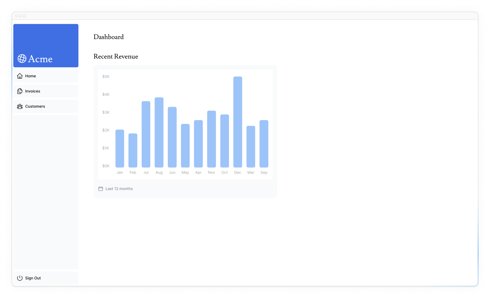
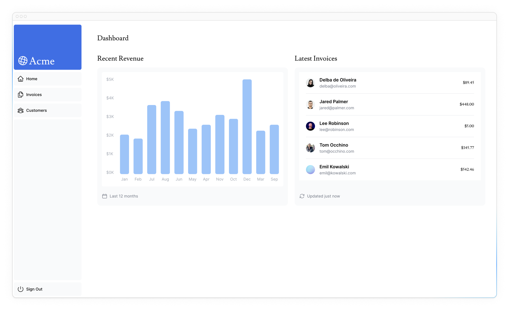
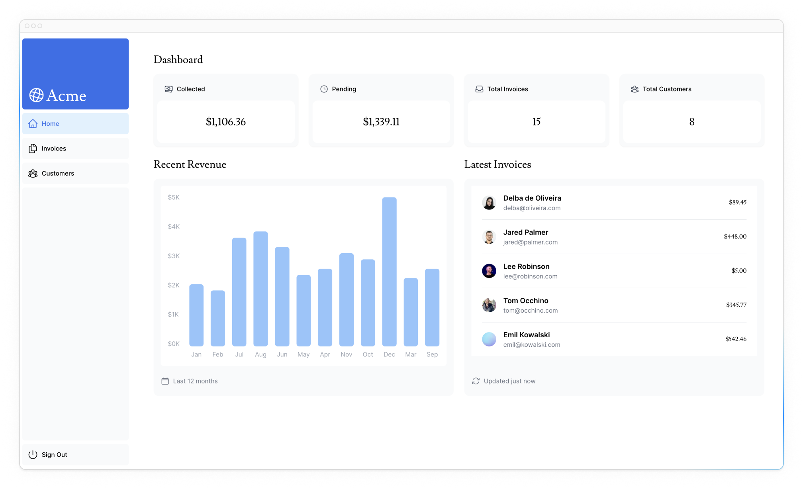
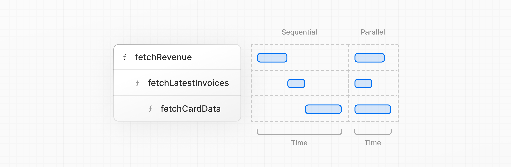

# Получение данных

<big>Теперь, когда вы создали и засеяли свою базу данных, давайте обсудим различные способы получения данных для вашего приложения и построим обзорную страницу дашборда.</big>

!!!tip "Вот темы, которые мы рассмотрим"

    -   Узнайте о некоторых подходах к получению данных: API, ORM, SQL и т. д.
    - Как серверные компоненты могут помочь вам получить более безопасный доступ к внутренним ресурсам.
    - Что такое сетевые водопады.
    - Как реализовать параллельную выборку данных с помощью JavaScript-паттерна.

## Выбор способа получения данных

### Слой API

API - это промежуточный слой между кодом вашего приложения и базой данных. Есть несколько случаев, когда вы можете использовать API:

-   Если вы используете сторонние сервисы, которые предоставляют API.
-   Если вы получаете данные от клиента, вам нужен слой API, работающий на сервере, чтобы не раскрывать клиенту секреты вашей базы данных.

В Next.js вы можете создавать конечные точки API с помощью [Route Handlers](https://nextjs.org/docs/app/building-your-application/routing/route-handlers).

### Запросы к базе данных

При создании приложения полного стека вам также потребуется написать логику для взаимодействия с базой данных. Для [реляционных баз данных](https://aws.amazon.com/relational-database/), таких как Postgres, вы можете сделать это с помощью SQL или [ORM](https://vercel.com/docs/storage/vercel-postgres/using-an-orm).

Есть несколько случаев, когда вам придется писать запросы к базе данных:

-   При создании конечных точек API вам нужно написать логику для взаимодействия с базой данных.
-   Если вы используете React Server Components (получение данных на сервере), вы можете пропустить слой API и запрашивать базу данных напрямую, не рискуя раскрыть секреты базы данных клиенту.

Давайте узнаем больше о серверных компонентах React.

### Использование серверных компонентов для получения данных

По умолчанию приложения Next.js используют **React Server Components**. Получение данных с помощью серверных компонентов - относительно новый подход, и у его использования есть несколько преимуществ:

-   Серверные компоненты поддерживают JavaScript Promises, предоставляя решение для асинхронных задач, таких как получение данных. Вы можете использовать синтаксис `async/await`, не нуждаясь в `useEffect`, `useState` или других библиотеках для получения данных.
-   Серверные компоненты работают на сервере, поэтому вы можете хранить дорогостоящие операции по выборке данных и логику на сервере, отправляя клиенту только результат.
-   Поскольку серверные компоненты работают на сервере, вы можете запрашивать базу данных напрямую, без дополнительного уровня API. Это избавляет вас от необходимости писать и поддерживать дополнительный код.

## Использование SQL

Для вашего приложения дашборда вы будете писать запросы к базе данных с помощью библиотеки [postgres.js](https://github.com/porsager/postgres) и SQL. Есть несколько причин, по которым мы будем использовать SQL:

-   SQL является промышленным стандартом для запросов к реляционным базам данных (например, ORM генерируют SQL под капотом).
-   Базовое понимание SQL может помочь вам понять основы реляционных баз данных, что позволит вам применить свои знания в других инструментах.
-   SQL универсален и позволяет получать конкретные данные и манипулировать ими.
-   Библиотека `postgres.js` обеспечивает защиту от [SQL-инъекций](https://github.com/porsager/postgres?tab=readme-ov-file#query-parameters).

Не волнуйтесь, если вы раньше не использовали SQL - мы подготовили для вас запросы.

Перейдите к файлу `/app/lib/data.ts`. Здесь вы увидите, что мы используем `postgres`. Функция `sql` [function](https://github.com/porsager/postgres) позволяет запросить базу данных:

```ts title="/app/lib/data.ts"
import postgres from 'postgres';

const sql = postgres(process.env.POSTGRES_URL!, {
    ssl: 'require',
});

// ...
```

Вы можете вызвать `sql` в любом месте на сервере, как и серверный компонент. Но чтобы вам было проще ориентироваться в компонентах, мы сохранили все запросы к данным в файле `data.ts`, и вы можете импортировать их в компоненты.

!!!note ""

    Если в главе 6 вы использовали собственный провайдер баз данных, вам нужно будет обновить запросы к базе данных, чтобы они работали с вашим провайдером. Запросы можно найти в файле `/app/lib/data.ts`.

## Получение данных для страницы обзора дашборда

Теперь, когда вы поняли различные способы получения данных, давайте получим данные для страницы обзора дашборда. Перейдите в `/app/dashboard/page.tsx`, вставьте следующий код и потратьте некоторое время на его изучение:

```ts title="/app/dashboard/page.tsx"
import { Card } from '@/app/ui/dashboard/cards';
import RevenueChart from '@/app/ui/dashboard/revenue-chart';
import LatestInvoices from '@/app/ui/dashboard/latest-invoices';
import { lusitana } from '@/app/ui/fonts';

export default async function Page() {
    return (
        <main>
            <h1
                className={`${lusitana.className} mb-4 text-xl md:text-2xl`}
            >
                Dashboard
            </h1>
            <div className="grid gap-6 sm:grid-cols-2 lg:grid-cols-4">
                {/* <Card title="Collected" value={totalPaidInvoices} type="collected" /> */}
                {/* <Card title="Pending" value={totalPendingInvoices} type="pending" /> */}
                {/* <Card title="Total Invoices" value={numberOfInvoices} type="invoices" /> */}
                {/* <Card
          title="Total Customers"
          value={numberOfCustomers}
          type="customers"
        /> */}
            </div>
            <div className="mt-6 grid grid-cols-1 gap-6 md:grid-cols-4 lg:grid-cols-8">
                {/* <RevenueChart revenue={revenue}  /> */}
                {/* <LatestInvoices latestInvoices={latestInvoices} /> */}
            </div>
        </main>
    );
}
```

Код выше намеренно закомментирован. Теперь мы начнем приводить примеры каждой части.

-   `page` - это серверный компонент **async**. Он позволяет использовать `await` для получения данных.
-   Также есть 3 компонента, которые получают данные: `<Card>`, `<RevenueChart>` и `<LatestInvoices>`. В настоящее время они закомментированы и пока не реализованы.

## Получение данных для `<RevenueChart/>`.

Чтобы получить данные для компонента `<RevenueChart/>`, импортируйте функцию `fetchRevenue` из `data.ts` и вызовите ее внутри вашего компонента:

```ts title="/app/dashboard/page.tsx" hl_lines="5 7-8"
import { Card } from '@/app/ui/dashboard/cards';
import RevenueChart from '@/app/ui/dashboard/revenue-chart';
import LatestInvoices from '@/app/ui/dashboard/latest-invoices';
import { lusitana } from '@/app/ui/fonts';
import { fetchRevenue } from '@/app/lib/data';

export default async function Page() {
    const revenue = await fetchRevenue();
    // ...
}
```

Далее сделаем следующее:

-   Откомментируйте компонент `<RevenueChart/>`.
-   Перейдите к файлу компонента (`/app/ui/dashboard/revenue-chart.tsx`) и откомментируйте код внутри него.
-   Проверьте `localhost:3000` и вы должны увидеть график, использующий данные `revenue`.



Давайте продолжим импортировать больше данных и отображать их на дашборде.

## Получение данных для `<LatestInvoices/>`

Для компонента `<LatestInvoices />` нам нужно получить 5 последних счетов-фактур, отсортированных по дате.

Вы можете получить все счета и отсортировать их с помощью JavaScript. Это не проблема, поскольку наши данные невелики, но по мере роста вашего приложения может значительно увеличиться объем данных, передаваемых при каждом запросе, и JavaScript, необходимый для их сортировки.

Вместо того чтобы сортировать последние счета в памяти, вы можете использовать SQL-запрос, чтобы получить только 5 последних счетов. Например, вот SQL-запрос из вашего файла `data.ts`:

```ts title="/app/lib/data.ts"
// Fetch the last 5 invoices, sorted by date
const data = await sql<LatestInvoiceRaw[]>`
  SELECT invoices.amount, customers.name, customers.image_url, customers.email
  FROM invoices
  JOIN customers ON invoices.customer_id = customers.id
  ORDER BY invoices.date DESC
  LIMIT 5`;
```

На своей странице импортируйте функцию `fetchLatestInvoices`:

```ts title="/app/dashboard/page.tsx" hl_lines="5-8 12"
import { Card } from '@/app/ui/dashboard/cards';
import RevenueChart from '@/app/ui/dashboard/revenue-chart';
import LatestInvoices from '@/app/ui/dashboard/latest-invoices';
import { lusitana } from '@/app/ui/fonts';
import {
    fetchRevenue,
    fetchLatestInvoices,
} from '@/app/lib/data';

export default async function Page() {
    const revenue = await fetchRevenue();
    const latestInvoices = await fetchLatestInvoices();
    // ...
}
```

Затем откомментируйте компонент `<LatestInvoices />`. Вам также нужно будет откомментировать соответствующий код в самом компоненте `<LatestInvoices />`, расположенном по адресу `/app/ui/dashboard/latest-invoices`.

Если вы зайдете на свой `localhost`, то увидите, что из базы данных возвращаются только последние `5`. Надеюсь, вы начинаете понимать преимущества прямого запроса к базе данных!



## Практика: Получение данных для компонентов `<Card>`

Теперь настала ваша очередь получить данные для компонентов `<Card>`. На карточках будут отображаться следующие данные:

-   Общая сумма собранных счетов.
-   Общая сумма счетов, ожидающих оплаты.
-   Общее количество счетов-фактур.
-   Общее количество клиентов.

Опять же, у вас может возникнуть соблазн получить все счета и клиентов и использовать JavaScript для работы с данными. Например, вы можете использовать `Array.length` для получения общего количества счетов и клиентов:

```ts
const totalInvoices = allInvoices.length;
const totalCustomers = allCustomers.length;
```

Но с помощью SQL вы можете получить только те данные, которые вам нужны. Это немного дольше, чем использование `Array.length`, но это означает, что во время запроса нужно передать меньше данных. Это альтернатива SQL:

```ts title="/app/lib/data.ts"
const invoiceCountPromise = sql`SELECT COUNT(*) FROM invoices`;
const customerCountPromise = sql`SELECT COUNT(*) FROM customers`;
```

Функция, которую вам нужно импортировать, называется `fetchCardData`. Вам нужно будет деструктурировать значения, возвращаемые функцией.

!!!tip "Подсказка"

    -   Проверьте компоненты карты, чтобы узнать, какие данные им нужны.
    -   Проверьте файл `data.ts`, чтобы увидеть, что возвращает функция.

Когда все будет готово, разверните тумблер ниже, чтобы увидеть окончательный код:

???note "Раскрыть решение"

    ```ts title="/app/dashboard/page.tsx" hl_lines="8 14-19"
    import { Card } from '@/app/ui/dashboard/cards';
    import RevenueChart from '@/app/ui/dashboard/revenue-chart';
    import LatestInvoices from '@/app/ui/dashboard/latest-invoices';
    import { lusitana } from '@/app/ui/fonts';
    import {
    	fetchRevenue,
    	fetchLatestInvoices,
    	fetchCardData,
    } from '@/app/lib/data';

    export default async function Page() {
    	const revenue = await fetchRevenue();
    	const latestInvoices = await fetchLatestInvoices();
    	const {
    		numberOfInvoices,
    		numberOfCustomers,
    		totalPaidInvoices,
    		totalPendingInvoices,
    	} = await fetchCardData();

    	return (
    		<main>
    			<h1
    				className={`${lusitana.className} mb-4 text-xl md:text-2xl`}
    			>
    				Dashboard
    			</h1>
    			<div className="grid gap-6 sm:grid-cols-2 lg:grid-cols-4">
    				<Card
    					title="Collected"
    					value={totalPaidInvoices}
    					type="collected"
    				/>
    				<Card
    					title="Pending"
    					value={totalPendingInvoices}
    					type="pending"
    				/>
    				<Card
    					title="Total Invoices"
    					value={numberOfInvoices}
    					type="invoices"
    				/>
    				<Card
    					title="Total Customers"
    					value={numberOfCustomers}
    					type="customers"
    				/>
    			</div>
    			<div className="mt-6 grid grid-cols-1 gap-6 md:grid-cols-4 lg:grid-cols-8">
    				<RevenueChart revenue={revenue} />
    				<LatestInvoices
    					latestInvoices={latestInvoices}
    				/>
    			</div>
    		</main>
    	);
    }
    ```

Отлично! Теперь вы получили все данные для страницы обзора дашборда. Ваша страница должна выглядеть следующим образом:



Однако... есть две вещи, о которых вы должны знать:

-   Запросы данных непреднамеренно блокируют друг друга, создавая **водопад запросов**.
-   По умолчанию Next.js **предусматривает** маршруты для повышения производительности, это называется Static Rendering. Таким образом, если ваши данные изменятся, они не будут отражены в дашборде.

Давайте обсудим номер 1 в этой главе, а затем подробно рассмотрим номер 2 в следующей главе.

## Что такое водопад запросов?

Под «водопадом» понимается последовательность сетевых запросов, зависящих от завершения предыдущих запросов. В случае с получением данных каждый запрос может начаться только после того, как предыдущий запрос вернет данные.



Например, нам нужно дождаться выполнения `fetchRevenue()`, прежде чем `fetchLatestInvoices()` сможет начать работу, и так далее.

```ts title="/app/dashboard/page.tsx"
const revenue = await fetchRevenue();
const latestInvoices = await fetchLatestInvoices(); // wait for fetchRevenue() to finish
const {
    numberOfInvoices,
    numberOfCustomers,
    totalPaidInvoices,
    totalPendingInvoices,
} = await fetchCardData(); // wait for fetchLatestInvoices() to finish
```

Такая схема не обязательно плоха. Бывают случаи, когда водопады нужны, потому что вы хотите, чтобы условие было выполнено до того, как вы сделаете следующий запрос. Например, сначала нужно получить идентификатор пользователя и информацию о его профиле. Получив идентификатор, можно перейти к получению списка его друзей. В этом случае каждый запрос зависит от данных, полученных от предыдущего запроса.

Однако такое поведение может быть непреднамеренным и влиять на производительность.

## Параллельная выборка данных

Распространенный способ избежать водопада - инициировать все запросы данных одновременно - параллельно.

В JavaScript вы можете использовать функции [`Promise.all()`](https://developer.mozilla.org/docs/Web/JavaScript/Reference/Global_Objects/Promise/all) или [`Promise.allSettled()`](https://developer.mozilla.org/docs/Web/JavaScript/Reference/Global_Objects/Promise/allSettled) для одновременной инициации всех обещаний. Например, в файле `data.ts` мы используем функцию `Promise.all()` в функции `fetchCardData()`:

```ts title="/app/lib/data.ts" hl_lines="10-14"
export async function fetchCardData() {
    try {
        const invoiceCountPromise = sql`SELECT COUNT(*) FROM invoices`;
        const customerCountPromise = sql`SELECT COUNT(*) FROM customers`;
        const invoiceStatusPromise = sql`SELECT
			SUM(CASE WHEN status = 'paid' THEN amount ELSE 0 END) AS "paid",
			SUM(CASE WHEN status = 'pending' THEN amount ELSE 0 END) AS "pending"
			FROM invoices`;

        const data = await Promise.all([
            invoiceCountPromise,
            customerCountPromise,
            invoiceStatusPromise,
        ]);
        // ...
    } catch (e) {
        // ...
    }
}
```

Используя этот паттерн, вы можете:

-   Начать выполнять все запросы на получение данных одновременно, что быстрее, чем ждать завершения каждого запроса в водопаде.
-   Использовать собственный JavaScript-шаблон, который можно применить к любой библиотеке или фреймворку.

Однако есть один **недостаток** в том, чтобы полагаться только на этот JavaScript-шаблон: что произойдет, если один запрос данных будет выполняться медленнее, чем все остальные? Давайте узнаем об этом в следующей главе.

<small>:material-information-outline: Источник &mdash; <https://nextjs.org/learn/dashboard-app/fetching-data></small>
