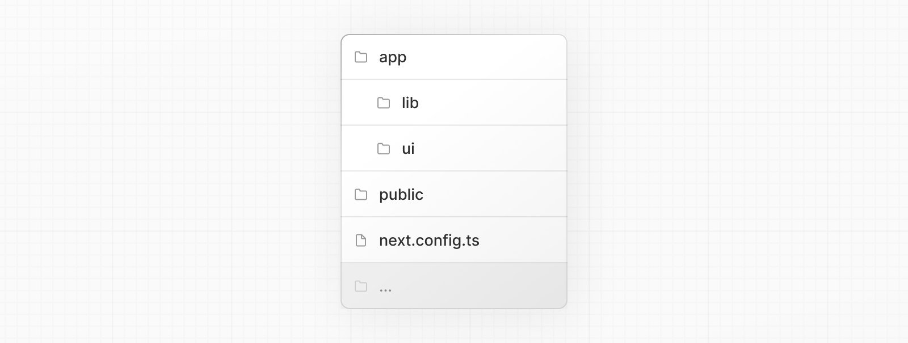
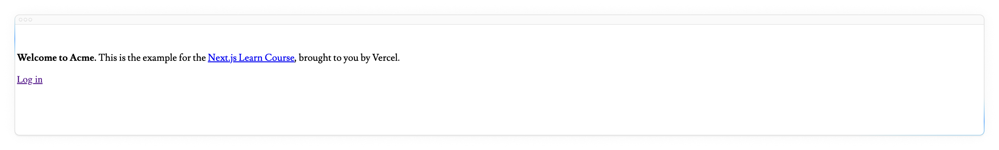

# Начало работы

## Создание нового проекта

Мы рекомендуем использовать [`pnpm`](https://pnpm.io/) в качестве менеджера пакетов, так как он быстрее и эффективнее, чем `npm` или `yarn`. Если у вас не установлен `pnpm`, вы можете установить его глобально, выполнив команду:

```sh title="Терминал"
npm install -g pnpm
```

Чтобы создать приложение Next.js, откройте терминал, перейдите в папку, в которой вы хотите хранить свой проект, и выполните следующую команду:

```sh title="Терминал"
npx create-next-app@latest nextjs-dashboard --example «https://github.com/vercel/next-learn/tree/main/dashboard/starter-example» --use-pnpm
```

Эта команда использует [`create-next-app`](https://nextjs.org/docs/app/api-reference/create-next-app), инструмент интерфейса командной строки (CLI), который создает для вас приложение Next.js. В приведенной выше команде вы также используете флаг `--example` с [начальным примером](https://github.com/vercel/next-learn/tree/main/dashboard/starter-example) для этого курса.

## Изучение проекта

В отличие от учебников, в которых вам приходится писать код с нуля, большая часть кода для этого курса уже написана за вас. Это лучше отражает реальную разработку, где вы, скорее всего, будете работать с существующими кодовыми базами.

Наша цель - помочь вам сосредоточиться на изучении основных возможностей Next.js, не прибегая к написанию всего кода приложения.

После установки откройте проект в редакторе кода и перейдите к `nextjs-dashboard`.

```sh title="Терминал"
cd nextjs-dashboard
```

Давайте потратим немного времени на изучение проекта.

### Структура папок

Вы заметите, что проект имеет следующую структуру папок:



-   `/app`: Содержит все маршруты, компоненты и логику вашего приложения, именно здесь вы будете работать в основном.
-   `/app/lib`: Содержит функции, используемые в вашем приложении, такие как утилиты многократного использования и функции получения данных.
-   `/app/ui`: Содержит все компоненты пользовательского интерфейса вашего приложения, такие как карточки, таблицы и формы. Чтобы сэкономить время, мы предварительно стилизовали эти компоненты для вас.
-   `/public`: Содержит все статические активы вашего приложения, такие как изображения.
-   _Файлы конфигурации_: В корне вашего приложения вы также заметите файлы конфигурации, такие как `next.config.ts`. Большинство этих файлов создаются и предварительно настраиваются при запуске нового проекта с помощью `create-next-app`. В этом курсе вам не придется их изменять.

Не стесняйтесь исследовать эти папки и не волнуйтесь, если вы пока не понимаете всего, что делает код.

### Данные-заполнители

Когда вы создаете пользовательские интерфейсы, полезно иметь некоторые данные-заполнители. Если база данных или API еще не доступны, вы можете:

-   Использовать данные-заполнители в формате JSON или в виде объектов JavaScript.
-   Использовать сторонний сервис, например [mockAPI](https://mockapi.io/).

Для этого проекта мы предоставили некоторые данные-плейсхолдеры в `app/lib/placeholder-data.ts`. Каждый объект JavaScript в этом файле представляет собой таблицу в вашей базе данных. Например, для таблицы счетов-фактур:

```ts title="/app/lib/placeholder-data.ts"
const invoices = [
    {
        customer_id: customers[0].id,
        amount: 15795,
        status: 'pending',
        date: '2022-12-06',
    },
    {
        customer_id: customers[1].id,
        amount: 20348,
        status: 'pending',
        date: '2022-11-14',
    },
    // ...
];
```

В главе, посвященной [настройке базы данных](./setting-up-your-database.md), вы будете использовать эти данные для посева базы данных (наполнения ее некоторыми исходными данными).

### TypeScript

Вы также можете заметить, что большинство файлов имеют суффикс `.ts` или `.tsx`. Это потому, что проект написан на TypeScript. Мы хотели создать курс, отражающий современный веб-ландшафт.

Ничего страшного, если вы не знаете TypeScript - мы будем предоставлять фрагменты кода на TypeScript, когда это потребуется.

А пока посмотрите на файл `/app/lib/definitions.ts`. Здесь мы вручную определяем типы, которые будут возвращаться из базы данных. Например, таблица `invoices` имеет следующие типы:

```ts title="/app/lib/definitions.ts"
export type Invoice = {
    id: string;
    customer_id: string;
    amount: number;
    date: string;
    // In TypeScript, this is called a string union type.
    // It means that the "status" property can only be one
    // of the two strings: 'pending' or 'paid'.
    status: 'pending' | 'paid';
};
```

Используя TypeScript, вы можете исключить случайную передачу неправильного формата данных в компоненты или базу данных, например, передачу `string` вместо `number` в `amount`.

Если вы являетесь разработчиком TypeScript:

-   Мы вручную объявляем типы данных, но для большей безопасности типов мы рекомендуем [Prisma](https://www.prisma.io/) или [Drizzle](https://orm.drizzle.team/), которые автоматически генерируют типы на основе схемы вашей базы данных.
-   Next.js определяет, использует ли ваш проект TypeScript, и автоматически устанавливает необходимые пакеты и конфигурацию. Next.js также поставляется с [плагином TypeScript](https://nextjs.org/docs/app/building-your-application/configuring/typescript#typescript-plugin) для вашего редактора кода, чтобы помочь с автозаполнением и безопасностью типов.

## Запуск сервера разработки

Запустите `pnpm i`, чтобы установить пакеты проекта.

```sh title="Терминал"
pnpm i
```

За ним следует `pnpm dev`, чтобы запустить сервер разработки.

```sh title="Терминал"
pnpm dev
```

`pnpm dev` запускает ваш сервер разработки Next.js на порту `3000`. Давайте проверим, работает ли он.

Откройте <http://localhost:3000> в вашем браузере. Ваша домашняя страница должна выглядеть так, как показано на этой странице, которая намеренно не оформлена:



<small>:material-information-outline: Источник &mdash; <https://nextjs.org/learn/dashboard-app/getting-started></small>
