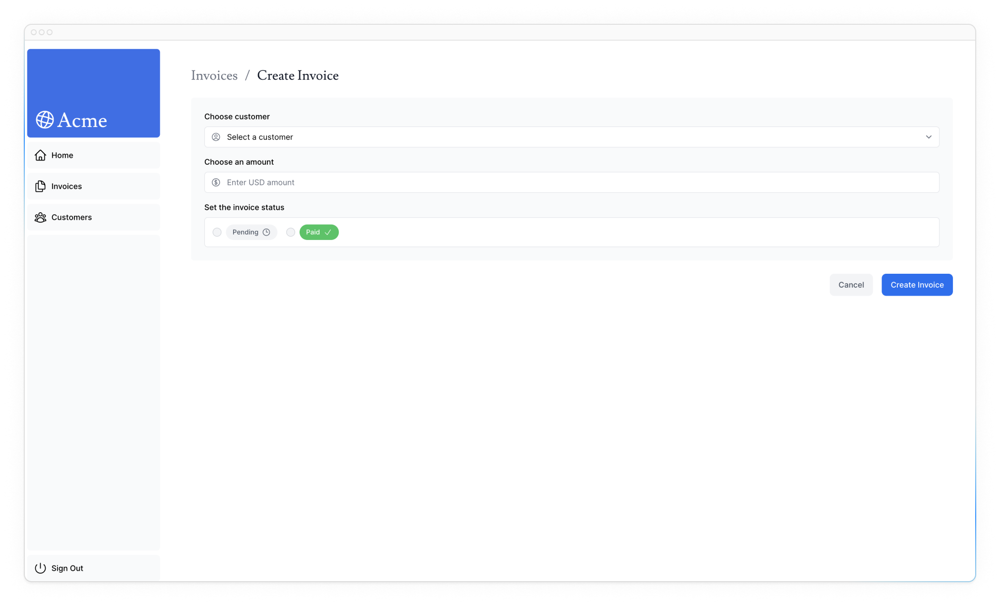
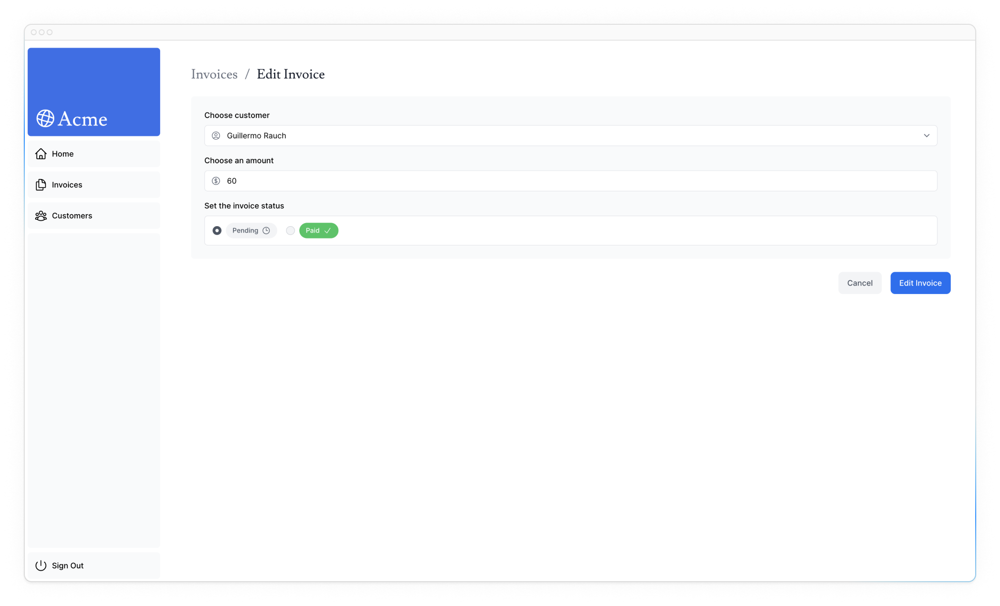

# Изменение данных

<big>В предыдущей главе вы реализовали поиск и пагинацию с помощью URL Search Params и Next.js API. Давайте продолжим работу над страницей «Счета», добавив возможность создавать, обновлять и удалять счета!</big>

!!!info "Вот темы, которые мы рассмотрим"

    -   Что такое React Server Actions и как их использовать для изменения данных.
    -   Как работать с формами и серверными компонентами.
    -   Лучшие практики работы с родным объектом `FormData`, включая валидацию типов.
    -   Как пересмотреть клиентский кэш с помощью API `revalidatePath`.
    -   Как создавать динамические сегменты маршрута с определенными идентификаторами.

## Что такое серверные операции?

React Server Actions позволяют запускать асинхронный код непосредственно на сервере. Они устраняют необходимость создания конечных точек API для изменения данных. Вместо этого вы пишете асинхронные функции, которые выполняются на сервере и могут быть вызваны из ваших клиентских или серверных компонентов.

Безопасность является главным приоритетом для веб-приложений, поскольку они могут быть уязвимы для различных угроз. Именно здесь на помощь приходят Server Actions. Они включают такие функции, как зашифрованные закрытия, строгие проверки ввода, хэширование сообщений об ошибках, ограничения хоста и многое другое - все вместе они значительно повышают безопасность вашего приложения.

## Использование форм с Server Actions

В React вы можете использовать атрибут `action` в элементе `<form>` для вызова действий. Действие автоматически получит нативный объект [FormData](https://developer.mozilla.org/en-US/docs/Web/API/FormData), содержащий перехваченные данные.

Например:

```ts
// Server Component
export default function Page() {
    // Action
    async function create(formData: FormData) {
        'use server';

        // Logic to mutate data...
    }

    // Invoke the action using the "action" attribute
    return <form action={create}>...</form>;
}
```

Преимуществом вызова Server Actions внутри Server Component является прогрессивное улучшение - формы работают, даже если JavaScript еще не загружен на клиенте. Например, при отсутствии медленных интернет-соединений.

## Next.js с Server Actions

Server Actions также глубоко интегрированы с Next.js [кэшированием](https://nextjs.org/docs/app/building-your-application/caching). Когда форма отправляется через Server Actions, вы можете не только использовать действие для изменения данных, но и пересмотреть связанный с ним кэш с помощью таких API, как `revalidatePath` и `revalidateTag`.

Давайте посмотрим, как все это работает вместе!

## Создание счета-фактуры

Вот шаги, которые необходимо предпринять, чтобы создать новый счет-фактуру:

1.  Создайте форму для ввода данных пользователем.
2.  Создайте Server Actions и вызовите его из формы.
3.  Внутри действия сервера извлеките данные из объекта `formData`.
4.  Проверьте и подготовьте данные для вставки в базу данных.
5.  Вставьте данные и обработайте все ошибки.
6.  Переопределите кэш и перенаправьте пользователя обратно на страницу счетов.

### 1. Создайте новый маршрут и форму

Для начала внутри папки `/invoices` добавьте новый сегмент маршрута `/create` с файлом `page.tsx`:


Вы будете использовать этот маршрут для создания новых счетов-фактур. Внутри вашего файла `page.tsx` вставьте следующий код, а затем потратьте некоторое время на его изучение:

```ts title="/dashboard/invoices/create/page.tsx"
import Form from '@/app/ui/invoices/create-form';
import Breadcrumbs from '@/app/ui/invoices/breadcrumbs';
import { fetchCustomers } from '@/app/lib/data';

export default async function Page() {
    const customers = await fetchCustomers();

    return (
        <main>
            <Breadcrumbs
                breadcrumbs={[
                    {
                        label: 'Invoices',
                        href: '/dashboard/invoices',
                    },
                    {
                        label: 'Create Invoice',
                        href: '/dashboard/invoices/create',
                        active: true,
                    },
                ]}
            />
            <Form customers={customers} />
        </main>
    );
}
```

Ваша страница - это серверный компонент, который получает данные `customers` и передает их компоненту `<Form>`. Чтобы сэкономить время, мы уже создали компонент `<Form>` для вас.

Перейдите к компоненту `<Form>`, и вы увидите, что форма:

-   Имеет один элемент `<select>` (выпадающий) со списком **клиентов**.
-   Имеет один элемент `<input>` для **суммы** с `type=«number»`.
-   Имеет два элемента `<input>` для статуса с `type=«radio»`.
-   Имеет одну кнопку с `type=«submit»`.

На <http://localhost:3000/dashboard/invoices/create> вы должны увидеть следующий пользовательский интерфейс:



### 2. Создание Server Action

Отлично, теперь давайте создадим серверное действие, которое будет вызываться при отправке формы.

Перейдите в директорию `lib/` и создайте новый файл с именем `actions.ts`. В верхней части этого файла добавьте директиву React [use server](https://react.dev/reference/react/use-server):

```ts title="/app/lib/actions.ts"
'use server';
```

Добавив `"use server"`, вы помечаете все экспортируемые функции в файле как Server Actions. Затем эти серверные функции можно импортировать и использовать в компонентах Client и Server. Все неиспользуемые функции, включенные в этот файл, будут автоматически удалены из конечного пакета приложения.

Вы также можете писать Server Actions непосредственно в компонентах сервера, добавляя `"use server"` внутри действия. Но для этого курса мы сохраним их все в отдельном файле. Мы рекомендуем иметь отдельный файл для ваших действий.

В файле `actions.ts` создайте новую асинхронную функцию, которая принимает `formData`:

```ts title="/app/lib/actions.ts" hl_lines="3"
'use server';

export async function createInvoice(formData: FormData) {}
```

Затем в компоненте `<Form>` импортируйте действие `createInvoice` из файла `actions.ts`. Добавьте атрибут `action` к элементу `<form>` и вызовите действие `createInvoice`.

```ts title="/app/ui/invoices/create-form.tsx" hl_lines="10 17"
import { CustomerField } from '@/app/lib/definitions';
import Link from 'next/link';
import {
    CheckIcon,
    ClockIcon,
    CurrencyDollarIcon,
    UserCircleIcon,
} from '@heroicons/react/24/outline';
import { Button } from '@/app/ui/button';
import { createInvoice } from '@/app/lib/actions';

export default function Form({
    customers,
}: {
    customers: CustomerField[];
}) {
    return <form action={createInvoice}>...</form>;
}
```

!!!note "Полезно знать"

    В HTML вы передаете URL в атрибуте `action`. Этот URL будет местом назначения, куда должны быть отправлены данные вашей формы (обычно это конечная точка API).

    Однако в React атрибут `action` считается специальным реквизитом - то есть React строит поверх него, чтобы позволить вызывать действия.

    За кулисами Server Actions создают конечную точку API `POST`. Вот почему при использовании Server Actions вам не нужно создавать конечные точки API вручную.

### 3. Извлечение данных из формы FormData

Вернувшись в файл `actions.ts`, вам нужно будет извлечь значения из `formData`, есть [пара методов](https://developer.mozilla.org/en-US/docs/Web/API/FormData), которые вы можете использовать. Для этого примера воспользуемся методом [`.get(name)`](https://developer.mozilla.org/en-US/docs/Web/API/FormData/get).

```ts title="/app/lib/actions.ts" hl_lines="3-11"
'use server';

export async function createInvoice(formData: FormData) {
    const rawFormData = {
        customerId: formData.get('customerId'),
        amount: formData.get('amount'),
        status: formData.get('status'),
    };
    // Test it out:
    console.log(rawFormData);
}
```

!!!tip "Подсказка"

    Если вы работаете с формами, содержащими много полей, возможно, вам стоит подумать об использовании метода [`entries()`](https://developer.mozilla.org/docs/Web/API/FormData/entries) с методом JavaScript [`Object.fromEntries()`](https://developer.mozilla.org/docs/Web/JavaScript/Reference/Global_Objects/Object/fromEntries).

Чтобы убедиться, что все подключено правильно, попробуйте использовать форму. После отправки вы должны увидеть данные, которые вы только что ввели в форму, зарегистрированные в вашем **терминале** (не в браузере).

Теперь, когда ваши данные имеют форму объекта, с ними будет гораздо проще работать.

### 4. Проверка и подготовка данных

Перед отправкой данных из формы в базу данных необходимо убедиться, что они имеют правильный формат и типы. Если вы помните из предыдущего курса, таблица счетов-фактур ожидает данные в следующем формате:

```ts title="/app/lib/definitions.ts"
export type Invoice = {
    id: string; // Will be created on the database
    customer_id: string;
    amount: number; // Stored in cents
    status: 'pending' | 'paid';
    date: string;
};
```

Пока у вас есть только `customer_id`, `amount` и `status` из формы.

**Валидация и принуждение типов**

Важно проверить, чтобы данные из формы соответствовали ожидаемым типам в вашей базе данных. Например, если вы добавите `console.log` внутри вашего действия:

```ts
console.log(typeof rawFormData.amount);
```

Вы заметите, что `amount` имеет тип `string`, а не `number`. Это потому, что элементы `input` с `type=«number»` на самом деле возвращают строку, а не число!

Чтобы справиться с проверкой типов, у вас есть несколько вариантов. Хотя вы можете проверять типы вручную, использование библиотеки проверки типов поможет вам сэкономить время и силы. В нашем примере мы будем использовать [Zod](https://zod.dev/), библиотеку проверки типов на основе TypeScript, которая может упростить вам эту задачу.

В файле `actions.ts` импортируйте Zod и определите схему, соответствующую форме объекта формы. Эта схема будет проверять `formData` перед сохранением в базу данных.

```ts title="/app/lib/actions.ts" hl_lines="3 5-11 13-16"
'use server';

import { z } from 'zod';

const FormSchema = z.object({
    id: z.string(),
    customerId: z.string(),
    amount: z.coerce.number(),
    status: z.enum(['pending', 'paid']),
    date: z.string(),
});

const CreateInvoice = FormSchema.omit({
    id: true,
    date: true,
});

export async function createInvoice(formData: FormData) {
    // ...
}
```

Поле `amount` специально настроено на коэрцитивную смену строки на число с одновременной проверкой его типа.

Затем вы можете передать ваши `rawFormData` в `CreateInvoice` для проверки типов:

```ts title="/app/lib/actions.ts" hl_lines="3-7"
// ...
export async function createInvoice(formData: FormData) {
    const {
        customerId,
        amount,
        status,
    } = CreateInvoice.parse({
        customerId: formData.get('customerId'),
        amount: formData.get('amount'),
        status: formData.get('status'),
    });
}
```

**Хранение значений в центах**

Обычно в базе данных принято хранить денежные значения в центах, чтобы исключить ошибки JavaScript с плавающей точкой и обеспечить большую точность.

Давайте переведем сумму в центы:

```ts title="/app/lib/actions.ts" hl_lines="12"
// ...
export async function createInvoice(formData: FormData) {
    const {
        customerId,
        amount,
        status,
    } = CreateInvoice.parse({
        customerId: formData.get('customerId'),
        amount: formData.get('amount'),
        status: formData.get('status'),
    });
    const amountInCents = amount * 100;
}
```

**Создание новых дат**

Наконец, давайте создадим новую дату с форматом «ГГГГ-ММ-ДД» для даты создания счета-фактуры:

```ts title="/app/lib/actions.ts" hl_lines="13"
// ...
export async function createInvoice(formData: FormData) {
    const {
        customerId,
        amount,
        status,
    } = CreateInvoice.parse({
        customerId: formData.get('customerId'),
        amount: formData.get('amount'),
        status: formData.get('status'),
    });
    const amountInCents = amount * 100;
    const date = new Date().toISOString().split('T')[0];
}
```

### 5. Вставка данных в базу данных

Теперь, когда у вас есть все необходимые значения для базы данных, вы можете создать SQL-запрос для вставки нового счета-фактуры в базу данных и передать переменные:

```ts title="/app/lib/actions.ts" hl_lines="2 23-26"
import { z } from 'zod';
import postgres from 'postgres';

const sql = postgres(process.env.POSTGRES_URL!, {
    ssl: 'require',
});

// ...

export async function createInvoice(formData: FormData) {
    const {
        customerId,
        amount,
        status,
    } = CreateInvoice.parse({
        customerId: formData.get('customerId'),
        amount: formData.get('amount'),
        status: formData.get('status'),
    });
    const amountInCents = amount * 100;
    const date = new Date().toISOString().split('T')[0];

    await sql`
    INSERT INTO invoices (customer_id, amount, status, date)
    VALUES (${customerId}, ${amountInCents}, ${status}, ${date})
  `;
}
```

Сейчас мы не обрабатываем никаких ошибок. Мы поговорим об этом в следующей главе. А пока перейдем к следующему шагу.

### 6. Ревалидация и перенаправление

Next.js имеет кэш маршрутизатора на стороне клиента, который хранит сегменты маршрута в браузере пользователя в течение некоторого времени. Вместе с [prefetching](https://nextjs.org/docs/app/building-your-application/routing/linking-and-navigating#1-prefetching) этот кэш обеспечивает пользователям быстрый переход между маршрутами, сокращая при этом количество запросов к серверу.

Поскольку вы обновляете данные, отображаемые в маршруте «Счета-фактуры», вам нужно очистить этот кэш и вызвать новый запрос к серверу. Это можно сделать с помощью функции [`revalidatePath`](https://nextjs.org/docs/app/api-reference/functions/revalidatePath) из Next.js:

```ts title="/app/lib/actions.ts" hl_lines="4 31"
'use server';

import { z } from 'zod';
import { revalidatePath } from 'next/cache';
import postgres from 'postgres';

const sql = postgres(process.env.POSTGRES_URL!, {
    ssl: 'require',
});

// ...

export async function createInvoice(formData: FormData) {
    const {
        customerId,
        amount,
        status,
    } = CreateInvoice.parse({
        customerId: formData.get('customerId'),
        amount: formData.get('amount'),
        status: formData.get('status'),
    });
    const amountInCents = amount * 100;
    const date = new Date().toISOString().split('T')[0];

    await sql`
    INSERT INTO invoices (customer_id, amount, status, date)
    VALUES (${customerId}, ${amountInCents}, ${status}, ${date})
  `;

    revalidatePath('/dashboard/invoices');
}
```

После обновления базы данных путь `/dashboard/invoices` будет перепроверен, и с сервера будут получены свежие данные.

В этот момент вы также хотите перенаправить пользователя обратно на страницу `/dashboard/invoices`. Это можно сделать с помощью функции [`redirect`](https://nextjs.org/docs/app/api-reference/functions/redirect) из Next.js:

```ts title="/app/lib/actions.ts" hl_lines="5 18"
'use server';

import { z } from 'zod';
import { revalidatePath } from 'next/cache';
import { redirect } from 'next/navigation';
import postgres from 'postgres';

const sql = postgres(process.env.POSTGRES_URL!, {
    ssl: 'require',
});

// ...

export async function createInvoice(formData: FormData) {
    // ...

    revalidatePath('/dashboard/invoices');
    redirect('/dashboard/invoices');
}
```

Поздравляем! Вы только что реализовали свое первое Server Actions. Протестируйте его, добавив новый счет-фактуру, если все работает правильно:

1.  При отправке вы должны быть перенаправлены на маршрут `/dashboard/invoices`.
2.  Вы должны увидеть новый счет-фактуру в верхней части таблицы.

## Обновление счета-фактуры

Форма обновления счета-фактуры аналогична форме создания счета-фактуры, за исключением того, что вам нужно будет передать `id` счета-фактуры, чтобы обновить запись в вашей базе данных. Давайте посмотрим, как можно получить и передать `id` счета-фактуры.

Вот шаги, которые необходимо выполнить для обновления счета-фактуры:

1.  Создайте новый сегмент динамического маршрута с `id` счета-фактуры.
2.  Считайте `id` счета-фактуры из параметров страницы.
3.  Получите конкретный счет-фактуру из базы данных.
4.  Предварительно заполните форму данными о счете.
5.  Обновите данные о счете-фактуре в своей базе данных.

### 1. Создайте сегмент динамического маршрута с идентификатором счета-фактуры

Next.js позволяет создавать [Сегменты динамических маршрутов](https://nextjs.org/docs/app/building-your-application/routing/dynamic-routes), когда вы не знаете точного названия сегмента и хотите создавать маршруты на основе данных. Это могут быть заголовки записей в блоге, страницы товаров и т. д. Вы можете создать динамические сегменты маршрутов, обернув имя папки в квадратные скобки. Например, `[id]`, `[post]` или `[slug]`.

В папке `/invoices` создайте новый динамический маршрут `[id]`, затем новый маршрут `edit` с файлом `page.tsx`. Ваша файловая структура должна выглядеть следующим образом:


В компоненте `<Table>` обратите внимание на кнопку `<UpdateInvoice />`, которая получает `id` счета-фактуры из записей таблицы.

```ts title="/app/ui/invoices/table.tsx" hl_lines="11"
export default async function InvoicesTable({
    query,
    currentPage,
}: {
    query: string;
    currentPage: number;
}) {
    return (
        // ...
        <td className="flex justify-end gap-2 whitespace-nowrap px-6 py-4 text-sm">
            <UpdateInvoice id={invoice.id} />
            <DeleteInvoice id={invoice.id} />
        </td>
        // ...
    );
}
```

Перейдите к компоненту `<UpdateInvoice />` и обновите `href` в `Link`, чтобы он принимал свойство `id`. Вы можете использовать литералы шаблона для ссылки на динамический сегмент маршрута:

```ts title="/app/ui/invoices/buttons.tsx" hl_lines="13"
import {
    PencilIcon,
    PlusIcon,
    TrashIcon,
} from '@heroicons/react/24/outline';
import Link from 'next/link';

// ...

export function UpdateInvoice({ id }: { id: string }) {
    return (
        <Link
            href={`/dashboard/invoices/${id}/edit`}
            className="rounded-md border p-2 hover:bg-gray-100"
        >
            <PencilIcon className="w-5" />
        </Link>
    );
}
```

### 2. Считайте `id` счета-фактуры из страницы `params`

Вернитесь к компоненту `<Page>` и вставьте следующий код:

```ts title="/app/dashboard/invoices/[id]/edit/page.tsx"
import Form from '@/app/ui/invoices/edit-form';
import Breadcrumbs from '@/app/ui/invoices/breadcrumbs';
import { fetchCustomers } from '@/app/lib/data';

export default async function Page() {
    return (
        <main>
            <Breadcrumbs
                breadcrumbs={[
                    {
                        label: 'Invoices',
                        href: '/dashboard/invoices',
                    },
                    {
                        label: 'Edit Invoice',
                        href: `/dashboard/invoices/${id}/edit`,
                        active: true,
                    },
                ]}
            />
            <Form invoice={invoice} customers={customers} />
        </main>
    );
}
```

Обратите внимание, что она похожа на страницу `/create` счета-фактуры, только импортирует другую форму (из файла `edit-form.tsx`). Эта форма должна быть **предварительно заполнена** со значением `defaultValue` для имени клиента, суммы счета и статуса. Чтобы предварительно заполнить поля формы, необходимо получить конкретный счет-фактуру с помощью `id`.

В дополнение к `searchParams`, компоненты страницы также принимают параметр `params`, который можно использовать для доступа к `id`. Обновите свой компонент `<Page>`, чтобы получить этот реквизит:

```ts title="/app/dashboard/invoices/[id]/edit/page.tsx" hl_lines="5-8"
import Form from '@/app/ui/invoices/edit-form';
import Breadcrumbs from '@/app/ui/invoices/breadcrumbs';
import { fetchCustomers } from '@/app/lib/data';

export default async function Page(props: {
    params: Promise<{ id: string }>;
}) {
    const params = await props.params;
    const id = params.id;
    // ...
}
```

### 3. Получите конкретный счет-фактуру

Затем:

-   Импортируйте новую функцию `fetchInvoiceById` и передайте `id` в качестве аргумента.
-   Импортируйте функцию `fetchCustomers`, чтобы получить имена клиентов для выпадающего списка.

Вы можете использовать `Promise.all` для параллельного получения данных о счетах и клиентах:

```ts title="/dashboard/invoices/[id]/edit/page.tsx" hl_lines="4-5 13-16"
import Form from '@/app/ui/invoices/edit-form';
import Breadcrumbs from '@/app/ui/invoices/breadcrumbs';
import {
    fetchInvoiceById,
    fetchCustomers,
} from '@/app/lib/data';

export default async function Page(props: {
    params: Promise<{ id: string }>;
}) {
    const params = await props.params;
    const id = params.id;
    const [invoice, customers] = await Promise.all([
        fetchInvoiceById(id),
        fetchCustomers(),
    ]);
    // ...
}
```

В терминале вы увидите временную ошибку TypeScript для свойства `invoice`, потому что `invoice` может быть потенциально `undefined`. Пока что не беспокойтесь об этом, вы решите эту проблему в следующей главе, когда добавите обработку ошибок.

Отлично! Теперь проверьте, что все подключено правильно. Зайдите на сайт <http://localhost:3000/dashboard/invoices> и нажмите на значок карандаша, чтобы отредактировать счет-фактуру. После навигации вы должны увидеть форму, в которую предварительно заносятся данные о счете:



URL также должен быть обновлен с `id` следующим образом: `http://localhost:3000/dashboard/invoice/uuid/edit`

!!!tip "UUID против автоинкрементных ключей"

    Мы используем UUID вместо инкрементных ключей (например, 1, 2, 3 и т. д.). Это делает URL длиннее, однако UUID исключают риск столкновения идентификаторов, являются глобально уникальными и снижают риск атак перечисления, что делает их идеальными для больших баз данных.

    Однако если вы предпочитаете более чистые URL-адреса, лучше использовать автоинкрементные ключи.

### 4. Передача id серверному действию

Наконец, вы хотите передать `id` серверному действию, чтобы оно могло обновить нужную запись в вашей базе данных. Вы **не можете** передать `id` в качестве аргумента, например:

```ts title="/app/ui/invoices/edit-form.tsx"
// Passing an id as argument won't work
<form action={updateInvoice(id)}>
```

Вместо этого вы можете передать `id` серверному действию с помощью JS `bind`. Это обеспечит кодировку любых значений, передаваемых серверному действию.

```ts title="/app/ui/invoices/edit-form.tsx" hl_lines="2 11-14 16-20"
// ...
import { updateInvoice } from '@/app/lib/actions';

export default function EditInvoiceForm({
    invoice,
    customers,
}: {
    invoice: InvoiceForm;
    customers: CustomerField[];
}) {
    const updateInvoiceWithId = updateInvoice.bind(
        null,
        invoice.id
    );

    return (
        <form action={updateInvoiceWithId}>
            {/* ... */}
        </form>
    );
}
```

!!!note "Замечание"

    Использование скрытого поля ввода в форме также работает (например, `<input type="hidden" name="id" value={invoice.id} />`). Однако значения будут отображаться в виде полного текста в HTML-источнике, что не идеально для конфиденциальных данных.

Затем в файле `actions.ts` создайте новое действие `updateInvoice`:

```ts title="/app/lib/actions.ts"
// Use Zod to update the expected types
const UpdateInvoice = FormSchema.omit({
    id: true,
    date: true,
});

// ...

export async function updateInvoice(
    id: string,
    formData: FormData
) {
    const {
        customerId,
        amount,
        status,
    } = UpdateInvoice.parse({
        customerId: formData.get('customerId'),
        amount: formData.get('amount'),
        status: formData.get('status'),
    });

    const amountInCents = amount * 100;

    await sql`
    UPDATE invoices
    SET customer_id = ${customerId}, amount = ${amountInCents}, status = ${status}
    WHERE id = ${id}
  `;

    revalidatePath('/dashboard/invoices');
    redirect('/dashboard/invoices');
}
```

Аналогично действию `createInvoice`, здесь вы:

1.  Извлекаем данные из `formData`.
2.  Проверка типов с помощью Zod.
3.  Преобразование суммы в центы.
4.  Передача переменных в SQL-запрос.
5.  Вызов `revalidatePath` для очистки клиентского кэша и выполнения нового запроса к серверу.
6.  Вызов `redirect` для перенаправления пользователя на страницу счета-фактуры.

Протестируйте его, отредактировав счет-фактуру. После отправки формы вы должны быть перенаправлены на страницу счета-фактуры, а счет-фактура должен быть обновлен.

## Удаление счета-фактуры

Чтобы удалить счет-фактуру с помощью Server Actions, оберните кнопку удаления в элемент `<form>` и передайте `id` серверному действию с помощью `bind`:

```ts title="/app/ui/invoices/buttons.tsx" hl_lines="1 6-9 12"
import { deleteInvoice } from '@/app/lib/actions';

// ...

export function DeleteInvoice({ id }: { id: string }) {
    const deleteInvoiceWithId = deleteInvoice.bind(
        null,
        id
    );

    return (
        <form action={deleteInvoiceWithId}>
            <button
                type="submit"
                className="rounded-md border p-2 hover:bg-gray-100"
            >
                <span className="sr-only">Delete</span>
                <TrashIcon className="w-4" />
            </button>
        </form>
    );
}
```

Внутри файла `actions.ts` создайте новое действие под названием `deleteInvoice`.

```ts title="/app/lib/actions.ts"
export async function deleteInvoice(id: string) {
    await sql`DELETE FROM invoices WHERE id = ${id}`;
    revalidatePath('/dashboard/invoices');
}
```

Поскольку это действие вызывается по пути `/dashboard/invoices`, вам не нужно вызывать `redirect`. Вызов `revalidatePath` вызовет новый запрос к серверу и перерисует таблицу.

## Дальнейшее чтение

В этой главе вы узнали, как использовать Server Actions для изменения данных. Вы также узнали, как использовать API `revalidatePath` для повторной проверки кэша Next.js и `redirect` для перенаправления пользователя на новую страницу.

Для получения дополнительных знаний вы также можете прочитать о [безопасность Server Actions](https://nextjs.org/blog/security-nextjs-server-components-actions).

<small>:material-information-outline: Источник &mdash; <https://nextjs.org/learn/dashboard-app/mutating-data></small>
