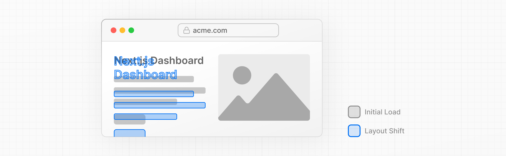

# Оптимизация шрифтов и изображений

<big>В предыдущей главе вы узнали, как придать стиль своему приложению Next.js. Давайте продолжим работу над главной страницей, добавив настраиваемый шрифт и основное изображение.</big>

!!!tip "Вот темы, которые мы рассмотрим:"

    -   Как добавить пользовательские шрифты с помощью `next/font`.
    -   Как добавлять изображения с помощью `next/image`.
    -   Как оптимизируются шрифты и изображения в Next.js.

## Зачем оптимизировать шрифты?

Шрифты играют важную роль в дизайне сайта, но использование пользовательских шрифтов в вашем проекте может повлиять на производительность, если файлы шрифтов должны быть получены и загружены.

[Cumulative Layout Shift](https://vercel.com/blog/how-core-web-vitals-affect-seo) - это метрика, используемая Google для оценки производительности и удобства работы с сайтом. При использовании шрифтов смещение макета происходит, когда браузер сначала отображает текст резервным или системным шрифтом, а затем меняет его на пользовательский шрифт после загрузки. Такая замена может привести к изменению размера текста, расстояния между шрифтами или макета, смещая элементы вокруг него.



Next.js автоматически оптимизирует шрифты в приложении, когда вы используете модуль `next/font`. Он загружает файлы шрифтов во время сборки и размещает их вместе с другими статическими активами. Это означает, что когда пользователь посещает ваше приложение, не происходит дополнительных сетевых запросов к шрифтам, которые могли бы повлиять на производительность.

## Добавление основного шрифта

Давайте добавим пользовательский шрифт Google в ваше приложение, чтобы посмотреть, как это работает.

В папке `/app/ui` создайте новый файл `fonts.ts`. Вы будете использовать этот файл для хранения шрифтов, которые будут использоваться во всем приложении.

Импортируйте шрифт `Inter` из модуля `next/font/google` - это будет ваш основной шрифт. Затем укажите, какое [подмножество](https://fonts.google.com/knowledge/glossary/subsetting) вы хотите загрузить. В данном случае `'latin'`:

```ts title="/app/layout.tsx" hl_lines="2 12"
import '@/app/ui/global.css';
import { inter } from '@/app/ui/fonts';

export default function RootLayout({
    children,
}: {
    children: React.ReactNode;
}) {
    return (
        <html lang="en">
            <body
                className={`${inter.className} antialiased`}
            >
                {children}
            </body>
        </html>
    );
}
```

Добавив `Inter` к элементу `<body>`, шрифт будет применяться во всем приложении. Здесь вы также добавляете класс Tailwind [antialiased](https://tailwindcss.com/docs/font-smoothing), который сглаживает шрифт. Использовать этот класс необязательно, но он добавляет приятный штрих.

Перейдите в браузер, откройте dev tools и выберите элемент `body`. Вы должны увидеть, что `Inter` и `Inter_Fallback` теперь применяются в стилях.

## Практика: Добавление дополнительного шрифта

Вы также можете добавить шрифты к определенным элементам вашего приложения.

Теперь ваша очередь! В файле `fonts.ts` импортируйте вторичный шрифт `Lusitana` и передайте его элементу `<p>` в файле `/app/page.tsx`. В дополнение к указанию подмножества, как вы делали раньше, вы также должны указать различные **веса** шрифта. Например, `400` (нормальный) и `700` (жирный).

Когда все будет готово, разверните фрагмент кода ниже, чтобы увидеть решение.

!!!tip "Подсказки:"

    -   Если вы не знаете, какие параметры веса передать шрифту, проверьте ошибки TypeScript в редакторе кода.
    -   Посетите сайт Google Fonts и найдите Lusitana, чтобы узнать, какие параметры доступны.
    -   Посмотрите документацию по добавлению нескольких шрифтов и полный список опций.

???info "Раскрыть решение"

    ```ts title="/app/ui/fonts.ts" hl_lines="1 5-8"
    import { Inter, Lusitana } from 'next/font/google';

    export const inter = Inter({ subsets: ['latin'] });

    export const lusitana = Lusitana({
    	weight: ['400', '700'],
    	subsets: ['latin'],
    });
    ```

    ---

    ```ts title="/app/page.tsx" hl_lines="4 10"
    import AcmeLogo from '@/app/ui/acme-logo';
    import { ArrowRightIcon } from '@heroicons/react/24/outline';
    import Link from 'next/link';
    import { lusitana } from '@/app/ui/fonts';

    export default function Page() {
    	return (
    		// ...
    		<p
    			className={`${lusitana.className} text-xl text-gray-800 md:text-3xl md:leading-normal`}
    		>
    			<strong>Welcome to Acme.</strong> This is the
    			example for the{' '}
    			<a
    				href="https://nextjs.org/learn/"
    				className="text-blue-500"
    			>
    				Next.js Learn Course
    			</a>
    			, brought to you by Vercel.
    		</p>
    		// ...
    	);
    }
    ```

Наконец, компонент `<AcmeLogo />` также использует Lusitana. Он был закомментирован для предотвращения ошибок, теперь его можно не комментировать:

```ts title="/app/page.tsx" hl_lines="7"
// ...

export default function Page() {
    return (
        <main className="flex min-h-screen flex-col p-6">
            <div className="flex h-20 shrink-0 items-end rounded-lg bg-blue-500 p-4 md:h-52">
                <AcmeLogo />
                {/* ... */}
            </div>
        </main>
    );
}
```

Отлично, вы добавили два пользовательских шрифта в свое приложение! Далее давайте добавим основное изображение на главную страницу.

## Зачем оптимизировать изображения?

Next.js может обслуживать **статические активы**, такие как изображения, в папке верхнего уровня [/public](https://nextjs.org/docs/app/building-your-application/optimizing/static-assets). На файлы внутри `/public` можно ссылаться в вашем приложении.

Используя обычный HTML, вы добавите изображение следующим образом:

```html

```

Однако это означает, что вам придется работать вручную:

-   Убедиться, что изображение реагирует на разные размеры экрана.
-   Задать размеры изображений для разных устройств.
-   Предотвратить смещение макета при загрузке изображений.
-   Ленивая загрузка изображений, которые находятся вне области просмотра пользователя.

Оптимизация изображений - это большая тема в веб-разработке, которую можно считать отдельной специализацией. Вместо того чтобы вручную выполнять эти оптимизации, вы можете использовать компонент `next/image` для автоматической оптимизации ваших изображений.

## Компонент `<Image>`

Компонент `<Image>` является расширением тега HTML `` и включает в себя автоматическую оптимизацию изображений, такую как:

-   Предотвращение автоматического смещения макета при загрузке изображений.
-   Изменение размера изображений, чтобы избежать отправки больших изображений на устройства с меньшей областью просмотра.
-   Ленивая загрузка изображений по умолчанию (изображения загружаются по мере их попадания в область просмотра).
-   Использование изображений в современных форматах, таких как [WebP](https://developer.mozilla.org/en-US/docs/Web/Media/Formats/Image_types#webp) и [AVIF](https://developer.mozilla.org/en-US/docs/Web/Media/Formats/Image_types#avif_image), если браузер поддерживает их.

## Добавление основного изображения рабочего стола

Давайте воспользуемся компонентом `<Image>`. Если вы заглянете в папку `/public`, то увидите, что там есть два изображения: `hero-desktop.png` и `hero-mobile.png`. Эти два изображения совершенно разные, и они будут показаны в зависимости от того, является ли устройство пользователя настольным или мобильным.

В файле `/app/page.tsx` импортируйте компонент из [next/image](https://nextjs.org/docs/api-reference/next/image). Затем добавьте изображение под комментарием:

```ts title="/app/page.tsx" hl_lines="5 12-18"
import AcmeLogo from '@/app/ui/acme-logo';
import { ArrowRightIcon } from '@heroicons/react/24/outline';
import Link from 'next/link';
import { lusitana } from '@/app/ui/fonts';
import Image from 'next/image';

export default function Page() {
    return (
        // ...
        <div className="flex items-center justify-center p-6 md:w-3/5 md:px-28 md:py-12">
            {/* Add Hero Images Here */}
            <Image
                src="/hero-desktop.png"
                width={1000}
                height={760}
                className="hidden md:block"
                alt="Screenshots of the dashboard project showing desktop version"
            />
        </div>
        //...
    );
}
```

Здесь вы устанавливаете `width` в `1000` и `height` в `760` пикселей. Хорошей практикой является установка `width` и `height` ваших изображений, чтобы избежать смещения макета, они должны иметь соотношение сторон **идентичное** исходному изображению. Эти значения не являются размером изображения, которое будет отрисовано, а представляют собой размер фактического файла изображения, используемого для определения соотношения сторон.

Вы также заметите класс `hidden`, чтобы убрать изображение из DOM на мобильных экранах, и `md:block`, чтобы показать его на настольных экранах.

Вот как теперь должна выглядеть ваша главная страница:


## Практика: Добавление основного изображения для мобильных устройств

Теперь ваша очередь! Под основным изображением, которое вы только что добавили, добавьте еще один компонент `<Image>` для `hero-mobile.png`.

-   Это изображение должно иметь `width` в `560` и `height` в `620` пикселей.
-   Оно должно быть показано на мобильных экранах и скрыто на десктопе - вы можете использовать инструменты dev, чтобы проверить, правильно ли поменялись местами десктопные и мобильные изображения.

Когда все будет готово, разверните фрагмент кода ниже, чтобы увидеть решение.

???info "Раскрыть решение"

    ```ts title="/app/page.tsx" hl_lines="19-25"
    import AcmeLogo from '@/app/ui/acme-logo';
    import { ArrowRightIcon } from '@heroicons/react/24/outline';
    import Link from 'next/link';
    import { lusitana } from '@/app/ui/fonts';
    import Image from 'next/image';

    export default function Page() {
    	return (
    		// ...
    		<div className="flex items-center justify-center p-6 md:w-3/5 md:px-28 md:py-12">
    			{/* Add Hero Images Here */}
    			<Image
    				src="/hero-desktop.png"
    				width={1000}
    				height={760}
    				className="hidden md:block"
    				alt="Screenshots of the dashboard project showing desktop version"
    			/>
    			<Image
    				src="/hero-mobile.png"
    				width={560}
    				height={620}
    				className="block md:hidden"
    				alt="Screenshot of the dashboard project showing mobile version"
    			/>
    		</div>
    		//...
    	);
    }
    ```

Отлично! Теперь на вашей главной странице есть пользовательский шрифт и основные изображения.

## Рекомендуемая литература

Вы можете узнать еще много нового по этим темам, включая оптимизацию удаленных изображений и использование локальных файлов шрифтов. Если вы хотите глубже изучить шрифты и изображения, см:

-   [Image Optimization Docs](https://nextjs.org/docs/app/building-your-application/optimizing/images)
-   [Font Optimization Docs](https://nextjs.org/docs/app/building-your-application/optimizing/fonts)
-   [Improving Web Performance with Images (MDN)](https://developer.mozilla.org/en-US/docs/Learn/Performance/Multimedia)
-   [Web Fonts (MDN)](https://developer.mozilla.org/en-US/docs/Learn/CSS/Styling_text/Web_fonts)
-   [Как основные показатели веб-страниц влияют на SEO](https://vercel.com/blog/how-core-web-vitals-affect-seo)
-   [Как Google обрабатывает JavaScript в процессе индексации](https://vercel.com/blog/how-google-handles-javascript-throughout-the-indexing-process)

<small>:material-information-outline: Источник &mdash; <https://nextjs.org/learn/dashboard-app/optimizing-fonts-images></small>
