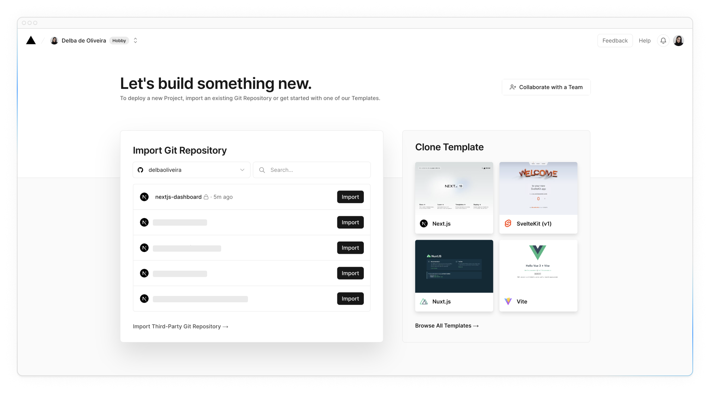
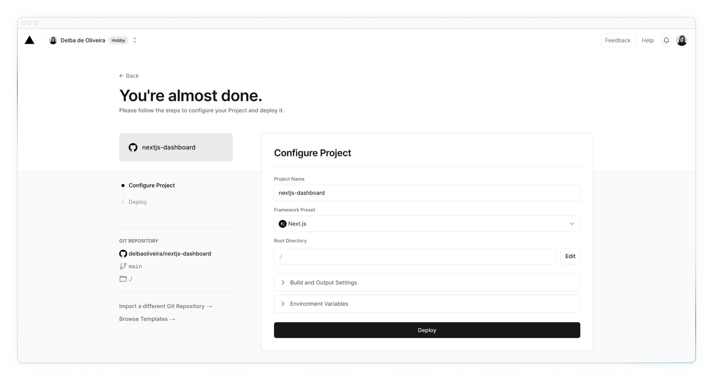
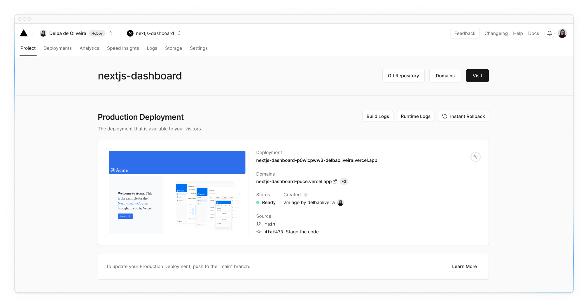
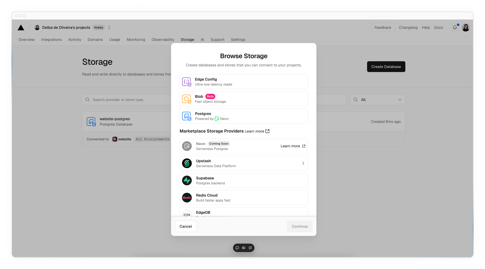
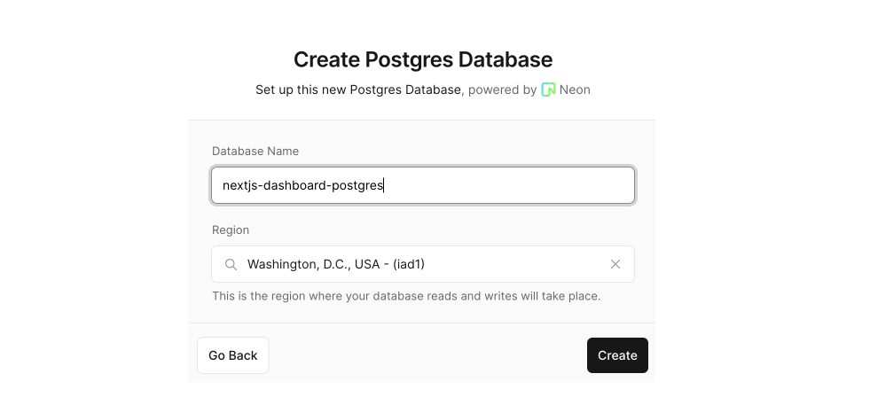
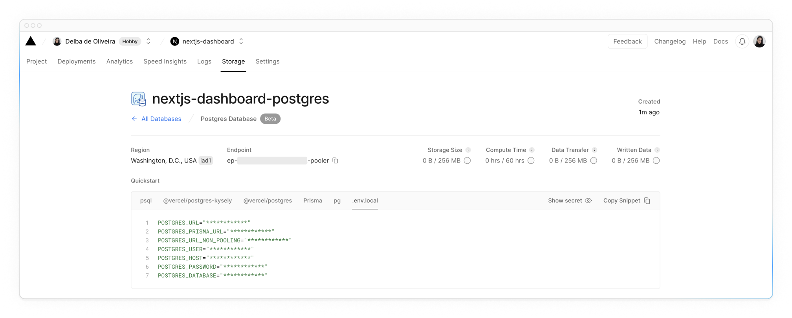

# Настройка базы данных

<big>Прежде чем продолжить работу над дашбордом, вам понадобятся некоторые данные. В этой главе вы будете настраивать базу данных PostgreSQL из одного из [Vercel's marketplace integrations](https://vercel.com/marketplace?category=databases). Если вы уже знакомы с PostgreSQL и предпочитаете использовать собственный поставщик баз данных, вы можете пропустить эту главу и настроить ее самостоятельно. В противном случае, давайте продолжим!</big>

!!!tip "Вот темы, которые мы рассмотрим"

    -   Разместите свой проект на GitHub.
    -   Создайте учетную запись Vercel и свяжите с ней репозиторий GitHub для мгновенного предварительного просмотра и развертывания.
    -   Создайте и свяжите свой проект с базой данных Postgres.
    -   Наполните базу данных исходными данными.

## Создайте репозиторий GitHub.

Для начала давайте разместим ваш репозиторий на GitHub, если вы этого еще не сделали. Это облегчит настройку базы данных и развертывание.

Если вам нужна помощь в настройке репозитория, посмотрите [это руководство на GitHub](https://help.github.com/en/github/getting-started-with-github/create-a-repo).

!!!info "Полезно знать:"

    -   Вы также можете использовать другие git-провайдеры, например GitLab или Bitbucket.
    -   Если вы новичок в GitHub, мы рекомендуем [GitHub Desktop App](https://desktop.github.com/) для упрощения рабочего процесса разработки.

## Создайте учетную запись Vercel

Посетите сайт [vercel.com/signup](https://vercel.com/signup), чтобы создать учетную запись. Выберите бесплатный тарифный план «Хобби». Выберите **Continue with GitHub**, чтобы соединить ваши аккаунты GitHub и Vercel.

## Подключение и развертывание проекта

Далее вы попадете на этот экран, где сможете выбрать и **импортировать** репозиторий GitHub, который вы только что создали:



Назовите свой проект и нажмите **Deploy**.



Ура! 🎉 Теперь ваш проект развернут.



Подключив ваш репозиторий GitHub, при внесении изменений в вашу **главную** ветку Vercel будет автоматически развертывать ваше приложение без необходимости настройки. При открытии запросов на исправления у вас также будут [URL мгновенного предварительного просмотра](https://vercel.com/docs/deployments/environments#preview-environment-pre-production#preview-urls), которые позволят вам выявлять ошибки развертывания на ранней стадии и делиться предварительным просмотром проекта с членами команды для получения обратной связи.

## Создание базы данных Postgres

Чтобы создать базу данных, нажмите **Continue to Dashboard** и выберите вкладку **Storage** на дашборде вашего проекта. Выберите **Создать базу данных**. В зависимости от того, когда была создана ваша учетная запись Vercel, вы можете увидеть такие варианты, как Neon или Supabase. Выберите предпочтительного поставщика и нажмите **Продолжить**.



Выберите регион и план хранения, если требуется. Регионом [по умолчанию](https://vercel.com/docs/functions/configuring-functions/region) для всех проектов Vercel является **Washington D.C (iad1)**, и мы рекомендуем выбрать его, если это возможно, чтобы уменьшить [задержку](https://developer.mozilla.org/en-US/docs/Web/Performance/Understanding_latency) для запросов данных.



После подключения перейдите на вкладку `.env.local`, нажмите **Show secret** и **Copy Snippet**. Убедитесь, что вы раскрыли секреты перед копированием.



Перейдите в редактор кода и переименуйте файл `.env.example` в `.env`. Вставьте в него скопированное содержимое из Vercel.

!!!important "Важно:"

    Зайдите в файл `.gitignore` и убедитесь, что `.env` находится в игнорируемых файлах, чтобы предотвратить раскрытие секретов вашей базы данных при отправке на GitHub.

## Посеять базу данных

Теперь, когда ваша база данных создана, давайте загрузим в нее некоторые начальные данные.

Мы включили API, к которому можно обратиться через браузер и который запустит скрипт посева, чтобы заполнить базу данных начальным набором данных.

Скрипт использует **SQL** для создания таблиц и данные из файла `placeholder-data.ts` для их заполнения после создания.

Убедитесь, что ваш локальный сервер разработки запущен с помощью `pnpm run dev` и перейдите по адресу <localhost:3000/seed> в браузере. После завершения вы увидите в браузере сообщение «Database seeded successfully». После завершения вы можете удалить этот файл.

<?quiz?>

question: Что такое «seeding» в контексте баз данных?
answer: Удаление всех данных в базе данных
answer: Импорт схемы базы данных
answer-correct: Наполнение базы данных начальным набором данных
answer: Создание отношений между таблицами в базе данных
content:

<p>Именно так! Seeding полезен, когда вы хотите иметь некоторые данные для работы с приложением.</p>
<?/quiz?>

!!!warning "Устранение неполадок:"

    -   Перед копированием в файл `.env` обязательно раскройте секреты вашей базы данных.
    -   Скрипт использует `bcrypt` для хэширования пароля пользователя, если `bcrypt` не совместим с вашим окружением, вы можете обновить скрипт, чтобы использовать [`bcryptjs`](https://www.npmjs.com/package/bcryptjs) вместо него.
    -   Если вы столкнулись с какими-либо проблемами при загрузке базы данных и хотите запустить скрипт снова, вы можете удалить все существующие таблицы, выполнив `DROP TABLE tablename` в интерфейсе запросов к базе данных. Более подробную информацию см. в разделе [Выполнение запросов](https://nextjs.org/learn/dashboard-app/setting-up-your-database#executing-queries) ниже. Но будьте осторожны, эта команда удалит таблицы и все их данные. Это можно сделать в вашем примере, так как вы работаете с временными данными, но вы не должны выполнять эту команду в производственном приложении.

## Выполнение запросов

Давайте выполним запрос, чтобы убедиться, что все работает так, как ожидалось. Для запроса к базе данных мы будем использовать другой обработчик Router Handler, `app/query/route.ts`. Внутри этого файла вы найдете функцию `listInvoices()`, которая содержит следующий SQL-запрос.

```sql
SELECT invoices.amount, customers.name
FROM invoices
JOIN customers ON invoices.customer_id = customers.id
WHERE invoices.amount = 666;
```

Откомментируйте файл, удалите блок `Response.json()` и перейдите по адресу <localhost:3000/query> в браузере. Вы должны увидеть, что возвращается счет `amount` и `name`.

<?quiz?>

question: Какому клиенту принадлежит этот счет?
answer: Lee Robinson
answer-correct: Evil Rabbit
answer: Delba de Oliveira
answer: Michael Novotny
content:

<p>Именно так!</p>
<?/quiz?>

<small>:material-information-outline: Источник &mdash; <https://nextjs.org/learn/dashboard-app/setting-up-your-database></small>
