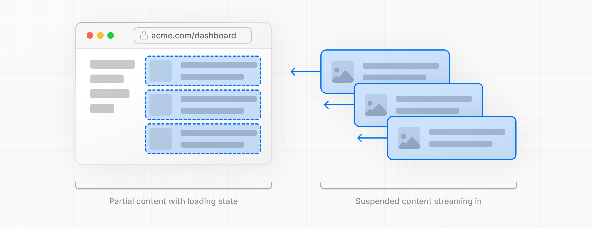
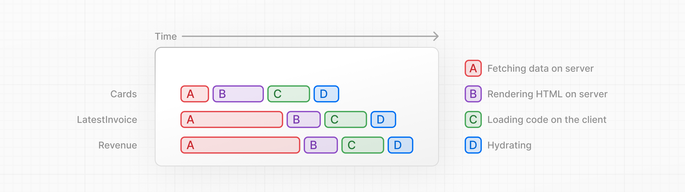
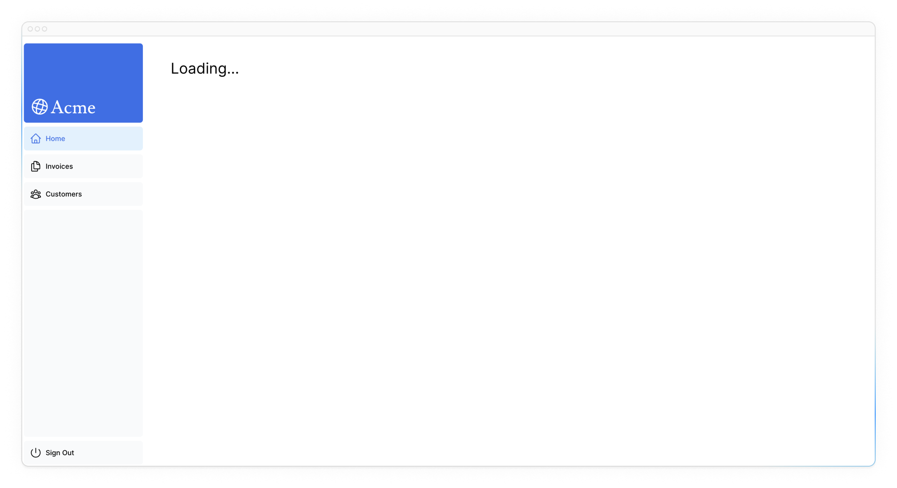
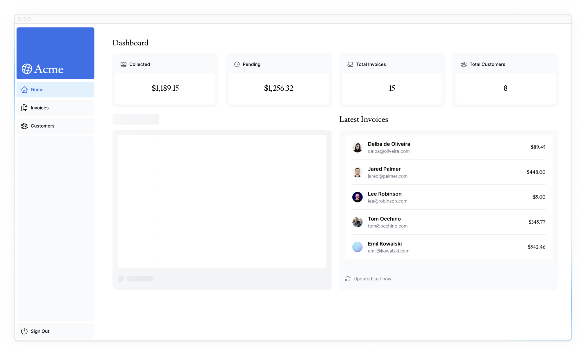

# Потоковая передача

<big>В предыдущей главе вы узнали о различных методах рендеринга в Next.js. Мы также обсудили, как медленное получение данных может повлиять на производительность вашего приложения. Давайте рассмотрим, как можно улучшить пользовательский опыт при медленных запросах данных.</big>

!!!tip "Вот темы, которые мы рассмотрим"

    -   Что такое потоковая передача и когда его можно использовать.
    -   Как реализовать потоковую передачу с помощью `loading.tsx` и `Suspense`.
    -   Что такое загрузочные скелетоны.
    -   Что такое Next.js Route Groups и когда их можно использовать.
    -   Где разместить границы React `Suspense` в вашем приложении.

## Что такое потоковая передача?

Потоковая передача - это техника передачи данных, которая позволяет разбить маршрут на более мелкие «куски» и постепенно передавать их с сервера на клиент по мере готовности.



Потоковая передача позволяет предотвратить блокировку всей страницы медленными запросами данных. Это позволяет пользователю видеть части страницы и взаимодействовать с ними, не дожидаясь загрузки всех данных, прежде чем пользователю будет показан любой пользовательский интерфейс.



Потоковая передача хорошо работает с компонентной моделью React, так как каждый компонент можно рассматривать как _чанк_.

Существует два способа реализации потоковой передачи данных в Next.js:

1.  На уровне страницы, с помощью файла `loading.tsx` (который создает для вас `<Suspense>`).
2.  На уровне компонентов, с помощью `<Suspense>` для более детального контроля.

Давайте посмотрим, как это работает.

<?quiz?>

question: В чем одно из преимуществ потоковой передачи?
answer: Запросы данных становятся более безопасными благодаря шифрованию чанков
answer: Все чанки обрабатываются только после того, как они получены в полном объеме
answer-correct: Чанки отображаются параллельно, что сокращает общее время загрузки.
content:

<p>Преимущество такого подхода заключается в том, что вы можете значительно сократить общее время загрузки страницы.</p>
<?/quiz?>

## Потоковая передача всей страницы с помощью `loading.tsx`.

В папке `/app/dashboard` создайте новый файл с именем `loading.tsx`:

```ts title="/app/dashboard/loading.tsx"
export default function Loading() {
    return <div>Loading...</div>;
}
```

Обновите <http://localhost:3000/dashboard>, и теперь вы должны увидеть:



Здесь происходит несколько вещей:

1.  `loading.tsx` - это специальный файл Next.js, построенный поверх React Suspense. Он позволяет создавать резервный пользовательский интерфейс, который будет отображаться в качестве замены во время загрузки содержимого страницы.
2.  Поскольку `<SideNav>` статичен, он показывается сразу. Пользователь может взаимодействовать с `<SideNav>`, пока загружается динамический контент.
3.  Пользователю не нужно ждать окончания загрузки страницы, чтобы перейти на другую (это называется прерывистой навигацией).

Поздравляем! Вы только что реализовали потоковую передачу. Но мы можем сделать еще больше для улучшения пользовательского опыта. Давайте покажем скелетон загрузки вместо текста `Loading...`.

### Добавление скелетонов загрузки

Загрузочный скелетон - это упрощенная версия пользовательского интерфейса. Многие веб-сайты используют их в качестве заполнителя (или запасного варианта), чтобы указать пользователям, что содержимое загружается. Любой пользовательский интерфейс, который вы добавите в `loading.tsx`, будет встроен как часть статического файла и отправлен первым. Затем остальной динамический контент будет передан с сервера на клиент.

Внутри файла `loading.tsx` импортируйте новый компонент под названием `<DashboardSkeleton>`:

```ts title="/app/dashboard/loading.tsx" hl_lines="1 4"
import DashboardSkeleton from '@/app/ui/skeletons';

export default function Loading() {
    return <DashboardSkeleton />;
}
```

Затем обновите <http://localhost:3000/dashboard>, и теперь вы должны увидеть:


### Исправление ошибки скелета загрузки с группами маршрутов

Сейчас ваш загрузочный скелет будет применяться к счетам.

Поскольку `loading.tsx` находится на уровень выше, чем `/invoices/page.tsx` и `/customers/page.tsx` в файловой системе, он также применяется к этим страницам.

Мы можем изменить это с помощью [Route Groups](https://nextjs.org/docs/app/building-your-application/routing/route-groups). Создайте новую папку `/(overview)` внутри папки дашборда. Затем переместите файлы `loading.tsx` и `page.tsx` в эту папку:


Теперь файл `loading.tsx` будет применяться только к странице обзора дашборда.

Группы маршрутов позволяют организовывать файлы в логические группы, не затрагивая структуру URL-путей. Когда вы создаете новую папку, используя круглые скобки `()`, ее название не будет включено в путь URL. Таким образом, `/dashboard/(overview)/page.tsx` превращается в `/dashboard`.

Здесь вы используете группу маршрутов для того, чтобы `loading.tsx` применялся только к странице обзора дашборда. Однако вы также можете использовать группы маршрутов для разделения приложения на секции (например, маршруты `(маркетинг)` и маршруты `(магазин)`) или на команды для больших приложений.

### Потоковая передача компонента

До сих пор вы передавали всю страницу. Но вы также можете быть более детализированными и передавать определенные компоненты с помощью React Suspense.

Suspense позволяет откладывать отрисовку частей приложения до тех пор, пока не будет выполнено какое-то условие (например, загружены данные). Вы можете обернуть свои динамические компоненты в Suspense. Затем передайте ему резервный компонент, который будет отображаться, пока динамический компонент загружается.

Если вы помните медленный запрос данных, `fetchRevenue()`, то именно этот запрос замедляет работу всей страницы. Вместо того чтобы блокировать всю страницу, вы можете использовать Suspense для потоковой передачи только этого компонента и немедленного показа остальной части пользовательского интерфейса страницы.

Для этого вам нужно будет переместить выборку данных в компонент, давайте обновим код, чтобы увидеть, как это будет выглядеть:

Удалите все экземпляры `fetchRevenue()` и его данные из `/dashboard/(overview)/page.tsx`:

```ts title="/app/dashboard/(overview)/page.tsx" hl_lines="5-8 11"
import { Card } from '@/app/ui/dashboard/cards';
import RevenueChart from '@/app/ui/dashboard/revenue-chart';
import LatestInvoices from '@/app/ui/dashboard/latest-invoices';
import { lusitana } from '@/app/ui/fonts';
import {
    fetchLatestInvoices,
    fetchCardData,
} from '@/app/lib/data'; // remove fetchRevenue

export default async function Page() {
    const revenue = await fetchRevenue(); // delete this line
    const latestInvoices = await fetchLatestInvoices();
    const {
        numberOfInvoices,
        numberOfCustomers,
        totalPaidInvoices,
        totalPendingInvoices,
    } = await fetchCardData();

    return (
		/* ... */
	);
}
```

Затем импортируйте `<Suspense>` из React и оберните его вокруг `<RevenueChart />`. Вы можете передать ему компонент возврата под названием `<RevenueChartSkeleton>`.

```ts title="/app/dashboard/(overview)/page.tsx" hl_lines="9-10 51-55"
import { Card } from '@/app/ui/dashboard/cards';
import RevenueChart from '@/app/ui/dashboard/revenue-chart';
import LatestInvoices from '@/app/ui/dashboard/latest-invoices';
import { lusitana } from '@/app/ui/fonts';
import {
    fetchLatestInvoices,
    fetchCardData,
} from '@/app/lib/data';
import { Suspense } from 'react';
import { RevenueChartSkeleton } from '@/app/ui/skeletons';

export default async function Page() {
    const latestInvoices = await fetchLatestInvoices();
    const {
        numberOfInvoices,
        numberOfCustomers,
        totalPaidInvoices,
        totalPendingInvoices,
    } = await fetchCardData();

    return (
        <main>
            <h1
                className={`${lusitana.className} mb-4 text-xl md:text-2xl`}
            >
                Dashboard
            </h1>
            <div className="grid gap-6 sm:grid-cols-2 lg:grid-cols-4">
                <Card
                    title="Collected"
                    value={totalPaidInvoices}
                    type="collected"
                />
                <Card
                    title="Pending"
                    value={totalPendingInvoices}
                    type="pending"
                />
                <Card
                    title="Total Invoices"
                    value={numberOfInvoices}
                    type="invoices"
                />
                <Card
                    title="Total Customers"
                    value={numberOfCustomers}
                    type="customers"
                />
            </div>
            <div className="mt-6 grid grid-cols-1 gap-6 md:grid-cols-4 lg:grid-cols-8">
                <Suspense
                    fallback={<RevenueChartSkeleton />}
                >
                    <RevenueChart />
                </Suspense>
                <LatestInvoices
                    latestInvoices={latestInvoices}
                />
            </div>
        </main>
    );
}
```

Наконец, обновите компонент `<RevenueChart>`, чтобы получить свои собственные данные и удалить переданный ему параметр:

```ts title="/app/ui/dashboard/revenue-chart.tsx" hl_lines="4 8-10"
import { generateYAxis } from '@/app/lib/utils';
import { CalendarIcon } from '@heroicons/react/24/outline';
import { lusitana } from '@/app/ui/fonts';
import { fetchRevenue } from '@/app/lib/data';

// ...

export default async function RevenueChart() {
    // Make component async, remove the props
    const revenue = await fetchRevenue(); // Fetch data inside the component

    const chartHeight = 350;
    const { yAxisLabels, topLabel } = generateYAxis(
        revenue
    );

    if (!revenue || revenue.length === 0) {
        return (
            <p className="mt-4 text-gray-400">
                No data available.
            </p>
        );
    }

    return (
		// ...
	);
}
```

Теперь обновите страницу, вы должны увидеть информацию дашборда почти сразу, в то время как для `<RevenueChart>` будет показан скелет резервного копирования:



### Практика: Потоковая передача `<LatestInvoices>`.

Теперь ваша очередь! Отработайте то, чему вы только что научились, выполнив потоковую передачу компонента `<LatestInvoices>`.

Переместите `fetchLatestInvoices()` вниз со страницы на компонент `<LatestInvoices>`. Заверните компонент в границу `<Suspense>` с фаллабетом `<LatestInvoicesSkeleton>`.

Когда все будет готово, разверните тумблер, чтобы увидеть код решения:

???info "Reveal the solution"

    Dashboard Page:

    ```ts title="/app/dashboard/(overview)/page.tsx" hl_lines="5 9 56-60"
    import { Card } from '@/app/ui/dashboard/cards';
    import RevenueChart from '@/app/ui/dashboard/revenue-chart';
    import LatestInvoices from '@/app/ui/dashboard/latest-invoices';
    import { lusitana } from '@/app/ui/fonts';
    import { fetchCardData } from '@/app/lib/data'; // Remove fetchLatestInvoices
    import { Suspense } from 'react';
    import {
    	RevenueChartSkeleton,
    	LatestInvoicesSkeleton,
    } from '@/app/ui/skeletons';

    export default async function Page() {
    	// Remove `const latestInvoices = await fetchLatestInvoices()`
    	const {
    		numberOfInvoices,
    		numberOfCustomers,
    		totalPaidInvoices,
    		totalPendingInvoices,
    	} = await fetchCardData();

    	return (
    		<main>
    			<h1
    				className={`${lusitana.className} mb-4 text-xl md:text-2xl`}
    			>
    				Dashboard
    			</h1>
    			<div className="grid gap-6 sm:grid-cols-2 lg:grid-cols-4">
    				<Card
    					title="Collected"
    					value={totalPaidInvoices}
    					type="collected"
    				/>
    				<Card
    					title="Pending"
    					value={totalPendingInvoices}
    					type="pending"
    				/>
    				<Card
    					title="Total Invoices"
    					value={numberOfInvoices}
    					type="invoices"
    				/>
    				<Card
    					title="Total Customers"
    					value={numberOfCustomers}
    					type="customers"
    				/>
    			</div>
    			<div className="mt-6 grid grid-cols-1 gap-6 md:grid-cols-4 lg:grid-cols-8">
    				<Suspense
    					fallback={<RevenueChartSkeleton />}
    				>
    					<RevenueChart />
    				</Suspense>
    				<Suspense
    					fallback={<LatestInvoicesSkeleton />}
    				>
    					<LatestInvoices />
    				</Suspense>
    			</div>
    		</main>
    	);
    }
    ```

    `<LatestInvoices>` component. Remember to remove the props from the component:

    ```ts title="/app/ui/dashboard/latest-invoices.tsx" hl_lines="5 7-9"
    import { ArrowPathIcon } from '@heroicons/react/24/outline';
    import clsx from 'clsx';
    import Image from 'next/image';
    import { lusitana } from '@/app/ui/fonts';
    import { fetchLatestInvoices } from '@/app/lib/data';

    export default async function LatestInvoices() {
    	// Remove props
    	const latestInvoices = await fetchLatestInvoices();

    	return (
    		// ...
    	);
    }
    ```

## Группировка компонентов

Отлично! Вы почти у цели, теперь вам нужно обернуть компоненты `<Card>` в Suspense. Вы можете получить данные для каждой отдельной карты, но это может привести к эффекту «выпрыгивания» при загрузке карт, что может визуально раздражать пользователя.

Как же решить эту проблему?

Чтобы создать эффект «ступенчатости», вы можете сгруппировать карточки с помощью компонента-обертки. Это означает, что сначала будет показан статический `<SideNav/>`, затем карточки и т. д.

В файле `page.tsx`:

1.  Удалите компоненты `<Card>`.
2.  Удалите функцию `fetchCardData()`.
3.  Импортируйте новый компонент **обертки** под названием `<CardWrapper />`.
4.  Импортируйте новый **скелетон** компонента под названием `<CardsSkeleton />`.
5.  Оберните `<CardWrapper />` в Suspense.

```ts title="/app/dashboard/(overview)/page.tsx" hl_lines="1 6 18-20"
import CardWrapper from '@/app/ui/dashboard/cards';
// ...
import {
    RevenueChartSkeleton,
    LatestInvoicesSkeleton,
    CardsSkeleton,
} from '@/app/ui/skeletons';

export default async function Page() {
    return (
        <main>
            <h1
                className={`${lusitana.className} mb-4 text-xl md:text-2xl`}
            >
                Dashboard
            </h1>
            <div className="grid gap-6 sm:grid-cols-2 lg:grid-cols-4">
                <Suspense fallback={<CardsSkeleton />}>
                    <CardWrapper />
                </Suspense>
            </div>
            // ...
        </main>
    );
}
```

Затем перейдите в файл `/app/ui/dashboard/cards.tsx`, импортируйте функцию `fetchCardData()` и вызовите ее внутри компонента `<CardWrapper/>`. Не забудьте откомментировать весь необходимый код в этом компоненте.

```ts title="/app/ui/dashboard/cards.tsx" hl_lines="2 7-12"
// ...
import { fetchCardData } from '@/app/lib/data';

// ...

export default async function CardWrapper() {
    const {
        numberOfInvoices,
        numberOfCustomers,
        totalPaidInvoices,
        totalPendingInvoices,
    } = await fetchCardData();

    return (
        <>
            <Card
                title="Collected"
                value={totalPaidInvoices}
                type="collected"
            />
            <Card
                title="Pending"
                value={totalPendingInvoices}
                type="pending"
            />
            <Card
                title="Total Invoices"
                value={numberOfInvoices}
                type="invoices"
            />
            <Card
                title="Total Customers"
                value={numberOfCustomers}
                type="customers"
            />
        </>
    );
}
```

Обновите страницу, и вы увидите, что все карты загружаются одновременно. Вы можете использовать этот шаблон, когда хотите, чтобы несколько компонентов загружались одновременно.

## Решение о том, где расположить границы приостановки

Место расположения границ Suspense зависит от нескольких факторов:

1.  Как вы хотите, чтобы пользователь воспринимал страницу во время ее загрузки.
2.  Какому контенту вы хотите отдать предпочтение.
3.  Если компоненты зависят от получения данных.

Посмотрите на свою страницу дашборда, есть ли что-то, что вы сделали бы по-другому?

Не волнуйтесь. Здесь нет правильного ответа.

-   Вы могли бы транслировать **всю страницу**, как мы сделали с `loading.tsx`... но это может привести к увеличению времени загрузки, если один из компонентов медленно получает данные.
-   Можно транслировать **каждый компонент** по отдельности... но это может привести к тому, что пользовательский интерфейс будет «выскакивать» на экран по мере готовности.
-   Можно также создать эффект _стаггирования_, передавая потоком **разделы страницы**. Но вам придется создавать компоненты-обертки.

Место, где вы разместите границы Suspense, зависит от вашего приложения. В целом, хорошей практикой является перемещение поиска данных вниз к компонентам, которым они нужны, а затем обертывание этих компонентов в Suspense. Но нет ничего плохого в потоковой передаче секций или всей страницы, если это необходимо вашему приложению.

Не бойтесь экспериментировать с Suspense и смотреть, что работает лучше, это мощный API, который поможет вам создать более восхитительный пользовательский опыт.

<?quiz?>

question: В целом, что считается хорошей практикой при работе с Suspense и получением данных?
answer: Перемещайте получаемые данные в родительский компонент
answer: Избегайте использования Suspense для получения данных
answer-correct: Переместите запросы на получение данных в компоненты, которым они нужны
answer: Используйте Suspense только для устранения ошибок
content:

<p>Перенося получение данных в компоненты, которым они необходимы, вы можете создавать более четкие границы Suspense. Это позволит вам передавать данные конкретным компонентам и предотвращать блокировку пользовательского интерфейса.</p>
<?/quiz?>

## Заглядывая в будущее

Потоковая передача и серверные компоненты дают нам новые способы обработки состояний получения и загрузки данных, в конечном итоге направленные на улучшение качества работы конечного пользователя.

В следующей главе вы узнаете о Partial Prerendering, новой модели рендеринга Next.js, созданной с учетом потоковой обработки.

<small>:material-information-outline: Источник &mdash; <https://nextjs.org/learn/dashboard-app/streaming></small>
