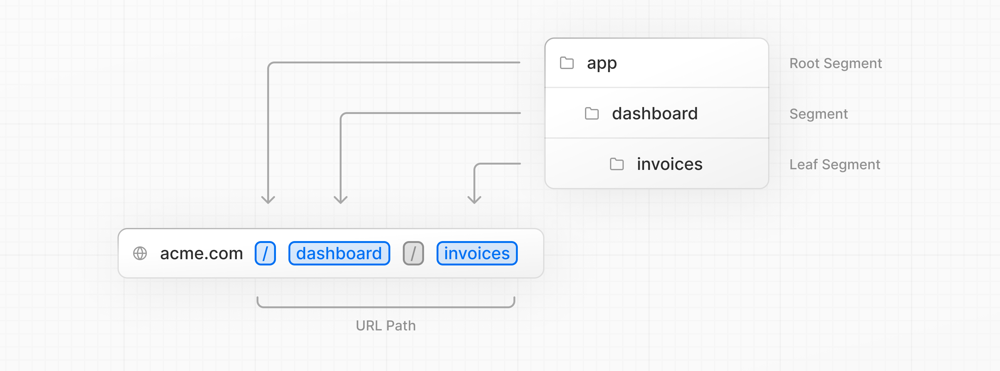
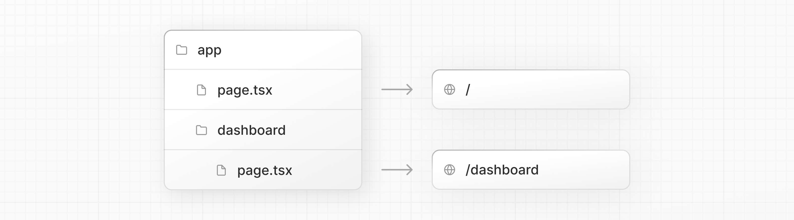
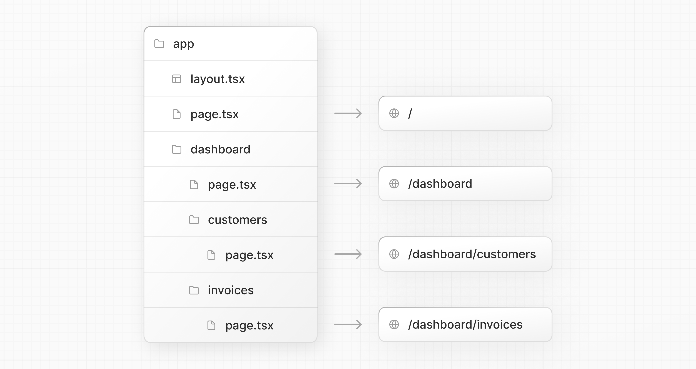
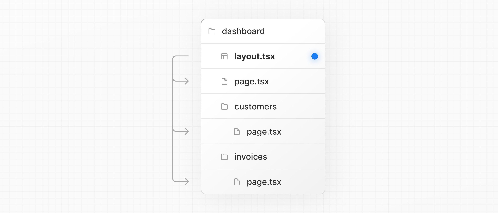
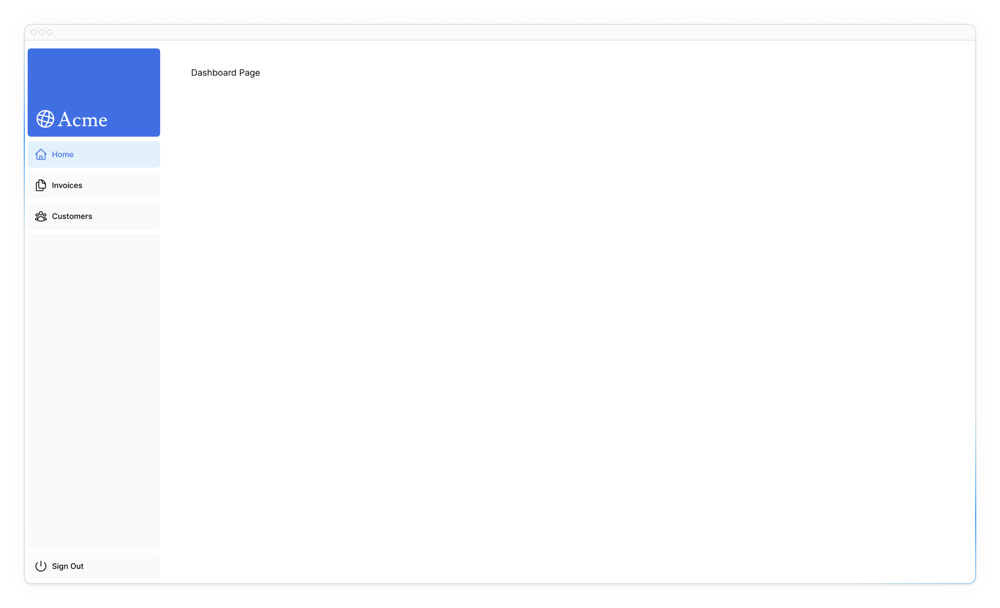
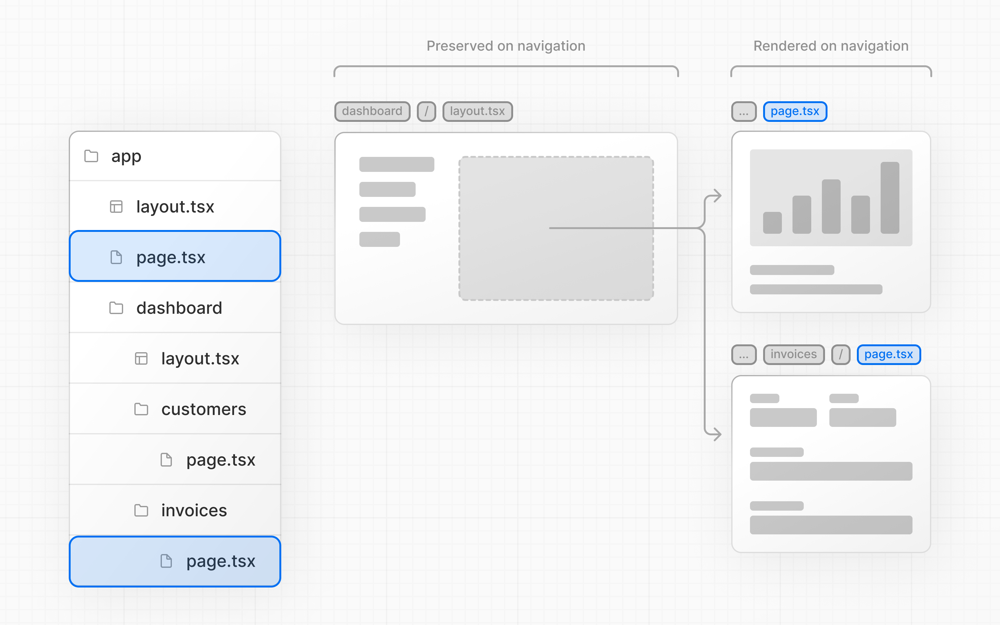

# Creating Layouts and Pages

So far, your application only has a home page. Let's learn how you can create more routes with layouts and pages.

!!!tip "Here are the topics we’ll cover"

    -   Create the dashboard routes using file-system routing.
    -   Understand the role of folders and files when creating new route segments.
    -   Create a nested layout that can be shared between multiple dashboard pages.
    -   Understand what colocation, partial rendering, and the root layout are.

## Nested routing

Next.js uses file-system routing where folders are used to create nested routes. Each folder represents a route segment that maps to a URL segment.



You can create separate UIs for each route using `layout.tsx` and `page.tsx` files.

`page.tsx` is a special Next.js file that exports a React component, and it's required for the route to be accessible. In your application, you already have a page file: `/app/page.tsx` - this is the home page associated with the route `/`.

To create a nested route, you can nest folders inside each other and add `page.tsx` files inside them. For example:



`/app/dashboard/page.tsx` is associated with the `/dashboard` path. Let's create the page to see how it works!

## Creating the dashboard page

Create a new folder called `dashboard` inside `/app`. Then, create a new `page.tsx` file inside the `dashboard` folder with the following content:

```ts title="/app/dashboard/page.tsx"
export default function Page() {
    return <p>Dashboard Page</p>;
}
```

Now, make sure that the development server is running and visit <http://localhost:3000/dashboard>. You should see the "Dashboard Page" text.

This is how you can create different pages in Next.js: create a new route segment using a folder, and add a `page` file inside it.

By having a special name for `page` files, Next.js allows you to [colocate](https://nextjs.org/docs/app/building-your-application/routing#colocation) UI components, test files, and other related code with your routes. Only the content inside the `page` file will be publicly accessible. For example, the `/ui` and `/lib` folders are _colocated_ inside the `/app` folder along with your routes.

## Practice: Creating the dashboard pages

Let's practice creating more routes. In your dashboard, create two more pages:

1.  Customers Page: The page should be accessible on <http://localhost:3000/dashboard/customers>. For now, it should return a `<p>Customers Page</p>` element.
2.  Invoices Page: The invoices page should be accessible on <http://localhost:3000/dashboard/invoices>. For now, also return a `<p>Invoices Page</p>` element.

Spend some time tackling this exercise, and when you're ready, expand the toggle below for the solution:

???info "Reveal the solution"

    You should have the following folder structure:

    

    Customers Page:

    ```ts title="/app/dashboard/customers/page.tsx"
    export default function Page() {
    	return <p>Customers Page</p>;
    }
    ```

    Invoices Page:

    ```ts title="/app/dashboard/invoices/page.tsx"
    export default function Page() {
    	return <p>Invoices Page</p>;
    }
    ```

## Creating the dashboard layout

Dashboards have some sort of navigation that is shared across multiple pages. In Next.js, you can use a special `layout.tsx` file to create UI that is shared between multiple pages. Let's create a layout for the dashboard pages!

Inside the `/dashboard` folder, add a new file called `layout.tsx` and paste the following code:

```ts title="/app/dashboard/layout.tsx"
import SideNav from '@/app/ui/dashboard/sidenav';

export default function Layout({
    children,
}: {
    children: React.ReactNode;
}) {
    return (
        <div className="flex h-screen flex-col md:flex-row md:overflow-hidden">
            <div className="w-full flex-none md:w-64">
                <SideNav />
            </div>
            <div className="flex-grow p-6 md:overflow-y-auto md:p-12">
                {children}
            </div>
        </div>
    );
}
```

A few things are going on in this code, so let's break it down:

First, you're importing the `<SideNav />` component into your layout. Any components you import into this file will be part of the layout.

The `<Layout />` component receives a `children` prop. This child can either be a page or another layout. In your case, the pages inside `/dashboard` will automatically be nested inside a `<Layout />` like so:



Check that everything is working correctly by saving your changes and checking your localhost. You should see the following:



One benefit of using layouts in Next.js is that on navigation, only the page components update while the layout won't re-render. This is called [partial rendering](https://nextjs.org/docs/app/building-your-application/routing/linking-and-navigating#4-partial-rendering) which preserves client-side React state in the layout when transitioning between pages.



## Root layout

In Chapter 3, you imported the `Inter` font into another layout: `/app/layout.tsx`. As a reminder:

```ts title="/app/layout.tsx"
import '@/app/ui/global.css';
import { inter } from '@/app/ui/fonts';

export default function RootLayout({
    children,
}: {
    children: React.ReactNode;
}) {
    return (
        <html lang="en">
            <body
                className={`${inter.className} antialiased`}
            >
                {children}
            </body>
        </html>
    );
}
```

This is called a [root layout](https://nextjs.org/docs/app/api-reference/file-conventions/layout#root-layouts) and is required in every Next.js application. Any UI you add to the root layout will be shared across **all** pages in your application. You can use the root layout to modify your `<html>` and `<body>` tags, and add metadata (you'll learn more about metadata in [a later chapter](adding-metadata.md)).

Since the new layout you've just created (`/app/dashboard/layout.tsx`) is unique to the dashboard pages, you don't need to add any UI to the root layout above.

<?quiz?>

question: What is the purpose of the layout file in Next.js?
answer: To act as a global error handler
answer: To fetch data and manage state across the entire application
answer-correct: To share UI across multiple pages
answer: To act as the entry point for the entire application
content:

<p>That's right, the layout file is the best way to create a shared layout that all pages in your application can use.</p>
<?/quiz?>

<small>:material-information-outline: Источник &mdash; <https://nextjs.org/learn/dashboard-app/creating-layouts-and-pages></small>
