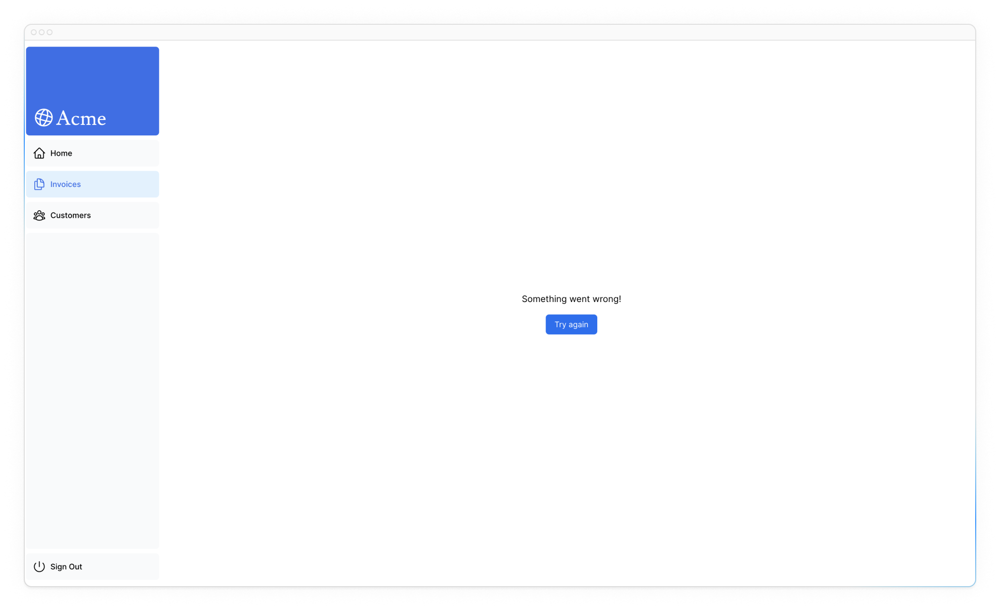

# Handling Errors

In the previous chapter, you learned how to mutate data using Server Actions. Let's see how you can handle errors _gracefully_ using JavaScript's `try/catch` statements and Next.js APIs for uncaught exceptions.

!!!tip "Here are the topics we’ll cover"

    -   How to use the special `error.tsx` file to catch errors in your route segments, and show a fallback UI to the user.
    -   How to use the `notFound` function and `not-found` file to handle 404 errors (for resources that don’t exist).

## Adding `try/catch` to Server Actions

First, let's add JavaScript's `try/catch` statements to your Server Actions to allow you to handle errors gracefully.

If you know how to do this, spend a few minutes updating your Server Actions, or you can copy the code below:

???note "Reveal the solution"

    ```ts title="/app/lib/actions.ts"
    export async function createInvoice(formData: FormData) {
    	const {
    		customerId,
    		amount,
    		status,
    	} = CreateInvoice.parse({
    		customerId: formData.get('customerId'),
    		amount: formData.get('amount'),
    		status: formData.get('status'),
    	});

    	const amountInCents = amount * 100;
    	const date = new Date().toISOString().split('T')[0];

    	try {
    		await sql`
    	INSERT INTO invoices (customer_id, amount, status, date)
    	VALUES (${customerId}, ${amountInCents}, ${status}, ${date})
    	`;
    	} catch (error) {
    		// We'll log the error to the console for now
    		console.error(error);
    	}

    	revalidatePath('/dashboard/invoices');
    	redirect('/dashboard/invoices');
    }
    ```

???note "Reveal the solution"

    ```ts title="/app/lib/actions.ts"
    export async function updateInvoice(
    	id: string,
    	formData: FormData
    ) {
    	const {
    		customerId,
    		amount,
    		status,
    	} = UpdateInvoice.parse({
    		customerId: formData.get('customerId'),
    		amount: formData.get('amount'),
    		status: formData.get('status'),
    	});

    	const amountInCents = amount * 100;

    	try {
    		await sql`
    		UPDATE invoices
    		SET customer_id = ${customerId}, amount = ${amountInCents}, status = ${status}
    		WHERE id = ${id}
    	`;
    	} catch (error) {
    		// We'll log the error to the console for now
    		console.error(error);
    	}

    	revalidatePath('/dashboard/invoices');
    	redirect('/dashboard/invoices');
    }
    ```

Note how `redirect` is being called outside of the `try/catch` block. This is because `redirect` works by throwing an error, which would be caught by the `catch` block. To avoid this, you can call `redirect` **after** `try/catch`. `redirect` would only be reachable if `try` is successful.

We're gracefully handling these errors by catching the database issue, and returning a helpful message from our Server Action.

What happens if there is an uncaught exception in your action? We can simulate this by manually throwing an error. For example, in the `deleteInvoice` action, throw an error at the top of the function:

```ts title="/app/lib/actions.ts" hl_lines="2"
export async function deleteInvoice(id: string) {
    throw new Error('Failed to Delete Invoice');

    // Unreachable code block
    await sql`DELETE FROM invoices WHERE id = ${id}`;
    revalidatePath('/dashboard/invoices');
}
```

When you try to delete an invoice, you should see the error on localhost. When going to production, you want to more gracefully show a message to the user when something unexpected happens.

This is where Next.js [`error.tsx`](https://nextjs.org/docs/app/api-reference/file-conventions/error) file comes in. Ensure that you remove this manually added error after testing and before moving onto the next section.

## Handling all errors with `error.tsx`

The `error.tsx` file can be used to define a UI boundary for a route segment. It serves as a **catch-all** for unexpected errors and allows you to display a fallback UI to your users.

Inside your `/dashboard/invoices` folder, create a new file called `error.tsx` and paste the following code:

```ts title="/dashboard/invoices/error.tsx"
'use client';

import { useEffect } from 'react';

export default function Error({
    error,
    reset,
}: {
    error: Error & { digest?: string };
    reset: () => void;
}) {
    useEffect(() => {
        // Optionally log the error to an error reporting service
        console.error(error);
    }, [error]);

    return (
        <main className="flex h-full flex-col items-center justify-center">
            <h2 className="text-center">
                Something went wrong!
            </h2>
            <button
                className="mt-4 rounded-md bg-blue-500 px-4 py-2 text-sm text-white transition-colors hover:bg-blue-400"
                onClick={
                    // Attempt to recover by trying to re-render the invoices route
                    () => reset()
                }
            >
                Try again
            </button>
        </main>
    );
}
```

There are a few things you'll notice about the code above:

-   **"use client"** - `error.tsx` needs to be a Client Component.
-   It accepts two props:
    -   `error`: This object is an instance of JavaScript's native [`Error`](https://developer.mozilla.org/en-US/docs/Web/JavaScript/Reference/Global_Objects/Error) object.
    -   `reset`: This is a function to reset the error boundary. When executed, the function will try to re-render the route segment.

When you try to delete an invoice again, you should see the following UI:



## Handling 404 errors with the `notFound` function

Another way you can handle errors gracefully is by using the `notFound` function. While `error.tsx` is useful for catching uncaught exceptions, `notFound` can be used when you try to fetch a resource that doesn't exist.

For example, visit <http://localhost:3000/dashboard/invoices/2e94d1ed-d220-449f-9f11-f0bbceed9645/edit>.

This is a fake UUID that doesn't exist in your database.

You'll immediately see `error.tsx` kicks in because this is a child route of `/invoices` where `error.tsx` is defined.

However, if you want to be more specific, you can show a 404 error to tell the user the resource they're trying to access hasn't been found.

You can confirm that the resource hasn't been found by going into your `fetchInvoiceById` function in `data.ts`, and console logging the returned `invoice`:

```ts title="/app/lib/data.ts" hl_lines="6"
export async function fetchInvoiceById(id: string) {
    try {
        // ...

        console.log(invoice); // Invoice is an empty array []
        return invoice[0];
    } catch (error) {
        console.error('Database Error:', error);
        throw new Error('Failed to fetch invoice.');
    }
}
```

Now that you know the invoice doesn't exist in your database, let's use `notFound` to handle it. Navigate to `/dashboard/invoices/[id]/edit/page.tsx`, and import `{ notFound }` from `'next/navigation'`.

Then, you can use a conditional to invoke `notFound` if the invoice doesn't exist:

```ts title="/dashboard/invoices/[id]/edit/page.tsx" hl_lines="5 17-19"
import {
    fetchInvoiceById,
    fetchCustomers,
} from '@/app/lib/data';
import { notFound } from 'next/navigation';

export default async function Page(props: {
    params: Promise<{ id: string }>;
}) {
    const params = await props.params;
    const id = params.id;
    const [invoice, customers] = await Promise.all([
        fetchInvoiceById(id),
        fetchCustomers(),
    ]);

    if (!invoice) {
        notFound();
    }

    // ...
}
```

Then, to show error UI to the user, create a `not-found.tsx` file inside the `/edit` folder.


Inside the not-found.tsx file, paste the following the code:

```ts title="/dashboard/invoices/[id]/edit/not-found.tsx"
import Link from 'next/link';
import { FaceFrownIcon } from '@heroicons/react/24/outline';

export default function NotFound() {
    return (
        <main className="flex h-full flex-col items-center justify-center gap-2">
            <FaceFrownIcon className="w-10 text-gray-400" />
            <h2 className="text-xl font-semibold">
                404 Not Found
            </h2>
            <p>Could not find the requested invoice.</p>
            <Link
                href="/dashboard/invoices"
                className="mt-4 rounded-md bg-blue-500 px-4 py-2 text-sm text-white transition-colors hover:bg-blue-400"
            >
                Go Back
            </Link>
        </main>
    );
}
```

Refresh the route, and you should now see the following UI:


That's something to keep in mind, `notFound` will take precedence over `error.tsx`, so you can reach out for it when you want to handle more specific errors!

<?quiz?>

question: Which file in Next.js serves as a catch-all for unexpected errors in your route segments?
answer: 404.tsx
answer: not-found.tsx
answer-correct: error.tsx
answer: catch-all.tsx
content:

<p>The <code>error.tsx</code> file serves as a catch-all for unexpected errors and allows you to display a fallback UI to your users.</p>
<?/quiz?>

## Further reading

To learn more about error handling in Next.js, check out the following documentation:

-   [Error Handling](https://nextjs.org/docs/app/building-your-application/routing/error-handling)
-   [`error.js` API Reference](https://nextjs.org/docs/app/api-reference/file-conventions/error)
-   [`notFound()` API Reference](https://nextjs.org/docs/app/api-reference/functions/not-found)
-   [`not-found.js` API Reference](https://nextjs.org/docs/app/api-reference/file-conventions/not-found)

<small>:material-information-outline: Источник &mdash; <https://nextjs.org/learn/dashboard-app/error-handling></small>
