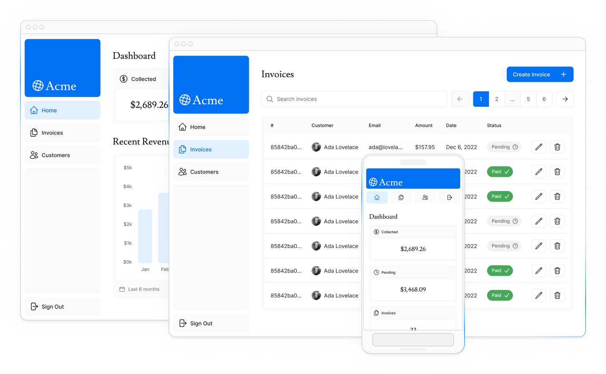

# App Router

<big>Добро пожаловать на курс «Основы Next.js»! В этом бесплатном интерактивном курсе вы познакомитесь с основными возможностями Next.js, создав веб-приложение полного стека.</big>

## Что мы будем создавать

В этом курсе мы создадим финансовый дашборд, который будет иметь:

-   Публичная главная страница.
-   Страница входа в систему.
-   Страницы дашборда, защищенные аутентификацией.
-   Возможность для пользователей добавлять, редактировать и удалять счета-фактуры.

Дашборд также будет иметь сопутствующую базу данных, которую вы настроите в одной из [следующих глав](setting-up-your-database.md).

К концу курса вы получите основные навыки, необходимые для создания полнофункциональных приложений Next.js.

## Обзор

Вот обзор функций, о которых вы узнаете в этом курсе:

-   **Стилизация**: Различные способы стилизации вашего приложения в Next.js.
-   **Оптимизации**: Как оптимизировать изображения, ссылки и шрифты.
-   **Маршрутизация**: Как создавать вложенные макеты и страницы с помощью маршрутизации файловой системы.
-   **Получение данных**: как настроить базу данных Postgres на Vercel, а также лучшие практики для получения и потоковой передачи данных.
-   **Поиск и пагинация**: Как реализовать поиск и пагинацию с использованием параметров поиска URL.
-   **Мутирование данных**: Как изменять данные с помощью React Server Actions и перепроверять кэш Next.js.
-   **Обработка ошибок**: Как обрабатывать общие ошибки и ошибки 404 not found.
-   **Валидация форм и доступность**: как выполнять валидацию форм на стороне сервера и советы по улучшению доступности.
-   **Аутентификация**: Как добавить аутентификацию в приложение с помощью NextAuth.js и Middleware.
-   **Метаданные**: Как добавить метаданные и подготовить приложение к публикации в социальных сетях.

## Необходимые знания

Этот курс предполагает, что вы имеете базовое представление о React и JavaScript. Если вы новичок в React, мы рекомендуем сначала пройти наш курс «[Основы React](https://nextjs.org/learn/react-foundations)», чтобы узнать об основах React, таких как компоненты, реквизиты, состояние и хуки, а также о новых функциях, таких как серверные компоненты и Suspense.

## Системные требования

Прежде чем начать этот курс, убедитесь, что ваша система соответствует следующим требованиям:

-   Установлен [Node.js](https://nodejs.org/en) 18.18.0 или более поздняя версия.
-   Операционные системы: macOS, Windows (включая WSL) или Linux.

Кроме того, вам понадобятся учетная [запись GitHub](https://github.com/join/) и [учетная запись Vercel](https://vercel.com/signup).

<small>:material-information-outline: Источник &mdash; <https://nextjs.org/learn/dashboard-app></small>
