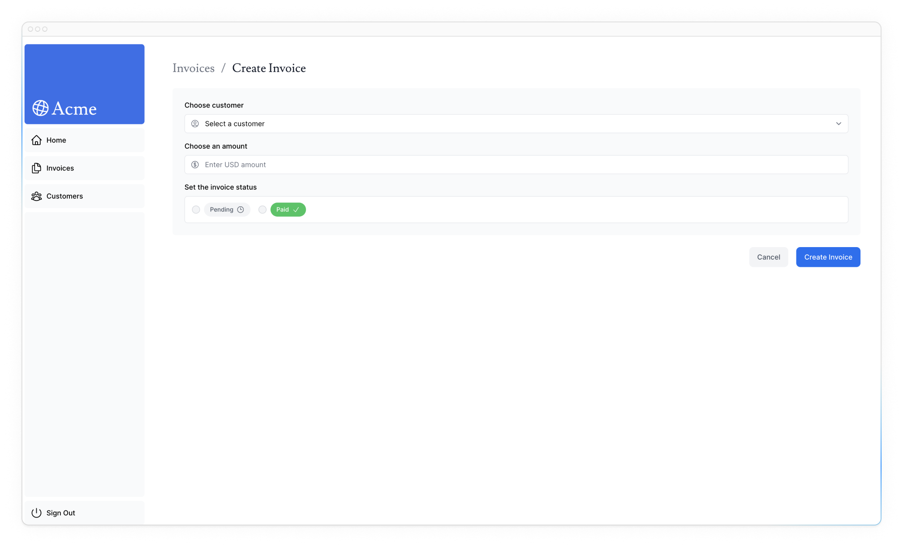
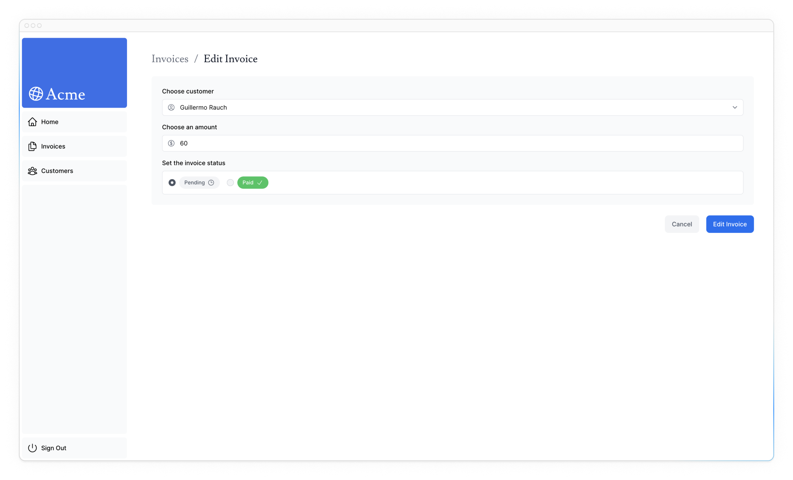

# Mutating Data

In the previous chapter, you implemented search and pagination using URL Search Params and Next.js APIs. Let's continue working on the Invoices page by adding the ability to create, update, and delete invoices!

!!!info "Here are the topics we’ll cover"

    -   What React Server Actions are and how to use them to mutate data.
    -   How to work with forms and Server Components.
    -   Best practices for working with the native FormData object, including type validation.
    -   How to revalidate the client cache using the revalidatePath API.
    -   How to create dynamic route segments with specific IDs.

## What are Server Actions?

React Server Actions allow you to run asynchronous code directly on the server. They eliminate the need to create API endpoints to mutate your data. Instead, you write asynchronous functions that execute on the server and can be invoked from your Client or Server Components.

Security is a top priority for web applications, as they can be vulnerable to various threats. This is where Server Actions come in. They include features like encrypted closures, strict input checks, error message hashing, host restrictions, and more — all working together to significantly enhance your application security.

## Using forms with Server Actions

In React, you can use the `action` attribute in the `<form>` element to invoke actions. The action will automatically receive the native [FormData](https://developer.mozilla.org/en-US/docs/Web/API/FormData) object, containing the captured data.

For example:

```ts
// Server Component
export default function Page() {
    // Action
    async function create(formData: FormData) {
        'use server';

        // Logic to mutate data...
    }

    // Invoke the action using the "action" attribute
    return <form action={create}>...</form>;
}
```

An advantage of invoking a Server Action within a Server Component is progressive enhancement - forms work even if JavaScript has not yet loaded on the client. For example, without slower internet connections.

## Next.js with Server Actions

Server Actions are also deeply integrated with Next.js [caching](https://nextjs.org/docs/app/building-your-application/caching). When a form is submitted through a Server Action, not only can you use the action to mutate data, but you can also revalidate the associated cache using APIs like `revalidatePath` and `revalidateTag`.

<?quiz?>

question: What's one benefit of using a Server Actions?
answer: Improved SEO.
answer-correct: Progressive Enhancement.
answer: Faster Websites.
answer: Data Encryption.
content:

<p>That's right! This allows users to interact with the form and submit data even if the JavaScript for the form hasn't been loaded yet or if it fails to load.</p>
<?/quiz?>

Let's see how it all works together!

## Creating an invoice

Here are the steps you'll take to create a new invoice:

1.  Create a form to capture the user's input.
2.  Create a Server Action and invoke it from the form.
3.  Inside your Server Action, extract the data from the `formData` object.
4.  Validate and prepare the data to be inserted into your database.
5.  Insert the data and handle any errors.
6.  Revalidate the cache and redirect the user back to invoices page.

### 1. Create a new route and form

To start, inside the `/invoices` folder, add a new route segment called `/create` with a `page.tsx` file:


You'll be using this route to create new invoices. Inside your `page.tsx` file, paste the following code, then spend some time studying it:

```ts title="/dashboard/invoices/create/page.tsx"
import Form from '@/app/ui/invoices/create-form';
import Breadcrumbs from '@/app/ui/invoices/breadcrumbs';
import { fetchCustomers } from '@/app/lib/data';

export default async function Page() {
    const customers = await fetchCustomers();

    return (
        <main>
            <Breadcrumbs
                breadcrumbs={[
                    {
                        label: 'Invoices',
                        href: '/dashboard/invoices',
                    },
                    {
                        label: 'Create Invoice',
                        href: '/dashboard/invoices/create',
                        active: true,
                    },
                ]}
            />
            <Form customers={customers} />
        </main>
    );
}
```

Your page is a Server Component that fetches `customers` and passes it to the `<Form>` component. To save time, we've already created the `<Form>` component for you.

Navigate to the `<Form>` component, and you'll see that the form:

-   Has one `<select>` (dropdown) element with a list of **customers**.
-   Has one `<input>` element for the **amount** with `type="number"`.
-   Has two `<input>` elements for the status with `type="radio"`.
-   Has one button with `type="submit"`.

On <http://localhost:3000/dashboard/invoices/create>, you should see the following UI:



### 2. Create a Server Action

Great, now let's create a Server Action that is going to be called when the form is submitted.

Navigate to your `lib/` directory and create a new file named `actions.ts`. At the top of this file, add the React [use server](https://react.dev/reference/react/use-server) directive:

```ts title="/app/lib/actions.ts"
'use server';
```

By adding the `'use server'`, you mark all the exported functions within the file as Server Actions. These server functions can then be imported and used in Client and Server components. Any functions included in this file that are not used will be automatically removed from the final application bundle.

You can also write Server Actions directly inside Server Components by adding `"use server"` inside the action. But for this course, we'll keep them all organized in a separate file. We recommend having a separate file for your actions.

In your `actions.ts` file, create a new async function that accepts `formData`:

```ts title="/app/lib/actions.ts" hl_lines="3"
'use server';

export async function createInvoice(formData: FormData) {}
```

Then, in your `<Form>` component, import the `createInvoice` from your `actions.ts` file. Add a `action` attribute to the `<form>` element, and call the `createInvoice` action.

```ts title="/app/ui/invoices/create-form.tsx" hl_lines="10 17"
import { CustomerField } from '@/app/lib/definitions';
import Link from 'next/link';
import {
    CheckIcon,
    ClockIcon,
    CurrencyDollarIcon,
    UserCircleIcon,
} from '@heroicons/react/24/outline';
import { Button } from '@/app/ui/button';
import { createInvoice } from '@/app/lib/actions';

export default function Form({
    customers,
}: {
    customers: CustomerField[];
}) {
    return <form action={createInvoice}>...</form>;
}
```

!!!note "Good to know"

    In HTML, you'd pass a URL to the `action` attribute. This URL would be the destination where your form data should be submitted (usually an API endpoint).

    However, in React, the `action` attribute is considered a special prop - meaning React builds on top of it to allow actions to be invoked.

    Behind the scenes, Server Actions create a `POST` API endpoint. This is why you don't need to create API endpoints manually when using Server Actions.

### 3. Extract the data from formData

Back in your `actions.ts` file, you'll need to extract the values of `formData`, there are a [couple of methods](https://developer.mozilla.org/en-US/docs/Web/API/FormData) you can use. For this example, let's use the [`.get(name)`](https://developer.mozilla.org/en-US/docs/Web/API/FormData/get) method.

```ts title="/app/lib/actions.ts" hl_lines="3-11"
'use server';

export async function createInvoice(formData: FormData) {
    const rawFormData = {
        customerId: formData.get('customerId'),
        amount: formData.get('amount'),
        status: formData.get('status'),
    };
    // Test it out:
    console.log(rawFormData);
}
```

!!!tip "Tip"

    If you're working with forms that have many fields, you may want to consider using the [`entries()`](https://developer.mozilla.org/en-US/docs/Web/API/FormData/entries) method with JavaScript's [`Object.fromEntries()`](https://developer.mozilla.org/en-US/docs/Web/JavaScript/Reference/Global_Objects/Object/fromEntries).

To check everything is connected correctly, try out the form. After submitting, you should see the data you just entered into the form logged in your **terminal** (not the browser).

Now that your data is in the shape of an object, it'll be much easier to work with.

### 4. Validate and prepare the data

Before sending the form data to your database, you want to ensure it's in the correct format and with the correct types. If you remember from earlier in the course, your invoices table expects data in the following format:

```ts title="/app/lib/definitions.ts"
export type Invoice = {
    id: string; // Will be created on the database
    customer_id: string;
    amount: number; // Stored in cents
    status: 'pending' | 'paid';
    date: string;
};
```

So far, you only have the `customer_id`, `amount`, and `status` from the form.

**Type validation and coercion**

It's important to validate that the data from your form aligns with the expected types in your database. For instance, if you add a `console.log` inside your action:

```ts
console.log(typeof rawFormData.amount);
```

You'll notice that `amount` is of type `string` and not `number`. This is because `input` elements with `type="number"` actually return a string, not a number!

To handle type validation, you have a few options. While you can manually validate types, using a type validation library can save you time and effort. For your example, we'll use [Zod](https://zod.dev/), a TypeScript-first validation library that can simplify this task for you.

In your `actions.ts` file, import Zod and define a schema that matches the shape of your form object. This schema will validate the `formData` before saving it to a database.

```ts title="/app/lib/actions.ts" hl_lines="3 5-11 13-16"
'use server';

import { z } from 'zod';

const FormSchema = z.object({
    id: z.string(),
    customerId: z.string(),
    amount: z.coerce.number(),
    status: z.enum(['pending', 'paid']),
    date: z.string(),
});

const CreateInvoice = FormSchema.omit({
    id: true,
    date: true,
});

export async function createInvoice(formData: FormData) {
    // ...
}
```

The `amount` field is specifically set to coerce (change) from a string to a number while also validating its type.

You can then pass your `rawFormData` to `CreateInvoice` to validate the types:

```ts title="/app/lib/actions.ts" hl_lines="3-7"
// ...
export async function createInvoice(formData: FormData) {
    const {
        customerId,
        amount,
        status,
    } = CreateInvoice.parse({
        customerId: formData.get('customerId'),
        amount: formData.get('amount'),
        status: formData.get('status'),
    });
}
```

**Storing values in cents**

It's usually good practice to store monetary values in cents in your database to eliminate JavaScript floating-point errors and ensure greater accuracy.

Let's convert the amount into cents:

```ts title="/app/lib/actions.ts" hl_lines="12"
// ...
export async function createInvoice(formData: FormData) {
    const {
        customerId,
        amount,
        status,
    } = CreateInvoice.parse({
        customerId: formData.get('customerId'),
        amount: formData.get('amount'),
        status: formData.get('status'),
    });
    const amountInCents = amount * 100;
}
```

**Creating new dates**

Finally, let's create a new date with the format "YYYY-MM-DD" for the invoice's creation date:

```ts title="/app/lib/actions.ts" hl_lines="13"
// ...
export async function createInvoice(formData: FormData) {
    const {
        customerId,
        amount,
        status,
    } = CreateInvoice.parse({
        customerId: formData.get('customerId'),
        amount: formData.get('amount'),
        status: formData.get('status'),
    });
    const amountInCents = amount * 100;
    const date = new Date().toISOString().split('T')[0];
}
```

### 5. Inserting the data into your database

Now that you have all the values you need for your database, you can create an SQL query to insert the new invoice into your database and pass in the variables:

```ts title="/app/lib/actions.ts" hl_lines="2 23-26"
import { z } from 'zod';
import postgres from 'postgres';

const sql = postgres(process.env.POSTGRES_URL!, {
    ssl: 'require',
});

// ...

export async function createInvoice(formData: FormData) {
    const {
        customerId,
        amount,
        status,
    } = CreateInvoice.parse({
        customerId: formData.get('customerId'),
        amount: formData.get('amount'),
        status: formData.get('status'),
    });
    const amountInCents = amount * 100;
    const date = new Date().toISOString().split('T')[0];

    await sql`
    INSERT INTO invoices (customer_id, amount, status, date)
    VALUES (${customerId}, ${amountInCents}, ${status}, ${date})
  `;
}
```

Right now, we're not handling any errors. We'll talk about this in the next chapter. For now, let's move on to the next step.

### 6. Revalidate and redirect

Next.js has a client-side router cache that stores the route segments in the user's browser for a time. Along with [prefetching](https://nextjs.org/docs/app/building-your-application/routing/linking-and-navigating#1-prefetching), this cache ensures that users can quickly navigate between routes while reducing the number of requests made to the server.

Since you're updating the data displayed in the invoices route, you want to clear this cache and trigger a new request to the server. You can do this with the [`revalidatePath`](https://nextjs.org/docs/app/api-reference/functions/revalidatePath) function from Next.js:

```ts title="/app/lib/actions.ts" hl_lines="4 31"
'use server';

import { z } from 'zod';
import { revalidatePath } from 'next/cache';
import postgres from 'postgres';

const sql = postgres(process.env.POSTGRES_URL!, {
    ssl: 'require',
});

// ...

export async function createInvoice(formData: FormData) {
    const {
        customerId,
        amount,
        status,
    } = CreateInvoice.parse({
        customerId: formData.get('customerId'),
        amount: formData.get('amount'),
        status: formData.get('status'),
    });
    const amountInCents = amount * 100;
    const date = new Date().toISOString().split('T')[0];

    await sql`
    INSERT INTO invoices (customer_id, amount, status, date)
    VALUES (${customerId}, ${amountInCents}, ${status}, ${date})
  `;

    revalidatePath('/dashboard/invoices');
}
```

Once the database has been updated, the `/dashboard/invoices` path will be revalidated, and fresh data will be fetched from the server.

At this point, you also want to redirect the user back to the `/dashboard/invoices` page. You can do this with the [`redirect`](https://nextjs.org/docs/app/api-reference/functions/redirect) function from Next.js:

```ts title="/app/lib/actions.ts" hl_lines="5 18"
'use server';

import { z } from 'zod';
import { revalidatePath } from 'next/cache';
import { redirect } from 'next/navigation';
import postgres from 'postgres';

const sql = postgres(process.env.POSTGRES_URL!, {
    ssl: 'require',
});

// ...

export async function createInvoice(formData: FormData) {
    // ...

    revalidatePath('/dashboard/invoices');
    redirect('/dashboard/invoices');
}
```

Congratulations! You've just implemented your first Server Action. Test it out by adding a new invoice, if everything is working correctly:

1.  You should be redirected to the `/dashboard/invoices` route on submission.
2.  You should see the new invoice at the top of the table.

## Updating an invoice

The updating invoice form is similar to the create an invoice form, except you'll need to pass the invoice `id` to update the record in your database. Let's see how you can get and pass the invoice `id`.

These are the steps you'll take to update an invoice:

1.  Create a new dynamic route segment with the invoice `id`.
2.  Read the invoice `id` from the page params.
3.  Fetch the specific invoice from your database.
4.  Pre-populate the form with the invoice data.
5.  Update the invoice data in your database.

### 1. Create a Dynamic Route Segment with the invoice id

Next.js allows you to create [Dynamic Route Segments](https://nextjs.org/docs/app/building-your-application/routing/dynamic-routes) when you don't know the exact segment name and want to create routes based on data. This could be blog post titles, product pages, etc. You can create dynamic route segments by wrapping a folder's name in square brackets. For example, `[id]`, `[post]` or `[slug]`.

In your `/invoices` folder, create a new dynamic route called `[id]`, then a new route called `edit` with a `page.tsx` file. Your file structure should look like this:

![Invoices folder with a nested [id] folder, and an edit folder inside it](edit-invoice-route.png)

In your `<Table>` component, notice there's a `<UpdateInvoice />` button that receives the invoice's `id` from the table records.

```ts title="/app/ui/invoices/table.tsx" hl_lines="11"
export default async function InvoicesTable({
    query,
    currentPage,
}: {
    query: string;
    currentPage: number;
}) {
    return (
        // ...
        <td className="flex justify-end gap-2 whitespace-nowrap px-6 py-4 text-sm">
            <UpdateInvoice id={invoice.id} />
            <DeleteInvoice id={invoice.id} />
        </td>
        // ...
    );
}
```

Navigate to your `<UpdateInvoice />` component, and update the `href` of the `Link` to accept the `id` prop. You can use template literals to link to a dynamic route segment:

```ts title="/app/ui/invoices/buttons.tsx" hl_lines="13"
import {
    PencilIcon,
    PlusIcon,
    TrashIcon,
} from '@heroicons/react/24/outline';
import Link from 'next/link';

// ...

export function UpdateInvoice({ id }: { id: string }) {
    return (
        <Link
            href={`/dashboard/invoices/${id}/edit`}
            className="rounded-md border p-2 hover:bg-gray-100"
        >
            <PencilIcon className="w-5" />
        </Link>
    );
}
```

### 2. Read the invoice `id` from page `params`

Back on your `<Page>` component, paste the following code:

```ts title="/app/dashboard/invoices/[id]/edit/page.tsx"
import Form from '@/app/ui/invoices/edit-form';
import Breadcrumbs from '@/app/ui/invoices/breadcrumbs';
import { fetchCustomers } from '@/app/lib/data';

export default async function Page() {
    return (
        <main>
            <Breadcrumbs
                breadcrumbs={[
                    {
                        label: 'Invoices',
                        href: '/dashboard/invoices',
                    },
                    {
                        label: 'Edit Invoice',
                        href: `/dashboard/invoices/${id}/edit`,
                        active: true,
                    },
                ]}
            />
            <Form invoice={invoice} customers={customers} />
        </main>
    );
}
```

Notice how it's similar to your `/create` invoice page, except it imports a different form (from the `edit-form.tsx` file). This form should be **pre-populated** with a `defaultValue` for the customer's name, invoice amount, and status. To pre-populate the form fields, you need to fetch the specific invoice using `id`.

In addition to `searchParams`, page components also accept a prop called `params` which you can use to access the `id`. Update your `<Page>` component to receive the prop:

```ts title="/app/dashboard/invoices/[id]/edit/page.tsx" hl_lines="5-8"
import Form from '@/app/ui/invoices/edit-form';
import Breadcrumbs from '@/app/ui/invoices/breadcrumbs';
import { fetchCustomers } from '@/app/lib/data';

export default async function Page(props: {
    params: Promise<{ id: string }>;
}) {
    const params = await props.params;
    const id = params.id;
    // ...
}
```

### 3. Fetch the specific invoice

Then:

-   Import a new function called `fetchInvoiceById` and pass the `id` as an argument.
-   Import `fetchCustomers` to fetch the customer names for the dropdown.

You can use `Promise.all` to fetch both the invoice and customers in parallel:

```ts title="/dashboard/invoices/[id]/edit/page.tsx" hl_lines="4-5 13-16"
import Form from '@/app/ui/invoices/edit-form';
import Breadcrumbs from '@/app/ui/invoices/breadcrumbs';
import {
    fetchInvoiceById,
    fetchCustomers,
} from '@/app/lib/data';

export default async function Page(props: {
    params: Promise<{ id: string }>;
}) {
    const params = await props.params;
    const id = params.id;
    const [invoice, customers] = await Promise.all([
        fetchInvoiceById(id),
        fetchCustomers(),
    ]);
    // ...
}
```

You will see a temporary TypeScript error for the `invoice` prop in your terminal because `invoice` could be potentially `undefined`. Don't worry about it for now, you'll resolve it in the next chapter when you add error handling.

Great! Now, test that everything is wired correctly. Visit <http://localhost:3000/dashboard/invoices> and click on the Pencil icon to edit an invoice. After navigation, you should see a form that is pre-populated with the invoice details:



The URL should also be updated with an `id` as follows: `http://localhost:3000/dashboard/invoice/uuid/edit`

!!!tip "UUIDs vs. Auto-incrementing Keys"

    We use UUIDs instead of incrementing keys (e.g., 1, 2, 3, etc.). This makes the URL longer; however, UUIDs eliminate the risk of ID collision, are globally unique, and reduce the risk of enumeration attacks - making them ideal for large databases.

    However, if you prefer cleaner URLs, you might prefer to use auto-incrementing keys.

### 4. Pass the id to the Server Action

Lastly, you want to pass the `id` to the Server Action so you can update the right record in your database. You **cannot** pass the `id` as an argument like so:

```ts title="/app/ui/invoices/edit-form.tsx"
// Passing an id as argument won't work
<form action={updateInvoice(id)}>
```

Instead, you can pass `id` to the Server Action using JS `bind`. This will ensure that any values passed to the Server Action are encoded.

```ts title="/app/ui/invoices/edit-form.tsx" hl_lines="2 11-14 16-20"
// ...
import { updateInvoice } from '@/app/lib/actions';

export default function EditInvoiceForm({
    invoice,
    customers,
}: {
    invoice: InvoiceForm;
    customers: CustomerField[];
}) {
    const updateInvoiceWithId = updateInvoice.bind(
        null,
        invoice.id
    );

    return (
        <form action={updateInvoiceWithId}>
            {/* ... */}
        </form>
    );
}
```

!!!note "Note"

Using a hidden input field in your form also works (e.g. `<input type="hidden" name="id" value={invoice.id} />`). However, the values will appear as full text in the HTML source, which is not ideal for sensitive data.

Then, in your `actions.ts` file, create a new action, `updateInvoice`:

```ts title="/app/lib/actions.ts"
// Use Zod to update the expected types
const UpdateInvoice = FormSchema.omit({
    id: true,
    date: true,
});

// ...

export async function updateInvoice(
    id: string,
    formData: FormData
) {
    const {
        customerId,
        amount,
        status,
    } = UpdateInvoice.parse({
        customerId: formData.get('customerId'),
        amount: formData.get('amount'),
        status: formData.get('status'),
    });

    const amountInCents = amount * 100;

    await sql`
    UPDATE invoices
    SET customer_id = ${customerId}, amount = ${amountInCents}, status = ${status}
    WHERE id = ${id}
  `;

    revalidatePath('/dashboard/invoices');
    redirect('/dashboard/invoices');
}
```

Similarly to the `createInvoice` action, here you are:

1.  Extracting the data from `formData`.
2.  Validating the types with Zod.
3.  Converting the amount to cents.
4.  Passing the variables to your SQL query.
5.  Calling `revalidatePath` to clear the client cache and make a new server request.
6.  Calling `redirect` to redirect the user to the invoice's page.

Test it out by editing an invoice. After submitting the form, you should be redirected to the invoices page, and the invoice should be updated.

## Deleting an invoice

To delete an invoice using a Server Action, wrap the delete button in a `<form>` element and pass the `id` to the Server Action using `bind`:

```ts title="/app/ui/invoices/buttons.tsx" hl_lines="1 6-9 12"
import { deleteInvoice } from '@/app/lib/actions';

// ...

export function DeleteInvoice({ id }: { id: string }) {
    const deleteInvoiceWithId = deleteInvoice.bind(
        null,
        id
    );

    return (
        <form action={deleteInvoiceWithId}>
            <button
                type="submit"
                className="rounded-md border p-2 hover:bg-gray-100"
            >
                <span className="sr-only">Delete</span>
                <TrashIcon className="w-4" />
            </button>
        </form>
    );
}
```

Inside your `actions.ts` file, create a new action called `deleteInvoice`.

```ts title="/app/lib/actions.ts"
export async function deleteInvoice(id: string) {
    await sql`DELETE FROM invoices WHERE id = ${id}`;
    revalidatePath('/dashboard/invoices');
}
```

Since this action is being called in the `/dashboard/invoices` path, you don't need to call `redirect`. Calling `revalidatePath` will trigger a new server request and re-render the table.

## Further reading

In this chapter, you learned how to use Server Actions to mutate data. You also learned how to use the `revalidatePath` API to revalidate the Next.js cache and `redirect` to redirect the user to a new page.

You can also read more about [security with Server Actions](https://nextjs.org/blog/security-nextjs-server-components-actions) for additional learning.

<small>:material-information-outline: Источник &mdash; <https://nextjs.org/learn/dashboard-app/mutating-data></small>
