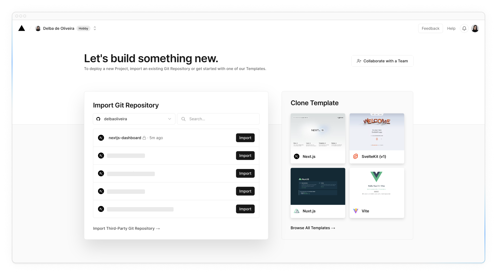
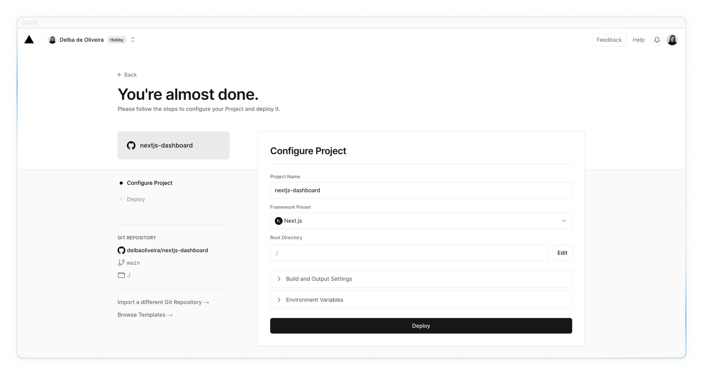
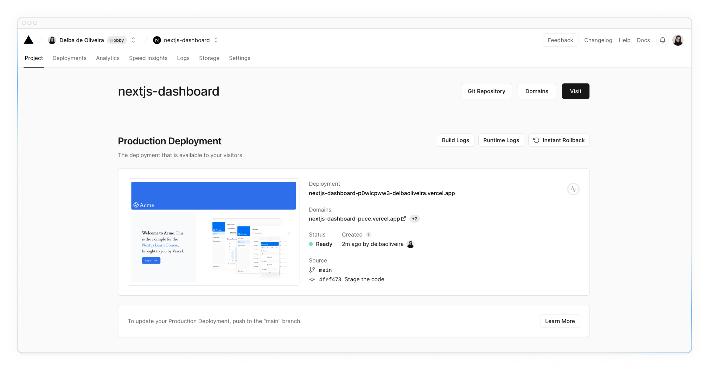
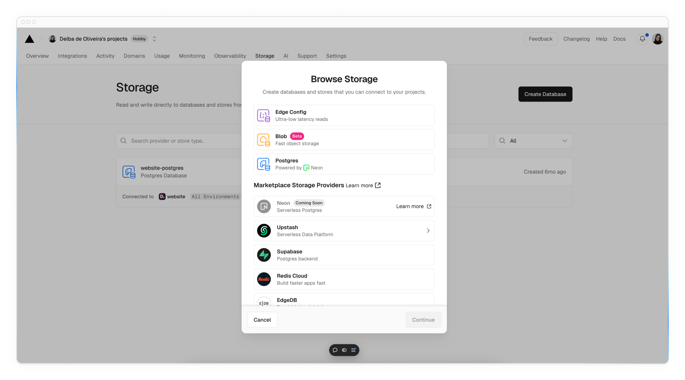
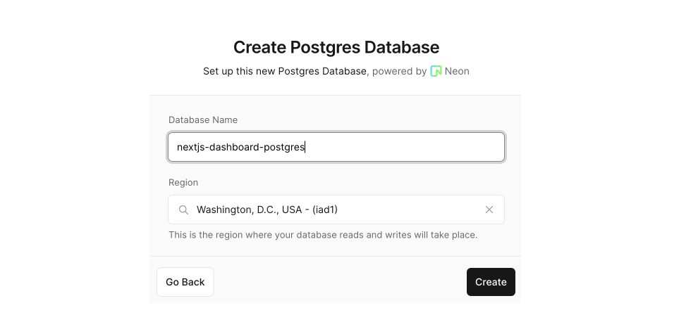
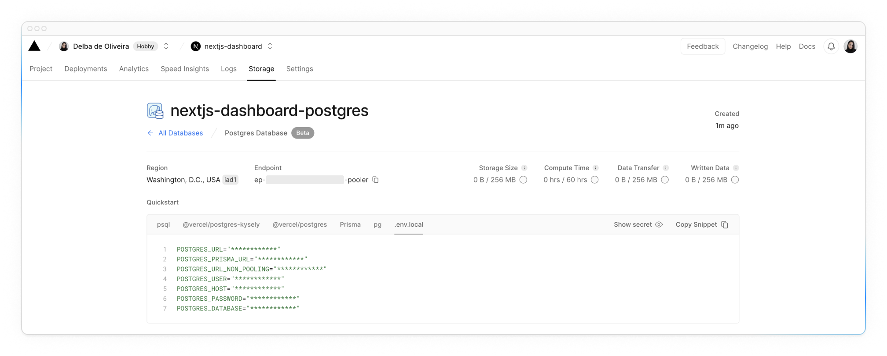

# Setting Up Your Database

Before you can continue working on your dashboard, you'll need some data. In this chapter, you'll be setting up a PostgreSQL database from one of [Vercel's marketplace integrations](https://vercel.com/marketplace?category=databases). If you're already familiar with PostgreSQL and would prefer to use your own database provider, you can skip this chapter and set it up on your own. Otherwise, let's continue!

!!!tip "Here are the topics we’ll cover"

    -   Push your project to GitHub.
    -   Set up a Vercel account and link your GitHub repo for instant previews and deployments.
    -   Create and link your project to a Postgres database.
    -   Seed the database with initial data.

## Create a GitHub repository

To start, let's push your repository to GitHub if you haven't already. This will make it easier to set up your database and deploy.

If you need help setting up your repository, take a look at [this guide on GitHub](https://help.github.com/en/github/getting-started-with-github/create-a-repo).

!!!info "Good to know:"

    -   You can also use other git providers like GitLab or Bitbucket.
    -   If you're new to GitHub, we recommend the [GitHub Desktop App](https://desktop.github.com/) for a simplified development workflow.

## Create a Vercel account

Visit [vercel.com/signup](https://vercel.com/signup) to create an account. Choose the free "hobby" plan. Select **Continue with GitHub** to connect your GitHub and Vercel accounts.

## Connect and deploy your project

Next, you'll be taken to this screen where you can select and **import** the GitHub repository you've just created:



Name your project and click **Deploy**.



Hooray! 🎉 Your project is now deployed.



By connecting your GitHub repository, whenever you push changes to your **main** branch, Vercel will automatically redeploy your application with no configuration needed. When opening pull requests, you'll also have [instant preview URLs](https://vercel.com/docs/deployments/environments#preview-environment-pre-production#preview-urls) which allow you to catch deployment errors early and share a preview of your project with team members for feedback.

## Create a Postgres database

Next, to set up a database, click **Continue to Dashboard** and select the **Storage** tab from your project dashboard. Select **Create Database**. Depending on when your Vercel account was created, you may see options like Neon or Supabase. Choose your preferred provider and click **Continue**.



Choose your region and storage plan, if required. The [default region](https://vercel.com/docs/functions/configuring-functions/region) for all Vercel projects is **Washington D.C (iad1)**, and we recommend choosing this if available to reduce [latency](https://developer.mozilla.org/en-US/docs/Web/Performance/Understanding_latency) for data requests.



Once connected, navigate to the `.env.local` tab, click **Show secret** and **Copy Snippet**. Make sure you reveal the secrets before copying them.



Navigate to your code editor and rename the `.env.example` file to `.env`. Paste in the copied contents from Vercel.

!!!important "Important:"

    Go to your .gitignore file and make sure .env is in the ignored files to prevent your database secrets from being exposed when you push to GitHub.

## Seed your database

Now that your database has been created, let's seed it with some initial data.

We've included an API you can access in the browser, which will run a seed script to populate the database with an initial set of data.

The script uses **SQL** to create the tables, and the data from `placeholder-data.ts` file to populate them after they've been created.

Ensure your local development server is running with `pnpm run dev` and navigate to <localhost:3000/seed> in your browser. When finished, you will see a message "Database seeded successfully" in the browser. Once completed, you can delete this file.

<?quiz?>

question: What is 'seeding' in the context of databases?
answer: Deleting all data in the database
answer: Importing the schema of a database
answer-correct: Populating the database with an initial set of data
answer: Creating relationships between tables in a database
content:

<p>That's right! Seeding is useful when you want to have some data to work with as you build your application.</p>
<?/quiz?>

!!!warning "Troubleshooting:"

    -   Make sure to reveal your database secrets before copying it into your `.env` file.
    -   The script uses `bcrypt` to hash the user's password, if `bcrypt` isn't compatible with your environment, you can update the script to use [`bcryptjs`](https://www.npmjs.com/package/bcryptjs) instead.
    -   If you run into any issues while seeding your database and want to run the script again, you can drop any existing tables by running `DROP TABLE tablename` in your database query interface. See the [executing queries section](https://nextjs.org/learn/dashboard-app/setting-up-your-database#executing-queries) below for more details. But be careful, this command will delete the tables and all their data. It's ok to do this with your example app since you're working with placeholder data, but you shouldn't run this command in a production app.

## Executing queries

Let's execute a query to make sure everything is working as expected. We'll use another Router Handler, `app/query/route.ts`, to query the database. Inside this file, you'll find a `listInvoices()` function that has the following SQL query.

```sql
SELECT invoices.amount, customers.name
FROM invoices
JOIN customers ON invoices.customer_id = customers.id
WHERE invoices.amount = 666;
```

Uncomment the file, remove the `Response.json()` block, and navigate to <localhost:3000/query> in your browser. You should see that an invoice `amount` and `name` is returned.

<?quiz?>

question: Which customer does this invoice belong to?
answer: Lee Robinson
answer-correct: Evil Rabbit
answer: Delba de Oliveira
answer: Michael Novotny
content:

<p>That's right!</p>
<?/quiz?>

<small>:material-information-outline: Источник &mdash; <https://nextjs.org/learn/dashboard-app/setting-up-your-database></small>
