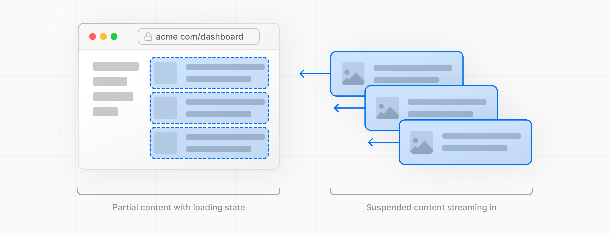
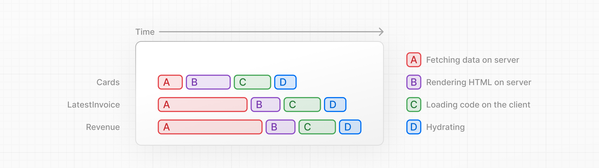
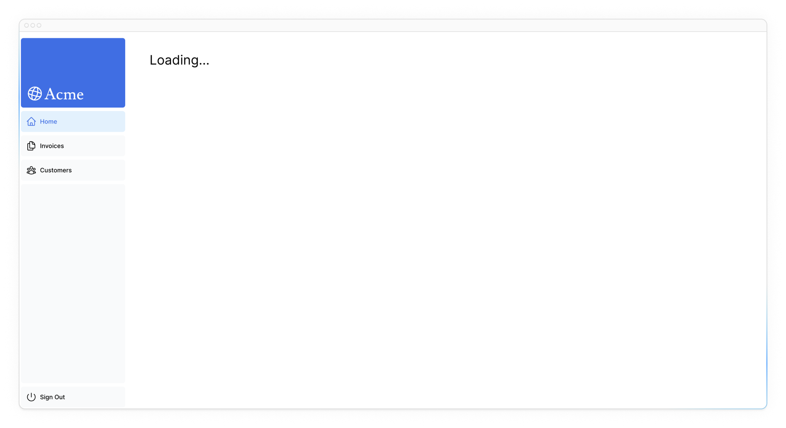
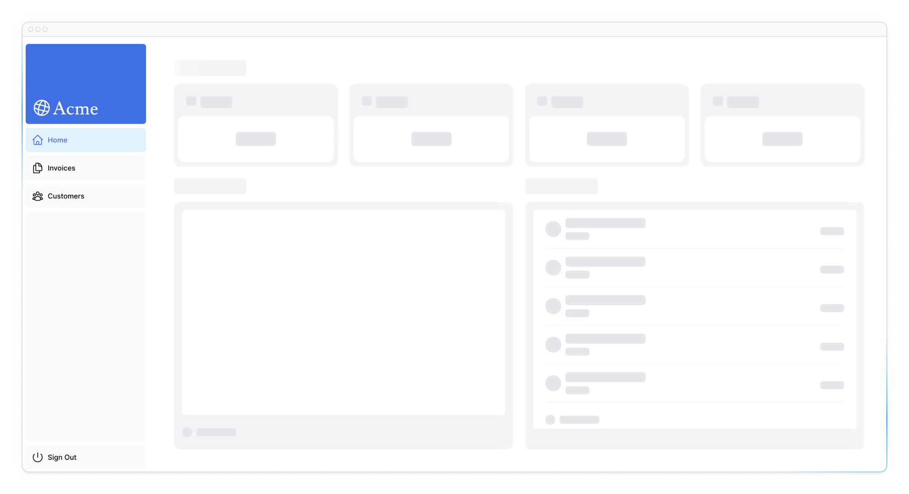

# Streaming

In the previous chapter, you learned about the different rendering methods of Next.js. We also discussed how slow data fetches can impact the performance of your application. Let's look at how you can improve the user experience when there are slow data requests.

!!!tip "Here are the topics we’ll cover"

    -   What streaming is and when you might use it.
    -   How to implement streaming with loading.tsx and Suspense.
    -   What loading skeletons are.
    -   What Next.js Route Groups are, and when you might use them.
    -   Where to place React Suspense boundaries in your application.

## What is streaming?

Streaming is a data transfer technique that allows you to break down a route into smaller "chunks" and progressively stream them from the server to the client as they become ready.



By streaming, you can prevent slow data requests from blocking your whole page. This allows the user to see and interact with parts of the page without waiting for all the data to load before any UI can be shown to the user.



Streaming works well with React's component model, as each component can be considered a _chunk_.

There are two ways you implement streaming in Next.js:

1.  At the page level, with the `loading.tsx` file (which creates `<Suspense>` for you).
2.  At the component level, with `<Suspense>` for more granular control.

Let's see how this works.

<?quiz?>

question: What is one advantage of streaming?
answer: Data requests become more secure through chunk encryption
answer: All chunks are rendered only after they are received in full
answer-correct: Chunks are rendered in parallel, reducing the overall load time
content:

<p>One advantage of this approach is that you can significantly reduce your page's overall loading time.</p>
<?/quiz?>

## Streaming a whole page with `loading.tsx`

In the `/app/dashboard` folder, create a new file called `loading.tsx`:

```ts title="/app/dashboard/loading.tsx"
export default function Loading() {
    return <div>Loading...</div>;
}
```

Refresh <http://localhost:3000/dashboard>, and you should now see:



A few things are happening here:

1.  `loading.tsx` is a special Next.js file built on top of React Suspense. It allows you to create fallback UI to show as a replacement while page content loads.
2.  Since `<SideNav>` is static, it's shown immediately. The user can interact with `<SideNav>` while the dynamic content is loading.
3.  The user doesn't have to wait for the page to finish loading before navigating away (this is called interruptable navigation).

Congratulations! You've just implemented streaming. But we can do more to improve the user experience. Let's show a loading skeleton instead of the `Loading…` text.

### Adding loading skeletons

A loading skeleton is a simplified version of the UI. Many websites use them as a placeholder (or fallback) to indicate to users that the content is loading. Any UI you add in `loading.tsx` will be embedded as part of the static file, and sent first. Then, the rest of the dynamic content will be streamed from the server to the client.

Inside your `loading.tsx` file, import a new component called `<DashboardSkeleton>`:

```ts title="/app/dashboard/loading.tsx" hl_lines="1 4"
import DashboardSkeleton from '@/app/ui/skeletons';

export default function Loading() {
    return <DashboardSkeleton />;
}
```

Then, refresh <http://localhost:3000/dashboard>, and you should now see:



### Fixing the loading skeleton bug with route groups

Right now, your loading skeleton will apply to the invoices.

Since `loading.tsx` is a level higher than `/invoices/page.tsx` and `/customers/page.tsx` in the file system, it's also applied to those pages.

We can change this with [Route Groups](https://nextjs.org/docs/app/building-your-application/routing/route-groups). Create a new folder called `/(overview)` inside the dashboard folder. Then, move your `loading.tsx` and `page.tsx` files inside the folder:


Now, the `loading.tsx` file will only apply to your dashboard overview page.

Route groups allow you to organize files into logical groups without affecting the URL path structure. When you create a new folder using parentheses `()`, the name won't be included in the URL path. So `/dashboard/(overview)/page.tsx` becomes `/dashboard`.

Here, you're using a route group to ensure `loading.tsx` only applies to your dashboard overview page. However, you can also use route groups to separate your application into sections (e.g. `(marketing)` routes and `(shop)` routes) or by teams for larger applications.

### Streaming a component

So far, you're streaming a whole page. But you can also be more granular and stream specific components using React Suspense.

Suspense allows you to defer rendering parts of your application until some condition is met (e.g. data is loaded). You can wrap your dynamic components in Suspense. Then, pass it a fallback component to show while the dynamic component loads.

If you remember the slow data request, `fetchRevenue()`, this is the request that is slowing down the whole page. Instead of blocking your whole page, you can use Suspense to stream only this component and immediately show the rest of the page's UI.

To do so, you'll need to move the data fetch to the component, let's update the code to see what that'll look like:

Delete all instances of `fetchRevenue()` and its data from `/dashboard/(overview)/page.tsx`:
