<!-- prettier-ignore-start -->

# Учебное пособие

Добро пожаловать в учебное пособие! Мы будем создавать небольшое, но многофункциональное приложение, позволяющее отслеживать контакты. Мы ожидаем, что это займет от 30 до 60 минут, если вы будете следить за ходом работы.


👉 Каждый раз, когда вы видите это, это означает, что вам нужно что-то сделать в приложении!

Остальное - просто для информации и более глубокого понимания. Приступим.

## Установка

!!!info ""

    Если вы не собираетесь работать с собственным приложением, этот раздел можно пропустить.

В этом руководстве мы будем использовать [Vite][vite] для нашего бандлера и dev-сервера. Для работы с инструментом командной строки `npm` вам потребуется установленный [Node.js][node].

👉️ **Откройте терминал и загрузите новое приложение React с помощью Vite:**.

```sh
npm create vite@latest name-of-your-project -- --template react
# follow prompts
cd <your new project directory>
npm install react-router-dom localforage match-sorter sort-by
npm run dev
```

Вы должны иметь возможность посетить URL, выведенный в терминале:

```
VITE v3.0.7  ready in 175 ms

  ➜  Local:   http://127.0.0.1:5173/
  ➜  Network: use --host to expose
```

Для этого урока мы взяли несколько заранее написанных CSS, чтобы не отвлекаться на React Router. Не стесняйтесь судить его строго или написать свой собственный 😅 (Мы сделали то, чего обычно не делали в CSS, чтобы разметка в этом уроке была как можно более минимальной).

👉 **Копируем/вставляем учебный CSS [найденный здесь][tutorial-css] в `src/index.css`**

В этом учебнике мы будем создавать, читать, искать, обновлять и удалять данные. Типичное веб-приложение, вероятно, будет обращаться к API на вашем веб-сервере, но мы будем использовать хранилище браузера и имитировать некоторую сетевую задержку, чтобы не отвлекаться. Весь этот код не имеет отношения к React Router, поэтому просто скопируйте и вставьте его.

👉 **Копируем/вставляем модуль данных учебника [найден здесь][tutorial-data] в папку `src/contacts.js`**.

Все, что вам нужно в папке src - это `contacts.js`, `main.jsx` и `index.css`. Все остальное (например, `App.js`, `assets` и т.д.) можно удалить.

👉 **Удалите неиспользуемые файлы в `src/`, чтобы остались только эти:**

```src
├── contacts.js
├── index.css
└── main.jsx
```

Если ваше приложение запущено, оно может на мгновение взорваться, просто продолжайте работать 😋. Итак, мы готовы приступить к работе!

## Добавление маршрутизатора

Первым делом создадим [Browser Router][createbrowserrouter] и настроим наш первый маршрут. Это позволит обеспечить маршрутизацию на стороне клиента для нашего веб-приложения.

Точкой входа является файл `main.jsx`. Откройте его, и мы поместим React Router на страницу.

👉 **Создание и рендеринг [браузерного маршрутизатора][createbrowserrouter] в `main.jsx`**

```jsx title="src/main.jsx" hl_lines="3-6 9-14 18"
import * as React from "react";
import * as ReactDOM from "react-dom/client";
import {
  createBrowserRouter,
  RouterProvider,
} from "react-router-dom";
import "./index.css";

const router = createBrowserRouter([
  {
    path: "/",
    element: <div>Hello world!</div>,
  },
]);

ReactDOM.createRoot(document.getElementById("root")).render(
  <React.StrictMode>
    <RouterProvider router={router} />
  </React.StrictMode>
);
```

Этот первый маршрут мы часто называем "корневым", поскольку все остальные маршруты будут отрисовываться внутри него. Он будет служить корневым макетом пользовательского интерфейса, в дальнейшем мы будем использовать вложенные макеты.

## Корневой маршрут

Добавим глобальный макет для этого приложения.

👉 **Создайте папки `src/routes` и `src/routes/root.jsx`**.

```sh
mkdir src/routes
touch src/routes/root.jsx
```

<small>(Если вы не хотите быть "занудой" в командной строке, используйте вместо этих команд редактор 🤓)</small>

👉 **Создание корневого компонента макета**

```jsx title="src/routes/root.jsx"
export default function Root() {
  return (
    <>
      <div id="sidebar">
        <h1>React Router Contacts</h1>
        <div>
          <form id="search-form" role="search">
            <input
              id="q"
              aria-label="Search contacts"
              placeholder="Search"
              type="search"
              name="q"
            />
            <div
              id="search-spinner"
              aria-hidden
              hidden={true}
            />
            <div
              className="sr-only"
              aria-live="polite"
            ></div>
          </form>
          <form method="post">
            <button type="submit">New</button>
          </form>
        </div>
        <nav>
          <ul>
            <li>
              <a href={`/contacts/1`}>Your Name</a>
            </li>
            <li>
              <a href={`/contacts/2`}>Your Friend</a>
            </li>
          </ul>
        </nav>
      </div>
      <div id="detail"></div>
    </>
  );
}
```

Ничего специфичного для React Router пока нет, так что смело копируйте/вставляйте все это.

👉 **Установите `<Root>` в качестве [`element`](https://reactrouter.com/en/main/route/route#element)** корневого маршрута.

```jsx title="src/main.jsx" hl_lines="2 7"
/* existing imports */
import Root from "./routes/root";

const router = createBrowserRouter([
  {
    path: "/",
    element: <Root />,
  },
]);

ReactDOM.createRoot(document.getElementById("root")).render(
  <React.StrictMode>
    <RouterProvider router={router} />
  </React.StrictMode>
);
```

Теперь приложение должно выглядеть примерно так. Приятно иметь дизайнера, который также может написать CSS, не так ли? (Спасибо [Jim][jim] 🙏).

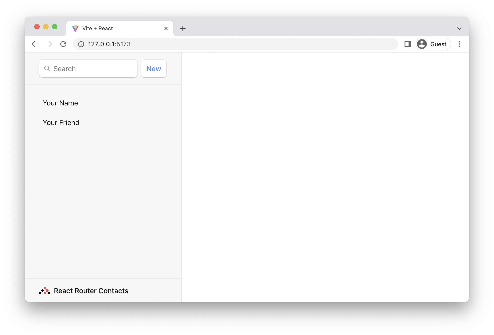

## Обработка ошибок Not Found

Всегда полезно знать, как ваше приложение реагирует на ошибки на ранних этапах проекта, ведь при создании нового приложения мы все пишем гораздо больше ошибок, чем возможностей! Это не только поможет вашим пользователям получить хороший опыт, но и поможет вам в процессе разработки.

Мы добавили несколько ссылок в это приложение, давайте посмотрим, что произойдет, когда мы нажмем на них?

👉 **Нажмите на одно из названий боковой панели**

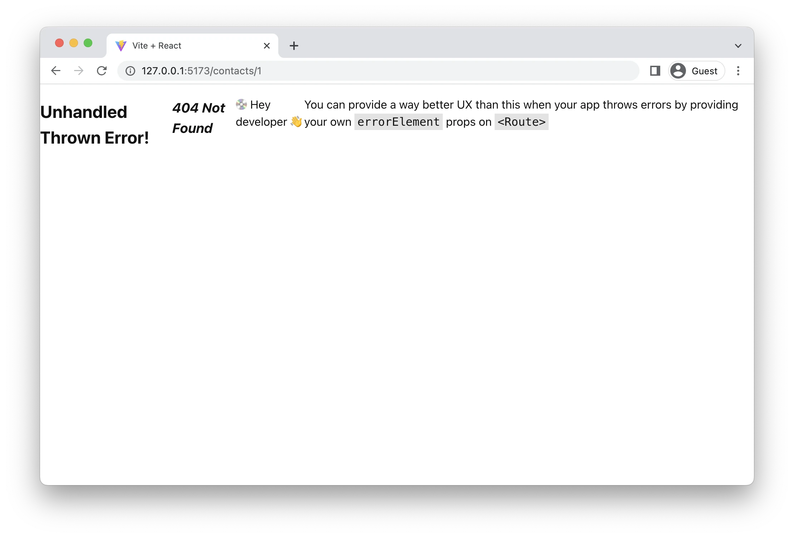

Отвратительно! Это стандартный экран ошибок в React Router, который усугубляется нашими стилями flex box для корневого элемента в этом приложении 😂.

В любой момент, когда ваше приложение выдает ошибку при рендеринге, загрузке данных или их мутации, React Router поймает ее и выдаст экран ошибки. Давайте сделаем собственную страницу ошибок.

👉 **Создать компонент страницы ошибок**

```sh
touch src/error-page.jsx
```

---

```jsx title="src/error-page.jsx"
import { useRouteError } from "react-router-dom";

export default function ErrorPage() {
  const error = useRouteError();
  console.error(error);

  return (
    <div id="error-page">
      <h1>Oops!</h1>
      <p>Sorry, an unexpected error has occurred.</p>
      <p>
        <i>{error.statusText || error.message}</i>
      </p>
    </div>
  );
}
```

👉 **Установите `<ErrorPage>` в качестве [`errorElement`][errorelement] на корневом маршруте**.

```jsx title="src/main.jsx" hl_lines="2 8"
/* previous imports */
import ErrorPage from "./error-page";

const router = createBrowserRouter([
  {
    path: "/",
    element: <Root />,
    errorElement: <ErrorPage />,
  },
]);

ReactDOM.createRoot(document.getElementById("root")).render(
  <React.StrictMode>
    <RouterProvider router={router} />
  </React.StrictMode>
);
```

Теперь страница с ошибкой должна выглядеть следующим образом:

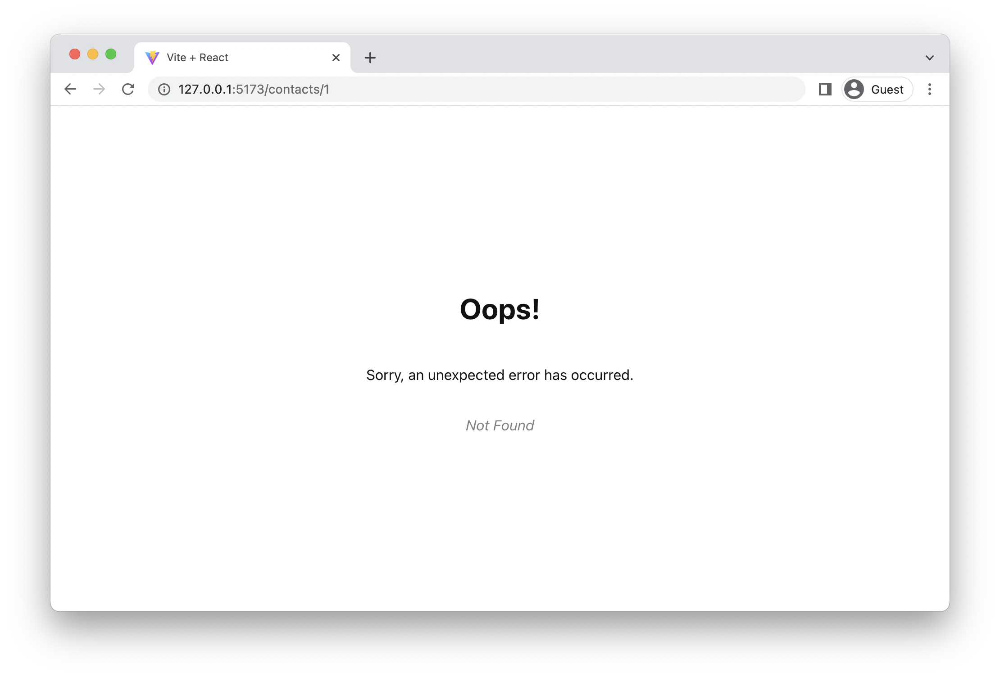

(Ну, это не намного лучше. Может быть, кто-то забыл попросить дизайнера сделать страницу ошибок. Может быть, все забывают попросить дизайнера сделать страницу ошибок, а потом обвиняют дизайнера в том, что он об этом не подумал 😆)

Обратите внимание, что в [`useRouteError`][userouteerror] указывается ошибка, которая была выброшена. Когда пользователь переходит к несуществующим маршрутам, вы получите [error response][isrouteerrorresponse] с текстом `statusText` "Not Found". Другие ошибки мы увидим позже в учебнике и обсудим их подробнее.

Пока же достаточно знать, что практически все ваши ошибки теперь будут обрабатываться этой страницей, а не бесконечными спиннерами, не реагирующими страницами или пустыми экранами 🙌.

## Пользовательский интерфейс контактного маршрута

Вместо страницы 404 "Not Found" мы хотим действительно отображать что-то на URL, на которые мы ссылались. Для этого нам нужно создать новый маршрут.

👉 **Создаем модуль маршрута контакта**

```sh
touch src/routes/contact.jsx
```

👉 **Добавить UI компонента контактов**.

Это просто набор элементов, не стесняйтесь копировать/вставлять.

```jsx title="src/routes/contact.jsx"
import { Form } from "react-router-dom";

export default function Contact() {
  const contact = {
    first: "Your",
    last: "Name",
    avatar: "https://placekitten.com/g/200/200",
    twitter: "your_handle",
    notes: "Some notes",
    favorite: true,
  };

  return (
    <div id="contact">
      <div>
        
      </div>

      <div>
        <h1>
          {contact.first || contact.last ? (
            <>
              {contact.first} {contact.last}
            </>
          ) : (
            <i>No Name</i>
          )}{" "}
          <Favorite contact={contact} />
        </h1>

        {contact.twitter && (
          <p>
            <a
              target="_blank"
              href={`https://twitter.com/${contact.twitter}`}
            >
              {contact.twitter}
            </a>
          </p>
        )}

        {contact.notes && <p>{contact.notes}</p>}

        <div>
          <Form action="edit">
            <button type="submit">Edit</button>
          </Form>
          <Form
            method="post"
            action="destroy"
            onSubmit={(event) => {
              if (
                !confirm(
                  "Please confirm you want to delete this record."
                )
              ) {
                event.preventDefault();
              }
            }}
          >
            <button type="submit">Delete</button>
          </Form>
        </div>
      </div>
    </div>
  );
}

function Favorite({ contact }) {
  // yes, this is a `let` for later
  let favorite = contact.favorite;
  return (
    <Form method="post">
      <button
        name="favorite"
        value={favorite ? "false" : "true"}
        aria-label={
          favorite
            ? "Remove from favorites"
            : "Add to favorites"
        }
      >
        {favorite ? "★" : "☆"}
      </button>
    </Form>
  );
}
```

Теперь, когда у нас есть компонент, давайте подключим его к новому маршруту.

👉 **Импортируем компонент contact и создаем новый маршрут**

```jsx title="src/main.jsx" hl_lines="2 10-13"
/* existing imports */
import Contact from "./routes/contact";

const router = createBrowserRouter([
  {
    path: "/",
    element: <Root />,
    errorElement: <ErrorPage />,
  },
  {
    path: "contacts/:contactId",
    element: <Contact />,
  },
]);

/* existing code */
```

Теперь, если мы щелкнем на одной из ссылок или посетим `/contacts/1`, то получим наш новый компонент!

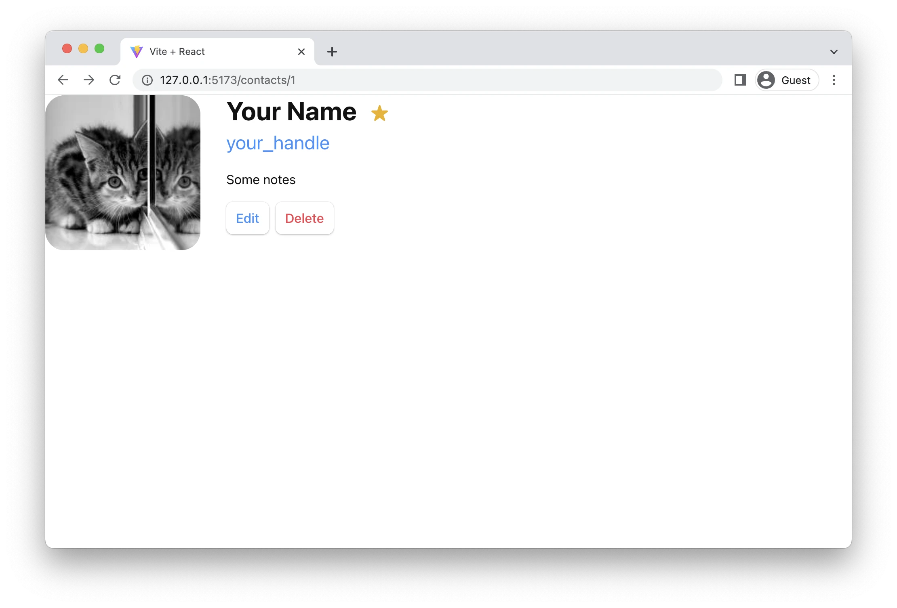

Однако он находится не внутри нашего корневого макета 😠.

## Вложенные маршруты

Мы хотим, чтобы компонент контактов отображался _внутри_ макета `<Root>` следующим образом.

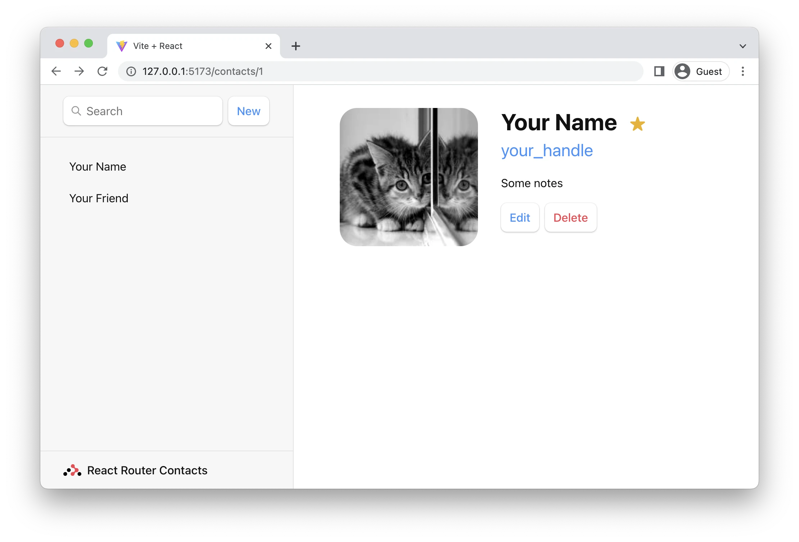

Для этого нужно сделать маршрут контактов _дочерним_ по отношению к корневому маршруту.

👉 **Переместить маршрут контактов в дочернее состояние корневого маршрута**

```jsx title="src/main.jsx" hl_lines="6-11"
const router = createBrowserRouter([
  {
    path: "/",
    element: <Root />,
    errorElement: <ErrorPage />,
    children: [
      {
        path: "contacts/:contactId",
        element: <Contact />,
      },
    ],
  },
]);
```

Теперь вы снова видите корневой макет, но пустую страницу справа. Нам нужно указать корневому маршруту, где он должен отображать свои дочерние маршруты. Мы сделаем это с помощью [`<Outlet>`][outlet].

Найдем `<div id="detail">` и поместим аутлет внутрь

👉 **Рендеринг [`<Outlet>`][outlet]**.

```jsx title="src/routes/root.jsx" hl_lines="1 8"
import { Outlet } from "react-router-dom";

export default function Root() {
  return (
    <>
      {/* all the other elements */}
      <div id="detail">
        <Outlet />
      </div>
    </>
  );
}
```

## Маршрутизация на стороне клиента

Возможно, вы заметили, а возможно, и нет, но когда мы нажимаем на ссылки в боковой панели, браузер выполняет полный запрос документа для получения следующего URL, а не использует React Router.

Маршрутизация на стороне клиента позволяет нашему приложению обновлять URL без запроса другого документа с сервера. Вместо этого приложение может сразу отрисовать новый пользовательский интерфейс. Давайте сделаем это с помощью [`<Link>`][link].

👉 **Изменим боковую панель `<a href>` на `<Link to>`**

```jsx title="src/routes/root.jsx" hl_lines="1 12 15"
import { Outlet, Link } from "react-router-dom";

export default function Root() {
  return (
    <>
      <div id="sidebar">
        {/* other elements */}

        <nav>
          <ul>
            <li>
              <Link to={`contacts/1`}>Your Name</Link>
            </li>
            <li>
              <Link to={`contacts/2`}>Your Friend</Link>
            </li>
          </ul>
        </nav>

        {/* other elements */}
      </div>
    </>
  );
}
```

Вы можете открыть вкладку network в браузере devtools и увидеть, что он больше не запрашивает документы.

## Загрузка данных

Сегменты URL, макеты и данные чаще всего соединены (утроены?) вместе. Мы можем видеть это уже в этом приложении:

| Сегмент URL    | Компонент   | Данные            |
| -------------- | ----------- | ----------------- |
| `/`            | `<Root>`    | список контактов  |
| `contacts/:id` | `<Contact>` | отдельный контакт |

Благодаря этой естественной связи React Router имеет соглашения о данных, позволяющие легко получать данные в компоненты маршрута.

Для загрузки данных мы будем использовать два API: [`loader`][loader] и [`useLoaderData`][useloaderdata]. Сначала мы создадим и экспортируем функцию загрузчика в корневом модуле, затем подключим ее к маршруту. Наконец, мы получим доступ к данным и отрисуем их.

👉 **Экспорт загрузчика из `root.jsx`**

```jsx title="src/routes/root.jsx" hl_lines="2 4-7"
import { Outlet, Link } from "react-router-dom";
import { getContacts } from "../contacts";

export async function loader() {
  const contacts = await getContacts();
  return { contacts };
}
```

👉 **Настройка загрузчика на маршруте**.

```jsx title="src/main.jsx" hl_lines="2 9"
/* other imports */
import Root, { loader as rootLoader } from "./routes/root";

const router = createBrowserRouter([
  {
    path: "/",
    element: <Root />,
    errorElement: <ErrorPage />,
    loader: rootLoader,
    children: [
      {
        path: "contacts/:contactId",
        element: <Contact />,
      },
    ],
  },
]);
```

👉 **Доступ к данным и их визуализация**.

```jsx title="src/routes/root.jsx" hl_lines="4 11 19-40"
import {
  Outlet,
  Link,
  useLoaderData,
} from "react-router-dom";
import { getContacts } from "../contacts";

/* other code */

export default function Root() {
  const { contacts } = useLoaderData();
  return (
    <>
      <div id="sidebar">
        <h1>React Router Contacts</h1>
        {/* other code */}

        <nav>
          {contacts.length ? (
            <ul>
              {contacts.map((contact) => (
                <li key={contact.id}>
                  <Link to={`contacts/${contact.id}`}>
                    {contact.first || contact.last ? (
                      <>
                        {contact.first} {contact.last}
                      </>
                    ) : (
                      <i>No Name</i>
                    )}{" "}
                    {contact.favorite && <span>★</span>}
                  </Link>
                </li>
              ))}
            </ul>
          ) : (
            <p>
              <i>No contacts</i>
            </p>
          )}
        </nav>

        {/* other code */}
      </div>
    </>
  );
}
```

Вот и все! Теперь React Router будет автоматически синхронизировать эти данные с вашим пользовательским интерфейсом. Пока у нас нет никаких данных, поэтому вы, вероятно, получите пустой список, как здесь:


## Запись данных + HTML-формы

Через секунду мы создадим наш первый контакт, но сначала поговорим о HTML.

React Router эмулирует навигацию по HTML-формам как примитив мутации данных, согласно веб-разработке до камбрийского взрыва JavaScript. Это дает вам UX-возможности клиентских приложений с простотой "старой школы" веб-модели.

Хотя некоторые веб-разработчики не знают, что HTML-формы вызывают навигацию в браузере, как и щелчок по ссылке. Единственное различие заключается в запросе: ссылки могут изменять только URL, в то время как формы могут изменять метод запроса (GET или POST) и тело запроса (данные формы POST).

Без маршрутизации на стороне клиента браузер автоматически сериализует данные формы и отправляет их на сервер в виде тела запроса для POST и в виде URLSearchParams для GET. React Router делает то же самое, только вместо отправки запроса на сервер он использует маршрутизацию на стороне клиента и отправляет его по маршруту [`action`][action].

Мы можем проверить это, нажав кнопку "Создать" в нашем приложении. Приложение должно взорваться, поскольку сервер Vite не настроен на обработку POST-запроса (он посылает 404, хотя должен был бы посылать 405 🤷).

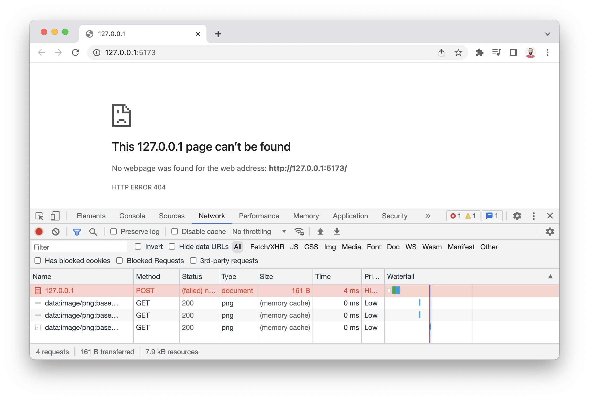

Вместо того чтобы отправлять POST на сервер Vite для создания нового контакта, давайте воспользуемся маршрутизацией на стороне клиента.

## Создание контактов {#creating-contacts}

Мы будем создавать новые контакты, экспортируя `action` в наш корневой маршрут, подключая его к конфигурации маршрута и изменяя нашу `<form>` на React Router [`<Form>`][form].

👉 **Создайте действие и измените `<form>` на `<Form>`**.

```jsx title="src/routes/root.jsx" hl_lines="5 7 9-12 24-26"
import {
  Outlet,
  Link,
  useLoaderData,
  Form,
} from "react-router-dom";
import { getContacts, createContact } from "../contacts";

export async function action() {
  const contact = await createContact();
  return { contact };
}

/* other code */

export default function Root() {
  const { contacts } = useLoaderData();
  return (
    <>
      <div id="sidebar">
        <h1>React Router Contacts</h1>
        <div>
          {/* other code */}
          <Form method="post">
            <button type="submit">New</button>
          </Form>
        </div>

        {/* other code */}
      </div>
    </>
  );
}
```

👉 **Импорт и установка действия на маршруте**.

```jsx title="src/main.jsx" hl_lines="5 14"
/* other imports */

import Root, {
  loader as rootLoader,
  action as rootAction,
} from "./routes/root";

const router = createBrowserRouter([
  {
    path: "/",
    element: <Root />,
    errorElement: <ErrorPage />,
    loader: rootLoader,
    action: rootAction,
    children: [
      {
        path: "contacts/:contactId",
        element: <Contact />,
      },
    ],
  },
]);
```

Вот и все! Нажмите кнопку "Создать", и вы увидите, как в списке появится новая запись 🥳.

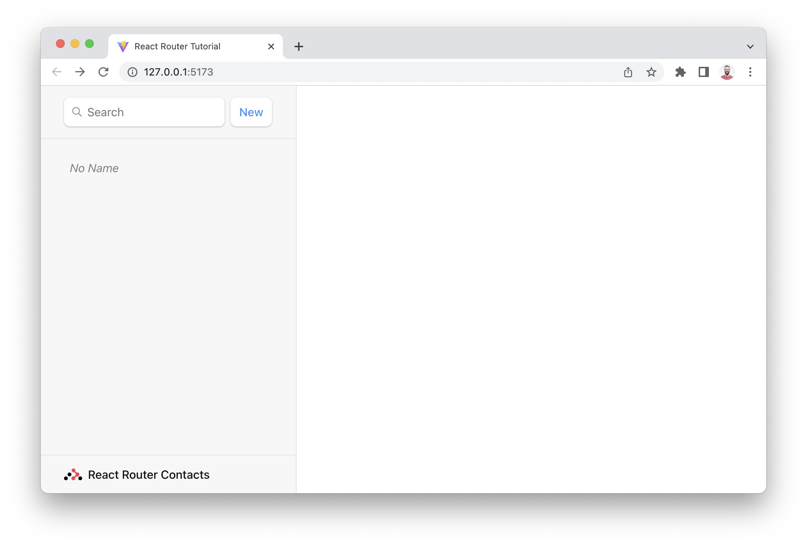

Метод `createContact` просто создает пустой контакт без имени, данных или чего-либо еще. Но он все равно создает запись, обещаю!

🧐 Подождите секунду... Как обновляется боковая панель? Где мы вызвали `action`? Где код для повторной выборки данных? Где `useState`, `onSubmit` и `useEffect`?!

Именно здесь проявляется "старая школа веб-программирования". Как мы уже говорили, [`<Form>`][form] не позволяет браузеру отправлять запрос на сервер и вместо этого посылает его в ваш маршрут `action`. В веб-семантике POST обычно означает изменение некоторых данных. По условию, React Router использует это как подсказку для автоматической проверки данных на странице после завершения действия. Это означает, что все ваши хуки `useLoaderData` обновляются, а пользовательский интерфейс автоматически синхронизируется с данными! Очень здорово.

## URL-параметры в загрузчиках

👉 **Нажмите на запись без имени**.

Мы должны снова увидеть нашу старую статическую страницу контактов с одним отличием: теперь URL-адрес содержит реальный идентификатор записи.

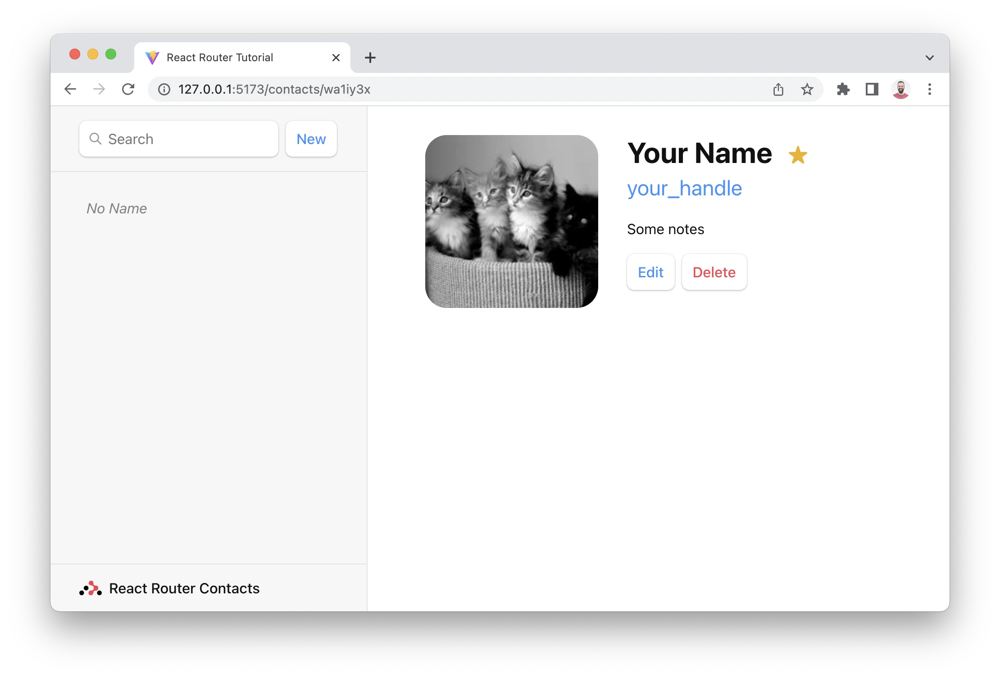

Если просмотреть конфигурацию маршрута, то он выглядит следующим образом:

```jsx
[
    {
        path: 'contacts/:contactId',
        element: <Contact />,
    },
];
```

Обратите внимание на сегмент URL `:contactId`. Двоеточие (`:`) имеет особое значение, превращая его в "динамический сегмент". Динамические сегменты будут соответствовать динамическим (изменяющимся) значениям в данной позиции URL, например, идентификатору контакта. Мы называем эти значения в URL "URL Params", или просто "params" для краткости.

Эти [`params`][params] передаются в загрузчик с ключами, соответствующими динамическому сегменту. Например, наш сегмент имеет имя `:contactId`, поэтому его значение будет передано как `params.contactId`.

Чаще всего эти параметры используются для поиска записи по идентификатору. Давайте попробуем это сделать.

👉 **Добавляем загрузчик на страницу контактов и получаем доступ к данным с помощью `useLoaderData`**

```jsx title="src/routes/contact.jsx" hl_lines="1-2 4-6 10"
import { Form, useLoaderData } from "react-router-dom";
import { getContact } from "../contacts";

export async function loader({ params }) {
  const contact = await getContact(params.contactId);
  return { contact };
}

export default function Contact() {
  const { contact } = useLoaderData();
  // existing code
}
```

👉 **Настройка загрузчика на маршруте**.

```jsx title="src/main.jsx" hl_lines="3 17"
/* existing code */
import Contact, {
  loader as contactLoader,
} from "./routes/contact";

const router = createBrowserRouter([
  {
    path: "/",
    element: <Root />,
    errorElement: <ErrorPage />,
    loader: rootLoader,
    action: rootAction,
    children: [
      {
        path: "contacts/:contactId",
        element: <Contact />,
        loader: contactLoader,
      },
    ],
  },
]);

/* existing code */
```

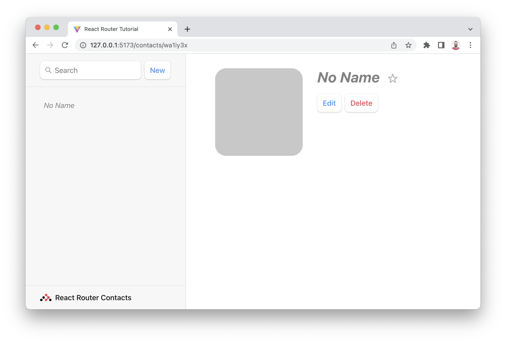

## Обновление данных

Как и при создании данных, обновление данных производится с помощью [`<Form>`][form]. Давайте создадим новый маршрут по адресу `contacts/:contactId/edit`. Опять же, начнем с компонента, а затем подключим его к конфигурации маршрута.

👉 **Создаем компонент edit**

```sh
touch src/routes/edit.jsx
```

👉 **Добавить пользовательский интерфейс страницы редактирования**

Ничего такого, чего бы мы не видели раньше, не стесняйтесь копировать/вставлять:

```jsx title="src/routes/edit.jsx"
import { Form, useLoaderData } from "react-router-dom";

export default function EditContact() {
  const { contact } = useLoaderData();

  return (
    <Form method="post" id="contact-form">
      <p>
        <span>Name</span>
        <input
          placeholder="First"
          aria-label="First name"
          type="text"
          name="first"
          defaultValue={contact.first}
        />
        <input
          placeholder="Last"
          aria-label="Last name"
          type="text"
          name="last"
          defaultValue={contact.last}
        />
      </p>
      <label>
        <span>Twitter</span>
        <input
          type="text"
          name="twitter"
          placeholder="@jack"
          defaultValue={contact.twitter}
        />
      </label>
      <label>
        <span>Avatar URL</span>
        <input
          placeholder="https://example.com/avatar.jpg"
          aria-label="Avatar URL"
          type="text"
          name="avatar"
          defaultValue={contact.avatar}
        />
      </label>
      <label>
        <span>Notes</span>
        <textarea
          name="notes"
          defaultValue={contact.notes}
          rows={6}
        />
      </label>
      <p>
        <button type="submit">Save</button>
        <button type="button">Cancel</button>
      </p>
    </Form>
  );
}
```

👉 **Добавить новый маршрут редактирования**.

```jsx title="src/main.jsx" hl_lines="2 17-21"
/* existing code */
import EditContact from "./routes/edit";

const router = createBrowserRouter([
  {
    path: "/",
    element: <Root />,
    errorElement: <ErrorPage />,
    loader: rootLoader,
    action: rootAction,
    children: [
      {
        path: "contacts/:contactId",
        element: <Contact />,
        loader: contactLoader,
      },
      {
        path: "contacts/:contactId/edit",
        element: <EditContact />,
        loader: contactLoader,
      },
    ],
  },
]);

/* existing code */
```

Мы хотим, чтобы он отображался в аутлете корневого маршрута, поэтому мы сделали его дочерним по отношению к существующему дочернему маршруту.

(Вы можете заметить, что мы повторно использовали `contactLoader` для этого маршрута. Это сделано только потому, что мы ленивы в этом учебнике. Нет смысла пытаться использовать общие загрузчики для маршрутов, они обычно имеют свои собственные.)

Итак, нажав на кнопку "Edit", мы получаем новый пользовательский интерфейс:

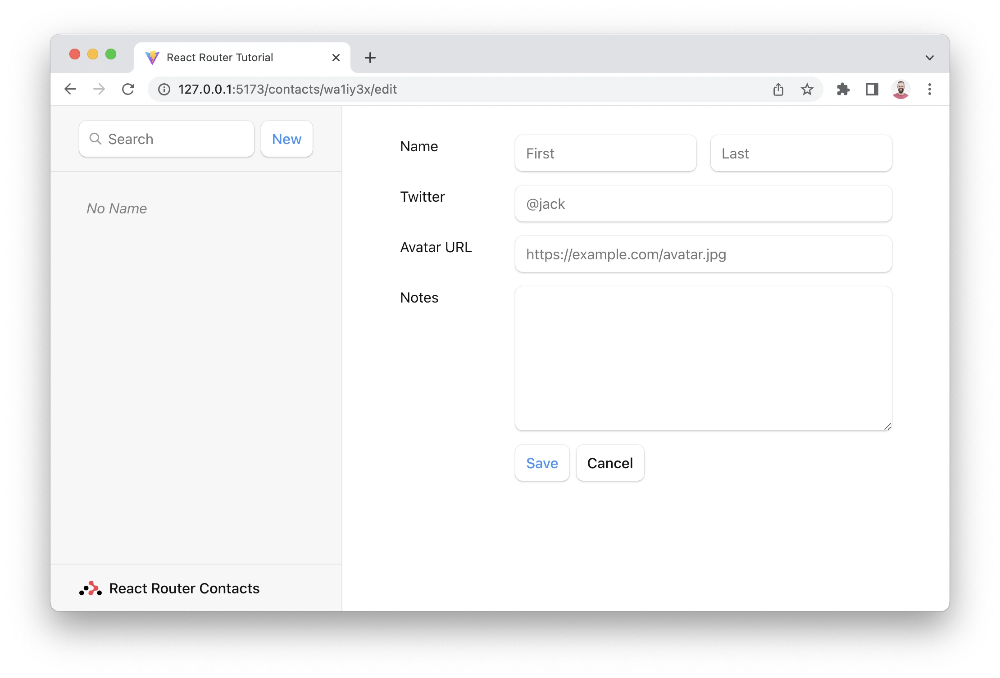

## Обновление контактов с помощью FormData

Маршрут редактирования, который мы только что создали, уже отображает форму. Для обновления записи достаточно подключить к маршруту действие. Форма будет отправлена в действие, и данные будут автоматически перепроверены.

👉 **Добавить действие в модуль редактирования**

```jsx title="src/routes/edit.jsx" hl_lines="4 6 8-13"
import {
  Form,
  useLoaderData,
  redirect,
} from "react-router-dom";
import { updateContact } from "../contacts";

export async function action({ request, params }) {
  const formData = await request.formData();
  const updates = Object.fromEntries(formData);
  await updateContact(params.contactId, updates);
  return redirect(`/contacts/${params.contactId}`);
}

/* existing code */
```

👉 **Привязать действие к маршруту**.

```jsx title="src/main.jsx" hl_lines="3 23"
/* existing code */
import EditContact, {
  action as editAction,
} from "./routes/edit";

const router = createBrowserRouter([
  {
    path: "/",
    element: <Root />,
    errorElement: <ErrorPage />,
    loader: rootLoader,
    action: rootAction,
    children: [
      {
        path: "contacts/:contactId",
        element: <Contact />,
        loader: contactLoader,
      },
      {
        path: "contacts/:contactId/edit",
        element: <EditContact />,
        loader: contactLoader,
        action: editAction,
      },
    ],
  },
]);

/* existing code */
```

Заполните форму, нажмите кнопку сохранить, и вы увидите нечто подобное! Только легче для глаз и, возможно, менее волосато.

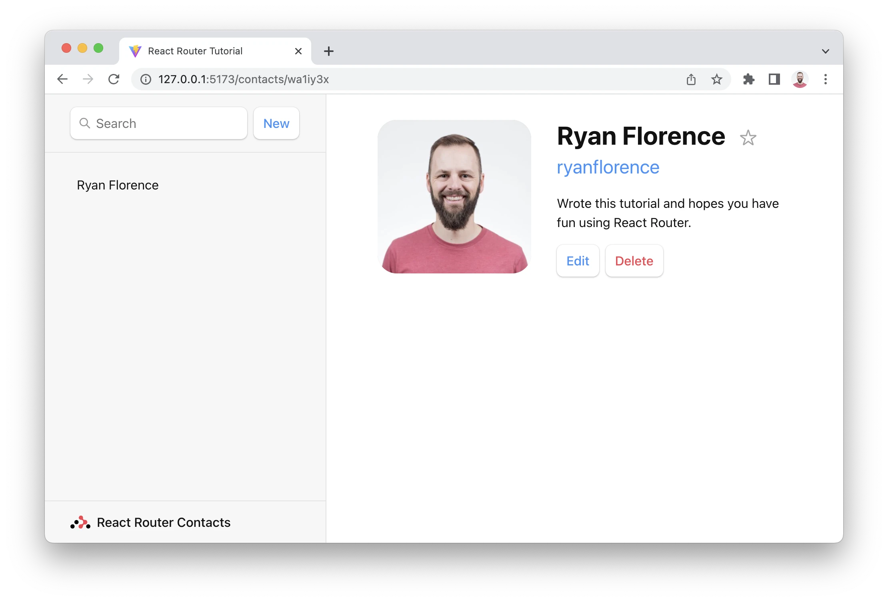

## Обсуждение мутации

😑 Это сработало, но я понятия не имею, что здесь происходит...

Давайте немного покопаемся...

Откройте файл `src/routes/edit.jsx` и посмотрите на элементы формы. Обратите внимание, что у каждого из них есть имя:

```jsx title="src/routes/edit.jsx" hl_lines="5"
<input
  placeholder="First"
  aria-label="First name"
  type="text"
  name="first"
  defaultValue={contact.first}
/>
```

Без JavaScript при отправке формы браузер создаст [`FormData`][formdata] и при отправке запроса на сервер установит его в качестве тела запроса. Как уже упоминалось, React Router предотвращает это и отправляет запрос вашему действию, включая [`FormData`][formdata].

Каждое поле в форме доступно с помощью `formData.get(name)`. Например, для поля ввода, приведенного выше, можно получить доступ к имени и фамилии следующим образом:

```js hl_lines="3-4"
export async function action({ request, params }) {
  const formData = await request.formData();
  const firstName = formData.get("first");
  const lastName = formData.get("last");
  // ...
}
```

Поскольку у нас несколько полей формы, мы использовали [`Object.fromEntries`][fromentries], чтобы собрать их все в объект, что как раз и нужно нашей функции `updateContact`.

```js hl_lines="2-3"
const updates = Object.fromEntries(formData);
updates.first; // "Some"
updates.last; // "Name"
```

Кроме `action`, ни один из рассматриваемых нами API не предоставляется React Router: [`request`][request], [`request.formData`][requestformdata], [`Object.fromEntries`][fromentries] - все они предоставляются веб-платформой.

После того как мы завершили действие, обратите внимание на [`redirect`][redirect] в конце:

```jsx title="src/routes/edit.jsx" hl_lines="5"
export async function action({ request, params }) {
  const formData = await request.formData();
  const updates = Object.fromEntries(formData);
  await updateContact(params.contactId, updates);
  return redirect(`/contacts/${params.contactId}`);
}
```

И загрузчики, и действия могут [возвращать `ответы`][returningresponses] (это логично, ведь они получили [`запрос`][request]!). Помощник [`redirect`][redirect] просто упрощает возврат [response][response], который сообщает приложению о необходимости сменить местоположение.

Без маршрутизации на стороне клиента, если сервер перенаправлялся после POST-запроса, новая страница получала последние данные и отрисовывалась. Как мы уже узнали, React Router эмулирует эту модель и автоматически перепроверяет данные на странице после выполнения действия. Именно поэтому боковая панель автоматически обновляется при сохранении формы. Лишний код повторной проверки не существует без маршрутизации на стороне клиента, поэтому он не нужен и при маршрутизации на стороне клиента!

## Перенаправление новых записей на страницу редактирования

Теперь, когда мы знаем, как перенаправлять, давайте обновим действие, создающее новые контакты, чтобы оно перенаправляло на страницу редактирования:

👉 **Перенаправление на страницу редактирования новой записи**.

```jsx title="src/routes/root.jsx" hl_lines="6 12"
import {
  Outlet,
  Link,
  useLoaderData,
  Form,
  redirect,
} from "react-router-dom";
import { getContacts, createContact } from "../contacts";

export async function action() {
  const contact = await createContact();
  return redirect(`/contacts/${contact.id}/edit`);
}
```

Теперь, когда мы нажимаем кнопку "New", мы должны попасть на страницу редактирования:

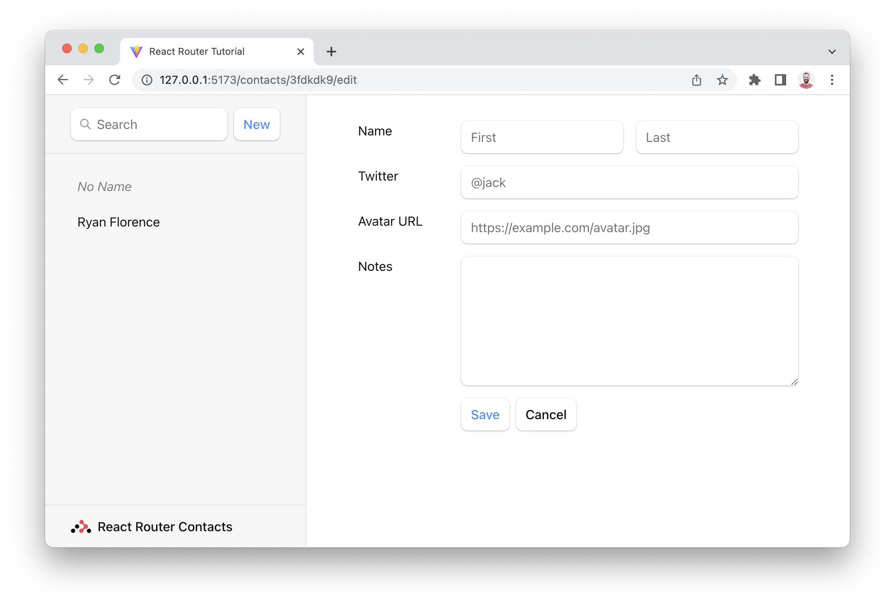

👉 **Добавить горсть записей**.

Я собираюсь использовать звездный состав докладчиков первой конференции Remix Conference 😁.

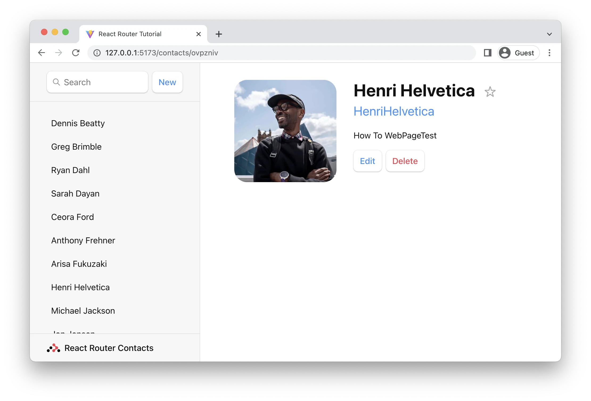

## Стилизация активных ссылок

Теперь, когда у нас есть куча записей, неясно, на какую из них мы смотрим в боковой панели. Чтобы исправить это, мы можем использовать [`NavLink`][navlink].

👉 **Использование `NavLink` в боковой панели**

```jsx title="src/routes/root.jsx" hl_lines="3 20-31"
import {
  Outlet,
  NavLink,
  useLoaderData,
  Form,
  redirect,
} from "react-router-dom";

export default function Root() {
  return (
    <>
      <div id="sidebar">
        {/* other code */}

        <nav>
          {contacts.length ? (
            <ul>
              {contacts.map((contact) => (
                <li key={contact.id}>
                  <NavLink
                    to={`contacts/${contact.id}`}
                    className={({ isActive, isPending }) =>
                      isActive
                        ? "active"
                        : isPending
                        ? "pending"
                        : ""
                    }
                  >
                    {/* other code */}
                  </NavLink>
                </li>
              ))}
            </ul>
          ) : (
            <p>{/* other code */}</p>
          )}
        </nav>
      </div>
    </>
  );
}
```

Обратите внимание, что мы передаем функцию в `className`. Когда пользователь находится на URL в `NavLink`, то `isActive` будет `true`. Когда он только собирается стать активным (данные еще загружаются), `isPending` будет истиной. Это позволяет нам легко указать, где находится пользователь, а также обеспечить немедленную обратную связь со ссылками, которые были нажаты, но еще ожидают загрузки данных.


## Глобальный отложенный пользовательский интерфейс

По мере того как пользователь перемещается по приложению, React Router будет _оставлять старую страницу поднятой_ по мере загрузки данных для следующей страницы. Вы, возможно, заметили, что приложение немного не реагирует на нажатия кнопок в списке. Давайте обеспечим пользователю обратную связь, чтобы приложение не казалось невосприимчивым.

React Router управляет всем состоянием за кулисами и раскрывает его фрагменты, необходимые для создания динамических веб-приложений. В данном случае мы будем использовать хук [`useNavigation`][usenavigation].

👉 **`useNavigation` для добавления глобального отложенного пользовательского интерфейса**

```jsx title="src/routes/root.jsx" hl_lines="3 10 17-19"
import {
  // existing code
  useNavigation,
} from "react-router-dom";

// existing code

export default function Root() {
  const { contacts } = useLoaderData();
  const navigation = useNavigation();

  return (
    <>
      <div id="sidebar">{/* existing code */}</div>
      <div
        id="detail"
        className={
          navigation.state === "loading" ? "loading" : ""
        }
      >
        <Outlet />
      </div>
    </>
  );
}
```

[`useNavigation`][usenavigation] возвращает текущее состояние навигации: оно может быть одним из `"idle" | "submitting" | "loading"`.

В нашем случае мы добавляем класс `"loading"` в основную часть приложения, если оно не простаивает. Затем CSS добавляет красивое затухание после небольшой задержки (чтобы избежать мерцания пользовательского интерфейса при быстрой загрузке). Однако вы можете сделать все, что угодно, например, показать спиннер или полосу загрузки сверху.

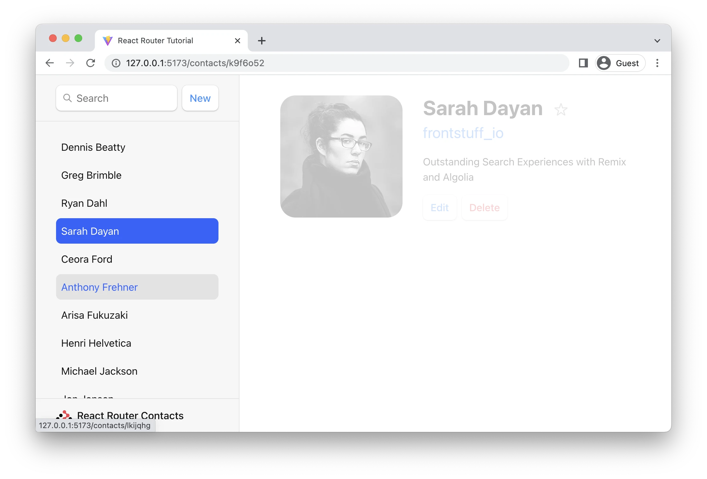

Обратите внимание, что наша модель данных (`src/contacts.js`) имеет клиентский кэш, поэтому переход к одному и тому же контакту происходит быстро и во второй раз. Такое поведение - это не React Router, он будет заново загружать данные при изменении маршрута независимо от того, были ли вы там раньше или нет. Однако это позволяет избежать вызова загрузчиков для _изменяющихся_ маршрутов (например, списка) во время навигации.

## Удаление записей

Если просмотреть код маршрута контактов, то можно обнаружить, что кнопка удаления выглядит следующим образом:

```jsx title="src/routes/contact.jsx" hl_lines="3"
<Form
  method="post"
  action="destroy"
  onSubmit={(event) => {
    if (
      !confirm(
        "Please confirm you want to delete this record."
      )
    ) {
      event.preventDefault();
    }
  }}
>
  <button type="submit">Delete</button>
</Form>
```

Обратите внимание, что `action` указывает на `"destroy"`. Как и `<Link to>`, `<Form action>` может принимать _относительное_ значение. Поскольку форма отображается в `contact/:contactId`, то относительное действие с `destroy` при щелчке отправит форму в `contact/:contactId/destroy`.

На этом этапе вы должны знать все, что нужно для работы кнопки удаления. Может быть, стоит попробовать, прежде чем двигаться дальше? Вам потребуется:

1.  Новый маршрут
2.  Действие на этом маршруте
3.  `deleteContact` из `src/contacts.js`.

👉 **Создание модуля маршрута "уничтожить "**

```sh
touch src/routes/destroy.jsx
```

👉 **Добавить действие уничтожения**

```jsx title="src/routes/destroy.jsx"
import { redirect } from "react-router-dom";
import { deleteContact } from "../contacts";

export async function action({ params }) {
  await deleteContact(params.contactId);
  return redirect("/");
}
```

👉 **Добавить маршрут уничтожения в конфигурацию маршрутов**.

```jsx title="src/main.jsx" hl_lines="2 10-13"
/* existing code */
import { action as destroyAction } from "./routes/destroy";

const router = createBrowserRouter([
  {
    path: "/",
    /* existing root route props */
    children: [
      /* existing routes */
      {
        path: "contacts/:contactId/destroy",
        action: destroyAction,
      },
    ],
  },
]);

/* existing code */
```

Итак, перейдите к записи и нажмите кнопку "Удалить". Работает!

😅 Я все еще не понимаю, почему это все работает.

Когда пользователь нажимает на кнопку отправки:

1.  `<Form>` предотвращает стандартное поведение браузера, посылающего новый POST-запрос на сервер, а вместо этого эмулирует браузер, создавая POST-запрос с маршрутизацией на стороне клиента

2.  Команда `<Form action="destroy">` сопоставляет новый маршрут по адресу `"contacts/:contactId/destroy"` и отправляет ему запрос.

3.  После перенаправления действия React Router вызывает все загрузчики данных на странице, чтобы получить последние значения (это и есть "ревалидация"). Функция `useLoaderData` возвращает новые значения и заставляет компоненты обновляться!

Добавьте форму, добавьте действие, React Router сделает все остальное.

## Контекстные ошибки

Просто для интереса, бросьте ошибку в действие destroy:

```jsx title="src/routes/destroy.jsx" hl_lines="2"
export async function action({ params }) {
  throw new Error("oh dang!");
  await deleteContact(params.contactId);
  return redirect("/");
}
```

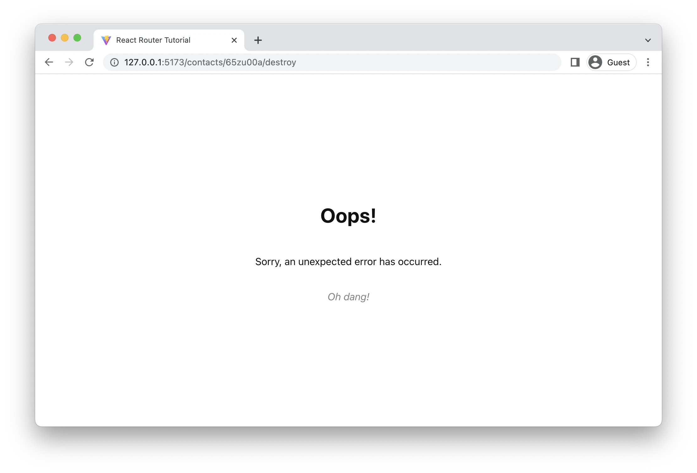

Узнаете этот экран? Это наш предыдущий [`errorElement`][errorelement]. Однако пользователь не может ничего сделать, чтобы вернуться к этому экрану, кроме как нажать кнопку refresh.

Давайте создадим контекстное сообщение об ошибке для маршрута уничтожения:

```jsx title="src/main.jsx" hl_lines="6"
[
  /* other routes */
  {
    path: "contacts/:contactId/destroy",
    action: destroyAction,
    errorElement: <div>Oops! There was an error.</div>,
  },
];
```

Теперь попробуйте еще раз:

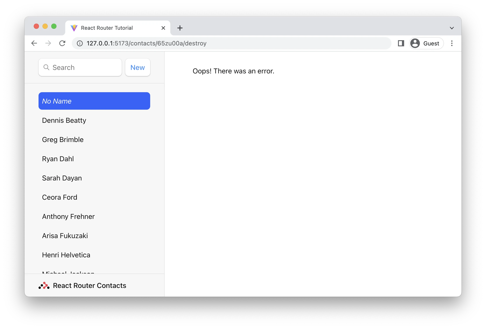

Теперь у нашего пользователя есть больше возможностей, чем нажатие кнопки refresh, он может продолжать взаимодействовать с теми частями страницы, которые не вызывают проблем 🙌.

Поскольку маршрут уничтожения имеет собственный `errorElement` и является дочерним по отношению к корневому маршруту, ошибка будет отображаться там, а не в корне. Как вы, вероятно, заметили, эти ошибки всплывают до ближайшего `errorElement`. Добавляйте их сколько угодно и как угодно мало, лишь бы они были в корне.

## Индексные маршруты

Когда мы загрузим приложение, вы заметите большую пустую страницу в правой части нашего списка.

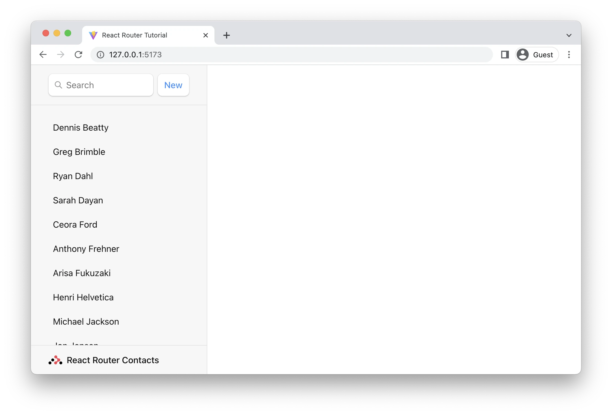

Когда у маршрута есть дочерние маршруты, и вы находитесь на пути родительского маршрута, то `<Outlet>` нечего отображать, поскольку нет ни одного дочернего маршрута. Индексные маршруты можно рассматривать как дочерние маршруты по умолчанию, заполняющие это пространство.

👉 **Создание модуля индексного маршрута**

```
touch src/routes/index.jsx
```

👉 **Заполнить элементы компонента index**.

Не стесняйтесь копировать-вставлять, ничего особенного здесь нет.

```jsx title="src/routes/index.jsx"
export default function Index() {
  return (
    <p id="zero-state">
      This is a demo for React Router.
      <br />
      Check out{" "}
      <a href="https://reactrouter.com">
        the docs at reactrouter.com
      </a>
      .
    </p>
  );
}
```

👉 **Настройка индексного маршрута**.

```jsx title="src/main.jsx" hl_lines="2 12"
// existing code
import Index from "./routes/index";

const router = createBrowserRouter([
  {
    path: "/",
    element: <Root />,
    errorElement: <ErrorPage />,
    loader: rootLoader,
    action: rootAction,
    children: [
      { index: true, element: <Index /> },
      /* existing routes */
    ],
  },
]);
```

Обратите внимание на [`{ index:true }`][index] вместо [`{ path: "" }`][path]. Это указывает маршрутизатору на то, что этот маршрут будет соответствовать и отображаться, когда пользователь находится на точном пути родительского маршрута, поэтому в `<Outlet>` нет других дочерних маршрутов для отображения.

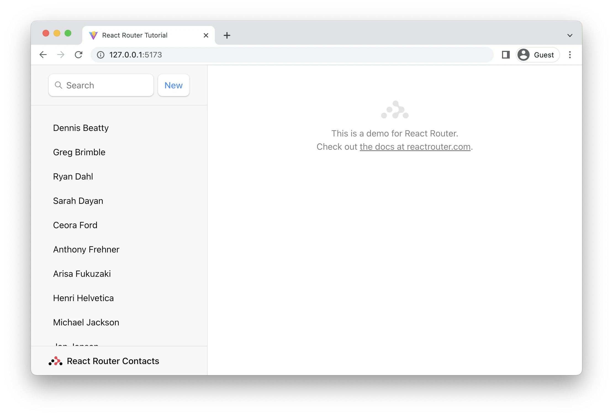

Вуаля! Больше нет пустого места. На индексных маршрутах принято размещать панели управления, статистику, ленты и т.д. Они также могут участвовать в загрузке данных.

## Кнопка отмены

На странице редактирования у нас есть кнопка отмены, которая пока ничего не делает. Мы хотим, чтобы она выполняла те же действия, что и кнопка "Назад" в браузере.

Для этого нам понадобится обработчик нажатия на кнопку, а также [`useNavigate`][usenavigate] из React Router.

👉 **Добавьте обработчик нажатия на кнопку отмены с помощью `useNavigate`**

```jsx title="src/routes/edit.jsx" hl_lines="5 10 20-22"
import {
  Form,
  useLoaderData,
  redirect,
  useNavigate,
} from "react-router-dom";

export default function EditContact() {
  const { contact } = useLoaderData();
  const navigate = useNavigate();

  return (
    <Form method="post" id="contact-form">
      {/* existing code */}

      <p>
        <button type="submit">Save</button>
        <button
          type="button"
          onClick={() => {
            navigate(-1);
          }}
        >
          Cancel
        </button>
      </p>
    </Form>
  );
}
```

Теперь при нажатии кнопки "Отмена" пользователь будет возвращаться на одну запись в истории браузера.

🧐 Почему на кнопке нет `event.preventDefault`?

Кнопка `<button type="button">`, хотя и кажется излишней, является HTML-средством, позволяющим предотвратить отправку формы кнопкой.

Осталось еще две функции. Мы выходим на финишную прямую!

## Параметры поиска URL и GET-запросы

Все наши интерактивные пользовательские интерфейсы до сих пор были либо ссылками, изменяющими URL, либо формами, отправляющими данные в действия. Поле поиска интересно тем, что представляет собой смесь того и другого: это форма, но она изменяет только URL, не изменяя данных.

Сейчас это обычная HTML `<form>`, а не React Router `<Form>`. Давайте посмотрим, что браузер делает с ней по умолчанию:

👉 **Введите имя в поле поиска и нажмите клавишу Enter**.

Обратите внимание, что URL браузера теперь содержит ваш запрос в виде [URLSearchParams][urlsearchparams]:

```
http://127.0.0.1:5173/?q=ryan
```

Если мы рассмотрим форму поиска, то она выглядит следующим образом:

```jsx title="src/routes/root.jsx" hl_lines="1 7"
<form id="search-form" role="search">
  <input
    id="q"
    aria-label="Search contacts"
    placeholder="Search"
    type="search"
    name="q"
  />
  <div id="search-spinner" aria-hidden hidden={true} />
  <div className="sr-only" aria-live="polite"></div>
</form>
```

Как мы уже видели, браузеры могут сериализовать формы по атрибуту `name` элементов ввода. Имя этого элемента ввода - `q`, поэтому URL имеет вид `?q=`. Если бы мы назвали его `search`, то URL был бы `?search=`.

Обратите внимание, что эта форма отличается от других, которые мы использовали, тем, что в ней нет `<form method="post">`. По умолчанию используется `метод` `"get"`. Это означает, что когда браузер создает запрос на следующий документ, он помещает данные формы не в тело POST-запроса, а в [`URLSearchParams`][urlsearchparams] GET-запроса.

## GET-запросы с маршрутизацией на стороне клиента

Давайте используем маршрутизацию на стороне клиента для отправки формы и фильтрации списка в существующем загрузчике.

👉 **Измените `<form>` на `<Form>`**.

```jsx title="src/routes/root.jsx" hl_lines="1 11"
<Form id="search-form" role="search">
  <input
    id="q"
    aria-label="Search contacts"
    placeholder="Search"
    type="search"
    name="q"
  />
  <div id="search-spinner" aria-hidden hidden={true} />
  <div className="sr-only" aria-live="polite"></div>
</Form>
```

👉 **Фильтровать список при наличии URLSearchParams**.

```jsx title="src/routes/root.jsx" hl_lines="1-4"
export async function loader({ request }) {
  const url = new URL(request.url);
  const q = url.searchParams.get("q");
  const contacts = await getContacts(q);
  return { contacts };
}
```

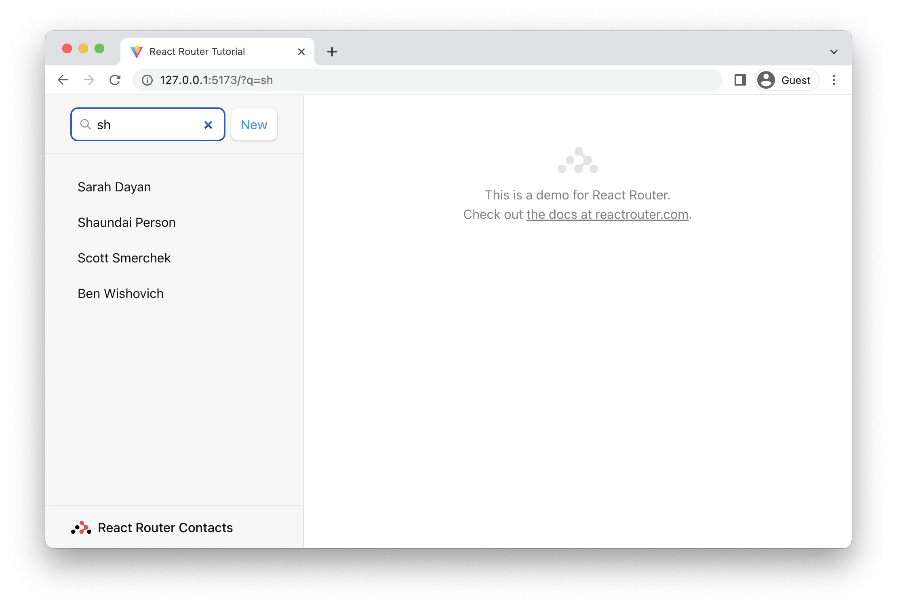

Поскольку это GET, а не POST, React Router _не_ вызывает `action`. Отправка GET-формы - это то же самое, что и щелчок по ссылке: меняется только URL. Поэтому код, который мы добавили для фильтрации, находится в `loader`, а не в `action` этого маршрута.

Это также означает, что это обычная постраничная навигация. Вы можете нажать кнопку "Назад", чтобы вернуться к тому, на чем остановились.

## Синхронизация URL-адресов с состоянием формы

Здесь есть несколько UX-проблем, которые мы можем быстро решить.

1.  Если после поиска щелкнуть на кнопке "Назад", то в поле формы останется введенное значение, хотя список больше не фильтруется.

2.  Если обновить страницу после поиска, то в поле формы больше не будет введенного значения, хотя список отфильтрован.

Другими словами, URL и состояние нашей формы рассинхронизированы.

👉 **Возвратите `q` из вашего загрузчика и установите его в качестве значения по умолчанию для поля поиска**

```jsx title="src/routes/root.jsx" hl_lines="7 11 26"
// existing code

export async function loader({ request }) {
  const url = new URL(request.url);
  const q = url.searchParams.get("q");
  const contacts = await getContacts(q);
  return { contacts, q };
}

export default function Root() {
  const { contacts, q } = useLoaderData();
  const navigation = useNavigation();

  return (
    <>
      <div id="sidebar">
        <h1>React Router Contacts</h1>
        <div>
          <Form id="search-form" role="search">
            <input
              id="q"
              aria-label="Search contacts"
              placeholder="Search"
              type="search"
              name="q"
              defaultValue={q}
            />
            {/* existing code */}
          </Form>
          {/* existing code */}
        </div>
        {/* existing code */}
      </div>
      {/* existing code */}
    </>
  );
}
```

Это решает проблему (2). Если теперь обновить страницу, то в поле ввода появится запрос.


Теперь о проблеме (1) - нажатии кнопки "Назад" и обновлении ввода. Мы можем привнести `useEffect` из React, чтобы напрямую манипулировать состоянием формы в DOM.

👉 **Синхронизация значения ввода с параметрами поиска URL**

```jsx title="src/routes/root.jsx" hl_lines="1 9-11"
import { useEffect } from "react";

// existing code

export default function Root() {
  const { contacts, q } = useLoaderData();
  const navigation = useNavigation();

  useEffect(() => {
    document.getElementById("q").value = q;
  }, [q]);

  // existing code
}
```

🤔 Не лучше ли использовать для этого управляемый компонент и React State?

Конечно, можно сделать это в виде управляемого компонента, но в итоге получится больше сложностей для того же поведения. Вы не управляете URL, это делает пользователь с помощью кнопок назад/вперед. В управляемом компоненте будет больше точек синхронизации.

!!!note "Если вас все еще беспокоит этот вопрос, разверните его, чтобы увидеть, как это будет выглядеть"

    Обратите внимание, что для управления входом теперь требуется три точки синхронизации, а не одна. Поведение идентично, но код стал сложнее.

    ```jsx title="src/routes/root.jsx" hl_lines="1 6 15 18-20 34-37"
    import { useEffect, useState } from "react";
    // existing code

    export async function loader({ request }) {
      const url = new URL(request.url);
      const q = url.searchParams.get("q") || "";
      const contacts = await getContacts(q);
      return { contacts, q };
    }

    // existing code

    export default function Root() {
      const { contacts, q } = useLoaderData();
      const [query, setQuery] = useState(q);
      const navigation = useNavigation();

      useEffect(() => {
        setQuery(q);
      }, [q]);

      return (
        <>
          <div id="sidebar">
            <h1>React Router Contacts</h1>
            <div>
              <Form id="search-form" role="search">
                <input
                  id="q"
                  aria-label="Search contacts"
                  placeholder="Search"
                  type="search"
                  name="q"
                  value={query}
                  onChange={(e) => {
                    setQuery(e.target.value);
                  }}
                />
                {/* existing code */}
              </Form>
              {/* existing code */}
            </div>
            {/* existing code */}
          </div>
        </>
      );
    }
    ```

## Отправка форм `onChange`

Здесь нам предстоит принять решение по продукту. Для данного пользовательского интерфейса мы, вероятно, предпочли бы, чтобы фильтрация происходила при каждом нажатии клавиши, а не при явном отправлении формы.

Мы уже видели `useNavigate`, для этого воспользуемся его родственником, [`useSubmit`][usesubmit].

```jsx title="src/routes/root.jsx" hl_lines="4 10 25-27"
// existing code
import {
  // existing code
  useSubmit,
} from "react-router-dom";

export default function Root() {
  const { contacts, q } = useLoaderData();
  const navigation = useNavigation();
  const submit = useSubmit();

  return (
    <>
      <div id="sidebar">
        <h1>React Router Contacts</h1>
        <div>
          <Form id="search-form" role="search">
            <input
              id="q"
              aria-label="Search contacts"
              placeholder="Search"
              type="search"
              name="q"
              defaultValue={q}
              onChange={(event) => {
                submit(event.currentTarget.form);
              }}
            />
            {/* existing code */}
          </Form>
          {/* existing code */}
        </div>
        {/* existing code */}
      </div>
      {/* existing code */}
    </>
  );
}
```

Теперь при вводе текста форма отправляется автоматически!

Обратите внимание на аргумент [`submit`][usesubmit]. Мы передаем `event.currentTarget.form`. `currentTarget` - это узел DOM, к которому привязано событие, а `currentTarget.form` - родительский узел формы ввода. Функция `submit` сериализует и отправляет любую переданную ей форму.

## Добавление поискового спиннера

В производственном приложении поиск, скорее всего, будет искать записи в базе данных, которая слишком велика, чтобы отправлять их все сразу и фильтровать на стороне клиента. Именно поэтому в демонстрационном варианте присутствует некоторая имитация сетевой задержки.

Без какого-либо индикатора загрузки поиск выглядит довольно вялым. Даже если бы мы могли сделать нашу базу данных быстрее, нам всегда будет мешать сетевая задержка пользователя, которую мы не можем контролировать. Чтобы улучшить UX, давайте добавим немедленную обратную связь для поиска. Для этого мы снова используем [`useNavigation`][usenavigation].

👉 **Добавляем крутилку поиска**

```jsx title="src/routes/root.jsx" hl_lines="8-12 26 32"
// existing code

export default function Root() {
  const { contacts, q } = useLoaderData();
  const navigation = useNavigation();
  const submit = useSubmit();

  const searching =
    navigation.location &&
    new URLSearchParams(navigation.location.search).has(
      "q"
    );

  useEffect(() => {
    document.getElementById("q").value = q;
  }, [q]);

  return (
    <>
      <div id="sidebar">
        <h1>React Router Contacts</h1>
        <div>
          <Form id="search-form" role="search">
            <input
              id="q"
              className={searching ? "loading" : ""}
              // existing code
            />
            <div
              id="search-spinner"
              aria-hidden
              hidden={!searching}
            />
            {/* existing code */}
          </Form>
          {/* existing code */}
        </div>
        {/* existing code */}
      </div>
      {/* existing code */}
    </>
  );
}
```


Значение `navigation.location` появляется, когда приложение переходит на новый URL и загружает данные для него. Затем он исчезает, когда навигация больше не выполняется.

## Управление стеком истории

Теперь, когда форма отправляется на каждое нажатие клавиши, если мы напечатаем символ "seba", а затем удалим его с помощью backspace, то в стеке появится 7 новых записей 😂. Нам это точно не нужно

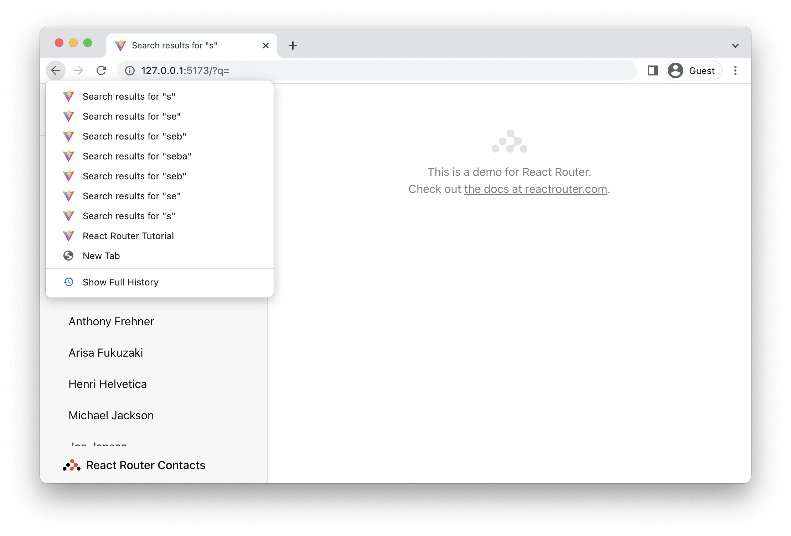

Мы можем избежать этого, если будем _замещать_ текущую запись в стеке истории на следующую страницу, а не проталкивать в нее.

👉 **Использование `replace` в `submit`**

```jsx title="src/routes/root.jsx" hl_lines="16-19"
// existing code

export default function Root() {
  // existing code

  return (
    <>
      <div id="sidebar">
        <h1>React Router Contacts</h1>
        <div>
          <Form id="search-form" role="search">
            <input
              id="q"
              // existing code
              onChange={(event) => {
                const isFirstSearch = q == null;
                submit(event.currentTarget.form, {
                  replace: !isFirstSearch,
                });
              }}
            />
            {/* existing code */}
          </Form>
          {/* existing code */}
        </div>
        {/* existing code */}
      </div>
      {/* existing code */}
    </>
  );
}
```

Мы хотим заменить только результаты поиска, а не страницу до начала поиска, поэтому мы делаем быструю проверку, является ли это первым поиском или нет, и затем принимаем решение о замене.

Каждое нажатие клавиши больше не создает новых записей, поэтому пользователь может вернуться из результатов поиска без необходимости нажимать на нее 7 раз 😅.

## Мутации без навигации

До сих пор во всех наших мутациях (изменениях данных) использовались формы с навигацией, создающие новые записи в стеке истории. Хотя такие пользовательские потоки встречаются довольно часто, не менее часто возникает желание изменить данные _без_ навигации.

Для таких случаев у нас есть хук [`useFetcher`][usefetcher]. Он позволяет нам взаимодействовать с загрузчиками и экшенами, не вызывая навигации.

Кнопка ★ на странице контактов имеет для этого смысл. Мы не создаем и не удаляем новую запись, мы не хотим менять страницы, мы просто хотим изменить данные на странице, которую мы просматриваем.

👉 **Измените форму `<Favorite>` на форму поиска**

```jsx title="src/routes/contact.jsx" hl_lines="4 10 14 26"
import {
  useLoaderData,
  Form,
  useFetcher,
} from "react-router-dom";

// existing code

function Favorite({ contact }) {
  const fetcher = useFetcher();
  let favorite = contact.favorite;

  return (
    <fetcher.Form method="post">
      <button
        name="favorite"
        value={favorite ? "false" : "true"}
        aria-label={
          favorite
            ? "Remove from favorites"
            : "Add to favorites"
        }
      >
        {favorite ? "★" : "☆"}
      </button>
    </fetcher.Form>
  );
}
```

Возможно, стоит взглянуть на эту форму, пока мы здесь. Как обычно, наша форма содержит поля с параметром `name`. Эта форма отправит [`formData`][formdata] с ключом `favorite`, который является либо `"true" | "false"`. Поскольку у нее есть `method="post"`, она вызовет действие. Поскольку нет реквизита `<fetcher.Form action="...">`, он будет отправлен на маршрут, где отображается форма.

👉 **Создание действия**

```jsx title="src/routes/contact.jsx" hl_lines="2 4-9"
// existing code
import { getContact, updateContact } from "../contacts";

export async function action({ request, params }) {
  let formData = await request.formData();
  return updateContact(params.contactId, {
    favorite: formData.get("favorite") === "true",
  });
}

export default function Contact() {
  // existing code
}
```

Довольно просто. Извлеките данные формы из запроса и отправьте их в модель данных.

👉 **Конфигурируем новое действие маршрута**

```jsx title="src/main.jsx" hl_lines="4 20"
// existing code
import Contact, {
  loader as contactLoader,
  action as contactAction,
} from "./routes/contact";

const router = createBrowserRouter([
  {
    path: "/",
    element: <Root />,
    errorElement: <ErrorPage />,
    loader: rootLoader,
    action: rootAction,
    children: [
      { index: true, element: <Index /> },
      {
        path: "contacts/:contactId",
        element: <Contact />,
        loader: contactLoader,
        action: contactAction,
      },
      /* existing code */
    ],
  },
]);
```

Итак, мы готовы нажать на звездочку рядом с именем пользователя!

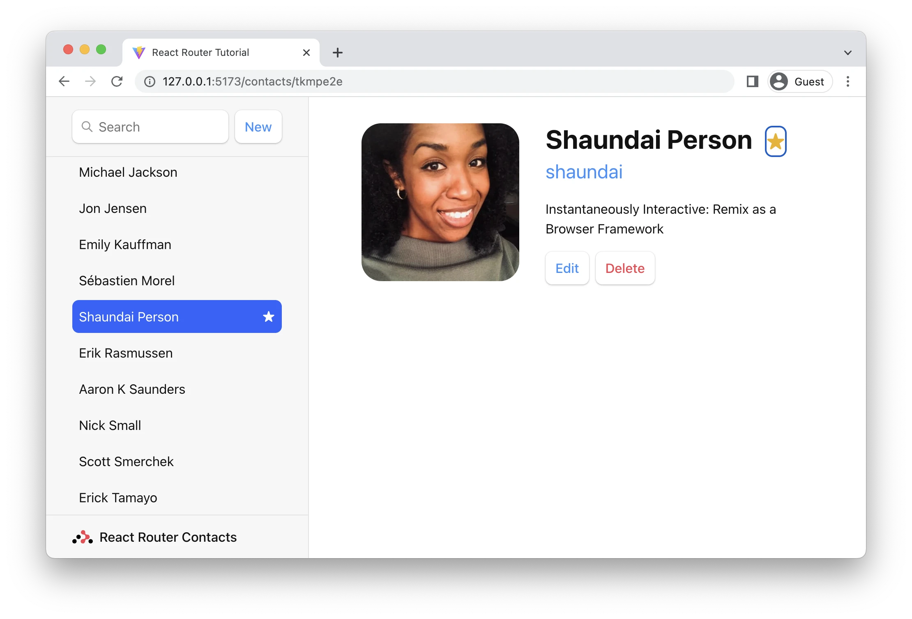

Проверьте, обе звезды автоматически обновляются. Наша новая `<fetcher.Form method="post">` работает почти так же, как и `<Form>`, которую мы использовали раньше: она вызывает действие, а затем все данные автоматически перепроверяются - даже ошибки будут отлавливаться точно так же.

Однако есть одно ключевое отличие: это не навигация - URL не меняется, стек истории не затрагивается.

## Оптимистичный пользовательский интерфейс

Вы, вероятно, заметили, что приложение не реагирует на нажатие кнопки "Избранное" из предыдущего раздела. Мы снова добавили некоторую сетевую задержку, потому что в реальном мире она будет иметь место!

Чтобы дать пользователю обратную связь, мы можем перевести звезду в состояние загрузки с помощью [`fetcher.state`][fetcherstate] (очень похоже на `navigation.state` из предыдущего раздела), но в этот раз мы можем сделать кое-что еще лучше. Мы можем использовать стратегию, называемую "оптимистичным UI".

Фетчеру известны данные формы, отправляемые в действие, поэтому они доступны в `fetcher.formData`. Мы будем использовать это для немедленного обновления состояния звезды, даже если сеть еще не завершила работу. Если обновление в итоге не произойдет, то пользовательский интерфейс вернется к реальным данным.

👉 **Считываем оптимистичное значение из `fetcher.formData`**

```jsx title="src/routes/contact.jsx" hl_lines="7-9"
// existing code

function Favorite({ contact }) {
  const fetcher = useFetcher();

  let favorite = contact.favorite;
  if (fetcher.formData) {
    favorite = fetcher.formData.get("favorite") === "true";
  }

  return (
    <fetcher.Form method="post">
      <button
        name="favorite"
        value={favorite ? "false" : "true"}
        aria-label={
          favorite
            ? "Remove from favorites"
            : "Add to favorites"
        }
      >
        {favorite ? "★" : "☆"}
      </button>
    </fetcher.Form>
  );
}
```

Если теперь нажать на кнопку, то можно увидеть, как звезда _мгновенно_ переходит в новое состояние. Вместо того чтобы постоянно отображать фактические данные, мы проверяем, не отправляются ли в fetcher какие-либо `formData`, и если да, то используем их. Когда действие будет выполнено, `fetcher.formData` перестанет существовать, и мы вернемся к использованию фактических данных. Таким образом, даже если в оптимистичном коде пользовательского интерфейса будут допущены ошибки, в конечном итоге он вернется к правильному состоянию 🥹.

## Not Found Data

Что произойдет, если контакт, который мы пытаемся загрузить, не существует?


Наш корень [`errorElement`][errorelement] ловит эту неожиданную ошибку, когда мы пытаемся вывести контакт `null`. Хорошо, что ошибка была правильно обработана, но мы можем добиться большего!

Когда в загрузчике или действии возникает ожидаемая ошибка, например, несуществующие данные, можно `throw`. Стек вызовов сломается, React Router поймает его, и вместо него будет отрисован путь ошибки. Мы даже не будем пытаться отрисовать `null` контакт.

👉 **Выбросить ответ 404 в загрузчик**

```jsx title="src/routes/contact.jsx" hl_lines="2-9"
export async function loader({ params }) {
  const contact = await getContact(params.contactId);
  if (!contact) {
    throw new Response("", {
      status: 404,
      statusText: "Not Found",
    });
  }
  return { contact };
}
```

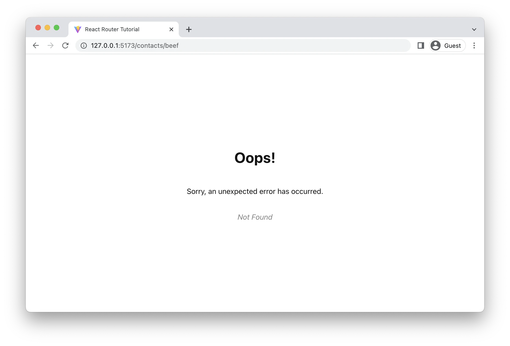

Вместо того чтобы выдать ошибку рендеринга `Cannot read properties of null`, мы полностью избегаем этого компонента и вместо него выводим путь ошибки, сообщая пользователю что-то более конкретное.

Таким образом, ваши счастливые пути остаются счастливыми. Элементам маршрута не нужно беспокоиться об ошибках и состояниях загрузки.

## Беспутевые маршруты

И последнее. Последняя страница с ошибкой, которую мы видели, была бы лучше, если бы она выводилась внутри корневого аутлета, а не на всю страницу. На самом деле, все ошибки во всех наших дочерних маршрутах лучше выводить в аутлете, тогда у пользователя будет больше возможностей, чем просто нажать кнопку refresh.

Мы хотели бы, чтобы это выглядело следующим образом:

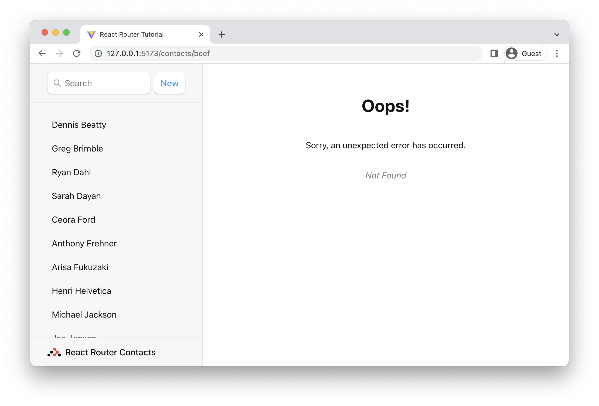

Мы могли бы добавить элемент error в каждый из дочерних маршрутов, но, поскольку речь идет об одной и той же странице ошибки, делать это не рекомендуется.

Есть более чистый способ. Маршруты можно использовать _без_ пути, что позволяет им участвовать в компоновке пользовательского интерфейса, не требуя новых сегментов пути в URL. Посмотрите:

👉 **Вернуть дочерние маршруты в маршрут без пути**

```jsx title="src/main.jsx" hl_lines="9-21"
createBrowserRouter([
  {
    path: "/",
    element: <Root />,
    loader: rootLoader,
    action: rootAction,
    errorElement: <ErrorPage />,
    children: [
      {
        errorElement: <ErrorPage />,
        children: [
          { index: true, element: <Index /> },
          {
            path: "contacts/:contactId",
            element: <Contact />,
            loader: contactLoader,
            action: contactAction,
          },
          /* the rest of the routes */
        ],
      },
    ],
  },
]);
```

При возникновении ошибок в дочерних маршрутах наш новый беспутевой маршрут перехватит их и отрисует, сохранив пользовательский интерфейс корневого маршрута!

## JSX-маршруты

И последний прием: многие предпочитают настраивать маршруты с помощью JSX. Это можно сделать с помощью функции `createRoutesFromElements`. Функциональной разницы между JSX и объектами при конфигурировании маршрутов нет, это просто стилистическое предпочтение.

```jsx
import {
  createRoutesFromElements,
  createBrowserRouter,
  Route,
} from "react-router-dom";

const router = createBrowserRouter(
  createRoutesFromElements(
    <Route
      path="/"
      element={<Root />}
      loader={rootLoader}
      action={rootAction}
      errorElement={<ErrorPage />}
    >
      <Route errorElement={<ErrorPage />}>
        <Route index element={<Index />} />
        <Route
          path="contacts/:contactId"
          element={<Contact />}
          loader={contactLoader}
          action={contactAction}
        />
        <Route
          path="contacts/:contactId/edit"
          element={<EditContact />}
          loader={contactLoader}
          action={editAction}
        />
        <Route
          path="contacts/:contactId/destroy"
          action={destroyAction}
        />
      </Route>
    </Route>
  )
);
```

Вот и все! Спасибо, что попробовали React Router. Мы надеемся, что это руководство поможет вам начать работу над созданием отличного пользовательского опыта. С помощью React Router можно сделать гораздо больше, поэтому обязательно ознакомьтесь со всеми API 😀.

<!-- prettier-ignore-end -->

[vite]: https://vitejs.dev/guide/
[node]: https://nodejs.org
[createbrowserrouter]: https://reactrouter.com/en/main/routers/create-browser-router
[route]: https://reactrouter.com/en/main/route/route
[tutorial-css]: https://gist.githubusercontent.com/ryanflorence/ba20d473ef59e1965543fa013ae4163f/raw/499707f25a5690d490c7b3d54c65c65eb895930c/react-router-6.4-tutorial-css.css
[tutorial-data]: https://gist.githubusercontent.com/ryanflorence/1e7f5d3344c0db4a8394292c157cd305/raw/f7ff21e9ae7ffd55bfaaaf320e09c6a08a8a6611/contacts.js
[routeelement]: https://reactrouter.com/en/main/route/route#element
[jim]: https://blog.jim-nielsen.com/
[errorelement]: https://reactrouter.com/en/main/route/error-element
[userouteerror]: https://reactrouter.com/en/main/hooks/use-route-error
[isrouteerrorresponse]: https://reactrouter.com/en/main/utils/is-route-error-response
[outlet]: https://reactrouter.com/en/main/components/outlet
[link]: https://reactrouter.com/en/main/components/link
[setup]: #setup
[loader]: https://reactrouter.com/en/main/route/loader
[useloaderdata]: https://reactrouter.com/en/main/hooks/use-loader-data
[action]: https://reactrouter.com/en/main/route/action
[params]: https://reactrouter.com/en/main/route/loader#params
[form]: https://reactrouter.com/en/main/components/form
[request]: https://developer.mozilla.org/docs/Web/API/Request
[formdata]: https://developer.mozilla.org/docs/Web/API/FormData
[fromentries]: https://developer.mozilla.org/docs/Web/JavaScript/Reference/Global_Objects/Object/fromEntries
[requestformdata]: https://developer.mozilla.org/docs/Web/API/Request/formData
[response]: https://developer.mozilla.org/docs/Web/API/Response
[redirect]: https://reactrouter.com/en/main/fetch/redirect
[returningresponses]: https://reactrouter.com/en/main/route/loader#returning-responses
[usenavigation]: https://reactrouter.com/en/main/hooks/use-navigation
[index]: https://reactrouter.com/en/main/route/route#index
[path]: https://reactrouter.com/en/main/route/route#path
[usenavigate]: https://reactrouter.com/en/main/hooks/use-navigate
[uselocation]: https://reactrouter.com/en/main/hooks/use-location
[urlsearchparams]: https://developer.mozilla.org/docs/Web/API/URLSearchParams
[usesubmit]: https://reactrouter.com/en/main/hooks/use-submit
[navlink]: https://reactrouter.com/en/main/components/nav-link
[usefetcher]: https://reactrouter.com/en/main/hooks/use-fetcher
[fetcherstate]: https://reactrouter.com/en/main/hooks/use-fetcher#fetcherstate

## Ссылки

-   [Tutorial](https://reactrouter.com/en/main/start/tutorial)
