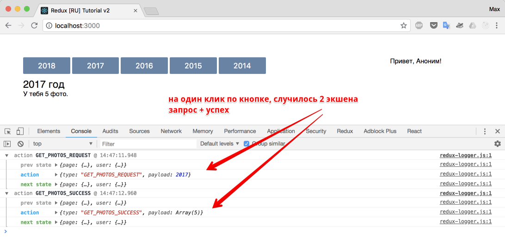

# Асинхронные actions

Давайте представим синхронное действие:

- Пользователь кликнул на кнопку
- dispatch action `{type: ТИП_ДЕЙСТВИЯ, payload: доп.данные}`
- интерфейс обновился

Давайте представим асинхронное действие:

- Пользователь кликнул на кнопку
- dispatch action `{type: ТИП_ДЕЙСТВИЯ_ЗАПРОС}`
- запрос выполнился успешно
  - dispatch action `{type: ТИП_ДЕЙСТВИЯ_УСПЕШНО, payload: доп.данные}`
- запрос выполнился неудачно
  - dispatch action `{type: ТИП_ДЕЙСТВИЯ_НЕУДАЧНО, error: true, payload: доп.данные ошибки}`

Благодаря такой схеме, в reducer'e мы сможем реализовать подобное:

```
switch(тип_действия)
  case ТИП_ДЕЙСТВИЯ_ЗАПРОС:
    покажи preloader
  case ТИП_ДЕЙСТВИЯ_УСПЕШНО:
    скрой preloader, покажи данные
  case ТИП_ДЕЙСТВИЯ_НЕУДАЧНО:
    скрой preloader, покажи ошибку
```

Как нам известно, действие - это простой объект, который возвращается функцией его создающей (action creator).

Убедимся в этом:

_src/actions/PageActions.js_

```js
export const SET_YEAR = 'SET_YEAR';

export function setYear(year) {
  return {
    type: SET_YEAR,
    payload: year,
  };
}
```

Было бы неплохо иметь возможность возвращать не простой объект, а функцию, внутри которой иметь доступ к методу `dispatch`, чтобы можно было диспатчить события в момент, когда они совершились. Псевдокод, мог бы выглядеть так:

```js
export function getPhotos(year) {
  return (dispatch) => {
    dispatch({
      type: GET_PHOTOS_REQUEST,
    });

    $.ajax(url)
      .success(
        dispatch({
          type: GET_PHOTOS_SUCCESS,
          payload: response.photos,
        })
      )
      .error(
        dispatch({
          type: GET_PHOTOS_FAILURE,
          payload: response.error,
          error: true,
        })
      );
  };
}
```

Но вот незадача, actions - это простой объект, и если action creator возвращает не простой объект, а функцию, то это как-то... Подождите! Ведь это именно то, что нам нужно: Если action creator возвращает не простой объект, а функцию - выполни ее, иначе если это простой объект ... тадам, передай дальше. Более того, мы знаем, что в цепочке middleware у нас как раз есть доступный метод `dispatch`! И еще бонусом `getState`.

Отлично, мы только что поняли, что нам нужен еще один усилитель. Такой усилитель уже написан, причем код его невероятно прост, я даже приведу его здесь:

усилитель: redux-thunk

```js
function createThunkMiddleware(extraArgument) {
  return ({ dispatch, getState }) => (next) => (action) => {
    if (typeof action === 'function') {
      return action(dispatch, getState, extraArgument);
    }

    return next(action);
  };
}

const thunk = createThunkMiddleware();
thunk.withExtraArgument = createThunkMiddleware;

export default thunk;
```

Нам остается лишь добавить зависимость в наш проект.

```
npm install redux-thunk --save
```

И добавить redux-thunk в цепочку усилителей перед логгером, так как логгер должен быть последним усилителем в цепочке.

```js
import { createStore, applyMiddleware } from 'redux';
import { rootReducer } from '../reducers';
import logger from 'redux-logger';
import thunk from 'redux-thunk';

export const store = createStore(
  rootReducer,
  applyMiddleware(thunk, logger)
);
```

Для практики, предлагаю написать следующее:

- по клику на кнопку с номером года
  - меняется год в заголовке
  - ниже (где должны быть фото), появляется текст "Загрузка..."
- после удачной загрузки
  - убрать текст "Загрузка..."
  - отобразить строку "У тебя ХХ фото" (зависит, от длины массива, переданного в `action.payload`)

вместо реального метода загрузки, будем использовать `setTimeout`, который является удобным для тренировок исполнения асинхронных запросов.

Вы можете попробовать выполнить это задание сами, а потом сравнить его с решением ниже.

Для отображения / скрытия фразы "Загрузка...", используйте в reducer'е еще одно свойство у состояния. Например, `isFetching`:

```js
const initialState = {
  year: 2016,
  photos: [],
  isFetching: false,
};
```

Решение ниже.

Изменим action creator: `src/actions/PageActions.js`

```js
export const GET_PHOTOS_REQUEST = 'GET_PHOTOS_REQUEST';
export const GET_PHOTOS_SUCCESS = 'GET_PHOTOS_SUCCESS';
export function getPhotos(year) {
  return (dispatch) => {
    // экшен с типом REQUEST (запрос начался)
    // диспатчится сразу, как будто-бы перед реальным запросом
    dispatch({
      type: GET_PHOTOS_REQUEST,
      payload: year,
    });

    // а экшен внутри setTimeout
    // диспатчится через секунду
    // как будто-бы в это время
    // наши данные загружались из сети
    setTimeout(() => {
      dispatch({
        type: GET_PHOTOS_SUCCESS,
        payload: [1, 2, 3, 4, 5],
      });
    }, 1000);
  };
}
```

Изменим reducer: `src/reducers/page.js`

```js
import {
  GET_PHOTOS_REQUEST,
  GET_PHOTOS_SUCCESS,
} from '../actions/PageActions';

const initialState = {
  year: 2018,
  photos: [],
  isFetching: false, // изначально статус загрузки - ложь
  // так как он станет true, когда запрос начнет выполнение
};

export function pageReducer(state = initialState, action) {
  switch (action.type) {
    case GET_PHOTOS_REQUEST:
      return {
        ...state,
        year: action.payload,
        isFetching: true,
      };

    case GET_PHOTOS_SUCCESS:
      return {
        ...state,
        photos: action.payload,
        isFetching: false,
      };

    default:
      return state;
  }
}
```

У нас готова логика для обновления состояния (и интерфейса, разумеется). Осталось поправить отображение.

Так как мы переписали и переименовали функцию (`setYear` -> `getPhotos`):

_src/containers/App.js_

```js
import React, { Component } from 'react';
import { connect } from 'react-redux';
import { User } from '../components/User';
import { Page } from '../components/Page';
import { getPhotos } from '../actions/PageActions';

class App extends Component {
  render() {
    const { user, page, getPhotosAction } = this.props;
    return (
      <div className="app">
        <Page
          photos={page.photos}
          year={page.year}
          isFetching={page.isFetching}
          getPhotos={getPhotosAction}
        />
        <User name={user.name} />
      </div>
    );
  }
}

const mapStateToProps = (store) => {
  return {
    user: store.user,
    page: store.page,
  };
};

const mapDispatchToProps = (dispatch) => {
  return {
    getPhotosAction: (year) => dispatch(getPhotos(year)),
  };
};

export default connect(
  mapStateToProps,
  mapDispatchToProps
)(App);
```

Обновим соответствующий компонент:

_src/components/Page.js_

```js
import React from 'react';
import PropTypes from 'prop-types';

export class Page extends React.Component {
  onBtnClick = (e) => {
    const year = +e.currentTarget.innerText;
    this.props.getPhotos(year); // setYear -> getPhotos
  };
  render() {
    const { year, photos, isFetching } = this.props; // вытащили isFetching
    return (
      <div className="ib page">
        <p>
          <button className="btn" onClick={this.onBtnClick}>
            2018
          </button>{' '}
          <button className="btn" onClick={this.onBtnClick}>
            2017
          </button>{' '}
          <button className="btn" onClick={this.onBtnClick}>
            2016
          </button>{' '}
          <button className="btn" onClick={this.onBtnClick}>
            2015
          </button>{' '}
          <button className="btn" onClick={this.onBtnClick}>
            2014
          </button>
        </p>
        <h3>{year} год</h3>
        {/_ добавили отрисовку по условию _/}
        {isFetching ? (
          <p>Загрузка...</p>
        ) : (
          <p>У тебя {photos.length} фото.</p>
        )}
      </div>
    );
  }
}

Page.propTypes = {
  year: PropTypes.number.isRequired,
  photos: PropTypes.array.isRequired,
  getPhotos: PropTypes.func.isRequired, // setYear -> getPhotos
  // добавили новое свойство - isFetching, причем в propTypes нет boolean, есть bool
  isFetching: PropTypes.bool.isRequired,
};
```

Когда будете проверять работу в браузере, обратите внимание на логгер. Он все так же работает и информативен.



Пока мы писали код для асинхронного запроса, мы НЕ нарушили главные принципы redux-приложения:

1. Мы всегда возвращали новое состояние (новый объект, смотрите `src/reducers/page.js`)
2. Мы строго следовали однонаправленному потоку данных в приложении: юзер кликнул - возникло действие - редьюсер изменил - компонент отобразил.

Итого: вы можете сами дописать наше приложение, чтобы оно взаимодействовало с VK, так как все что нужно, это добавить реальный асинхронный запрос (точнее парочку - для логина, и для получения фото). Для этого придется почитать документацию по работе с [VK API](https://vk.com/dev/first_guide).

Для тех, кто хочет добить пример поскорее - следующая глава, в которой мы загрузим таки реальные фото из вашего профиля VK.

[Исходный код](https://github.com/maxfarseer/redux-course-ru-v2/tree/chp11-async-action) на данный момент.
