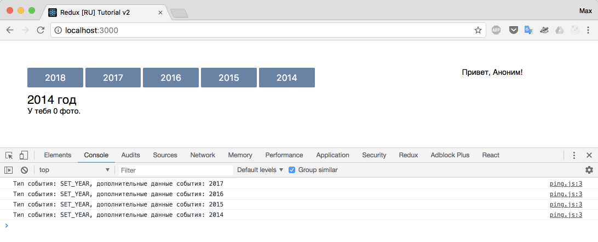
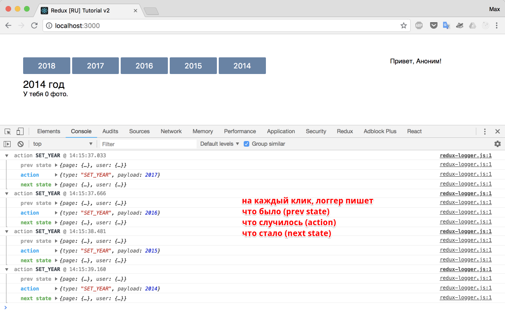

# Middleware (Усилители)

Прежде чем мы сможем создавать асинхронные действия, поговорим об усилителях и напишем, обещанный ранее усилитель - логгер.

Усилители, это middleware. Суть middleware функций, взять входные данные, добавить что-то и передать дальше.

Например: есть конвейер, по которому движется пальто. На конвейере работают Зина и Людмила. Зина пришивает пуговку, Людмила прикладывает бирку. Внезапно, появляется middleware Лена, встает между Зиной и Людмилой и красит пуговку в хипстерский модный цвет. Так как Лена после покраски не уносит пальто с собой, а передает дальше, то Людмила как ни в чем не бывало приделывает бирку и пальто готово. Только теперь оно хипстерское. Усиленное.

Для лучшего понимания, предлагаю написать бесполезный усилитель, выдающий `console.log('ping')`, на каждое действие. При этом, мы будем использовать предложенный redux метод добавления усилитей с помощью `applyMiddleware`.

Обновим файл конфигурации `store`:

_store/configureStore.js_

```js
import { createStore, applyMiddleware } from 'redux'
import { rootReducer } from '../reducers'
import { ping } from './enhancers/ping' // <-- подключаем наш enhancer

export const store = createStore(
  rootReducer,
  applyMiddleware(ping)
) // <-- добавляем его в цепочку middleware'ов
```

Напишем усилитель:

_store/enhancers/ping.js_

```js
/* eslint-disable */
export const ping = (store) => (next) => (action) => {
  console.log('ping')
  return next(action)
}
/* eslint-enable */
```

Боюсь, здесь не обойтись без ES5 версии:

```js
var ping = function ping(store) {
  return function (next) {
    return function (action) {
      console.log('ping')
      return next(action)
    }
  }
}
```

Поехали:

- `eslint-disable` - просто выключает проверку этого блока "линтером".
- `ping` - это функция, которая возвращает функцию. Middleware - это всегда функция, которые обычно возвращают функцию, если только целью middleware не является прервать цепочку вызовов.
- в функциях, у нас становятся доступными аргументы, которые мы можем использовать во благо приложения:
  - `store` - redux-store нашего приложения;
  - `next` - функция-обертка, которая позволяет продолжить выполнение цепочки;
  - `action` - действие, которое было вызвано (как вы помните, вызванные действия - это `store.dispatch`)


Сейчас, при клике на кнопки, у нас в консоли появляется строка `ping`. Давайте изменим ее, написав простейший логгер:

_store/enhancers/ping.js_

```js
/* eslint-disable */
export const ping = (store) => (next) => (action) => {
  console.log(
    `Тип события: ${action.type}, дополнительные данные события: ${action.payload}`
  )
  return next(action)
}
/* eslint-enable */
```

Я использовал новый строковый синтаксис. В прошлом, наш `console.log` выглядел бы так:

```js
console.log(
  'Тип события: ' +
    action.type +
    ', дополнительные данные события: ' +
    action.payload
)
```

Покликайте на кнопки, результат должен быть следующим:



## Redux-logger

Отбросим наш велосипед и поставим популярный [логгер](https://github.com/LogRocket/redux-logger).

```
npm i --save-dev redux-logger
```

Удалите папку `enchancers`, и измените `configureStore`.

_src/store/configureStore.js_

```js
import { createStore, applyMiddleware } from 'redux'
import { rootReducer } from '../reducers'
import logger from 'redux-logger'

export const store = createStore(
  rootReducer,
  applyMiddleware(logger)
)
```

Можете проверить - логгер достаточно информативный и удобен в использовании.



Таким образом, усилители - отличный способ добавить в наш процесс обработки действий некую прослойку с необходимой функциональностью.
Одним из популярнейших усилителей, является [redux-thunk](https://github.com/reduxjs/redux-thunk), который мы как раз и будем использовать для создания асинхронных действий.

[Исходный код](https://github.com/maxfarseer/redux-course-ru-v2/tree/chp10-apply-middleware) на текущий момент.
