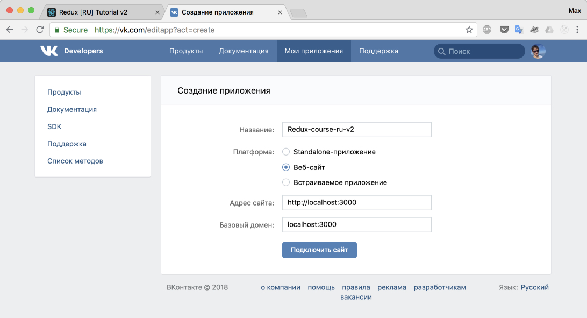
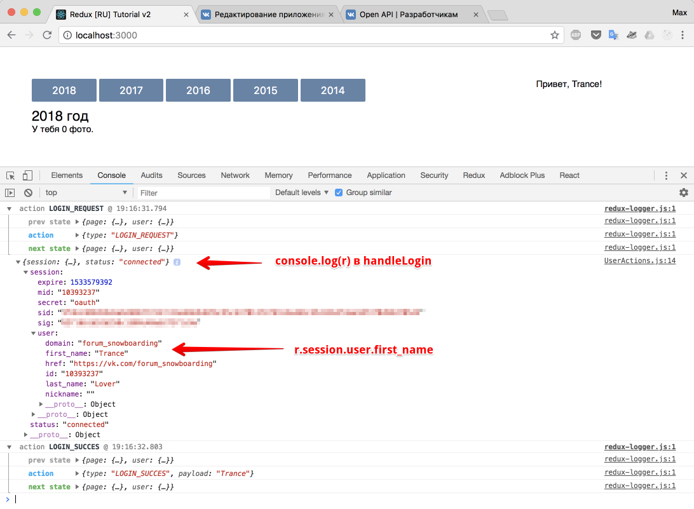
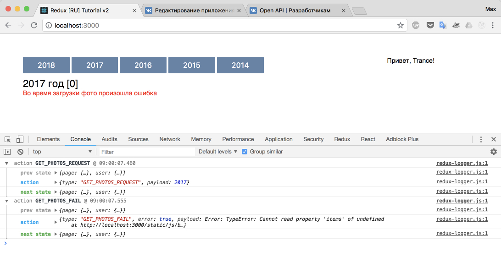

# Взаимодействуем с VK

Чтобы работать с [VK API](https://vk.com/dev/methods) вам необходимо будет создать приложение на сайте vk.com, и указать в настройках URL сервера, с которого вы будете выполнять запросы.

По адресу [https://vk.com/apps?act=manage](https://vk.com/apps?act=manage) создайте новое приложение (веб-сайт) и заполните поля как на скриншоте, если используете локалхост и порт `3000`.



## Интеграция VK API

Необходимо добавить скрипт [openapi](https://vk.com/dev/openapi), а так же вызвать `VK.init`

```html
<!DOCTYPE html>
<html lang="en">
  <head>
    <meta charset="utf-8" />
    <meta
      name="viewport"
      content="width=device-width, initial-scale=1, shrink-to-fit=no"
    />
    <meta name="theme-color" content="#000000" />
    <link
      rel="manifest"
      href="%PUBLIC_URL%/manifest.json"
    />
    <link
      rel="shortcut icon"
      href="%PUBLIC_URL%/favicon.ico"
    />
    <title>Redux [RU] Tutorial v2</title>
  </head>
  <body>
    <noscript>
      You need to enable JavaScript to run this app.
    </noscript>
    <div id="root"></div>
    <script src="https://vk.com/js/api/openapi.js?158"></script>
    <script language="javascript">
      VK.init({
        apiId: XXXXXX, <!-- ваш номер -->
      });
    </script>
  </body>
</html>
```

Номер приложения можно посмотреть здесь:


## Авторизация

Создадим действия для `User`.

_src/actions/UserActions.js_

```js
export const LOGIN_REQUEST = 'LOGIN_REQUEST';
export const LOGIN_SUCCESS = 'LOGIN_SUCCESS';
export const LOGIN_FAIL = 'LOGIN_FAIL';

export function handleLogin() {
  return function (dispatch) {
    dispatch({
      type: LOGIN_REQUEST,
    });

    //eslint-disable-next-line no-undef
    VK.Auth.login((r) => {
      if (r.session) {
        let username = r.session.user.first_name;

        dispatch({
          type: LOGIN_SUCCESS,
          payload: username,
        });
      } else {
        dispatch({
          type: LOGIN_FAIL,
          error: true,
          payload: new Error('Ошибка авторизации'),
        });
      }
    }, 4); // запрос прав на доступ к photo
  };
}
```

Так как загрузка информации из профиля - действие асинхронное, мы использовали проверенную схему из трех действий:

- `XXX_REQUEST` - диспатчим непосредственно перед стартом реального запроса (для юзера это выглядит, как будто во время запроса)
- `XXX_SUCCESS` + данные - если все прошло успешно добавляем данные
- `ХХХ_FAIL` + ошибка - если что-то пошло не так

Чтобы достать имя пользователя, мы вытащили его из `response(r).session`. Данные нам предоставил VK, так как мы подтвердили "разрешаю доступ" во всплывающем окне.



"Приконнектим" в `<App />` `UserActions`, и добавим новые свойства в компонент `<User />`

_src/containers/App.js_

```js
import React, { Component } from 'react';
import { connect } from 'react-redux';
import { User } from '../components/User';
import { Page } from '../components/Page';
import { getPhotos } from '../actions/PageActions';
import { handleLogin } from '../actions/UserActions';

class App extends Component {
  render() {
    // вытащили handleLoginAction из this.props
    const {
      user,
      page,
      getPhotosAction,
      handleLoginAction,
    } = this.props;
    return (
      <div className="app">
        <Page
          photos={page.photos}
          year={page.year}
          isFetching={page.isFetching}
          getPhotos={getPhotosAction}
        />
        {/* добавили новые props для User */}
        <User
          name={user.name}
          isFetching={user.isFetching}
          error={user.error}
          handleLogin={handleLoginAction}
        />
      </div>
    );
  }
}

const mapStateToProps = (store) => {
  return {
    user: store.user, // вытащили из стора (из редьюсера user все в переменную thid.props.user)
    page: store.page,
  };
};

const mapDispatchToProps = (dispatch) => {
  return {
    getPhotosAction: (year) => dispatch(getPhotos(year)),
    // "приклеили" в this.props.handleLoginAction функцию, которая умеет диспатчить handleLogin
    handleLoginAction: () => dispatch(handleLogin()),
  };
};

export default connect(
  mapStateToProps,
  mapDispatchToProps
)(App);
```

Здесь мы поступили так же, как когда-то для page:

- подписались на кусочек стора (`user`)
- добавили экшен и передали его в `dispatch` в функции `handleLoginAction`
- кусочек стора (`user`) и `handleLoginAction` - стали доступны нам в `this.props`
- в `<User />` передали необходимые свойства

Обновим reducer `user`:

_src/reducers/user.js_

```js
import {
  LOGIN_REQUEST,
  LOGIN_SUCCESS,
  LOGIN_FAIL,
} from '../actions/UserActions';

const initialState = {
  name: '',
  error: '', // добавили для сохранения текста ошибки
  isFetching: false, // добавили для реакции на статус "загружаю" или нет
};

export function userReducer(state = initialState, action) {
  switch (action.type) {
    case LOGIN_REQUEST:
      return { ...state, isFetching: true, error: '' };

    case LOGIN_SUCCESS:
      return {
        ...state,
        isFetching: false,
        name: action.payload,
      };

    case LOGIN_FAIL:
      return {
        ...state,
        isFetching: false,
        error: action.payload.message,
      };

    default:
      return state;
  }
}
```

В редьюсере есть интересные моменты:

- когда мы начали делать запрос (`LOGIN_REQUEST`) мы очищаем `error`. Например, была ошибка, мы стали делать новый запрос - ошибка очистилась;
- если случился `LOGIN_SUCCESS` - мы в name записываем `action.payload` (а как вы помните, там мы передаем в строке имя пользователя) и ставим статус загрузки - `false` (то есть, не загружается, ибо загрузилось);
- если случился `LOGIN_FAIL` - опять же, загружаю? Нет, значит `isFetching` - `false`. Ошибка? Да - запиши в поле `error`.

Прокачаем `<User />`:

_src/components/User.js_

```js
import React from 'react';
import PropTypes from 'prop-types';

export class User extends React.Component {
  renderTemplate = () => {
    const { name, error, isFetching } = this.props;

    if (error) {
      return (
        <p>
          Во время запроса произошла ошибка, обновите
          страницу
        </p>
      );
    }

    if (isFetching) {
      return <p>Загружаю...</p>;
    }

    if (name) {
      return <p>Привет, {name}!</p>;
    } else {
      return (
        <button
          className="btn"
          onClick={this.props.handleLogin}
        >
          Войти
        </button>
      );
    }
  };
  render() {
    return (
      <div className="ib user">{this.renderTemplate()}</div>
    );
  }
}

User.propTypes = {
  name: PropTypes.string.isRequired,
  error: PropTypes.string,
  isFetching: PropTypes.bool.isRequired,
  handleLogin: PropTypes.func.isRequired,
};
```

В коде компонента `<User />` ничего необычного нет. Рендерим шаблончик (в зависимости от `props`).

Сейчас если кликнуть на "войти" - всплывет VK окно с подтверждением прав доступа (первый раз). После подтверждения прав, вместо кнопки войти появляется надпись "Привет, ХХХ". При перезагрузке сайта и повторных нажатиях на "войти" - VK окно мгновенно закрывается, а кнопка вновь изменяется на "Привет, XXX".
Как всегда, доблестный логгер пишет в консоли - что происходит.


## Загрузка фото

Нам нужно практически повторить, все что написано выше, только для блока `Page`.

Поэтому, наконец-то появилась самостоятельная задача. Я крайне рекомендую с ней посидеть, так как это практически конец основного материала. Если у вас что-то не получится - вы поймете что нужно закрепить, что перечитать. Не торопитесь смотреть ответ, попробуйте сделать это сами, таким образом вы получите от этого учебника гораздо больше.

Задача: используя метод `photos.getAll` вытащите свои фотографии из VK за год, выбранный кнопкой. Отсортируйте их в обратном порядке по лайкам, чтобы самая популярная фото оказалась первой.

После скриншотов есть подсказка: функция, которая делает запрос за фото.

Должно выглядеть следующим образом:


Подсказка: функция для загрузки фото

```js
let photosArr = [];
let cached = false;

function makeYearPhotos(photos, selectedYear) {
  let createdYear,
    yearPhotos = [];

  photos.forEach((item) => {
    createdYear = new Date(item.date * 1000).getFullYear();
    if (createdYear === selectedYear) {
      yearPhotos.push(item);
    }
  });

  yearPhotos.sort((a, b) => b.likes.count - a.likes.count);

  return yearPhotos;
}

function getMorePhotos(offset, count, year, dispatch) {
  //eslint-disable-next-line no-undef
  VK.Api.call(
    'photos.getAll',
    {
      extended: 1,
      count: count,
      offset: offset,
      v: '5.80',
    },
    (r) => {
      try {
        photosArr = photosArr.concat(r.response.items);
        if (offset <= r.response.count) {
          offset += 200; // максимальное количество фото которое можно получить за 1 запрос
          getMorePhotos(offset, count, year, dispatch);
        } else {
          let photos = makeYearPhotos(photosArr, year);
          cached = true;
          dispatch({
            type: GET_PHOTOS_SUCCESS,
            payload: photos,
          });
        }
      } catch (e) {
        dispatch({
          type: GET_PHOTOS_FAIL,
          error: true,
          payload: new Error(e),
        });
      }
    }
  );
}
```

Так как я не нашел опцию передачи года, то просто выгрузил все фото, по 200 штук за один запрос. Это несколько избыточно, как и тот факт, что мы вызываем функцию `makeYearPhotos`, вместо того чтобы один раз загрузить все фото и "разместить" их по годам. Я оставил код из первого издания учебника, чтобы не усложнять пример.

Решение:

_src/actions/PageActions.js_

```js
export const GET_PHOTOS_REQUEST = 'GET_PHOTOS_REQUEST';
export const GET_PHOTOS_SUCCESS = 'GET_PHOTOS_SUCCESS';
export const GET_PHOTOS_FAIL = 'GET_PHOTOS_FAIL';

let photosArr = [];
let cached = false;

function makeYearPhotos(photos, selectedYear) {
  let createdYear,
    yearPhotos = [];

  photos.forEach((item) => {
    createdYear = new Date(item.date * 1000).getFullYear();
    if (createdYear === selectedYear) {
      yearPhotos.push(item);
    }
  });

  yearPhotos.sort((a, b) => b.likes.count - a.likes.count);

  return yearPhotos;
}

function getMorePhotos(offset, count, year, dispatch) {
  //eslint-disable-next-line no-undef
  VK.Api.call(
    'photos.getAll',
    {
      extended: 1,
      count: count,
      offset: offset,
      v: '5.80',
    },
    (r) => {
      try {
        photosArr = photosArr.concat(r.response.items);
        if (offset <= r.response.count) {
          offset += 200; // максимальное количество фото которое можно получить за 1 запрос
          getMorePhotos(offset, count, year, dispatch);
        } else {
          let photos = makeYearPhotos(photosArr, year);
          cached = true;
          dispatch({
            type: GET_PHOTOS_SUCCESS,
            payload: photos,
          });
        }
      } catch (e) {
        dispatch({
          type: GET_PHOTOS_FAIL,
          error: true,
          payload: new Error(e),
        });
      }
    }
  );
}

export function getPhotos(year) {
  return (dispatch) => {
    dispatch({
      type: GET_PHOTOS_REQUEST,
      payload: year,
    });

    if (cached) {
      let photos = makeYearPhotos(photosArr, year);
      dispatch({
        type: GET_PHOTOS_SUCCESS,
        payload: photos,
      });
    } else {
      getMorePhotos(0, 200, year, dispatch);
    }
  };
}
```

`makeYearPhotos` и `getMorePhotos` можно вынести в папку `utils`, как вспомогательные функции.

Главное здесь, что мы по прежнему вызываем действия (dispatch actions). Все так, как было в самом начале, просто добавилось немного больше логики для получения фото. Алгоритм получения всех фото (да и необходимость получения всех) - оставляю без комментариев. Мне кажется, это приемлемый способ.

Исправив редьюсер и отрисовку в компоненте, мы закончим начатое.

_src/reducers/page.js_

```js
import {
  GET_PHOTOS_REQUEST,
  GET_PHOTOS_SUCCESS,
  GET_PHOTOS_FAIL,
} from '../actions/PageActions';

const initialState = {
  year: 2018,
  photos: [],
  isFetching: false,
  error: '',
};

export function pageReducer(state = initialState, action) {
  switch (action.type) {
    case GET_PHOTOS_REQUEST:
      return {
        ...state,
        year: action.payload,
        isFetching: true,
        error: '',
      };

    case GET_PHOTOS_SUCCESS:
      return {
        ...state,
        photos: action.payload,
        isFetching: false,
        error: '',
      };

    case GET_PHOTOS_FAIL:
      return {
        ...state,
        error: action.payload.message,
        isFetching: false,
      };

    default:
      return state;
  }
}
```

_src/components/Page.js_

```js
import React from 'react';
import PropTypes from 'prop-types';

export class Page extends React.Component {
  onBtnClick = (e) => {
    const year = +e.currentTarget.innerText;
    this.props.getPhotos(year); // setYear -> getPhotos
  };
  renderTemplate = () => {
    const { photos, isFetching, error } = this.props;

    if (error) {
      return (
        <p className="error">
          Во время загрузки фото произошла ошибка
        </p>
      );
    }

    if (isFetching) {
      return <p>Загрузка...</p>;
    } else {
      return photos.map((
        entry,
        index // [1]
      ) => (
        <div key={index} className="photo">
          <p>
            
          </p>
          <p>{entry.likes.count} ❤</p>
        </div>
      ));
    }
  };

  render() {
    const { year, photos } = this.props;
    return (
      <div className="ib page">
        <p>
          <button className="btn" onClick={this.onBtnClick}>
            2018
          </button>{' '}
          <button className="btn" onClick={this.onBtnClick}>
            2017
          </button>{' '}
          <button className="btn" onClick={this.onBtnClick}>
            2016
          </button>{' '}
          <button className="btn" onClick={this.onBtnClick}>
            2015
          </button>{' '}
          <button className="btn" onClick={this.onBtnClick}>
            2014
          </button>
        </p>
        <h3>
          {year} год [{photos.length}]
        </h3>
        {this.renderTemplate()}
      </div>
    );
  }
}

Page.propTypes = {
  year: PropTypes.number.isRequired,
  photos: PropTypes.array.isRequired,
  getPhotos: PropTypes.func.isRequired,
  error: PropTypes.string,
  isFetching: PropTypes.bool.isRequired,
};
```

Как вы заметили, мы использовали `index` в качестве ключа для наших div'ов. Запустите пример, попробуйте поменять года. Возможно, вы словите баг, когда у элементов с одинаковым индексом изображение меняется с задержкой. Проблема в том, что мы использовали индекс для элементов, которые изменяются (а индекс-то остается прежним! Ключ в итоге не изменяется, итого реакт "путается").

Чтобы этого избежать, сделайте ключ уникальным (например, для этого у нас есть `id` в ответе от VK API):

```js
if (isFetching) {
  return <p>Загрузка...</p>;
} else {
  return photos.map((entry) => (
    <div key={entry.id} className="photo">
      <p>
        
      </p>
      <p>{entry.likes.count} ❤</p>
    </div>
  ));
}
```

Теперь наш ключ (`key = {entry.id}`) уникальный и бага нет.

Мини-задачка на внимательность: если сейчас сгенерировать ошибку, то ничего не отобразиться. Как это исправить?

Чтобы проверить ошибку, сделайте в функции запроса фото, поставьте `count: -1`:

_src/actions/PageActions.js_

```js
function getMorePhotos(offset, count, year, dispatch) {
  //eslint-disable-next-line no-undef
  VK.Api.call(
    'photos.getAll',
    { extended: 1, count: -1, offset: offset, v: '5.80' },
    r => {
```

Проблема:


Решение:

```js
class App extends Component {
  render() {
    const { user, page, getPhotosAction, handleLoginAction } = this.props
    return (
      <div className="app">
        {/* добавили error prop для Page */}
        <Page
          photos={page.photos}
          year={page.year}
          isFetching={page.isFetching}
          error={page.error}
          getPhotos={getPhotosAction}
        />
        ...
}
```



Итого: закрепили работу с асинхронными запросами.

[Исходный код](https://github.com/maxfarseer/redux-course-ru-v2/tree/chp12-vk-integrage) на текущий момент.

P.S. css тоже был слегка подправлен.
