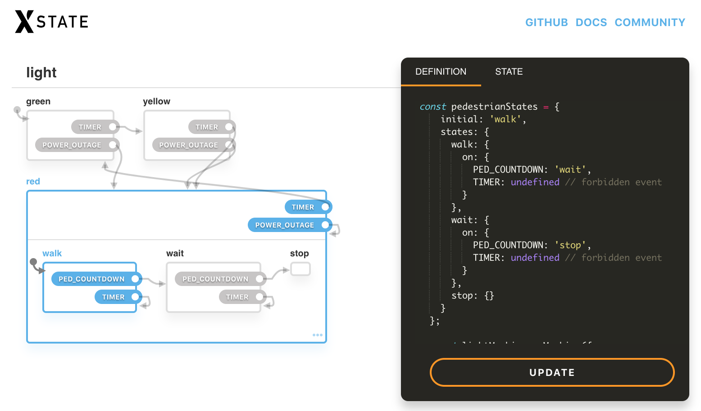
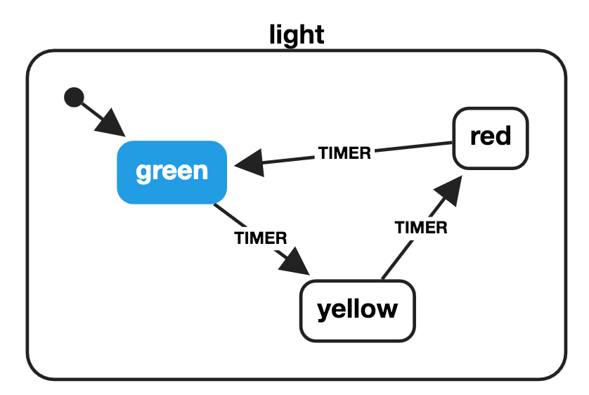
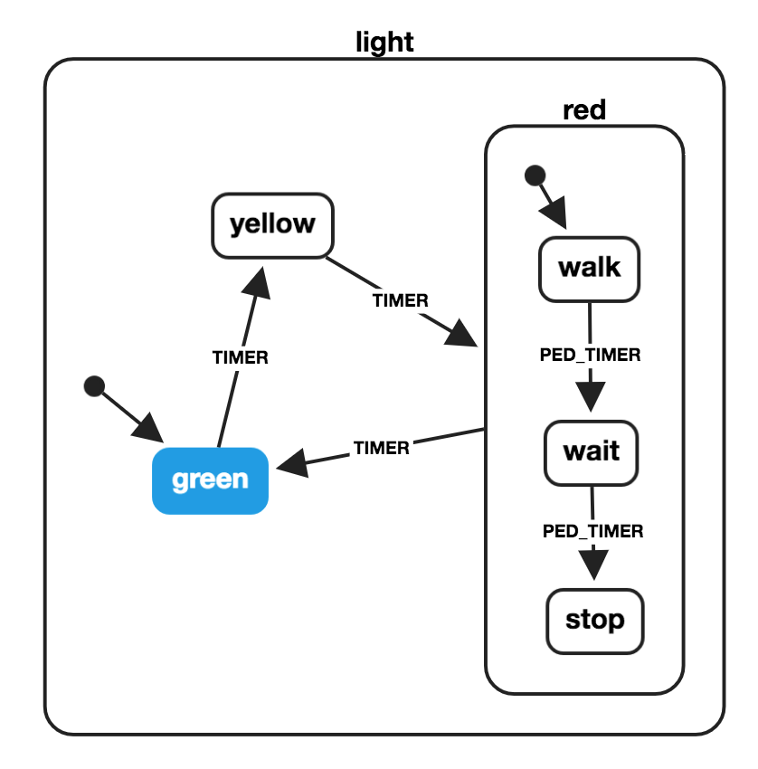
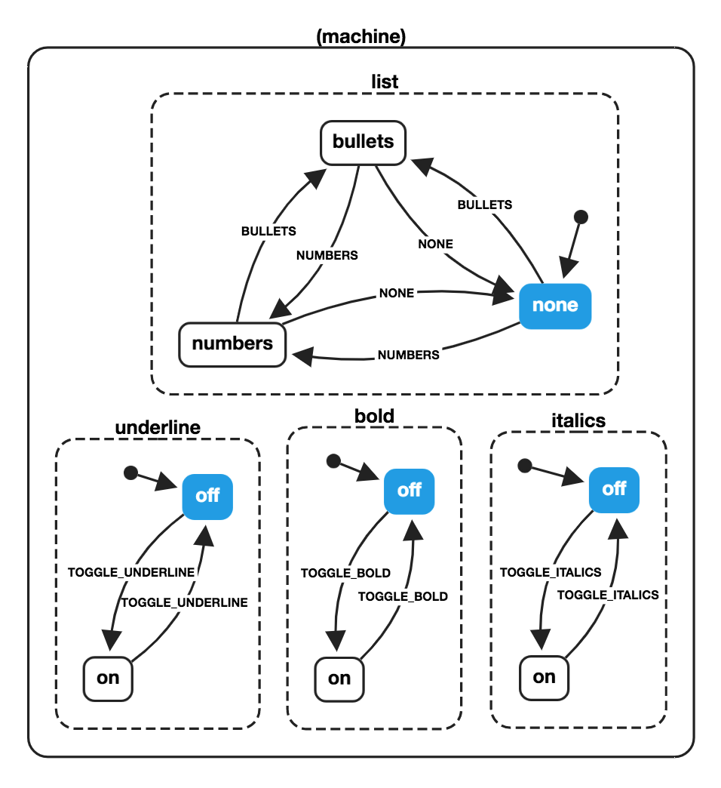
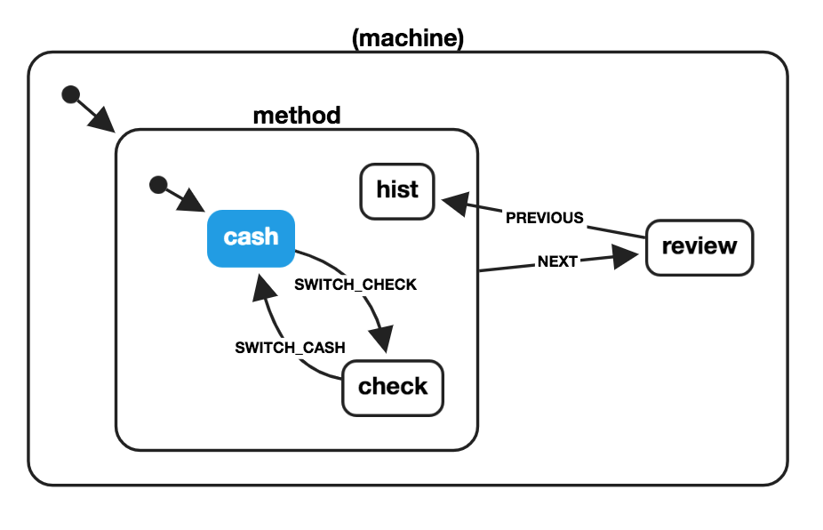

# XState


[Конечные автоматы](https://ru.wikipedia.org/wiki/%D0%9A%D0%BE%D0%BD%D0%B5%D1%87%D0%BD%D1%8B%D0%B9_%D0%B0%D0%B2%D1%82%D0%BE%D0%BC%D0%B0%D1%82) и [диаграммы состояний](https://www.sciencedirect.com/science/article/pii/0167642387900359/pdf) для современного Интернета.

Новичок в конечных автоматах и диаграмах состояний? Прочтите наше [введение](guides/introduction-to-state-machines-and-statecharts.md).

## Пакеты

- 🤖 `xstate` - Базовая библиотека конечных автоматов и диаграмм состояний + интерпретатор
- [🔬 `@xstate/fsm`](https://github.com/statelyai/xstate/tree/main/packages/xstate-fsm) - Минимальная библиотека конечных автоматов
- [📉 `@xstate/graph`](https://github.com/statelyai/xstate/tree/main/packages/xstate-graph) - Утилиты обхода графа для XState
- [⚛️ `@xstate/react`](https://github.com/statelyai/xstate/tree/main/packages/xstate-react) - React xуки и утилиты для использования XState в приложениях React
- [💚 `@xstate/vue`](https://github.com/statelyai/xstate/tree/main/packages/xstate-vue) - Функции композиции и утилиты Vue для использования XState в приложениях Vue
- [🎷 `@xstate/svelte`](https://github.com/statelyai/xstate/tree/main/packages/xstate-svelte) - Утилиты Svelte для использования XState в приложениях Svelte
- [✅ `@xstate/test`](https://github.com/statelyai/xstate/tree/main/packages/xstate-test) - Утилиты Model-Based-Testing (с использованием XState) для тестирования любого программного обеспечения
- [🔍 `@xstate/inspect`](https://github.com/statelyai/xstate/tree/main/packages/xstate-inspect) - Утилиты разработчика (проверки) для XState

## Шаблоны

Начните с создания форка одного из этих шаблонов на CodeSandbox:

- [XState Template](https://codesandbox.io/s/xstate-example-template-m4ckv) - без фреймворков
- [XState + TypeScript Template](https://codesandbox.io/s/xstate-typescript-template-s9kz8) - без фреймворков
- [XState + React Template](https://codesandbox.io/s/xstate-react-template-3t2tg)
- [XState + React + TypeScript Template](https://codesandbox.io/s/xstate-react-typescript-template-wjdvn)
- [XState + Vue Template](https://codesandbox.io/s/xstate-vue-template-composition-api-1n23l)
- [XState + Vue 3 Template](https://codesandbox.io/s/xstate-vue-3-template-vrkk9)
- [XState + Svelte Template](https://codesandbox.io/s/xstate-svelte-template-jflv1)

## Супер быстрый старт

```bash
npm install xstate
```

```js
import { createMachine, interpret } from 'xstate';

// Stateless machine definition
// machine.transition(...) is a pure function used by the interpreter.
const toggleMachine = createMachine({
  id: 'toggle',
  initial: 'inactive',
  states: {
    inactive: {
      on: {
        TOGGLE: { target: 'active' },
      },
    },
    active: {
      on: {
        TOGGLE: { target: 'inactive' },
      },
    },
  },
});

// Machine instance with internal state
const toggleService = interpret(toggleMachine)
  .onTransition((state) => console.log(state.value))
  .start();
// => 'inactive'

toggleService.send({ type: 'TOGGLE' });
// => 'active'

toggleService.send({ type: 'TOGGLE' });
// => 'inactive'
```

## Пример с Promise

[📉 See the visualization on stately.ai/viz](https://stately.ai/viz?gist=bbcb4379b36edea0458f597e5eec2f91)

```js
import { createMachine, interpret, assign } from 'xstate';

const fetchMachine = createMachine({
  id: 'Dog API',
  initial: 'idle',
  context: {
    dog: null,
  },
  states: {
    idle: {
      on: {
        FETCH: { target: 'loading' },
      },
    },
    loading: {
      invoke: {
        id: 'fetchDog',
        src: (context, event) =>
          fetch(
            'https://dog.ceo/api/breeds/image/random'
          ).then((data) => data.json()),
        onDone: {
          target: 'resolved',
          actions: assign({
            dog: (_, event) => event.data,
          }),
        },
        onError: {
          target: 'rejected',
        },
      },
      on: {
        CANCEL: { target: 'idle' },
      },
    },
    rejected: {
      on: {
        FETCH: { target: 'loading' },
      },
    },
    resolved: {
      type: 'final',
    },
  },
});

const dogService = interpret(fetchMachine)
  .onTransition((state) => console.log(state.value))
  .start();

dogService.send({ type: 'FETCH' });
```

## Визуализатор

**[Визуализируйте, моделируйте и делитесь своими диаграммами состояний в XState Viz!](https://stately.ai/viz)**

[](https://stately.ai/viz)

## Почему?

**Диаграммы состояний** - это формализм для моделирования реактивных систем с отслеживанием состояния. Это полезно для декларативного описания _поведения_ вашего приложения, от отдельных компонентов до общей логики приложения.

Смотрите [📽 слайды](http://slides.com/davidkhourshid/finite-state-machines) ([🎥 видео](https://www.youtube.com/watch?v=VU1NKX6Qkxc)) или ознакомьтесь с этими ресурсами, чтобы узнать о важности конечных автоматов и диаграмм состояний в пользовательских интерфейсах:

- [Statecharts - A Visual Formalism for Complex Systems](https://www.sciencedirect.com/science/article/pii/0167642387900359/pdf), автор David Harel
- [The World of Statecharts](https://statecharts.github.io/), автор Erik Mogensen
- [Pure UI](https://rauchg.com/2015/pure-ui), автор Guillermo Rauch
- [Pure UI Control](https://medium.com/@asolove/pure-ui-control-ac8d1be97a8d), автор Adam Solove
- [Spectrum - Statecharts Community](https://spectrum.chat/statecharts) (Для вопросов, связанных с XState, используйте [GitHub Discussions](https://github.com/statelyai/xstate/discussions))

## Конечные автоматы



```js
import { createMachine } from 'xstate';

const lightMachine = createMachine({
  id: 'light',
  initial: 'green',
  states: {
    green: {
      on: {
        TIMER: { target: 'yellow' },
      },
    },
    yellow: {
      on: {
        TIMER: { target: 'red' },
      },
    },
    red: {
      on: {
        TIMER: { target: 'green' },
      },
    },
  },
});

const currentState = 'green';

const nextState = lightMachine.transition(currentState, {
  type: 'TIMER',
}).value;

// => 'yellow'
```

## Иерархические (вложенные) конечные автоматы



```js
import { createMachine } from 'xstate';

const pedestrianStates = {
  initial: 'walk',
  states: {
    walk: {
      on: {
        PED_TIMER: { target: 'wait' },
      },
    },
    wait: {
      on: {
        PED_TIMER: { target: 'stop' },
      },
    },
    stop: {},
  },
};

const lightMachine = createMachine({
  id: 'light',
  initial: 'green',
  states: {
    green: {
      on: {
        TIMER: { target: 'yellow' },
      },
    },
    yellow: {
      on: {
        TIMER: { target: 'red' },
      },
    },
    red: {
      on: {
        TIMER: { target: 'green' },
      },
      ...pedestrianStates,
    },
  },
});

const currentState = 'yellow';

const nextState = lightMachine.transition(currentState, {
  type: 'TIMER',
}).value;
// => {
//   red: 'walk'
// }

lightMachine.transition('red.walk', { type: 'PED_TIMER' })
  .value;
// => {
//   red: 'wait'
// }
```

**объектная нотация для иерархических состояний:**

```js
// ...
const waitState = lightMachine.transition(
  { red: 'walk' },
  { type: 'PED_TIMER' }
).value;

// => { red: 'wait' }

lightMachine.transition(waitState, { type: 'PED_TIMER' })
  .value;

// => { red: 'stop' }

lightMachine.transition({ red: 'stop' }, { type: 'TIMER' })
  .value;

// => 'green'
```

## Параллельные конечные автоматы



```js
import { createMachine } from 'xstate';

const wordMachine = createMachine({
  id: 'word',
  type: 'parallel',
  states: {
    bold: {
      initial: 'off',
      states: {
        on: {
          on: {
            TOGGLE_BOLD: { target: 'off' },
          },
        },
        off: {
          on: {
            TOGGLE_BOLD: { target: 'on' },
          },
        },
      },
    },
    underline: {
      initial: 'off',
      states: {
        on: {
          on: {
            TOGGLE_UNDERLINE: { target: 'off' },
          },
        },
        off: {
          on: {
            TOGGLE_UNDERLINE: { target: 'on' },
          },
        },
      },
    },
    italics: {
      initial: 'off',
      states: {
        on: {
          on: {
            TOGGLE_ITALICS: { target: 'off' },
          },
        },
        off: {
          on: {
            TOGGLE_ITALICS: { target: 'on' },
          },
        },
      },
    },
    list: {
      initial: 'none',
      states: {
        none: {
          on: {
            BULLETS: { target: 'bullets' },
            NUMBERS: { target: 'numbers' },
          },
        },
        bullets: {
          on: {
            NONE: { target: 'none' },
            NUMBERS: { target: 'numbers' },
          },
        },
        numbers: {
          on: {
            BULLETS: { target: 'bullets' },
            NONE: { target: 'none' },
          },
        },
      },
    },
  },
});

const boldState = wordMachine.transition('bold.off', {
  type: 'TOGGLE_BOLD',
}).value;

// {
//   bold: 'on',
//   italics: 'off',
//   underline: 'off',
//   list: 'none'
// }

const nextState = wordMachine.transition(
  {
    bold: 'off',
    italics: 'off',
    underline: 'on',
    list: 'bullets',
  },
  { type: 'TOGGLE_ITALICS' }
).value;

// {
//   bold: 'off',
//   italics: 'on',
//   underline: 'on',
//   list: 'bullets'
// }
```

## История состояний



```js
import { createMachine } from 'xstate';

const paymentMachine = createMachine({
  id: 'payment',
  initial: 'method',
  states: {
    method: {
      initial: 'cash',
      states: {
        cash: {
          on: {
            SWITCH_CHECK: { target: 'check' },
          },
        },
        check: {
          on: {
            SWITCH_CASH: { target: 'cash' },
          },
        },
        hist: { type: 'history' },
      },
      on: {
        NEXT: { target: 'review' },
      },
    },
    review: {
      on: {
        PREVIOUS: { target: 'method.hist' },
      },
    },
  },
});

const checkState = paymentMachine.transition(
  'method.cash',
  {
    type: 'SWITCH_CHECK',
  }
);

// => State {
//   value: { method: 'check' },
//   history: State { ... }
// }

const reviewState = paymentMachine.transition(checkState, {
  type: 'NEXT',
});

// => State {
//   value: 'review',
//   history: State { ... }
// }

const previousState = paymentMachine.transition(
  reviewState,
  {
    type: 'PREVIOUS',
  }
).value;

// => { method: 'check' }
```
