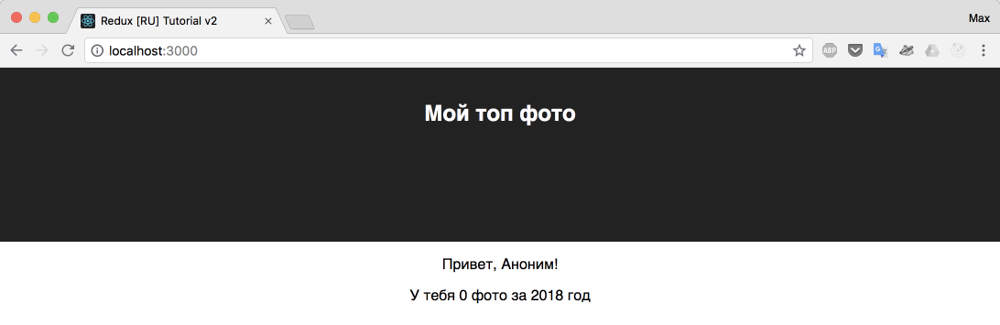

# Комбинирование редьюсеров

Зачем? Когда наше приложение разрастается, хочется еще больше модульности, чтобы каждый кусочек кода отвечал за конкретную часть. Так же и с редьюсерами, мы можем разбить наш главный редьюсер на несколько более мелких, и с помощью `combineReducers` из пакета redux собрать их воедино. Причем, абсолютно никакой магии, `combineReducers` просто возвращает "составной" редьюсер.

Для нашего приложения, можно выделить следующие reducer'ы (согласно схеме из предыдущих глав):

- user
- page

Создадим их:

_src/reducers/user.js_

```js
const initialState = {
  name: 'Аноним',
};

export function userReducer(state = initialState) {
  return state;
}
```

_src/reducers/page.js_

```js
const initialState = {
  year: 2018,
  photos: [],
};

export function pageReducer(state = initialState) {
  return state;
}
```

Обновим точку входа для редьюсеров:

_src/reducers/index.js_

```js
import { combineReducers } from 'redux';
import { pageReducer } from './page';
import { userReducer } from './user';

export const rootReducer = combineReducers({
  page: pageReducer,
  user: userReducer,
});
```

Обновим `configureStore`:

_src/store/configureStore.js_

```js
import { createStore } from 'redux';
import { rootReducer } from '../reducers';

// удалили "начальное состояние = initial state"
// так как теперь наш редьюсер составной,
// и нам нужны initialState каждого редьюсера.
// Это будет сделано автоматически.
export const store = createStore(rootReducer);
```

Посмотрим что у нас теперь "консолится" в компоненте `<App />`, а так же в React dev tools.


Сейчас в браузере у нас нерабочее приложение. В чем же проблема?

Ответ кроется в работе функции `connect` и в функции `mapStateToProps` из нашего файла `App.js`. Сейчас у нас там написано следующее:

```js
const mapStateToProps = (store) => {
  console.log(store);
  return {
    user: store.user,
  };
};
```

Что можно перевести так: возьми полностью "стор" приложения и присоедини его в переменную `user`, дабы она была доступна из компонета `App.js` как `this.props.user`

Здесь, я предложу простую задачку на понимание происходящего. Измените компонент `App.js` и функцию `mapStateToProps` так, чтобы получить следующую картину:



Ответ:

_src/containers/App.js_

```js
class App extends Component {
  render() {
    const { user, page } = this.props;
    return (
      <div className="App">
        <header className="App-header">
          <h1 className="App-title">Мой топ фото</h1>
        </header>
        <p>Привет, {user.name}!</p>
        <p>
          У тебя {page.photos.length} фото за {page.year}{' '}
          год
        </p>
      </div>
    );
  }
}

const mapStateToProps = (store) => {
  console.log(store);
  return {
    user: store.user,
    page: store.page,
  };
};
```

Работа функции `mapStateToProps` многих вводит в ступор. В данной функции, мы хотим отрезать от нашего общего пирога (Store) только те кусочки (редьюсеры), которые нам нужны.

Еще можно применить аналогию: мы приклеиваем в `props` компонента, данные из тех редьюсеров, которые нам требуются.

А если быть более точным, то мы не только получаем в `this.props.XXX` данные, которым нам нужны, но мы еще и подписываемся на изменение этих данных.

После того, как вы знаете о подписке, пора вам раскрыть еще один козырь - когда мы подписываемся только на нужные редьюсеры в компоненте, перерисовка происходит только в случае изменения конкретно этих данных. Если же мы бы подписались просто на весь корневой редьюсер, то не важно в каком бы редьюсере изменились данные - все подписанные на корневой редьюсер компоненты обновились бы.

Опять же, в теории это все абсолютно не "зайдет" не подготовленному читателю. Поэтому на практике мы еще не раз разберем данную информацию.

Итого: сейчас у нас в `user` - попадет все из нашего приложения, что будет связано с пользователем , а в page - попадет все что связано с отображением соответствующего блока (год и массив фото).

[Исходный код](https://github.com/maxfarseer/redux-course-ru-v2/tree/chp5-combine-reducers) на текущий момент.
