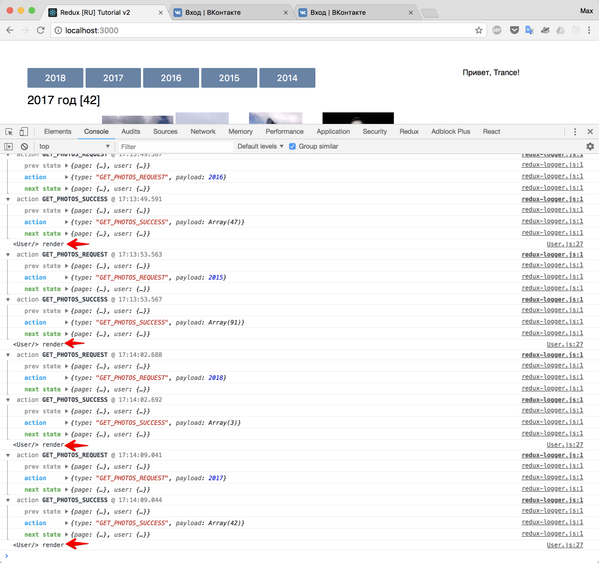

# Оптимизация. Рефакторинг

В нашем решении есть слабые места:

- некоторые названия переменных избыточны (чтобы было понятно, добавлено `Actions` у экшенов, которые мы приклеиваем);
- повторяющийся однотипный код (5 кнопок с номером года в `<Page />`);
- в `action` улетает текст с кнопки, если текст изменится - код сломается. Проблема: большая связанность. Нужно облегчить.
- возможно существует более простой путь "достать" из вк фото за конкретный год (не рассматриваю это как проблему);
- фраза "Привет, ИМЯ" после обновления страницы заменяется кнопкой "войти", то есть не отображает реальной картины (фотографии у нас при этом доступны для загрузки, то есть мы уже авторизованы);
- после авторизации (или после перезагрузки) было бы неплохо сразу загружать фото для 2018 года, так как юзер видит пустой экран и заголовок 2018;

Можно отнести это к "доработкам". Однако у нас есть место, которое является опасным и о котором я лишь вскользь говорил в учебнике, пора исправится.

Приглашаю вас "убить" главную проблему текущего приложения - лишние перерисовки компонента в следующем подразделе.

Остальные проблемы и будущие доработки живут в одноименном разделе.

## Главная проблема приложения

У нас есть 2 компонента `<User />` и `<Page />`. Мы специально сделали для них два редьюсера, чтобы обновлять их независимо! А у нас? А у нас `<User />` каждый раз обновляется при обновлении `<Page />` и наоборот.

Добавьте `console.log` в `render` метод у `<User />`:

_src/components/User.js_

```js
render() {
  console.log('<User/> render')
  return <div className="ib user">{this.renderTemplate()}</div>
}
```



Перерисовка компонента User происходит постоянно. Это не влияет на производительность нашего мини-приложения, однако, мы не готовы с этим мириться.

Представьте дашборд (панель) с большим количеством виджетов, информация в которых обновляется по событиям от бэкэнда. Если каждый виджет будет перерисовывать полностью весь дашборд, то это будет крайне некрасиво (как для юзера, так и для производительности).

Чтобы такого не было, мы должны каждую отдельную сущность приложения класть в отдельный контейнер.

Будем исправлять, для этого:

`<App />` становится тупым компонентом, который рендерит 2 контейнера:

- `<PageContainer />`
- `<UserContainer />`

Данные контейнеры - просто обертки над нашими компонентами, в которых мы "подключаемся (connect) к Redux".

Так же, я сразу заменю название у экшенов внутри `mapDispatchToProps`: уберу оттуда частичку `Action`.

В остальном, мы просто "разносим" то, что было в `<App />` по раздельным контейнерам.

_src/index.js_

```js
import React from 'react';
import ReactDOM from 'react-dom';
import { Provider } from 'react-redux';
import { store } from './store/configureStore';
import App from './components/App'; // изменили путь

import registerServiceWorker from './registerServiceWorker';

import './index.css';

ReactDOM.render(
  <Provider store={store}>
    <App />
  </Provider>,
  document.getElementById('root')
);
registerServiceWorker();
```

_src/components/App.js_

```js
import React, { Component } from 'react';
import UserContainer from '../containers/UserContainer'; // изменили импорт
import PageContainer from '../containers/PageContainer'; // изменили импорт

class App extends Component {
  render() {
    return (
      <div className="app">
        <PageContainer />
        <UserContainer />
      </div>
    );
  }
}

export default App;
```

_src/containers/PageContainer.js_

```js
import React from 'react';
import { connect } from 'react-redux';
import { Page } from '../components/Page';
import { getPhotos } from '../actions/PageActions';

class PageContainer extends React.Component {
  render() {
    const { page, getPhotos } = this.props;
    return (
      <Page
        photos={page.photos}
        year={page.year}
        isFetching={page.isFetching}
        error={page.error}
        getPhotos={getPhotos}
      />
    );
  }
}

const mapStateToProps = (store) => {
  return {
    page: store.page,
  };
};

const mapDispatchToProps = (dispatch) => {
  return {
    getPhotos: (year) => dispatch(getPhotos(year)),
  };
};

export default connect(
  mapStateToProps,
  mapDispatchToProps
)(PageContainer);
```

Как вы могли заметить, все что касалось `<Page />` хранится в отдельном контейнере: подписка на часть стора, экшен, пропсы...

То же самое, делаем для `<UserContainer />`

_src/containers/UserContainer.js_

```js
import React from 'react';
import { connect } from 'react-redux';
import { User } from '../components/User';
import { handleLogin } from '../actions/UserActions';

class UserContainer extends React.Component {
  render() {
    const { user, handleLogin } = this.props;
    return (
      <User
        name={user.name}
        error={user.error}
        isFetching={user.isFetching}
        handleLogin={handleLogin}
      />
    );
  }
}

const mapStateToProps = (store) => {
  return {
    user: store.user,
  };
};

const mapDispatchToProps = (dispatch) => {
  return {
    handleLogin: () => dispatch(handleLogin()),
  };
};

export default connect(
  mapStateToProps,
  mapDispatchToProps
)(UserContainer);
```

Теперь внимание: в компоненте `App` есть два "независимых компонента". Сейчас при изменении данных в редьюсере для `Page` - `User` перерисовываться не будет. `App` тоже, само собой. `App` у нас вообще не будет перерисовываться более при таком раскладе.

Снова покликаем по кнопкам (`console.log` в `<User />` остался):


Еще раз заострю внимание: мы не просто сделали хорошо, мы сделали супер-хорошо! Render - обычно самая дорогая операция. Вызывать "перерисовку" каждого "кусочка" приложения нужно осознанно. Всегда проверяйте (например, так же банально с помощью `console.log`) сколько раз у вас что рендерится, и нет ли чего лишнего.

Давайте заодно здесь быстренько исправим отрисовку кнопок в `<Page />`

_src/components/Page.js_

```js
export class Page extends React.Component {
  onBtnClick = e => {
    ...
  }
  renderButtons = () => {
    const years = [2018, 2017, 2016, 2015, 2014]

    return years.map((item, index) => { // [1]
      return (
        <button key={index} className="btn" onClick={this.onBtnClick}>
          {item}
        </button>
      )
    })
  }
  renderTemplate = () => {

  }

  render() {
    const { year, photos } = this.props
    return (
      <div className="ib page">
        <p>{this.renderButtons()}</p>
        <h3>
          {year} год [{photos.length}]
        </h3>
        {this.renderTemplate()}
      </div>
    )
  }
}
```

(Добавьте по вкусу щепотку `margin` для `.btn`)

Использовать в данной ситуации `index` для `key` плохо?. В данном случае - не плохо. Напоминаю, что индекс в качестве ключа плохо использовать, когда у вас элементы меняются местами. Справедливости ради, здесь в качестве индекса можно было бы использовать "год", так как главное в индексе - это уникальность.

Итого: мы научились бережно относится к перерисовкам, а так же закрепили на практике вопрос зачем разбивать редьюсер на маленькие редьюсеры.

[Исходный код](https://github.com/maxfarseer/redux-course-ru-v2/tree/chp13-optimize-re-renders).
