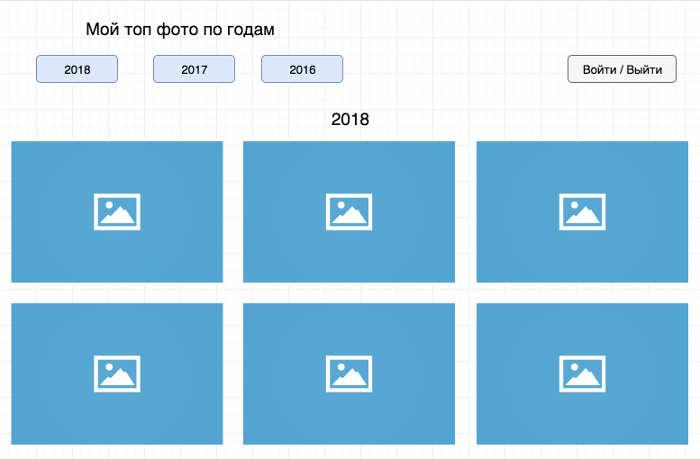

# Основы Redux (теория)

Курс рассчитан на создание приложения по шагам, а это значит максимум практики и минимум теории. Этот самый минимум, перед вами.

Давайте еще раз взглянем на схему нашего приложения:



В шапке слева заголовок и три кнопки выбора года. Ниже - фото соответствующего года, отсортированное по количеству лайков.

В шапке справа - ссылка войти/выйти.

Представим, как должны выглядеть данные для такой страницы:

```js
app: {
    page: {
        year: 2016,
        photos: [photo, photo, photo...]
    },
    user: {
        name: 'Имя',
        ...
    }
}
```

Поздравляю вас, мы только что описали как должно выглядеть состояние (`state`) нашего приложения.

За содержание всего состояния нашего приложения, отвечает объект `Store`. Как уже не раз упоминалось - это обычный объект `{}`. Важно, что в отличии от Flux, в Redux только один объект `Store`.

Не хочется оставлять вас надолго без практики, поэтому процесс создания `store` и немного подробностей про него я аккуратно вплету в следующие главы, а пока достаточно того, что: `store`, "объединяет" редьюсер(ы) (`reducer`) и действия (`actions`), а так же имеет несколько чрезвычайно полезных методов, например:

- `getState()` - позволяет получить состояние приложения;
- `dispatch(action)` - позволяет обновлять состояния, путем вызова ("диспатча") действия;
- `subcribe(listener)` - регистрирует слушателей;

## Actions

Actions описывают действия.

Actions - это объект. Обязательное поле - `type`. Так же, если вы хотите следовать соглашению, все данные, которые передаются вместе с действием, кладите внутрь свойства `payload`. Таким образом, для нашего приложения, мы можем составить, например такую пару действий (`actions`):

```js
{
type: 'ЗАГРУЗИ*ФОТО',
payload: 2018 //год
}
```

```js
{
type: 'ФОТО*ЗАГРУЖЕНЫ_УСПЕШНО',
payload: [массив фото]
}
```

Чтобы вызвать `actions`, мы должны написать функцию, которая в рамках Flux/Redux называется - `ActionsCreator` (создатель действия), но перед этим стоит принять во внимание, что обычно тип действия, описывают как константу.

Например, константы нашего проекта:

```js
const GET_PHOTO_REQUEST = 'GET_PHOTO_REQUEST';
const GET_PHOTO_SUCCESS = 'GET_PHOTO_SUCCESS';
```

Не все любят данный подход с константами, но он был родоначальником, плюс его легко объяснить. К тому же, я до сих пор сторонник этого подхода.

Вернемся к `ActionsCreator`, один из наших "создателей действий", выглядел бы так:

```js
function getPhotos(year) {
  return {
    type: GET_PHOTOS,
    payload: year,
  };
}

// я буду использовать синтаксис function внутри actions, так как не вижу смысла
// в изменении его на такую запись:

const getPhotos = (year) => ({
  type: GET_PHOTOS,
  payload: year,
});
```

Итого: actions сообщает нашему приложению - "Эй, что-то произошло! И я знаю, что именно!"

## Reducer

> "Actions описывает факт, что что-то произошло, но не указывает, как состояние приложения должно измениться в ответ, это работа для Reducer'а" - (офф. документация)

Наше приложение не нуждается в нескольких редьюсерах, но крайне необходимо познакомить читателя с reducer composition, так как это фундаментальный шаблон построения redux приложений: мы разбиваем наше глобальное состояние на кусочки, за каждый кусочек отвечает свой `reducer`. Кусочки объединяются в Корневом Редьюсере (`rootReducer`).

Для того, чтобы научиться комбинировать редьюсеры, мы добавим в приложение reducer - user, который просто будет отображать имя, если пользователь залогинился. Ниже на схеме - сноска 1.

Схематично, наше приложение можно представить так:


Так как у нас есть reducer'ы `page` и `user`, можно представить следующий диалог:

```
pageActions: Пришло 123 фото
Reducer (page): Ок, нужно положить эти 123 фото в page.photos
```

А на js выглядело бы так:

```js
function page(state = initialState, action) {
  switch (action.type) {
    case GET_PHOTO_SUCCESS:
      return Object.assign({}, state, {
        photos: action.payload,
      });
    default:
      return state;
  }
}
```

Обратите внимание, мы **не мутировали** наш `state`, мы создали новый `state`. Это важно. Крайне важно. В редьюсере, мы всегда должны возвращать новый объект, а не измененный предыдущий.

На практике, я буду использовать object spread syntax, поэтому предыдущую функцию с `Object.assign` можно переписать следующим образом:

```js
function page(state = initialState, action) {
  switch (action.type) {
    case GET_PHOTO_SUCCESS:
      return { ...state, photos: action.payload }; //Object spread syntax
    default:
      return state;
  }
}
```

Объект, который мы возвращаем в редьюсере, далее с помощью функции `connect`, превратится в свойства для компонентов. Таким образом, если продолжить пример с фото, то можно написать такой псевдо-код:

```js
<Page photos={reducerPage.photos} />
```

Благодаря этому, внутри компонента `<Page />`, мы сможем получить фото, как `this.props.photos`

Итого: Redux - однонаправленный поток данных в вашем приложении. Случилось действие от юзера - полетел экшен, экшен был пойман редьюсером - изменились пропсы у React-компонента -> компонент перерисовался.
